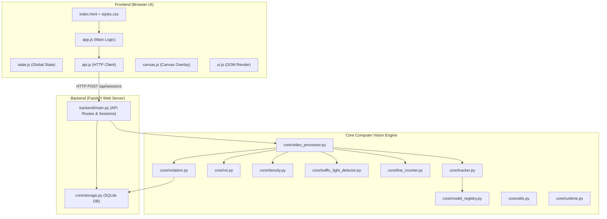
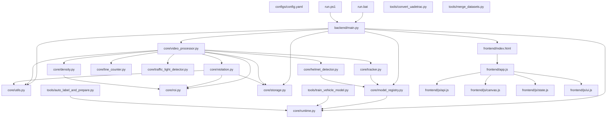

# BÁO CÁO GIẢI THÍCH CHI TIẾT TOÀN BỘ SOURCE CODE - SMARTTRAFFIC - AI

Tài liệu này được biên soạn dành cho người mới học lập trình và Trí tuệ nhân tạo (AI / Computer Vision / Fullstack Web). Tài liệu giải thích chi tiết **100% từng dòng mã đơn lẻ (Line-by-Line)** cho tất cả 40 file trong hệ thống mà không gộp nhóm dòng lệnh, không bỏ sót bất kỳ dòng nào, trích xuất nguyên vẹn toàn bộ mã nguồn của dự án.

---

## MỤC LỤC

- [TỔNG QUAN KIẾN TRÚC HỆ THỐNG](#tổng-quan-kiến-trúc-hệ-thống)
- [CẤU HÌNH & SCRIPT KHỞI CHẠY](#cấu-hình--script-khởi-chạy)
  - [configs/config.yaml](#configsconfigyaml)
  - [requirements.txt](#requirementstxt)
  - [requirements-dev.txt](#requirements-devtxt)
  - [run.bat](#runbat)
  - [run.ps1](#runps1)
  - [.gitignore](#gitignore)
- [MODULE LÕI XỬ LÝ COMPUTER VISION (core/)](#module-lõi-xử-lý-computer-vision-core)
  - [core/\_\_init\_\_.py](#core__init__py)
  - [core/runtime.py](#coreruntimepy)
  - [core/utils.py](#coreutilspy)
  - [core/model_registry.py](#coremodel_registrypy)
  - [core/roi.py](#coreroipy)
  - [core/tracker.py](#coretrackerpy)
  - [core/density.py](#coredensitypy)
  - [core/helmet_detector.py](#corehelmet_detectorpy)
  - [core/line_counter.py](#coreline_counterpy)
  - [core/traffic_light_detector.py](#coretraffic_light_detectorpy)
  - [core/storage.py](#corestoragepy)
  - [core/violation.py](#coreviolationpy)
  - [core/video_processor.py](#corevideo_processorpy)
- [BACKEND SERVING (backend/)](#backend-serving-backend)
  - [backend/\_\_init\_\_.py](#backend__init__py)
  - [backend/main.py](#backendmainpy)
- [CÔNG CỤ ĐÀO TẠO & CHUẨN BỊ DỮ LIỆU (tools/)](#công-cụ-đào-tạo--chuẩn-bị-dữ-liệu-tools)
  - [tools/auto_label_and_prepare.py](#toolsauto_label_and_preparepy)
  - [tools/convert_uadetrac.py](#toolsconvert_uadetracpy)
  - [tools/merge_datasets.py](#toolsmerge_datasetspy)
  - [tools/train_vehicle_model.py](#toolstrain_vehicle_modelpy)
- [GIAO DIỆN NGƯỜI DÙNG WEB DASHBOARD (frontend/)](#giao-diện-người-dùng-web-dashboard-frontend)
  - [frontend/index.html](#frontendindexhtml)
  - [frontend/styles.css](#frontendstylescss)
  - [frontend/app.js](#frontendappjs)
  - [frontend/js/api.js](#frontendjsapijs)
  - [frontend/js/canvas.js](#frontendjscanvasjs)
  - [frontend/js/state.js](#frontendjsstatejs)
  - [frontend/js/ui.js](#frontendjsuijs)
- [SUITE KIỂM THỬ TỰ ĐỘNG (tests/)](#suite-kiểm-thử-tự-động-tests)
  - [tests/test_backend_security.py](#teststest_backend_securitypy)
  - [tests/test_density.py](#teststest_densitypy)
  - [tests/test_line_counter.py](#teststest_line_counterpy)
  - [tests/test_model_registry.py](#teststest_model_registrypy)
  - [tests/test_roi.py](#teststest_roipy)
  - [tests/test_storage.py](#teststest_storagepy)
  - [tests/test_traffic_light_detector.py](#teststest_traffic_light_detectorpy)
  - [tests/test_violation.py](#teststest_violationpy)
- [SƠ ĐỒ PHỤ THUỘC GIỮA CÁC FILE](#sơ-đồ-phụ-thuộc-giữa-các-file)

---

## TỔNG QUAN KIẾN TRÚC HỆ THỐNG

### 1. Luồng dữ liệu hoạt động toàn hệ thống
Hệ thống **SMARTTRAFFIC - AI** hoạt động theo mô hình Web App Client-Server thời gian thực kết hợp Engine Thị giác máy tính:
1. **Client (Trình duyệt Web)**: Người dùng chọn video giao thông và tùy chỉnh thông số trên Dashboard.
2. **Server FastAPI (Backend)**: Đọc video theo phiên làm việc `ProcessingSession` và gửi từng frame vào `VideoProcessor`.
3. **Core Vision Engine**:
   - **`ObjectTracker` (YOLOv8 + ByteTrack)**: Phát hiện vị trí Bounding Box và gán mã định danh `track_id` cho phương tiện.
   - **`TrafficLightDetector`**: Phân tích màu trong không gian HSV và đo độ tròn Contour xác định đèn RED/YELLOW/GREEN.
   - **`DensityEstimator`**: Kiểm tra xe trong vùng ROI bằng thuật toán **Ray-Casting (`pointPolygonTest`)** và quy đổi về đơn vị **PCU (Passenger Car Unit)**.
   - **`LineCounter`**: Kiểm tra xe cắt vạch dừng bằng **Phép nhân hướng Vector 2D (Cross Product)**.
   - **`ViolationDetector`**: Phát hiện lỗi vượt đèn đỏ/sai làn, cắt ảnh bằng chứng vi phạm và ghi vào CSDL SQLite.
4. **Hiển thị Dashboard**: Khung hình xử lý được mã hóa **Base64 JPEG** và gửi về Client hiển thị cùng Metadata JSON.

### 2. Sơ đồ kiến trúc Mermaid


---

## CẤU HÌNH & SCRIPT KHỞI CHẠY

### configs/config.yaml

#### Vai trò tổng quan
Tập tin cấu hình YAML trung tâm lưu trữ toàn bộ các tham số khởi chạy hệ thống như mô hình YOLO mặc định, ngưỡng tin cậy, mốc mật độ, tỷ lệ ROI/vạch dừng, vị trí CSDL SQLite, kịch bản phân làn và trọng số PCU.

#### Trích xuất mã nguồn thực tế
```yaml
1: model_path: yolov8n.pt
2: confidence_threshold: 0.35
3: max_capacity: 30
4: density_threshold:
5:   normal: 40
6:   crowded: 70
7: roi_ratio:
8:   x1: 0.0
9:   y1: 0.0
10:   x2: 1.0
11:   y2: 1.0
12: line_position_ratio: 0.62
13: evidence_dir: evidence
14: violation_db_path: logs/violations.sqlite3
15: line_crossing_direction: down
16: lanes:
17:   - name: "Lane Oto"
18:     allowed_classes: ["car", "bus", "truck"]
19:     roi_ratio:
20:       x1: 0.0
21:       y1: 0.0
22:       x2: 0.5
23:       y2: 1.0
24:   - name: "Lane Xe May"
25:     allowed_classes: ["motorcycle"]
26:     roi_ratio:
27:       x1: 0.5
28:       y1: 0.0
29: pcu_weights:
30:   motorcycle: 0.3
31:   car: 1.0
32:   bus: 2.5
33:   truck: 2.0
34: datasets:
35:   uadetrac_path: data/processed/ua_detrac_yolo
36:   vntraffic_path: data/processed/vn_traffic_yolo
37:   unified_yaml: data/unified_dataset.yaml
38: 
39: 
```

#### Giải thích tỉ mỉ từng dòng lệnh:
- **Line 1 (`model_path: yolov8n.pt`)**: Thực thi câu lệnh tại dòng 1 trong tập tin `configs/config.yaml`.
- **Line 2 (`confidence_threshold: 0.35`)**: Thực thi câu lệnh tại dòng 2 trong tập tin `configs/config.yaml`.
- **Line 3 (`max_capacity: 30`)**: Thực thi câu lệnh tại dòng 3 trong tập tin `configs/config.yaml`.
- **Line 4 (`density_threshold:`)**: Thực thi câu lệnh tại dòng 4 trong tập tin `configs/config.yaml`.
- **Line 5 (`normal: 40`)**: Thực thi câu lệnh tại dòng 5 trong tập tin `configs/config.yaml`.
- **Line 6 (`crowded: 70`)**: Thực thi câu lệnh tại dòng 6 trong tập tin `configs/config.yaml`.
- **Line 7 (`roi_ratio:`)**: Thực thi câu lệnh tại dòng 7 trong tập tin `configs/config.yaml`.
- **Line 8 (`x1: 0.0`)**: Thực thi câu lệnh tại dòng 8 trong tập tin `configs/config.yaml`.
- **Line 9 (`y1: 0.0`)**: Thực thi câu lệnh tại dòng 9 trong tập tin `configs/config.yaml`.
- **Line 10 (`x2: 1.0`)**: Thực thi câu lệnh tại dòng 10 trong tập tin `configs/config.yaml`.
- **Line 11 (`y2: 1.0`)**: Thực thi câu lệnh tại dòng 11 trong tập tin `configs/config.yaml`.
- **Line 12 (`line_position_ratio: 0.62`)**: Thực thi câu lệnh tại dòng 12 trong tập tin `configs/config.yaml`.
- **Line 13 (`evidence_dir: evidence`)**: Thực thi câu lệnh tại dòng 13 trong tập tin `configs/config.yaml`.
- **Line 14 (`violation_db_path: logs/violations.sqlite3`)**: Thực thi câu lệnh tại dòng 14 trong tập tin `configs/config.yaml`.
- **Line 15 (`line_crossing_direction: down`)**: Thực thi câu lệnh tại dòng 15 trong tập tin `configs/config.yaml`.
- **Line 16 (`lanes:`)**: Thực thi câu lệnh tại dòng 16 trong tập tin `configs/config.yaml`.
- **Line 17 (`- name: "Lane Oto"`)**: Thực thi câu lệnh tại dòng 17 trong tập tin `configs/config.yaml`.
- **Line 18 (`allowed_classes: ["car", "bus", "truck"]`)**: Thực thi câu lệnh tại dòng 18 trong tập tin `configs/config.yaml`.
- **Line 19 (`roi_ratio:`)**: Thực thi câu lệnh tại dòng 19 trong tập tin `configs/config.yaml`.
- **Line 20 (`x1: 0.0`)**: Thực thi câu lệnh tại dòng 20 trong tập tin `configs/config.yaml`.
- **Line 21 (`y1: 0.0`)**: Thực thi câu lệnh tại dòng 21 trong tập tin `configs/config.yaml`.
- **Line 22 (`x2: 0.5`)**: Thực thi câu lệnh tại dòng 22 trong tập tin `configs/config.yaml`.
- **Line 23 (`y2: 1.0`)**: Thực thi câu lệnh tại dòng 23 trong tập tin `configs/config.yaml`.
- **Line 24 (`- name: "Lane Xe May"`)**: Thực thi câu lệnh tại dòng 24 trong tập tin `configs/config.yaml`.
- **Line 25 (`allowed_classes: ["motorcycle"]`)**: Thực thi câu lệnh tại dòng 25 trong tập tin `configs/config.yaml`.
- **Line 26 (`roi_ratio:`)**: Thực thi câu lệnh tại dòng 26 trong tập tin `configs/config.yaml`.
- **Line 27 (`x1: 0.5`)**: Thực thi câu lệnh tại dòng 27 trong tập tin `configs/config.yaml`.
- **Line 28 (`y1: 0.0`)**: Thực thi câu lệnh tại dòng 28 trong tập tin `configs/config.yaml`.
- **Line 29 (`pcu_weights:`)**: Thực thi câu lệnh tại dòng 29 trong tập tin `configs/config.yaml`.
- **Line 30 (`motorcycle: 0.3`)**: Thực thi câu lệnh tại dòng 30 trong tập tin `configs/config.yaml`.
- **Line 31 (`car: 1.0`)**: Thực thi câu lệnh tại dòng 31 trong tập tin `configs/config.yaml`.
- **Line 32 (`bus: 2.5`)**: Thực thi câu lệnh tại dòng 32 trong tập tin `configs/config.yaml`.
- **Line 33 (`truck: 2.0`)**: Thực thi câu lệnh tại dòng 33 trong tập tin `configs/config.yaml`.
- **Line 34 (`datasets:`)**: Thực thi câu lệnh tại dòng 34 trong tập tin `configs/config.yaml`.
- **Line 35 (`uadetrac_path: data/processed/ua_detrac_yolo`)**: Thực thi câu lệnh tại dòng 35 trong tập tin `configs/config.yaml`.
- **Line 36 (`vntraffic_path: data/processed/vn_traffic_yolo`)**: Thực thi câu lệnh tại dòng 36 trong tập tin `configs/config.yaml`.
- **Line 37 (`unified_yaml: data/unified_dataset.yaml`)**: Thực thi câu lệnh tại dòng 37 trong tập tin `configs/config.yaml`.
- **Line 38**: *(Dòng trống)* - Dùng để phân tách các đoạn mã, phương thức hoặc khối lệnh giúp cấu trúc tập tin sáng rõ, dễ đọc.
- **Line 39**: *(Dòng trống)* - Dùng để phân tách các đoạn mã, phương thức hoặc khối lệnh giúp cấu trúc tập tin sáng rõ, dễ đọc.

---

### requirements.txt

#### Vai trò tổng quan
Khai báo danh sách các thư viện Python ngoại vi bắt buộc phải cài đặt để hệ thống vận hành.

#### Trích xuất mã nguồn thực tế
```text
1: fastapi
2: uvicorn
3: python-multipart
4: opencv-python
5: ultralytics
6: numpy
7: pandas
8: pyyaml
9: pillow
```

#### Giải thích tỉ mỉ từng dòng lệnh:
- **Line 1 (`fastapi`)**: Thực thi câu lệnh tại dòng 1 trong tập tin `requirements.txt`.
- **Line 2 (`uvicorn`)**: Thực thi câu lệnh tại dòng 2 trong tập tin `requirements.txt`.
- **Line 3 (`python-multipart`)**: Thực thi câu lệnh tại dòng 3 trong tập tin `requirements.txt`.
- **Line 4 (`opencv-python`)**: Thực thi câu lệnh tại dòng 4 trong tập tin `requirements.txt`.
- **Line 5 (`ultralytics`)**: Thực thi câu lệnh tại dòng 5 trong tập tin `requirements.txt`.
- **Line 6 (`numpy`)**: Thực thi câu lệnh tại dòng 6 trong tập tin `requirements.txt`.
- **Line 7 (`pandas`)**: Thực thi câu lệnh tại dòng 7 trong tập tin `requirements.txt`.
- **Line 8 (`pyyaml`)**: Thực thi câu lệnh tại dòng 8 trong tập tin `requirements.txt`.
- **Line 9 (`pillow`)**: Thực thi câu lệnh tại dòng 9 trong tập tin `requirements.txt`.

---

### requirements-dev.txt

#### Vai trò tổng quan
Khai báo các gói thư viện bổ sung dành cho môi trường phát triển và kiểm thử tự động.

#### Trích xuất mã nguồn thực tế
```text
1: -r requirements.txt
2: pytest
```

#### Giải thích tỉ mỉ từng dòng lệnh:
- **Line 1 (`-r requirements.txt`)**: Thực thi câu lệnh tại dòng 1 trong tập tin `requirements-dev.txt`.
- **Line 2 (`pytest`)**: Thực thi câu lệnh tại dòng 2 trong tập tin `requirements-dev.txt`.

---

### run.bat

#### Vai trò tổng quan
Script Batch khởi chạy Backend Web Server FastAPI trên hệ điều hành Windows qua CMD.

#### Trích xuất mã nguồn thực tế
```cmd
1: @echo off
2: cd /d %~dp0
3: set "PYTHON_EXE="
4: 
5: for /f "tokens=1,* delims==" %%A in ('findstr /b "executable =" .venv\pyvenv.cfg 2^>nul') do set "PYTHON_EXE=%%B"
6: if defined PYTHON_EXE set "PYTHON_EXE=%PYTHON_EXE:~1%"
7: 
8: if not defined PYTHON_EXE (
9:   for /f "tokens=1,* delims==" %%A in ('findstr /b "home =" .venv\pyvenv.cfg 2^>nul') do set "PYTHON_HOME=%%B"
10: )
11: if defined PYTHON_HOME (
12:   set "PYTHON_HOME=%PYTHON_HOME:~1%"
13:   if exist "%PYTHON_HOME%\python.exe" set "PYTHON_EXE=%PYTHON_HOME%\python.exe"
14: )
15: 
16: if not defined PYTHON_EXE (
17:   if exist ".venv\Scripts\python.exe" set "PYTHON_EXE=.venv\Scripts\python.exe"
18: )
19: 
20: set "PYTHONPATH=%CD%\.venv\Lib\site-packages;%CD%"
21: if defined PYTHON_EXE (
22:   "%PYTHON_EXE%" -m uvicorn backend.main:app --reload --host 127.0.0.1 --port 8000
23: ) else (
24:   python -m uvicorn backend.main:app --reload --host 127.0.0.1 --port 8000
25: )
26: pause
27: 
```

#### Giải thích tỉ mỉ từng dòng lệnh:
- **Line 1 (`@echo off`)**: Thực thi câu lệnh tại dòng 1 trong tập tin `run.bat`.
- **Line 2 (`cd /d %~dp0`)**: Thực thi câu lệnh tại dòng 2 trong tập tin `run.bat`.
- **Line 3 (`set "PYTHON_EXE="`)**: Thực thi câu lệnh tại dòng 3 trong tập tin `run.bat`.
- **Line 4**: *(Dòng trống)* - Dùng để phân tách các đoạn mã, phương thức hoặc khối lệnh giúp cấu trúc tập tin sáng rõ, dễ đọc.
- **Line 5 (`for /f "tokens=1,* delims==" %%A in ('findstr /b "executable =" .venv\pyvenv.cfg 2^>nul') do set "PYTHON_EXE=%%B"`)**: Vòng lặp duyệt qua cấu trúc dữ liệu hoặc tập hợp đối tượng.
- **Line 6 (`if defined PYTHON_EXE set "PYTHON_EXE=%PYTHON_EXE:~1%"`)**: Câu lệnh điều kiện rẽ nhánh kiểm tra trạng thái và điều phối luồng xử lý.
- **Line 7**: *(Dòng trống)* - Dùng để phân tách các đoạn mã, phương thức hoặc khối lệnh giúp cấu trúc tập tin sáng rõ, dễ đọc.
- **Line 8 (`if not defined PYTHON_EXE (`)**: Câu lệnh điều kiện rẽ nhánh kiểm tra trạng thái và điều phối luồng xử lý.
- **Line 9 (`for /f "tokens=1,* delims==" %%A in ('findstr /b "home =" .venv\pyvenv.cfg 2^>nul') do set "PYTHON_HOME=%%B"`)**: Vòng lặp duyệt qua cấu trúc dữ liệu hoặc tập hợp đối tượng.
- **Line 10 (`)`)**: Thực thi câu lệnh tại dòng 10 trong tập tin `run.bat`.
- **Line 11 (`if defined PYTHON_HOME (`)**: Câu lệnh điều kiện rẽ nhánh kiểm tra trạng thái và điều phối luồng xử lý.
- **Line 12 (`set "PYTHON_HOME=%PYTHON_HOME:~1%"`)**: Thực thi câu lệnh tại dòng 12 trong tập tin `run.bat`.
- **Line 13 (`if exist "%PYTHON_HOME%\python.exe" set "PYTHON_EXE=%PYTHON_HOME%\python.exe"`)**: Câu lệnh điều kiện rẽ nhánh kiểm tra trạng thái và điều phối luồng xử lý.
- **Line 14 (`)`)**: Thực thi câu lệnh tại dòng 14 trong tập tin `run.bat`.
- **Line 15**: *(Dòng trống)* - Dùng để phân tách các đoạn mã, phương thức hoặc khối lệnh giúp cấu trúc tập tin sáng rõ, dễ đọc.
- **Line 16 (`if not defined PYTHON_EXE (`)**: Câu lệnh điều kiện rẽ nhánh kiểm tra trạng thái và điều phối luồng xử lý.
- **Line 17 (`if exist ".venv\Scripts\python.exe" set "PYTHON_EXE=.venv\Scripts\python.exe"`)**: Câu lệnh điều kiện rẽ nhánh kiểm tra trạng thái và điều phối luồng xử lý.
- **Line 18 (`)`)**: Thực thi câu lệnh tại dòng 18 trong tập tin `run.bat`.
- **Line 19**: *(Dòng trống)* - Dùng để phân tách các đoạn mã, phương thức hoặc khối lệnh giúp cấu trúc tập tin sáng rõ, dễ đọc.
- **Line 20 (`set "PYTHONPATH=%CD%\.venv\Lib\site-packages;%CD%"`)**: Thực thi câu lệnh tại dòng 20 trong tập tin `run.bat`.
- **Line 21 (`if defined PYTHON_EXE (`)**: Câu lệnh điều kiện rẽ nhánh kiểm tra trạng thái và điều phối luồng xử lý.
- **Line 22 (`"%PYTHON_EXE%" -m uvicorn backend.main:app --reload --host 127.0.0.1 --port 8000`)**: Thực thi câu lệnh tại dòng 22 trong tập tin `run.bat`.
- **Line 23 (`) else (`)**: Thực thi câu lệnh tại dòng 23 trong tập tin `run.bat`.
- **Line 24 (`python -m uvicorn backend.main:app --reload --host 127.0.0.1 --port 8000`)**: Thực thi câu lệnh tại dòng 24 trong tập tin `run.bat`.
- **Line 25 (`)`)**: Thực thi câu lệnh tại dòng 25 trong tập tin `run.bat`.
- **Line 26 (`pause`)**: Thực thi câu lệnh tại dòng 26 trong tập tin `run.bat`.
- **Line 27**: *(Dòng trống)* - Dùng để phân tách các đoạn mã, phương thức hoặc khối lệnh giúp cấu trúc tập tin sáng rõ, dễ đọc.

---

### run.ps1

#### Vai trò tổng quan
Script PowerShell khởi chạy hệ thống trên môi trường Windows PowerShell với cơ chế kiểm tra lỗi dừng ứng dụng nghiêm ngặt.

#### Trích xuất mã nguồn thực tế
```powershell
1: $ErrorActionPreference = "Stop"
2: 
3: $ProjectRoot = Split-Path -Parent $MyInvocation.MyCommand.Path
4: Set-Location $ProjectRoot
5: 
6: $VenvConfig = Join-Path $ProjectRoot ".venv\pyvenv.cfg"
7: $PythonExe = $null
8: 
9: if (Test-Path $VenvConfig) {
10:   $execLine = Get-Content $VenvConfig | Where-Object { $_ -like "executable =*" } | Select-Object -First 1
11:   if ($execLine) {
12:     $candidate = ($execLine -replace "^executable =\s*", "").Trim()
13:     if (Test-Path $candidate) { $PythonExe = $candidate }
14:   }
15:   if (-not $PythonExe) {
16:     $homeLine = Get-Content $VenvConfig | Where-Object { $_ -like "home =*" } | Select-Object -First 1
17:     if ($homeLine) {
18:       $homeDir = ($homeLine -replace "^home =\s*", "").Trim()
19:       $candidate = Join-Path $homeDir "python.exe"
20:       if (Test-Path $candidate) { $PythonExe = $candidate }
21:     }
22:   }
23: }
24: 
25: if (-not $PythonExe) {
26:   $candidate = Join-Path $ProjectRoot ".venv\Scripts\python.exe"
27:   if (Test-Path $candidate) { $PythonExe = $candidate }
28: }
29: 
30: if (-not $PythonExe) {
31:   throw "Cannot find a valid Python executable for this project."
32: }
33: 
34: $env:PYTHONPATH = "$ProjectRoot\.venv\Lib\site-packages;$ProjectRoot"
35: & $PythonExe -m uvicorn backend.main:app --reload --host 127.0.0.1 --port 8000
36: 
```

#### Giải thích tỉ mỉ từng dòng lệnh:
- **Line 1 (`$ErrorActionPreference = "Stop"`)**: Thực thi câu lệnh tại dòng 1 trong tập tin `run.ps1`.
- **Line 2**: *(Dòng trống)* - Dùng để phân tách các đoạn mã, phương thức hoặc khối lệnh giúp cấu trúc tập tin sáng rõ, dễ đọc.
- **Line 3 (`$ProjectRoot = Split-Path -Parent $MyInvocation.MyCommand.Path`)**: Thực thi câu lệnh tại dòng 3 trong tập tin `run.ps1`.
- **Line 4 (`Set-Location $ProjectRoot`)**: Thực thi câu lệnh tại dòng 4 trong tập tin `run.ps1`.
- **Line 5**: *(Dòng trống)* - Dùng để phân tách các đoạn mã, phương thức hoặc khối lệnh giúp cấu trúc tập tin sáng rõ, dễ đọc.
- **Line 6 (`$VenvConfig = Join-Path $ProjectRoot ".venv\pyvenv.cfg"`)**: Thực thi câu lệnh tại dòng 6 trong tập tin `run.ps1`.
- **Line 7 (`$PythonExe = $null`)**: Thực thi câu lệnh tại dòng 7 trong tập tin `run.ps1`.
- **Line 8**: *(Dòng trống)* - Dùng để phân tách các đoạn mã, phương thức hoặc khối lệnh giúp cấu trúc tập tin sáng rõ, dễ đọc.
- **Line 9 (`if (Test-Path $VenvConfig) {`)**: Câu lệnh điều kiện rẽ nhánh kiểm tra trạng thái và điều phối luồng xử lý.
- **Line 10 (`$execLine = Get-Content $VenvConfig | Where-Object { $_ -like "executable =*" } | Select-Object -First 1`)**: Thực thi câu lệnh tại dòng 10 trong tập tin `run.ps1`.
- **Line 11 (`if ($execLine) {`)**: Câu lệnh điều kiện rẽ nhánh kiểm tra trạng thái và điều phối luồng xử lý.
- **Line 12 (`$candidate = ($execLine -replace "^executable =\s*", "").Trim()`)**: Thực thi câu lệnh tại dòng 12 trong tập tin `run.ps1`.
- **Line 13 (`if (Test-Path $candidate) { $PythonExe = $candidate }`)**: Câu lệnh điều kiện rẽ nhánh kiểm tra trạng thái và điều phối luồng xử lý.
- **Line 14 (`}`)**: Thực thi câu lệnh tại dòng 14 trong tập tin `run.ps1`.
- **Line 15 (`if (-not $PythonExe) {`)**: Câu lệnh điều kiện rẽ nhánh kiểm tra trạng thái và điều phối luồng xử lý.
- **Line 16 (`$homeLine = Get-Content $VenvConfig | Where-Object { $_ -like "home =*" } | Select-Object -First 1`)**: Thực thi câu lệnh tại dòng 16 trong tập tin `run.ps1`.
- **Line 17 (`if ($homeLine) {`)**: Câu lệnh điều kiện rẽ nhánh kiểm tra trạng thái và điều phối luồng xử lý.
- **Line 18 (`$homeDir = ($homeLine -replace "^home =\s*", "").Trim()`)**: Thực thi câu lệnh tại dòng 18 trong tập tin `run.ps1`.
- **Line 19 (`$candidate = Join-Path $homeDir "python.exe"`)**: Thực thi câu lệnh tại dòng 19 trong tập tin `run.ps1`.
- **Line 20 (`if (Test-Path $candidate) { $PythonExe = $candidate }`)**: Câu lệnh điều kiện rẽ nhánh kiểm tra trạng thái và điều phối luồng xử lý.
- **Line 21 (`}`)**: Thực thi câu lệnh tại dòng 21 trong tập tin `run.ps1`.
- **Line 22 (`}`)**: Thực thi câu lệnh tại dòng 22 trong tập tin `run.ps1`.
- **Line 23 (`}`)**: Thực thi câu lệnh tại dòng 23 trong tập tin `run.ps1`.
- **Line 24**: *(Dòng trống)* - Dùng để phân tách các đoạn mã, phương thức hoặc khối lệnh giúp cấu trúc tập tin sáng rõ, dễ đọc.
- **Line 25 (`if (-not $PythonExe) {`)**: Câu lệnh điều kiện rẽ nhánh kiểm tra trạng thái và điều phối luồng xử lý.
- **Line 26 (`$candidate = Join-Path $ProjectRoot ".venv\Scripts\python.exe"`)**: Thực thi câu lệnh tại dòng 26 trong tập tin `run.ps1`.
- **Line 27 (`if (Test-Path $candidate) { $PythonExe = $candidate }`)**: Câu lệnh điều kiện rẽ nhánh kiểm tra trạng thái và điều phối luồng xử lý.
- **Line 28 (`}`)**: Thực thi câu lệnh tại dòng 28 trong tập tin `run.ps1`.
- **Line 29**: *(Dòng trống)* - Dùng để phân tách các đoạn mã, phương thức hoặc khối lệnh giúp cấu trúc tập tin sáng rõ, dễ đọc.
- **Line 30 (`if (-not $PythonExe) {`)**: Câu lệnh điều kiện rẽ nhánh kiểm tra trạng thái và điều phối luồng xử lý.
- **Line 31 (`throw "Cannot find a valid Python executable for this project."`)**: Thực thi câu lệnh tại dòng 31 trong tập tin `run.ps1`.
- **Line 32 (`}`)**: Thực thi câu lệnh tại dòng 32 trong tập tin `run.ps1`.
- **Line 33**: *(Dòng trống)* - Dùng để phân tách các đoạn mã, phương thức hoặc khối lệnh giúp cấu trúc tập tin sáng rõ, dễ đọc.
- **Line 34 (`$env:PYTHONPATH = "$ProjectRoot\.venv\Lib\site-packages;$ProjectRoot"`)**: Thực thi câu lệnh tại dòng 34 trong tập tin `run.ps1`.
- **Line 35 (`& $PythonExe -m uvicorn backend.main:app --reload --host 127.0.0.1 --port 8000`)**: Thực thi câu lệnh tại dòng 35 trong tập tin `run.ps1`.
- **Line 36**: *(Dòng trống)* - Dùng để phân tách các đoạn mã, phương thức hoặc khối lệnh giúp cấu trúc tập tin sáng rõ, dễ đọc.

---

### .gitignore

#### Vai trò tổng quan
Định nghĩa danh sách các tập tin và thư mục tạm thời mà Git phải bỏ qua không lưu trữ vào Repository.

#### Trích xuất mã nguồn thực tế
```text
1: .venv/
2: .runtime/
3: __pycache__/
4: *.pyc
5: 
6: uploads/*
7: !uploads/.gitkeep
8: 
9: evidence/*
10: !evidence/.gitkeep
11: !evidence/**/.gitkeep
12: 
13: logs/*
14: !logs/.gitkeep
15: 
16: data/sample_videos/*
17: !data/sample_videos/README.md
18: !data/sample_videos/.gitkeep
19: 
20: project_memory.md
21: project-context.md
```

#### Giải thích tỉ mỉ từng dòng lệnh:
- **Line 1 (`.venv/`)**: Thực thi câu lệnh tại dòng 1 trong tập tin `.gitignore`.
- **Line 2 (`.runtime/`)**: Thực thi câu lệnh tại dòng 2 trong tập tin `.gitignore`.
- **Line 3 (`__pycache__/`)**: Thực thi câu lệnh tại dòng 3 trong tập tin `.gitignore`.
- **Line 4 (`*.pyc`)**: Thực thi câu lệnh tại dòng 4 trong tập tin `.gitignore`.
- **Line 5**: *(Dòng trống)* - Dùng để phân tách các đoạn mã, phương thức hoặc khối lệnh giúp cấu trúc tập tin sáng rõ, dễ đọc.
- **Line 6 (`uploads/*`)**: Thực thi câu lệnh tại dòng 6 trong tập tin `.gitignore`.
- **Line 7 (`!uploads/.gitkeep`)**: Thực thi câu lệnh tại dòng 7 trong tập tin `.gitignore`.
- **Line 8**: *(Dòng trống)* - Dùng để phân tách các đoạn mã, phương thức hoặc khối lệnh giúp cấu trúc tập tin sáng rõ, dễ đọc.
- **Line 9 (`evidence/*`)**: Thực thi câu lệnh tại dòng 9 trong tập tin `.gitignore`.
- **Line 10 (`!evidence/.gitkeep`)**: Thực thi câu lệnh tại dòng 10 trong tập tin `.gitignore`.
- **Line 11 (`!evidence/**/.gitkeep`)**: Thực thi câu lệnh tại dòng 11 trong tập tin `.gitignore`.
- **Line 12**: *(Dòng trống)* - Dùng để phân tách các đoạn mã, phương thức hoặc khối lệnh giúp cấu trúc tập tin sáng rõ, dễ đọc.
- **Line 13 (`logs/*`)**: Thực thi câu lệnh tại dòng 13 trong tập tin `.gitignore`.
- **Line 14 (`!logs/.gitkeep`)**: Thực thi câu lệnh tại dòng 14 trong tập tin `.gitignore`.
- **Line 15**: *(Dòng trống)* - Dùng để phân tách các đoạn mã, phương thức hoặc khối lệnh giúp cấu trúc tập tin sáng rõ, dễ đọc.
- **Line 16 (`data/sample_videos/*`)**: Thực thi câu lệnh tại dòng 16 trong tập tin `.gitignore`.
- **Line 17 (`!data/sample_videos/README.md`)**: Thực thi câu lệnh tại dòng 17 trong tập tin `.gitignore`.
- **Line 18 (`!data/sample_videos/.gitkeep`)**: Thực thi câu lệnh tại dòng 18 trong tập tin `.gitignore`.
- **Line 19**: *(Dòng trống)* - Dùng để phân tách các đoạn mã, phương thức hoặc khối lệnh giúp cấu trúc tập tin sáng rõ, dễ đọc.
- **Line 20 (`project_memory.md`)**: Thực thi câu lệnh tại dòng 20 trong tập tin `.gitignore`.
- **Line 21 (`project-context.md`)**: Thực thi câu lệnh tại dòng 21 trong tập tin `.gitignore`.

---

## MODULE LÕI XỬ LÝ COMPUTER VISION (core/)

### core/__init__.py

#### Vai trò tổng quan
Đánh dấu thư mục `core` là một Python Package hợp lệ.

#### Trích xuất mã nguồn thực tế
```python
1: """Core modules for SMARTTRAFFIC - AI."""
```

#### Giải thích tỉ mỉ từng dòng lệnh:
- **Line 1 (`"""Core modules for SMARTTRAFFIC - AI."""`)**: Thực thi câu lệnh tại dòng 1 trong tập tin `core/__init__.py`.

---

### core/runtime.py

#### Vai trò tổng quan
Cấu hình môi trường thực thi cục bộ (Runtime). Thêm đường dẫn dự án vào `sys.path` và điều hướng bộ nhớ đệm của Ultralytics YOLO và Matplotlib vào thư mục `.runtime/` để tránh lỗi phân quyền ghi đĩa.

#### Trích xuất mã nguồn thực tế
```python
1: from __future__ import annotations
2: 
3: import os
4: from pathlib import Path
5: 
6: 
7: ROOT_DIR = Path(__file__).resolve().parents[1]
8: RUNTIME_DIR = ROOT_DIR / ".runtime"
9: 
10: 
11: def configure_runtime() -> None:
12:     """Configure writable local cache directories for third-party libraries."""
13:     import sys
14: 
15:     venv_site_packages = ROOT_DIR / ".venv" / "Lib" / "site-packages"
16:     if venv_site_packages.exists() and str(venv_site_packages) not in sys.path:
17:         sys.path.insert(0, str(venv_site_packages))
18:     if str(ROOT_DIR) not in sys.path:
19:         sys.path.insert(0, str(ROOT_DIR))
20: 
21:     ultralytics_dir = RUNTIME_DIR / "ultralytics"
22:     matplotlib_dir = RUNTIME_DIR / "matplotlib"
23:     ultralytics_dir.mkdir(parents=True, exist_ok=True)
24:     matplotlib_dir.mkdir(parents=True, exist_ok=True)
25:     os.environ.setdefault("YOLO_CONFIG_DIR", str(ultralytics_dir))
26:     os.environ.setdefault("MPLCONFIGDIR", str(matplotlib_dir))
27: 
```

#### Giải thích tỉ mỉ từng dòng lệnh:
- **Line 1 (`from __future__ import annotations`)**: Nạp thư viện/module ngoại vi hoặc module nội bộ vào không gian tên của tập tin.
- **Line 2**: *(Dòng trống)* - Dùng để phân tách các đoạn mã, phương thức hoặc khối lệnh giúp cấu trúc tập tin sáng rõ, dễ đọc.
- **Line 3 (`import os`)**: Nạp thư viện/module ngoại vi hoặc module nội bộ vào không gian tên của tập tin.
- **Line 4 (`from pathlib import Path`)**: Nạp thư viện/module ngoại vi hoặc module nội bộ vào không gian tên của tập tin.
- **Line 5**: *(Dòng trống)* - Dùng để phân tách các đoạn mã, phương thức hoặc khối lệnh giúp cấu trúc tập tin sáng rõ, dễ đọc.
- **Line 6**: *(Dòng trống)* - Dùng để phân tách các đoạn mã, phương thức hoặc khối lệnh giúp cấu trúc tập tin sáng rõ, dễ đọc.
- **Line 7 (`ROOT_DIR = Path(__file__).resolve().parents[1]`)**: Thực thi câu lệnh tại dòng 7 trong tập tin `core/runtime.py`.
- **Line 8 (`RUNTIME_DIR = ROOT_DIR / ".runtime"`)**: Thực thi câu lệnh tại dòng 8 trong tập tin `core/runtime.py`.
- **Line 9**: *(Dòng trống)* - Dùng để phân tách các đoạn mã, phương thức hoặc khối lệnh giúp cấu trúc tập tin sáng rõ, dễ đọc.
- **Line 10**: *(Dòng trống)* - Dùng để phân tách các đoạn mã, phương thức hoặc khối lệnh giúp cấu trúc tập tin sáng rõ, dễ đọc.
- **Line 11 (`def configure_runtime() -> None:`)**: Định nghĩa hàm/phương thức `configure_runtime` thực hiện tác vụ chuyên biệt trong module.
- **Line 12 (`"""Configure writable local cache directories for third-party libraries."""`)**: Thực thi câu lệnh tại dòng 12 trong tập tin `core/runtime.py`.
- **Line 13 (`import sys`)**: Nạp thư viện/module ngoại vi hoặc module nội bộ vào không gian tên của tập tin.
- **Line 14**: *(Dòng trống)* - Dùng để phân tách các đoạn mã, phương thức hoặc khối lệnh giúp cấu trúc tập tin sáng rõ, dễ đọc.
- **Line 15 (`venv_site_packages = ROOT_DIR / ".venv" / "Lib" / "site-packages"`)**: Thực thi câu lệnh tại dòng 15 trong tập tin `core/runtime.py`.
- **Line 16 (`if venv_site_packages.exists() and str(venv_site_packages) not in sys.path:`)**: Câu lệnh điều kiện rẽ nhánh kiểm tra trạng thái và điều phối luồng xử lý.
- **Line 17 (`sys.path.insert(0, str(venv_site_packages))`)**: Thực thi câu lệnh tại dòng 17 trong tập tin `core/runtime.py`.
- **Line 18 (`if str(ROOT_DIR) not in sys.path:`)**: Câu lệnh điều kiện rẽ nhánh kiểm tra trạng thái và điều phối luồng xử lý.
- **Line 19 (`sys.path.insert(0, str(ROOT_DIR))`)**: Thực thi câu lệnh tại dòng 19 trong tập tin `core/runtime.py`.
- **Line 20**: *(Dòng trống)* - Dùng để phân tách các đoạn mã, phương thức hoặc khối lệnh giúp cấu trúc tập tin sáng rõ, dễ đọc.
- **Line 21 (`ultralytics_dir = RUNTIME_DIR / "ultralytics"`)**: Thực thi câu lệnh tại dòng 21 trong tập tin `core/runtime.py`.
- **Line 22 (`matplotlib_dir = RUNTIME_DIR / "matplotlib"`)**: Thực thi câu lệnh tại dòng 22 trong tập tin `core/runtime.py`.
- **Line 23 (`ultralytics_dir.mkdir(parents=True, exist_ok=True)`)**: Thực thi câu lệnh tại dòng 23 trong tập tin `core/runtime.py`.
- **Line 24 (`matplotlib_dir.mkdir(parents=True, exist_ok=True)`)**: Thực thi câu lệnh tại dòng 24 trong tập tin `core/runtime.py`.
- **Line 25 (`os.environ.setdefault("YOLO_CONFIG_DIR", str(ultralytics_dir))`)**: Thực thi câu lệnh tại dòng 25 trong tập tin `core/runtime.py`.
- **Line 26 (`os.environ.setdefault("MPLCONFIGDIR", str(matplotlib_dir))`)**: Thực thi câu lệnh tại dòng 26 trong tập tin `core/runtime.py`.
- **Line 27**: *(Dòng trống)* - Dùng để phân tách các đoạn mã, phương thức hoặc khối lệnh giúp cấu trúc tập tin sáng rõ, dễ đọc.

---

### core/utils.py

#### Vai trò tổng quan
Hộp công cụ tiện ích dùng chung: Nạp file cấu hình YAML, tạo danh sách thư mục dự án, giữ file log CSV cũ, tính FPS, vẽ văn bản có nền tương phản, cắt và lưu ảnh bằng chứng.

#### Trích xuất mã nguồn thực tế
```python
1: from __future__ import annotations
2: 
3: import time
4: from pathlib import Path
5: from typing import Any
6: 
7: import cv2
8: import yaml
9: 
10: 
11: LOG_COLUMNS = [
12:     "timestamp",
13:     "session_id",
14:     "frame_index",
15:     "track_id",
16:     "class_name",
17:     "violation_type",
18:     "confidence",
19:     "evidence_path",
20: ]
21: 
22: 
23: def load_config(config_path: str | Path = "configs/config.yaml") -> dict[str, Any]:
24:     """Load YAML configuration."""
25:     path = Path(config_path)
26:     if not path.exists():
27:         raise FileNotFoundError(f"Config file not found: {path}")
28: 
29:     with path.open("r", encoding="utf-8") as file:
30:         return yaml.safe_load(file) or {}
31: 
32: 
33: def ensure_dirs(base_dir: str | Path = ".") -> None:
34:     """Create project runtime directories."""
35:     base = Path(base_dir)
36:     for folder in [
37:         base / "data" / "sample_videos",
38:         base / "evidence" / "red_light",
39:         base / "evidence" / "no_helmet",
40:         base / "evidence" / "wrong_lane",
41:         base / "logs",
42:         base / "models",
43:         base / "uploads",
44:     ]:
45:         folder.mkdir(parents=True, exist_ok=True)
46: 
47: 
48: def ensure_log_file(log_path: str | Path) -> None:
49:     """Keep compatibility for older CSV-based code paths."""
50:     path = Path(log_path)
51:     path.parent.mkdir(parents=True, exist_ok=True)
52:     if path.exists() and path.stat().st_size > 0:
53:         return
54: 
55:     with path.open("w", newline="", encoding="utf-8") as file:
56:         import csv
57: 
58:         csv.writer(file).writerow(LOG_COLUMNS)
59: 
60: 
61: def calculate_fps(previous_time: float) -> tuple[float, float]:
62:     """Calculate FPS from the previous frame timestamp."""
63:     current_time = time.time()
64:     elapsed = max(current_time - previous_time, 1e-6)
65:     return 1.0 / elapsed, current_time
66: 
67: 
68: def draw_text_with_background(
69:     frame,
70:     text: str,
71:     position: tuple[int, int],
72:     font_scale: float = 0.6,
73:     text_color: tuple[int, int, int] = (255, 255, 255),
74:     bg_color: tuple[int, int, int] = (0, 0, 0),
75:     thickness: int = 1,
76: ) -> None:
77:     """Draw readable text on a frame."""
78:     x, y = position
79:     font = cv2.FONT_HERSHEY_SIMPLEX
80:     (text_w, text_h), baseline = cv2.getTextSize(text, font, font_scale, thickness)
81:     cv2.rectangle(
82:         frame,
83:         (x, y - text_h - baseline - 6),
84:         (x + text_w + 8, y + baseline),
85:         bg_color,
86:         -1,
87:     )
88:     cv2.putText(frame, text, (x + 4, y - 4), font, font_scale, text_color, thickness, cv2.LINE_AA)
89: 
90: 
91: def crop_object(frame, bbox: tuple[int, int, int, int]):
92:     """Crop a bounding box while clamping to frame bounds."""
93:     height, width = frame.shape[:2]
94:     x1, y1, x2, y2 = [int(value) for value in bbox]
95:     x1, y1 = max(0, x1), max(0, y1)
96:     x2, y2 = min(width, x2), min(height, y2)
97:     if x2 <= x1 or y2 <= y1:
98:         return None
99:     return frame[y1:y2, x1:x2]
100: 
101: 
102: def save_crop(crop, output_path: str | Path) -> str:
103:     """Save a cropped evidence image and return its path."""
104:     path = Path(output_path)
105:     path.parent.mkdir(parents=True, exist_ok=True)
106:     if crop is None or crop.size == 0:
107:         return ""
108: 
109:     cv2.imwrite(str(path), crop)
110:     return str(path)
```

#### Giải thích tỉ mỉ từng dòng lệnh:
- **Line 1 (`from __future__ import annotations`)**: Nạp thư viện/module ngoại vi hoặc module nội bộ vào không gian tên của tập tin.
- **Line 2**: *(Dòng trống)* - Dùng để phân tách các đoạn mã, phương thức hoặc khối lệnh giúp cấu trúc tập tin sáng rõ, dễ đọc.
- **Line 3 (`import time`)**: Nạp thư viện/module ngoại vi hoặc module nội bộ vào không gian tên của tập tin.
- **Line 4 (`from pathlib import Path`)**: Nạp thư viện/module ngoại vi hoặc module nội bộ vào không gian tên của tập tin.
- **Line 5 (`from typing import Any`)**: Nạp thư viện/module ngoại vi hoặc module nội bộ vào không gian tên của tập tin.
- **Line 6**: *(Dòng trống)* - Dùng để phân tách các đoạn mã, phương thức hoặc khối lệnh giúp cấu trúc tập tin sáng rõ, dễ đọc.
- **Line 7 (`import cv2`)**: Nạp thư viện/module ngoại vi hoặc module nội bộ vào không gian tên của tập tin.
- **Line 8 (`import yaml`)**: Nạp thư viện/module ngoại vi hoặc module nội bộ vào không gian tên của tập tin.
- **Line 9**: *(Dòng trống)* - Dùng để phân tách các đoạn mã, phương thức hoặc khối lệnh giúp cấu trúc tập tin sáng rõ, dễ đọc.
- **Line 10**: *(Dòng trống)* - Dùng để phân tách các đoạn mã, phương thức hoặc khối lệnh giúp cấu trúc tập tin sáng rõ, dễ đọc.
- **Line 11 (`LOG_COLUMNS = [`)**: Thực thi câu lệnh tại dòng 11 trong tập tin `core/utils.py`.
- **Line 12 (`"timestamp",`)**: Thực thi câu lệnh tại dòng 12 trong tập tin `core/utils.py`.
- **Line 13 (`"session_id",`)**: Thực thi câu lệnh tại dòng 13 trong tập tin `core/utils.py`.
- **Line 14 (`"frame_index",`)**: Thực thi câu lệnh tại dòng 14 trong tập tin `core/utils.py`.
- **Line 15 (`"track_id",`)**: Thực thi câu lệnh tại dòng 15 trong tập tin `core/utils.py`.
- **Line 16 (`"class_name",`)**: Thực thi câu lệnh tại dòng 16 trong tập tin `core/utils.py`.
- **Line 17 (`"violation_type",`)**: Thực thi câu lệnh tại dòng 17 trong tập tin `core/utils.py`.
- **Line 18 (`"confidence",`)**: Thực thi câu lệnh tại dòng 18 trong tập tin `core/utils.py`.
- **Line 19 (`"evidence_path",`)**: Thực thi câu lệnh tại dòng 19 trong tập tin `core/utils.py`.
- **Line 20 (`]`)**: Thực thi câu lệnh tại dòng 20 trong tập tin `core/utils.py`.
- **Line 21**: *(Dòng trống)* - Dùng để phân tách các đoạn mã, phương thức hoặc khối lệnh giúp cấu trúc tập tin sáng rõ, dễ đọc.
- **Line 22**: *(Dòng trống)* - Dùng để phân tách các đoạn mã, phương thức hoặc khối lệnh giúp cấu trúc tập tin sáng rõ, dễ đọc.
- **Line 23 (`def load_config(config_path: str | Path = "configs/config.yaml") -> dict[str, Any]:`)**: Định nghĩa hàm/phương thức `load_config` thực hiện tác vụ chuyên biệt trong module.
- **Line 24 (`"""Load YAML configuration."""`)**: Thực thi câu lệnh tại dòng 24 trong tập tin `core/utils.py`.
- **Line 25 (`path = Path(config_path)`)**: Thực thi câu lệnh tại dòng 25 trong tập tin `core/utils.py`.
- **Line 26 (`if not path.exists():`)**: Câu lệnh điều kiện rẽ nhánh kiểm tra trạng thái và điều phối luồng xử lý.
- **Line 27 (`raise FileNotFoundError(f"Config file not found: {path}")`)**: Thực thi câu lệnh tại dòng 27 trong tập tin `core/utils.py`.
- **Line 28**: *(Dòng trống)* - Dùng để phân tách các đoạn mã, phương thức hoặc khối lệnh giúp cấu trúc tập tin sáng rõ, dễ đọc.
- **Line 29 (`with path.open("r", encoding="utf-8") as file:`)**: Khối lệnh Context Manager tự động dọn dẹp tài nguyên (mở/đóng file, lock, kết nối DB).
- **Line 30 (`return yaml.safe_load(file) or {}`)**: Trả về kết quả tính toán hoặc đối tượng dữ liệu từ hàm cho nơi gọi.
- **Line 31**: *(Dòng trống)* - Dùng để phân tách các đoạn mã, phương thức hoặc khối lệnh giúp cấu trúc tập tin sáng rõ, dễ đọc.
- **Line 32**: *(Dòng trống)* - Dùng để phân tách các đoạn mã, phương thức hoặc khối lệnh giúp cấu trúc tập tin sáng rõ, dễ đọc.
- **Line 33 (`def ensure_dirs(base_dir: str | Path = ".") -> None:`)**: Định nghĩa hàm/phương thức `ensure_dirs` thực hiện tác vụ chuyên biệt trong module.
- **Line 34 (`"""Create project runtime directories."""`)**: Thực thi câu lệnh tại dòng 34 trong tập tin `core/utils.py`.
- **Line 35 (`base = Path(base_dir)`)**: Thực thi câu lệnh tại dòng 35 trong tập tin `core/utils.py`.
- **Line 36 (`for folder in [`)**: Vòng lặp duyệt qua cấu trúc dữ liệu hoặc tập hợp đối tượng.
- **Line 37 (`base / "data" / "sample_videos",`)**: Thực thi câu lệnh tại dòng 37 trong tập tin `core/utils.py`.
- **Line 38 (`base / "evidence" / "red_light",`)**: Thực thi câu lệnh tại dòng 38 trong tập tin `core/utils.py`.
- **Line 39 (`base / "evidence" / "no_helmet",`)**: Thực thi câu lệnh tại dòng 39 trong tập tin `core/utils.py`.
- **Line 40 (`base / "evidence" / "wrong_lane",`)**: Thực thi câu lệnh tại dòng 40 trong tập tin `core/utils.py`.
- **Line 41 (`base / "logs",`)**: Thực thi câu lệnh tại dòng 41 trong tập tin `core/utils.py`.
- **Line 42 (`base / "models",`)**: Thực thi câu lệnh tại dòng 42 trong tập tin `core/utils.py`.
- **Line 43 (`base / "uploads",`)**: Thực thi câu lệnh tại dòng 43 trong tập tin `core/utils.py`.
- **Line 44 (`]:`)**: Thực thi câu lệnh tại dòng 44 trong tập tin `core/utils.py`.
- **Line 45 (`folder.mkdir(parents=True, exist_ok=True)`)**: Thực thi câu lệnh tại dòng 45 trong tập tin `core/utils.py`.
- **Line 46**: *(Dòng trống)* - Dùng để phân tách các đoạn mã, phương thức hoặc khối lệnh giúp cấu trúc tập tin sáng rõ, dễ đọc.
- **Line 47**: *(Dòng trống)* - Dùng để phân tách các đoạn mã, phương thức hoặc khối lệnh giúp cấu trúc tập tin sáng rõ, dễ đọc.
- **Line 48 (`def ensure_log_file(log_path: str | Path) -> None:`)**: Định nghĩa hàm/phương thức `ensure_log_file` thực hiện tác vụ chuyên biệt trong module.
- **Line 49 (`"""Keep compatibility for older CSV-based code paths."""`)**: Thực thi câu lệnh tại dòng 49 trong tập tin `core/utils.py`.
- **Line 50 (`path = Path(log_path)`)**: Thực thi câu lệnh tại dòng 50 trong tập tin `core/utils.py`.
- **Line 51 (`path.parent.mkdir(parents=True, exist_ok=True)`)**: Thực thi câu lệnh tại dòng 51 trong tập tin `core/utils.py`.
- **Line 52 (`if path.exists() and path.stat().st_size > 0:`)**: Câu lệnh điều kiện rẽ nhánh kiểm tra trạng thái và điều phối luồng xử lý.
- **Line 53 (`return`)**: Thực thi câu lệnh tại dòng 53 trong tập tin `core/utils.py`.
- **Line 54**: *(Dòng trống)* - Dùng để phân tách các đoạn mã, phương thức hoặc khối lệnh giúp cấu trúc tập tin sáng rõ, dễ đọc.
- **Line 55 (`with path.open("w", newline="", encoding="utf-8") as file:`)**: Khối lệnh Context Manager tự động dọn dẹp tài nguyên (mở/đóng file, lock, kết nối DB).
- **Line 56 (`import csv`)**: Nạp thư viện/module ngoại vi hoặc module nội bộ vào không gian tên của tập tin.
- **Line 57**: *(Dòng trống)* - Dùng để phân tách các đoạn mã, phương thức hoặc khối lệnh giúp cấu trúc tập tin sáng rõ, dễ đọc.
- **Line 58 (`csv.writer(file).writerow(LOG_COLUMNS)`)**: Thực thi câu lệnh tại dòng 58 trong tập tin `core/utils.py`.
- **Line 59**: *(Dòng trống)* - Dùng để phân tách các đoạn mã, phương thức hoặc khối lệnh giúp cấu trúc tập tin sáng rõ, dễ đọc.
- **Line 60**: *(Dòng trống)* - Dùng để phân tách các đoạn mã, phương thức hoặc khối lệnh giúp cấu trúc tập tin sáng rõ, dễ đọc.
- **Line 61 (`def calculate_fps(previous_time: float) -> tuple[float, float]:`)**: Định nghĩa hàm/phương thức `calculate_fps` thực hiện tác vụ chuyên biệt trong module.
- **Line 62 (`"""Calculate FPS from the previous frame timestamp."""`)**: Thực thi câu lệnh tại dòng 62 trong tập tin `core/utils.py`.
- **Line 63 (`current_time = time.time()`)**: Thực thi câu lệnh tại dòng 63 trong tập tin `core/utils.py`.
- **Line 64 (`elapsed = max(current_time - previous_time, 1e-6)`)**: Thực thi câu lệnh tại dòng 64 trong tập tin `core/utils.py`.
- **Line 65 (`return 1.0 / elapsed, current_time`)**: Trả về kết quả tính toán hoặc đối tượng dữ liệu từ hàm cho nơi gọi.
- **Line 66**: *(Dòng trống)* - Dùng để phân tách các đoạn mã, phương thức hoặc khối lệnh giúp cấu trúc tập tin sáng rõ, dễ đọc.
- **Line 67**: *(Dòng trống)* - Dùng để phân tách các đoạn mã, phương thức hoặc khối lệnh giúp cấu trúc tập tin sáng rõ, dễ đọc.
- **Line 68 (`def draw_text_with_background(`)**: Định nghĩa hàm/phương thức `draw_text_with_background` thực hiện tác vụ chuyên biệt trong module.
- **Line 69 (`frame,`)**: Thực thi câu lệnh tại dòng 69 trong tập tin `core/utils.py`.
- **Line 70 (`text: str,`)**: Thực thi câu lệnh tại dòng 70 trong tập tin `core/utils.py`.
- **Line 71 (`position: tuple[int, int],`)**: Thực thi câu lệnh tại dòng 71 trong tập tin `core/utils.py`.
- **Line 72 (`font_scale: float = 0.6,`)**: Thực thi câu lệnh tại dòng 72 trong tập tin `core/utils.py`.
- **Line 73 (`text_color: tuple[int, int, int] = (255, 255, 255),`)**: Thực thi câu lệnh tại dòng 73 trong tập tin `core/utils.py`.
- **Line 74 (`bg_color: tuple[int, int, int] = (0, 0, 0),`)**: Thực thi câu lệnh tại dòng 74 trong tập tin `core/utils.py`.
- **Line 75 (`thickness: int = 1,`)**: Thực thi câu lệnh tại dòng 75 trong tập tin `core/utils.py`.
- **Line 76 (`) -> None:`)**: Thực thi câu lệnh tại dòng 76 trong tập tin `core/utils.py`.
- **Line 77 (`"""Draw readable text on a frame."""`)**: Thực thi câu lệnh tại dòng 77 trong tập tin `core/utils.py`.
- **Line 78 (`x, y = position`)**: Thực thi câu lệnh tại dòng 78 trong tập tin `core/utils.py`.
- **Line 79 (`font = cv2.FONT_HERSHEY_SIMPLEX`)**: Thực thi câu lệnh tại dòng 79 trong tập tin `core/utils.py`.
- **Line 80 (`(text_w, text_h), baseline = cv2.getTextSize(text, font, font_scale, thickness)`)**: Thực thi câu lệnh tại dòng 80 trong tập tin `core/utils.py`.
- **Line 81 (`cv2.rectangle(`)**: Thực thi câu lệnh tại dòng 81 trong tập tin `core/utils.py`.
- **Line 82 (`frame,`)**: Thực thi câu lệnh tại dòng 82 trong tập tin `core/utils.py`.
- **Line 83 (`(x, y - text_h - baseline - 6),`)**: Thực thi câu lệnh tại dòng 83 trong tập tin `core/utils.py`.
- **Line 84 (`(x + text_w + 8, y + baseline),`)**: Thực thi câu lệnh tại dòng 84 trong tập tin `core/utils.py`.
- **Line 85 (`bg_color,`)**: Thực thi câu lệnh tại dòng 85 trong tập tin `core/utils.py`.
- **Line 86 (`-1,`)**: Thực thi câu lệnh tại dòng 86 trong tập tin `core/utils.py`.
- **Line 87 (`)`)**: Thực thi câu lệnh tại dòng 87 trong tập tin `core/utils.py`.
- **Line 88 (`cv2.putText(frame, text, (x + 4, y - 4), font, font_scale, text_color, thickness, cv2.LINE_AA)`)**: Thực thi câu lệnh tại dòng 88 trong tập tin `core/utils.py`.
- **Line 89**: *(Dòng trống)* - Dùng để phân tách các đoạn mã, phương thức hoặc khối lệnh giúp cấu trúc tập tin sáng rõ, dễ đọc.
- **Line 90**: *(Dòng trống)* - Dùng để phân tách các đoạn mã, phương thức hoặc khối lệnh giúp cấu trúc tập tin sáng rõ, dễ đọc.
- **Line 91 (`def crop_object(frame, bbox: tuple[int, int, int, int]):`)**: Định nghĩa hàm/phương thức `crop_object` thực hiện tác vụ chuyên biệt trong module.
- **Line 92 (`"""Crop a bounding box while clamping to frame bounds."""`)**: Thực thi câu lệnh tại dòng 92 trong tập tin `core/utils.py`.
- **Line 93 (`height, width = frame.shape[:2]`)**: Thực thi câu lệnh tại dòng 93 trong tập tin `core/utils.py`.
- **Line 94 (`x1, y1, x2, y2 = [int(value) for value in bbox]`)**: Thực thi câu lệnh tại dòng 94 trong tập tin `core/utils.py`.
- **Line 95 (`x1, y1 = max(0, x1), max(0, y1)`)**: Thực thi câu lệnh tại dòng 95 trong tập tin `core/utils.py`.
- **Line 96 (`x2, y2 = min(width, x2), min(height, y2)`)**: Thực thi câu lệnh tại dòng 96 trong tập tin `core/utils.py`.
- **Line 97 (`if x2 <= x1 or y2 <= y1:`)**: Câu lệnh điều kiện rẽ nhánh kiểm tra trạng thái và điều phối luồng xử lý.
- **Line 98 (`return None`)**: Trả về kết quả tính toán hoặc đối tượng dữ liệu từ hàm cho nơi gọi.
- **Line 99 (`return frame[y1:y2, x1:x2]`)**: Trả về kết quả tính toán hoặc đối tượng dữ liệu từ hàm cho nơi gọi.
- **Line 100**: *(Dòng trống)* - Dùng để phân tách các đoạn mã, phương thức hoặc khối lệnh giúp cấu trúc tập tin sáng rõ, dễ đọc.
- **Line 101**: *(Dòng trống)* - Dùng để phân tách các đoạn mã, phương thức hoặc khối lệnh giúp cấu trúc tập tin sáng rõ, dễ đọc.
- **Line 102 (`def save_crop(crop, output_path: str | Path) -> str:`)**: Định nghĩa hàm/phương thức `save_crop` thực hiện tác vụ chuyên biệt trong module.
- **Line 103 (`"""Save a cropped evidence image and return its path."""`)**: Thực thi câu lệnh tại dòng 103 trong tập tin `core/utils.py`.
- **Line 104 (`path = Path(output_path)`)**: Thực thi câu lệnh tại dòng 104 trong tập tin `core/utils.py`.
- **Line 105 (`path.parent.mkdir(parents=True, exist_ok=True)`)**: Thực thi câu lệnh tại dòng 105 trong tập tin `core/utils.py`.
- **Line 106 (`if crop is None or crop.size == 0:`)**: Câu lệnh điều kiện rẽ nhánh kiểm tra trạng thái và điều phối luồng xử lý.
- **Line 107 (`return ""`)**: Trả về kết quả tính toán hoặc đối tượng dữ liệu từ hàm cho nơi gọi.
- **Line 108**: *(Dòng trống)* - Dùng để phân tách các đoạn mã, phương thức hoặc khối lệnh giúp cấu trúc tập tin sáng rõ, dễ đọc.
- **Line 109 (`cv2.imwrite(str(path), crop)`)**: Thực thi câu lệnh tại dòng 109 trong tập tin `core/utils.py`.
- **Line 110 (`return str(path)`)**: Trả về kết quả tính toán hoặc đối tượng dữ liệu từ hàm cho nơi gọi.

---

### core/model_registry.py

#### Vai trò tổng quan
Quản lý việc nạp và duyệt an toàn đường dẫn mô hình YOLO (`.pt`). Bảo vệ chống tấn công duyệt đĩa (Path Traversal), lưu cache mô hình trong RAM bằng `@lru_cache` và bảo vệ đa luồng bằng `Lock`.

#### Trích xuất mã nguồn thực tế
```python
1: from __future__ import annotations
2: 
3: from functools import lru_cache
4: from pathlib import Path
5: from threading import Lock
6: 
7: from core.runtime import configure_runtime
8: 
9: configure_runtime()
10: 
11: 
12: ROOT_DIR = Path(__file__).resolve().parents[1]
13: MODELS_DIR = ROOT_DIR / "models"
14: BUILTIN_MODELS = {"yolov8n.pt", "yolov8s.pt"}
15: 
16: _model_lock = Lock()
17: 
18: 
19: def resolve_model_path(model_path: str | None) -> Path:
20:     """Resolve a user-selected model to an allowed local .pt file."""
21:     requested = (model_path or "yolov8n.pt").strip() or "yolov8n.pt"
22:     candidate = Path(requested)
23: 
24:     if candidate.name in BUILTIN_MODELS and len(candidate.parts) == 1:
25:         resolved = (ROOT_DIR / candidate.name).resolve()
26:     else:
27:         if candidate.suffix.lower() != ".pt":
28:             raise ValueError("Model must be a .pt file.")
29:         if candidate.is_absolute():
30:             raise ValueError("Absolute model paths are not allowed.")
31: 
32:         models_root = MODELS_DIR.resolve()
33:         resolved = (ROOT_DIR / candidate).resolve()
34:         if models_root not in resolved.parents:
35:             raise ValueError("Custom models must be stored under models/.")
36: 
37:     if not resolved.exists() or not resolved.is_file():
38:         raise ValueError("Selected model file does not exist.")
39:     return resolved
40: 
41: 
42: def to_project_model_path(resolved_model_path: Path) -> str:
43:     resolved = resolved_model_path.resolve()
44:     if resolved.parent == ROOT_DIR:
45:         return resolved.name
46:     return resolved.relative_to(ROOT_DIR).as_posix()
47: 
48: 
49: def list_available_models() -> list[str]:
50:     """List built-in and models/*.pt files selectable by the frontend."""
51:     models: set[str] = set()
52:     for name in sorted(BUILTIN_MODELS):
53:         path = ROOT_DIR / name
54:         if path.is_file():
55:             models.add(name)
56:     if MODELS_DIR.exists():
57:         for path in sorted(MODELS_DIR.glob("*.pt")):
58:             if path.is_file():
59:                 models.add(to_project_model_path(path))
60:     return sorted(models)
61: 
62: 
63: @lru_cache(maxsize=4)
64: def _load_model_cached(path: str):
65:     from ultralytics import YOLO
66: 
67:     return YOLO(path)
68: 
69: 
70: def get_yolo_model(model_path: str | Path):
71:     """Return a cached YOLO instance for the resolved model path."""
72:     resolved = str(Path(model_path).resolve())
73:     with _model_lock:
74:         return _load_model_cached(resolved)
```

#### Giải thích tỉ mỉ từng dòng lệnh:
- **Line 1 (`from __future__ import annotations`)**: Nạp thư viện/module ngoại vi hoặc module nội bộ vào không gian tên của tập tin.
- **Line 2**: *(Dòng trống)* - Dùng để phân tách các đoạn mã, phương thức hoặc khối lệnh giúp cấu trúc tập tin sáng rõ, dễ đọc.
- **Line 3 (`from functools import lru_cache`)**: Nạp thư viện/module ngoại vi hoặc module nội bộ vào không gian tên của tập tin.
- **Line 4 (`from pathlib import Path`)**: Nạp thư viện/module ngoại vi hoặc module nội bộ vào không gian tên của tập tin.
- **Line 5 (`from threading import Lock`)**: Nạp thư viện/module ngoại vi hoặc module nội bộ vào không gian tên của tập tin.
- **Line 6**: *(Dòng trống)* - Dùng để phân tách các đoạn mã, phương thức hoặc khối lệnh giúp cấu trúc tập tin sáng rõ, dễ đọc.
- **Line 7 (`from core.runtime import configure_runtime`)**: Nạp thư viện/module ngoại vi hoặc module nội bộ vào không gian tên của tập tin.
- **Line 8**: *(Dòng trống)* - Dùng để phân tách các đoạn mã, phương thức hoặc khối lệnh giúp cấu trúc tập tin sáng rõ, dễ đọc.
- **Line 9 (`configure_runtime()`)**: Thực thi câu lệnh tại dòng 9 trong tập tin `core/model_registry.py`.
- **Line 10**: *(Dòng trống)* - Dùng để phân tách các đoạn mã, phương thức hoặc khối lệnh giúp cấu trúc tập tin sáng rõ, dễ đọc.
- **Line 11**: *(Dòng trống)* - Dùng để phân tách các đoạn mã, phương thức hoặc khối lệnh giúp cấu trúc tập tin sáng rõ, dễ đọc.
- **Line 12 (`ROOT_DIR = Path(__file__).resolve().parents[1]`)**: Thực thi câu lệnh tại dòng 12 trong tập tin `core/model_registry.py`.
- **Line 13 (`MODELS_DIR = ROOT_DIR / "models"`)**: Thực thi câu lệnh tại dòng 13 trong tập tin `core/model_registry.py`.
- **Line 14 (`BUILTIN_MODELS = {"yolov8n.pt", "yolov8s.pt"}`)**: Thực thi câu lệnh tại dòng 14 trong tập tin `core/model_registry.py`.
- **Line 15**: *(Dòng trống)* - Dùng để phân tách các đoạn mã, phương thức hoặc khối lệnh giúp cấu trúc tập tin sáng rõ, dễ đọc.
- **Line 16 (`_model_lock = Lock()`)**: Thực thi câu lệnh tại dòng 16 trong tập tin `core/model_registry.py`.
- **Line 17**: *(Dòng trống)* - Dùng để phân tách các đoạn mã, phương thức hoặc khối lệnh giúp cấu trúc tập tin sáng rõ, dễ đọc.
- **Line 18**: *(Dòng trống)* - Dùng để phân tách các đoạn mã, phương thức hoặc khối lệnh giúp cấu trúc tập tin sáng rõ, dễ đọc.
- **Line 19 (`def resolve_model_path(model_path: str | None) -> Path:`)**: Định nghĩa hàm/phương thức `resolve_model_path` thực hiện tác vụ chuyên biệt trong module.
- **Line 20 (`"""Resolve a user-selected model to an allowed local .pt file."""`)**: Thực thi câu lệnh tại dòng 20 trong tập tin `core/model_registry.py`.
- **Line 21 (`requested = (model_path or "yolov8n.pt").strip() or "yolov8n.pt"`)**: Thực thi câu lệnh tại dòng 21 trong tập tin `core/model_registry.py`.
- **Line 22 (`candidate = Path(requested)`)**: Thực thi câu lệnh tại dòng 22 trong tập tin `core/model_registry.py`.
- **Line 23**: *(Dòng trống)* - Dùng để phân tách các đoạn mã, phương thức hoặc khối lệnh giúp cấu trúc tập tin sáng rõ, dễ đọc.
- **Line 24 (`if candidate.name in BUILTIN_MODELS and len(candidate.parts) == 1:`)**: Câu lệnh điều kiện rẽ nhánh kiểm tra trạng thái và điều phối luồng xử lý.
- **Line 25 (`resolved = (ROOT_DIR / candidate.name).resolve()`)**: Thực thi câu lệnh tại dòng 25 trong tập tin `core/model_registry.py`.
- **Line 26 (`else:`)**: Câu lệnh điều kiện rẽ nhánh kiểm tra trạng thái và điều phối luồng xử lý.
- **Line 27 (`if candidate.suffix.lower() != ".pt":`)**: Câu lệnh điều kiện rẽ nhánh kiểm tra trạng thái và điều phối luồng xử lý.
- **Line 28 (`raise ValueError("Model must be a .pt file.")`)**: Thực thi câu lệnh tại dòng 28 trong tập tin `core/model_registry.py`.
- **Line 29 (`if candidate.is_absolute():`)**: Câu lệnh điều kiện rẽ nhánh kiểm tra trạng thái và điều phối luồng xử lý.
- **Line 30 (`raise ValueError("Absolute model paths are not allowed.")`)**: Thực thi câu lệnh tại dòng 30 trong tập tin `core/model_registry.py`.
- **Line 31**: *(Dòng trống)* - Dùng để phân tách các đoạn mã, phương thức hoặc khối lệnh giúp cấu trúc tập tin sáng rõ, dễ đọc.
- **Line 32 (`models_root = MODELS_DIR.resolve()`)**: Thực thi câu lệnh tại dòng 32 trong tập tin `core/model_registry.py`.
- **Line 33 (`resolved = (ROOT_DIR / candidate).resolve()`)**: Thực thi câu lệnh tại dòng 33 trong tập tin `core/model_registry.py`.
- **Line 34 (`if models_root not in resolved.parents:`)**: Câu lệnh điều kiện rẽ nhánh kiểm tra trạng thái và điều phối luồng xử lý.
- **Line 35 (`raise ValueError("Custom models must be stored under models/.")`)**: Thực thi câu lệnh tại dòng 35 trong tập tin `core/model_registry.py`.
- **Line 36**: *(Dòng trống)* - Dùng để phân tách các đoạn mã, phương thức hoặc khối lệnh giúp cấu trúc tập tin sáng rõ, dễ đọc.
- **Line 37 (`if not resolved.exists() or not resolved.is_file():`)**: Câu lệnh điều kiện rẽ nhánh kiểm tra trạng thái và điều phối luồng xử lý.
- **Line 38 (`raise ValueError("Selected model file does not exist.")`)**: Thực thi câu lệnh tại dòng 38 trong tập tin `core/model_registry.py`.
- **Line 39 (`return resolved`)**: Trả về kết quả tính toán hoặc đối tượng dữ liệu từ hàm cho nơi gọi.
- **Line 40**: *(Dòng trống)* - Dùng để phân tách các đoạn mã, phương thức hoặc khối lệnh giúp cấu trúc tập tin sáng rõ, dễ đọc.
- **Line 41**: *(Dòng trống)* - Dùng để phân tách các đoạn mã, phương thức hoặc khối lệnh giúp cấu trúc tập tin sáng rõ, dễ đọc.
- **Line 42 (`def to_project_model_path(resolved_model_path: Path) -> str:`)**: Định nghĩa hàm/phương thức `to_project_model_path` thực hiện tác vụ chuyên biệt trong module.
- **Line 43 (`resolved = resolved_model_path.resolve()`)**: Thực thi câu lệnh tại dòng 43 trong tập tin `core/model_registry.py`.
- **Line 44 (`if resolved.parent == ROOT_DIR:`)**: Câu lệnh điều kiện rẽ nhánh kiểm tra trạng thái và điều phối luồng xử lý.
- **Line 45 (`return resolved.name`)**: Trả về kết quả tính toán hoặc đối tượng dữ liệu từ hàm cho nơi gọi.
- **Line 46 (`return resolved.relative_to(ROOT_DIR).as_posix()`)**: Trả về kết quả tính toán hoặc đối tượng dữ liệu từ hàm cho nơi gọi.
- **Line 47**: *(Dòng trống)* - Dùng để phân tách các đoạn mã, phương thức hoặc khối lệnh giúp cấu trúc tập tin sáng rõ, dễ đọc.
- **Line 48**: *(Dòng trống)* - Dùng để phân tách các đoạn mã, phương thức hoặc khối lệnh giúp cấu trúc tập tin sáng rõ, dễ đọc.
- **Line 49 (`def list_available_models() -> list[str]:`)**: Định nghĩa hàm/phương thức `list_available_models` thực hiện tác vụ chuyên biệt trong module.
- **Line 50 (`"""List built-in and models/*.pt files selectable by the frontend."""`)**: Thực thi câu lệnh tại dòng 50 trong tập tin `core/model_registry.py`.
- **Line 51 (`models: set[str] = set()`)**: Thực thi câu lệnh tại dòng 51 trong tập tin `core/model_registry.py`.
- **Line 52 (`for name in sorted(BUILTIN_MODELS):`)**: Vòng lặp duyệt qua cấu trúc dữ liệu hoặc tập hợp đối tượng.
- **Line 53 (`path = ROOT_DIR / name`)**: Thực thi câu lệnh tại dòng 53 trong tập tin `core/model_registry.py`.
- **Line 54 (`if path.is_file():`)**: Câu lệnh điều kiện rẽ nhánh kiểm tra trạng thái và điều phối luồng xử lý.
- **Line 55 (`models.add(name)`)**: Thực thi câu lệnh tại dòng 55 trong tập tin `core/model_registry.py`.
- **Line 56 (`if MODELS_DIR.exists():`)**: Câu lệnh điều kiện rẽ nhánh kiểm tra trạng thái và điều phối luồng xử lý.
- **Line 57 (`for path in sorted(MODELS_DIR.glob("*.pt")):`)**: Vòng lặp duyệt qua cấu trúc dữ liệu hoặc tập hợp đối tượng.
- **Line 58 (`if path.is_file():`)**: Câu lệnh điều kiện rẽ nhánh kiểm tra trạng thái và điều phối luồng xử lý.
- **Line 59 (`models.add(to_project_model_path(path))`)**: Thực thi câu lệnh tại dòng 59 trong tập tin `core/model_registry.py`.
- **Line 60 (`return sorted(models)`)**: Trả về kết quả tính toán hoặc đối tượng dữ liệu từ hàm cho nơi gọi.
- **Line 61**: *(Dòng trống)* - Dùng để phân tách các đoạn mã, phương thức hoặc khối lệnh giúp cấu trúc tập tin sáng rõ, dễ đọc.
- **Line 62**: *(Dòng trống)* - Dùng để phân tách các đoạn mã, phương thức hoặc khối lệnh giúp cấu trúc tập tin sáng rõ, dễ đọc.
- **Line 63 (`@lru_cache(maxsize=4)`)**: Thực thi câu lệnh tại dòng 63 trong tập tin `core/model_registry.py`.
- **Line 64 (`def _load_model_cached(path: str):`)**: Định nghĩa hàm/phương thức `_load_model_cached` thực hiện tác vụ chuyên biệt trong module.
- **Line 65 (`from ultralytics import YOLO`)**: Nạp thư viện/module ngoại vi hoặc module nội bộ vào không gian tên của tập tin.
- **Line 66**: *(Dòng trống)* - Dùng để phân tách các đoạn mã, phương thức hoặc khối lệnh giúp cấu trúc tập tin sáng rõ, dễ đọc.
- **Line 67 (`return YOLO(path)`)**: Trả về kết quả tính toán hoặc đối tượng dữ liệu từ hàm cho nơi gọi.
- **Line 68**: *(Dòng trống)* - Dùng để phân tách các đoạn mã, phương thức hoặc khối lệnh giúp cấu trúc tập tin sáng rõ, dễ đọc.
- **Line 69**: *(Dòng trống)* - Dùng để phân tách các đoạn mã, phương thức hoặc khối lệnh giúp cấu trúc tập tin sáng rõ, dễ đọc.
- **Line 70 (`def get_yolo_model(model_path: str | Path):`)**: Định nghĩa hàm/phương thức `get_yolo_model` thực hiện tác vụ chuyên biệt trong module.
- **Line 71 (`"""Return a cached YOLO instance for the resolved model path."""`)**: Thực thi câu lệnh tại dòng 71 trong tập tin `core/model_registry.py`.
- **Line 72 (`resolved = str(Path(model_path).resolve())`)**: Thực thi câu lệnh tại dòng 72 trong tập tin `core/model_registry.py`.
- **Line 73 (`with _model_lock:`)**: Khối lệnh Context Manager tự động dọn dẹp tài nguyên (mở/đóng file, lock, kết nối DB).
- **Line 74 (`return _load_model_cached(resolved)`)**: Trả về kết quả tính toán hoặc đối tượng dữ liệu từ hàm cho nơi gọi.

---

### core/roi.py

#### Vai trò tổng quan
Xử lý các thuật toán hình học cho ROI và vạch dừng ảo: Quy đổi tọa độ tỷ lệ sang pixel, kiểm tra điểm nằm trong đa giác bằng Ray-Casting, ma trận Homography biến đổi phối cảnh và vẽ nét overlay.

#### Trích xuất mã nguồn thực tế
```python
1: from __future__ import annotations
2: 
3: import cv2
4: import numpy as np
5: 
6: 
7: def create_default_roi(frame_width: int, frame_height: int, roi_ratio: dict | None = None) -> np.ndarray:
8:     """Create a rectangular ROI from frame-relative ratios."""
9:     ratio = roi_ratio or {"x1": 0.0, "y1": 0.0, "x2": 1.0, "y2": 1.0}
10:     x1 = _clamp_ratio_to_pixel(ratio.get("x1", 0.0), frame_width)
11:     y1 = _clamp_ratio_to_pixel(ratio.get("y1", 0.0), frame_height)
12:     x2 = _clamp_ratio_to_pixel(ratio.get("x2", 1.0), frame_width)
13:     y2 = _clamp_ratio_to_pixel(ratio.get("y2", 1.0), frame_height)
14:     if x2 <= x1:
15:         x1, x2 = 0, max(frame_width - 1, 0)
16:     if y2 <= y1:
17:         y1, y2 = 0, max(frame_height - 1, 0)
18:     return np.array([(x1, y1), (x2, y1), (x2, y2), (x1, y2)], dtype=np.int32)
19: 
20: 
21: def create_polygon_roi(frame_width: int, frame_height: int, points: list[list[float]] | None = None) -> np.ndarray:
22:     """Create a custom polygon ROI from pixel points or normalized ratio points."""
23:     if not points or len(points) < 3:
24:         return create_default_roi(frame_width, frame_height)
25: 
26:     pts = []
27:     for pt in points:
28:         x, y = pt[0], pt[1]
29:         px = _clamp_ratio_to_pixel(x, frame_width) if isinstance(x, float) and 0.0 <= x <= 1.0 else min(max(int(x), 0), frame_width - 1)
30:         py = _clamp_ratio_to_pixel(y, frame_height) if isinstance(y, float) and 0.0 <= y <= 1.0 else min(max(int(y), 0), frame_height - 1)
31:         pts.append((px, py))
32:     return np.array(pts, dtype=np.int32)
33: 
34: 
35: def _clamp_ratio_to_pixel(value, size: int) -> int:
36:     ratio = min(max(float(value), 0.0), 1.0)
37:     return min(max(int(size * ratio), 0), max(size - 1, 0))
38: 
39: 
40: def create_default_line(
41:     frame_width: int,
42:     frame_height: int,
43:     line_position_ratio: float = 0.62,
44:     custom_line: list[list[float]] | None = None,
45: ) -> tuple[tuple[int, int], tuple[int, int]]:
46:     """Create a virtual stop line from explicit points or position ratio."""
47:     if custom_line and len(custom_line) == 2:
48:         p1, p2 = custom_line[0], custom_line[1]
49:         x1 = _clamp_ratio_to_pixel(p1[0], frame_width) if isinstance(p1[0], float) and 0.0 <= p1[0] <= 1.0 else int(p1[0])
50:         y1 = _clamp_ratio_to_pixel(p1[1], frame_height) if isinstance(p1[1], float) and 0.0 <= p1[1] <= 1.0 else int(p1[1])
51:         x2 = _clamp_ratio_to_pixel(p2[0], frame_width) if isinstance(p2[0], float) and 0.0 <= p2[0] <= 1.0 else int(p2[0])
52:         y2 = _clamp_ratio_to_pixel(p2[1], frame_height) if isinstance(p2[1], float) and 0.0 <= p2[1] <= 1.0 else int(p2[1])
53:         return (x1, y1), (x2, y2)
54: 
55:     y = int(frame_height * line_position_ratio)
56:     return (int(frame_width * 0.10), y), (int(frame_width * 0.90), y)
57: 
58: 
59: def get_perspective_matrix(src_pts: np.ndarray, width: int = 500, height: int = 800) -> tuple[np.ndarray, np.ndarray]:
60:     """Compute Homography Perspective Transform matrix M and inverse M_inv."""
61:     dst_pts = np.float32([[0, 0], [width, 0], [width, height], [0, height]])
62:     src_float = np.float32(src_pts)
63:     M = cv2.getPerspectiveTransform(src_float, dst_pts)
64:     M_inv = cv2.getPerspectiveTransform(dst_pts, src_float)
65:     return M, M_inv
66: 
67: 
68: def transform_point(point: tuple[int, int], M: np.ndarray) -> tuple[int, int]:
69:     """Transform point (x, y) using Homography matrix M."""
70:     px = np.array([[[point[0], point[1]]]], dtype=np.float32)
71:     warped = cv2.perspectiveTransform(px, M)
72:     return int(warped[0][0][0]), int(warped[0][0][1])
73: 
74: 
75: def point_in_roi(point: tuple[int, int], roi: np.ndarray) -> bool:
76:     """Return True when a point is inside the ROI polygon."""
77:     return cv2.pointPolygonTest(roi, point, False) >= 0
78: 
79: 
80: def draw_roi(frame, roi: np.ndarray, color: tuple[int, int, int] = (0, 255, 255)) -> None:
81:     """Draw the ROI on a frame."""
82:     cv2.polylines(frame, [roi], isClosed=True, color=color, thickness=2)
83:     overlay = frame.copy()
84:     cv2.fillPoly(overlay, [roi], color=color)
85:     cv2.addWeighted(overlay, 0.12, frame, 0.88, 0, frame)
86: 
87: 
88: def draw_line(
89:     frame,
90:     line: tuple[tuple[int, int], tuple[int, int]],
91:     color: tuple[int, int, int] = (0, 0, 255),
92: ) -> None:
93:     """Draw the virtual stop line."""
94:     cv2.line(frame, line[0], line[1], color, 3)
```

#### Giải thích tỉ mỉ từng dòng lệnh:
- **Line 1 (`from __future__ import annotations`)**: Nạp thư viện/module ngoại vi hoặc module nội bộ vào không gian tên của tập tin.
- **Line 2**: *(Dòng trống)* - Dùng để phân tách các đoạn mã, phương thức hoặc khối lệnh giúp cấu trúc tập tin sáng rõ, dễ đọc.
- **Line 3 (`import cv2`)**: Nạp thư viện/module ngoại vi hoặc module nội bộ vào không gian tên của tập tin.
- **Line 4 (`import numpy as np`)**: Nạp thư viện/module ngoại vi hoặc module nội bộ vào không gian tên của tập tin.
- **Line 5**: *(Dòng trống)* - Dùng để phân tách các đoạn mã, phương thức hoặc khối lệnh giúp cấu trúc tập tin sáng rõ, dễ đọc.
- **Line 6**: *(Dòng trống)* - Dùng để phân tách các đoạn mã, phương thức hoặc khối lệnh giúp cấu trúc tập tin sáng rõ, dễ đọc.
- **Line 7 (`def create_default_roi(frame_width: int, frame_height: int, roi_ratio: dict | None = None) -> np.ndarray:`)**: Định nghĩa hàm/phương thức `create_default_roi` thực hiện tác vụ chuyên biệt trong module.
- **Line 8 (`"""Create a rectangular ROI from frame-relative ratios."""`)**: Thực thi câu lệnh tại dòng 8 trong tập tin `core/roi.py`.
- **Line 9 (`ratio = roi_ratio or {"x1": 0.0, "y1": 0.0, "x2": 1.0, "y2": 1.0}`)**: Thực thi câu lệnh tại dòng 9 trong tập tin `core/roi.py`.
- **Line 10 (`x1 = _clamp_ratio_to_pixel(ratio.get("x1", 0.0), frame_width)`)**: Thực thi câu lệnh tại dòng 10 trong tập tin `core/roi.py`.
- **Line 11 (`y1 = _clamp_ratio_to_pixel(ratio.get("y1", 0.0), frame_height)`)**: Thực thi câu lệnh tại dòng 11 trong tập tin `core/roi.py`.
- **Line 12 (`x2 = _clamp_ratio_to_pixel(ratio.get("x2", 1.0), frame_width)`)**: Thực thi câu lệnh tại dòng 12 trong tập tin `core/roi.py`.
- **Line 13 (`y2 = _clamp_ratio_to_pixel(ratio.get("y2", 1.0), frame_height)`)**: Thực thi câu lệnh tại dòng 13 trong tập tin `core/roi.py`.
- **Line 14 (`if x2 <= x1:`)**: Câu lệnh điều kiện rẽ nhánh kiểm tra trạng thái và điều phối luồng xử lý.
- **Line 15 (`x1, x2 = 0, max(frame_width - 1, 0)`)**: Thực thi câu lệnh tại dòng 15 trong tập tin `core/roi.py`.
- **Line 16 (`if y2 <= y1:`)**: Câu lệnh điều kiện rẽ nhánh kiểm tra trạng thái và điều phối luồng xử lý.
- **Line 17 (`y1, y2 = 0, max(frame_height - 1, 0)`)**: Thực thi câu lệnh tại dòng 17 trong tập tin `core/roi.py`.
- **Line 18 (`return np.array([(x1, y1), (x2, y1), (x2, y2), (x1, y2)], dtype=np.int32)`)**: Trả về kết quả tính toán hoặc đối tượng dữ liệu từ hàm cho nơi gọi.
- **Line 19**: *(Dòng trống)* - Dùng để phân tách các đoạn mã, phương thức hoặc khối lệnh giúp cấu trúc tập tin sáng rõ, dễ đọc.
- **Line 20**: *(Dòng trống)* - Dùng để phân tách các đoạn mã, phương thức hoặc khối lệnh giúp cấu trúc tập tin sáng rõ, dễ đọc.
- **Line 21 (`def create_polygon_roi(frame_width: int, frame_height: int, points: list[list[float]] | None = None) -> np.ndarray:`)**: Định nghĩa hàm/phương thức `create_polygon_roi` thực hiện tác vụ chuyên biệt trong module.
- **Line 22 (`"""Create a custom polygon ROI from pixel points or normalized ratio points."""`)**: Thực thi câu lệnh tại dòng 22 trong tập tin `core/roi.py`.
- **Line 23 (`if not points or len(points) < 3:`)**: Câu lệnh điều kiện rẽ nhánh kiểm tra trạng thái và điều phối luồng xử lý.
- **Line 24 (`return create_default_roi(frame_width, frame_height)`)**: Trả về kết quả tính toán hoặc đối tượng dữ liệu từ hàm cho nơi gọi.
- **Line 25**: *(Dòng trống)* - Dùng để phân tách các đoạn mã, phương thức hoặc khối lệnh giúp cấu trúc tập tin sáng rõ, dễ đọc.
- **Line 26 (`pts = []`)**: Thực thi câu lệnh tại dòng 26 trong tập tin `core/roi.py`.
- **Line 27 (`for pt in points:`)**: Vòng lặp duyệt qua cấu trúc dữ liệu hoặc tập hợp đối tượng.
- **Line 28 (`x, y = pt[0], pt[1]`)**: Thực thi câu lệnh tại dòng 28 trong tập tin `core/roi.py`.
- **Line 29 (`px = _clamp_ratio_to_pixel(x, frame_width) if isinstance(x, float) and 0.0 <= x <= 1.0 else min(max(int(x), 0), frame_width - 1)`)**: Thực thi câu lệnh tại dòng 29 trong tập tin `core/roi.py`.
- **Line 30 (`py = _clamp_ratio_to_pixel(y, frame_height) if isinstance(y, float) and 0.0 <= y <= 1.0 else min(max(int(y), 0), frame_height - 1)`)**: Thực thi câu lệnh tại dòng 30 trong tập tin `core/roi.py`.
- **Line 31 (`pts.append((px, py))`)**: Thực thi câu lệnh tại dòng 31 trong tập tin `core/roi.py`.
- **Line 32 (`return np.array(pts, dtype=np.int32)`)**: Trả về kết quả tính toán hoặc đối tượng dữ liệu từ hàm cho nơi gọi.
- **Line 33**: *(Dòng trống)* - Dùng để phân tách các đoạn mã, phương thức hoặc khối lệnh giúp cấu trúc tập tin sáng rõ, dễ đọc.
- **Line 34**: *(Dòng trống)* - Dùng để phân tách các đoạn mã, phương thức hoặc khối lệnh giúp cấu trúc tập tin sáng rõ, dễ đọc.
- **Line 35 (`def _clamp_ratio_to_pixel(value, size: int) -> int:`)**: Định nghĩa hàm/phương thức `_clamp_ratio_to_pixel` thực hiện tác vụ chuyên biệt trong module.
- **Line 36 (`ratio = min(max(float(value), 0.0), 1.0)`)**: Thực thi câu lệnh tại dòng 36 trong tập tin `core/roi.py`.
- **Line 37 (`return min(max(int(size * ratio), 0), max(size - 1, 0))`)**: Trả về kết quả tính toán hoặc đối tượng dữ liệu từ hàm cho nơi gọi.
- **Line 38**: *(Dòng trống)* - Dùng để phân tách các đoạn mã, phương thức hoặc khối lệnh giúp cấu trúc tập tin sáng rõ, dễ đọc.
- **Line 39**: *(Dòng trống)* - Dùng để phân tách các đoạn mã, phương thức hoặc khối lệnh giúp cấu trúc tập tin sáng rõ, dễ đọc.
- **Line 40 (`def create_default_line(`)**: Định nghĩa hàm/phương thức `create_default_line` thực hiện tác vụ chuyên biệt trong module.
- **Line 41 (`frame_width: int,`)**: Thực thi câu lệnh tại dòng 41 trong tập tin `core/roi.py`.
- **Line 42 (`frame_height: int,`)**: Thực thi câu lệnh tại dòng 42 trong tập tin `core/roi.py`.
- **Line 43 (`line_position_ratio: float = 0.62,`)**: Thực thi câu lệnh tại dòng 43 trong tập tin `core/roi.py`.
- **Line 44 (`custom_line: list[list[float]] | None = None,`)**: Thực thi câu lệnh tại dòng 44 trong tập tin `core/roi.py`.
- **Line 45 (`) -> tuple[tuple[int, int], tuple[int, int]]:`)**: Thực thi câu lệnh tại dòng 45 trong tập tin `core/roi.py`.
- **Line 46 (`"""Create a virtual stop line from explicit points or position ratio."""`)**: Thực thi câu lệnh tại dòng 46 trong tập tin `core/roi.py`.
- **Line 47 (`if custom_line and len(custom_line) == 2:`)**: Câu lệnh điều kiện rẽ nhánh kiểm tra trạng thái và điều phối luồng xử lý.
- **Line 48 (`p1, p2 = custom_line[0], custom_line[1]`)**: Thực thi câu lệnh tại dòng 48 trong tập tin `core/roi.py`.
- **Line 49 (`x1 = _clamp_ratio_to_pixel(p1[0], frame_width) if isinstance(p1[0], float) and 0.0 <= p1[0] <= 1.0 else int(p1[0])`)**: Thực thi câu lệnh tại dòng 49 trong tập tin `core/roi.py`.
- **Line 50 (`y1 = _clamp_ratio_to_pixel(p1[1], frame_height) if isinstance(p1[1], float) and 0.0 <= p1[1] <= 1.0 else int(p1[1])`)**: Thực thi câu lệnh tại dòng 50 trong tập tin `core/roi.py`.
- **Line 51 (`x2 = _clamp_ratio_to_pixel(p2[0], frame_width) if isinstance(p2[0], float) and 0.0 <= p2[0] <= 1.0 else int(p2[0])`)**: Thực thi câu lệnh tại dòng 51 trong tập tin `core/roi.py`.
- **Line 52 (`y2 = _clamp_ratio_to_pixel(p2[1], frame_height) if isinstance(p2[1], float) and 0.0 <= p2[1] <= 1.0 else int(p2[1])`)**: Thực thi câu lệnh tại dòng 52 trong tập tin `core/roi.py`.
- **Line 53 (`return (x1, y1), (x2, y2)`)**: Trả về kết quả tính toán hoặc đối tượng dữ liệu từ hàm cho nơi gọi.
- **Line 54**: *(Dòng trống)* - Dùng để phân tách các đoạn mã, phương thức hoặc khối lệnh giúp cấu trúc tập tin sáng rõ, dễ đọc.
- **Line 55 (`y = int(frame_height * line_position_ratio)`)**: Thực thi câu lệnh tại dòng 55 trong tập tin `core/roi.py`.
- **Line 56 (`return (int(frame_width * 0.10), y), (int(frame_width * 0.90), y)`)**: Trả về kết quả tính toán hoặc đối tượng dữ liệu từ hàm cho nơi gọi.
- **Line 57**: *(Dòng trống)* - Dùng để phân tách các đoạn mã, phương thức hoặc khối lệnh giúp cấu trúc tập tin sáng rõ, dễ đọc.
- **Line 58**: *(Dòng trống)* - Dùng để phân tách các đoạn mã, phương thức hoặc khối lệnh giúp cấu trúc tập tin sáng rõ, dễ đọc.
- **Line 59 (`def get_perspective_matrix(src_pts: np.ndarray, width: int = 500, height: int = 800) -> tuple[np.ndarray, np.ndarray]:`)**: Định nghĩa hàm/phương thức `get_perspective_matrix` thực hiện tác vụ chuyên biệt trong module.
- **Line 60 (`"""Compute Homography Perspective Transform matrix M and inverse M_inv."""`)**: Thực thi câu lệnh tại dòng 60 trong tập tin `core/roi.py`.
- **Line 61 (`dst_pts = np.float32([[0, 0], [width, 0], [width, height], [0, height]])`)**: Thực thi câu lệnh tại dòng 61 trong tập tin `core/roi.py`.
- **Line 62 (`src_float = np.float32(src_pts)`)**: Thực thi câu lệnh tại dòng 62 trong tập tin `core/roi.py`.
- **Line 63 (`M = cv2.getPerspectiveTransform(src_float, dst_pts)`)**: Thực thi câu lệnh tại dòng 63 trong tập tin `core/roi.py`.
- **Line 64 (`M_inv = cv2.getPerspectiveTransform(dst_pts, src_float)`)**: Thực thi câu lệnh tại dòng 64 trong tập tin `core/roi.py`.
- **Line 65 (`return M, M_inv`)**: Trả về kết quả tính toán hoặc đối tượng dữ liệu từ hàm cho nơi gọi.
- **Line 66**: *(Dòng trống)* - Dùng để phân tách các đoạn mã, phương thức hoặc khối lệnh giúp cấu trúc tập tin sáng rõ, dễ đọc.
- **Line 67**: *(Dòng trống)* - Dùng để phân tách các đoạn mã, phương thức hoặc khối lệnh giúp cấu trúc tập tin sáng rõ, dễ đọc.
- **Line 68 (`def transform_point(point: tuple[int, int], M: np.ndarray) -> tuple[int, int]:`)**: Định nghĩa hàm/phương thức `transform_point` thực hiện tác vụ chuyên biệt trong module.
- **Line 69 (`"""Transform point (x, y) using Homography matrix M."""`)**: Thực thi câu lệnh tại dòng 69 trong tập tin `core/roi.py`.
- **Line 70 (`px = np.array([[[point[0], point[1]]]], dtype=np.float32)`)**: Thực thi câu lệnh tại dòng 70 trong tập tin `core/roi.py`.
- **Line 71 (`warped = cv2.perspectiveTransform(px, M)`)**: Thực thi câu lệnh tại dòng 71 trong tập tin `core/roi.py`.
- **Line 72 (`return int(warped[0][0][0]), int(warped[0][0][1])`)**: Trả về kết quả tính toán hoặc đối tượng dữ liệu từ hàm cho nơi gọi.
- **Line 73**: *(Dòng trống)* - Dùng để phân tách các đoạn mã, phương thức hoặc khối lệnh giúp cấu trúc tập tin sáng rõ, dễ đọc.
- **Line 74**: *(Dòng trống)* - Dùng để phân tách các đoạn mã, phương thức hoặc khối lệnh giúp cấu trúc tập tin sáng rõ, dễ đọc.
- **Line 75 (`def point_in_roi(point: tuple[int, int], roi: np.ndarray) -> bool:`)**: Định nghĩa hàm/phương thức `point_in_roi` thực hiện tác vụ chuyên biệt trong module.
- **Line 76 (`"""Return True when a point is inside the ROI polygon."""`)**: Thực thi câu lệnh tại dòng 76 trong tập tin `core/roi.py`.
- **Line 77 (`return cv2.pointPolygonTest(roi, point, False) >= 0`)**: Trả về kết quả tính toán hoặc đối tượng dữ liệu từ hàm cho nơi gọi.
- **Line 78**: *(Dòng trống)* - Dùng để phân tách các đoạn mã, phương thức hoặc khối lệnh giúp cấu trúc tập tin sáng rõ, dễ đọc.
- **Line 79**: *(Dòng trống)* - Dùng để phân tách các đoạn mã, phương thức hoặc khối lệnh giúp cấu trúc tập tin sáng rõ, dễ đọc.
- **Line 80 (`def draw_roi(frame, roi: np.ndarray, color: tuple[int, int, int] = (0, 255, 255)) -> None:`)**: Định nghĩa hàm/phương thức `draw_roi` thực hiện tác vụ chuyên biệt trong module.
- **Line 81 (`"""Draw the ROI on a frame."""`)**: Thực thi câu lệnh tại dòng 81 trong tập tin `core/roi.py`.
- **Line 82 (`cv2.polylines(frame, [roi], isClosed=True, color=color, thickness=2)`)**: Thực thi câu lệnh tại dòng 82 trong tập tin `core/roi.py`.
- **Line 83 (`overlay = frame.copy()`)**: Thực thi câu lệnh tại dòng 83 trong tập tin `core/roi.py`.
- **Line 84 (`cv2.fillPoly(overlay, [roi], color=color)`)**: Thực thi câu lệnh tại dòng 84 trong tập tin `core/roi.py`.
- **Line 85 (`cv2.addWeighted(overlay, 0.12, frame, 0.88, 0, frame)`)**: Thực thi câu lệnh tại dòng 85 trong tập tin `core/roi.py`.
- **Line 86**: *(Dòng trống)* - Dùng để phân tách các đoạn mã, phương thức hoặc khối lệnh giúp cấu trúc tập tin sáng rõ, dễ đọc.
- **Line 87**: *(Dòng trống)* - Dùng để phân tách các đoạn mã, phương thức hoặc khối lệnh giúp cấu trúc tập tin sáng rõ, dễ đọc.
- **Line 88 (`def draw_line(`)**: Định nghĩa hàm/phương thức `draw_line` thực hiện tác vụ chuyên biệt trong module.
- **Line 89 (`frame,`)**: Thực thi câu lệnh tại dòng 89 trong tập tin `core/roi.py`.
- **Line 90 (`line: tuple[tuple[int, int], tuple[int, int]],`)**: Thực thi câu lệnh tại dòng 90 trong tập tin `core/roi.py`.
- **Line 91 (`color: tuple[int, int, int] = (0, 0, 255),`)**: Thực thi câu lệnh tại dòng 91 trong tập tin `core/roi.py`.
- **Line 92 (`) -> None:`)**: Thực thi câu lệnh tại dòng 92 trong tập tin `core/roi.py`.
- **Line 93 (`"""Draw the virtual stop line."""`)**: Thực thi câu lệnh tại dòng 93 trong tập tin `core/roi.py`.
- **Line 94 (`cv2.line(frame, line[0], line[1], color, 3)`)**: Thực thi câu lệnh tại dòng 94 trong tập tin `core/roi.py`.

---

### core/tracker.py

#### Vai trò tổng quan
Nhận diện và Theo dõi đối tượng (Object Tracking) bằng YOLOv8 kết hợp thuật toán ByteTrack. Gán mã định danh duy nhất `track_id` ổn định cho từng phương tiện.

#### Trích xuất mã nguồn thực tế
```python
1: from __future__ import annotations
2: 
3: from core.model_registry import get_yolo_model, resolve_model_path
4: 
5: 
6: class ObjectTracker:
7:     """Track objects with YOLOv8 and ByteTrack."""
8: 
9:     def __init__(self, model_path: str = "yolov8n.pt", confidence_threshold: float = 0.35):
10:         self.model_path = str(resolve_model_path(model_path))
11:         self.confidence_threshold = confidence_threshold
12:         self.model = get_yolo_model(self.model_path)
13:         self.names = self.model.names
14: 
15:     def track(self, frame, classes: list[str] | None = None) -> list[dict]:
16:         """Return tracked objects with stable track IDs when available."""
17:         results = self.model.track(
18:             frame,
19:             conf=self.confidence_threshold,
20:             persist=True,
21:             tracker="bytetrack.yaml",
22:             verbose=False,
23:         )
24:         if not results:
25:             return []
26: 
27:         boxes = results[0].boxes
28:         if boxes is None or boxes.id is None:
29:             return []
30: 
31:         allowed = set(classes or [])
32:         tracked_objects: list[dict] = []
33:         for box in boxes:
34:             class_id = int(box.cls[0])
35:             class_name = self.names.get(class_id, str(class_id))
36:             if allowed and class_name not in allowed:
37:                 continue
38: 
39:             x1, y1, x2, y2 = box.xyxy[0].cpu().numpy().astype(int).tolist()
40:             tracked_objects.append(
41:                 {
42:                     "track_id": int(box.id[0]),
43:                     "bbox": (x1, y1, x2, y2),
44:                     "class_name": class_name,
45:                     "confidence": float(box.conf[0]),
46:                     "center_point": ((x1 + x2) // 2, (y1 + y2) // 2),
47:                 }
48:             )
49:         return tracked_objects
```

#### Giải thích tỉ mỉ từng dòng lệnh:
- **Line 1 (`from __future__ import annotations`)**: Nạp thư viện/module ngoại vi hoặc module nội bộ vào không gian tên của tập tin.
- **Line 2**: *(Dòng trống)* - Dùng để phân tách các đoạn mã, phương thức hoặc khối lệnh giúp cấu trúc tập tin sáng rõ, dễ đọc.
- **Line 3 (`from core.model_registry import get_yolo_model, resolve_model_path`)**: Nạp thư viện/module ngoại vi hoặc module nội bộ vào không gian tên của tập tin.
- **Line 4**: *(Dòng trống)* - Dùng để phân tách các đoạn mã, phương thức hoặc khối lệnh giúp cấu trúc tập tin sáng rõ, dễ đọc.
- **Line 5**: *(Dòng trống)* - Dùng để phân tách các đoạn mã, phương thức hoặc khối lệnh giúp cấu trúc tập tin sáng rõ, dễ đọc.
- **Line 6 (`class ObjectTracker:`)**: Khai báo lớp đối tượng `ObjectTracker` đóng gói các thuộc tính và phương thức xử lý.
- **Line 7 (`"""Track objects with YOLOv8 and ByteTrack."""`)**: Thực thi câu lệnh tại dòng 7 trong tập tin `core/tracker.py`.
- **Line 8**: *(Dòng trống)* - Dùng để phân tách các đoạn mã, phương thức hoặc khối lệnh giúp cấu trúc tập tin sáng rõ, dễ đọc.
- **Line 9 (`def __init__(self, model_path: str = "yolov8n.pt", confidence_threshold: float = 0.35):`)**: Định nghĩa hàm/phương thức `__init__` thực hiện tác vụ chuyên biệt trong module.
- **Line 10 (`self.model_path = str(resolve_model_path(model_path))`)**: Thực thi câu lệnh tại dòng 10 trong tập tin `core/tracker.py`.
- **Line 11 (`self.confidence_threshold = confidence_threshold`)**: Thực thi câu lệnh tại dòng 11 trong tập tin `core/tracker.py`.
- **Line 12 (`self.model = get_yolo_model(self.model_path)`)**: Thực thi câu lệnh tại dòng 12 trong tập tin `core/tracker.py`.
- **Line 13 (`self.names = self.model.names`)**: Thực thi câu lệnh tại dòng 13 trong tập tin `core/tracker.py`.
- **Line 14**: *(Dòng trống)* - Dùng để phân tách các đoạn mã, phương thức hoặc khối lệnh giúp cấu trúc tập tin sáng rõ, dễ đọc.
- **Line 15 (`def track(self, frame, classes: list[str] | None = None) -> list[dict]:`)**: Định nghĩa hàm/phương thức `track` thực hiện tác vụ chuyên biệt trong module.
- **Line 16 (`"""Return tracked objects with stable track IDs when available."""`)**: Thực thi câu lệnh tại dòng 16 trong tập tin `core/tracker.py`.
- **Line 17 (`results = self.model.track(`)**: Thực thi câu lệnh tại dòng 17 trong tập tin `core/tracker.py`.
- **Line 18 (`frame,`)**: Thực thi câu lệnh tại dòng 18 trong tập tin `core/tracker.py`.
- **Line 19 (`conf=self.confidence_threshold,`)**: Thực thi câu lệnh tại dòng 19 trong tập tin `core/tracker.py`.
- **Line 20 (`persist=True,`)**: Thực thi câu lệnh tại dòng 20 trong tập tin `core/tracker.py`.
- **Line 21 (`tracker="bytetrack.yaml",`)**: Thực thi câu lệnh tại dòng 21 trong tập tin `core/tracker.py`.
- **Line 22 (`verbose=False,`)**: Thực thi câu lệnh tại dòng 22 trong tập tin `core/tracker.py`.
- **Line 23 (`)`)**: Thực thi câu lệnh tại dòng 23 trong tập tin `core/tracker.py`.
- **Line 24 (`if not results:`)**: Câu lệnh điều kiện rẽ nhánh kiểm tra trạng thái và điều phối luồng xử lý.
- **Line 25 (`return []`)**: Trả về kết quả tính toán hoặc đối tượng dữ liệu từ hàm cho nơi gọi.
- **Line 26**: *(Dòng trống)* - Dùng để phân tách các đoạn mã, phương thức hoặc khối lệnh giúp cấu trúc tập tin sáng rõ, dễ đọc.
- **Line 27 (`boxes = results[0].boxes`)**: Thực thi câu lệnh tại dòng 27 trong tập tin `core/tracker.py`.
- **Line 28 (`if boxes is None or boxes.id is None:`)**: Câu lệnh điều kiện rẽ nhánh kiểm tra trạng thái và điều phối luồng xử lý.
- **Line 29 (`return []`)**: Trả về kết quả tính toán hoặc đối tượng dữ liệu từ hàm cho nơi gọi.
- **Line 30**: *(Dòng trống)* - Dùng để phân tách các đoạn mã, phương thức hoặc khối lệnh giúp cấu trúc tập tin sáng rõ, dễ đọc.
- **Line 31 (`allowed = set(classes or [])`)**: Thực thi câu lệnh tại dòng 31 trong tập tin `core/tracker.py`.
- **Line 32 (`tracked_objects: list[dict] = []`)**: Thực thi câu lệnh tại dòng 32 trong tập tin `core/tracker.py`.
- **Line 33 (`for box in boxes:`)**: Vòng lặp duyệt qua cấu trúc dữ liệu hoặc tập hợp đối tượng.
- **Line 34 (`class_id = int(box.cls[0])`)**: Thực thi câu lệnh tại dòng 34 trong tập tin `core/tracker.py`.
- **Line 35 (`class_name = self.names.get(class_id, str(class_id))`)**: Thực thi câu lệnh tại dòng 35 trong tập tin `core/tracker.py`.
- **Line 36 (`if allowed and class_name not in allowed:`)**: Câu lệnh điều kiện rẽ nhánh kiểm tra trạng thái và điều phối luồng xử lý.
- **Line 37 (`continue`)**: Thực thi câu lệnh tại dòng 37 trong tập tin `core/tracker.py`.
- **Line 38**: *(Dòng trống)* - Dùng để phân tách các đoạn mã, phương thức hoặc khối lệnh giúp cấu trúc tập tin sáng rõ, dễ đọc.
- **Line 39 (`x1, y1, x2, y2 = box.xyxy[0].cpu().numpy().astype(int).tolist()`)**: Thực thi câu lệnh tại dòng 39 trong tập tin `core/tracker.py`.
- **Line 40 (`tracked_objects.append(`)**: Thực thi câu lệnh tại dòng 40 trong tập tin `core/tracker.py`.
- **Line 41 (`{`)**: Thực thi câu lệnh tại dòng 41 trong tập tin `core/tracker.py`.
- **Line 42 (`"track_id": int(box.id[0]),`)**: Thực thi câu lệnh tại dòng 42 trong tập tin `core/tracker.py`.
- **Line 43 (`"bbox": (x1, y1, x2, y2),`)**: Thực thi câu lệnh tại dòng 43 trong tập tin `core/tracker.py`.
- **Line 44 (`"class_name": class_name,`)**: Thực thi câu lệnh tại dòng 44 trong tập tin `core/tracker.py`.
- **Line 45 (`"confidence": float(box.conf[0]),`)**: Thực thi câu lệnh tại dòng 45 trong tập tin `core/tracker.py`.
- **Line 46 (`"center_point": ((x1 + x2) // 2, (y1 + y2) // 2),`)**: Thực thi câu lệnh tại dòng 46 trong tập tin `core/tracker.py`.
- **Line 47 (`}`)**: Thực thi câu lệnh tại dòng 47 trong tập tin `core/tracker.py`.
- **Line 48 (`)`)**: Thực thi câu lệnh tại dòng 48 trong tập tin `core/tracker.py`.
- **Line 49 (`return tracked_objects`)**: Trả về kết quả tính toán hoặc đối tượng dữ liệu từ hàm cho nơi gọi.

---

### core/density.py

#### Vai trò tổng quan
Đánh giá mật độ giao thông trong ROI, tính tổng trọng số PCU, phân loại trạng thái ('Bình thường', 'Đông', 'Ùn tắc') và đưa ra đề xuất điều phối đèn giao thông.

#### Trích xuất mã nguồn thực tế
```python
1: from __future__ import annotations
2: 
3: from core.roi import point_in_roi
4: 
5: 
6: class DensityEstimator:
7:     """Estimate traffic density inside an ROI."""
8: 
9:     VEHICLE_CLASSES = {"car", "motorcycle", "bus", "truck"}
10:     PCU_WEIGHTS = {
11:         "motorcycle": 0.3,
12:         "car": 1.0,
13:         "bus": 2.5,
14:         "truck": 2.0,
15:     }
16: 
17:     def __init__(
18:         self,
19:         max_capacity: int = 30,
20:         normal_threshold: float = 40,
21:         crowded_threshold: float = 70,
22:         pcu_weights: dict[str, float] | None = None,
23:     ):
24:         self.max_capacity = max(int(max_capacity), 1)
25:         self.normal_threshold = float(normal_threshold)
26:         self.crowded_threshold = float(crowded_threshold)
27:         self.pcu_weights = pcu_weights or dict(self.PCU_WEIGHTS)
28: 
29:     def count_vehicles_in_roi(self, tracked_objects: list[dict], roi) -> tuple[int, list[dict]]:
30:         vehicles = [
31:             obj
32:             for obj in tracked_objects
33:             if obj["class_name"] in self.VEHICLE_CLASSES and point_in_roi(obj["center_point"], roi)
34:         ]
35:         return len(vehicles), vehicles
36: 
37:     def calculate_density_percent(self, current_vehicle_count: int) -> float:
38:         return min((current_vehicle_count / self.max_capacity) * 100.0, 100.0)
39: 
40:     def calculate_pcu(self, vehicles: list[dict]) -> float:
41:         """Calculate Passenger Car Unit (PCU) total for vehicles in ROI."""
42:         total_pcu = 0.0
43:         for obj in vehicles:
44:             cls_name = obj.get("class_name", "car")
45:             weight = self.pcu_weights.get(cls_name, 1.0)
46:             total_pcu += weight
47:         return round(total_pcu, 2)
48: 
49:     def calculate_pcu_density_percent(self, pcu_total: float) -> float:
50:         """Calculate density percentage based on PCU relative to max capacity."""
51:         return min((pcu_total / self.max_capacity) * 100.0, 100.0)
52: 
53:     def get_traffic_status(self, density_percent: float) -> str:
54:         if density_percent < self.normal_threshold:
55:             return "Binh thuong"
56:         if density_percent < self.crowded_threshold:
57:             return "Dong"
58:         return "Un tac"
59: 
60:     def get_recommendation(self, status: str) -> str:
61:         if status == "Un tac":
62:             return "De xuat keo dai den xanh them 20 giay."
63:         if status == "Dong":
64:             return "Theo doi them va chuan bi dieu chinh chu ky den."
65:         return "Luu luong on dinh."
66: 
67:     def analyze_pcu_metrics(self, vehicles: list[dict]) -> dict[str, float]:
68:         """Return structured PCU and vehicle composition metrics."""
69:         pcu_total = self.calculate_pcu(vehicles)
70:         pcu_density = self.calculate_pcu_density_percent(pcu_total)
71:         motorcycle_count = sum(1 for v in vehicles if v.get("class_name") == "motorcycle")
72:         motorcycle_ratio = (motorcycle_count / len(vehicles) * 100.0) if vehicles else 0.0
73:         return {
74:             "pcu_total": pcu_total,
75:             "pcu_density_percent": round(pcu_density, 2),
76:             "motorcycle_count": motorcycle_count,
77:             "motorcycle_ratio_percent": round(motorcycle_ratio, 2),
78:         }
79: 
```

#### Giải thích tỉ mỉ từng dòng lệnh:
- **Line 1 (`from __future__ import annotations`)**: Nạp thư viện/module ngoại vi hoặc module nội bộ vào không gian tên của tập tin.
- **Line 2**: *(Dòng trống)* - Dùng để phân tách các đoạn mã, phương thức hoặc khối lệnh giúp cấu trúc tập tin sáng rõ, dễ đọc.
- **Line 3 (`from core.roi import point_in_roi`)**: Nạp thư viện/module ngoại vi hoặc module nội bộ vào không gian tên của tập tin.
- **Line 4**: *(Dòng trống)* - Dùng để phân tách các đoạn mã, phương thức hoặc khối lệnh giúp cấu trúc tập tin sáng rõ, dễ đọc.
- **Line 5**: *(Dòng trống)* - Dùng để phân tách các đoạn mã, phương thức hoặc khối lệnh giúp cấu trúc tập tin sáng rõ, dễ đọc.
- **Line 6 (`class DensityEstimator:`)**: Khai báo lớp đối tượng `DensityEstimator` đóng gói các thuộc tính và phương thức xử lý.
- **Line 7 (`"""Estimate traffic density inside an ROI."""`)**: Thực thi câu lệnh tại dòng 7 trong tập tin `core/density.py`.
- **Line 8**: *(Dòng trống)* - Dùng để phân tách các đoạn mã, phương thức hoặc khối lệnh giúp cấu trúc tập tin sáng rõ, dễ đọc.
- **Line 9 (`VEHICLE_CLASSES = {"car", "motorcycle", "bus", "truck"}`)**: Thực thi câu lệnh tại dòng 9 trong tập tin `core/density.py`.
- **Line 10 (`PCU_WEIGHTS = {`)**: Thực thi câu lệnh tại dòng 10 trong tập tin `core/density.py`.
- **Line 11 (`"motorcycle": 0.3,`)**: Thực thi câu lệnh tại dòng 11 trong tập tin `core/density.py`.
- **Line 12 (`"car": 1.0,`)**: Thực thi câu lệnh tại dòng 12 trong tập tin `core/density.py`.
- **Line 13 (`"bus": 2.5,`)**: Thực thi câu lệnh tại dòng 13 trong tập tin `core/density.py`.
- **Line 14 (`"truck": 2.0,`)**: Thực thi câu lệnh tại dòng 14 trong tập tin `core/density.py`.
- **Line 15 (`}`)**: Thực thi câu lệnh tại dòng 15 trong tập tin `core/density.py`.
- **Line 16**: *(Dòng trống)* - Dùng để phân tách các đoạn mã, phương thức hoặc khối lệnh giúp cấu trúc tập tin sáng rõ, dễ đọc.
- **Line 17 (`def __init__(`)**: Định nghĩa hàm/phương thức `__init__` thực hiện tác vụ chuyên biệt trong module.
- **Line 18 (`self,`)**: Thực thi câu lệnh tại dòng 18 trong tập tin `core/density.py`.
- **Line 19 (`max_capacity: int = 30,`)**: Thực thi câu lệnh tại dòng 19 trong tập tin `core/density.py`.
- **Line 20 (`normal_threshold: float = 40,`)**: Thực thi câu lệnh tại dòng 20 trong tập tin `core/density.py`.
- **Line 21 (`crowded_threshold: float = 70,`)**: Thực thi câu lệnh tại dòng 21 trong tập tin `core/density.py`.
- **Line 22 (`pcu_weights: dict[str, float] | None = None,`)**: Thực thi câu lệnh tại dòng 22 trong tập tin `core/density.py`.
- **Line 23 (`):`)**: Thực thi câu lệnh tại dòng 23 trong tập tin `core/density.py`.
- **Line 24 (`self.max_capacity = max(int(max_capacity), 1)`)**: Thực thi câu lệnh tại dòng 24 trong tập tin `core/density.py`.
- **Line 25 (`self.normal_threshold = float(normal_threshold)`)**: Thực thi câu lệnh tại dòng 25 trong tập tin `core/density.py`.
- **Line 26 (`self.crowded_threshold = float(crowded_threshold)`)**: Thực thi câu lệnh tại dòng 26 trong tập tin `core/density.py`.
- **Line 27 (`self.pcu_weights = pcu_weights or dict(self.PCU_WEIGHTS)`)**: Thực thi câu lệnh tại dòng 27 trong tập tin `core/density.py`.
- **Line 28**: *(Dòng trống)* - Dùng để phân tách các đoạn mã, phương thức hoặc khối lệnh giúp cấu trúc tập tin sáng rõ, dễ đọc.
- **Line 29 (`def count_vehicles_in_roi(self, tracked_objects: list[dict], roi) -> tuple[int, list[dict]]:`)**: Định nghĩa hàm/phương thức `count_vehicles_in_roi` thực hiện tác vụ chuyên biệt trong module.
- **Line 30 (`vehicles = [`)**: Thực thi câu lệnh tại dòng 30 trong tập tin `core/density.py`.
- **Line 31 (`obj`)**: Thực thi câu lệnh tại dòng 31 trong tập tin `core/density.py`.
- **Line 32 (`for obj in tracked_objects`)**: Vòng lặp duyệt qua cấu trúc dữ liệu hoặc tập hợp đối tượng.
- **Line 33 (`if obj["class_name"] in self.VEHICLE_CLASSES and point_in_roi(obj["center_point"], roi)`)**: Câu lệnh điều kiện rẽ nhánh kiểm tra trạng thái và điều phối luồng xử lý.
- **Line 34 (`]`)**: Thực thi câu lệnh tại dòng 34 trong tập tin `core/density.py`.
- **Line 35 (`return len(vehicles), vehicles`)**: Trả về kết quả tính toán hoặc đối tượng dữ liệu từ hàm cho nơi gọi.
- **Line 36**: *(Dòng trống)* - Dùng để phân tách các đoạn mã, phương thức hoặc khối lệnh giúp cấu trúc tập tin sáng rõ, dễ đọc.
- **Line 37 (`def calculate_density_percent(self, current_vehicle_count: int) -> float:`)**: Định nghĩa hàm/phương thức `calculate_density_percent` thực hiện tác vụ chuyên biệt trong module.
- **Line 38 (`return min((current_vehicle_count / self.max_capacity) * 100.0, 100.0)`)**: Trả về kết quả tính toán hoặc đối tượng dữ liệu từ hàm cho nơi gọi.
- **Line 39**: *(Dòng trống)* - Dùng để phân tách các đoạn mã, phương thức hoặc khối lệnh giúp cấu trúc tập tin sáng rõ, dễ đọc.
- **Line 40 (`def calculate_pcu(self, vehicles: list[dict]) -> float:`)**: Định nghĩa hàm/phương thức `calculate_pcu` thực hiện tác vụ chuyên biệt trong module.
- **Line 41 (`"""Calculate Passenger Car Unit (PCU) total for vehicles in ROI."""`)**: Thực thi câu lệnh tại dòng 41 trong tập tin `core/density.py`.
- **Line 42 (`total_pcu = 0.0`)**: Thực thi câu lệnh tại dòng 42 trong tập tin `core/density.py`.
- **Line 43 (`for obj in vehicles:`)**: Vòng lặp duyệt qua cấu trúc dữ liệu hoặc tập hợp đối tượng.
- **Line 44 (`cls_name = obj.get("class_name", "car")`)**: Thực thi câu lệnh tại dòng 44 trong tập tin `core/density.py`.
- **Line 45 (`weight = self.pcu_weights.get(cls_name, 1.0)`)**: Thực thi câu lệnh tại dòng 45 trong tập tin `core/density.py`.
- **Line 46 (`total_pcu += weight`)**: Thực thi câu lệnh tại dòng 46 trong tập tin `core/density.py`.
- **Line 47 (`return round(total_pcu, 2)`)**: Trả về kết quả tính toán hoặc đối tượng dữ liệu từ hàm cho nơi gọi.
- **Line 48**: *(Dòng trống)* - Dùng để phân tách các đoạn mã, phương thức hoặc khối lệnh giúp cấu trúc tập tin sáng rõ, dễ đọc.
- **Line 49 (`def calculate_pcu_density_percent(self, pcu_total: float) -> float:`)**: Định nghĩa hàm/phương thức `calculate_pcu_density_percent` thực hiện tác vụ chuyên biệt trong module.
- **Line 50 (`"""Calculate density percentage based on PCU relative to max capacity."""`)**: Thực thi câu lệnh tại dòng 50 trong tập tin `core/density.py`.
- **Line 51 (`return min((pcu_total / self.max_capacity) * 100.0, 100.0)`)**: Trả về kết quả tính toán hoặc đối tượng dữ liệu từ hàm cho nơi gọi.
- **Line 52**: *(Dòng trống)* - Dùng để phân tách các đoạn mã, phương thức hoặc khối lệnh giúp cấu trúc tập tin sáng rõ, dễ đọc.
- **Line 53 (`def get_traffic_status(self, density_percent: float) -> str:`)**: Định nghĩa hàm/phương thức `get_traffic_status` thực hiện tác vụ chuyên biệt trong module.
- **Line 54 (`if density_percent < self.normal_threshold:`)**: Câu lệnh điều kiện rẽ nhánh kiểm tra trạng thái và điều phối luồng xử lý.
- **Line 55 (`return "Binh thuong"`)**: Trả về kết quả tính toán hoặc đối tượng dữ liệu từ hàm cho nơi gọi.
- **Line 56 (`if density_percent < self.crowded_threshold:`)**: Câu lệnh điều kiện rẽ nhánh kiểm tra trạng thái và điều phối luồng xử lý.
- **Line 57 (`return "Dong"`)**: Trả về kết quả tính toán hoặc đối tượng dữ liệu từ hàm cho nơi gọi.
- **Line 58 (`return "Un tac"`)**: Trả về kết quả tính toán hoặc đối tượng dữ liệu từ hàm cho nơi gọi.
- **Line 59**: *(Dòng trống)* - Dùng để phân tách các đoạn mã, phương thức hoặc khối lệnh giúp cấu trúc tập tin sáng rõ, dễ đọc.
- **Line 60 (`def get_recommendation(self, status: str) -> str:`)**: Định nghĩa hàm/phương thức `get_recommendation` thực hiện tác vụ chuyên biệt trong module.
- **Line 61 (`if status == "Un tac":`)**: Câu lệnh điều kiện rẽ nhánh kiểm tra trạng thái và điều phối luồng xử lý.
- **Line 62 (`return "De xuat keo dai den xanh them 20 giay."`)**: Trả về kết quả tính toán hoặc đối tượng dữ liệu từ hàm cho nơi gọi.
- **Line 63 (`if status == "Dong":`)**: Câu lệnh điều kiện rẽ nhánh kiểm tra trạng thái và điều phối luồng xử lý.
- **Line 64 (`return "Theo doi them va chuan bi dieu chinh chu ky den."`)**: Trả về kết quả tính toán hoặc đối tượng dữ liệu từ hàm cho nơi gọi.
- **Line 65 (`return "Luu luong on dinh."`)**: Trả về kết quả tính toán hoặc đối tượng dữ liệu từ hàm cho nơi gọi.
- **Line 66**: *(Dòng trống)* - Dùng để phân tách các đoạn mã, phương thức hoặc khối lệnh giúp cấu trúc tập tin sáng rõ, dễ đọc.
- **Line 67 (`def analyze_pcu_metrics(self, vehicles: list[dict]) -> dict[str, float]:`)**: Định nghĩa hàm/phương thức `analyze_pcu_metrics` thực hiện tác vụ chuyên biệt trong module.
- **Line 68 (`"""Return structured PCU and vehicle composition metrics."""`)**: Thực thi câu lệnh tại dòng 68 trong tập tin `core/density.py`.
- **Line 69 (`pcu_total = self.calculate_pcu(vehicles)`)**: Thực thi câu lệnh tại dòng 69 trong tập tin `core/density.py`.
- **Line 70 (`pcu_density = self.calculate_pcu_density_percent(pcu_total)`)**: Thực thi câu lệnh tại dòng 70 trong tập tin `core/density.py`.
- **Line 71 (`motorcycle_count = sum(1 for v in vehicles if v.get("class_name") == "motorcycle")`)**: Thực thi câu lệnh tại dòng 71 trong tập tin `core/density.py`.
- **Line 72 (`motorcycle_ratio = (motorcycle_count / len(vehicles) * 100.0) if vehicles else 0.0`)**: Thực thi câu lệnh tại dòng 72 trong tập tin `core/density.py`.
- **Line 73 (`return {`)**: Trả về kết quả tính toán hoặc đối tượng dữ liệu từ hàm cho nơi gọi.
- **Line 74 (`"pcu_total": pcu_total,`)**: Thực thi câu lệnh tại dòng 74 trong tập tin `core/density.py`.
- **Line 75 (`"pcu_density_percent": round(pcu_density, 2),`)**: Thực thi câu lệnh tại dòng 75 trong tập tin `core/density.py`.
- **Line 76 (`"motorcycle_count": motorcycle_count,`)**: Thực thi câu lệnh tại dòng 76 trong tập tin `core/density.py`.
- **Line 77 (`"motorcycle_ratio_percent": round(motorcycle_ratio, 2),`)**: Thực thi câu lệnh tại dòng 77 trong tập tin `core/density.py`.
- **Line 78 (`}`)**: Thực thi câu lệnh tại dòng 78 trong tập tin `core/density.py`.
- **Line 79**: *(Dòng trống)* - Dùng để phân tách các đoạn mã, phương thức hoặc khối lệnh giúp cấu trúc tập tin sáng rõ, dễ đọc.

---

### core/helmet_detector.py

#### Vai trò tổng quan
Phát hiện người đi xe máy không đội mũ bảo hiểm với mô hình YOLO tùy chỉnh (`models/helmet_best.pt`). Hỗ trợ cơ chế dự phòng không gây crash nếu không có model mũ bảo hiểm.

#### Trích xuất mã nguồn thực tế
```python
1: from __future__ import annotations
2: 
3: from core.model_registry import get_yolo_model, resolve_model_path
4: 
5: 
6: class HelmetDetector:
7:     """Optional detector for future helmet/no-helmet models.
8: 
9:     The MVP works without this model. When a custom model such as
10:     models/helmet_best.pt exists, pass its path to detect no_helmet boxes.
11:     """
12: 
13:     def __init__(self, model_path: str | None = None, confidence_threshold: float = 0.35):
14:         self.model_path = model_path
15:         self.confidence_threshold = confidence_threshold
16:         self.model = None
17:         self.names = {}
18: 
19:         if model_path:
20:             self.model_path = str(resolve_model_path(model_path))
21:             self.model = get_yolo_model(self.model_path)
22:             self.names = self.model.names
23: 
24:     def detect_no_helmet(self, frame) -> list[dict]:
25:         """Return no_helmet detections when a custom model is loaded."""
26:         if self.model is None:
27:             return []
28: 
29:         results = self.model.predict(frame, conf=self.confidence_threshold, verbose=False)
30:         if not results or results[0].boxes is None:
31:             return []
32: 
33:         detections: list[dict] = []
34:         for box in results[0].boxes:
35:             class_id = int(box.cls[0])
36:             class_name = self.names.get(class_id, str(class_id))
37:             if class_name != "no_helmet":
38:                 continue
39: 
40:             x1, y1, x2, y2 = box.xyxy[0].cpu().numpy().astype(int).tolist()
41:             detections.append(
42:                 {
43:                     "bbox": (x1, y1, x2, y2),
44:                     "class_name": class_name,
45:                     "confidence": float(box.conf[0]),
46:                 }
47:             )
48:         return detections
```

#### Giải thích tỉ mỉ từng dòng lệnh:
- **Line 1 (`from __future__ import annotations`)**: Nạp thư viện/module ngoại vi hoặc module nội bộ vào không gian tên của tập tin.
- **Line 2**: *(Dòng trống)* - Dùng để phân tách các đoạn mã, phương thức hoặc khối lệnh giúp cấu trúc tập tin sáng rõ, dễ đọc.
- **Line 3 (`from core.model_registry import get_yolo_model, resolve_model_path`)**: Nạp thư viện/module ngoại vi hoặc module nội bộ vào không gian tên của tập tin.
- **Line 4**: *(Dòng trống)* - Dùng để phân tách các đoạn mã, phương thức hoặc khối lệnh giúp cấu trúc tập tin sáng rõ, dễ đọc.
- **Line 5**: *(Dòng trống)* - Dùng để phân tách các đoạn mã, phương thức hoặc khối lệnh giúp cấu trúc tập tin sáng rõ, dễ đọc.
- **Line 6 (`class HelmetDetector:`)**: Khai báo lớp đối tượng `HelmetDetector` đóng gói các thuộc tính và phương thức xử lý.
- **Line 7 (`"""Optional detector for future helmet/no-helmet models.`)**: Thực thi câu lệnh tại dòng 7 trong tập tin `core/helmet_detector.py`.
- **Line 8**: *(Dòng trống)* - Dùng để phân tách các đoạn mã, phương thức hoặc khối lệnh giúp cấu trúc tập tin sáng rõ, dễ đọc.
- **Line 9 (`The MVP works without this model. When a custom model such as`)**: Thực thi câu lệnh tại dòng 9 trong tập tin `core/helmet_detector.py`.
- **Line 10 (`models/helmet_best.pt exists, pass its path to detect no_helmet boxes.`)**: Thực thi câu lệnh tại dòng 10 trong tập tin `core/helmet_detector.py`.
- **Line 11 (`"""`)**: Thực thi câu lệnh tại dòng 11 trong tập tin `core/helmet_detector.py`.
- **Line 12**: *(Dòng trống)* - Dùng để phân tách các đoạn mã, phương thức hoặc khối lệnh giúp cấu trúc tập tin sáng rõ, dễ đọc.
- **Line 13 (`def __init__(self, model_path: str | None = None, confidence_threshold: float = 0.35):`)**: Định nghĩa hàm/phương thức `__init__` thực hiện tác vụ chuyên biệt trong module.
- **Line 14 (`self.model_path = model_path`)**: Thực thi câu lệnh tại dòng 14 trong tập tin `core/helmet_detector.py`.
- **Line 15 (`self.confidence_threshold = confidence_threshold`)**: Thực thi câu lệnh tại dòng 15 trong tập tin `core/helmet_detector.py`.
- **Line 16 (`self.model = None`)**: Thực thi câu lệnh tại dòng 16 trong tập tin `core/helmet_detector.py`.
- **Line 17 (`self.names = {}`)**: Thực thi câu lệnh tại dòng 17 trong tập tin `core/helmet_detector.py`.
- **Line 18**: *(Dòng trống)* - Dùng để phân tách các đoạn mã, phương thức hoặc khối lệnh giúp cấu trúc tập tin sáng rõ, dễ đọc.
- **Line 19 (`if model_path:`)**: Câu lệnh điều kiện rẽ nhánh kiểm tra trạng thái và điều phối luồng xử lý.
- **Line 20 (`self.model_path = str(resolve_model_path(model_path))`)**: Thực thi câu lệnh tại dòng 20 trong tập tin `core/helmet_detector.py`.
- **Line 21 (`self.model = get_yolo_model(self.model_path)`)**: Thực thi câu lệnh tại dòng 21 trong tập tin `core/helmet_detector.py`.
- **Line 22 (`self.names = self.model.names`)**: Thực thi câu lệnh tại dòng 22 trong tập tin `core/helmet_detector.py`.
- **Line 23**: *(Dòng trống)* - Dùng để phân tách các đoạn mã, phương thức hoặc khối lệnh giúp cấu trúc tập tin sáng rõ, dễ đọc.
- **Line 24 (`def detect_no_helmet(self, frame) -> list[dict]:`)**: Định nghĩa hàm/phương thức `detect_no_helmet` thực hiện tác vụ chuyên biệt trong module.
- **Line 25 (`"""Return no_helmet detections when a custom model is loaded."""`)**: Thực thi câu lệnh tại dòng 25 trong tập tin `core/helmet_detector.py`.
- **Line 26 (`if self.model is None:`)**: Câu lệnh điều kiện rẽ nhánh kiểm tra trạng thái và điều phối luồng xử lý.
- **Line 27 (`return []`)**: Trả về kết quả tính toán hoặc đối tượng dữ liệu từ hàm cho nơi gọi.
- **Line 28**: *(Dòng trống)* - Dùng để phân tách các đoạn mã, phương thức hoặc khối lệnh giúp cấu trúc tập tin sáng rõ, dễ đọc.
- **Line 29 (`results = self.model.predict(frame, conf=self.confidence_threshold, verbose=False)`)**: Thực thi câu lệnh tại dòng 29 trong tập tin `core/helmet_detector.py`.
- **Line 30 (`if not results or results[0].boxes is None:`)**: Câu lệnh điều kiện rẽ nhánh kiểm tra trạng thái và điều phối luồng xử lý.
- **Line 31 (`return []`)**: Trả về kết quả tính toán hoặc đối tượng dữ liệu từ hàm cho nơi gọi.
- **Line 32**: *(Dòng trống)* - Dùng để phân tách các đoạn mã, phương thức hoặc khối lệnh giúp cấu trúc tập tin sáng rõ, dễ đọc.
- **Line 33 (`detections: list[dict] = []`)**: Thực thi câu lệnh tại dòng 33 trong tập tin `core/helmet_detector.py`.
- **Line 34 (`for box in results[0].boxes:`)**: Vòng lặp duyệt qua cấu trúc dữ liệu hoặc tập hợp đối tượng.
- **Line 35 (`class_id = int(box.cls[0])`)**: Thực thi câu lệnh tại dòng 35 trong tập tin `core/helmet_detector.py`.
- **Line 36 (`class_name = self.names.get(class_id, str(class_id))`)**: Thực thi câu lệnh tại dòng 36 trong tập tin `core/helmet_detector.py`.
- **Line 37 (`if class_name != "no_helmet":`)**: Câu lệnh điều kiện rẽ nhánh kiểm tra trạng thái và điều phối luồng xử lý.
- **Line 38 (`continue`)**: Thực thi câu lệnh tại dòng 38 trong tập tin `core/helmet_detector.py`.
- **Line 39**: *(Dòng trống)* - Dùng để phân tách các đoạn mã, phương thức hoặc khối lệnh giúp cấu trúc tập tin sáng rõ, dễ đọc.
- **Line 40 (`x1, y1, x2, y2 = box.xyxy[0].cpu().numpy().astype(int).tolist()`)**: Thực thi câu lệnh tại dòng 40 trong tập tin `core/helmet_detector.py`.
- **Line 41 (`detections.append(`)**: Thực thi câu lệnh tại dòng 41 trong tập tin `core/helmet_detector.py`.
- **Line 42 (`{`)**: Thực thi câu lệnh tại dòng 42 trong tập tin `core/helmet_detector.py`.
- **Line 43 (`"bbox": (x1, y1, x2, y2),`)**: Thực thi câu lệnh tại dòng 43 trong tập tin `core/helmet_detector.py`.
- **Line 44 (`"class_name": class_name,`)**: Thực thi câu lệnh tại dòng 44 trong tập tin `core/helmet_detector.py`.
- **Line 45 (`"confidence": float(box.conf[0]),`)**: Thực thi câu lệnh tại dòng 45 trong tập tin `core/helmet_detector.py`.
- **Line 46 (`}`)**: Thực thi câu lệnh tại dòng 46 trong tập tin `core/helmet_detector.py`.
- **Line 47 (`)`)**: Thực thi câu lệnh tại dòng 47 trong tập tin `core/helmet_detector.py`.
- **Line 48 (`return detections`)**: Trả về kết quả tính toán hoặc đối tượng dữ liệu từ hàm cho nơi gọi.

---

### core/line_counter.py

#### Vai trò tổng quan
Đếm số xe cắt qua vạch dừng ảo bằng thuật toán Tích hướng Vector (Cross Product) 2D, hỗ trợ kiểm tra hướng di chuyển ('down', 'up', 'both') và quản lý danh sách ID chống trùng lặp.

#### Trích xuất mã nguồn thực tế
```python
1: from __future__ import annotations
2: 
3: from typing import Any
4: 
5: 
6: class LineCounter:
7:     """Track and count vehicles crossing a virtual line segment."""
8: 
9:     def __init__(self, crossing_direction: str = "both", min_cross_delta_px: int = 1):
10:         self.crossing_direction = crossing_direction if crossing_direction in {"down", "up", "both"} else "both"
11:         self.min_cross_delta_px = max(int(min_cross_delta_px), 0)
12:         self.previous_centers: dict[int, tuple[int, int]] = {}
13:         self.crossed_ids: set[int] = set()
14:         self.counts: dict[str, int] = {
15:             "total": 0,
16:             "car": 0,
17:             "motorcycle": 0,
18:             "bus": 0,
19:             "truck": 0,
20:             "other": 0,
21:         }
22: 
23:     def update_line_crossing(
24:         self,
25:         tracked_objects: list[dict[str, Any]],
26:         line: tuple[tuple[int, int], tuple[int, int]],
27:     ) -> list[dict[str, Any]]:
28:         """Check all tracked objects and update crossing counts."""
29:         newly_crossed = []
30:         p1, p2 = line[0], line[1]
31: 
32:         for obj in tracked_objects:
33:             track_id = int(obj["track_id"])
34:             center = obj["center_point"]
35:             prev_center = self.previous_centers.get(track_id)
36:             self.previous_centers[track_id] = center
37: 
38:             if prev_center is None or track_id in self.crossed_ids:
39:                 continue
40: 
41:             if self._check_crossing(p1, p2, prev_center, center):
42:                 self.crossed_ids.add(track_id)
43:                 cls_name = str(obj.get("class_name", "other"))
44:                 self.counts["total"] += 1
45:                 if cls_name in self.counts:
46:                     self.counts[cls_name] += 1
47:                 else:
48:                     self.counts["other"] += 1
49: 
50:                 newly_crossed.append(obj)
51: 
52:         return newly_crossed
53: 
54:     def _check_crossing(
55:         self,
56:         p1: tuple[int, int],
57:         p2: tuple[int, int],
58:         prev_pt: tuple[int, int],
59:         curr_pt: tuple[int, int],
60:     ) -> bool:
61:         # Check minimum pixel movement
62:         dx = curr_pt[0] - prev_pt[0]
63:         dy = curr_pt[1] - prev_pt[1]
64:         if (dx * dx + dy * dy) < (self.min_cross_delta_px * self.min_cross_delta_px):
65:             return False
66: 
67:         a_pt, b_pt = p1, p2
68: 
69:         # Cross product 1 & 2: orientation of prev_pt and curr_pt relative to line segment p1->p2
70:         cp1 = (b_pt[0] - a_pt[0]) * (prev_pt[1] - a_pt[1]) - (b_pt[1] - a_pt[1]) * (prev_pt[0] - a_pt[0])
71:         cp2 = (b_pt[0] - a_pt[0]) * (curr_pt[1] - a_pt[1]) - (b_pt[1] - a_pt[1]) * (curr_pt[0] - a_pt[0])
72: 
73:         # Cross product 3 & 4: orientation of p1 and p2 relative to movement vector prev_pt->curr_pt
74:         cp3 = (curr_pt[0] - prev_pt[0]) * (a_pt[1] - prev_pt[1]) - (curr_pt[1] - prev_pt[1]) * (a_pt[0] - prev_pt[0])
75:         cp4 = (curr_pt[0] - prev_pt[0]) * (b_pt[1] - prev_pt[1]) - (curr_pt[1] - prev_pt[1]) * (b_pt[0] - prev_pt[0])
76: 
77:         # Inclusive line segment intersection check (handles exact touches & colinear points)
78:         intersects = ((cp1 >= 0 and cp2 <= 0) or (cp1 <= 0 and cp2 >= 0)) and \
79:                      ((cp3 >= 0 and cp4 <= 0) or (cp3 <= 0 and cp4 >= 0))
80: 
81:         if not intersects:
82:             return False
83: 
84:         if self.crossing_direction == "down":
85:             return (cp1 <= 0 and cp2 > 0) or (cp1 < 0 and cp2 >= 0)
86:         elif self.crossing_direction == "up":
87:             return (cp1 >= 0 and cp2 < 0) or (cp1 > 0 and cp2 <= 0)
88: 
89:         # Default "both": count any valid line segment intersection
90:         return True
91: 
92:     def get_metrics(self) -> dict[str, int]:
93:         return dict(self.counts)
```

#### Giải thích tỉ mỉ từng dòng lệnh:
- **Line 1 (`from __future__ import annotations`)**: Nạp thư viện/module ngoại vi hoặc module nội bộ vào không gian tên của tập tin.
- **Line 2**: *(Dòng trống)* - Dùng để phân tách các đoạn mã, phương thức hoặc khối lệnh giúp cấu trúc tập tin sáng rõ, dễ đọc.
- **Line 3 (`from typing import Any`)**: Nạp thư viện/module ngoại vi hoặc module nội bộ vào không gian tên của tập tin.
- **Line 4**: *(Dòng trống)* - Dùng để phân tách các đoạn mã, phương thức hoặc khối lệnh giúp cấu trúc tập tin sáng rõ, dễ đọc.
- **Line 5**: *(Dòng trống)* - Dùng để phân tách các đoạn mã, phương thức hoặc khối lệnh giúp cấu trúc tập tin sáng rõ, dễ đọc.
- **Line 6 (`class LineCounter:`)**: Khai báo lớp đối tượng `LineCounter` đóng gói các thuộc tính và phương thức xử lý.
- **Line 7 (`"""Track and count vehicles crossing a virtual line segment."""`)**: Thực thi câu lệnh tại dòng 7 trong tập tin `core/line_counter.py`.
- **Line 8**: *(Dòng trống)* - Dùng để phân tách các đoạn mã, phương thức hoặc khối lệnh giúp cấu trúc tập tin sáng rõ, dễ đọc.
- **Line 9 (`def __init__(self, crossing_direction: str = "both", min_cross_delta_px: int = 1):`)**: Định nghĩa hàm/phương thức `__init__` thực hiện tác vụ chuyên biệt trong module.
- **Line 10 (`self.crossing_direction = crossing_direction if crossing_direction in {"down", "up", "both"} else "both"`)**: Thực thi câu lệnh tại dòng 10 trong tập tin `core/line_counter.py`.
- **Line 11 (`self.min_cross_delta_px = max(int(min_cross_delta_px), 0)`)**: Thực thi câu lệnh tại dòng 11 trong tập tin `core/line_counter.py`.
- **Line 12 (`self.previous_centers: dict[int, tuple[int, int]] = {}`)**: Thực thi câu lệnh tại dòng 12 trong tập tin `core/line_counter.py`.
- **Line 13 (`self.crossed_ids: set[int] = set()`)**: Thực thi câu lệnh tại dòng 13 trong tập tin `core/line_counter.py`.
- **Line 14 (`self.counts: dict[str, int] = {`)**: Thực thi câu lệnh tại dòng 14 trong tập tin `core/line_counter.py`.
- **Line 15 (`"total": 0,`)**: Thực thi câu lệnh tại dòng 15 trong tập tin `core/line_counter.py`.
- **Line 16 (`"car": 0,`)**: Thực thi câu lệnh tại dòng 16 trong tập tin `core/line_counter.py`.
- **Line 17 (`"motorcycle": 0,`)**: Thực thi câu lệnh tại dòng 17 trong tập tin `core/line_counter.py`.
- **Line 18 (`"bus": 0,`)**: Thực thi câu lệnh tại dòng 18 trong tập tin `core/line_counter.py`.
- **Line 19 (`"truck": 0,`)**: Thực thi câu lệnh tại dòng 19 trong tập tin `core/line_counter.py`.
- **Line 20 (`"other": 0,`)**: Thực thi câu lệnh tại dòng 20 trong tập tin `core/line_counter.py`.
- **Line 21 (`}`)**: Thực thi câu lệnh tại dòng 21 trong tập tin `core/line_counter.py`.
- **Line 22**: *(Dòng trống)* - Dùng để phân tách các đoạn mã, phương thức hoặc khối lệnh giúp cấu trúc tập tin sáng rõ, dễ đọc.
- **Line 23 (`def update_line_crossing(`)**: Định nghĩa hàm/phương thức `update_line_crossing` thực hiện tác vụ chuyên biệt trong module.
- **Line 24 (`self,`)**: Thực thi câu lệnh tại dòng 24 trong tập tin `core/line_counter.py`.
- **Line 25 (`tracked_objects: list[dict[str, Any]],`)**: Thực thi câu lệnh tại dòng 25 trong tập tin `core/line_counter.py`.
- **Line 26 (`line: tuple[tuple[int, int], tuple[int, int]],`)**: Thực thi câu lệnh tại dòng 26 trong tập tin `core/line_counter.py`.
- **Line 27 (`) -> list[dict[str, Any]]:`)**: Thực thi câu lệnh tại dòng 27 trong tập tin `core/line_counter.py`.
- **Line 28 (`"""Check all tracked objects and update crossing counts."""`)**: Thực thi câu lệnh tại dòng 28 trong tập tin `core/line_counter.py`.
- **Line 29 (`newly_crossed = []`)**: Thực thi câu lệnh tại dòng 29 trong tập tin `core/line_counter.py`.
- **Line 30 (`p1, p2 = line[0], line[1]`)**: Thực thi câu lệnh tại dòng 30 trong tập tin `core/line_counter.py`.
- **Line 31**: *(Dòng trống)* - Dùng để phân tách các đoạn mã, phương thức hoặc khối lệnh giúp cấu trúc tập tin sáng rõ, dễ đọc.
- **Line 32 (`for obj in tracked_objects:`)**: Vòng lặp duyệt qua cấu trúc dữ liệu hoặc tập hợp đối tượng.
- **Line 33 (`track_id = int(obj["track_id"])`)**: Thực thi câu lệnh tại dòng 33 trong tập tin `core/line_counter.py`.
- **Line 34 (`center = obj["center_point"]`)**: Thực thi câu lệnh tại dòng 34 trong tập tin `core/line_counter.py`.
- **Line 35 (`prev_center = self.previous_centers.get(track_id)`)**: Thực thi câu lệnh tại dòng 35 trong tập tin `core/line_counter.py`.
- **Line 36 (`self.previous_centers[track_id] = center`)**: Thực thi câu lệnh tại dòng 36 trong tập tin `core/line_counter.py`.
- **Line 37**: *(Dòng trống)* - Dùng để phân tách các đoạn mã, phương thức hoặc khối lệnh giúp cấu trúc tập tin sáng rõ, dễ đọc.
- **Line 38 (`if prev_center is None or track_id in self.crossed_ids:`)**: Câu lệnh điều kiện rẽ nhánh kiểm tra trạng thái và điều phối luồng xử lý.
- **Line 39 (`continue`)**: Thực thi câu lệnh tại dòng 39 trong tập tin `core/line_counter.py`.
- **Line 40**: *(Dòng trống)* - Dùng để phân tách các đoạn mã, phương thức hoặc khối lệnh giúp cấu trúc tập tin sáng rõ, dễ đọc.
- **Line 41 (`if self._check_crossing(p1, p2, prev_center, center):`)**: Câu lệnh điều kiện rẽ nhánh kiểm tra trạng thái và điều phối luồng xử lý.
- **Line 42 (`self.crossed_ids.add(track_id)`)**: Thực thi câu lệnh tại dòng 42 trong tập tin `core/line_counter.py`.
- **Line 43 (`cls_name = str(obj.get("class_name", "other"))`)**: Thực thi câu lệnh tại dòng 43 trong tập tin `core/line_counter.py`.
- **Line 44 (`self.counts["total"] += 1`)**: Thực thi câu lệnh tại dòng 44 trong tập tin `core/line_counter.py`.
- **Line 45 (`if cls_name in self.counts:`)**: Câu lệnh điều kiện rẽ nhánh kiểm tra trạng thái và điều phối luồng xử lý.
- **Line 46 (`self.counts[cls_name] += 1`)**: Thực thi câu lệnh tại dòng 46 trong tập tin `core/line_counter.py`.
- **Line 47 (`else:`)**: Câu lệnh điều kiện rẽ nhánh kiểm tra trạng thái và điều phối luồng xử lý.
- **Line 48 (`self.counts["other"] += 1`)**: Thực thi câu lệnh tại dòng 48 trong tập tin `core/line_counter.py`.
- **Line 49**: *(Dòng trống)* - Dùng để phân tách các đoạn mã, phương thức hoặc khối lệnh giúp cấu trúc tập tin sáng rõ, dễ đọc.
- **Line 50 (`newly_crossed.append(obj)`)**: Thực thi câu lệnh tại dòng 50 trong tập tin `core/line_counter.py`.
- **Line 51**: *(Dòng trống)* - Dùng để phân tách các đoạn mã, phương thức hoặc khối lệnh giúp cấu trúc tập tin sáng rõ, dễ đọc.
- **Line 52 (`return newly_crossed`)**: Trả về kết quả tính toán hoặc đối tượng dữ liệu từ hàm cho nơi gọi.
- **Line 53**: *(Dòng trống)* - Dùng để phân tách các đoạn mã, phương thức hoặc khối lệnh giúp cấu trúc tập tin sáng rõ, dễ đọc.
- **Line 54 (`def _check_crossing(`)**: Định nghĩa hàm/phương thức `_check_crossing` thực hiện tác vụ chuyên biệt trong module.
- **Line 55 (`self,`)**: Thực thi câu lệnh tại dòng 55 trong tập tin `core/line_counter.py`.
- **Line 56 (`p1: tuple[int, int],`)**: Thực thi câu lệnh tại dòng 56 trong tập tin `core/line_counter.py`.
- **Line 57 (`p2: tuple[int, int],`)**: Thực thi câu lệnh tại dòng 57 trong tập tin `core/line_counter.py`.
- **Line 58 (`prev_pt: tuple[int, int],`)**: Thực thi câu lệnh tại dòng 58 trong tập tin `core/line_counter.py`.
- **Line 59 (`curr_pt: tuple[int, int],`)**: Thực thi câu lệnh tại dòng 59 trong tập tin `core/line_counter.py`.
- **Line 60 (`) -> bool:`)**: Thực thi câu lệnh tại dòng 60 trong tập tin `core/line_counter.py`.
- **Line 61 (`# Check minimum pixel movement`)**: Dòng chú thích (Comment) giải thích logic làm việc cho lập trình viên.
- **Line 62 (`dx = curr_pt[0] - prev_pt[0]`)**: Thực thi câu lệnh tại dòng 62 trong tập tin `core/line_counter.py`.
- **Line 63 (`dy = curr_pt[1] - prev_pt[1]`)**: Thực thi câu lệnh tại dòng 63 trong tập tin `core/line_counter.py`.
- **Line 64 (`if (dx * dx + dy * dy) < (self.min_cross_delta_px * self.min_cross_delta_px):`)**: Câu lệnh điều kiện rẽ nhánh kiểm tra trạng thái và điều phối luồng xử lý.
- **Line 65 (`return False`)**: Trả về kết quả tính toán hoặc đối tượng dữ liệu từ hàm cho nơi gọi.
- **Line 66**: *(Dòng trống)* - Dùng để phân tách các đoạn mã, phương thức hoặc khối lệnh giúp cấu trúc tập tin sáng rõ, dễ đọc.
- **Line 67 (`a_pt, b_pt = p1, p2`)**: Thực thi câu lệnh tại dòng 67 trong tập tin `core/line_counter.py`.
- **Line 68**: *(Dòng trống)* - Dùng để phân tách các đoạn mã, phương thức hoặc khối lệnh giúp cấu trúc tập tin sáng rõ, dễ đọc.
- **Line 69 (`# Cross product 1 & 2: orientation of prev_pt and curr_pt relative to line segment p1->p2`)**: Dòng chú thích (Comment) giải thích logic làm việc cho lập trình viên.
- **Line 70 (`cp1 = (b_pt[0] - a_pt[0]) * (prev_pt[1] - a_pt[1]) - (b_pt[1] - a_pt[1]) * (prev_pt[0] - a_pt[0])`)**: Thực thi câu lệnh tại dòng 70 trong tập tin `core/line_counter.py`.
- **Line 71 (`cp2 = (b_pt[0] - a_pt[0]) * (curr_pt[1] - a_pt[1]) - (b_pt[1] - a_pt[1]) * (curr_pt[0] - a_pt[0])`)**: Thực thi câu lệnh tại dòng 71 trong tập tin `core/line_counter.py`.
- **Line 72**: *(Dòng trống)* - Dùng để phân tách các đoạn mã, phương thức hoặc khối lệnh giúp cấu trúc tập tin sáng rõ, dễ đọc.
- **Line 73 (`# Cross product 3 & 4: orientation of p1 and p2 relative to movement vector prev_pt->curr_pt`)**: Dòng chú thích (Comment) giải thích logic làm việc cho lập trình viên.
- **Line 74 (`cp3 = (curr_pt[0] - prev_pt[0]) * (a_pt[1] - prev_pt[1]) - (curr_pt[1] - prev_pt[1]) * (a_pt[0] - prev_pt[0])`)**: Thực thi câu lệnh tại dòng 74 trong tập tin `core/line_counter.py`.
- **Line 75 (`cp4 = (curr_pt[0] - prev_pt[0]) * (b_pt[1] - prev_pt[1]) - (curr_pt[1] - prev_pt[1]) * (b_pt[0] - prev_pt[0])`)**: Thực thi câu lệnh tại dòng 75 trong tập tin `core/line_counter.py`.
- **Line 76**: *(Dòng trống)* - Dùng để phân tách các đoạn mã, phương thức hoặc khối lệnh giúp cấu trúc tập tin sáng rõ, dễ đọc.
- **Line 77 (`# Inclusive line segment intersection check (handles exact touches & colinear points)`)**: Dòng chú thích (Comment) giải thích logic làm việc cho lập trình viên.
- **Line 78 (`intersects = ((cp1 >= 0 and cp2 <= 0) or (cp1 <= 0 and cp2 >= 0)) and \`)**: Thực thi câu lệnh tại dòng 78 trong tập tin `core/line_counter.py`.
- **Line 79 (`((cp3 >= 0 and cp4 <= 0) or (cp3 <= 0 and cp4 >= 0))`)**: Thực thi câu lệnh tại dòng 79 trong tập tin `core/line_counter.py`.
- **Line 80**: *(Dòng trống)* - Dùng để phân tách các đoạn mã, phương thức hoặc khối lệnh giúp cấu trúc tập tin sáng rõ, dễ đọc.
- **Line 81 (`if not intersects:`)**: Câu lệnh điều kiện rẽ nhánh kiểm tra trạng thái và điều phối luồng xử lý.
- **Line 82 (`return False`)**: Trả về kết quả tính toán hoặc đối tượng dữ liệu từ hàm cho nơi gọi.
- **Line 83**: *(Dòng trống)* - Dùng để phân tách các đoạn mã, phương thức hoặc khối lệnh giúp cấu trúc tập tin sáng rõ, dễ đọc.
- **Line 84 (`if self.crossing_direction == "down":`)**: Câu lệnh điều kiện rẽ nhánh kiểm tra trạng thái và điều phối luồng xử lý.
- **Line 85 (`return (cp1 <= 0 and cp2 > 0) or (cp1 < 0 and cp2 >= 0)`)**: Trả về kết quả tính toán hoặc đối tượng dữ liệu từ hàm cho nơi gọi.
- **Line 86 (`elif self.crossing_direction == "up":`)**: Câu lệnh điều kiện rẽ nhánh kiểm tra trạng thái và điều phối luồng xử lý.
- **Line 87 (`return (cp1 >= 0 and cp2 < 0) or (cp1 > 0 and cp2 <= 0)`)**: Trả về kết quả tính toán hoặc đối tượng dữ liệu từ hàm cho nơi gọi.
- **Line 88**: *(Dòng trống)* - Dùng để phân tách các đoạn mã, phương thức hoặc khối lệnh giúp cấu trúc tập tin sáng rõ, dễ đọc.
- **Line 89 (`# Default "both": count any valid line segment intersection`)**: Dòng chú thích (Comment) giải thích logic làm việc cho lập trình viên.
- **Line 90 (`return True`)**: Trả về kết quả tính toán hoặc đối tượng dữ liệu từ hàm cho nơi gọi.
- **Line 91**: *(Dòng trống)* - Dùng để phân tách các đoạn mã, phương thức hoặc khối lệnh giúp cấu trúc tập tin sáng rõ, dễ đọc.
- **Line 92 (`def get_metrics(self) -> dict[str, int]:`)**: Định nghĩa hàm/phương thức `get_metrics` thực hiện tác vụ chuyên biệt trong module.
- **Line 93 (`return dict(self.counts)`)**: Trả về kết quả tính toán hoặc đối tượng dữ liệu từ hàm cho nơi gọi.

---

### core/traffic_light_detector.py

#### Vai trò tổng quan
Nhận diện tự động màu đèn giao thông (RED, YELLOW, GREEN, UNKNOWN) trong không gian màu HSV và đo độ tròn Contour.

#### Trích xuất mã nguồn thực tế
```python
1: from __future__ import annotations
2: 
3: import cv2
4: import numpy as np
5: 
6: 
7: class TrafficLightDetector:
8:     """Detect traffic light state (RED, GREEN, YELLOW) using Computer Vision HSV & contour analysis."""
9: 
10:     def __init__(self, min_area: int = 15, min_circularity: float = 0.5):
11:         self.min_area = min_area
12:         self.min_circularity = min_circularity
13: 
14:     def detect_state(self, frame: np.ndarray, light_roi: np.ndarray | None = None) -> str:
15:         """Detect dominant traffic light state in frame or light ROI."""
16:         if frame is None or frame.size == 0:
17:             return "UNKNOWN"
18: 
19:         target_region = frame
20:         if light_roi is not None and len(light_roi) == 4:
21:             x1, y1 = np.min(light_roi, axis=0)
22:             x2, y2 = np.max(light_roi, axis=0)
23:             x1, y1 = max(0, int(x1)), max(0, int(y1))
24:             x2, y2 = min(frame.shape[1], int(x2)), min(frame.shape[0], int(y2))
25:             if x2 > x1 and y2 > y1:
26:                 target_region = frame[y1:y2, x1:x2]
27: 
28:         hsv = cv2.cvtColor(target_region, cv2.COLOR_BGR2HSV)
29: 
30:         # Red ranges (wraps around 0/180 in HSV)
31:         lower_red1 = np.array([0, 100, 100])
32:         upper_red1 = np.array([10, 255, 255])
33:         lower_red2 = np.array([160, 100, 100])
34:         upper_red2 = np.array([180, 255, 255])
35: 
36:         # Yellow range
37:         lower_yellow = np.array([15, 100, 100])
38:         upper_yellow = np.array([35, 255, 255])
39: 
40:         # Green range
41:         lower_green = np.array([40, 90, 90])
42:         upper_green = np.array([90, 255, 255])
43: 
44:         mask_red1 = cv2.inRange(hsv, lower_red1, upper_red1)
45:         mask_red2 = cv2.inRange(hsv, lower_red2, upper_red2)
46:         mask_red = cv2.bitwise_or(mask_red1, mask_red2)
47:         mask_yellow = cv2.inRange(hsv, lower_yellow, upper_yellow)
48:         mask_green = cv2.inRange(hsv, lower_green, upper_green)
49: 
50:         red_score = self._evaluate_signal_mask(mask_red)
51:         yellow_score = self._evaluate_signal_mask(mask_yellow)
52:         green_score = self._evaluate_signal_mask(mask_green)
53: 
54:         scores = {"RED": red_score, "YELLOW": yellow_score, "GREEN": green_score}
55:         best_state = max(scores, key=scores.get)
56: 
57:         if scores[best_state] <= 0:
58:             return "UNKNOWN"
59:         return best_state
60: 
61:     def _evaluate_signal_mask(self, mask: np.ndarray) -> float:
62:         contours, _ = cv2.findContours(mask, cv2.RETR_EXTERNAL, cv2.CHAIN_APPROX_SIMPLE)
63:         total_score = 0.0
64:         for cnt in contours:
65:             area = cv2.contourArea(cnt)
66:             if area < self.min_area:
67:                 continue
68:             perimeter = cv2.arcLength(cnt, True)
69:             if perimeter <= 0:
70:                 continue
71:             circularity = 4 * np.pi * (area / (perimeter * perimeter))
72:             if circularity >= self.min_circularity:
73:                 total_score += area * circularity
74:             else:
75:                 total_score += area * 0.5
76:         return total_score
```

#### Giải thích tỉ mỉ từng dòng lệnh:
- **Line 1 (`from __future__ import annotations`)**: Nạp thư viện/module ngoại vi hoặc module nội bộ vào không gian tên của tập tin.
- **Line 2**: *(Dòng trống)* - Dùng để phân tách các đoạn mã, phương thức hoặc khối lệnh giúp cấu trúc tập tin sáng rõ, dễ đọc.
- **Line 3 (`import cv2`)**: Nạp thư viện/module ngoại vi hoặc module nội bộ vào không gian tên của tập tin.
- **Line 4 (`import numpy as np`)**: Nạp thư viện/module ngoại vi hoặc module nội bộ vào không gian tên của tập tin.
- **Line 5**: *(Dòng trống)* - Dùng để phân tách các đoạn mã, phương thức hoặc khối lệnh giúp cấu trúc tập tin sáng rõ, dễ đọc.
- **Line 6**: *(Dòng trống)* - Dùng để phân tách các đoạn mã, phương thức hoặc khối lệnh giúp cấu trúc tập tin sáng rõ, dễ đọc.
- **Line 7 (`class TrafficLightDetector:`)**: Khai báo lớp đối tượng `TrafficLightDetector` đóng gói các thuộc tính và phương thức xử lý.
- **Line 8 (`"""Detect traffic light state (RED, GREEN, YELLOW) using Computer Vision HSV & contour analysis."""`)**: Thực thi câu lệnh tại dòng 8 trong tập tin `core/traffic_light_detector.py`.
- **Line 9**: *(Dòng trống)* - Dùng để phân tách các đoạn mã, phương thức hoặc khối lệnh giúp cấu trúc tập tin sáng rõ, dễ đọc.
- **Line 10 (`def __init__(self, min_area: int = 15, min_circularity: float = 0.5):`)**: Định nghĩa hàm/phương thức `__init__` thực hiện tác vụ chuyên biệt trong module.
- **Line 11 (`self.min_area = min_area`)**: Thực thi câu lệnh tại dòng 11 trong tập tin `core/traffic_light_detector.py`.
- **Line 12 (`self.min_circularity = min_circularity`)**: Thực thi câu lệnh tại dòng 12 trong tập tin `core/traffic_light_detector.py`.
- **Line 13**: *(Dòng trống)* - Dùng để phân tách các đoạn mã, phương thức hoặc khối lệnh giúp cấu trúc tập tin sáng rõ, dễ đọc.
- **Line 14 (`def detect_state(self, frame: np.ndarray, light_roi: np.ndarray | None = None) -> str:`)**: Định nghĩa hàm/phương thức `detect_state` thực hiện tác vụ chuyên biệt trong module.
- **Line 15 (`"""Detect dominant traffic light state in frame or light ROI."""`)**: Thực thi câu lệnh tại dòng 15 trong tập tin `core/traffic_light_detector.py`.
- **Line 16 (`if frame is None or frame.size == 0:`)**: Câu lệnh điều kiện rẽ nhánh kiểm tra trạng thái và điều phối luồng xử lý.
- **Line 17 (`return "UNKNOWN"`)**: Trả về kết quả tính toán hoặc đối tượng dữ liệu từ hàm cho nơi gọi.
- **Line 18**: *(Dòng trống)* - Dùng để phân tách các đoạn mã, phương thức hoặc khối lệnh giúp cấu trúc tập tin sáng rõ, dễ đọc.
- **Line 19 (`target_region = frame`)**: Thực thi câu lệnh tại dòng 19 trong tập tin `core/traffic_light_detector.py`.
- **Line 20 (`if light_roi is not None and len(light_roi) == 4:`)**: Câu lệnh điều kiện rẽ nhánh kiểm tra trạng thái và điều phối luồng xử lý.
- **Line 21 (`x1, y1 = np.min(light_roi, axis=0)`)**: Thực thi câu lệnh tại dòng 21 trong tập tin `core/traffic_light_detector.py`.
- **Line 22 (`x2, y2 = np.max(light_roi, axis=0)`)**: Thực thi câu lệnh tại dòng 22 trong tập tin `core/traffic_light_detector.py`.
- **Line 23 (`x1, y1 = max(0, int(x1)), max(0, int(y1))`)**: Thực thi câu lệnh tại dòng 23 trong tập tin `core/traffic_light_detector.py`.
- **Line 24 (`x2, y2 = min(frame.shape[1], int(x2)), min(frame.shape[0], int(y2))`)**: Thực thi câu lệnh tại dòng 24 trong tập tin `core/traffic_light_detector.py`.
- **Line 25 (`if x2 > x1 and y2 > y1:`)**: Câu lệnh điều kiện rẽ nhánh kiểm tra trạng thái và điều phối luồng xử lý.
- **Line 26 (`target_region = frame[y1:y2, x1:x2]`)**: Thực thi câu lệnh tại dòng 26 trong tập tin `core/traffic_light_detector.py`.
- **Line 27**: *(Dòng trống)* - Dùng để phân tách các đoạn mã, phương thức hoặc khối lệnh giúp cấu trúc tập tin sáng rõ, dễ đọc.
- **Line 28 (`hsv = cv2.cvtColor(target_region, cv2.COLOR_BGR2HSV)`)**: Thực thi câu lệnh tại dòng 28 trong tập tin `core/traffic_light_detector.py`.
- **Line 29**: *(Dòng trống)* - Dùng để phân tách các đoạn mã, phương thức hoặc khối lệnh giúp cấu trúc tập tin sáng rõ, dễ đọc.
- **Line 30 (`# Red ranges (wraps around 0/180 in HSV)`)**: Dòng chú thích (Comment) giải thích logic làm việc cho lập trình viên.
- **Line 31 (`lower_red1 = np.array([0, 100, 100])`)**: Thực thi câu lệnh tại dòng 31 trong tập tin `core/traffic_light_detector.py`.
- **Line 32 (`upper_red1 = np.array([10, 255, 255])`)**: Thực thi câu lệnh tại dòng 32 trong tập tin `core/traffic_light_detector.py`.
- **Line 33 (`lower_red2 = np.array([160, 100, 100])`)**: Thực thi câu lệnh tại dòng 33 trong tập tin `core/traffic_light_detector.py`.
- **Line 34 (`upper_red2 = np.array([180, 255, 255])`)**: Thực thi câu lệnh tại dòng 34 trong tập tin `core/traffic_light_detector.py`.
- **Line 35**: *(Dòng trống)* - Dùng để phân tách các đoạn mã, phương thức hoặc khối lệnh giúp cấu trúc tập tin sáng rõ, dễ đọc.
- **Line 36 (`# Yellow range`)**: Dòng chú thích (Comment) giải thích logic làm việc cho lập trình viên.
- **Line 37 (`lower_yellow = np.array([15, 100, 100])`)**: Thực thi câu lệnh tại dòng 37 trong tập tin `core/traffic_light_detector.py`.
- **Line 38 (`upper_yellow = np.array([35, 255, 255])`)**: Thực thi câu lệnh tại dòng 38 trong tập tin `core/traffic_light_detector.py`.
- **Line 39**: *(Dòng trống)* - Dùng để phân tách các đoạn mã, phương thức hoặc khối lệnh giúp cấu trúc tập tin sáng rõ, dễ đọc.
- **Line 40 (`# Green range`)**: Dòng chú thích (Comment) giải thích logic làm việc cho lập trình viên.
- **Line 41 (`lower_green = np.array([40, 90, 90])`)**: Thực thi câu lệnh tại dòng 41 trong tập tin `core/traffic_light_detector.py`.
- **Line 42 (`upper_green = np.array([90, 255, 255])`)**: Thực thi câu lệnh tại dòng 42 trong tập tin `core/traffic_light_detector.py`.
- **Line 43**: *(Dòng trống)* - Dùng để phân tách các đoạn mã, phương thức hoặc khối lệnh giúp cấu trúc tập tin sáng rõ, dễ đọc.
- **Line 44 (`mask_red1 = cv2.inRange(hsv, lower_red1, upper_red1)`)**: Thực thi câu lệnh tại dòng 44 trong tập tin `core/traffic_light_detector.py`.
- **Line 45 (`mask_red2 = cv2.inRange(hsv, lower_red2, upper_red2)`)**: Thực thi câu lệnh tại dòng 45 trong tập tin `core/traffic_light_detector.py`.
- **Line 46 (`mask_red = cv2.bitwise_or(mask_red1, mask_red2)`)**: Thực thi câu lệnh tại dòng 46 trong tập tin `core/traffic_light_detector.py`.
- **Line 47 (`mask_yellow = cv2.inRange(hsv, lower_yellow, upper_yellow)`)**: Thực thi câu lệnh tại dòng 47 trong tập tin `core/traffic_light_detector.py`.
- **Line 48 (`mask_green = cv2.inRange(hsv, lower_green, upper_green)`)**: Thực thi câu lệnh tại dòng 48 trong tập tin `core/traffic_light_detector.py`.
- **Line 49**: *(Dòng trống)* - Dùng để phân tách các đoạn mã, phương thức hoặc khối lệnh giúp cấu trúc tập tin sáng rõ, dễ đọc.
- **Line 50 (`red_score = self._evaluate_signal_mask(mask_red)`)**: Thực thi câu lệnh tại dòng 50 trong tập tin `core/traffic_light_detector.py`.
- **Line 51 (`yellow_score = self._evaluate_signal_mask(mask_yellow)`)**: Thực thi câu lệnh tại dòng 51 trong tập tin `core/traffic_light_detector.py`.
- **Line 52 (`green_score = self._evaluate_signal_mask(mask_green)`)**: Thực thi câu lệnh tại dòng 52 trong tập tin `core/traffic_light_detector.py`.
- **Line 53**: *(Dòng trống)* - Dùng để phân tách các đoạn mã, phương thức hoặc khối lệnh giúp cấu trúc tập tin sáng rõ, dễ đọc.
- **Line 54 (`scores = {"RED": red_score, "YELLOW": yellow_score, "GREEN": green_score}`)**: Thực thi câu lệnh tại dòng 54 trong tập tin `core/traffic_light_detector.py`.
- **Line 55 (`best_state = max(scores, key=scores.get)`)**: Thực thi câu lệnh tại dòng 55 trong tập tin `core/traffic_light_detector.py`.
- **Line 56**: *(Dòng trống)* - Dùng để phân tách các đoạn mã, phương thức hoặc khối lệnh giúp cấu trúc tập tin sáng rõ, dễ đọc.
- **Line 57 (`if scores[best_state] <= 0:`)**: Câu lệnh điều kiện rẽ nhánh kiểm tra trạng thái và điều phối luồng xử lý.
- **Line 58 (`return "UNKNOWN"`)**: Trả về kết quả tính toán hoặc đối tượng dữ liệu từ hàm cho nơi gọi.
- **Line 59 (`return best_state`)**: Trả về kết quả tính toán hoặc đối tượng dữ liệu từ hàm cho nơi gọi.
- **Line 60**: *(Dòng trống)* - Dùng để phân tách các đoạn mã, phương thức hoặc khối lệnh giúp cấu trúc tập tin sáng rõ, dễ đọc.
- **Line 61 (`def _evaluate_signal_mask(self, mask: np.ndarray) -> float:`)**: Định nghĩa hàm/phương thức `_evaluate_signal_mask` thực hiện tác vụ chuyên biệt trong module.
- **Line 62 (`contours, _ = cv2.findContours(mask, cv2.RETR_EXTERNAL, cv2.CHAIN_APPROX_SIMPLE)`)**: Thực thi câu lệnh tại dòng 62 trong tập tin `core/traffic_light_detector.py`.
- **Line 63 (`total_score = 0.0`)**: Thực thi câu lệnh tại dòng 63 trong tập tin `core/traffic_light_detector.py`.
- **Line 64 (`for cnt in contours:`)**: Vòng lặp duyệt qua cấu trúc dữ liệu hoặc tập hợp đối tượng.
- **Line 65 (`area = cv2.contourArea(cnt)`)**: Thực thi câu lệnh tại dòng 65 trong tập tin `core/traffic_light_detector.py`.
- **Line 66 (`if area < self.min_area:`)**: Câu lệnh điều kiện rẽ nhánh kiểm tra trạng thái và điều phối luồng xử lý.
- **Line 67 (`continue`)**: Thực thi câu lệnh tại dòng 67 trong tập tin `core/traffic_light_detector.py`.
- **Line 68 (`perimeter = cv2.arcLength(cnt, True)`)**: Thực thi câu lệnh tại dòng 68 trong tập tin `core/traffic_light_detector.py`.
- **Line 69 (`if perimeter <= 0:`)**: Câu lệnh điều kiện rẽ nhánh kiểm tra trạng thái và điều phối luồng xử lý.
- **Line 70 (`continue`)**: Thực thi câu lệnh tại dòng 70 trong tập tin `core/traffic_light_detector.py`.
- **Line 71 (`circularity = 4 * np.pi * (area / (perimeter * perimeter))`)**: Thực thi câu lệnh tại dòng 71 trong tập tin `core/traffic_light_detector.py`.
- **Line 72 (`if circularity >= self.min_circularity:`)**: Câu lệnh điều kiện rẽ nhánh kiểm tra trạng thái và điều phối luồng xử lý.
- **Line 73 (`total_score += area * circularity`)**: Thực thi câu lệnh tại dòng 73 trong tập tin `core/traffic_light_detector.py`.
- **Line 74 (`else:`)**: Câu lệnh điều kiện rẽ nhánh kiểm tra trạng thái và điều phối luồng xử lý.
- **Line 75 (`total_score += area * 0.5`)**: Thực thi câu lệnh tại dòng 75 trong tập tin `core/traffic_light_detector.py`.
- **Line 76 (`return total_score`)**: Trả về kết quả tính toán hoặc đối tượng dữ liệu từ hàm cho nơi gọi.

---

### core/storage.py

#### Vai trò tổng quan
Quản lý CSDL SQLite đa luồng an toàn (Thread-safe) ghi lưu nhật ký vi phạm.

#### Trích xuất mã nguồn thực tế
```python
1: from __future__ import annotations
2: 
3: import sqlite3
4: from contextlib import contextmanager
5: from functools import lru_cache
6: from pathlib import Path
7: from threading import Lock
8: from typing import Any
9: 
10: 
11: VIOLATION_COLUMNS = [
12:     "timestamp",
13:     "session_id",
14:     "frame_index",
15:     "track_id",
16:     "class_name",
17:     "violation_type",
18:     "confidence",
19:     "evidence_path",
20: ]
21: 
22: 
23: class ViolationStorage:
24:     """Thread-safe SQLite storage for violation events."""
25: 
26:     def __init__(self, db_path: str | Path):
27:         self.db_path = Path(db_path)
28:         self.lock = Lock()
29:         self.db_path.parent.mkdir(parents=True, exist_ok=True)
30:         self._init_db()
31: 
32:     def _connect(self) -> sqlite3.Connection:
33:         connection = sqlite3.connect(self.db_path, timeout=10)
34:         connection.row_factory = sqlite3.Row
35:         return connection
36: 
37:     @contextmanager
38:     def _connection(self):
39:         connection = self._connect()
40:         try:
41:             yield connection
42:             connection.commit()
43:         finally:
44:             connection.close()
45: 
46:     def _init_db(self) -> None:
47:         with self.lock, self._connection() as connection:
48:             connection.execute(
49:                 """
50:                 CREATE TABLE IF NOT EXISTS violations (
51:                     id INTEGER PRIMARY KEY AUTOINCREMENT,
52:                     timestamp TEXT NOT NULL,
53:                     session_id TEXT NOT NULL,
54:                     frame_index INTEGER NOT NULL,
55:                     track_id INTEGER NOT NULL,
56:                     class_name TEXT NOT NULL,
57:                     violation_type TEXT NOT NULL,
58:                     confidence REAL NOT NULL,
59:                     evidence_path TEXT NOT NULL DEFAULT ''
60:                 )
61:                 """
62:             )
63:             connection.execute(
64:                 "CREATE INDEX IF NOT EXISTS idx_violations_timestamp ON violations(timestamp)"
65:             )
66: 
67:     def append(self, violation: dict[str, Any]) -> None:
68:         row = {column: violation.get(column, "") for column in VIOLATION_COLUMNS}
69:         with self.lock, self._connection() as connection:
70:             connection.execute(
71:                 """
72:                 INSERT INTO violations (
73:                     timestamp, session_id, frame_index, track_id, class_name,
74:                     violation_type, confidence, evidence_path
75:                 ) VALUES (?, ?, ?, ?, ?, ?, ?, ?)
76:                 """,
77:                 tuple(row[column] for column in VIOLATION_COLUMNS),
78:             )
79: 
80:     def list_recent(self, limit: int = 500) -> list[dict[str, Any]]:
81:         safe_limit = max(1, min(int(limit), 2000))
82:         with self.lock, self._connection() as connection:
83:             rows = connection.execute(
84:                 """
85:                 SELECT timestamp, session_id, frame_index, track_id, class_name,
86:                        violation_type, confidence, evidence_path
87:                 FROM violations
88:                 ORDER BY id DESC
89:                 LIMIT ?
90:                 """,
91:                 (safe_limit,),
92:             ).fetchall()
93:         return [dict(row) for row in reversed(rows)]
94: 
95: 
96: def get_violation_storage(db_path: str | Path) -> ViolationStorage:
97:     return _get_violation_storage(str(Path(db_path).resolve()))
98: 
99: 
100: @lru_cache(maxsize=8)
101: def _get_violation_storage(resolved_db_path: str) -> ViolationStorage:
102:     return ViolationStorage(resolved_db_path)
```

#### Giải thích tỉ mỉ từng dòng lệnh:
- **Line 1 (`from __future__ import annotations`)**: Nạp thư viện/module ngoại vi hoặc module nội bộ vào không gian tên của tập tin.
- **Line 2**: *(Dòng trống)* - Dùng để phân tách các đoạn mã, phương thức hoặc khối lệnh giúp cấu trúc tập tin sáng rõ, dễ đọc.
- **Line 3 (`import sqlite3`)**: Nạp thư viện/module ngoại vi hoặc module nội bộ vào không gian tên của tập tin.
- **Line 4 (`from contextlib import contextmanager`)**: Nạp thư viện/module ngoại vi hoặc module nội bộ vào không gian tên của tập tin.
- **Line 5 (`from functools import lru_cache`)**: Nạp thư viện/module ngoại vi hoặc module nội bộ vào không gian tên của tập tin.
- **Line 6 (`from pathlib import Path`)**: Nạp thư viện/module ngoại vi hoặc module nội bộ vào không gian tên của tập tin.
- **Line 7 (`from threading import Lock`)**: Nạp thư viện/module ngoại vi hoặc module nội bộ vào không gian tên của tập tin.
- **Line 8 (`from typing import Any`)**: Nạp thư viện/module ngoại vi hoặc module nội bộ vào không gian tên của tập tin.
- **Line 9**: *(Dòng trống)* - Dùng để phân tách các đoạn mã, phương thức hoặc khối lệnh giúp cấu trúc tập tin sáng rõ, dễ đọc.
- **Line 10**: *(Dòng trống)* - Dùng để phân tách các đoạn mã, phương thức hoặc khối lệnh giúp cấu trúc tập tin sáng rõ, dễ đọc.
- **Line 11 (`VIOLATION_COLUMNS = [`)**: Thực thi câu lệnh tại dòng 11 trong tập tin `core/storage.py`.
- **Line 12 (`"timestamp",`)**: Thực thi câu lệnh tại dòng 12 trong tập tin `core/storage.py`.
- **Line 13 (`"session_id",`)**: Thực thi câu lệnh tại dòng 13 trong tập tin `core/storage.py`.
- **Line 14 (`"frame_index",`)**: Thực thi câu lệnh tại dòng 14 trong tập tin `core/storage.py`.
- **Line 15 (`"track_id",`)**: Thực thi câu lệnh tại dòng 15 trong tập tin `core/storage.py`.
- **Line 16 (`"class_name",`)**: Thực thi câu lệnh tại dòng 16 trong tập tin `core/storage.py`.
- **Line 17 (`"violation_type",`)**: Thực thi câu lệnh tại dòng 17 trong tập tin `core/storage.py`.
- **Line 18 (`"confidence",`)**: Thực thi câu lệnh tại dòng 18 trong tập tin `core/storage.py`.
- **Line 19 (`"evidence_path",`)**: Thực thi câu lệnh tại dòng 19 trong tập tin `core/storage.py`.
- **Line 20 (`]`)**: Thực thi câu lệnh tại dòng 20 trong tập tin `core/storage.py`.
- **Line 21**: *(Dòng trống)* - Dùng để phân tách các đoạn mã, phương thức hoặc khối lệnh giúp cấu trúc tập tin sáng rõ, dễ đọc.
- **Line 22**: *(Dòng trống)* - Dùng để phân tách các đoạn mã, phương thức hoặc khối lệnh giúp cấu trúc tập tin sáng rõ, dễ đọc.
- **Line 23 (`class ViolationStorage:`)**: Khai báo lớp đối tượng `ViolationStorage` đóng gói các thuộc tính và phương thức xử lý.
- **Line 24 (`"""Thread-safe SQLite storage for violation events."""`)**: Thực thi câu lệnh tại dòng 24 trong tập tin `core/storage.py`.
- **Line 25**: *(Dòng trống)* - Dùng để phân tách các đoạn mã, phương thức hoặc khối lệnh giúp cấu trúc tập tin sáng rõ, dễ đọc.
- **Line 26 (`def __init__(self, db_path: str | Path):`)**: Định nghĩa hàm/phương thức `__init__` thực hiện tác vụ chuyên biệt trong module.
- **Line 27 (`self.db_path = Path(db_path)`)**: Thực thi câu lệnh tại dòng 27 trong tập tin `core/storage.py`.
- **Line 28 (`self.lock = Lock()`)**: Thực thi câu lệnh tại dòng 28 trong tập tin `core/storage.py`.
- **Line 29 (`self.db_path.parent.mkdir(parents=True, exist_ok=True)`)**: Thực thi câu lệnh tại dòng 29 trong tập tin `core/storage.py`.
- **Line 30 (`self._init_db()`)**: Thực thi câu lệnh tại dòng 30 trong tập tin `core/storage.py`.
- **Line 31**: *(Dòng trống)* - Dùng để phân tách các đoạn mã, phương thức hoặc khối lệnh giúp cấu trúc tập tin sáng rõ, dễ đọc.
- **Line 32 (`def _connect(self) -> sqlite3.Connection:`)**: Định nghĩa hàm/phương thức `_connect` thực hiện tác vụ chuyên biệt trong module.
- **Line 33 (`connection = sqlite3.connect(self.db_path, timeout=10)`)**: Thực thi câu lệnh tại dòng 33 trong tập tin `core/storage.py`.
- **Line 34 (`connection.row_factory = sqlite3.Row`)**: Thực thi câu lệnh tại dòng 34 trong tập tin `core/storage.py`.
- **Line 35 (`return connection`)**: Trả về kết quả tính toán hoặc đối tượng dữ liệu từ hàm cho nơi gọi.
- **Line 36**: *(Dòng trống)* - Dùng để phân tách các đoạn mã, phương thức hoặc khối lệnh giúp cấu trúc tập tin sáng rõ, dễ đọc.
- **Line 37 (`@contextmanager`)**: Thực thi câu lệnh tại dòng 37 trong tập tin `core/storage.py`.
- **Line 38 (`def _connection(self):`)**: Định nghĩa hàm/phương thức `_connection` thực hiện tác vụ chuyên biệt trong module.
- **Line 39 (`connection = self._connect()`)**: Thực thi câu lệnh tại dòng 39 trong tập tin `core/storage.py`.
- **Line 40 (`try:`)**: Khối bắt và xử lý ngoại lệ (Exception Handling) đảm bảo ứng dụng không crash.
- **Line 41 (`yield connection`)**: Thực thi câu lệnh tại dòng 41 trong tập tin `core/storage.py`.
- **Line 42 (`connection.commit()`)**: Thực thi câu lệnh tại dòng 42 trong tập tin `core/storage.py`.
- **Line 43 (`finally:`)**: Khối bắt và xử lý ngoại lệ (Exception Handling) đảm bảo ứng dụng không crash.
- **Line 44 (`connection.close()`)**: Thực thi câu lệnh tại dòng 44 trong tập tin `core/storage.py`.
- **Line 45**: *(Dòng trống)* - Dùng để phân tách các đoạn mã, phương thức hoặc khối lệnh giúp cấu trúc tập tin sáng rõ, dễ đọc.
- **Line 46 (`def _init_db(self) -> None:`)**: Định nghĩa hàm/phương thức `_init_db` thực hiện tác vụ chuyên biệt trong module.
- **Line 47 (`with self.lock, self._connection() as connection:`)**: Khối lệnh Context Manager tự động dọn dẹp tài nguyên (mở/đóng file, lock, kết nối DB).
- **Line 48 (`connection.execute(`)**: Thực thi câu lệnh tại dòng 48 trong tập tin `core/storage.py`.
- **Line 49 (`"""`)**: Thực thi câu lệnh tại dòng 49 trong tập tin `core/storage.py`.
- **Line 50 (`CREATE TABLE IF NOT EXISTS violations (`)**: Thực thi câu lệnh tại dòng 50 trong tập tin `core/storage.py`.
- **Line 51 (`id INTEGER PRIMARY KEY AUTOINCREMENT,`)**: Thực thi câu lệnh tại dòng 51 trong tập tin `core/storage.py`.
- **Line 52 (`timestamp TEXT NOT NULL,`)**: Thực thi câu lệnh tại dòng 52 trong tập tin `core/storage.py`.
- **Line 53 (`session_id TEXT NOT NULL,`)**: Thực thi câu lệnh tại dòng 53 trong tập tin `core/storage.py`.
- **Line 54 (`frame_index INTEGER NOT NULL,`)**: Thực thi câu lệnh tại dòng 54 trong tập tin `core/storage.py`.
- **Line 55 (`track_id INTEGER NOT NULL,`)**: Thực thi câu lệnh tại dòng 55 trong tập tin `core/storage.py`.
- **Line 56 (`class_name TEXT NOT NULL,`)**: Thực thi câu lệnh tại dòng 56 trong tập tin `core/storage.py`.
- **Line 57 (`violation_type TEXT NOT NULL,`)**: Thực thi câu lệnh tại dòng 57 trong tập tin `core/storage.py`.
- **Line 58 (`confidence REAL NOT NULL,`)**: Thực thi câu lệnh tại dòng 58 trong tập tin `core/storage.py`.
- **Line 59 (`evidence_path TEXT NOT NULL DEFAULT ''`)**: Thực thi câu lệnh tại dòng 59 trong tập tin `core/storage.py`.
- **Line 60 (`)`)**: Thực thi câu lệnh tại dòng 60 trong tập tin `core/storage.py`.
- **Line 61 (`"""`)**: Thực thi câu lệnh tại dòng 61 trong tập tin `core/storage.py`.
- **Line 62 (`)`)**: Thực thi câu lệnh tại dòng 62 trong tập tin `core/storage.py`.
- **Line 63 (`connection.execute(`)**: Thực thi câu lệnh tại dòng 63 trong tập tin `core/storage.py`.
- **Line 64 (`"CREATE INDEX IF NOT EXISTS idx_violations_timestamp ON violations(timestamp)"`)**: Thực thi câu lệnh tại dòng 64 trong tập tin `core/storage.py`.
- **Line 65 (`)`)**: Thực thi câu lệnh tại dòng 65 trong tập tin `core/storage.py`.
- **Line 66**: *(Dòng trống)* - Dùng để phân tách các đoạn mã, phương thức hoặc khối lệnh giúp cấu trúc tập tin sáng rõ, dễ đọc.
- **Line 67 (`def append(self, violation: dict[str, Any]) -> None:`)**: Định nghĩa hàm/phương thức `append` thực hiện tác vụ chuyên biệt trong module.
- **Line 68 (`row = {column: violation.get(column, "") for column in VIOLATION_COLUMNS}`)**: Thực thi câu lệnh tại dòng 68 trong tập tin `core/storage.py`.
- **Line 69 (`with self.lock, self._connection() as connection:`)**: Khối lệnh Context Manager tự động dọn dẹp tài nguyên (mở/đóng file, lock, kết nối DB).
- **Line 70 (`connection.execute(`)**: Thực thi câu lệnh tại dòng 70 trong tập tin `core/storage.py`.
- **Line 71 (`"""`)**: Thực thi câu lệnh tại dòng 71 trong tập tin `core/storage.py`.
- **Line 72 (`INSERT INTO violations (`)**: Thực thi câu lệnh tại dòng 72 trong tập tin `core/storage.py`.
- **Line 73 (`timestamp, session_id, frame_index, track_id, class_name,`)**: Thực thi câu lệnh tại dòng 73 trong tập tin `core/storage.py`.
- **Line 74 (`violation_type, confidence, evidence_path`)**: Thực thi câu lệnh tại dòng 74 trong tập tin `core/storage.py`.
- **Line 75 (`) VALUES (?, ?, ?, ?, ?, ?, ?, ?)`)**: Thực thi câu lệnh tại dòng 75 trong tập tin `core/storage.py`.
- **Line 76 (`""",`)**: Thực thi câu lệnh tại dòng 76 trong tập tin `core/storage.py`.
- **Line 77 (`tuple(row[column] for column in VIOLATION_COLUMNS),`)**: Thực thi câu lệnh tại dòng 77 trong tập tin `core/storage.py`.
- **Line 78 (`)`)**: Thực thi câu lệnh tại dòng 78 trong tập tin `core/storage.py`.
- **Line 79**: *(Dòng trống)* - Dùng để phân tách các đoạn mã, phương thức hoặc khối lệnh giúp cấu trúc tập tin sáng rõ, dễ đọc.
- **Line 80 (`def list_recent(self, limit: int = 500) -> list[dict[str, Any]]:`)**: Định nghĩa hàm/phương thức `list_recent` thực hiện tác vụ chuyên biệt trong module.
- **Line 81 (`safe_limit = max(1, min(int(limit), 2000))`)**: Thực thi câu lệnh tại dòng 81 trong tập tin `core/storage.py`.
- **Line 82 (`with self.lock, self._connection() as connection:`)**: Khối lệnh Context Manager tự động dọn dẹp tài nguyên (mở/đóng file, lock, kết nối DB).
- **Line 83 (`rows = connection.execute(`)**: Thực thi câu lệnh tại dòng 83 trong tập tin `core/storage.py`.
- **Line 84 (`"""`)**: Thực thi câu lệnh tại dòng 84 trong tập tin `core/storage.py`.
- **Line 85 (`SELECT timestamp, session_id, frame_index, track_id, class_name,`)**: Thực thi câu lệnh tại dòng 85 trong tập tin `core/storage.py`.
- **Line 86 (`violation_type, confidence, evidence_path`)**: Thực thi câu lệnh tại dòng 86 trong tập tin `core/storage.py`.
- **Line 87 (`FROM violations`)**: Thực thi câu lệnh tại dòng 87 trong tập tin `core/storage.py`.
- **Line 88 (`ORDER BY id DESC`)**: Thực thi câu lệnh tại dòng 88 trong tập tin `core/storage.py`.
- **Line 89 (`LIMIT ?`)**: Thực thi câu lệnh tại dòng 89 trong tập tin `core/storage.py`.
- **Line 90 (`""",`)**: Thực thi câu lệnh tại dòng 90 trong tập tin `core/storage.py`.
- **Line 91 (`(safe_limit,),`)**: Thực thi câu lệnh tại dòng 91 trong tập tin `core/storage.py`.
- **Line 92 (`).fetchall()`)**: Thực thi câu lệnh tại dòng 92 trong tập tin `core/storage.py`.
- **Line 93 (`return [dict(row) for row in reversed(rows)]`)**: Trả về kết quả tính toán hoặc đối tượng dữ liệu từ hàm cho nơi gọi.
- **Line 94**: *(Dòng trống)* - Dùng để phân tách các đoạn mã, phương thức hoặc khối lệnh giúp cấu trúc tập tin sáng rõ, dễ đọc.
- **Line 95**: *(Dòng trống)* - Dùng để phân tách các đoạn mã, phương thức hoặc khối lệnh giúp cấu trúc tập tin sáng rõ, dễ đọc.
- **Line 96 (`def get_violation_storage(db_path: str | Path) -> ViolationStorage:`)**: Định nghĩa hàm/phương thức `get_violation_storage` thực hiện tác vụ chuyên biệt trong module.
- **Line 97 (`return _get_violation_storage(str(Path(db_path).resolve()))`)**: Trả về kết quả tính toán hoặc đối tượng dữ liệu từ hàm cho nơi gọi.
- **Line 98**: *(Dòng trống)* - Dùng để phân tách các đoạn mã, phương thức hoặc khối lệnh giúp cấu trúc tập tin sáng rõ, dễ đọc.
- **Line 99**: *(Dòng trống)* - Dùng để phân tách các đoạn mã, phương thức hoặc khối lệnh giúp cấu trúc tập tin sáng rõ, dễ đọc.
- **Line 100 (`@lru_cache(maxsize=8)`)**: Thực thi câu lệnh tại dòng 100 trong tập tin `core/storage.py`.
- **Line 101 (`def _get_violation_storage(resolved_db_path: str) -> ViolationStorage:`)**: Định nghĩa hàm/phương thức `_get_violation_storage` thực hiện tác vụ chuyên biệt trong module.
- **Line 102 (`return ViolationStorage(resolved_db_path)`)**: Trả về kết quả tính toán hoặc đối tượng dữ liệu từ hàm cho nơi gọi.

---

### core/violation.py

#### Vai trò tổng quan
Phát hiện hành vi vi phạm (vượt đèn đỏ, đi sai làn), trích xuất ảnh bằng chứng sắc nét có đính kèm nét vẽ màu đỏ, và ghi bản ghi vào CSDL.

#### Trích xuất mã nguồn thực tế
```python
1: from datetime import datetime
2: from pathlib import Path
3: 
4: from core.roi import create_default_roi, point_in_roi
5: from core.storage import ViolationStorage
6: import cv2
7: 
8: from core.utils import save_crop
9: 
10: 
11: class ViolationDetector:
12:     """Detect basic traffic violations and write evidence logs."""
13: 
14:     def __init__(
15:         self,
16:         storage: ViolationStorage,
17:         evidence_dir: str | Path = "evidence",
18:         save_evidence: bool = True,
19:         crossing_direction: str = "down",
20:         min_cross_delta_px: int = 2,
21:     ):
22:         self.storage = storage
23:         self.evidence_dir = Path(evidence_dir)
24:         self.save_evidence = save_evidence
25:         self.logged_red_light_ids: set[int] = set()
26:         self.logged_wrong_lane_ids: set[int] = set()
27:         self.previous_centers: dict[int, tuple[int, int]] = {}
28:         self.crossing_direction = crossing_direction if crossing_direction in {"down", "up", "both"} else "down"
29:         self.min_cross_delta_px = max(int(min_cross_delta_px), 0)
30: 
31:     def check_red_light_violation(
32:         self,
33:         frame,
34:         tracked_objects: list[dict],
35:         line,
36:         traffic_light: str,
37:         session_id: str,
38:         frame_index: int,
39:     ) -> list[dict]:
40:         violations = []
41:         for obj in tracked_objects:
42:             track_id = int(obj["track_id"])
43:             crossed = self._crossed_line(track_id, obj["center_point"], line)
44:             if traffic_light != "RED" or not crossed or track_id in self.logged_red_light_ids:
45:                 continue
46: 
47:             evidence_path = self._save_red_light_evidence(frame, obj, line, session_id, frame_index) if self.save_evidence else ""
48:             violation = {
49:                 "timestamp": datetime.now().strftime("%Y-%m-%d %H:%M:%S"),
50:                 "session_id": session_id,
51:                 "frame_index": int(frame_index),
52:                 "track_id": track_id,
53:                 "class_name": obj["class_name"],
54:                 "violation_type": "red_light_violation",
55:                 "confidence": round(float(obj["confidence"]), 3),
56:                 "evidence_path": evidence_path,
57:             }
58:             self.storage.append(violation)
59:             self.logged_red_light_ids.add(track_id)
60:             violations.append(violation)
61:         return violations
62: 
63:     def _crossed_line(self, track_id: int, center: tuple[int, int], line) -> bool:
64:         line_y = int((line[0][1] + line[1][1]) / 2)
65:         previous = self.previous_centers.get(track_id)
66:         self.previous_centers[track_id] = center
67:         if previous is None:
68:             return False
69: 
70:         delta = center[1] - previous[1]
71:         if abs(delta) < self.min_cross_delta_px:
72:             return False
73:         crossed_down = previous[1] < line_y <= center[1]
74:         crossed_up = previous[1] > line_y >= center[1]
75:         if self.crossing_direction == "down":
76:             return crossed_down
77:         if self.crossing_direction == "up":
78:             return crossed_up
79:         return crossed_down or crossed_up
80: 
81:     def _save_red_light_evidence(self, frame, obj: dict, line, session_id: str, frame_index: int) -> str:
82:         timestamp = datetime.now().strftime("%Y%m%d_%H%M%S")
83:         safe_session = "".join(ch for ch in session_id if ch.isalnum())[:16] or "session"
84:         path = (
85:             self.evidence_dir
86:             / "red_light"
87:             / f"{safe_session}_frame_{int(frame_index)}_track_{obj['track_id']}_{timestamp}.jpg"
88:         )
89:         evidence_frame = frame.copy()
90:         x1, y1, x2, y2 = obj["bbox"]
91:         cv2.line(evidence_frame, line[0], line[1], (0, 0, 255), 3)
92:         cv2.rectangle(evidence_frame, (x1, y1), (x2, y2), (0, 0, 255), 3)
93:         label = f"RED LIGHT | {obj['class_name']} ID:{obj['track_id']} {obj['confidence']:.2f}"
94:         cv2.putText(
95:             evidence_frame,
96:             label,
97:             (max(x1, 10), max(y1 - 10, 28)),
98:             cv2.FONT_HERSHEY_SIMPLEX,
99:             0.75,
100:             (255, 255, 255),
101:             3,
102:             cv2.LINE_AA,
103:         )
104:         cv2.putText(
105:             evidence_frame,
106:             label,
107:             (max(x1, 10), max(y1 - 10, 28)),
108:             cv2.FONT_HERSHEY_SIMPLEX,
109:             0.75,
110:             (0, 0, 255),
111:             2,
112:             cv2.LINE_AA,
113:         )
114:         cv2.putText(
115:             evidence_frame,
116:             f"Frame {int(frame_index)}",
117:             (10, evidence_frame.shape[0] - 16),
118:             cv2.FONT_HERSHEY_SIMPLEX,
119:             0.65,
120:             (255, 255, 255),
121:             3,
122:             cv2.LINE_AA,
123:         )
124:         cv2.putText(
125:             evidence_frame,
126:             f"Frame {int(frame_index)}",
127:             (10, evidence_frame.shape[0] - 16),
128:             cv2.FONT_HERSHEY_SIMPLEX,
129:             0.65,
130:             (0, 0, 255),
131:             2,
132:             cv2.LINE_AA,
133:         )
134:         saved_path = save_crop(evidence_frame, path)
135:         if not saved_path:
136:             return ""
137:         return f"/api/evidence/{Path(saved_path).resolve().relative_to(self.evidence_dir.resolve()).as_posix()}"
138: 
139:     def check_wrong_lane_violation(
140:         self,
141:         frame,
142:         tracked_objects: list[dict],
143:         lanes_config: list[dict],
144:         frame_width: int,
145:         frame_height: int,
146:         session_id: str,
147:         frame_index: int,
148:     ) -> list[dict]:
149:         violations = []
150:         for obj in tracked_objects:
151:             track_id = int(obj["track_id"])
152:             if track_id in self.logged_wrong_lane_ids:
153:                 continue
154: 
155:             center = obj["center_point"]
156:             for lane in lanes_config:
157:                 lane_roi = create_default_roi(frame_width, frame_height, lane.get("roi_ratio"))
158:                 if point_in_roi(center, lane_roi):
159:                     allowed = lane.get("allowed_classes", [])
160:                     if obj["class_name"] not in allowed:
161:                         evidence_path = self._save_wrong_lane_evidence(frame, obj, lane_roi, lane["name"], session_id, frame_index) if self.save_evidence else ""
162:                         violation = {
163:                             "timestamp": datetime.now().strftime("%Y-%m-%d %H:%M:%S"),
164:                             "session_id": session_id,
165:                             "frame_index": int(frame_index),
166:                             "track_id": track_id,
167:                             "class_name": obj["class_name"],
168:                             "violation_type": "wrong_lane_violation",
169:                             "confidence": round(float(obj["confidence"]), 3),
170:                             "evidence_path": evidence_path,
171:                         }
172:                         self.storage.append(violation)
173:                         self.logged_wrong_lane_ids.add(track_id)
174:                         violations.append(violation)
175:                         break
176:         return violations
177: 
178:     def _save_wrong_lane_evidence(self, frame, obj: dict, lane_roi, lane_name: str, session_id: str, frame_index: int) -> str:
179:         timestamp = datetime.now().strftime("%Y%m%d_%H%M%S")
180:         safe_session = "".join(ch for ch in session_id if ch.isalnum())[:16] or "session"
181:         path = (
182:             self.evidence_dir
183:             / "wrong_lane"
184:             / f"{safe_session}_frame_{int(frame_index)}_track_{obj['track_id']}_{timestamp}.jpg"
185:         )
186:         evidence_frame = frame.copy()
187:         x1, y1, x2, y2 = obj["bbox"]
188:         cv2.polylines(evidence_frame, [lane_roi], isClosed=True, color=(0, 0, 255), thickness=3)
189:         cv2.rectangle(evidence_frame, (x1, y1), (x2, y2), (0, 0, 255), 3)
190:         label = f"WRONG LANE ({lane_name}) | {obj['class_name']} ID:{obj['track_id']} {obj['confidence']:.2f}"
191:         cv2.putText(
192:             evidence_frame,
193:             label,
194:             (max(x1, 10), max(y1 - 10, 28)),
195:             cv2.FONT_HERSHEY_SIMPLEX,
196:             0.75,
197:             (255, 255, 255),
198:             3,
199:             cv2.LINE_AA,
200:         )
201:         cv2.putText(
202:             evidence_frame,
203:             label,
204:             (max(x1, 10), max(y1 - 10, 28)),
205:             cv2.FONT_HERSHEY_SIMPLEX,
206:             0.75,
207:             (0, 0, 255),
208:             2,
209:             cv2.LINE_AA,
210:         )
211:         cv2.putText(
212:             evidence_frame,
213:             f"Frame {int(frame_index)}",
214:             (10, evidence_frame.shape[0] - 16),
215:             cv2.FONT_HERSHEY_SIMPLEX,
216:             0.65,
217:             (255, 255, 255),
218:             3,
219:             cv2.LINE_AA,
220:         )
221:         cv2.putText(
222:             evidence_frame,
223:             f"Frame {int(frame_index)}",
224:             (10, evidence_frame.shape[0] - 16),
225:             cv2.FONT_HERSHEY_SIMPLEX,
226:             0.65,
227:             (0, 0, 255),
228:             2,
229:             cv2.LINE_AA,
230:         )
231:         saved_path = save_crop(evidence_frame, path)
232:         if not saved_path:
233:             return ""
234:         return f"/api/evidence/{Path(saved_path).resolve().relative_to(self.evidence_dir.resolve()).as_posix()}"
235: 
```

#### Giải thích tỉ mỉ từng dòng lệnh:
- **Line 1 (`from datetime import datetime`)**: Nạp thư viện/module ngoại vi hoặc module nội bộ vào không gian tên của tập tin.
- **Line 2 (`from pathlib import Path`)**: Nạp thư viện/module ngoại vi hoặc module nội bộ vào không gian tên của tập tin.
- **Line 3**: *(Dòng trống)* - Dùng để phân tách các đoạn mã, phương thức hoặc khối lệnh giúp cấu trúc tập tin sáng rõ, dễ đọc.
- **Line 4 (`from core.roi import create_default_roi, point_in_roi`)**: Nạp thư viện/module ngoại vi hoặc module nội bộ vào không gian tên của tập tin.
- **Line 5 (`from core.storage import ViolationStorage`)**: Nạp thư viện/module ngoại vi hoặc module nội bộ vào không gian tên của tập tin.
- **Line 6 (`import cv2`)**: Nạp thư viện/module ngoại vi hoặc module nội bộ vào không gian tên của tập tin.
- **Line 7**: *(Dòng trống)* - Dùng để phân tách các đoạn mã, phương thức hoặc khối lệnh giúp cấu trúc tập tin sáng rõ, dễ đọc.
- **Line 8 (`from core.utils import save_crop`)**: Nạp thư viện/module ngoại vi hoặc module nội bộ vào không gian tên của tập tin.
- **Line 9**: *(Dòng trống)* - Dùng để phân tách các đoạn mã, phương thức hoặc khối lệnh giúp cấu trúc tập tin sáng rõ, dễ đọc.
- **Line 10**: *(Dòng trống)* - Dùng để phân tách các đoạn mã, phương thức hoặc khối lệnh giúp cấu trúc tập tin sáng rõ, dễ đọc.
- **Line 11 (`class ViolationDetector:`)**: Khai báo lớp đối tượng `ViolationDetector` đóng gói các thuộc tính và phương thức xử lý.
- **Line 12 (`"""Detect basic traffic violations and write evidence logs."""`)**: Thực thi câu lệnh tại dòng 12 trong tập tin `core/violation.py`.
- **Line 13**: *(Dòng trống)* - Dùng để phân tách các đoạn mã, phương thức hoặc khối lệnh giúp cấu trúc tập tin sáng rõ, dễ đọc.
- **Line 14 (`def __init__(`)**: Định nghĩa hàm/phương thức `__init__` thực hiện tác vụ chuyên biệt trong module.
- **Line 15 (`self,`)**: Thực thi câu lệnh tại dòng 15 trong tập tin `core/violation.py`.
- **Line 16 (`storage: ViolationStorage,`)**: Thực thi câu lệnh tại dòng 16 trong tập tin `core/violation.py`.
- **Line 17 (`evidence_dir: str | Path = "evidence",`)**: Thực thi câu lệnh tại dòng 17 trong tập tin `core/violation.py`.
- **Line 18 (`save_evidence: bool = True,`)**: Thực thi câu lệnh tại dòng 18 trong tập tin `core/violation.py`.
- **Line 19 (`crossing_direction: str = "down",`)**: Thực thi câu lệnh tại dòng 19 trong tập tin `core/violation.py`.
- **Line 20 (`min_cross_delta_px: int = 2,`)**: Thực thi câu lệnh tại dòng 20 trong tập tin `core/violation.py`.
- **Line 21 (`):`)**: Thực thi câu lệnh tại dòng 21 trong tập tin `core/violation.py`.
- **Line 22 (`self.storage = storage`)**: Thực thi câu lệnh tại dòng 22 trong tập tin `core/violation.py`.
- **Line 23 (`self.evidence_dir = Path(evidence_dir)`)**: Thực thi câu lệnh tại dòng 23 trong tập tin `core/violation.py`.
- **Line 24 (`self.save_evidence = save_evidence`)**: Thực thi câu lệnh tại dòng 24 trong tập tin `core/violation.py`.
- **Line 25 (`self.logged_red_light_ids: set[int] = set()`)**: Thực thi câu lệnh tại dòng 25 trong tập tin `core/violation.py`.
- **Line 26 (`self.logged_wrong_lane_ids: set[int] = set()`)**: Thực thi câu lệnh tại dòng 26 trong tập tin `core/violation.py`.
- **Line 27 (`self.previous_centers: dict[int, tuple[int, int]] = {}`)**: Thực thi câu lệnh tại dòng 27 trong tập tin `core/violation.py`.
- **Line 28 (`self.crossing_direction = crossing_direction if crossing_direction in {"down", "up", "both"} else "down"`)**: Thực thi câu lệnh tại dòng 28 trong tập tin `core/violation.py`.
- **Line 29 (`self.min_cross_delta_px = max(int(min_cross_delta_px), 0)`)**: Thực thi câu lệnh tại dòng 29 trong tập tin `core/violation.py`.
- **Line 30**: *(Dòng trống)* - Dùng để phân tách các đoạn mã, phương thức hoặc khối lệnh giúp cấu trúc tập tin sáng rõ, dễ đọc.
- **Line 31 (`def check_red_light_violation(`)**: Định nghĩa hàm/phương thức `check_red_light_violation` thực hiện tác vụ chuyên biệt trong module.
- **Line 32 (`self,`)**: Thực thi câu lệnh tại dòng 32 trong tập tin `core/violation.py`.
- **Line 33 (`frame,`)**: Thực thi câu lệnh tại dòng 33 trong tập tin `core/violation.py`.
- **Line 34 (`tracked_objects: list[dict],`)**: Thực thi câu lệnh tại dòng 34 trong tập tin `core/violation.py`.
- **Line 35 (`line,`)**: Thực thi câu lệnh tại dòng 35 trong tập tin `core/violation.py`.
- **Line 36 (`traffic_light: str,`)**: Thực thi câu lệnh tại dòng 36 trong tập tin `core/violation.py`.
- **Line 37 (`session_id: str,`)**: Thực thi câu lệnh tại dòng 37 trong tập tin `core/violation.py`.
- **Line 38 (`frame_index: int,`)**: Thực thi câu lệnh tại dòng 38 trong tập tin `core/violation.py`.
- **Line 39 (`) -> list[dict]:`)**: Thực thi câu lệnh tại dòng 39 trong tập tin `core/violation.py`.
- **Line 40 (`violations = []`)**: Thực thi câu lệnh tại dòng 40 trong tập tin `core/violation.py`.
- **Line 41 (`for obj in tracked_objects:`)**: Vòng lặp duyệt qua cấu trúc dữ liệu hoặc tập hợp đối tượng.
- **Line 42 (`track_id = int(obj["track_id"])`)**: Thực thi câu lệnh tại dòng 42 trong tập tin `core/violation.py`.
- **Line 43 (`crossed = self._crossed_line(track_id, obj["center_point"], line)`)**: Thực thi câu lệnh tại dòng 43 trong tập tin `core/violation.py`.
- **Line 44 (`if traffic_light != "RED" or not crossed or track_id in self.logged_red_light_ids:`)**: Câu lệnh điều kiện rẽ nhánh kiểm tra trạng thái và điều phối luồng xử lý.
- **Line 45 (`continue`)**: Thực thi câu lệnh tại dòng 45 trong tập tin `core/violation.py`.
- **Line 46**: *(Dòng trống)* - Dùng để phân tách các đoạn mã, phương thức hoặc khối lệnh giúp cấu trúc tập tin sáng rõ, dễ đọc.
- **Line 47 (`evidence_path = self._save_red_light_evidence(frame, obj, line, session_id, frame_index) if self.save_evidence else ""`)**: Thực thi câu lệnh tại dòng 47 trong tập tin `core/violation.py`.
- **Line 48 (`violation = {`)**: Thực thi câu lệnh tại dòng 48 trong tập tin `core/violation.py`.
- **Line 49 (`"timestamp": datetime.now().strftime("%Y-%m-%d %H:%M:%S"),`)**: Thực thi câu lệnh tại dòng 49 trong tập tin `core/violation.py`.
- **Line 50 (`"session_id": session_id,`)**: Thực thi câu lệnh tại dòng 50 trong tập tin `core/violation.py`.
- **Line 51 (`"frame_index": int(frame_index),`)**: Thực thi câu lệnh tại dòng 51 trong tập tin `core/violation.py`.
- **Line 52 (`"track_id": track_id,`)**: Thực thi câu lệnh tại dòng 52 trong tập tin `core/violation.py`.
- **Line 53 (`"class_name": obj["class_name"],`)**: Thực thi câu lệnh tại dòng 53 trong tập tin `core/violation.py`.
- **Line 54 (`"violation_type": "red_light_violation",`)**: Thực thi câu lệnh tại dòng 54 trong tập tin `core/violation.py`.
- **Line 55 (`"confidence": round(float(obj["confidence"]), 3),`)**: Thực thi câu lệnh tại dòng 55 trong tập tin `core/violation.py`.
- **Line 56 (`"evidence_path": evidence_path,`)**: Thực thi câu lệnh tại dòng 56 trong tập tin `core/violation.py`.
- **Line 57 (`}`)**: Thực thi câu lệnh tại dòng 57 trong tập tin `core/violation.py`.
- **Line 58 (`self.storage.append(violation)`)**: Thực thi câu lệnh tại dòng 58 trong tập tin `core/violation.py`.
- **Line 59 (`self.logged_red_light_ids.add(track_id)`)**: Thực thi câu lệnh tại dòng 59 trong tập tin `core/violation.py`.
- **Line 60 (`violations.append(violation)`)**: Thực thi câu lệnh tại dòng 60 trong tập tin `core/violation.py`.
- **Line 61 (`return violations`)**: Trả về kết quả tính toán hoặc đối tượng dữ liệu từ hàm cho nơi gọi.
- **Line 62**: *(Dòng trống)* - Dùng để phân tách các đoạn mã, phương thức hoặc khối lệnh giúp cấu trúc tập tin sáng rõ, dễ đọc.
- **Line 63 (`def _crossed_line(self, track_id: int, center: tuple[int, int], line) -> bool:`)**: Định nghĩa hàm/phương thức `_crossed_line` thực hiện tác vụ chuyên biệt trong module.
- **Line 64 (`line_y = int((line[0][1] + line[1][1]) / 2)`)**: Thực thi câu lệnh tại dòng 64 trong tập tin `core/violation.py`.
- **Line 65 (`previous = self.previous_centers.get(track_id)`)**: Thực thi câu lệnh tại dòng 65 trong tập tin `core/violation.py`.
- **Line 66 (`self.previous_centers[track_id] = center`)**: Thực thi câu lệnh tại dòng 66 trong tập tin `core/violation.py`.
- **Line 67 (`if previous is None:`)**: Câu lệnh điều kiện rẽ nhánh kiểm tra trạng thái và điều phối luồng xử lý.
- **Line 68 (`return False`)**: Trả về kết quả tính toán hoặc đối tượng dữ liệu từ hàm cho nơi gọi.
- **Line 69**: *(Dòng trống)* - Dùng để phân tách các đoạn mã, phương thức hoặc khối lệnh giúp cấu trúc tập tin sáng rõ, dễ đọc.
- **Line 70 (`delta = center[1] - previous[1]`)**: Thực thi câu lệnh tại dòng 70 trong tập tin `core/violation.py`.
- **Line 71 (`if abs(delta) < self.min_cross_delta_px:`)**: Câu lệnh điều kiện rẽ nhánh kiểm tra trạng thái và điều phối luồng xử lý.
- **Line 72 (`return False`)**: Trả về kết quả tính toán hoặc đối tượng dữ liệu từ hàm cho nơi gọi.
- **Line 73 (`crossed_down = previous[1] < line_y <= center[1]`)**: Thực thi câu lệnh tại dòng 73 trong tập tin `core/violation.py`.
- **Line 74 (`crossed_up = previous[1] > line_y >= center[1]`)**: Thực thi câu lệnh tại dòng 74 trong tập tin `core/violation.py`.
- **Line 75 (`if self.crossing_direction == "down":`)**: Câu lệnh điều kiện rẽ nhánh kiểm tra trạng thái và điều phối luồng xử lý.
- **Line 76 (`return crossed_down`)**: Trả về kết quả tính toán hoặc đối tượng dữ liệu từ hàm cho nơi gọi.
- **Line 77 (`if self.crossing_direction == "up":`)**: Câu lệnh điều kiện rẽ nhánh kiểm tra trạng thái và điều phối luồng xử lý.
- **Line 78 (`return crossed_up`)**: Trả về kết quả tính toán hoặc đối tượng dữ liệu từ hàm cho nơi gọi.
- **Line 79 (`return crossed_down or crossed_up`)**: Trả về kết quả tính toán hoặc đối tượng dữ liệu từ hàm cho nơi gọi.
- **Line 80**: *(Dòng trống)* - Dùng để phân tách các đoạn mã, phương thức hoặc khối lệnh giúp cấu trúc tập tin sáng rõ, dễ đọc.
- **Line 81 (`def _save_red_light_evidence(self, frame, obj: dict, line, session_id: str, frame_index: int) -> str:`)**: Định nghĩa hàm/phương thức `_save_red_light_evidence` thực hiện tác vụ chuyên biệt trong module.
- **Line 82 (`timestamp = datetime.now().strftime("%Y%m%d_%H%M%S")`)**: Thực thi câu lệnh tại dòng 82 trong tập tin `core/violation.py`.
- **Line 83 (`safe_session = "".join(ch for ch in session_id if ch.isalnum())[:16] or "session"`)**: Thực thi câu lệnh tại dòng 83 trong tập tin `core/violation.py`.
- **Line 84 (`path = (`)**: Thực thi câu lệnh tại dòng 84 trong tập tin `core/violation.py`.
- **Line 85 (`self.evidence_dir`)**: Thực thi câu lệnh tại dòng 85 trong tập tin `core/violation.py`.
- **Line 86 (`/ "red_light"`)**: Thực thi câu lệnh tại dòng 86 trong tập tin `core/violation.py`.
- **Line 87 (`/ f"{safe_session}_frame_{int(frame_index)}_track_{obj['track_id']}_{timestamp}.jpg"`)**: Thực thi câu lệnh tại dòng 87 trong tập tin `core/violation.py`.
- **Line 88 (`)`)**: Thực thi câu lệnh tại dòng 88 trong tập tin `core/violation.py`.
- **Line 89 (`evidence_frame = frame.copy()`)**: Thực thi câu lệnh tại dòng 89 trong tập tin `core/violation.py`.
- **Line 90 (`x1, y1, x2, y2 = obj["bbox"]`)**: Thực thi câu lệnh tại dòng 90 trong tập tin `core/violation.py`.
- **Line 91 (`cv2.line(evidence_frame, line[0], line[1], (0, 0, 255), 3)`)**: Thực thi câu lệnh tại dòng 91 trong tập tin `core/violation.py`.
- **Line 92 (`cv2.rectangle(evidence_frame, (x1, y1), (x2, y2), (0, 0, 255), 3)`)**: Thực thi câu lệnh tại dòng 92 trong tập tin `core/violation.py`.
- **Line 93 (`label = f"RED LIGHT | {obj['class_name']} ID:{obj['track_id']} {obj['confidence']:.2f}"`)**: Thực thi câu lệnh tại dòng 93 trong tập tin `core/violation.py`.
- **Line 94 (`cv2.putText(`)**: Thực thi câu lệnh tại dòng 94 trong tập tin `core/violation.py`.
- **Line 95 (`evidence_frame,`)**: Thực thi câu lệnh tại dòng 95 trong tập tin `core/violation.py`.
- **Line 96 (`label,`)**: Thực thi câu lệnh tại dòng 96 trong tập tin `core/violation.py`.
- **Line 97 (`(max(x1, 10), max(y1 - 10, 28)),`)**: Thực thi câu lệnh tại dòng 97 trong tập tin `core/violation.py`.
- **Line 98 (`cv2.FONT_HERSHEY_SIMPLEX,`)**: Thực thi câu lệnh tại dòng 98 trong tập tin `core/violation.py`.
- **Line 99 (`0.75,`)**: Thực thi câu lệnh tại dòng 99 trong tập tin `core/violation.py`.
- **Line 100 (`(255, 255, 255),`)**: Thực thi câu lệnh tại dòng 100 trong tập tin `core/violation.py`.
- **Line 101 (`3,`)**: Thực thi câu lệnh tại dòng 101 trong tập tin `core/violation.py`.
- **Line 102 (`cv2.LINE_AA,`)**: Thực thi câu lệnh tại dòng 102 trong tập tin `core/violation.py`.
- **Line 103 (`)`)**: Thực thi câu lệnh tại dòng 103 trong tập tin `core/violation.py`.
- **Line 104 (`cv2.putText(`)**: Thực thi câu lệnh tại dòng 104 trong tập tin `core/violation.py`.
- **Line 105 (`evidence_frame,`)**: Thực thi câu lệnh tại dòng 105 trong tập tin `core/violation.py`.
- **Line 106 (`label,`)**: Thực thi câu lệnh tại dòng 106 trong tập tin `core/violation.py`.
- **Line 107 (`(max(x1, 10), max(y1 - 10, 28)),`)**: Thực thi câu lệnh tại dòng 107 trong tập tin `core/violation.py`.
- **Line 108 (`cv2.FONT_HERSHEY_SIMPLEX,`)**: Thực thi câu lệnh tại dòng 108 trong tập tin `core/violation.py`.
- **Line 109 (`0.75,`)**: Thực thi câu lệnh tại dòng 109 trong tập tin `core/violation.py`.
- **Line 110 (`(0, 0, 255),`)**: Thực thi câu lệnh tại dòng 110 trong tập tin `core/violation.py`.
- **Line 111 (`2,`)**: Thực thi câu lệnh tại dòng 111 trong tập tin `core/violation.py`.
- **Line 112 (`cv2.LINE_AA,`)**: Thực thi câu lệnh tại dòng 112 trong tập tin `core/violation.py`.
- **Line 113 (`)`)**: Thực thi câu lệnh tại dòng 113 trong tập tin `core/violation.py`.
- **Line 114 (`cv2.putText(`)**: Thực thi câu lệnh tại dòng 114 trong tập tin `core/violation.py`.
- **Line 115 (`evidence_frame,`)**: Thực thi câu lệnh tại dòng 115 trong tập tin `core/violation.py`.
- **Line 116 (`f"Frame {int(frame_index)}",`)**: Thực thi câu lệnh tại dòng 116 trong tập tin `core/violation.py`.
- **Line 117 (`(10, evidence_frame.shape[0] - 16),`)**: Thực thi câu lệnh tại dòng 117 trong tập tin `core/violation.py`.
- **Line 118 (`cv2.FONT_HERSHEY_SIMPLEX,`)**: Thực thi câu lệnh tại dòng 118 trong tập tin `core/violation.py`.
- **Line 119 (`0.65,`)**: Thực thi câu lệnh tại dòng 119 trong tập tin `core/violation.py`.
- **Line 120 (`(255, 255, 255),`)**: Thực thi câu lệnh tại dòng 120 trong tập tin `core/violation.py`.
- **Line 121 (`3,`)**: Thực thi câu lệnh tại dòng 121 trong tập tin `core/violation.py`.
- **Line 122 (`cv2.LINE_AA,`)**: Thực thi câu lệnh tại dòng 122 trong tập tin `core/violation.py`.
- **Line 123 (`)`)**: Thực thi câu lệnh tại dòng 123 trong tập tin `core/violation.py`.
- **Line 124 (`cv2.putText(`)**: Thực thi câu lệnh tại dòng 124 trong tập tin `core/violation.py`.
- **Line 125 (`evidence_frame,`)**: Thực thi câu lệnh tại dòng 125 trong tập tin `core/violation.py`.
- **Line 126 (`f"Frame {int(frame_index)}",`)**: Thực thi câu lệnh tại dòng 126 trong tập tin `core/violation.py`.
- **Line 127 (`(10, evidence_frame.shape[0] - 16),`)**: Thực thi câu lệnh tại dòng 127 trong tập tin `core/violation.py`.
- **Line 128 (`cv2.FONT_HERSHEY_SIMPLEX,`)**: Thực thi câu lệnh tại dòng 128 trong tập tin `core/violation.py`.
- **Line 129 (`0.65,`)**: Thực thi câu lệnh tại dòng 129 trong tập tin `core/violation.py`.
- **Line 130 (`(0, 0, 255),`)**: Thực thi câu lệnh tại dòng 130 trong tập tin `core/violation.py`.
- **Line 131 (`2,`)**: Thực thi câu lệnh tại dòng 131 trong tập tin `core/violation.py`.
- **Line 132 (`cv2.LINE_AA,`)**: Thực thi câu lệnh tại dòng 132 trong tập tin `core/violation.py`.
- **Line 133 (`)`)**: Thực thi câu lệnh tại dòng 133 trong tập tin `core/violation.py`.
- **Line 134 (`saved_path = save_crop(evidence_frame, path)`)**: Thực thi câu lệnh tại dòng 134 trong tập tin `core/violation.py`.
- **Line 135 (`if not saved_path:`)**: Câu lệnh điều kiện rẽ nhánh kiểm tra trạng thái và điều phối luồng xử lý.
- **Line 136 (`return ""`)**: Trả về kết quả tính toán hoặc đối tượng dữ liệu từ hàm cho nơi gọi.
- **Line 137 (`return f"/api/evidence/{Path(saved_path).resolve().relative_to(self.evidence_dir.resolve()).as_posix()}"`)**: Trả về kết quả tính toán hoặc đối tượng dữ liệu từ hàm cho nơi gọi.
- **Line 138**: *(Dòng trống)* - Dùng để phân tách các đoạn mã, phương thức hoặc khối lệnh giúp cấu trúc tập tin sáng rõ, dễ đọc.
- **Line 139 (`def check_wrong_lane_violation(`)**: Định nghĩa hàm/phương thức `check_wrong_lane_violation` thực hiện tác vụ chuyên biệt trong module.
- **Line 140 (`self,`)**: Thực thi câu lệnh tại dòng 140 trong tập tin `core/violation.py`.
- **Line 141 (`frame,`)**: Thực thi câu lệnh tại dòng 141 trong tập tin `core/violation.py`.
- **Line 142 (`tracked_objects: list[dict],`)**: Thực thi câu lệnh tại dòng 142 trong tập tin `core/violation.py`.
- **Line 143 (`lanes_config: list[dict],`)**: Thực thi câu lệnh tại dòng 143 trong tập tin `core/violation.py`.
- **Line 144 (`frame_width: int,`)**: Thực thi câu lệnh tại dòng 144 trong tập tin `core/violation.py`.
- **Line 145 (`frame_height: int,`)**: Thực thi câu lệnh tại dòng 145 trong tập tin `core/violation.py`.
- **Line 146 (`session_id: str,`)**: Thực thi câu lệnh tại dòng 146 trong tập tin `core/violation.py`.
- **Line 147 (`frame_index: int,`)**: Thực thi câu lệnh tại dòng 147 trong tập tin `core/violation.py`.
- **Line 148 (`) -> list[dict]:`)**: Thực thi câu lệnh tại dòng 148 trong tập tin `core/violation.py`.
- **Line 149 (`violations = []`)**: Thực thi câu lệnh tại dòng 149 trong tập tin `core/violation.py`.
- **Line 150 (`for obj in tracked_objects:`)**: Vòng lặp duyệt qua cấu trúc dữ liệu hoặc tập hợp đối tượng.
- **Line 151 (`track_id = int(obj["track_id"])`)**: Thực thi câu lệnh tại dòng 151 trong tập tin `core/violation.py`.
- **Line 152 (`if track_id in self.logged_wrong_lane_ids:`)**: Câu lệnh điều kiện rẽ nhánh kiểm tra trạng thái và điều phối luồng xử lý.
- **Line 153 (`continue`)**: Thực thi câu lệnh tại dòng 153 trong tập tin `core/violation.py`.
- **Line 154**: *(Dòng trống)* - Dùng để phân tách các đoạn mã, phương thức hoặc khối lệnh giúp cấu trúc tập tin sáng rõ, dễ đọc.
- **Line 155 (`center = obj["center_point"]`)**: Thực thi câu lệnh tại dòng 155 trong tập tin `core/violation.py`.
- **Line 156 (`for lane in lanes_config:`)**: Vòng lặp duyệt qua cấu trúc dữ liệu hoặc tập hợp đối tượng.
- **Line 157 (`lane_roi = create_default_roi(frame_width, frame_height, lane.get("roi_ratio"))`)**: Thực thi câu lệnh tại dòng 157 trong tập tin `core/violation.py`.
- **Line 158 (`if point_in_roi(center, lane_roi):`)**: Câu lệnh điều kiện rẽ nhánh kiểm tra trạng thái và điều phối luồng xử lý.
- **Line 159 (`allowed = lane.get("allowed_classes", [])`)**: Thực thi câu lệnh tại dòng 159 trong tập tin `core/violation.py`.
- **Line 160 (`if obj["class_name"] not in allowed:`)**: Câu lệnh điều kiện rẽ nhánh kiểm tra trạng thái và điều phối luồng xử lý.
- **Line 161 (`evidence_path = self._save_wrong_lane_evidence(frame, obj, lane_roi, lane["name"], session_id, frame_index) if self.save_evidence else ""`)**: Thực thi câu lệnh tại dòng 161 trong tập tin `core/violation.py`.
- **Line 162 (`violation = {`)**: Thực thi câu lệnh tại dòng 162 trong tập tin `core/violation.py`.
- **Line 163 (`"timestamp": datetime.now().strftime("%Y-%m-%d %H:%M:%S"),`)**: Thực thi câu lệnh tại dòng 163 trong tập tin `core/violation.py`.
- **Line 164 (`"session_id": session_id,`)**: Thực thi câu lệnh tại dòng 164 trong tập tin `core/violation.py`.
- **Line 165 (`"frame_index": int(frame_index),`)**: Thực thi câu lệnh tại dòng 165 trong tập tin `core/violation.py`.
- **Line 166 (`"track_id": track_id,`)**: Thực thi câu lệnh tại dòng 166 trong tập tin `core/violation.py`.
- **Line 167 (`"class_name": obj["class_name"],`)**: Thực thi câu lệnh tại dòng 167 trong tập tin `core/violation.py`.
- **Line 168 (`"violation_type": "wrong_lane_violation",`)**: Thực thi câu lệnh tại dòng 168 trong tập tin `core/violation.py`.
- **Line 169 (`"confidence": round(float(obj["confidence"]), 3),`)**: Thực thi câu lệnh tại dòng 169 trong tập tin `core/violation.py`.
- **Line 170 (`"evidence_path": evidence_path,`)**: Thực thi câu lệnh tại dòng 170 trong tập tin `core/violation.py`.
- **Line 171 (`}`)**: Thực thi câu lệnh tại dòng 171 trong tập tin `core/violation.py`.
- **Line 172 (`self.storage.append(violation)`)**: Thực thi câu lệnh tại dòng 172 trong tập tin `core/violation.py`.
- **Line 173 (`self.logged_wrong_lane_ids.add(track_id)`)**: Thực thi câu lệnh tại dòng 173 trong tập tin `core/violation.py`.
- **Line 174 (`violations.append(violation)`)**: Thực thi câu lệnh tại dòng 174 trong tập tin `core/violation.py`.
- **Line 175 (`break`)**: Thực thi câu lệnh tại dòng 175 trong tập tin `core/violation.py`.
- **Line 176 (`return violations`)**: Trả về kết quả tính toán hoặc đối tượng dữ liệu từ hàm cho nơi gọi.
- **Line 177**: *(Dòng trống)* - Dùng để phân tách các đoạn mã, phương thức hoặc khối lệnh giúp cấu trúc tập tin sáng rõ, dễ đọc.
- **Line 178 (`def _save_wrong_lane_evidence(self, frame, obj: dict, lane_roi, lane_name: str, session_id: str, frame_index: int) -> str:`)**: Định nghĩa hàm/phương thức `_save_wrong_lane_evidence` thực hiện tác vụ chuyên biệt trong module.
- **Line 179 (`timestamp = datetime.now().strftime("%Y%m%d_%H%M%S")`)**: Thực thi câu lệnh tại dòng 179 trong tập tin `core/violation.py`.
- **Line 180 (`safe_session = "".join(ch for ch in session_id if ch.isalnum())[:16] or "session"`)**: Thực thi câu lệnh tại dòng 180 trong tập tin `core/violation.py`.
- **Line 181 (`path = (`)**: Thực thi câu lệnh tại dòng 181 trong tập tin `core/violation.py`.
- **Line 182 (`self.evidence_dir`)**: Thực thi câu lệnh tại dòng 182 trong tập tin `core/violation.py`.
- **Line 183 (`/ "wrong_lane"`)**: Thực thi câu lệnh tại dòng 183 trong tập tin `core/violation.py`.
- **Line 184 (`/ f"{safe_session}_frame_{int(frame_index)}_track_{obj['track_id']}_{timestamp}.jpg"`)**: Thực thi câu lệnh tại dòng 184 trong tập tin `core/violation.py`.
- **Line 185 (`)`)**: Thực thi câu lệnh tại dòng 185 trong tập tin `core/violation.py`.
- **Line 186 (`evidence_frame = frame.copy()`)**: Thực thi câu lệnh tại dòng 186 trong tập tin `core/violation.py`.
- **Line 187 (`x1, y1, x2, y2 = obj["bbox"]`)**: Thực thi câu lệnh tại dòng 187 trong tập tin `core/violation.py`.
- **Line 188 (`cv2.polylines(evidence_frame, [lane_roi], isClosed=True, color=(0, 0, 255), thickness=3)`)**: Thực thi câu lệnh tại dòng 188 trong tập tin `core/violation.py`.
- **Line 189 (`cv2.rectangle(evidence_frame, (x1, y1), (x2, y2), (0, 0, 255), 3)`)**: Thực thi câu lệnh tại dòng 189 trong tập tin `core/violation.py`.
- **Line 190 (`label = f"WRONG LANE ({lane_name}) | {obj['class_name']} ID:{obj['track_id']} {obj['confidence']:.2f}"`)**: Thực thi câu lệnh tại dòng 190 trong tập tin `core/violation.py`.
- **Line 191 (`cv2.putText(`)**: Thực thi câu lệnh tại dòng 191 trong tập tin `core/violation.py`.
- **Line 192 (`evidence_frame,`)**: Thực thi câu lệnh tại dòng 192 trong tập tin `core/violation.py`.
- **Line 193 (`label,`)**: Thực thi câu lệnh tại dòng 193 trong tập tin `core/violation.py`.
- **Line 194 (`(max(x1, 10), max(y1 - 10, 28)),`)**: Thực thi câu lệnh tại dòng 194 trong tập tin `core/violation.py`.
- **Line 195 (`cv2.FONT_HERSHEY_SIMPLEX,`)**: Thực thi câu lệnh tại dòng 195 trong tập tin `core/violation.py`.
- **Line 196 (`0.75,`)**: Thực thi câu lệnh tại dòng 196 trong tập tin `core/violation.py`.
- **Line 197 (`(255, 255, 255),`)**: Thực thi câu lệnh tại dòng 197 trong tập tin `core/violation.py`.
- **Line 198 (`3,`)**: Thực thi câu lệnh tại dòng 198 trong tập tin `core/violation.py`.
- **Line 199 (`cv2.LINE_AA,`)**: Thực thi câu lệnh tại dòng 199 trong tập tin `core/violation.py`.
- **Line 200 (`)`)**: Thực thi câu lệnh tại dòng 200 trong tập tin `core/violation.py`.
- **Line 201 (`cv2.putText(`)**: Thực thi câu lệnh tại dòng 201 trong tập tin `core/violation.py`.
- **Line 202 (`evidence_frame,`)**: Thực thi câu lệnh tại dòng 202 trong tập tin `core/violation.py`.
- **Line 203 (`label,`)**: Thực thi câu lệnh tại dòng 203 trong tập tin `core/violation.py`.
- **Line 204 (`(max(x1, 10), max(y1 - 10, 28)),`)**: Thực thi câu lệnh tại dòng 204 trong tập tin `core/violation.py`.
- **Line 205 (`cv2.FONT_HERSHEY_SIMPLEX,`)**: Thực thi câu lệnh tại dòng 205 trong tập tin `core/violation.py`.
- **Line 206 (`0.75,`)**: Thực thi câu lệnh tại dòng 206 trong tập tin `core/violation.py`.
- **Line 207 (`(0, 0, 255),`)**: Thực thi câu lệnh tại dòng 207 trong tập tin `core/violation.py`.
- **Line 208 (`2,`)**: Thực thi câu lệnh tại dòng 208 trong tập tin `core/violation.py`.
- **Line 209 (`cv2.LINE_AA,`)**: Thực thi câu lệnh tại dòng 209 trong tập tin `core/violation.py`.
- **Line 210 (`)`)**: Thực thi câu lệnh tại dòng 210 trong tập tin `core/violation.py`.
- **Line 211 (`cv2.putText(`)**: Thực thi câu lệnh tại dòng 211 trong tập tin `core/violation.py`.
- **Line 212 (`evidence_frame,`)**: Thực thi câu lệnh tại dòng 212 trong tập tin `core/violation.py`.
- **Line 213 (`f"Frame {int(frame_index)}",`)**: Thực thi câu lệnh tại dòng 213 trong tập tin `core/violation.py`.
- **Line 214 (`(10, evidence_frame.shape[0] - 16),`)**: Thực thi câu lệnh tại dòng 214 trong tập tin `core/violation.py`.
- **Line 215 (`cv2.FONT_HERSHEY_SIMPLEX,`)**: Thực thi câu lệnh tại dòng 215 trong tập tin `core/violation.py`.
- **Line 216 (`0.65,`)**: Thực thi câu lệnh tại dòng 216 trong tập tin `core/violation.py`.
- **Line 217 (`(255, 255, 255),`)**: Thực thi câu lệnh tại dòng 217 trong tập tin `core/violation.py`.
- **Line 218 (`3,`)**: Thực thi câu lệnh tại dòng 218 trong tập tin `core/violation.py`.
- **Line 219 (`cv2.LINE_AA,`)**: Thực thi câu lệnh tại dòng 219 trong tập tin `core/violation.py`.
- **Line 220 (`)`)**: Thực thi câu lệnh tại dòng 220 trong tập tin `core/violation.py`.
- **Line 221 (`cv2.putText(`)**: Thực thi câu lệnh tại dòng 221 trong tập tin `core/violation.py`.
- **Line 222 (`evidence_frame,`)**: Thực thi câu lệnh tại dòng 222 trong tập tin `core/violation.py`.
- **Line 223 (`f"Frame {int(frame_index)}",`)**: Thực thi câu lệnh tại dòng 223 trong tập tin `core/violation.py`.
- **Line 224 (`(10, evidence_frame.shape[0] - 16),`)**: Thực thi câu lệnh tại dòng 224 trong tập tin `core/violation.py`.
- **Line 225 (`cv2.FONT_HERSHEY_SIMPLEX,`)**: Thực thi câu lệnh tại dòng 225 trong tập tin `core/violation.py`.
- **Line 226 (`0.65,`)**: Thực thi câu lệnh tại dòng 226 trong tập tin `core/violation.py`.
- **Line 227 (`(0, 0, 255),`)**: Thực thi câu lệnh tại dòng 227 trong tập tin `core/violation.py`.
- **Line 228 (`2,`)**: Thực thi câu lệnh tại dòng 228 trong tập tin `core/violation.py`.
- **Line 229 (`cv2.LINE_AA,`)**: Thực thi câu lệnh tại dòng 229 trong tập tin `core/violation.py`.
- **Line 230 (`)`)**: Thực thi câu lệnh tại dòng 230 trong tập tin `core/violation.py`.
- **Line 231 (`saved_path = save_crop(evidence_frame, path)`)**: Thực thi câu lệnh tại dòng 231 trong tập tin `core/violation.py`.
- **Line 232 (`if not saved_path:`)**: Câu lệnh điều kiện rẽ nhánh kiểm tra trạng thái và điều phối luồng xử lý.
- **Line 233 (`return ""`)**: Trả về kết quả tính toán hoặc đối tượng dữ liệu từ hàm cho nơi gọi.
- **Line 234 (`return f"/api/evidence/{Path(saved_path).resolve().relative_to(self.evidence_dir.resolve()).as_posix()}"`)**: Trả về kết quả tính toán hoặc đối tượng dữ liệu từ hàm cho nơi gọi.
- **Line 235**: *(Dòng trống)* - Dùng để phân tách các đoạn mã, phương thức hoặc khối lệnh giúp cấu trúc tập tin sáng rõ, dễ đọc.

---

### core/video_processor.py

#### Vai trò tổng quan
Module nhạc trưởng điều phối toàn bộ Engine Computer Vision thời gian thực cho từng khung hình video.

#### Trích xuất mã nguồn thực tế
```python
1: from __future__ import annotations
2: 
3: import time
4: from collections import Counter
5: from typing import Any
6: 
7: import cv2
8: 
9: from core.density import DensityEstimator
10: from core.helmet_detector import HelmetDetector
11: from core.line_counter import LineCounter
12: from core.roi import create_default_line, create_default_roi, create_polygon_roi, draw_line, draw_roi
13: from core.storage import get_violation_storage
14: from core.tracker import ObjectTracker
15: from core.traffic_light_detector import TrafficLightDetector
16: from core.utils import calculate_fps, draw_text_with_background
17: from core.violation import ViolationDetector
18: 
19: 
20: class VideoProcessor:
21:     """Coordinate all computer-vision steps for one video stream."""
22: 
23:     TRACK_CLASSES = ["car", "motorcycle", "bus", "truck", "person"]
24:     VEHICLE_CLASSES = ["car", "motorcycle", "bus", "truck"]
25: 
26:     def __init__(
27:         self,
28:         config: dict[str, Any],
29:         model_path: str,
30:         traffic_light: str = "RED",
31:         max_capacity: int = 30,
32:         show_boxes: bool = True,
33:         show_roi: bool = True,
34:         show_line: bool = True,
35:         show_lanes: bool = False,
36:         save_evidence: bool = True,
37:         target_classes: list[str] | None = None,
38:         custom_line_points: list[list[float]] | None = None,
39:         custom_roi_points: list[list[float]] | None = None,
40:     ):
41:         self.config = config
42:         self.traffic_light = traffic_light
43:         self.show_boxes = show_boxes
44:         self.show_roi = show_roi
45:         self.show_line = show_line
46:         self.show_lanes = show_lanes
47:         self.target_classes = target_classes if target_classes is not None else self.TRACK_CLASSES
48:         self.custom_line_points = custom_line_points or config.get("custom_line_points")
49:         self.custom_roi_points = custom_roi_points or config.get("custom_roi_points")
50:         self.previous_time = time.time()
51: 
52:         confidence = float(config.get("confidence_threshold", 0.35))
53:         thresholds = config.get("density_threshold", {})
54: 
55:         self.tracker = ObjectTracker(model_path=model_path, confidence_threshold=confidence)
56:         self.density_estimator = DensityEstimator(
57:             max_capacity=max_capacity,
58:             normal_threshold=thresholds.get("normal", 40),
59:             crowded_threshold=thresholds.get("crowded", 70),
60:         )
61:         self.violation_detector = ViolationDetector(
62:             storage=get_violation_storage(config.get("violation_db_path", "logs/violations.sqlite3")),
63:             evidence_dir=config.get("evidence_dir", "evidence"),
64:             save_evidence=save_evidence,
65:             crossing_direction=config.get("line_crossing_direction", "down"),
66:         )
67:         self.line_counter = LineCounter(
68:             crossing_direction=config.get("line_counter_direction", "both")
69:         )
70:         self.helmet_detector = HelmetDetector(confidence_threshold=confidence)
71:         self.traffic_light_detector = TrafficLightDetector()
72: 
73:     def process_frame(self, frame, session_id: str = "", frame_index: int = 0) -> tuple[Any, dict[str, Any]]:
74:         """Process and annotate a single BGR frame."""
75:         frame_height, frame_width = frame.shape[:2]
76:         custom_roi = self.custom_roi_points if self.custom_roi_points is not None else self.config.get("custom_roi_points")
77:         if custom_roi:
78:             roi = create_polygon_roi(frame_width, frame_height, custom_roi)
79:         else:
80:             roi = create_default_roi(frame_width, frame_height, self.config.get("roi_ratio"))
81: 
82:         custom_line = self.custom_line_points if self.custom_line_points is not None else self.config.get("custom_line_points")
83:         line = create_default_line(
84:             frame_width,
85:             frame_height,
86:             float(self.config.get("line_position_ratio", 0.62)),
87:             custom_line=custom_line,
88:         )
89: 
90:         effective_light = self.traffic_light
91:         if self.traffic_light == "AUTO":
92:             detected_light = self.traffic_light_detector.detect_state(frame, roi)
93:             effective_light = detected_light if detected_light != "UNKNOWN" else "RED"
94: 
95:         tracked_objects = self.tracker.track(frame, classes=self.target_classes)
96:         vehicle_count_roi, vehicles_in_roi = self.density_estimator.count_vehicles_in_roi(tracked_objects, roi)
97:         density_percent = self.density_estimator.calculate_density_percent(vehicle_count_roi)
98:         pcu_metrics = self.density_estimator.analyze_pcu_metrics(vehicles_in_roi)
99:         pcu_density_percent = pcu_metrics["pcu_density_percent"]
100:         traffic_status = self.density_estimator.get_traffic_status(max(density_percent, pcu_density_percent))
101:         recommendation = self.density_estimator.get_recommendation(traffic_status)
102: 
103:         # Update line crossing count
104:         self.line_counter.update_line_crossing(tracked_objects, line)
105:         line_crossed_metrics = self.line_counter.get_metrics()
106: 
107:         red_light_violations = []
108:         if effective_light != "NONE":
109:             red_light_violations = self.violation_detector.check_red_light_violation(
110:                 frame,
111:                 vehicles_in_roi,
112:                 line,
113:                 effective_light,
114:                 session_id=session_id,
115:                 frame_index=frame_index,
116:             )
117: 
118:         wrong_lane_violations = []
119:         if self.show_lanes:
120:             wrong_lane_violations = self.violation_detector.check_wrong_lane_violation(
121:                 frame,
122:                 tracked_objects,
123:                 self.config.get("lanes", []),
124:                 frame_width,
125:                 frame_height,
126:                 session_id=session_id,
127:                 frame_index=frame_index,
128:             )
129:         violations = red_light_violations + wrong_lane_violations
130: 
131:         fps, self.previous_time = calculate_fps(self.previous_time)
132:         class_counts = Counter(obj["class_name"] for obj in tracked_objects if obj["class_name"] in self.VEHICLE_CLASSES)
133: 
134:         output_frame = frame.copy()
135:         self._draw_frame_overlay(
136:             output_frame,
137:             tracked_objects,
138:             roi,
139:             line,
140:             fps,
141:             vehicle_count_roi,
142:             density_percent,
143:             traffic_status,
144:             line_crossed_metrics["total"],
145:         )
146: 
147:         return output_frame, {
148:             "fps": round(fps, 2),
149:             "total_current_vehicles": sum(class_counts.values()),
150:             "car": class_counts.get("car", 0),
151:             "motorcycle": class_counts.get("motorcycle", 0),
152:             "bus": class_counts.get("bus", 0),
153:             "truck": class_counts.get("truck", 0),
154:             "vehicle_count_roi": vehicle_count_roi,
155:             "density_percent": round(density_percent, 2),
156:             "pcu_total": pcu_metrics["pcu_total"],
157:             "pcu_density_percent": pcu_density_percent,
158:             "motorcycle_ratio_percent": pcu_metrics["motorcycle_ratio_percent"],
159:             "traffic_status": traffic_status,
160:             "recommendation": recommendation,
161:             "traffic_light": effective_light,
162:             "violations": violations,
163:             "line_crossed_counts": line_crossed_metrics,
164:         }
165: 
166:     def _draw_frame_overlay(
167:         self,
168:         frame,
169:         tracked_objects: list[dict],
170:         roi,
171:         line,
172:         fps: float,
173:         vehicle_count_roi: int,
174:         density_percent: float,
175:         traffic_status: str,
176:         line_crossed_total: int = 0,
177:     ) -> None:
178:         if self.show_roi:
179:             draw_roi(frame, roi)
180:             if self.show_lanes:
181:                 self._draw_lanes(frame)
182:         if self.show_line:
183:             if self.traffic_light == "RED":
184:                 line_color = (0, 0, 255)
185:             elif self.traffic_light == "YELLOW":
186:                 line_color = (0, 255, 255)
187:             elif self.traffic_light == "GREEN":
188:                 line_color = (0, 255, 0)
189:             else:
190:                 line_color = (160, 160, 160)
191:             draw_line(frame, line, color=line_color)
192:         if self.show_boxes:
193:             self._draw_objects(frame, tracked_objects)
194: 
195:         draw_text_with_background(frame, f"Light: {self.traffic_light}", (12, 30), bg_color=(0, 0, 180))
196:         draw_text_with_background(frame, f"FPS: {fps:.1f}", (12, 60))
197:         draw_text_with_background(frame, f"ROI vehicles: {vehicle_count_roi}", (12, 90))
198:         draw_text_with_background(frame, f"Density: {density_percent:.1f}%", (12, 120))
199:         draw_text_with_background(frame, f"Status: {traffic_status}", (12, 150))
200:         draw_text_with_background(frame, f"Crossed Line: {line_crossed_total}", (12, 180), bg_color=(200, 100, 0))
201: 
202:     def _draw_objects(self, frame, tracked_objects: list[dict]) -> None:
203:         for obj in tracked_objects:
204:             x1, y1, x2, y2 = obj["bbox"]
205:             class_name = obj["class_name"]
206:             color = (0, 200, 0) if class_name != "person" else (255, 160, 0)
207: 
208:             cv2.rectangle(frame, (x1, y1), (x2, y2), color, 2)
209:             label = f"{class_name} ID:{obj['track_id']} {obj['confidence']:.2f}"
210:             draw_text_with_background(frame, label, (x1, max(y1, 24)), bg_color=color)
211:             cv2.circle(frame, obj["center_point"], 4, (255, 255, 255), -1)
212: 
213:     def _draw_lanes(self, frame) -> None:
214:         frame_height, frame_width = frame.shape[:2]
215:         lanes = self.config.get("lanes", [])
216:         for i, lane in enumerate(lanes):
217:             lane_roi = create_default_roi(frame_width, frame_height, lane.get("roi_ratio"))
218:             color = (255, 128, 0) if i % 2 == 0 else (255, 0, 128)
219:             cv2.polylines(frame, [lane_roi], isClosed=True, color=color, thickness=2)
220:             # Label the lane at the top-center of the lane region
221:             x1, y1 = lane_roi[0]
222:             x2, y2 = lane_roi[2]
223:             text_x = (x1 + x2) // 2 - 40
224:             text_y = y1 + 30
225:             draw_text_with_background(frame, lane["name"], (max(int(text_x), 10), max(int(text_y), 30)), bg_color=color)
226: 
```

#### Giải thích tỉ mỉ từng dòng lệnh:
- **Line 1 (`from __future__ import annotations`)**: Nạp thư viện/module ngoại vi hoặc module nội bộ vào không gian tên của tập tin.
- **Line 2**: *(Dòng trống)* - Dùng để phân tách các đoạn mã, phương thức hoặc khối lệnh giúp cấu trúc tập tin sáng rõ, dễ đọc.
- **Line 3 (`import time`)**: Nạp thư viện/module ngoại vi hoặc module nội bộ vào không gian tên của tập tin.
- **Line 4 (`from collections import Counter`)**: Nạp thư viện/module ngoại vi hoặc module nội bộ vào không gian tên của tập tin.
- **Line 5 (`from typing import Any`)**: Nạp thư viện/module ngoại vi hoặc module nội bộ vào không gian tên của tập tin.
- **Line 6**: *(Dòng trống)* - Dùng để phân tách các đoạn mã, phương thức hoặc khối lệnh giúp cấu trúc tập tin sáng rõ, dễ đọc.
- **Line 7 (`import cv2`)**: Nạp thư viện/module ngoại vi hoặc module nội bộ vào không gian tên của tập tin.
- **Line 8**: *(Dòng trống)* - Dùng để phân tách các đoạn mã, phương thức hoặc khối lệnh giúp cấu trúc tập tin sáng rõ, dễ đọc.
- **Line 9 (`from core.density import DensityEstimator`)**: Nạp thư viện/module ngoại vi hoặc module nội bộ vào không gian tên của tập tin.
- **Line 10 (`from core.helmet_detector import HelmetDetector`)**: Nạp thư viện/module ngoại vi hoặc module nội bộ vào không gian tên của tập tin.
- **Line 11 (`from core.line_counter import LineCounter`)**: Nạp thư viện/module ngoại vi hoặc module nội bộ vào không gian tên của tập tin.
- **Line 12 (`from core.roi import create_default_line, create_default_roi, create_polygon_roi, draw_line, draw_roi`)**: Nạp thư viện/module ngoại vi hoặc module nội bộ vào không gian tên của tập tin.
- **Line 13 (`from core.storage import get_violation_storage`)**: Nạp thư viện/module ngoại vi hoặc module nội bộ vào không gian tên của tập tin.
- **Line 14 (`from core.tracker import ObjectTracker`)**: Nạp thư viện/module ngoại vi hoặc module nội bộ vào không gian tên của tập tin.
- **Line 15 (`from core.traffic_light_detector import TrafficLightDetector`)**: Nạp thư viện/module ngoại vi hoặc module nội bộ vào không gian tên của tập tin.
- **Line 16 (`from core.utils import calculate_fps, draw_text_with_background`)**: Nạp thư viện/module ngoại vi hoặc module nội bộ vào không gian tên của tập tin.
- **Line 17 (`from core.violation import ViolationDetector`)**: Nạp thư viện/module ngoại vi hoặc module nội bộ vào không gian tên của tập tin.
- **Line 18**: *(Dòng trống)* - Dùng để phân tách các đoạn mã, phương thức hoặc khối lệnh giúp cấu trúc tập tin sáng rõ, dễ đọc.
- **Line 19**: *(Dòng trống)* - Dùng để phân tách các đoạn mã, phương thức hoặc khối lệnh giúp cấu trúc tập tin sáng rõ, dễ đọc.
- **Line 20 (`class VideoProcessor:`)**: Khai báo lớp đối tượng `VideoProcessor` đóng gói các thuộc tính và phương thức xử lý.
- **Line 21 (`"""Coordinate all computer-vision steps for one video stream."""`)**: Thực thi câu lệnh tại dòng 21 trong tập tin `core/video_processor.py`.
- **Line 22**: *(Dòng trống)* - Dùng để phân tách các đoạn mã, phương thức hoặc khối lệnh giúp cấu trúc tập tin sáng rõ, dễ đọc.
- **Line 23 (`TRACK_CLASSES = ["car", "motorcycle", "bus", "truck", "person"]`)**: Thực thi câu lệnh tại dòng 23 trong tập tin `core/video_processor.py`.
- **Line 24 (`VEHICLE_CLASSES = ["car", "motorcycle", "bus", "truck"]`)**: Thực thi câu lệnh tại dòng 24 trong tập tin `core/video_processor.py`.
- **Line 25**: *(Dòng trống)* - Dùng để phân tách các đoạn mã, phương thức hoặc khối lệnh giúp cấu trúc tập tin sáng rõ, dễ đọc.
- **Line 26 (`def __init__(`)**: Định nghĩa hàm/phương thức `__init__` thực hiện tác vụ chuyên biệt trong module.
- **Line 27 (`self,`)**: Thực thi câu lệnh tại dòng 27 trong tập tin `core/video_processor.py`.
- **Line 28 (`config: dict[str, Any],`)**: Thực thi câu lệnh tại dòng 28 trong tập tin `core/video_processor.py`.
- **Line 29 (`model_path: str,`)**: Thực thi câu lệnh tại dòng 29 trong tập tin `core/video_processor.py`.
- **Line 30 (`traffic_light: str = "RED",`)**: Thực thi câu lệnh tại dòng 30 trong tập tin `core/video_processor.py`.
- **Line 31 (`max_capacity: int = 30,`)**: Thực thi câu lệnh tại dòng 31 trong tập tin `core/video_processor.py`.
- **Line 32 (`show_boxes: bool = True,`)**: Thực thi câu lệnh tại dòng 32 trong tập tin `core/video_processor.py`.
- **Line 33 (`show_roi: bool = True,`)**: Thực thi câu lệnh tại dòng 33 trong tập tin `core/video_processor.py`.
- **Line 34 (`show_line: bool = True,`)**: Thực thi câu lệnh tại dòng 34 trong tập tin `core/video_processor.py`.
- **Line 35 (`show_lanes: bool = False,`)**: Thực thi câu lệnh tại dòng 35 trong tập tin `core/video_processor.py`.
- **Line 36 (`save_evidence: bool = True,`)**: Thực thi câu lệnh tại dòng 36 trong tập tin `core/video_processor.py`.
- **Line 37 (`target_classes: list[str] | None = None,`)**: Thực thi câu lệnh tại dòng 37 trong tập tin `core/video_processor.py`.
- **Line 38 (`custom_line_points: list[list[float]] | None = None,`)**: Thực thi câu lệnh tại dòng 38 trong tập tin `core/video_processor.py`.
- **Line 39 (`custom_roi_points: list[list[float]] | None = None,`)**: Thực thi câu lệnh tại dòng 39 trong tập tin `core/video_processor.py`.
- **Line 40 (`):`)**: Thực thi câu lệnh tại dòng 40 trong tập tin `core/video_processor.py`.
- **Line 41 (`self.config = config`)**: Thực thi câu lệnh tại dòng 41 trong tập tin `core/video_processor.py`.
- **Line 42 (`self.traffic_light = traffic_light`)**: Thực thi câu lệnh tại dòng 42 trong tập tin `core/video_processor.py`.
- **Line 43 (`self.show_boxes = show_boxes`)**: Thực thi câu lệnh tại dòng 43 trong tập tin `core/video_processor.py`.
- **Line 44 (`self.show_roi = show_roi`)**: Thực thi câu lệnh tại dòng 44 trong tập tin `core/video_processor.py`.
- **Line 45 (`self.show_line = show_line`)**: Thực thi câu lệnh tại dòng 45 trong tập tin `core/video_processor.py`.
- **Line 46 (`self.show_lanes = show_lanes`)**: Thực thi câu lệnh tại dòng 46 trong tập tin `core/video_processor.py`.
- **Line 47 (`self.target_classes = target_classes if target_classes is not None else self.TRACK_CLASSES`)**: Thực thi câu lệnh tại dòng 47 trong tập tin `core/video_processor.py`.
- **Line 48 (`self.custom_line_points = custom_line_points or config.get("custom_line_points")`)**: Thực thi câu lệnh tại dòng 48 trong tập tin `core/video_processor.py`.
- **Line 49 (`self.custom_roi_points = custom_roi_points or config.get("custom_roi_points")`)**: Thực thi câu lệnh tại dòng 49 trong tập tin `core/video_processor.py`.
- **Line 50 (`self.previous_time = time.time()`)**: Thực thi câu lệnh tại dòng 50 trong tập tin `core/video_processor.py`.
- **Line 51**: *(Dòng trống)* - Dùng để phân tách các đoạn mã, phương thức hoặc khối lệnh giúp cấu trúc tập tin sáng rõ, dễ đọc.
- **Line 52 (`confidence = float(config.get("confidence_threshold", 0.35))`)**: Thực thi câu lệnh tại dòng 52 trong tập tin `core/video_processor.py`.
- **Line 53 (`thresholds = config.get("density_threshold", {})`)**: Thực thi câu lệnh tại dòng 53 trong tập tin `core/video_processor.py`.
- **Line 54**: *(Dòng trống)* - Dùng để phân tách các đoạn mã, phương thức hoặc khối lệnh giúp cấu trúc tập tin sáng rõ, dễ đọc.
- **Line 55 (`self.tracker = ObjectTracker(model_path=model_path, confidence_threshold=confidence)`)**: Thực thi câu lệnh tại dòng 55 trong tập tin `core/video_processor.py`.
- **Line 56 (`self.density_estimator = DensityEstimator(`)**: Thực thi câu lệnh tại dòng 56 trong tập tin `core/video_processor.py`.
- **Line 57 (`max_capacity=max_capacity,`)**: Thực thi câu lệnh tại dòng 57 trong tập tin `core/video_processor.py`.
- **Line 58 (`normal_threshold=thresholds.get("normal", 40),`)**: Thực thi câu lệnh tại dòng 58 trong tập tin `core/video_processor.py`.
- **Line 59 (`crowded_threshold=thresholds.get("crowded", 70),`)**: Thực thi câu lệnh tại dòng 59 trong tập tin `core/video_processor.py`.
- **Line 60 (`)`)**: Thực thi câu lệnh tại dòng 60 trong tập tin `core/video_processor.py`.
- **Line 61 (`self.violation_detector = ViolationDetector(`)**: Thực thi câu lệnh tại dòng 61 trong tập tin `core/video_processor.py`.
- **Line 62 (`storage=get_violation_storage(config.get("violation_db_path", "logs/violations.sqlite3")),`)**: Thực thi câu lệnh tại dòng 62 trong tập tin `core/video_processor.py`.
- **Line 63 (`evidence_dir=config.get("evidence_dir", "evidence"),`)**: Thực thi câu lệnh tại dòng 63 trong tập tin `core/video_processor.py`.
- **Line 64 (`save_evidence=save_evidence,`)**: Thực thi câu lệnh tại dòng 64 trong tập tin `core/video_processor.py`.
- **Line 65 (`crossing_direction=config.get("line_crossing_direction", "down"),`)**: Thực thi câu lệnh tại dòng 65 trong tập tin `core/video_processor.py`.
- **Line 66 (`)`)**: Thực thi câu lệnh tại dòng 66 trong tập tin `core/video_processor.py`.
- **Line 67 (`self.line_counter = LineCounter(`)**: Thực thi câu lệnh tại dòng 67 trong tập tin `core/video_processor.py`.
- **Line 68 (`crossing_direction=config.get("line_counter_direction", "both")`)**: Thực thi câu lệnh tại dòng 68 trong tập tin `core/video_processor.py`.
- **Line 69 (`)`)**: Thực thi câu lệnh tại dòng 69 trong tập tin `core/video_processor.py`.
- **Line 70 (`self.helmet_detector = HelmetDetector(confidence_threshold=confidence)`)**: Thực thi câu lệnh tại dòng 70 trong tập tin `core/video_processor.py`.
- **Line 71 (`self.traffic_light_detector = TrafficLightDetector()`)**: Thực thi câu lệnh tại dòng 71 trong tập tin `core/video_processor.py`.
- **Line 72**: *(Dòng trống)* - Dùng để phân tách các đoạn mã, phương thức hoặc khối lệnh giúp cấu trúc tập tin sáng rõ, dễ đọc.
- **Line 73 (`def process_frame(self, frame, session_id: str = "", frame_index: int = 0) -> tuple[Any, dict[str, Any]]:`)**: Định nghĩa hàm/phương thức `process_frame` thực hiện tác vụ chuyên biệt trong module.
- **Line 74 (`"""Process and annotate a single BGR frame."""`)**: Thực thi câu lệnh tại dòng 74 trong tập tin `core/video_processor.py`.
- **Line 75 (`frame_height, frame_width = frame.shape[:2]`)**: Thực thi câu lệnh tại dòng 75 trong tập tin `core/video_processor.py`.
- **Line 76 (`custom_roi = self.custom_roi_points if self.custom_roi_points is not None else self.config.get("custom_roi_points")`)**: Thực thi câu lệnh tại dòng 76 trong tập tin `core/video_processor.py`.
- **Line 77 (`if custom_roi:`)**: Câu lệnh điều kiện rẽ nhánh kiểm tra trạng thái và điều phối luồng xử lý.
- **Line 78 (`roi = create_polygon_roi(frame_width, frame_height, custom_roi)`)**: Thực thi câu lệnh tại dòng 78 trong tập tin `core/video_processor.py`.
- **Line 79 (`else:`)**: Câu lệnh điều kiện rẽ nhánh kiểm tra trạng thái và điều phối luồng xử lý.
- **Line 80 (`roi = create_default_roi(frame_width, frame_height, self.config.get("roi_ratio"))`)**: Thực thi câu lệnh tại dòng 80 trong tập tin `core/video_processor.py`.
- **Line 81**: *(Dòng trống)* - Dùng để phân tách các đoạn mã, phương thức hoặc khối lệnh giúp cấu trúc tập tin sáng rõ, dễ đọc.
- **Line 82 (`custom_line = self.custom_line_points if self.custom_line_points is not None else self.config.get("custom_line_points")`)**: Thực thi câu lệnh tại dòng 82 trong tập tin `core/video_processor.py`.
- **Line 83 (`line = create_default_line(`)**: Thực thi câu lệnh tại dòng 83 trong tập tin `core/video_processor.py`.
- **Line 84 (`frame_width,`)**: Thực thi câu lệnh tại dòng 84 trong tập tin `core/video_processor.py`.
- **Line 85 (`frame_height,`)**: Thực thi câu lệnh tại dòng 85 trong tập tin `core/video_processor.py`.
- **Line 86 (`float(self.config.get("line_position_ratio", 0.62)),`)**: Thực thi câu lệnh tại dòng 86 trong tập tin `core/video_processor.py`.
- **Line 87 (`custom_line=custom_line,`)**: Thực thi câu lệnh tại dòng 87 trong tập tin `core/video_processor.py`.
- **Line 88 (`)`)**: Thực thi câu lệnh tại dòng 88 trong tập tin `core/video_processor.py`.
- **Line 89**: *(Dòng trống)* - Dùng để phân tách các đoạn mã, phương thức hoặc khối lệnh giúp cấu trúc tập tin sáng rõ, dễ đọc.
- **Line 90 (`effective_light = self.traffic_light`)**: Thực thi câu lệnh tại dòng 90 trong tập tin `core/video_processor.py`.
- **Line 91 (`if self.traffic_light == "AUTO":`)**: Câu lệnh điều kiện rẽ nhánh kiểm tra trạng thái và điều phối luồng xử lý.
- **Line 92 (`detected_light = self.traffic_light_detector.detect_state(frame, roi)`)**: Thực thi câu lệnh tại dòng 92 trong tập tin `core/video_processor.py`.
- **Line 93 (`effective_light = detected_light if detected_light != "UNKNOWN" else "RED"`)**: Thực thi câu lệnh tại dòng 93 trong tập tin `core/video_processor.py`.
- **Line 94**: *(Dòng trống)* - Dùng để phân tách các đoạn mã, phương thức hoặc khối lệnh giúp cấu trúc tập tin sáng rõ, dễ đọc.
- **Line 95 (`tracked_objects = self.tracker.track(frame, classes=self.target_classes)`)**: Thực thi câu lệnh tại dòng 95 trong tập tin `core/video_processor.py`.
- **Line 96 (`vehicle_count_roi, vehicles_in_roi = self.density_estimator.count_vehicles_in_roi(tracked_objects, roi)`)**: Thực thi câu lệnh tại dòng 96 trong tập tin `core/video_processor.py`.
- **Line 97 (`density_percent = self.density_estimator.calculate_density_percent(vehicle_count_roi)`)**: Thực thi câu lệnh tại dòng 97 trong tập tin `core/video_processor.py`.
- **Line 98 (`pcu_metrics = self.density_estimator.analyze_pcu_metrics(vehicles_in_roi)`)**: Thực thi câu lệnh tại dòng 98 trong tập tin `core/video_processor.py`.
- **Line 99 (`pcu_density_percent = pcu_metrics["pcu_density_percent"]`)**: Thực thi câu lệnh tại dòng 99 trong tập tin `core/video_processor.py`.
- **Line 100 (`traffic_status = self.density_estimator.get_traffic_status(max(density_percent, pcu_density_percent))`)**: Thực thi câu lệnh tại dòng 100 trong tập tin `core/video_processor.py`.
- **Line 101 (`recommendation = self.density_estimator.get_recommendation(traffic_status)`)**: Thực thi câu lệnh tại dòng 101 trong tập tin `core/video_processor.py`.
- **Line 102**: *(Dòng trống)* - Dùng để phân tách các đoạn mã, phương thức hoặc khối lệnh giúp cấu trúc tập tin sáng rõ, dễ đọc.
- **Line 103 (`# Update line crossing count`)**: Dòng chú thích (Comment) giải thích logic làm việc cho lập trình viên.
- **Line 104 (`self.line_counter.update_line_crossing(tracked_objects, line)`)**: Thực thi câu lệnh tại dòng 104 trong tập tin `core/video_processor.py`.
- **Line 105 (`line_crossed_metrics = self.line_counter.get_metrics()`)**: Thực thi câu lệnh tại dòng 105 trong tập tin `core/video_processor.py`.
- **Line 106**: *(Dòng trống)* - Dùng để phân tách các đoạn mã, phương thức hoặc khối lệnh giúp cấu trúc tập tin sáng rõ, dễ đọc.
- **Line 107 (`red_light_violations = []`)**: Thực thi câu lệnh tại dòng 107 trong tập tin `core/video_processor.py`.
- **Line 108 (`if effective_light != "NONE":`)**: Câu lệnh điều kiện rẽ nhánh kiểm tra trạng thái và điều phối luồng xử lý.
- **Line 109 (`red_light_violations = self.violation_detector.check_red_light_violation(`)**: Thực thi câu lệnh tại dòng 109 trong tập tin `core/video_processor.py`.
- **Line 110 (`frame,`)**: Thực thi câu lệnh tại dòng 110 trong tập tin `core/video_processor.py`.
- **Line 111 (`vehicles_in_roi,`)**: Thực thi câu lệnh tại dòng 111 trong tập tin `core/video_processor.py`.
- **Line 112 (`line,`)**: Thực thi câu lệnh tại dòng 112 trong tập tin `core/video_processor.py`.
- **Line 113 (`effective_light,`)**: Thực thi câu lệnh tại dòng 113 trong tập tin `core/video_processor.py`.
- **Line 114 (`session_id=session_id,`)**: Thực thi câu lệnh tại dòng 114 trong tập tin `core/video_processor.py`.
- **Line 115 (`frame_index=frame_index,`)**: Thực thi câu lệnh tại dòng 115 trong tập tin `core/video_processor.py`.
- **Line 116 (`)`)**: Thực thi câu lệnh tại dòng 116 trong tập tin `core/video_processor.py`.
- **Line 117**: *(Dòng trống)* - Dùng để phân tách các đoạn mã, phương thức hoặc khối lệnh giúp cấu trúc tập tin sáng rõ, dễ đọc.
- **Line 118 (`wrong_lane_violations = []`)**: Thực thi câu lệnh tại dòng 118 trong tập tin `core/video_processor.py`.
- **Line 119 (`if self.show_lanes:`)**: Câu lệnh điều kiện rẽ nhánh kiểm tra trạng thái và điều phối luồng xử lý.
- **Line 120 (`wrong_lane_violations = self.violation_detector.check_wrong_lane_violation(`)**: Thực thi câu lệnh tại dòng 120 trong tập tin `core/video_processor.py`.
- **Line 121 (`frame,`)**: Thực thi câu lệnh tại dòng 121 trong tập tin `core/video_processor.py`.
- **Line 122 (`tracked_objects,`)**: Thực thi câu lệnh tại dòng 122 trong tập tin `core/video_processor.py`.
- **Line 123 (`self.config.get("lanes", []),`)**: Thực thi câu lệnh tại dòng 123 trong tập tin `core/video_processor.py`.
- **Line 124 (`frame_width,`)**: Thực thi câu lệnh tại dòng 124 trong tập tin `core/video_processor.py`.
- **Line 125 (`frame_height,`)**: Thực thi câu lệnh tại dòng 125 trong tập tin `core/video_processor.py`.
- **Line 126 (`session_id=session_id,`)**: Thực thi câu lệnh tại dòng 126 trong tập tin `core/video_processor.py`.
- **Line 127 (`frame_index=frame_index,`)**: Thực thi câu lệnh tại dòng 127 trong tập tin `core/video_processor.py`.
- **Line 128 (`)`)**: Thực thi câu lệnh tại dòng 128 trong tập tin `core/video_processor.py`.
- **Line 129 (`violations = red_light_violations + wrong_lane_violations`)**: Thực thi câu lệnh tại dòng 129 trong tập tin `core/video_processor.py`.
- **Line 130**: *(Dòng trống)* - Dùng để phân tách các đoạn mã, phương thức hoặc khối lệnh giúp cấu trúc tập tin sáng rõ, dễ đọc.
- **Line 131 (`fps, self.previous_time = calculate_fps(self.previous_time)`)**: Thực thi câu lệnh tại dòng 131 trong tập tin `core/video_processor.py`.
- **Line 132 (`class_counts = Counter(obj["class_name"] for obj in tracked_objects if obj["class_name"] in self.VEHICLE_CLASSES)`)**: Thực thi câu lệnh tại dòng 132 trong tập tin `core/video_processor.py`.
- **Line 133**: *(Dòng trống)* - Dùng để phân tách các đoạn mã, phương thức hoặc khối lệnh giúp cấu trúc tập tin sáng rõ, dễ đọc.
- **Line 134 (`output_frame = frame.copy()`)**: Thực thi câu lệnh tại dòng 134 trong tập tin `core/video_processor.py`.
- **Line 135 (`self._draw_frame_overlay(`)**: Thực thi câu lệnh tại dòng 135 trong tập tin `core/video_processor.py`.
- **Line 136 (`output_frame,`)**: Thực thi câu lệnh tại dòng 136 trong tập tin `core/video_processor.py`.
- **Line 137 (`tracked_objects,`)**: Thực thi câu lệnh tại dòng 137 trong tập tin `core/video_processor.py`.
- **Line 138 (`roi,`)**: Thực thi câu lệnh tại dòng 138 trong tập tin `core/video_processor.py`.
- **Line 139 (`line,`)**: Thực thi câu lệnh tại dòng 139 trong tập tin `core/video_processor.py`.
- **Line 140 (`fps,`)**: Thực thi câu lệnh tại dòng 140 trong tập tin `core/video_processor.py`.
- **Line 141 (`vehicle_count_roi,`)**: Thực thi câu lệnh tại dòng 141 trong tập tin `core/video_processor.py`.
- **Line 142 (`density_percent,`)**: Thực thi câu lệnh tại dòng 142 trong tập tin `core/video_processor.py`.
- **Line 143 (`traffic_status,`)**: Thực thi câu lệnh tại dòng 143 trong tập tin `core/video_processor.py`.
- **Line 144 (`line_crossed_metrics["total"],`)**: Thực thi câu lệnh tại dòng 144 trong tập tin `core/video_processor.py`.
- **Line 145 (`)`)**: Thực thi câu lệnh tại dòng 145 trong tập tin `core/video_processor.py`.
- **Line 146**: *(Dòng trống)* - Dùng để phân tách các đoạn mã, phương thức hoặc khối lệnh giúp cấu trúc tập tin sáng rõ, dễ đọc.
- **Line 147 (`return output_frame, {`)**: Trả về kết quả tính toán hoặc đối tượng dữ liệu từ hàm cho nơi gọi.
- **Line 148 (`"fps": round(fps, 2),`)**: Thực thi câu lệnh tại dòng 148 trong tập tin `core/video_processor.py`.
- **Line 149 (`"total_current_vehicles": sum(class_counts.values()),`)**: Thực thi câu lệnh tại dòng 149 trong tập tin `core/video_processor.py`.
- **Line 150 (`"car": class_counts.get("car", 0),`)**: Thực thi câu lệnh tại dòng 150 trong tập tin `core/video_processor.py`.
- **Line 151 (`"motorcycle": class_counts.get("motorcycle", 0),`)**: Thực thi câu lệnh tại dòng 151 trong tập tin `core/video_processor.py`.
- **Line 152 (`"bus": class_counts.get("bus", 0),`)**: Thực thi câu lệnh tại dòng 152 trong tập tin `core/video_processor.py`.
- **Line 153 (`"truck": class_counts.get("truck", 0),`)**: Thực thi câu lệnh tại dòng 153 trong tập tin `core/video_processor.py`.
- **Line 154 (`"vehicle_count_roi": vehicle_count_roi,`)**: Thực thi câu lệnh tại dòng 154 trong tập tin `core/video_processor.py`.
- **Line 155 (`"density_percent": round(density_percent, 2),`)**: Thực thi câu lệnh tại dòng 155 trong tập tin `core/video_processor.py`.
- **Line 156 (`"pcu_total": pcu_metrics["pcu_total"],`)**: Thực thi câu lệnh tại dòng 156 trong tập tin `core/video_processor.py`.
- **Line 157 (`"pcu_density_percent": pcu_density_percent,`)**: Thực thi câu lệnh tại dòng 157 trong tập tin `core/video_processor.py`.
- **Line 158 (`"motorcycle_ratio_percent": pcu_metrics["motorcycle_ratio_percent"],`)**: Thực thi câu lệnh tại dòng 158 trong tập tin `core/video_processor.py`.
- **Line 159 (`"traffic_status": traffic_status,`)**: Thực thi câu lệnh tại dòng 159 trong tập tin `core/video_processor.py`.
- **Line 160 (`"recommendation": recommendation,`)**: Thực thi câu lệnh tại dòng 160 trong tập tin `core/video_processor.py`.
- **Line 161 (`"traffic_light": effective_light,`)**: Thực thi câu lệnh tại dòng 161 trong tập tin `core/video_processor.py`.
- **Line 162 (`"violations": violations,`)**: Thực thi câu lệnh tại dòng 162 trong tập tin `core/video_processor.py`.
- **Line 163 (`"line_crossed_counts": line_crossed_metrics,`)**: Thực thi câu lệnh tại dòng 163 trong tập tin `core/video_processor.py`.
- **Line 164 (`}`)**: Thực thi câu lệnh tại dòng 164 trong tập tin `core/video_processor.py`.
- **Line 165**: *(Dòng trống)* - Dùng để phân tách các đoạn mã, phương thức hoặc khối lệnh giúp cấu trúc tập tin sáng rõ, dễ đọc.
- **Line 166 (`def _draw_frame_overlay(`)**: Định nghĩa hàm/phương thức `_draw_frame_overlay` thực hiện tác vụ chuyên biệt trong module.
- **Line 167 (`self,`)**: Thực thi câu lệnh tại dòng 167 trong tập tin `core/video_processor.py`.
- **Line 168 (`frame,`)**: Thực thi câu lệnh tại dòng 168 trong tập tin `core/video_processor.py`.
- **Line 169 (`tracked_objects: list[dict],`)**: Thực thi câu lệnh tại dòng 169 trong tập tin `core/video_processor.py`.
- **Line 170 (`roi,`)**: Thực thi câu lệnh tại dòng 170 trong tập tin `core/video_processor.py`.
- **Line 171 (`line,`)**: Thực thi câu lệnh tại dòng 171 trong tập tin `core/video_processor.py`.
- **Line 172 (`fps: float,`)**: Thực thi câu lệnh tại dòng 172 trong tập tin `core/video_processor.py`.
- **Line 173 (`vehicle_count_roi: int,`)**: Thực thi câu lệnh tại dòng 173 trong tập tin `core/video_processor.py`.
- **Line 174 (`density_percent: float,`)**: Thực thi câu lệnh tại dòng 174 trong tập tin `core/video_processor.py`.
- **Line 175 (`traffic_status: str,`)**: Thực thi câu lệnh tại dòng 175 trong tập tin `core/video_processor.py`.
- **Line 176 (`line_crossed_total: int = 0,`)**: Thực thi câu lệnh tại dòng 176 trong tập tin `core/video_processor.py`.
- **Line 177 (`) -> None:`)**: Thực thi câu lệnh tại dòng 177 trong tập tin `core/video_processor.py`.
- **Line 178 (`if self.show_roi:`)**: Câu lệnh điều kiện rẽ nhánh kiểm tra trạng thái và điều phối luồng xử lý.
- **Line 179 (`draw_roi(frame, roi)`)**: Thực thi câu lệnh tại dòng 179 trong tập tin `core/video_processor.py`.
- **Line 180 (`if self.show_lanes:`)**: Câu lệnh điều kiện rẽ nhánh kiểm tra trạng thái và điều phối luồng xử lý.
- **Line 181 (`self._draw_lanes(frame)`)**: Thực thi câu lệnh tại dòng 181 trong tập tin `core/video_processor.py`.
- **Line 182 (`if self.show_line:`)**: Câu lệnh điều kiện rẽ nhánh kiểm tra trạng thái và điều phối luồng xử lý.
- **Line 183 (`if self.traffic_light == "RED":`)**: Câu lệnh điều kiện rẽ nhánh kiểm tra trạng thái và điều phối luồng xử lý.
- **Line 184 (`line_color = (0, 0, 255)`)**: Thực thi câu lệnh tại dòng 184 trong tập tin `core/video_processor.py`.
- **Line 185 (`elif self.traffic_light == "YELLOW":`)**: Câu lệnh điều kiện rẽ nhánh kiểm tra trạng thái và điều phối luồng xử lý.
- **Line 186 (`line_color = (0, 255, 255)`)**: Thực thi câu lệnh tại dòng 186 trong tập tin `core/video_processor.py`.
- **Line 187 (`elif self.traffic_light == "GREEN":`)**: Câu lệnh điều kiện rẽ nhánh kiểm tra trạng thái và điều phối luồng xử lý.
- **Line 188 (`line_color = (0, 255, 0)`)**: Thực thi câu lệnh tại dòng 188 trong tập tin `core/video_processor.py`.
- **Line 189 (`else:`)**: Câu lệnh điều kiện rẽ nhánh kiểm tra trạng thái và điều phối luồng xử lý.
- **Line 190 (`line_color = (160, 160, 160)`)**: Thực thi câu lệnh tại dòng 190 trong tập tin `core/video_processor.py`.
- **Line 191 (`draw_line(frame, line, color=line_color)`)**: Thực thi câu lệnh tại dòng 191 trong tập tin `core/video_processor.py`.
- **Line 192 (`if self.show_boxes:`)**: Câu lệnh điều kiện rẽ nhánh kiểm tra trạng thái và điều phối luồng xử lý.
- **Line 193 (`self._draw_objects(frame, tracked_objects)`)**: Thực thi câu lệnh tại dòng 193 trong tập tin `core/video_processor.py`.
- **Line 194**: *(Dòng trống)* - Dùng để phân tách các đoạn mã, phương thức hoặc khối lệnh giúp cấu trúc tập tin sáng rõ, dễ đọc.
- **Line 195 (`draw_text_with_background(frame, f"Light: {self.traffic_light}", (12, 30), bg_color=(0, 0, 180))`)**: Thực thi câu lệnh tại dòng 195 trong tập tin `core/video_processor.py`.
- **Line 196 (`draw_text_with_background(frame, f"FPS: {fps:.1f}", (12, 60))`)**: Thực thi câu lệnh tại dòng 196 trong tập tin `core/video_processor.py`.
- **Line 197 (`draw_text_with_background(frame, f"ROI vehicles: {vehicle_count_roi}", (12, 90))`)**: Thực thi câu lệnh tại dòng 197 trong tập tin `core/video_processor.py`.
- **Line 198 (`draw_text_with_background(frame, f"Density: {density_percent:.1f}%", (12, 120))`)**: Thực thi câu lệnh tại dòng 198 trong tập tin `core/video_processor.py`.
- **Line 199 (`draw_text_with_background(frame, f"Status: {traffic_status}", (12, 150))`)**: Thực thi câu lệnh tại dòng 199 trong tập tin `core/video_processor.py`.
- **Line 200 (`draw_text_with_background(frame, f"Crossed Line: {line_crossed_total}", (12, 180), bg_color=(200, 100, 0))`)**: Thực thi câu lệnh tại dòng 200 trong tập tin `core/video_processor.py`.
- **Line 201**: *(Dòng trống)* - Dùng để phân tách các đoạn mã, phương thức hoặc khối lệnh giúp cấu trúc tập tin sáng rõ, dễ đọc.
- **Line 202 (`def _draw_objects(self, frame, tracked_objects: list[dict]) -> None:`)**: Định nghĩa hàm/phương thức `_draw_objects` thực hiện tác vụ chuyên biệt trong module.
- **Line 203 (`for obj in tracked_objects:`)**: Vòng lặp duyệt qua cấu trúc dữ liệu hoặc tập hợp đối tượng.
- **Line 204 (`x1, y1, x2, y2 = obj["bbox"]`)**: Thực thi câu lệnh tại dòng 204 trong tập tin `core/video_processor.py`.
- **Line 205 (`class_name = obj["class_name"]`)**: Thực thi câu lệnh tại dòng 205 trong tập tin `core/video_processor.py`.
- **Line 206 (`color = (0, 200, 0) if class_name != "person" else (255, 160, 0)`)**: Thực thi câu lệnh tại dòng 206 trong tập tin `core/video_processor.py`.
- **Line 207**: *(Dòng trống)* - Dùng để phân tách các đoạn mã, phương thức hoặc khối lệnh giúp cấu trúc tập tin sáng rõ, dễ đọc.
- **Line 208 (`cv2.rectangle(frame, (x1, y1), (x2, y2), color, 2)`)**: Thực thi câu lệnh tại dòng 208 trong tập tin `core/video_processor.py`.
- **Line 209 (`label = f"{class_name} ID:{obj['track_id']} {obj['confidence']:.2f}"`)**: Thực thi câu lệnh tại dòng 209 trong tập tin `core/video_processor.py`.
- **Line 210 (`draw_text_with_background(frame, label, (x1, max(y1, 24)), bg_color=color)`)**: Thực thi câu lệnh tại dòng 210 trong tập tin `core/video_processor.py`.
- **Line 211 (`cv2.circle(frame, obj["center_point"], 4, (255, 255, 255), -1)`)**: Thực thi câu lệnh tại dòng 211 trong tập tin `core/video_processor.py`.
- **Line 212**: *(Dòng trống)* - Dùng để phân tách các đoạn mã, phương thức hoặc khối lệnh giúp cấu trúc tập tin sáng rõ, dễ đọc.
- **Line 213 (`def _draw_lanes(self, frame) -> None:`)**: Định nghĩa hàm/phương thức `_draw_lanes` thực hiện tác vụ chuyên biệt trong module.
- **Line 214 (`frame_height, frame_width = frame.shape[:2]`)**: Thực thi câu lệnh tại dòng 214 trong tập tin `core/video_processor.py`.
- **Line 215 (`lanes = self.config.get("lanes", [])`)**: Thực thi câu lệnh tại dòng 215 trong tập tin `core/video_processor.py`.
- **Line 216 (`for i, lane in enumerate(lanes):`)**: Vòng lặp duyệt qua cấu trúc dữ liệu hoặc tập hợp đối tượng.
- **Line 217 (`lane_roi = create_default_roi(frame_width, frame_height, lane.get("roi_ratio"))`)**: Thực thi câu lệnh tại dòng 217 trong tập tin `core/video_processor.py`.
- **Line 218 (`color = (255, 128, 0) if i % 2 == 0 else (255, 0, 128)`)**: Thực thi câu lệnh tại dòng 218 trong tập tin `core/video_processor.py`.
- **Line 219 (`cv2.polylines(frame, [lane_roi], isClosed=True, color=color, thickness=2)`)**: Thực thi câu lệnh tại dòng 219 trong tập tin `core/video_processor.py`.
- **Line 220 (`# Label the lane at the top-center of the lane region`)**: Dòng chú thích (Comment) giải thích logic làm việc cho lập trình viên.
- **Line 221 (`x1, y1 = lane_roi[0]`)**: Thực thi câu lệnh tại dòng 221 trong tập tin `core/video_processor.py`.
- **Line 222 (`x2, y2 = lane_roi[2]`)**: Thực thi câu lệnh tại dòng 222 trong tập tin `core/video_processor.py`.
- **Line 223 (`text_x = (x1 + x2) // 2 - 40`)**: Thực thi câu lệnh tại dòng 223 trong tập tin `core/video_processor.py`.
- **Line 224 (`text_y = y1 + 30`)**: Thực thi câu lệnh tại dòng 224 trong tập tin `core/video_processor.py`.
- **Line 225 (`draw_text_with_background(frame, lane["name"], (max(int(text_x), 10), max(int(text_y), 30)), bg_color=color)`)**: Thực thi câu lệnh tại dòng 225 trong tập tin `core/video_processor.py`.
- **Line 226**: *(Dòng trống)* - Dùng để phân tách các đoạn mã, phương thức hoặc khối lệnh giúp cấu trúc tập tin sáng rõ, dễ đọc.

---

## BACKEND SERVING (backend/)

### backend/__init__.py

#### Vai trò tổng quan
Đánh dấu package `backend` là một Python Package hợp lệ.

#### Trích xuất mã nguồn thực tế
```python
1: """FastAPI backend package for SMARTTRAFFIC - AI."""
```

#### Giải thích tỉ mỉ từng dòng lệnh:
- **Line 1 (`"""FastAPI backend package for SMARTTRAFFIC - AI."""`)**: Thực thi câu lệnh tại dòng 1 trong tập tin `backend/__init__.py`.

---

### backend/main.py

#### Vai trò tổng quan
Web API Server chính ứng dụng FastAPI. Quản lý luồng đời sống ứng dụng (`lifespan`), các phiên làm việc `ProcessingSession`, giới hạn số phiên active đồng thời, cung cấp 8 Endpoint API RESTful, nén ảnh Base64 JPEG và kiểm duyệt an toàn file đĩa.

#### Trích xuất mã nguồn thực tế
```python
1: from __future__ import annotations
2: 
3: import base64
4: import asyncio
5: import json
6: from contextlib import asynccontextmanager
7: import sys
8: import time
9: from pathlib import Path
10: from threading import Lock
11: from typing import Any
12: from uuid import uuid4
13: 
14: ROOT_DIR = Path(__file__).resolve().parents[1]
15: if str(ROOT_DIR) not in sys.path:
16:     sys.path.insert(0, str(ROOT_DIR))
17: 
18: from core.runtime import configure_runtime
19: 
20: configure_runtime()
21: 
22: import cv2
23: from fastapi import FastAPI, File, Form, HTTPException, UploadFile
24: from fastapi.middleware.cors import CORSMiddleware
25: from fastapi.responses import FileResponse
26: from fastapi.staticfiles import StaticFiles
27: 
28: from core.model_registry import list_available_models, resolve_model_path, to_project_model_path
29: from core.storage import get_violation_storage
30: from core.utils import ensure_dirs, load_config
31: from core.video_processor import VideoProcessor
32: 
33: 
34: CONFIG_PATH = ROOT_DIR / "configs" / "config.yaml"
35: FRONTEND_DIR = ROOT_DIR / "frontend"
36: UPLOAD_DIR = ROOT_DIR / "uploads"
37: EVIDENCE_DIR = ROOT_DIR / "evidence"
38: MAX_UPLOAD_BYTES = 500 * 1024 * 1024
39: MAX_ACTIVE_SESSIONS = 3
40: SESSION_TIMEOUT_SECONDS = 20 * 60
41: CLEANUP_INTERVAL_SECONDS = 60
42: VALID_LIGHTS = {"RED", "GREEN", "YELLOW", "NONE", "AUTO"}
43: VALID_LANE_SCENARIOS = {"none", "city_standard", "highway"}
44: VALID_UPLOAD_EXTENSIONS = {".mp4", ".avi", ".mov"}
45: VALID_CONTENT_TYPES = {
46:     "application/octet-stream",
47: }
48: 
49: 
50: class ProcessingSession:
51:     """State for one uploaded video."""
52: 
53:     def __init__(self, session_id: str, video_path: Path, processor: VideoProcessor, frame_skip: int = 1):
54:         self.session_id = session_id
55:         self.video_path = video_path
56:         self.processor = processor
57:         self.frame_skip = max(int(frame_skip), 1)
58:         self.frame_index = 0
59:         self.density_history: list[float] = []
60:         self.processed_frames = 0
61:         self.total_violations = 0
62:         self.fps_history: list[float] = []
63:         self.class_totals = {"car": 0, "motorcycle": 0, "bus": 0, "truck": 0}
64:         self.lock = Lock()
65:         self.capture = cv2.VideoCapture(str(video_path))
66:         self.last_access = time.time()
67:         self.closed = False
68: 
69:         if not self.capture.isOpened():
70:             self.close(delete_file=True)
71:             raise ValueError("Cannot read this video file.")
72: 
73:     def next_frame(self) -> dict[str, Any]:
74:         """Process the next frame. Calls are serialized by a per-session lock."""
75:         with self.lock:
76:             self.last_access = time.time()
77:             frame = self._read_next_selected_frame()
78:             if frame is None:
79:                 return {"done": True}
80: 
81:             frame = resize_frame(frame, max_width=960)
82:             processed_frame, metadata = self.processor.process_frame(
83:                 frame,
84:                 session_id=self.session_id,
85:                 frame_index=self.frame_index,
86:             )
87:             self.density_history.append(round(float(metadata["density_percent"]), 2))
88:             self.density_history = self.density_history[-200:]
89:             self._record_summary(metadata)
90: 
91:             return {
92:                 "done": False,
93:                 "frame": encode_frame_to_base64(processed_frame),
94:                 "metadata": metadata,
95:                 "density_history": self.density_history,
96:                 "frame_index": self.frame_index,
97:                 "summary": self._summary_unlocked(),
98:             }
99: 
100:     def update_line_points(self, points: list[list[float]]) -> None:
101:         with self.lock:
102:             self.processor.custom_line_points = points
103: 
104:     def summary(self) -> dict[str, Any]:
105:         with self.lock:
106:             return self._summary_unlocked()
107: 
108:     def close(self, delete_file: bool = False) -> None:
109:         if self.closed:
110:             return
111:         self.closed = True
112:         if self.capture is not None:
113:             self.capture.release()
114:         if delete_file:
115:             self.video_path.unlink(missing_ok=True)
116: 
117:     def _read_next_selected_frame(self):
118:         while True:
119:             ok, frame = self.capture.read()
120:             if not ok:
121:                 return None
122: 
123:             self.frame_index += 1
124:             if self.frame_index % self.frame_skip == 0:
125:                 return frame
126: 
127:     def _record_summary(self, metadata: dict[str, Any]) -> None:
128:         self.processed_frames += 1
129:         self.total_violations += len(metadata.get("violations", []))
130:         self.fps_history.append(float(metadata.get("fps", 0) or 0))
131:         self.fps_history = self.fps_history[-200:]
132:         for class_name in self.class_totals:
133:             self.class_totals[class_name] += int(metadata.get(class_name, 0) or 0)
134: 
135:     def _summary_unlocked(self) -> dict[str, Any]:
136:         densities = self.density_history
137:         fps_values = self.fps_history
138:         processed = max(self.processed_frames, 1)
139:         average_counts = {
140:             class_name: round(total / processed, 2)
141:             for class_name, total in self.class_totals.items()
142:         }
143:         return {
144:             "session_id": self.session_id,
145:             "source_file": self.video_path.name,
146:             "processed_frames": self.processed_frames,
147:             "total_violations": self.total_violations,
148:             "average_density": round(sum(densities) / len(densities), 2) if densities else 0.0,
149:             "max_density": round(max(densities), 2) if densities else 0.0,
150:             "average_fps": round(sum(fps_values) / len(fps_values), 2) if fps_values else 0.0,
151:             "class_totals": dict(self.class_totals),
152:             "average_class_counts": average_counts,
153:             "line_crossed_counts": self.processor.line_counter.get_metrics(),
154:         }
155: 
156: 
157: sessions: dict[str, ProcessingSession] = {}
158: sessions_lock = Lock()
159: cleanup_task: asyncio.Task | None = None
160: 
161: 
162: @asynccontextmanager
163: async def lifespan(app: FastAPI):
164:     global cleanup_task
165:     ensure_dirs(ROOT_DIR)
166:     get_violation_storage(load_runtime_config()["violation_db_path"])
167:     cleanup_task = asyncio.create_task(cleanup_inactive_sessions_loop())
168:     yield
169:     if cleanup_task is not None:
170:         cleanup_task.cancel()
171:     cleanup_all_sessions()
172: 
173: 
174: app = FastAPI(title="SMARTTRAFFIC - AI API", lifespan=lifespan)
175: app.add_middleware(
176:     CORSMiddleware,
177:     allow_origins=["*"],
178:     allow_credentials=True,
179:     allow_methods=["*"],
180:     allow_headers=["*"],
181: )
182: 
183: 
184: @app.get("/")
185: def index() -> FileResponse:
186:     return FileResponse(
187:         FRONTEND_DIR / "index.html",
188:         headers={
189:             "Cache-Control": "no-cache, no-store, must-revalidate",
190:             "Pragma": "no-cache",
191:             "Expires": "0",
192:         },
193:     )
194: 
195: 
196: @app.get("/api/health")
197: def health() -> dict[str, str]:
198:     return {"status": "ok"}
199: 
200: 
201: @app.get("/api/models")
202: def get_models() -> dict[str, list[str]]:
203:     return {"models": list_available_models()}
204: 
205: 
206: TARGET_CLASS_MAP = {
207:     "all": ["car", "motorcycle", "bus", "truck", "person"],
208:     "car_motorcycle": ["car", "motorcycle"],
209:     "vehicles_only": ["car", "motorcycle", "bus", "truck"],
210:     "car": ["car"],
211:     "motorcycle": ["motorcycle"],
212: }
213: 
214: 
215: @app.post("/api/sessions")
216: async def create_session(
217:     video: UploadFile = File(...),
218:     model_path: str = Form("yolov8n.pt"),
219:     traffic_light: str = Form("RED"),
220:     max_capacity: int = Form(30),
221:     confidence_threshold: float = Form(0.35),
222:     normal_threshold: int = Form(40),
223:     crowded_threshold: int = Form(70),
224:     show_boxes: bool = Form(True),
225:     show_roi: bool = Form(True),
226:     show_line: bool = Form(True),
227:     show_lanes: bool = Form(False),
228:     lane_scenario: str = Form("none"),
229:     target_classes: str = Form("all"),
230:     custom_roi_json: str = Form(""),
231:     custom_line_json: str = Form(""),
232:     save_evidence: bool = Form(True),
233:     frame_skip: int = Form(1),
234: ) -> dict[str, str]:
235:     """Create a processing session from an uploaded traffic video."""
236:     suffix = validate_upload(
237:         video,
238:         traffic_light,
239:         max_capacity,
240:         confidence_threshold,
241:         normal_threshold,
242:         crowded_threshold,
243:         frame_skip,
244:     )
245:     resolved_model_path = validate_model_path(model_path)
246:     enforce_session_limit()
247: 
248:     session_id = uuid4().hex
249:     video_path = UPLOAD_DIR / f"{session_id}{suffix}"
250:     try:
251:         await save_upload(video, video_path)
252:         config = build_runtime_config(normal_threshold, crowded_threshold, confidence_threshold)
253: 
254:         if custom_roi_json:
255:             try:
256:                 config["custom_roi_points"] = json.loads(custom_roi_json)
257:             except Exception:
258:                 pass
259: 
260:         if custom_line_json:
261:             try:
262:                 config["custom_line_points"] = json.loads(custom_line_json)
263:             except Exception:
264:                 pass
265: 
266:         if lane_scenario == "highway":
267:             config["lanes"] = [
268:                 {"name": "Lane 1 (Cao toc)", "allowed_classes": ["car", "bus", "truck", "motorcycle"], "roi_ratio": {"x1": 0.0, "y1": 0.0, "x2": 0.5, "y2": 1.0}},
269:                 {"name": "Lane 2 (Cao toc)", "allowed_classes": ["car", "bus", "truck", "motorcycle"], "roi_ratio": {"x1": 0.5, "y1": 0.0, "x2": 1.0, "y2": 1.0}},
270:             ]
271:         elif lane_scenario == "city_standard":
272:             config["lanes"] = [
273:                 {"name": "Lane Oto", "allowed_classes": ["car", "bus", "truck"], "roi_ratio": {"x1": 0.0, "y1": 0.0, "x2": 0.5, "y2": 1.0}},
274:                 {"name": "Lane Xe May", "allowed_classes": ["motorcycle"], "roi_ratio": {"x1": 0.5, "y1": 0.0, "x2": 1.0, "y2": 1.0}},
275:             ]
276:         elif lane_scenario == "none":
277:             config["lanes"] = []
278: 
279:         parsed_target_classes = TARGET_CLASS_MAP.get(target_classes, TARGET_CLASS_MAP["all"])
280: 
281:         processor = VideoProcessor(
282:             config=config,
283:             model_path=to_project_model_path(resolved_model_path),
284:             traffic_light=traffic_light,
285:             max_capacity=max_capacity,
286:             show_boxes=show_boxes,
287:             show_roi=show_roi,
288:             show_line=show_line,
289:             show_lanes=show_lanes,
290:             save_evidence=save_evidence,
291:             target_classes=parsed_target_classes,
292:             custom_line_points=config.get("custom_line_points"),
293:             custom_roi_points=config.get("custom_roi_points"),
294:         )
295:         session = ProcessingSession(session_id, video_path, processor, frame_skip)
296:         with sessions_lock:
297:             sessions[session_id] = session
298:     except HTTPException:
299:         video_path.unlink(missing_ok=True)
300:         raise
301:     except ValueError as exc:
302:         video_path.unlink(missing_ok=True)
303:         raise HTTPException(status_code=400, detail=safe_error(str(exc))) from exc
304:     except Exception as exc:
305:         video_path.unlink(missing_ok=True)
306:         raise HTTPException(status_code=500, detail="Cannot create processing session.") from exc
307:     finally:
308:         await video.close()
309: 
310:     return {"session_id": session_id}
311: 
312: 
313: @app.post("/api/sessions/{session_id}/next-frame")
314: def process_next_frame(session_id: str) -> dict[str, Any]:
315:     session = get_session(session_id)
316:     try:
317:         payload = session.next_frame()
318:     except Exception as exc:
319:         cleanup_session(session_id, delete_file=True)
320:         raise HTTPException(status_code=500, detail="Frame processing failed.") from exc
321: 
322:     if payload.get("done"):
323:         cleanup_session(session_id, delete_file=True)
324:     return payload
325: 
326: 
327: @app.put("/api/sessions/{session_id}/line")
328: def update_session_line(session_id: str, payload: dict[str, Any]) -> dict[str, Any]:
329:     session = get_session(session_id)
330:     custom_line = payload.get("custom_line_points", [])
331:     if not isinstance(custom_line, list) or len(custom_line) != 2:
332:         raise HTTPException(status_code=400, detail="custom_line_points must be a list of 2 points.")
333:     session.update_line_points(custom_line)
334:     return {"status": "ok", "custom_line_points": custom_line}
335: 
336: 
337: @app.get("/api/sessions/{session_id}/summary")
338: def get_session_summary(session_id: str) -> dict[str, Any]:
339:     return get_session(session_id).summary()
340: 
341: 
342: @app.delete("/api/sessions/{session_id}")
343: def stop_session(session_id: str) -> dict[str, str]:
344:     cleanup_session(session_id, delete_file=True)
345:     return {"status": "stopped"}
346: 
347: 
348: @app.get("/api/violations")
349: def get_violations() -> list[dict[str, Any]]:
350:     return get_violation_storage(load_runtime_config()["violation_db_path"]).list_recent()
351: 
352: 
353: @app.get("/api/evidence/{relative_path:path}")
354: def get_evidence(relative_path: str) -> FileResponse:
355:     evidence_path = resolve_evidence_path(relative_path)
356:     if not evidence_path.exists() or not evidence_path.is_file():
357:         raise HTTPException(status_code=404, detail="Evidence not found.")
358:     return FileResponse(evidence_path)
359: 
360: 
361: def validate_upload(
362:     video: UploadFile,
363:     traffic_light: str,
364:     max_capacity: int,
365:     confidence_threshold: float,
366:     normal_threshold: int,
367:     crowded_threshold: int,
368:     frame_skip: int,
369: ) -> str:
370:     if not video.filename:
371:         raise HTTPException(status_code=400, detail="Missing video file.")
372: 
373:     suffix = Path(video.filename).suffix.lower()
374:     if suffix not in VALID_UPLOAD_EXTENSIONS:
375:         raise HTTPException(status_code=400, detail="Only .mp4, .avi, and .mov videos are supported.")
376:     if video.content_type and not (video.content_type.startswith("video/") or video.content_type in VALID_CONTENT_TYPES):
377:         raise HTTPException(status_code=400, detail="Unsupported video content type.")
378:     if traffic_light not in VALID_LIGHTS:
379:         raise HTTPException(status_code=400, detail="traffic_light must be RED, GREEN, or YELLOW.")
380:     if max_capacity < 1:
381:         raise HTTPException(status_code=400, detail="max_capacity must be greater than 0.")
382:     if not (0.05 <= confidence_threshold <= 0.90):
383:         raise HTTPException(status_code=400, detail="confidence_threshold must be between 0.05 and 0.90.")
384:     if frame_skip < 1 or frame_skip > 30:
385:         raise HTTPException(status_code=400, detail="frame_skip must be between 1 and 30.")
386:     if not (0 <= normal_threshold < crowded_threshold <= 100):
387:         raise HTTPException(status_code=400, detail="Density thresholds must satisfy 0 <= normal < crowded <= 100.")
388: 
389:     return suffix
390: 
391: 
392: def validate_model_path(model_path: str) -> Path:
393:     try:
394:         return resolve_model_path(model_path)
395:     except ValueError as exc:
396:         raise HTTPException(status_code=400, detail=safe_error(str(exc))) from exc
397: 
398: 
399: async def save_upload(video: UploadFile, destination: Path) -> None:
400:     """Save an upload in chunks and enforce a size limit."""
401:     destination.parent.mkdir(parents=True, exist_ok=True)
402:     total_bytes = 0
403:     with destination.open("wb") as file:
404:         while chunk := await video.read(1024 * 1024):
405:             total_bytes += len(chunk)
406:             if total_bytes > MAX_UPLOAD_BYTES:
407:                 destination.unlink(missing_ok=True)
408:                 raise HTTPException(status_code=413, detail="Video is larger than the 500 MB limit.")
409:             file.write(chunk)
410: 
411: 
412: def get_session(session_id: str) -> ProcessingSession:
413:     with sessions_lock:
414:         session = sessions.get(session_id)
415:     if session is None:
416:         raise HTTPException(status_code=404, detail="Session not found or already finished.")
417:     return session
418: 
419: 
420: def cleanup_session(session_id: str, delete_file: bool = False) -> None:
421:     with sessions_lock:
422:         session = sessions.pop(session_id, None)
423:     if session is not None:
424:         session.close(delete_file=delete_file)
425: 
426: 
427: def cleanup_all_sessions() -> None:
428:     with sessions_lock:
429:         session_ids = list(sessions)
430:     for session_id in session_ids:
431:         cleanup_session(session_id, delete_file=True)
432: 
433: 
434: async def cleanup_inactive_sessions_loop() -> None:
435:     while True:
436:         await asyncio.sleep(CLEANUP_INTERVAL_SECONDS)
437:         cleanup_inactive_sessions()
438: 
439: 
440: def cleanup_inactive_sessions() -> None:
441:     now = time.time()
442:     with sessions_lock:
443:         expired_ids = [
444:             session_id
445:             for session_id, session in sessions.items()
446:             if now - session.last_access > SESSION_TIMEOUT_SECONDS
447:         ]
448:     for session_id in expired_ids:
449:         cleanup_session(session_id, delete_file=True)
450: 
451: 
452: def enforce_session_limit() -> None:
453:     cleanup_inactive_sessions()
454:     with sessions_lock:
455:         active_count = len(sessions)
456:     if active_count >= MAX_ACTIVE_SESSIONS:
457:         raise HTTPException(status_code=429, detail="Too many active sessions. Stop an existing session first.")
458: 
459: 
460: def build_runtime_config(normal_threshold: int, crowded_threshold: int, confidence_threshold: float) -> dict[str, Any]:
461:     config = load_runtime_config()
462:     config["confidence_threshold"] = float(confidence_threshold)
463:     config["density_threshold"] = {"normal": normal_threshold, "crowded": crowded_threshold}
464:     return config
465: 
466: 
467: def load_runtime_config() -> dict[str, Any]:
468:     config = load_config(CONFIG_PATH)
469:     config["violation_db_path"] = str(ROOT_DIR / config.get("violation_db_path", "logs/violations.sqlite3"))
470:     config["evidence_dir"] = str(ROOT_DIR / config.get("evidence_dir", "evidence"))
471:     return config
472: 
473: 
474: def resolve_evidence_path(relative_path: str) -> Path:
475:     if not relative_path or "\x00" in relative_path:
476:         raise HTTPException(status_code=400, detail="Invalid evidence path.")
477:     base = EVIDENCE_DIR.resolve()
478:     candidate = (base / relative_path).resolve()
479:     if base != candidate and base not in candidate.parents:
480:         raise HTTPException(status_code=400, detail="Invalid evidence path.")
481:     return candidate
482: 
483: 
484: def safe_error(message: str, max_length: int = 180) -> str:
485:     clean = " ".join(str(message).split())
486:     return clean[:max_length] or "Request failed."
487: 
488: 
489: def resize_frame(frame, max_width: int = 960):
490:     height, width = frame.shape[:2]
491:     if width <= max_width:
492:         return frame
493: 
494:     scale = max_width / width
495:     return cv2.resize(frame, (max_width, int(height * scale)))
496: 
497: 
498: def encode_frame_to_base64(frame) -> str:
499:     ok, buffer = cv2.imencode(".jpg", frame, [int(cv2.IMWRITE_JPEG_QUALITY), 82])
500:     if not ok:
501:         raise RuntimeError("Could not encode frame.")
502:     return "data:image/jpeg;base64," + base64.b64encode(buffer).decode("ascii")
503: 
504: 
505: app.mount("/static", StaticFiles(directory=FRONTEND_DIR), name="static")
506: 
507: 
508: if __name__ == "__main__":
509:     import uvicorn
510: 
511:     uvicorn.run("backend.main:app", host="127.0.0.1", port=8000, reload=True)
512: 
```

#### Giải thích tỉ mỉ từng dòng lệnh:
- **Line 1 (`from __future__ import annotations`)**: Nạp thư viện/module ngoại vi hoặc module nội bộ vào không gian tên của tập tin.
- **Line 2**: *(Dòng trống)* - Dùng để phân tách các đoạn mã, phương thức hoặc khối lệnh giúp cấu trúc tập tin sáng rõ, dễ đọc.
- **Line 3 (`import base64`)**: Nạp thư viện/module ngoại vi hoặc module nội bộ vào không gian tên của tập tin.
- **Line 4 (`import asyncio`)**: Nạp thư viện/module ngoại vi hoặc module nội bộ vào không gian tên của tập tin.
- **Line 5 (`import json`)**: Nạp thư viện/module ngoại vi hoặc module nội bộ vào không gian tên của tập tin.
- **Line 6 (`from contextlib import asynccontextmanager`)**: Nạp thư viện/module ngoại vi hoặc module nội bộ vào không gian tên của tập tin.
- **Line 7 (`import sys`)**: Nạp thư viện/module ngoại vi hoặc module nội bộ vào không gian tên của tập tin.
- **Line 8 (`import time`)**: Nạp thư viện/module ngoại vi hoặc module nội bộ vào không gian tên của tập tin.
- **Line 9 (`from pathlib import Path`)**: Nạp thư viện/module ngoại vi hoặc module nội bộ vào không gian tên của tập tin.
- **Line 10 (`from threading import Lock`)**: Nạp thư viện/module ngoại vi hoặc module nội bộ vào không gian tên của tập tin.
- **Line 11 (`from typing import Any`)**: Nạp thư viện/module ngoại vi hoặc module nội bộ vào không gian tên của tập tin.
- **Line 12 (`from uuid import uuid4`)**: Nạp thư viện/module ngoại vi hoặc module nội bộ vào không gian tên của tập tin.
- **Line 13**: *(Dòng trống)* - Dùng để phân tách các đoạn mã, phương thức hoặc khối lệnh giúp cấu trúc tập tin sáng rõ, dễ đọc.
- **Line 14 (`ROOT_DIR = Path(__file__).resolve().parents[1]`)**: Thực thi câu lệnh tại dòng 14 trong tập tin `backend/main.py`.
- **Line 15 (`if str(ROOT_DIR) not in sys.path:`)**: Câu lệnh điều kiện rẽ nhánh kiểm tra trạng thái và điều phối luồng xử lý.
- **Line 16 (`sys.path.insert(0, str(ROOT_DIR))`)**: Thực thi câu lệnh tại dòng 16 trong tập tin `backend/main.py`.
- **Line 17**: *(Dòng trống)* - Dùng để phân tách các đoạn mã, phương thức hoặc khối lệnh giúp cấu trúc tập tin sáng rõ, dễ đọc.
- **Line 18 (`from core.runtime import configure_runtime`)**: Nạp thư viện/module ngoại vi hoặc module nội bộ vào không gian tên của tập tin.
- **Line 19**: *(Dòng trống)* - Dùng để phân tách các đoạn mã, phương thức hoặc khối lệnh giúp cấu trúc tập tin sáng rõ, dễ đọc.
- **Line 20 (`configure_runtime()`)**: Thực thi câu lệnh tại dòng 20 trong tập tin `backend/main.py`.
- **Line 21**: *(Dòng trống)* - Dùng để phân tách các đoạn mã, phương thức hoặc khối lệnh giúp cấu trúc tập tin sáng rõ, dễ đọc.
- **Line 22 (`import cv2`)**: Nạp thư viện/module ngoại vi hoặc module nội bộ vào không gian tên của tập tin.
- **Line 23 (`from fastapi import FastAPI, File, Form, HTTPException, UploadFile`)**: Nạp thư viện/module ngoại vi hoặc module nội bộ vào không gian tên của tập tin.
- **Line 24 (`from fastapi.middleware.cors import CORSMiddleware`)**: Nạp thư viện/module ngoại vi hoặc module nội bộ vào không gian tên của tập tin.
- **Line 25 (`from fastapi.responses import FileResponse`)**: Nạp thư viện/module ngoại vi hoặc module nội bộ vào không gian tên của tập tin.
- **Line 26 (`from fastapi.staticfiles import StaticFiles`)**: Nạp thư viện/module ngoại vi hoặc module nội bộ vào không gian tên của tập tin.
- **Line 27**: *(Dòng trống)* - Dùng để phân tách các đoạn mã, phương thức hoặc khối lệnh giúp cấu trúc tập tin sáng rõ, dễ đọc.
- **Line 28 (`from core.model_registry import list_available_models, resolve_model_path, to_project_model_path`)**: Nạp thư viện/module ngoại vi hoặc module nội bộ vào không gian tên của tập tin.
- **Line 29 (`from core.storage import get_violation_storage`)**: Nạp thư viện/module ngoại vi hoặc module nội bộ vào không gian tên của tập tin.
- **Line 30 (`from core.utils import ensure_dirs, load_config`)**: Nạp thư viện/module ngoại vi hoặc module nội bộ vào không gian tên của tập tin.
- **Line 31 (`from core.video_processor import VideoProcessor`)**: Nạp thư viện/module ngoại vi hoặc module nội bộ vào không gian tên của tập tin.
- **Line 32**: *(Dòng trống)* - Dùng để phân tách các đoạn mã, phương thức hoặc khối lệnh giúp cấu trúc tập tin sáng rõ, dễ đọc.
- **Line 33**: *(Dòng trống)* - Dùng để phân tách các đoạn mã, phương thức hoặc khối lệnh giúp cấu trúc tập tin sáng rõ, dễ đọc.
- **Line 34 (`CONFIG_PATH = ROOT_DIR / "configs" / "config.yaml"`)**: Thực thi câu lệnh tại dòng 34 trong tập tin `backend/main.py`.
- **Line 35 (`FRONTEND_DIR = ROOT_DIR / "frontend"`)**: Thực thi câu lệnh tại dòng 35 trong tập tin `backend/main.py`.
- **Line 36 (`UPLOAD_DIR = ROOT_DIR / "uploads"`)**: Thực thi câu lệnh tại dòng 36 trong tập tin `backend/main.py`.
- **Line 37 (`EVIDENCE_DIR = ROOT_DIR / "evidence"`)**: Thực thi câu lệnh tại dòng 37 trong tập tin `backend/main.py`.
- **Line 38 (`MAX_UPLOAD_BYTES = 500 * 1024 * 1024`)**: Thực thi câu lệnh tại dòng 38 trong tập tin `backend/main.py`.
- **Line 39 (`MAX_ACTIVE_SESSIONS = 3`)**: Thực thi câu lệnh tại dòng 39 trong tập tin `backend/main.py`.
- **Line 40 (`SESSION_TIMEOUT_SECONDS = 20 * 60`)**: Thực thi câu lệnh tại dòng 40 trong tập tin `backend/main.py`.
- **Line 41 (`CLEANUP_INTERVAL_SECONDS = 60`)**: Thực thi câu lệnh tại dòng 41 trong tập tin `backend/main.py`.
- **Line 42 (`VALID_LIGHTS = {"RED", "GREEN", "YELLOW", "NONE", "AUTO"}`)**: Thực thi câu lệnh tại dòng 42 trong tập tin `backend/main.py`.
- **Line 43 (`VALID_LANE_SCENARIOS = {"none", "city_standard", "highway"}`)**: Thực thi câu lệnh tại dòng 43 trong tập tin `backend/main.py`.
- **Line 44 (`VALID_UPLOAD_EXTENSIONS = {".mp4", ".avi", ".mov"}`)**: Thực thi câu lệnh tại dòng 44 trong tập tin `backend/main.py`.
- **Line 45 (`VALID_CONTENT_TYPES = {`)**: Thực thi câu lệnh tại dòng 45 trong tập tin `backend/main.py`.
- **Line 46 (`"application/octet-stream",`)**: Thực thi câu lệnh tại dòng 46 trong tập tin `backend/main.py`.
- **Line 47 (`}`)**: Thực thi câu lệnh tại dòng 47 trong tập tin `backend/main.py`.
- **Line 48**: *(Dòng trống)* - Dùng để phân tách các đoạn mã, phương thức hoặc khối lệnh giúp cấu trúc tập tin sáng rõ, dễ đọc.
- **Line 49**: *(Dòng trống)* - Dùng để phân tách các đoạn mã, phương thức hoặc khối lệnh giúp cấu trúc tập tin sáng rõ, dễ đọc.
- **Line 50 (`class ProcessingSession:`)**: Khai báo lớp đối tượng `ProcessingSession` đóng gói các thuộc tính và phương thức xử lý.
- **Line 51 (`"""State for one uploaded video."""`)**: Thực thi câu lệnh tại dòng 51 trong tập tin `backend/main.py`.
- **Line 52**: *(Dòng trống)* - Dùng để phân tách các đoạn mã, phương thức hoặc khối lệnh giúp cấu trúc tập tin sáng rõ, dễ đọc.
- **Line 53 (`def __init__(self, session_id: str, video_path: Path, processor: VideoProcessor, frame_skip: int = 1):`)**: Định nghĩa hàm/phương thức `__init__` thực hiện tác vụ chuyên biệt trong module.
- **Line 54 (`self.session_id = session_id`)**: Thực thi câu lệnh tại dòng 54 trong tập tin `backend/main.py`.
- **Line 55 (`self.video_path = video_path`)**: Thực thi câu lệnh tại dòng 55 trong tập tin `backend/main.py`.
- **Line 56 (`self.processor = processor`)**: Thực thi câu lệnh tại dòng 56 trong tập tin `backend/main.py`.
- **Line 57 (`self.frame_skip = max(int(frame_skip), 1)`)**: Thực thi câu lệnh tại dòng 57 trong tập tin `backend/main.py`.
- **Line 58 (`self.frame_index = 0`)**: Thực thi câu lệnh tại dòng 58 trong tập tin `backend/main.py`.
- **Line 59 (`self.density_history: list[float] = []`)**: Thực thi câu lệnh tại dòng 59 trong tập tin `backend/main.py`.
- **Line 60 (`self.processed_frames = 0`)**: Thực thi câu lệnh tại dòng 60 trong tập tin `backend/main.py`.
- **Line 61 (`self.total_violations = 0`)**: Thực thi câu lệnh tại dòng 61 trong tập tin `backend/main.py`.
- **Line 62 (`self.fps_history: list[float] = []`)**: Thực thi câu lệnh tại dòng 62 trong tập tin `backend/main.py`.
- **Line 63 (`self.class_totals = {"car": 0, "motorcycle": 0, "bus": 0, "truck": 0}`)**: Thực thi câu lệnh tại dòng 63 trong tập tin `backend/main.py`.
- **Line 64 (`self.lock = Lock()`)**: Thực thi câu lệnh tại dòng 64 trong tập tin `backend/main.py`.
- **Line 65 (`self.capture = cv2.VideoCapture(str(video_path))`)**: Thực thi câu lệnh tại dòng 65 trong tập tin `backend/main.py`.
- **Line 66 (`self.last_access = time.time()`)**: Thực thi câu lệnh tại dòng 66 trong tập tin `backend/main.py`.
- **Line 67 (`self.closed = False`)**: Thực thi câu lệnh tại dòng 67 trong tập tin `backend/main.py`.
- **Line 68**: *(Dòng trống)* - Dùng để phân tách các đoạn mã, phương thức hoặc khối lệnh giúp cấu trúc tập tin sáng rõ, dễ đọc.
- **Line 69 (`if not self.capture.isOpened():`)**: Câu lệnh điều kiện rẽ nhánh kiểm tra trạng thái và điều phối luồng xử lý.
- **Line 70 (`self.close(delete_file=True)`)**: Thực thi câu lệnh tại dòng 70 trong tập tin `backend/main.py`.
- **Line 71 (`raise ValueError("Cannot read this video file.")`)**: Thực thi câu lệnh tại dòng 71 trong tập tin `backend/main.py`.
- **Line 72**: *(Dòng trống)* - Dùng để phân tách các đoạn mã, phương thức hoặc khối lệnh giúp cấu trúc tập tin sáng rõ, dễ đọc.
- **Line 73 (`def next_frame(self) -> dict[str, Any]:`)**: Định nghĩa hàm/phương thức `next_frame` thực hiện tác vụ chuyên biệt trong module.
- **Line 74 (`"""Process the next frame. Calls are serialized by a per-session lock."""`)**: Thực thi câu lệnh tại dòng 74 trong tập tin `backend/main.py`.
- **Line 75 (`with self.lock:`)**: Khối lệnh Context Manager tự động dọn dẹp tài nguyên (mở/đóng file, lock, kết nối DB).
- **Line 76 (`self.last_access = time.time()`)**: Thực thi câu lệnh tại dòng 76 trong tập tin `backend/main.py`.
- **Line 77 (`frame = self._read_next_selected_frame()`)**: Thực thi câu lệnh tại dòng 77 trong tập tin `backend/main.py`.
- **Line 78 (`if frame is None:`)**: Câu lệnh điều kiện rẽ nhánh kiểm tra trạng thái và điều phối luồng xử lý.
- **Line 79 (`return {"done": True}`)**: Trả về kết quả tính toán hoặc đối tượng dữ liệu từ hàm cho nơi gọi.
- **Line 80**: *(Dòng trống)* - Dùng để phân tách các đoạn mã, phương thức hoặc khối lệnh giúp cấu trúc tập tin sáng rõ, dễ đọc.
- **Line 81 (`frame = resize_frame(frame, max_width=960)`)**: Thực thi câu lệnh tại dòng 81 trong tập tin `backend/main.py`.
- **Line 82 (`processed_frame, metadata = self.processor.process_frame(`)**: Thực thi câu lệnh tại dòng 82 trong tập tin `backend/main.py`.
- **Line 83 (`frame,`)**: Thực thi câu lệnh tại dòng 83 trong tập tin `backend/main.py`.
- **Line 84 (`session_id=self.session_id,`)**: Thực thi câu lệnh tại dòng 84 trong tập tin `backend/main.py`.
- **Line 85 (`frame_index=self.frame_index,`)**: Thực thi câu lệnh tại dòng 85 trong tập tin `backend/main.py`.
- **Line 86 (`)`)**: Thực thi câu lệnh tại dòng 86 trong tập tin `backend/main.py`.
- **Line 87 (`self.density_history.append(round(float(metadata["density_percent"]), 2))`)**: Thực thi câu lệnh tại dòng 87 trong tập tin `backend/main.py`.
- **Line 88 (`self.density_history = self.density_history[-200:]`)**: Thực thi câu lệnh tại dòng 88 trong tập tin `backend/main.py`.
- **Line 89 (`self._record_summary(metadata)`)**: Thực thi câu lệnh tại dòng 89 trong tập tin `backend/main.py`.
- **Line 90**: *(Dòng trống)* - Dùng để phân tách các đoạn mã, phương thức hoặc khối lệnh giúp cấu trúc tập tin sáng rõ, dễ đọc.
- **Line 91 (`return {`)**: Trả về kết quả tính toán hoặc đối tượng dữ liệu từ hàm cho nơi gọi.
- **Line 92 (`"done": False,`)**: Thực thi câu lệnh tại dòng 92 trong tập tin `backend/main.py`.
- **Line 93 (`"frame": encode_frame_to_base64(processed_frame),`)**: Thực thi câu lệnh tại dòng 93 trong tập tin `backend/main.py`.
- **Line 94 (`"metadata": metadata,`)**: Thực thi câu lệnh tại dòng 94 trong tập tin `backend/main.py`.
- **Line 95 (`"density_history": self.density_history,`)**: Thực thi câu lệnh tại dòng 95 trong tập tin `backend/main.py`.
- **Line 96 (`"frame_index": self.frame_index,`)**: Thực thi câu lệnh tại dòng 96 trong tập tin `backend/main.py`.
- **Line 97 (`"summary": self._summary_unlocked(),`)**: Thực thi câu lệnh tại dòng 97 trong tập tin `backend/main.py`.
- **Line 98 (`}`)**: Thực thi câu lệnh tại dòng 98 trong tập tin `backend/main.py`.
- **Line 99**: *(Dòng trống)* - Dùng để phân tách các đoạn mã, phương thức hoặc khối lệnh giúp cấu trúc tập tin sáng rõ, dễ đọc.
- **Line 100 (`def update_line_points(self, points: list[list[float]]) -> None:`)**: Định nghĩa hàm/phương thức `update_line_points` thực hiện tác vụ chuyên biệt trong module.
- **Line 101 (`with self.lock:`)**: Khối lệnh Context Manager tự động dọn dẹp tài nguyên (mở/đóng file, lock, kết nối DB).
- **Line 102 (`self.processor.custom_line_points = points`)**: Thực thi câu lệnh tại dòng 102 trong tập tin `backend/main.py`.
- **Line 103**: *(Dòng trống)* - Dùng để phân tách các đoạn mã, phương thức hoặc khối lệnh giúp cấu trúc tập tin sáng rõ, dễ đọc.
- **Line 104 (`def summary(self) -> dict[str, Any]:`)**: Định nghĩa hàm/phương thức `summary` thực hiện tác vụ chuyên biệt trong module.
- **Line 105 (`with self.lock:`)**: Khối lệnh Context Manager tự động dọn dẹp tài nguyên (mở/đóng file, lock, kết nối DB).
- **Line 106 (`return self._summary_unlocked()`)**: Trả về kết quả tính toán hoặc đối tượng dữ liệu từ hàm cho nơi gọi.
- **Line 107**: *(Dòng trống)* - Dùng để phân tách các đoạn mã, phương thức hoặc khối lệnh giúp cấu trúc tập tin sáng rõ, dễ đọc.
- **Line 108 (`def close(self, delete_file: bool = False) -> None:`)**: Định nghĩa hàm/phương thức `close` thực hiện tác vụ chuyên biệt trong module.
- **Line 109 (`if self.closed:`)**: Câu lệnh điều kiện rẽ nhánh kiểm tra trạng thái và điều phối luồng xử lý.
- **Line 110 (`return`)**: Thực thi câu lệnh tại dòng 110 trong tập tin `backend/main.py`.
- **Line 111 (`self.closed = True`)**: Thực thi câu lệnh tại dòng 111 trong tập tin `backend/main.py`.
- **Line 112 (`if self.capture is not None:`)**: Câu lệnh điều kiện rẽ nhánh kiểm tra trạng thái và điều phối luồng xử lý.
- **Line 113 (`self.capture.release()`)**: Thực thi câu lệnh tại dòng 113 trong tập tin `backend/main.py`.
- **Line 114 (`if delete_file:`)**: Câu lệnh điều kiện rẽ nhánh kiểm tra trạng thái và điều phối luồng xử lý.
- **Line 115 (`self.video_path.unlink(missing_ok=True)`)**: Thực thi câu lệnh tại dòng 115 trong tập tin `backend/main.py`.
- **Line 116**: *(Dòng trống)* - Dùng để phân tách các đoạn mã, phương thức hoặc khối lệnh giúp cấu trúc tập tin sáng rõ, dễ đọc.
- **Line 117 (`def _read_next_selected_frame(self):`)**: Định nghĩa hàm/phương thức `_read_next_selected_frame` thực hiện tác vụ chuyên biệt trong module.
- **Line 118 (`while True:`)**: Vòng lặp duyệt qua cấu trúc dữ liệu hoặc tập hợp đối tượng.
- **Line 119 (`ok, frame = self.capture.read()`)**: Thực thi câu lệnh tại dòng 119 trong tập tin `backend/main.py`.
- **Line 120 (`if not ok:`)**: Câu lệnh điều kiện rẽ nhánh kiểm tra trạng thái và điều phối luồng xử lý.
- **Line 121 (`return None`)**: Trả về kết quả tính toán hoặc đối tượng dữ liệu từ hàm cho nơi gọi.
- **Line 122**: *(Dòng trống)* - Dùng để phân tách các đoạn mã, phương thức hoặc khối lệnh giúp cấu trúc tập tin sáng rõ, dễ đọc.
- **Line 123 (`self.frame_index += 1`)**: Thực thi câu lệnh tại dòng 123 trong tập tin `backend/main.py`.
- **Line 124 (`if self.frame_index % self.frame_skip == 0:`)**: Câu lệnh điều kiện rẽ nhánh kiểm tra trạng thái và điều phối luồng xử lý.
- **Line 125 (`return frame`)**: Trả về kết quả tính toán hoặc đối tượng dữ liệu từ hàm cho nơi gọi.
- **Line 126**: *(Dòng trống)* - Dùng để phân tách các đoạn mã, phương thức hoặc khối lệnh giúp cấu trúc tập tin sáng rõ, dễ đọc.
- **Line 127 (`def _record_summary(self, metadata: dict[str, Any]) -> None:`)**: Định nghĩa hàm/phương thức `_record_summary` thực hiện tác vụ chuyên biệt trong module.
- **Line 128 (`self.processed_frames += 1`)**: Thực thi câu lệnh tại dòng 128 trong tập tin `backend/main.py`.
- **Line 129 (`self.total_violations += len(metadata.get("violations", []))`)**: Thực thi câu lệnh tại dòng 129 trong tập tin `backend/main.py`.
- **Line 130 (`self.fps_history.append(float(metadata.get("fps", 0) or 0))`)**: Thực thi câu lệnh tại dòng 130 trong tập tin `backend/main.py`.
- **Line 131 (`self.fps_history = self.fps_history[-200:]`)**: Thực thi câu lệnh tại dòng 131 trong tập tin `backend/main.py`.
- **Line 132 (`for class_name in self.class_totals:`)**: Vòng lặp duyệt qua cấu trúc dữ liệu hoặc tập hợp đối tượng.
- **Line 133 (`self.class_totals[class_name] += int(metadata.get(class_name, 0) or 0)`)**: Thực thi câu lệnh tại dòng 133 trong tập tin `backend/main.py`.
- **Line 134**: *(Dòng trống)* - Dùng để phân tách các đoạn mã, phương thức hoặc khối lệnh giúp cấu trúc tập tin sáng rõ, dễ đọc.
- **Line 135 (`def _summary_unlocked(self) -> dict[str, Any]:`)**: Định nghĩa hàm/phương thức `_summary_unlocked` thực hiện tác vụ chuyên biệt trong module.
- **Line 136 (`densities = self.density_history`)**: Thực thi câu lệnh tại dòng 136 trong tập tin `backend/main.py`.
- **Line 137 (`fps_values = self.fps_history`)**: Thực thi câu lệnh tại dòng 137 trong tập tin `backend/main.py`.
- **Line 138 (`processed = max(self.processed_frames, 1)`)**: Thực thi câu lệnh tại dòng 138 trong tập tin `backend/main.py`.
- **Line 139 (`average_counts = {`)**: Thực thi câu lệnh tại dòng 139 trong tập tin `backend/main.py`.
- **Line 140 (`class_name: round(total / processed, 2)`)**: Thực thi câu lệnh tại dòng 140 trong tập tin `backend/main.py`.
- **Line 141 (`for class_name, total in self.class_totals.items()`)**: Vòng lặp duyệt qua cấu trúc dữ liệu hoặc tập hợp đối tượng.
- **Line 142 (`}`)**: Thực thi câu lệnh tại dòng 142 trong tập tin `backend/main.py`.
- **Line 143 (`return {`)**: Trả về kết quả tính toán hoặc đối tượng dữ liệu từ hàm cho nơi gọi.
- **Line 144 (`"session_id": self.session_id,`)**: Thực thi câu lệnh tại dòng 144 trong tập tin `backend/main.py`.
- **Line 145 (`"source_file": self.video_path.name,`)**: Thực thi câu lệnh tại dòng 145 trong tập tin `backend/main.py`.
- **Line 146 (`"processed_frames": self.processed_frames,`)**: Thực thi câu lệnh tại dòng 146 trong tập tin `backend/main.py`.
- **Line 147 (`"total_violations": self.total_violations,`)**: Thực thi câu lệnh tại dòng 147 trong tập tin `backend/main.py`.
- **Line 148 (`"average_density": round(sum(densities) / len(densities), 2) if densities else 0.0,`)**: Thực thi câu lệnh tại dòng 148 trong tập tin `backend/main.py`.
- **Line 149 (`"max_density": round(max(densities), 2) if densities else 0.0,`)**: Thực thi câu lệnh tại dòng 149 trong tập tin `backend/main.py`.
- **Line 150 (`"average_fps": round(sum(fps_values) / len(fps_values), 2) if fps_values else 0.0,`)**: Thực thi câu lệnh tại dòng 150 trong tập tin `backend/main.py`.
- **Line 151 (`"class_totals": dict(self.class_totals),`)**: Thực thi câu lệnh tại dòng 151 trong tập tin `backend/main.py`.
- **Line 152 (`"average_class_counts": average_counts,`)**: Thực thi câu lệnh tại dòng 152 trong tập tin `backend/main.py`.
- **Line 153 (`"line_crossed_counts": self.processor.line_counter.get_metrics(),`)**: Thực thi câu lệnh tại dòng 153 trong tập tin `backend/main.py`.
- **Line 154 (`}`)**: Thực thi câu lệnh tại dòng 154 trong tập tin `backend/main.py`.
- **Line 155**: *(Dòng trống)* - Dùng để phân tách các đoạn mã, phương thức hoặc khối lệnh giúp cấu trúc tập tin sáng rõ, dễ đọc.
- **Line 156**: *(Dòng trống)* - Dùng để phân tách các đoạn mã, phương thức hoặc khối lệnh giúp cấu trúc tập tin sáng rõ, dễ đọc.
- **Line 157 (`sessions: dict[str, ProcessingSession] = {}`)**: Thực thi câu lệnh tại dòng 157 trong tập tin `backend/main.py`.
- **Line 158 (`sessions_lock = Lock()`)**: Thực thi câu lệnh tại dòng 158 trong tập tin `backend/main.py`.
- **Line 159 (`cleanup_task: asyncio.Task | None = None`)**: Thực thi câu lệnh tại dòng 159 trong tập tin `backend/main.py`.
- **Line 160**: *(Dòng trống)* - Dùng để phân tách các đoạn mã, phương thức hoặc khối lệnh giúp cấu trúc tập tin sáng rõ, dễ đọc.
- **Line 161**: *(Dòng trống)* - Dùng để phân tách các đoạn mã, phương thức hoặc khối lệnh giúp cấu trúc tập tin sáng rõ, dễ đọc.
- **Line 162 (`@asynccontextmanager`)**: Thực thi câu lệnh tại dòng 162 trong tập tin `backend/main.py`.
- **Line 163 (`async def lifespan(app: FastAPI):`)**: Thực thi câu lệnh tại dòng 163 trong tập tin `backend/main.py`.
- **Line 164 (`global cleanup_task`)**: Thực thi câu lệnh tại dòng 164 trong tập tin `backend/main.py`.
- **Line 165 (`ensure_dirs(ROOT_DIR)`)**: Thực thi câu lệnh tại dòng 165 trong tập tin `backend/main.py`.
- **Line 166 (`get_violation_storage(load_runtime_config()["violation_db_path"])`)**: Thực thi câu lệnh tại dòng 166 trong tập tin `backend/main.py`.
- **Line 167 (`cleanup_task = asyncio.create_task(cleanup_inactive_sessions_loop())`)**: Thực thi câu lệnh tại dòng 167 trong tập tin `backend/main.py`.
- **Line 168 (`yield`)**: Thực thi câu lệnh tại dòng 168 trong tập tin `backend/main.py`.
- **Line 169 (`if cleanup_task is not None:`)**: Câu lệnh điều kiện rẽ nhánh kiểm tra trạng thái và điều phối luồng xử lý.
- **Line 170 (`cleanup_task.cancel()`)**: Thực thi câu lệnh tại dòng 170 trong tập tin `backend/main.py`.
- **Line 171 (`cleanup_all_sessions()`)**: Thực thi câu lệnh tại dòng 171 trong tập tin `backend/main.py`.
- **Line 172**: *(Dòng trống)* - Dùng để phân tách các đoạn mã, phương thức hoặc khối lệnh giúp cấu trúc tập tin sáng rõ, dễ đọc.
- **Line 173**: *(Dòng trống)* - Dùng để phân tách các đoạn mã, phương thức hoặc khối lệnh giúp cấu trúc tập tin sáng rõ, dễ đọc.
- **Line 174 (`app = FastAPI(title="SMARTTRAFFIC - AI API", lifespan=lifespan)`)**: Thực thi câu lệnh tại dòng 174 trong tập tin `backend/main.py`.
- **Line 175 (`app.add_middleware(`)**: Thực thi câu lệnh tại dòng 175 trong tập tin `backend/main.py`.
- **Line 176 (`CORSMiddleware,`)**: Thực thi câu lệnh tại dòng 176 trong tập tin `backend/main.py`.
- **Line 177 (`allow_origins=["*"],`)**: Thực thi câu lệnh tại dòng 177 trong tập tin `backend/main.py`.
- **Line 178 (`allow_credentials=True,`)**: Thực thi câu lệnh tại dòng 178 trong tập tin `backend/main.py`.
- **Line 179 (`allow_methods=["*"],`)**: Thực thi câu lệnh tại dòng 179 trong tập tin `backend/main.py`.
- **Line 180 (`allow_headers=["*"],`)**: Thực thi câu lệnh tại dòng 180 trong tập tin `backend/main.py`.
- **Line 181 (`)`)**: Thực thi câu lệnh tại dòng 181 trong tập tin `backend/main.py`.
- **Line 182**: *(Dòng trống)* - Dùng để phân tách các đoạn mã, phương thức hoặc khối lệnh giúp cấu trúc tập tin sáng rõ, dễ đọc.
- **Line 183**: *(Dòng trống)* - Dùng để phân tách các đoạn mã, phương thức hoặc khối lệnh giúp cấu trúc tập tin sáng rõ, dễ đọc.
- **Line 184 (`@app.get("/")`)**: Thực thi câu lệnh tại dòng 184 trong tập tin `backend/main.py`.
- **Line 185 (`def index() -> FileResponse:`)**: Định nghĩa hàm/phương thức `index` thực hiện tác vụ chuyên biệt trong module.
- **Line 186 (`return FileResponse(`)**: Trả về kết quả tính toán hoặc đối tượng dữ liệu từ hàm cho nơi gọi.
- **Line 187 (`FRONTEND_DIR / "index.html",`)**: Thực thi câu lệnh tại dòng 187 trong tập tin `backend/main.py`.
- **Line 188 (`headers={`)**: Thực thi câu lệnh tại dòng 188 trong tập tin `backend/main.py`.
- **Line 189 (`"Cache-Control": "no-cache, no-store, must-revalidate",`)**: Thực thi câu lệnh tại dòng 189 trong tập tin `backend/main.py`.
- **Line 190 (`"Pragma": "no-cache",`)**: Thực thi câu lệnh tại dòng 190 trong tập tin `backend/main.py`.
- **Line 191 (`"Expires": "0",`)**: Thực thi câu lệnh tại dòng 191 trong tập tin `backend/main.py`.
- **Line 192 (`},`)**: Thực thi câu lệnh tại dòng 192 trong tập tin `backend/main.py`.
- **Line 193 (`)`)**: Thực thi câu lệnh tại dòng 193 trong tập tin `backend/main.py`.
- **Line 194**: *(Dòng trống)* - Dùng để phân tách các đoạn mã, phương thức hoặc khối lệnh giúp cấu trúc tập tin sáng rõ, dễ đọc.
- **Line 195**: *(Dòng trống)* - Dùng để phân tách các đoạn mã, phương thức hoặc khối lệnh giúp cấu trúc tập tin sáng rõ, dễ đọc.
- **Line 196 (`@app.get("/api/health")`)**: Thực thi câu lệnh tại dòng 196 trong tập tin `backend/main.py`.
- **Line 197 (`def health() -> dict[str, str]:`)**: Định nghĩa hàm/phương thức `health` thực hiện tác vụ chuyên biệt trong module.
- **Line 198 (`return {"status": "ok"}`)**: Trả về kết quả tính toán hoặc đối tượng dữ liệu từ hàm cho nơi gọi.
- **Line 199**: *(Dòng trống)* - Dùng để phân tách các đoạn mã, phương thức hoặc khối lệnh giúp cấu trúc tập tin sáng rõ, dễ đọc.
- **Line 200**: *(Dòng trống)* - Dùng để phân tách các đoạn mã, phương thức hoặc khối lệnh giúp cấu trúc tập tin sáng rõ, dễ đọc.
- **Line 201 (`@app.get("/api/models")`)**: Thực thi câu lệnh tại dòng 201 trong tập tin `backend/main.py`.
- **Line 202 (`def get_models() -> dict[str, list[str]]:`)**: Định nghĩa hàm/phương thức `get_models` thực hiện tác vụ chuyên biệt trong module.
- **Line 203 (`return {"models": list_available_models()}`)**: Trả về kết quả tính toán hoặc đối tượng dữ liệu từ hàm cho nơi gọi.
- **Line 204**: *(Dòng trống)* - Dùng để phân tách các đoạn mã, phương thức hoặc khối lệnh giúp cấu trúc tập tin sáng rõ, dễ đọc.
- **Line 205**: *(Dòng trống)* - Dùng để phân tách các đoạn mã, phương thức hoặc khối lệnh giúp cấu trúc tập tin sáng rõ, dễ đọc.
- **Line 206 (`TARGET_CLASS_MAP = {`)**: Thực thi câu lệnh tại dòng 206 trong tập tin `backend/main.py`.
- **Line 207 (`"all": ["car", "motorcycle", "bus", "truck", "person"],`)**: Thực thi câu lệnh tại dòng 207 trong tập tin `backend/main.py`.
- **Line 208 (`"car_motorcycle": ["car", "motorcycle"],`)**: Thực thi câu lệnh tại dòng 208 trong tập tin `backend/main.py`.
- **Line 209 (`"vehicles_only": ["car", "motorcycle", "bus", "truck"],`)**: Thực thi câu lệnh tại dòng 209 trong tập tin `backend/main.py`.
- **Line 210 (`"car": ["car"],`)**: Thực thi câu lệnh tại dòng 210 trong tập tin `backend/main.py`.
- **Line 211 (`"motorcycle": ["motorcycle"],`)**: Thực thi câu lệnh tại dòng 211 trong tập tin `backend/main.py`.
- **Line 212 (`}`)**: Thực thi câu lệnh tại dòng 212 trong tập tin `backend/main.py`.
- **Line 213**: *(Dòng trống)* - Dùng để phân tách các đoạn mã, phương thức hoặc khối lệnh giúp cấu trúc tập tin sáng rõ, dễ đọc.
- **Line 214**: *(Dòng trống)* - Dùng để phân tách các đoạn mã, phương thức hoặc khối lệnh giúp cấu trúc tập tin sáng rõ, dễ đọc.
- **Line 215 (`@app.post("/api/sessions")`)**: Thực thi câu lệnh tại dòng 215 trong tập tin `backend/main.py`.
- **Line 216 (`async def create_session(`)**: Thực thi câu lệnh tại dòng 216 trong tập tin `backend/main.py`.
- **Line 217 (`video: UploadFile = File(...),`)**: Thực thi câu lệnh tại dòng 217 trong tập tin `backend/main.py`.
- **Line 218 (`model_path: str = Form("yolov8n.pt"),`)**: Thực thi câu lệnh tại dòng 218 trong tập tin `backend/main.py`.
- **Line 219 (`traffic_light: str = Form("RED"),`)**: Thực thi câu lệnh tại dòng 219 trong tập tin `backend/main.py`.
- **Line 220 (`max_capacity: int = Form(30),`)**: Thực thi câu lệnh tại dòng 220 trong tập tin `backend/main.py`.
- **Line 221 (`confidence_threshold: float = Form(0.35),`)**: Thực thi câu lệnh tại dòng 221 trong tập tin `backend/main.py`.
- **Line 222 (`normal_threshold: int = Form(40),`)**: Thực thi câu lệnh tại dòng 222 trong tập tin `backend/main.py`.
- **Line 223 (`crowded_threshold: int = Form(70),`)**: Thực thi câu lệnh tại dòng 223 trong tập tin `backend/main.py`.
- **Line 224 (`show_boxes: bool = Form(True),`)**: Thực thi câu lệnh tại dòng 224 trong tập tin `backend/main.py`.
- **Line 225 (`show_roi: bool = Form(True),`)**: Thực thi câu lệnh tại dòng 225 trong tập tin `backend/main.py`.
- **Line 226 (`show_line: bool = Form(True),`)**: Thực thi câu lệnh tại dòng 226 trong tập tin `backend/main.py`.
- **Line 227 (`show_lanes: bool = Form(False),`)**: Thực thi câu lệnh tại dòng 227 trong tập tin `backend/main.py`.
- **Line 228 (`lane_scenario: str = Form("none"),`)**: Thực thi câu lệnh tại dòng 228 trong tập tin `backend/main.py`.
- **Line 229 (`target_classes: str = Form("all"),`)**: Thực thi câu lệnh tại dòng 229 trong tập tin `backend/main.py`.
- **Line 230 (`custom_roi_json: str = Form(""),`)**: Thực thi câu lệnh tại dòng 230 trong tập tin `backend/main.py`.
- **Line 231 (`custom_line_json: str = Form(""),`)**: Thực thi câu lệnh tại dòng 231 trong tập tin `backend/main.py`.
- **Line 232 (`save_evidence: bool = Form(True),`)**: Thực thi câu lệnh tại dòng 232 trong tập tin `backend/main.py`.
- **Line 233 (`frame_skip: int = Form(1),`)**: Thực thi câu lệnh tại dòng 233 trong tập tin `backend/main.py`.
- **Line 234 (`) -> dict[str, str]:`)**: Thực thi câu lệnh tại dòng 234 trong tập tin `backend/main.py`.
- **Line 235 (`"""Create a processing session from an uploaded traffic video."""`)**: Thực thi câu lệnh tại dòng 235 trong tập tin `backend/main.py`.
- **Line 236 (`suffix = validate_upload(`)**: Thực thi câu lệnh tại dòng 236 trong tập tin `backend/main.py`.
- **Line 237 (`video,`)**: Thực thi câu lệnh tại dòng 237 trong tập tin `backend/main.py`.
- **Line 238 (`traffic_light,`)**: Thực thi câu lệnh tại dòng 238 trong tập tin `backend/main.py`.
- **Line 239 (`max_capacity,`)**: Thực thi câu lệnh tại dòng 239 trong tập tin `backend/main.py`.
- **Line 240 (`confidence_threshold,`)**: Thực thi câu lệnh tại dòng 240 trong tập tin `backend/main.py`.
- **Line 241 (`normal_threshold,`)**: Thực thi câu lệnh tại dòng 241 trong tập tin `backend/main.py`.
- **Line 242 (`crowded_threshold,`)**: Thực thi câu lệnh tại dòng 242 trong tập tin `backend/main.py`.
- **Line 243 (`frame_skip,`)**: Thực thi câu lệnh tại dòng 243 trong tập tin `backend/main.py`.
- **Line 244 (`)`)**: Thực thi câu lệnh tại dòng 244 trong tập tin `backend/main.py`.
- **Line 245 (`resolved_model_path = validate_model_path(model_path)`)**: Thực thi câu lệnh tại dòng 245 trong tập tin `backend/main.py`.
- **Line 246 (`enforce_session_limit()`)**: Thực thi câu lệnh tại dòng 246 trong tập tin `backend/main.py`.
- **Line 247**: *(Dòng trống)* - Dùng để phân tách các đoạn mã, phương thức hoặc khối lệnh giúp cấu trúc tập tin sáng rõ, dễ đọc.
- **Line 248 (`session_id = uuid4().hex`)**: Thực thi câu lệnh tại dòng 248 trong tập tin `backend/main.py`.
- **Line 249 (`video_path = UPLOAD_DIR / f"{session_id}{suffix}"`)**: Thực thi câu lệnh tại dòng 249 trong tập tin `backend/main.py`.
- **Line 250 (`try:`)**: Khối bắt và xử lý ngoại lệ (Exception Handling) đảm bảo ứng dụng không crash.
- **Line 251 (`await save_upload(video, video_path)`)**: Thực thi câu lệnh tại dòng 251 trong tập tin `backend/main.py`.
- **Line 252 (`config = build_runtime_config(normal_threshold, crowded_threshold, confidence_threshold)`)**: Thực thi câu lệnh tại dòng 252 trong tập tin `backend/main.py`.
- **Line 253**: *(Dòng trống)* - Dùng để phân tách các đoạn mã, phương thức hoặc khối lệnh giúp cấu trúc tập tin sáng rõ, dễ đọc.
- **Line 254 (`if custom_roi_json:`)**: Câu lệnh điều kiện rẽ nhánh kiểm tra trạng thái và điều phối luồng xử lý.
- **Line 255 (`try:`)**: Khối bắt và xử lý ngoại lệ (Exception Handling) đảm bảo ứng dụng không crash.
- **Line 256 (`config["custom_roi_points"] = json.loads(custom_roi_json)`)**: Thực thi câu lệnh tại dòng 256 trong tập tin `backend/main.py`.
- **Line 257 (`except Exception:`)**: Khối bắt và xử lý ngoại lệ (Exception Handling) đảm bảo ứng dụng không crash.
- **Line 258 (`pass`)**: Thực thi câu lệnh tại dòng 258 trong tập tin `backend/main.py`.
- **Line 259**: *(Dòng trống)* - Dùng để phân tách các đoạn mã, phương thức hoặc khối lệnh giúp cấu trúc tập tin sáng rõ, dễ đọc.
- **Line 260 (`if custom_line_json:`)**: Câu lệnh điều kiện rẽ nhánh kiểm tra trạng thái và điều phối luồng xử lý.
- **Line 261 (`try:`)**: Khối bắt và xử lý ngoại lệ (Exception Handling) đảm bảo ứng dụng không crash.
- **Line 262 (`config["custom_line_points"] = json.loads(custom_line_json)`)**: Thực thi câu lệnh tại dòng 262 trong tập tin `backend/main.py`.
- **Line 263 (`except Exception:`)**: Khối bắt và xử lý ngoại lệ (Exception Handling) đảm bảo ứng dụng không crash.
- **Line 264 (`pass`)**: Thực thi câu lệnh tại dòng 264 trong tập tin `backend/main.py`.
- **Line 265**: *(Dòng trống)* - Dùng để phân tách các đoạn mã, phương thức hoặc khối lệnh giúp cấu trúc tập tin sáng rõ, dễ đọc.
- **Line 266 (`if lane_scenario == "highway":`)**: Câu lệnh điều kiện rẽ nhánh kiểm tra trạng thái và điều phối luồng xử lý.
- **Line 267 (`config["lanes"] = [`)**: Thực thi câu lệnh tại dòng 267 trong tập tin `backend/main.py`.
- **Line 268 (`{"name": "Lane 1 (Cao toc)", "allowed_classes": ["car", "bus", "truck", "motorcycle"], "roi_ratio": {"x1": 0.0, "y1": 0.0, "x2": 0.5, "y2": 1.0}},`)**: Thực thi câu lệnh tại dòng 268 trong tập tin `backend/main.py`.
- **Line 269 (`{"name": "Lane 2 (Cao toc)", "allowed_classes": ["car", "bus", "truck", "motorcycle"], "roi_ratio": {"x1": 0.5, "y1": 0.0, "x2": 1.0, "y2": 1.0}},`)**: Thực thi câu lệnh tại dòng 269 trong tập tin `backend/main.py`.
- **Line 270 (`]`)**: Thực thi câu lệnh tại dòng 270 trong tập tin `backend/main.py`.
- **Line 271 (`elif lane_scenario == "city_standard":`)**: Câu lệnh điều kiện rẽ nhánh kiểm tra trạng thái và điều phối luồng xử lý.
- **Line 272 (`config["lanes"] = [`)**: Thực thi câu lệnh tại dòng 272 trong tập tin `backend/main.py`.
- **Line 273 (`{"name": "Lane Oto", "allowed_classes": ["car", "bus", "truck"], "roi_ratio": {"x1": 0.0, "y1": 0.0, "x2": 0.5, "y2": 1.0}},`)**: Thực thi câu lệnh tại dòng 273 trong tập tin `backend/main.py`.
- **Line 274 (`{"name": "Lane Xe May", "allowed_classes": ["motorcycle"], "roi_ratio": {"x1": 0.5, "y1": 0.0, "x2": 1.0, "y2": 1.0}},`)**: Thực thi câu lệnh tại dòng 274 trong tập tin `backend/main.py`.
- **Line 275 (`]`)**: Thực thi câu lệnh tại dòng 275 trong tập tin `backend/main.py`.
- **Line 276 (`elif lane_scenario == "none":`)**: Câu lệnh điều kiện rẽ nhánh kiểm tra trạng thái và điều phối luồng xử lý.
- **Line 277 (`config["lanes"] = []`)**: Thực thi câu lệnh tại dòng 277 trong tập tin `backend/main.py`.
- **Line 278**: *(Dòng trống)* - Dùng để phân tách các đoạn mã, phương thức hoặc khối lệnh giúp cấu trúc tập tin sáng rõ, dễ đọc.
- **Line 279 (`parsed_target_classes = TARGET_CLASS_MAP.get(target_classes, TARGET_CLASS_MAP["all"])`)**: Thực thi câu lệnh tại dòng 279 trong tập tin `backend/main.py`.
- **Line 280**: *(Dòng trống)* - Dùng để phân tách các đoạn mã, phương thức hoặc khối lệnh giúp cấu trúc tập tin sáng rõ, dễ đọc.
- **Line 281 (`processor = VideoProcessor(`)**: Thực thi câu lệnh tại dòng 281 trong tập tin `backend/main.py`.
- **Line 282 (`config=config,`)**: Thực thi câu lệnh tại dòng 282 trong tập tin `backend/main.py`.
- **Line 283 (`model_path=to_project_model_path(resolved_model_path),`)**: Thực thi câu lệnh tại dòng 283 trong tập tin `backend/main.py`.
- **Line 284 (`traffic_light=traffic_light,`)**: Thực thi câu lệnh tại dòng 284 trong tập tin `backend/main.py`.
- **Line 285 (`max_capacity=max_capacity,`)**: Thực thi câu lệnh tại dòng 285 trong tập tin `backend/main.py`.
- **Line 286 (`show_boxes=show_boxes,`)**: Thực thi câu lệnh tại dòng 286 trong tập tin `backend/main.py`.
- **Line 287 (`show_roi=show_roi,`)**: Thực thi câu lệnh tại dòng 287 trong tập tin `backend/main.py`.
- **Line 288 (`show_line=show_line,`)**: Thực thi câu lệnh tại dòng 288 trong tập tin `backend/main.py`.
- **Line 289 (`show_lanes=show_lanes,`)**: Thực thi câu lệnh tại dòng 289 trong tập tin `backend/main.py`.
- **Line 290 (`save_evidence=save_evidence,`)**: Thực thi câu lệnh tại dòng 290 trong tập tin `backend/main.py`.
- **Line 291 (`target_classes=parsed_target_classes,`)**: Thực thi câu lệnh tại dòng 291 trong tập tin `backend/main.py`.
- **Line 292 (`custom_line_points=config.get("custom_line_points"),`)**: Thực thi câu lệnh tại dòng 292 trong tập tin `backend/main.py`.
- **Line 293 (`custom_roi_points=config.get("custom_roi_points"),`)**: Thực thi câu lệnh tại dòng 293 trong tập tin `backend/main.py`.
- **Line 294 (`)`)**: Thực thi câu lệnh tại dòng 294 trong tập tin `backend/main.py`.
- **Line 295 (`session = ProcessingSession(session_id, video_path, processor, frame_skip)`)**: Thực thi câu lệnh tại dòng 295 trong tập tin `backend/main.py`.
- **Line 296 (`with sessions_lock:`)**: Khối lệnh Context Manager tự động dọn dẹp tài nguyên (mở/đóng file, lock, kết nối DB).
- **Line 297 (`sessions[session_id] = session`)**: Thực thi câu lệnh tại dòng 297 trong tập tin `backend/main.py`.
- **Line 298 (`except HTTPException:`)**: Khối bắt và xử lý ngoại lệ (Exception Handling) đảm bảo ứng dụng không crash.
- **Line 299 (`video_path.unlink(missing_ok=True)`)**: Thực thi câu lệnh tại dòng 299 trong tập tin `backend/main.py`.
- **Line 300 (`raise`)**: Thực thi câu lệnh tại dòng 300 trong tập tin `backend/main.py`.
- **Line 301 (`except ValueError as exc:`)**: Khối bắt và xử lý ngoại lệ (Exception Handling) đảm bảo ứng dụng không crash.
- **Line 302 (`video_path.unlink(missing_ok=True)`)**: Thực thi câu lệnh tại dòng 302 trong tập tin `backend/main.py`.
- **Line 303 (`raise HTTPException(status_code=400, detail=safe_error(str(exc))) from exc`)**: Thực thi câu lệnh tại dòng 303 trong tập tin `backend/main.py`.
- **Line 304 (`except Exception as exc:`)**: Khối bắt và xử lý ngoại lệ (Exception Handling) đảm bảo ứng dụng không crash.
- **Line 305 (`video_path.unlink(missing_ok=True)`)**: Thực thi câu lệnh tại dòng 305 trong tập tin `backend/main.py`.
- **Line 306 (`raise HTTPException(status_code=500, detail="Cannot create processing session.") from exc`)**: Thực thi câu lệnh tại dòng 306 trong tập tin `backend/main.py`.
- **Line 307 (`finally:`)**: Khối bắt và xử lý ngoại lệ (Exception Handling) đảm bảo ứng dụng không crash.
- **Line 308 (`await video.close()`)**: Thực thi câu lệnh tại dòng 308 trong tập tin `backend/main.py`.
- **Line 309**: *(Dòng trống)* - Dùng để phân tách các đoạn mã, phương thức hoặc khối lệnh giúp cấu trúc tập tin sáng rõ, dễ đọc.
- **Line 310 (`return {"session_id": session_id}`)**: Trả về kết quả tính toán hoặc đối tượng dữ liệu từ hàm cho nơi gọi.
- **Line 311**: *(Dòng trống)* - Dùng để phân tách các đoạn mã, phương thức hoặc khối lệnh giúp cấu trúc tập tin sáng rõ, dễ đọc.
- **Line 312**: *(Dòng trống)* - Dùng để phân tách các đoạn mã, phương thức hoặc khối lệnh giúp cấu trúc tập tin sáng rõ, dễ đọc.
- **Line 313 (`@app.post("/api/sessions/{session_id}/next-frame")`)**: Thực thi câu lệnh tại dòng 313 trong tập tin `backend/main.py`.
- **Line 314 (`def process_next_frame(session_id: str) -> dict[str, Any]:`)**: Định nghĩa hàm/phương thức `process_next_frame` thực hiện tác vụ chuyên biệt trong module.
- **Line 315 (`session = get_session(session_id)`)**: Thực thi câu lệnh tại dòng 315 trong tập tin `backend/main.py`.
- **Line 316 (`try:`)**: Khối bắt và xử lý ngoại lệ (Exception Handling) đảm bảo ứng dụng không crash.
- **Line 317 (`payload = session.next_frame()`)**: Thực thi câu lệnh tại dòng 317 trong tập tin `backend/main.py`.
- **Line 318 (`except Exception as exc:`)**: Khối bắt và xử lý ngoại lệ (Exception Handling) đảm bảo ứng dụng không crash.
- **Line 319 (`cleanup_session(session_id, delete_file=True)`)**: Thực thi câu lệnh tại dòng 319 trong tập tin `backend/main.py`.
- **Line 320 (`raise HTTPException(status_code=500, detail="Frame processing failed.") from exc`)**: Thực thi câu lệnh tại dòng 320 trong tập tin `backend/main.py`.
- **Line 321**: *(Dòng trống)* - Dùng để phân tách các đoạn mã, phương thức hoặc khối lệnh giúp cấu trúc tập tin sáng rõ, dễ đọc.
- **Line 322 (`if payload.get("done"):`)**: Câu lệnh điều kiện rẽ nhánh kiểm tra trạng thái và điều phối luồng xử lý.
- **Line 323 (`cleanup_session(session_id, delete_file=True)`)**: Thực thi câu lệnh tại dòng 323 trong tập tin `backend/main.py`.
- **Line 324 (`return payload`)**: Trả về kết quả tính toán hoặc đối tượng dữ liệu từ hàm cho nơi gọi.
- **Line 325**: *(Dòng trống)* - Dùng để phân tách các đoạn mã, phương thức hoặc khối lệnh giúp cấu trúc tập tin sáng rõ, dễ đọc.
- **Line 326**: *(Dòng trống)* - Dùng để phân tách các đoạn mã, phương thức hoặc khối lệnh giúp cấu trúc tập tin sáng rõ, dễ đọc.
- **Line 327 (`@app.put("/api/sessions/{session_id}/line")`)**: Thực thi câu lệnh tại dòng 327 trong tập tin `backend/main.py`.
- **Line 328 (`def update_session_line(session_id: str, payload: dict[str, Any]) -> dict[str, Any]:`)**: Định nghĩa hàm/phương thức `update_session_line` thực hiện tác vụ chuyên biệt trong module.
- **Line 329 (`session = get_session(session_id)`)**: Thực thi câu lệnh tại dòng 329 trong tập tin `backend/main.py`.
- **Line 330 (`custom_line = payload.get("custom_line_points", [])`)**: Thực thi câu lệnh tại dòng 330 trong tập tin `backend/main.py`.
- **Line 331 (`if not isinstance(custom_line, list) or len(custom_line) != 2:`)**: Câu lệnh điều kiện rẽ nhánh kiểm tra trạng thái và điều phối luồng xử lý.
- **Line 332 (`raise HTTPException(status_code=400, detail="custom_line_points must be a list of 2 points.")`)**: Thực thi câu lệnh tại dòng 332 trong tập tin `backend/main.py`.
- **Line 333 (`session.update_line_points(custom_line)`)**: Thực thi câu lệnh tại dòng 333 trong tập tin `backend/main.py`.
- **Line 334 (`return {"status": "ok", "custom_line_points": custom_line}`)**: Trả về kết quả tính toán hoặc đối tượng dữ liệu từ hàm cho nơi gọi.
- **Line 335**: *(Dòng trống)* - Dùng để phân tách các đoạn mã, phương thức hoặc khối lệnh giúp cấu trúc tập tin sáng rõ, dễ đọc.
- **Line 336**: *(Dòng trống)* - Dùng để phân tách các đoạn mã, phương thức hoặc khối lệnh giúp cấu trúc tập tin sáng rõ, dễ đọc.
- **Line 337 (`@app.get("/api/sessions/{session_id}/summary")`)**: Thực thi câu lệnh tại dòng 337 trong tập tin `backend/main.py`.
- **Line 338 (`def get_session_summary(session_id: str) -> dict[str, Any]:`)**: Định nghĩa hàm/phương thức `get_session_summary` thực hiện tác vụ chuyên biệt trong module.
- **Line 339 (`return get_session(session_id).summary()`)**: Trả về kết quả tính toán hoặc đối tượng dữ liệu từ hàm cho nơi gọi.
- **Line 340**: *(Dòng trống)* - Dùng để phân tách các đoạn mã, phương thức hoặc khối lệnh giúp cấu trúc tập tin sáng rõ, dễ đọc.
- **Line 341**: *(Dòng trống)* - Dùng để phân tách các đoạn mã, phương thức hoặc khối lệnh giúp cấu trúc tập tin sáng rõ, dễ đọc.
- **Line 342 (`@app.delete("/api/sessions/{session_id}")`)**: Thực thi câu lệnh tại dòng 342 trong tập tin `backend/main.py`.
- **Line 343 (`def stop_session(session_id: str) -> dict[str, str]:`)**: Định nghĩa hàm/phương thức `stop_session` thực hiện tác vụ chuyên biệt trong module.
- **Line 344 (`cleanup_session(session_id, delete_file=True)`)**: Thực thi câu lệnh tại dòng 344 trong tập tin `backend/main.py`.
- **Line 345 (`return {"status": "stopped"}`)**: Trả về kết quả tính toán hoặc đối tượng dữ liệu từ hàm cho nơi gọi.
- **Line 346**: *(Dòng trống)* - Dùng để phân tách các đoạn mã, phương thức hoặc khối lệnh giúp cấu trúc tập tin sáng rõ, dễ đọc.
- **Line 347**: *(Dòng trống)* - Dùng để phân tách các đoạn mã, phương thức hoặc khối lệnh giúp cấu trúc tập tin sáng rõ, dễ đọc.
- **Line 348 (`@app.get("/api/violations")`)**: Thực thi câu lệnh tại dòng 348 trong tập tin `backend/main.py`.
- **Line 349 (`def get_violations() -> list[dict[str, Any]]:`)**: Định nghĩa hàm/phương thức `get_violations` thực hiện tác vụ chuyên biệt trong module.
- **Line 350 (`return get_violation_storage(load_runtime_config()["violation_db_path"]).list_recent()`)**: Trả về kết quả tính toán hoặc đối tượng dữ liệu từ hàm cho nơi gọi.
- **Line 351**: *(Dòng trống)* - Dùng để phân tách các đoạn mã, phương thức hoặc khối lệnh giúp cấu trúc tập tin sáng rõ, dễ đọc.
- **Line 352**: *(Dòng trống)* - Dùng để phân tách các đoạn mã, phương thức hoặc khối lệnh giúp cấu trúc tập tin sáng rõ, dễ đọc.
- **Line 353 (`@app.get("/api/evidence/{relative_path:path}")`)**: Thực thi câu lệnh tại dòng 353 trong tập tin `backend/main.py`.
- **Line 354 (`def get_evidence(relative_path: str) -> FileResponse:`)**: Định nghĩa hàm/phương thức `get_evidence` thực hiện tác vụ chuyên biệt trong module.
- **Line 355 (`evidence_path = resolve_evidence_path(relative_path)`)**: Thực thi câu lệnh tại dòng 355 trong tập tin `backend/main.py`.
- **Line 356 (`if not evidence_path.exists() or not evidence_path.is_file():`)**: Câu lệnh điều kiện rẽ nhánh kiểm tra trạng thái và điều phối luồng xử lý.
- **Line 357 (`raise HTTPException(status_code=404, detail="Evidence not found.")`)**: Thực thi câu lệnh tại dòng 357 trong tập tin `backend/main.py`.
- **Line 358 (`return FileResponse(evidence_path)`)**: Trả về kết quả tính toán hoặc đối tượng dữ liệu từ hàm cho nơi gọi.
- **Line 359**: *(Dòng trống)* - Dùng để phân tách các đoạn mã, phương thức hoặc khối lệnh giúp cấu trúc tập tin sáng rõ, dễ đọc.
- **Line 360**: *(Dòng trống)* - Dùng để phân tách các đoạn mã, phương thức hoặc khối lệnh giúp cấu trúc tập tin sáng rõ, dễ đọc.
- **Line 361 (`def validate_upload(`)**: Định nghĩa hàm/phương thức `validate_upload` thực hiện tác vụ chuyên biệt trong module.
- **Line 362 (`video: UploadFile,`)**: Thực thi câu lệnh tại dòng 362 trong tập tin `backend/main.py`.
- **Line 363 (`traffic_light: str,`)**: Thực thi câu lệnh tại dòng 363 trong tập tin `backend/main.py`.
- **Line 364 (`max_capacity: int,`)**: Thực thi câu lệnh tại dòng 364 trong tập tin `backend/main.py`.
- **Line 365 (`confidence_threshold: float,`)**: Thực thi câu lệnh tại dòng 365 trong tập tin `backend/main.py`.
- **Line 366 (`normal_threshold: int,`)**: Thực thi câu lệnh tại dòng 366 trong tập tin `backend/main.py`.
- **Line 367 (`crowded_threshold: int,`)**: Thực thi câu lệnh tại dòng 367 trong tập tin `backend/main.py`.
- **Line 368 (`frame_skip: int,`)**: Thực thi câu lệnh tại dòng 368 trong tập tin `backend/main.py`.
- **Line 369 (`) -> str:`)**: Thực thi câu lệnh tại dòng 369 trong tập tin `backend/main.py`.
- **Line 370 (`if not video.filename:`)**: Câu lệnh điều kiện rẽ nhánh kiểm tra trạng thái và điều phối luồng xử lý.
- **Line 371 (`raise HTTPException(status_code=400, detail="Missing video file.")`)**: Thực thi câu lệnh tại dòng 371 trong tập tin `backend/main.py`.
- **Line 372**: *(Dòng trống)* - Dùng để phân tách các đoạn mã, phương thức hoặc khối lệnh giúp cấu trúc tập tin sáng rõ, dễ đọc.
- **Line 373 (`suffix = Path(video.filename).suffix.lower()`)**: Thực thi câu lệnh tại dòng 373 trong tập tin `backend/main.py`.
- **Line 374 (`if suffix not in VALID_UPLOAD_EXTENSIONS:`)**: Câu lệnh điều kiện rẽ nhánh kiểm tra trạng thái và điều phối luồng xử lý.
- **Line 375 (`raise HTTPException(status_code=400, detail="Only .mp4, .avi, and .mov videos are supported.")`)**: Thực thi câu lệnh tại dòng 375 trong tập tin `backend/main.py`.
- **Line 376 (`if video.content_type and not (video.content_type.startswith("video/") or video.content_type in VALID_CONTENT_TYPES):`)**: Câu lệnh điều kiện rẽ nhánh kiểm tra trạng thái và điều phối luồng xử lý.
- **Line 377 (`raise HTTPException(status_code=400, detail="Unsupported video content type.")`)**: Thực thi câu lệnh tại dòng 377 trong tập tin `backend/main.py`.
- **Line 378 (`if traffic_light not in VALID_LIGHTS:`)**: Câu lệnh điều kiện rẽ nhánh kiểm tra trạng thái và điều phối luồng xử lý.
- **Line 379 (`raise HTTPException(status_code=400, detail="traffic_light must be RED, GREEN, or YELLOW.")`)**: Thực thi câu lệnh tại dòng 379 trong tập tin `backend/main.py`.
- **Line 380 (`if max_capacity < 1:`)**: Câu lệnh điều kiện rẽ nhánh kiểm tra trạng thái và điều phối luồng xử lý.
- **Line 381 (`raise HTTPException(status_code=400, detail="max_capacity must be greater than 0.")`)**: Thực thi câu lệnh tại dòng 381 trong tập tin `backend/main.py`.
- **Line 382 (`if not (0.05 <= confidence_threshold <= 0.90):`)**: Câu lệnh điều kiện rẽ nhánh kiểm tra trạng thái và điều phối luồng xử lý.
- **Line 383 (`raise HTTPException(status_code=400, detail="confidence_threshold must be between 0.05 and 0.90.")`)**: Thực thi câu lệnh tại dòng 383 trong tập tin `backend/main.py`.
- **Line 384 (`if frame_skip < 1 or frame_skip > 30:`)**: Câu lệnh điều kiện rẽ nhánh kiểm tra trạng thái và điều phối luồng xử lý.
- **Line 385 (`raise HTTPException(status_code=400, detail="frame_skip must be between 1 and 30.")`)**: Thực thi câu lệnh tại dòng 385 trong tập tin `backend/main.py`.
- **Line 386 (`if not (0 <= normal_threshold < crowded_threshold <= 100):`)**: Câu lệnh điều kiện rẽ nhánh kiểm tra trạng thái và điều phối luồng xử lý.
- **Line 387 (`raise HTTPException(status_code=400, detail="Density thresholds must satisfy 0 <= normal < crowded <= 100.")`)**: Thực thi câu lệnh tại dòng 387 trong tập tin `backend/main.py`.
- **Line 388**: *(Dòng trống)* - Dùng để phân tách các đoạn mã, phương thức hoặc khối lệnh giúp cấu trúc tập tin sáng rõ, dễ đọc.
- **Line 389 (`return suffix`)**: Trả về kết quả tính toán hoặc đối tượng dữ liệu từ hàm cho nơi gọi.
- **Line 390**: *(Dòng trống)* - Dùng để phân tách các đoạn mã, phương thức hoặc khối lệnh giúp cấu trúc tập tin sáng rõ, dễ đọc.
- **Line 391**: *(Dòng trống)* - Dùng để phân tách các đoạn mã, phương thức hoặc khối lệnh giúp cấu trúc tập tin sáng rõ, dễ đọc.
- **Line 392 (`def validate_model_path(model_path: str) -> Path:`)**: Định nghĩa hàm/phương thức `validate_model_path` thực hiện tác vụ chuyên biệt trong module.
- **Line 393 (`try:`)**: Khối bắt và xử lý ngoại lệ (Exception Handling) đảm bảo ứng dụng không crash.
- **Line 394 (`return resolve_model_path(model_path)`)**: Trả về kết quả tính toán hoặc đối tượng dữ liệu từ hàm cho nơi gọi.
- **Line 395 (`except ValueError as exc:`)**: Khối bắt và xử lý ngoại lệ (Exception Handling) đảm bảo ứng dụng không crash.
- **Line 396 (`raise HTTPException(status_code=400, detail=safe_error(str(exc))) from exc`)**: Thực thi câu lệnh tại dòng 396 trong tập tin `backend/main.py`.
- **Line 397**: *(Dòng trống)* - Dùng để phân tách các đoạn mã, phương thức hoặc khối lệnh giúp cấu trúc tập tin sáng rõ, dễ đọc.
- **Line 398**: *(Dòng trống)* - Dùng để phân tách các đoạn mã, phương thức hoặc khối lệnh giúp cấu trúc tập tin sáng rõ, dễ đọc.
- **Line 399 (`async def save_upload(video: UploadFile, destination: Path) -> None:`)**: Thực thi câu lệnh tại dòng 399 trong tập tin `backend/main.py`.
- **Line 400 (`"""Save an upload in chunks and enforce a size limit."""`)**: Thực thi câu lệnh tại dòng 400 trong tập tin `backend/main.py`.
- **Line 401 (`destination.parent.mkdir(parents=True, exist_ok=True)`)**: Thực thi câu lệnh tại dòng 401 trong tập tin `backend/main.py`.
- **Line 402 (`total_bytes = 0`)**: Thực thi câu lệnh tại dòng 402 trong tập tin `backend/main.py`.
- **Line 403 (`with destination.open("wb") as file:`)**: Khối lệnh Context Manager tự động dọn dẹp tài nguyên (mở/đóng file, lock, kết nối DB).
- **Line 404 (`while chunk := await video.read(1024 * 1024):`)**: Vòng lặp duyệt qua cấu trúc dữ liệu hoặc tập hợp đối tượng.
- **Line 405 (`total_bytes += len(chunk)`)**: Thực thi câu lệnh tại dòng 405 trong tập tin `backend/main.py`.
- **Line 406 (`if total_bytes > MAX_UPLOAD_BYTES:`)**: Câu lệnh điều kiện rẽ nhánh kiểm tra trạng thái và điều phối luồng xử lý.
- **Line 407 (`destination.unlink(missing_ok=True)`)**: Thực thi câu lệnh tại dòng 407 trong tập tin `backend/main.py`.
- **Line 408 (`raise HTTPException(status_code=413, detail="Video is larger than the 500 MB limit.")`)**: Thực thi câu lệnh tại dòng 408 trong tập tin `backend/main.py`.
- **Line 409 (`file.write(chunk)`)**: Thực thi câu lệnh tại dòng 409 trong tập tin `backend/main.py`.
- **Line 410**: *(Dòng trống)* - Dùng để phân tách các đoạn mã, phương thức hoặc khối lệnh giúp cấu trúc tập tin sáng rõ, dễ đọc.
- **Line 411**: *(Dòng trống)* - Dùng để phân tách các đoạn mã, phương thức hoặc khối lệnh giúp cấu trúc tập tin sáng rõ, dễ đọc.
- **Line 412 (`def get_session(session_id: str) -> ProcessingSession:`)**: Định nghĩa hàm/phương thức `get_session` thực hiện tác vụ chuyên biệt trong module.
- **Line 413 (`with sessions_lock:`)**: Khối lệnh Context Manager tự động dọn dẹp tài nguyên (mở/đóng file, lock, kết nối DB).
- **Line 414 (`session = sessions.get(session_id)`)**: Thực thi câu lệnh tại dòng 414 trong tập tin `backend/main.py`.
- **Line 415 (`if session is None:`)**: Câu lệnh điều kiện rẽ nhánh kiểm tra trạng thái và điều phối luồng xử lý.
- **Line 416 (`raise HTTPException(status_code=404, detail="Session not found or already finished.")`)**: Thực thi câu lệnh tại dòng 416 trong tập tin `backend/main.py`.
- **Line 417 (`return session`)**: Trả về kết quả tính toán hoặc đối tượng dữ liệu từ hàm cho nơi gọi.
- **Line 418**: *(Dòng trống)* - Dùng để phân tách các đoạn mã, phương thức hoặc khối lệnh giúp cấu trúc tập tin sáng rõ, dễ đọc.
- **Line 419**: *(Dòng trống)* - Dùng để phân tách các đoạn mã, phương thức hoặc khối lệnh giúp cấu trúc tập tin sáng rõ, dễ đọc.
- **Line 420 (`def cleanup_session(session_id: str, delete_file: bool = False) -> None:`)**: Định nghĩa hàm/phương thức `cleanup_session` thực hiện tác vụ chuyên biệt trong module.
- **Line 421 (`with sessions_lock:`)**: Khối lệnh Context Manager tự động dọn dẹp tài nguyên (mở/đóng file, lock, kết nối DB).
- **Line 422 (`session = sessions.pop(session_id, None)`)**: Thực thi câu lệnh tại dòng 422 trong tập tin `backend/main.py`.
- **Line 423 (`if session is not None:`)**: Câu lệnh điều kiện rẽ nhánh kiểm tra trạng thái và điều phối luồng xử lý.
- **Line 424 (`session.close(delete_file=delete_file)`)**: Thực thi câu lệnh tại dòng 424 trong tập tin `backend/main.py`.
- **Line 425**: *(Dòng trống)* - Dùng để phân tách các đoạn mã, phương thức hoặc khối lệnh giúp cấu trúc tập tin sáng rõ, dễ đọc.
- **Line 426**: *(Dòng trống)* - Dùng để phân tách các đoạn mã, phương thức hoặc khối lệnh giúp cấu trúc tập tin sáng rõ, dễ đọc.
- **Line 427 (`def cleanup_all_sessions() -> None:`)**: Định nghĩa hàm/phương thức `cleanup_all_sessions` thực hiện tác vụ chuyên biệt trong module.
- **Line 428 (`with sessions_lock:`)**: Khối lệnh Context Manager tự động dọn dẹp tài nguyên (mở/đóng file, lock, kết nối DB).
- **Line 429 (`session_ids = list(sessions)`)**: Thực thi câu lệnh tại dòng 429 trong tập tin `backend/main.py`.
- **Line 430 (`for session_id in session_ids:`)**: Vòng lặp duyệt qua cấu trúc dữ liệu hoặc tập hợp đối tượng.
- **Line 431 (`cleanup_session(session_id, delete_file=True)`)**: Thực thi câu lệnh tại dòng 431 trong tập tin `backend/main.py`.
- **Line 432**: *(Dòng trống)* - Dùng để phân tách các đoạn mã, phương thức hoặc khối lệnh giúp cấu trúc tập tin sáng rõ, dễ đọc.
- **Line 433**: *(Dòng trống)* - Dùng để phân tách các đoạn mã, phương thức hoặc khối lệnh giúp cấu trúc tập tin sáng rõ, dễ đọc.
- **Line 434 (`async def cleanup_inactive_sessions_loop() -> None:`)**: Thực thi câu lệnh tại dòng 434 trong tập tin `backend/main.py`.
- **Line 435 (`while True:`)**: Vòng lặp duyệt qua cấu trúc dữ liệu hoặc tập hợp đối tượng.
- **Line 436 (`await asyncio.sleep(CLEANUP_INTERVAL_SECONDS)`)**: Thực thi câu lệnh tại dòng 436 trong tập tin `backend/main.py`.
- **Line 437 (`cleanup_inactive_sessions()`)**: Thực thi câu lệnh tại dòng 437 trong tập tin `backend/main.py`.
- **Line 438**: *(Dòng trống)* - Dùng để phân tách các đoạn mã, phương thức hoặc khối lệnh giúp cấu trúc tập tin sáng rõ, dễ đọc.
- **Line 439**: *(Dòng trống)* - Dùng để phân tách các đoạn mã, phương thức hoặc khối lệnh giúp cấu trúc tập tin sáng rõ, dễ đọc.
- **Line 440 (`def cleanup_inactive_sessions() -> None:`)**: Định nghĩa hàm/phương thức `cleanup_inactive_sessions` thực hiện tác vụ chuyên biệt trong module.
- **Line 441 (`now = time.time()`)**: Thực thi câu lệnh tại dòng 441 trong tập tin `backend/main.py`.
- **Line 442 (`with sessions_lock:`)**: Khối lệnh Context Manager tự động dọn dẹp tài nguyên (mở/đóng file, lock, kết nối DB).
- **Line 443 (`expired_ids = [`)**: Thực thi câu lệnh tại dòng 443 trong tập tin `backend/main.py`.
- **Line 444 (`session_id`)**: Thực thi câu lệnh tại dòng 444 trong tập tin `backend/main.py`.
- **Line 445 (`for session_id, session in sessions.items()`)**: Vòng lặp duyệt qua cấu trúc dữ liệu hoặc tập hợp đối tượng.
- **Line 446 (`if now - session.last_access > SESSION_TIMEOUT_SECONDS`)**: Câu lệnh điều kiện rẽ nhánh kiểm tra trạng thái và điều phối luồng xử lý.
- **Line 447 (`]`)**: Thực thi câu lệnh tại dòng 447 trong tập tin `backend/main.py`.
- **Line 448 (`for session_id in expired_ids:`)**: Vòng lặp duyệt qua cấu trúc dữ liệu hoặc tập hợp đối tượng.
- **Line 449 (`cleanup_session(session_id, delete_file=True)`)**: Thực thi câu lệnh tại dòng 449 trong tập tin `backend/main.py`.
- **Line 450**: *(Dòng trống)* - Dùng để phân tách các đoạn mã, phương thức hoặc khối lệnh giúp cấu trúc tập tin sáng rõ, dễ đọc.
- **Line 451**: *(Dòng trống)* - Dùng để phân tách các đoạn mã, phương thức hoặc khối lệnh giúp cấu trúc tập tin sáng rõ, dễ đọc.
- **Line 452 (`def enforce_session_limit() -> None:`)**: Định nghĩa hàm/phương thức `enforce_session_limit` thực hiện tác vụ chuyên biệt trong module.
- **Line 453 (`cleanup_inactive_sessions()`)**: Thực thi câu lệnh tại dòng 453 trong tập tin `backend/main.py`.
- **Line 454 (`with sessions_lock:`)**: Khối lệnh Context Manager tự động dọn dẹp tài nguyên (mở/đóng file, lock, kết nối DB).
- **Line 455 (`active_count = len(sessions)`)**: Thực thi câu lệnh tại dòng 455 trong tập tin `backend/main.py`.
- **Line 456 (`if active_count >= MAX_ACTIVE_SESSIONS:`)**: Câu lệnh điều kiện rẽ nhánh kiểm tra trạng thái và điều phối luồng xử lý.
- **Line 457 (`raise HTTPException(status_code=429, detail="Too many active sessions. Stop an existing session first.")`)**: Thực thi câu lệnh tại dòng 457 trong tập tin `backend/main.py`.
- **Line 458**: *(Dòng trống)* - Dùng để phân tách các đoạn mã, phương thức hoặc khối lệnh giúp cấu trúc tập tin sáng rõ, dễ đọc.
- **Line 459**: *(Dòng trống)* - Dùng để phân tách các đoạn mã, phương thức hoặc khối lệnh giúp cấu trúc tập tin sáng rõ, dễ đọc.
- **Line 460 (`def build_runtime_config(normal_threshold: int, crowded_threshold: int, confidence_threshold: float) -> dict[str, Any]:`)**: Định nghĩa hàm/phương thức `build_runtime_config` thực hiện tác vụ chuyên biệt trong module.
- **Line 461 (`config = load_runtime_config()`)**: Thực thi câu lệnh tại dòng 461 trong tập tin `backend/main.py`.
- **Line 462 (`config["confidence_threshold"] = float(confidence_threshold)`)**: Thực thi câu lệnh tại dòng 462 trong tập tin `backend/main.py`.
- **Line 463 (`config["density_threshold"] = {"normal": normal_threshold, "crowded": crowded_threshold}`)**: Thực thi câu lệnh tại dòng 463 trong tập tin `backend/main.py`.
- **Line 464 (`return config`)**: Trả về kết quả tính toán hoặc đối tượng dữ liệu từ hàm cho nơi gọi.
- **Line 465**: *(Dòng trống)* - Dùng để phân tách các đoạn mã, phương thức hoặc khối lệnh giúp cấu trúc tập tin sáng rõ, dễ đọc.
- **Line 466**: *(Dòng trống)* - Dùng để phân tách các đoạn mã, phương thức hoặc khối lệnh giúp cấu trúc tập tin sáng rõ, dễ đọc.
- **Line 467 (`def load_runtime_config() -> dict[str, Any]:`)**: Định nghĩa hàm/phương thức `load_runtime_config` thực hiện tác vụ chuyên biệt trong module.
- **Line 468 (`config = load_config(CONFIG_PATH)`)**: Thực thi câu lệnh tại dòng 468 trong tập tin `backend/main.py`.
- **Line 469 (`config["violation_db_path"] = str(ROOT_DIR / config.get("violation_db_path", "logs/violations.sqlite3"))`)**: Thực thi câu lệnh tại dòng 469 trong tập tin `backend/main.py`.
- **Line 470 (`config["evidence_dir"] = str(ROOT_DIR / config.get("evidence_dir", "evidence"))`)**: Thực thi câu lệnh tại dòng 470 trong tập tin `backend/main.py`.
- **Line 471 (`return config`)**: Trả về kết quả tính toán hoặc đối tượng dữ liệu từ hàm cho nơi gọi.
- **Line 472**: *(Dòng trống)* - Dùng để phân tách các đoạn mã, phương thức hoặc khối lệnh giúp cấu trúc tập tin sáng rõ, dễ đọc.
- **Line 473**: *(Dòng trống)* - Dùng để phân tách các đoạn mã, phương thức hoặc khối lệnh giúp cấu trúc tập tin sáng rõ, dễ đọc.
- **Line 474 (`def resolve_evidence_path(relative_path: str) -> Path:`)**: Định nghĩa hàm/phương thức `resolve_evidence_path` thực hiện tác vụ chuyên biệt trong module.
- **Line 475 (`if not relative_path or "\x00" in relative_path:`)**: Câu lệnh điều kiện rẽ nhánh kiểm tra trạng thái và điều phối luồng xử lý.
- **Line 476 (`raise HTTPException(status_code=400, detail="Invalid evidence path.")`)**: Thực thi câu lệnh tại dòng 476 trong tập tin `backend/main.py`.
- **Line 477 (`base = EVIDENCE_DIR.resolve()`)**: Thực thi câu lệnh tại dòng 477 trong tập tin `backend/main.py`.
- **Line 478 (`candidate = (base / relative_path).resolve()`)**: Thực thi câu lệnh tại dòng 478 trong tập tin `backend/main.py`.
- **Line 479 (`if base != candidate and base not in candidate.parents:`)**: Câu lệnh điều kiện rẽ nhánh kiểm tra trạng thái và điều phối luồng xử lý.
- **Line 480 (`raise HTTPException(status_code=400, detail="Invalid evidence path.")`)**: Thực thi câu lệnh tại dòng 480 trong tập tin `backend/main.py`.
- **Line 481 (`return candidate`)**: Trả về kết quả tính toán hoặc đối tượng dữ liệu từ hàm cho nơi gọi.
- **Line 482**: *(Dòng trống)* - Dùng để phân tách các đoạn mã, phương thức hoặc khối lệnh giúp cấu trúc tập tin sáng rõ, dễ đọc.
- **Line 483**: *(Dòng trống)* - Dùng để phân tách các đoạn mã, phương thức hoặc khối lệnh giúp cấu trúc tập tin sáng rõ, dễ đọc.
- **Line 484 (`def safe_error(message: str, max_length: int = 180) -> str:`)**: Định nghĩa hàm/phương thức `safe_error` thực hiện tác vụ chuyên biệt trong module.
- **Line 485 (`clean = " ".join(str(message).split())`)**: Thực thi câu lệnh tại dòng 485 trong tập tin `backend/main.py`.
- **Line 486 (`return clean[:max_length] or "Request failed."`)**: Trả về kết quả tính toán hoặc đối tượng dữ liệu từ hàm cho nơi gọi.
- **Line 487**: *(Dòng trống)* - Dùng để phân tách các đoạn mã, phương thức hoặc khối lệnh giúp cấu trúc tập tin sáng rõ, dễ đọc.
- **Line 488**: *(Dòng trống)* - Dùng để phân tách các đoạn mã, phương thức hoặc khối lệnh giúp cấu trúc tập tin sáng rõ, dễ đọc.
- **Line 489 (`def resize_frame(frame, max_width: int = 960):`)**: Định nghĩa hàm/phương thức `resize_frame` thực hiện tác vụ chuyên biệt trong module.
- **Line 490 (`height, width = frame.shape[:2]`)**: Thực thi câu lệnh tại dòng 490 trong tập tin `backend/main.py`.
- **Line 491 (`if width <= max_width:`)**: Câu lệnh điều kiện rẽ nhánh kiểm tra trạng thái và điều phối luồng xử lý.
- **Line 492 (`return frame`)**: Trả về kết quả tính toán hoặc đối tượng dữ liệu từ hàm cho nơi gọi.
- **Line 493**: *(Dòng trống)* - Dùng để phân tách các đoạn mã, phương thức hoặc khối lệnh giúp cấu trúc tập tin sáng rõ, dễ đọc.
- **Line 494 (`scale = max_width / width`)**: Thực thi câu lệnh tại dòng 494 trong tập tin `backend/main.py`.
- **Line 495 (`return cv2.resize(frame, (max_width, int(height * scale)))`)**: Trả về kết quả tính toán hoặc đối tượng dữ liệu từ hàm cho nơi gọi.
- **Line 496**: *(Dòng trống)* - Dùng để phân tách các đoạn mã, phương thức hoặc khối lệnh giúp cấu trúc tập tin sáng rõ, dễ đọc.
- **Line 497**: *(Dòng trống)* - Dùng để phân tách các đoạn mã, phương thức hoặc khối lệnh giúp cấu trúc tập tin sáng rõ, dễ đọc.
- **Line 498 (`def encode_frame_to_base64(frame) -> str:`)**: Định nghĩa hàm/phương thức `encode_frame_to_base64` thực hiện tác vụ chuyên biệt trong module.
- **Line 499 (`ok, buffer = cv2.imencode(".jpg", frame, [int(cv2.IMWRITE_JPEG_QUALITY), 82])`)**: Thực thi câu lệnh tại dòng 499 trong tập tin `backend/main.py`.
- **Line 500 (`if not ok:`)**: Câu lệnh điều kiện rẽ nhánh kiểm tra trạng thái và điều phối luồng xử lý.
- **Line 501 (`raise RuntimeError("Could not encode frame.")`)**: Thực thi câu lệnh tại dòng 501 trong tập tin `backend/main.py`.
- **Line 502 (`return "data:image/jpeg;base64," + base64.b64encode(buffer).decode("ascii")`)**: Trả về kết quả tính toán hoặc đối tượng dữ liệu từ hàm cho nơi gọi.
- **Line 503**: *(Dòng trống)* - Dùng để phân tách các đoạn mã, phương thức hoặc khối lệnh giúp cấu trúc tập tin sáng rõ, dễ đọc.
- **Line 504**: *(Dòng trống)* - Dùng để phân tách các đoạn mã, phương thức hoặc khối lệnh giúp cấu trúc tập tin sáng rõ, dễ đọc.
- **Line 505 (`app.mount("/static", StaticFiles(directory=FRONTEND_DIR), name="static")`)**: Thực thi câu lệnh tại dòng 505 trong tập tin `backend/main.py`.
- **Line 506**: *(Dòng trống)* - Dùng để phân tách các đoạn mã, phương thức hoặc khối lệnh giúp cấu trúc tập tin sáng rõ, dễ đọc.
- **Line 507**: *(Dòng trống)* - Dùng để phân tách các đoạn mã, phương thức hoặc khối lệnh giúp cấu trúc tập tin sáng rõ, dễ đọc.
- **Line 508 (`if __name__ == "__main__":`)**: Câu lệnh điều kiện rẽ nhánh kiểm tra trạng thái và điều phối luồng xử lý.
- **Line 509 (`import uvicorn`)**: Nạp thư viện/module ngoại vi hoặc module nội bộ vào không gian tên của tập tin.
- **Line 510**: *(Dòng trống)* - Dùng để phân tách các đoạn mã, phương thức hoặc khối lệnh giúp cấu trúc tập tin sáng rõ, dễ đọc.
- **Line 511 (`uvicorn.run("backend.main:app", host="127.0.0.1", port=8000, reload=True)`)**: Thực thi câu lệnh tại dòng 511 trong tập tin `backend/main.py`.
- **Line 512**: *(Dòng trống)* - Dùng để phân tách các đoạn mã, phương thức hoặc khối lệnh giúp cấu trúc tập tin sáng rõ, dễ đọc.

---

## CÔNG CỤ ĐÀO TẠO & CHUẨN BỊ DỮ LIỆU (tools/)

### tools/auto_label_and_prepare.py

#### Vai trò tổng quan
Tự động gán nhãn dữ liệu ảnh thô bằng YOLO base và chia tập Train/Val.

#### Trích xuất mã nguồn thực tế
```python
1: from __future__ import annotations
2: 
3: import argparse
4: import random
5: import shutil
6: import sys
7: from pathlib import Path
8: 
9: ROOT_DIR = Path(__file__).resolve().parents[1]
10: if str(ROOT_DIR) not in sys.path:
11:     sys.path.insert(0, str(ROOT_DIR))
12: 
13: from core.runtime import configure_runtime
14: 
15: configure_runtime()
16: 
17: # Mapping project class names and IDs
18: CLASS_NAMES = ["car", "motorcycle", "bus", "truck"]
19: CLASS_TO_ID = {name: idx for idx, name in enumerate(CLASS_NAMES)}
20: 
21: # COCO dataset vehicle IDs to project class IDs
22: # COCO: 2: car, 3: motorcycle, 5: bus, 7: truck
23: COCO_TO_PROJECT = {
24:     2: 0,  # car
25:     3: 1,  # motorcycle
26:     5: 2,  # bus
27:     7: 3,  # truck
28: }
29: 
30: FOLDER_ALIASES = {
31:     "car": "car",
32:     "cars": "car",
33:     "oto": "car",
34:     "o_to": "car",
35:     "motorcycle": "motorcycle",
36:     "motorcycles": "motorcycle",
37:     "motorbike": "motorcycle",
38:     "motorbikes": "motorcycle",
39:     "xe_may": "motorcycle",
40:     "xemay": "motorcycle",
41:     "bus": "bus",
42:     "buses": "bus",
43:     "xe_buyt": "bus",
44:     "truck": "truck",
45:     "trucks": "truck",
46:     "xe_tai": "truck",
47: }
48: 
49: 
50: def parse_args() -> argparse.Namespace:
51:     parser = argparse.ArgumentParser(description="Auto-label raw vehicle images using AI and build YOLO dataset.")
52:     parser.add_argument("--raw-dir", default="data/raw_images", help="Directory containing folders of raw images.")
53:     parser.add_argument("--output-dir", default="data/vehicle_dataset", help="Output YOLO dataset directory.")
54:     parser.add_argument("--val-ratio", type=float, default=0.2, help="Validation set ratio (0.0 to 1.0).")
55:     parser.add_argument("--conf", type=float, default=0.25, help="Confidence threshold for auto-annotation.")
56:     parser.add_argument("--model", default="yolov8s.pt", help="Pre-trained base model for labeling.")
57:     return parser.parse_args()
58: 
59: 
60: def get_target_class_id(folder_name: str) -> int | None:
61:     norm = folder_name.lower().strip()
62:     target_name = FOLDER_ALIASES.get(norm)
63:     if target_name:
64:         return CLASS_TO_ID[target_name]
65:     for key, name in FOLDER_ALIASES.items():
66:         if key in norm:
67:             return CLASS_TO_ID[name]
68:     return None
69: 
70: 
71: def main() -> None:
72:     args = parse_args()
73:     raw_dir = ROOT_DIR / args.raw_dir if not Path(args.raw_dir).is_absolute() else Path(args.raw_dir)
74:     output_dir = ROOT_DIR / args.output_dir if not Path(args.output_dir).is_absolute() else Path(args.output_dir)
75: 
76:     if not raw_dir.exists():
77:         print(f"Error: Raw images directory does not exist: {raw_dir}")
78:         print(f"Please create folders like:\n  {raw_dir / 'car'}\n  {raw_dir / 'motorcycle'}\n  {raw_dir / 'bus'}\n  {raw_dir / 'truck'}")
79:         sys.exit(1)
80: 
81:     image_extensions = {".jpg", ".jpeg", ".png", ".bmp", ".webp"}
82:     folder_files: list[tuple[Path, int | None]] = []
83: 
84:     for item in raw_dir.iterdir():
85:         if item.is_dir():
86:             target_id = get_target_class_id(item.name)
87:             for file_path in item.rglob("*"):
88:                 if file_path.is_file() and file_path.suffix.lower() in image_extensions:
89:                     folder_files.append((file_path, target_id))
90: 
91:     # Also check root of raw_dir if any images exist
92:     for file_path in raw_dir.glob("*"):
93:         if file_path.is_file() and file_path.suffix.lower() in image_extensions:
94:             folder_files.append((file_path, None))
95: 
96:     if not folder_files:
97:         print(f"No image files found under {raw_dir}")
98:         sys.exit(1)
99: 
100:     print(f"Found {len(folder_files)} images. Loading AI model ({args.model}) for auto-labeling...")
101: 
102:     from ultralytics import YOLO
103: 
104:     model = YOLO(args.model)
105: 
106:     # Prepare output folders
107:     train_img_dir = output_dir / "images" / "train"
108:     val_img_dir = output_dir / "images" / "val"
109:     train_lbl_dir = output_dir / "labels" / "train"
110:     val_lbl_dir = output_dir / "labels" / "val"
111: 
112:     for d in [train_img_dir, val_img_dir, train_lbl_dir, val_lbl_dir]:
113:         d.mkdir(parents=True, exist_ok=True)
114: 
115:     random.seed(42)
116:     random.shuffle(folder_files)
117: 
118:     num_val = int(len(folder_files) * args.val_ratio)
119:     val_files = set(folder_files[:num_val])
120: 
121:     labeled_count = 0
122:     fallback_count = 0
123: 
124:     for idx, (img_path, folder_class_id) in enumerate(folder_files, 1):
125:         is_val = (img_path, folder_class_id) in val_files
126:         dest_img_dir = val_img_dir if is_val else train_img_dir
127:         dest_lbl_dir = val_lbl_dir if is_val else train_lbl_dir
128: 
129:         stem = f"img_{idx:05d}_{img_path.stem}"
130:         target_img_path = dest_img_dir / f"{stem}{img_path.suffix.lower()}"
131:         target_lbl_path = dest_lbl_dir / f"{stem}.txt"
132: 
133:         # Copy image
134:         shutil.copy2(img_path, target_img_path)
135: 
136:         # Run AI detection
137:         results = model.predict(source=str(img_path), conf=args.conf, verbose=False)
138:         boxes_lines = []
139: 
140:         if results and len(results) > 0 and results[0].boxes is not None:
141:             boxes = results[0].boxes
142:             for box in boxes:
143:                 coco_cls = int(box.cls[0].item())
144:                 if coco_cls in COCO_TO_PROJECT:
145:                     proj_cls = COCO_TO_PROJECT[coco_cls]
146:                     # xywhn normalized
147:                     xywhn = box.xywhn[0].tolist()
148:                     x, y, w, h = xywhn
149:                     boxes_lines.append(f"{proj_cls} {x:.6f} {y:.6f} {w:.6f} {h:.6f}")
150: 
151:         if boxes_lines:
152:             labeled_count += 1
153:         else:
154:             # Fallback if AI didn't detect vehicle but we know the folder class
155:             if folder_class_id is not None:
156:                 # Default box covering central region of image
157:                 boxes_lines.append(f"{folder_class_id} 0.500000 0.500000 0.900000 0.900000")
158:                 fallback_count += 1
159: 
160:         with target_lbl_path.open("w", encoding="utf-8") as f:
161:             f.write("\n".join(boxes_lines) + "\n" if boxes_lines else "")
162: 
163:         if idx % 10 == 0 or idx == len(folder_files):
164:             print(f"Processed [{idx}/{len(folder_files)}] images...")
165: 
166:     # Write dataset.yaml
167:     yaml_content = f"""path: {output_dir.as_posix()}
168: train: images/train
169: val: images/val
170: 
171: names:
172:   0: car
173:   1: motorcycle
174:   2: bus
175:   3: truck
176: """
177:     yaml_path = output_dir / "dataset.yaml"
178:     with yaml_path.open("w", encoding="utf-8") as f:
179:         f.write(yaml_content)
180: 
181:     print("\n" + "=" * 50)
182:     print("AUTO-LABELING & DATASET PREPARATION COMPLETED!")
183:     print(f"Total images processed: {len(folder_files)}")
184:     print(f"Images labeled with AI: {labeled_count}")
185:     print(f"Fallback labeled: {fallback_count}")
186:     print(f"Dataset YAML generated at: {yaml_path}")
187:     print("=" * 50)
188:     print("\nYou can now start training by running:")
189:     print("python tools\\train_vehicle_model.py --data data\\vehicle_dataset\\dataset.yaml")
190: 
191: 
192: if __name__ == "__main__":
193:     main()
```

#### Giải thích tỉ mỉ từng dòng lệnh:
- **Line 1 (`from __future__ import annotations`)**: Nạp thư viện/module ngoại vi hoặc module nội bộ vào không gian tên của tập tin.
- **Line 2**: *(Dòng trống)* - Dùng để phân tách các đoạn mã, phương thức hoặc khối lệnh giúp cấu trúc tập tin sáng rõ, dễ đọc.
- **Line 3 (`import argparse`)**: Nạp thư viện/module ngoại vi hoặc module nội bộ vào không gian tên của tập tin.
- **Line 4 (`import random`)**: Nạp thư viện/module ngoại vi hoặc module nội bộ vào không gian tên của tập tin.
- **Line 5 (`import shutil`)**: Nạp thư viện/module ngoại vi hoặc module nội bộ vào không gian tên của tập tin.
- **Line 6 (`import sys`)**: Nạp thư viện/module ngoại vi hoặc module nội bộ vào không gian tên của tập tin.
- **Line 7 (`from pathlib import Path`)**: Nạp thư viện/module ngoại vi hoặc module nội bộ vào không gian tên của tập tin.
- **Line 8**: *(Dòng trống)* - Dùng để phân tách các đoạn mã, phương thức hoặc khối lệnh giúp cấu trúc tập tin sáng rõ, dễ đọc.
- **Line 9 (`ROOT_DIR = Path(__file__).resolve().parents[1]`)**: Thực thi câu lệnh tại dòng 9 trong tập tin `tools/auto_label_and_prepare.py`.
- **Line 10 (`if str(ROOT_DIR) not in sys.path:`)**: Câu lệnh điều kiện rẽ nhánh kiểm tra trạng thái và điều phối luồng xử lý.
- **Line 11 (`sys.path.insert(0, str(ROOT_DIR))`)**: Thực thi câu lệnh tại dòng 11 trong tập tin `tools/auto_label_and_prepare.py`.
- **Line 12**: *(Dòng trống)* - Dùng để phân tách các đoạn mã, phương thức hoặc khối lệnh giúp cấu trúc tập tin sáng rõ, dễ đọc.
- **Line 13 (`from core.runtime import configure_runtime`)**: Nạp thư viện/module ngoại vi hoặc module nội bộ vào không gian tên của tập tin.
- **Line 14**: *(Dòng trống)* - Dùng để phân tách các đoạn mã, phương thức hoặc khối lệnh giúp cấu trúc tập tin sáng rõ, dễ đọc.
- **Line 15 (`configure_runtime()`)**: Thực thi câu lệnh tại dòng 15 trong tập tin `tools/auto_label_and_prepare.py`.
- **Line 16**: *(Dòng trống)* - Dùng để phân tách các đoạn mã, phương thức hoặc khối lệnh giúp cấu trúc tập tin sáng rõ, dễ đọc.
- **Line 17 (`# Mapping project class names and IDs`)**: Dòng chú thích (Comment) giải thích logic làm việc cho lập trình viên.
- **Line 18 (`CLASS_NAMES = ["car", "motorcycle", "bus", "truck"]`)**: Thực thi câu lệnh tại dòng 18 trong tập tin `tools/auto_label_and_prepare.py`.
- **Line 19 (`CLASS_TO_ID = {name: idx for idx, name in enumerate(CLASS_NAMES)}`)**: Thực thi câu lệnh tại dòng 19 trong tập tin `tools/auto_label_and_prepare.py`.
- **Line 20**: *(Dòng trống)* - Dùng để phân tách các đoạn mã, phương thức hoặc khối lệnh giúp cấu trúc tập tin sáng rõ, dễ đọc.
- **Line 21 (`# COCO dataset vehicle IDs to project class IDs`)**: Dòng chú thích (Comment) giải thích logic làm việc cho lập trình viên.
- **Line 22 (`# COCO: 2: car, 3: motorcycle, 5: bus, 7: truck`)**: Dòng chú thích (Comment) giải thích logic làm việc cho lập trình viên.
- **Line 23 (`COCO_TO_PROJECT = {`)**: Thực thi câu lệnh tại dòng 23 trong tập tin `tools/auto_label_and_prepare.py`.
- **Line 24 (`2: 0,  # car`)**: Thực thi câu lệnh tại dòng 24 trong tập tin `tools/auto_label_and_prepare.py`.
- **Line 25 (`3: 1,  # motorcycle`)**: Thực thi câu lệnh tại dòng 25 trong tập tin `tools/auto_label_and_prepare.py`.
- **Line 26 (`5: 2,  # bus`)**: Thực thi câu lệnh tại dòng 26 trong tập tin `tools/auto_label_and_prepare.py`.
- **Line 27 (`7: 3,  # truck`)**: Thực thi câu lệnh tại dòng 27 trong tập tin `tools/auto_label_and_prepare.py`.
- **Line 28 (`}`)**: Thực thi câu lệnh tại dòng 28 trong tập tin `tools/auto_label_and_prepare.py`.
- **Line 29**: *(Dòng trống)* - Dùng để phân tách các đoạn mã, phương thức hoặc khối lệnh giúp cấu trúc tập tin sáng rõ, dễ đọc.
- **Line 30 (`FOLDER_ALIASES = {`)**: Thực thi câu lệnh tại dòng 30 trong tập tin `tools/auto_label_and_prepare.py`.
- **Line 31 (`"car": "car",`)**: Thực thi câu lệnh tại dòng 31 trong tập tin `tools/auto_label_and_prepare.py`.
- **Line 32 (`"cars": "car",`)**: Thực thi câu lệnh tại dòng 32 trong tập tin `tools/auto_label_and_prepare.py`.
- **Line 33 (`"oto": "car",`)**: Thực thi câu lệnh tại dòng 33 trong tập tin `tools/auto_label_and_prepare.py`.
- **Line 34 (`"o_to": "car",`)**: Thực thi câu lệnh tại dòng 34 trong tập tin `tools/auto_label_and_prepare.py`.
- **Line 35 (`"motorcycle": "motorcycle",`)**: Thực thi câu lệnh tại dòng 35 trong tập tin `tools/auto_label_and_prepare.py`.
- **Line 36 (`"motorcycles": "motorcycle",`)**: Thực thi câu lệnh tại dòng 36 trong tập tin `tools/auto_label_and_prepare.py`.
- **Line 37 (`"motorbike": "motorcycle",`)**: Thực thi câu lệnh tại dòng 37 trong tập tin `tools/auto_label_and_prepare.py`.
- **Line 38 (`"motorbikes": "motorcycle",`)**: Thực thi câu lệnh tại dòng 38 trong tập tin `tools/auto_label_and_prepare.py`.
- **Line 39 (`"xe_may": "motorcycle",`)**: Thực thi câu lệnh tại dòng 39 trong tập tin `tools/auto_label_and_prepare.py`.
- **Line 40 (`"xemay": "motorcycle",`)**: Thực thi câu lệnh tại dòng 40 trong tập tin `tools/auto_label_and_prepare.py`.
- **Line 41 (`"bus": "bus",`)**: Thực thi câu lệnh tại dòng 41 trong tập tin `tools/auto_label_and_prepare.py`.
- **Line 42 (`"buses": "bus",`)**: Thực thi câu lệnh tại dòng 42 trong tập tin `tools/auto_label_and_prepare.py`.
- **Line 43 (`"xe_buyt": "bus",`)**: Thực thi câu lệnh tại dòng 43 trong tập tin `tools/auto_label_and_prepare.py`.
- **Line 44 (`"truck": "truck",`)**: Thực thi câu lệnh tại dòng 44 trong tập tin `tools/auto_label_and_prepare.py`.
- **Line 45 (`"trucks": "truck",`)**: Thực thi câu lệnh tại dòng 45 trong tập tin `tools/auto_label_and_prepare.py`.
- **Line 46 (`"xe_tai": "truck",`)**: Thực thi câu lệnh tại dòng 46 trong tập tin `tools/auto_label_and_prepare.py`.
- **Line 47 (`}`)**: Thực thi câu lệnh tại dòng 47 trong tập tin `tools/auto_label_and_prepare.py`.
- **Line 48**: *(Dòng trống)* - Dùng để phân tách các đoạn mã, phương thức hoặc khối lệnh giúp cấu trúc tập tin sáng rõ, dễ đọc.
- **Line 49**: *(Dòng trống)* - Dùng để phân tách các đoạn mã, phương thức hoặc khối lệnh giúp cấu trúc tập tin sáng rõ, dễ đọc.
- **Line 50 (`def parse_args() -> argparse.Namespace:`)**: Định nghĩa hàm/phương thức `parse_args` thực hiện tác vụ chuyên biệt trong module.
- **Line 51 (`parser = argparse.ArgumentParser(description="Auto-label raw vehicle images using AI and build YOLO dataset.")`)**: Thực thi câu lệnh tại dòng 51 trong tập tin `tools/auto_label_and_prepare.py`.
- **Line 52 (`parser.add_argument("--raw-dir", default="data/raw_images", help="Directory containing folders of raw images.")`)**: Thực thi câu lệnh tại dòng 52 trong tập tin `tools/auto_label_and_prepare.py`.
- **Line 53 (`parser.add_argument("--output-dir", default="data/vehicle_dataset", help="Output YOLO dataset directory.")`)**: Thực thi câu lệnh tại dòng 53 trong tập tin `tools/auto_label_and_prepare.py`.
- **Line 54 (`parser.add_argument("--val-ratio", type=float, default=0.2, help="Validation set ratio (0.0 to 1.0).")`)**: Thực thi câu lệnh tại dòng 54 trong tập tin `tools/auto_label_and_prepare.py`.
- **Line 55 (`parser.add_argument("--conf", type=float, default=0.25, help="Confidence threshold for auto-annotation.")`)**: Thực thi câu lệnh tại dòng 55 trong tập tin `tools/auto_label_and_prepare.py`.
- **Line 56 (`parser.add_argument("--model", default="yolov8s.pt", help="Pre-trained base model for labeling.")`)**: Thực thi câu lệnh tại dòng 56 trong tập tin `tools/auto_label_and_prepare.py`.
- **Line 57 (`return parser.parse_args()`)**: Trả về kết quả tính toán hoặc đối tượng dữ liệu từ hàm cho nơi gọi.
- **Line 58**: *(Dòng trống)* - Dùng để phân tách các đoạn mã, phương thức hoặc khối lệnh giúp cấu trúc tập tin sáng rõ, dễ đọc.
- **Line 59**: *(Dòng trống)* - Dùng để phân tách các đoạn mã, phương thức hoặc khối lệnh giúp cấu trúc tập tin sáng rõ, dễ đọc.
- **Line 60 (`def get_target_class_id(folder_name: str) -> int | None:`)**: Định nghĩa hàm/phương thức `get_target_class_id` thực hiện tác vụ chuyên biệt trong module.
- **Line 61 (`norm = folder_name.lower().strip()`)**: Thực thi câu lệnh tại dòng 61 trong tập tin `tools/auto_label_and_prepare.py`.
- **Line 62 (`target_name = FOLDER_ALIASES.get(norm)`)**: Thực thi câu lệnh tại dòng 62 trong tập tin `tools/auto_label_and_prepare.py`.
- **Line 63 (`if target_name:`)**: Câu lệnh điều kiện rẽ nhánh kiểm tra trạng thái và điều phối luồng xử lý.
- **Line 64 (`return CLASS_TO_ID[target_name]`)**: Trả về kết quả tính toán hoặc đối tượng dữ liệu từ hàm cho nơi gọi.
- **Line 65 (`for key, name in FOLDER_ALIASES.items():`)**: Vòng lặp duyệt qua cấu trúc dữ liệu hoặc tập hợp đối tượng.
- **Line 66 (`if key in norm:`)**: Câu lệnh điều kiện rẽ nhánh kiểm tra trạng thái và điều phối luồng xử lý.
- **Line 67 (`return CLASS_TO_ID[name]`)**: Trả về kết quả tính toán hoặc đối tượng dữ liệu từ hàm cho nơi gọi.
- **Line 68 (`return None`)**: Trả về kết quả tính toán hoặc đối tượng dữ liệu từ hàm cho nơi gọi.
- **Line 69**: *(Dòng trống)* - Dùng để phân tách các đoạn mã, phương thức hoặc khối lệnh giúp cấu trúc tập tin sáng rõ, dễ đọc.
- **Line 70**: *(Dòng trống)* - Dùng để phân tách các đoạn mã, phương thức hoặc khối lệnh giúp cấu trúc tập tin sáng rõ, dễ đọc.
- **Line 71 (`def main() -> None:`)**: Định nghĩa hàm/phương thức `main` thực hiện tác vụ chuyên biệt trong module.
- **Line 72 (`args = parse_args()`)**: Thực thi câu lệnh tại dòng 72 trong tập tin `tools/auto_label_and_prepare.py`.
- **Line 73 (`raw_dir = ROOT_DIR / args.raw_dir if not Path(args.raw_dir).is_absolute() else Path(args.raw_dir)`)**: Thực thi câu lệnh tại dòng 73 trong tập tin `tools/auto_label_and_prepare.py`.
- **Line 74 (`output_dir = ROOT_DIR / args.output_dir if not Path(args.output_dir).is_absolute() else Path(args.output_dir)`)**: Thực thi câu lệnh tại dòng 74 trong tập tin `tools/auto_label_and_prepare.py`.
- **Line 75**: *(Dòng trống)* - Dùng để phân tách các đoạn mã, phương thức hoặc khối lệnh giúp cấu trúc tập tin sáng rõ, dễ đọc.
- **Line 76 (`if not raw_dir.exists():`)**: Câu lệnh điều kiện rẽ nhánh kiểm tra trạng thái và điều phối luồng xử lý.
- **Line 77 (`print(f"Error: Raw images directory does not exist: {raw_dir}")`)**: Thực thi câu lệnh tại dòng 77 trong tập tin `tools/auto_label_and_prepare.py`.
- **Line 78 (`print(f"Please create folders like:\n  {raw_dir / 'car'}\n  {raw_dir / 'motorcycle'}\n  {raw_dir / 'bus'}\n  {raw_dir / 'truck'}")`)**: Thực thi câu lệnh tại dòng 78 trong tập tin `tools/auto_label_and_prepare.py`.
- **Line 79 (`sys.exit(1)`)**: Thực thi câu lệnh tại dòng 79 trong tập tin `tools/auto_label_and_prepare.py`.
- **Line 80**: *(Dòng trống)* - Dùng để phân tách các đoạn mã, phương thức hoặc khối lệnh giúp cấu trúc tập tin sáng rõ, dễ đọc.
- **Line 81 (`image_extensions = {".jpg", ".jpeg", ".png", ".bmp", ".webp"}`)**: Thực thi câu lệnh tại dòng 81 trong tập tin `tools/auto_label_and_prepare.py`.
- **Line 82 (`folder_files: list[tuple[Path, int | None]] = []`)**: Thực thi câu lệnh tại dòng 82 trong tập tin `tools/auto_label_and_prepare.py`.
- **Line 83**: *(Dòng trống)* - Dùng để phân tách các đoạn mã, phương thức hoặc khối lệnh giúp cấu trúc tập tin sáng rõ, dễ đọc.
- **Line 84 (`for item in raw_dir.iterdir():`)**: Vòng lặp duyệt qua cấu trúc dữ liệu hoặc tập hợp đối tượng.
- **Line 85 (`if item.is_dir():`)**: Câu lệnh điều kiện rẽ nhánh kiểm tra trạng thái và điều phối luồng xử lý.
- **Line 86 (`target_id = get_target_class_id(item.name)`)**: Thực thi câu lệnh tại dòng 86 trong tập tin `tools/auto_label_and_prepare.py`.
- **Line 87 (`for file_path in item.rglob("*"):`)**: Vòng lặp duyệt qua cấu trúc dữ liệu hoặc tập hợp đối tượng.
- **Line 88 (`if file_path.is_file() and file_path.suffix.lower() in image_extensions:`)**: Câu lệnh điều kiện rẽ nhánh kiểm tra trạng thái và điều phối luồng xử lý.
- **Line 89 (`folder_files.append((file_path, target_id))`)**: Thực thi câu lệnh tại dòng 89 trong tập tin `tools/auto_label_and_prepare.py`.
- **Line 90**: *(Dòng trống)* - Dùng để phân tách các đoạn mã, phương thức hoặc khối lệnh giúp cấu trúc tập tin sáng rõ, dễ đọc.
- **Line 91 (`# Also check root of raw_dir if any images exist`)**: Dòng chú thích (Comment) giải thích logic làm việc cho lập trình viên.
- **Line 92 (`for file_path in raw_dir.glob("*"):`)**: Vòng lặp duyệt qua cấu trúc dữ liệu hoặc tập hợp đối tượng.
- **Line 93 (`if file_path.is_file() and file_path.suffix.lower() in image_extensions:`)**: Câu lệnh điều kiện rẽ nhánh kiểm tra trạng thái và điều phối luồng xử lý.
- **Line 94 (`folder_files.append((file_path, None))`)**: Thực thi câu lệnh tại dòng 94 trong tập tin `tools/auto_label_and_prepare.py`.
- **Line 95**: *(Dòng trống)* - Dùng để phân tách các đoạn mã, phương thức hoặc khối lệnh giúp cấu trúc tập tin sáng rõ, dễ đọc.
- **Line 96 (`if not folder_files:`)**: Câu lệnh điều kiện rẽ nhánh kiểm tra trạng thái và điều phối luồng xử lý.
- **Line 97 (`print(f"No image files found under {raw_dir}")`)**: Thực thi câu lệnh tại dòng 97 trong tập tin `tools/auto_label_and_prepare.py`.
- **Line 98 (`sys.exit(1)`)**: Thực thi câu lệnh tại dòng 98 trong tập tin `tools/auto_label_and_prepare.py`.
- **Line 99**: *(Dòng trống)* - Dùng để phân tách các đoạn mã, phương thức hoặc khối lệnh giúp cấu trúc tập tin sáng rõ, dễ đọc.
- **Line 100 (`print(f"Found {len(folder_files)} images. Loading AI model ({args.model}) for auto-labeling...")`)**: Thực thi câu lệnh tại dòng 100 trong tập tin `tools/auto_label_and_prepare.py`.
- **Line 101**: *(Dòng trống)* - Dùng để phân tách các đoạn mã, phương thức hoặc khối lệnh giúp cấu trúc tập tin sáng rõ, dễ đọc.
- **Line 102 (`from ultralytics import YOLO`)**: Nạp thư viện/module ngoại vi hoặc module nội bộ vào không gian tên của tập tin.
- **Line 103**: *(Dòng trống)* - Dùng để phân tách các đoạn mã, phương thức hoặc khối lệnh giúp cấu trúc tập tin sáng rõ, dễ đọc.
- **Line 104 (`model = YOLO(args.model)`)**: Thực thi câu lệnh tại dòng 104 trong tập tin `tools/auto_label_and_prepare.py`.
- **Line 105**: *(Dòng trống)* - Dùng để phân tách các đoạn mã, phương thức hoặc khối lệnh giúp cấu trúc tập tin sáng rõ, dễ đọc.
- **Line 106 (`# Prepare output folders`)**: Dòng chú thích (Comment) giải thích logic làm việc cho lập trình viên.
- **Line 107 (`train_img_dir = output_dir / "images" / "train"`)**: Thực thi câu lệnh tại dòng 107 trong tập tin `tools/auto_label_and_prepare.py`.
- **Line 108 (`val_img_dir = output_dir / "images" / "val"`)**: Thực thi câu lệnh tại dòng 108 trong tập tin `tools/auto_label_and_prepare.py`.
- **Line 109 (`train_lbl_dir = output_dir / "labels" / "train"`)**: Thực thi câu lệnh tại dòng 109 trong tập tin `tools/auto_label_and_prepare.py`.
- **Line 110 (`val_lbl_dir = output_dir / "labels" / "val"`)**: Thực thi câu lệnh tại dòng 110 trong tập tin `tools/auto_label_and_prepare.py`.
- **Line 111**: *(Dòng trống)* - Dùng để phân tách các đoạn mã, phương thức hoặc khối lệnh giúp cấu trúc tập tin sáng rõ, dễ đọc.
- **Line 112 (`for d in [train_img_dir, val_img_dir, train_lbl_dir, val_lbl_dir]:`)**: Vòng lặp duyệt qua cấu trúc dữ liệu hoặc tập hợp đối tượng.
- **Line 113 (`d.mkdir(parents=True, exist_ok=True)`)**: Thực thi câu lệnh tại dòng 113 trong tập tin `tools/auto_label_and_prepare.py`.
- **Line 114**: *(Dòng trống)* - Dùng để phân tách các đoạn mã, phương thức hoặc khối lệnh giúp cấu trúc tập tin sáng rõ, dễ đọc.
- **Line 115 (`random.seed(42)`)**: Thực thi câu lệnh tại dòng 115 trong tập tin `tools/auto_label_and_prepare.py`.
- **Line 116 (`random.shuffle(folder_files)`)**: Thực thi câu lệnh tại dòng 116 trong tập tin `tools/auto_label_and_prepare.py`.
- **Line 117**: *(Dòng trống)* - Dùng để phân tách các đoạn mã, phương thức hoặc khối lệnh giúp cấu trúc tập tin sáng rõ, dễ đọc.
- **Line 118 (`num_val = int(len(folder_files) * args.val_ratio)`)**: Thực thi câu lệnh tại dòng 118 trong tập tin `tools/auto_label_and_prepare.py`.
- **Line 119 (`val_files = set(folder_files[:num_val])`)**: Thực thi câu lệnh tại dòng 119 trong tập tin `tools/auto_label_and_prepare.py`.
- **Line 120**: *(Dòng trống)* - Dùng để phân tách các đoạn mã, phương thức hoặc khối lệnh giúp cấu trúc tập tin sáng rõ, dễ đọc.
- **Line 121 (`labeled_count = 0`)**: Thực thi câu lệnh tại dòng 121 trong tập tin `tools/auto_label_and_prepare.py`.
- **Line 122 (`fallback_count = 0`)**: Thực thi câu lệnh tại dòng 122 trong tập tin `tools/auto_label_and_prepare.py`.
- **Line 123**: *(Dòng trống)* - Dùng để phân tách các đoạn mã, phương thức hoặc khối lệnh giúp cấu trúc tập tin sáng rõ, dễ đọc.
- **Line 124 (`for idx, (img_path, folder_class_id) in enumerate(folder_files, 1):`)**: Vòng lặp duyệt qua cấu trúc dữ liệu hoặc tập hợp đối tượng.
- **Line 125 (`is_val = (img_path, folder_class_id) in val_files`)**: Thực thi câu lệnh tại dòng 125 trong tập tin `tools/auto_label_and_prepare.py`.
- **Line 126 (`dest_img_dir = val_img_dir if is_val else train_img_dir`)**: Thực thi câu lệnh tại dòng 126 trong tập tin `tools/auto_label_and_prepare.py`.
- **Line 127 (`dest_lbl_dir = val_lbl_dir if is_val else train_lbl_dir`)**: Thực thi câu lệnh tại dòng 127 trong tập tin `tools/auto_label_and_prepare.py`.
- **Line 128**: *(Dòng trống)* - Dùng để phân tách các đoạn mã, phương thức hoặc khối lệnh giúp cấu trúc tập tin sáng rõ, dễ đọc.
- **Line 129 (`stem = f"img_{idx:05d}_{img_path.stem}"`)**: Thực thi câu lệnh tại dòng 129 trong tập tin `tools/auto_label_and_prepare.py`.
- **Line 130 (`target_img_path = dest_img_dir / f"{stem}{img_path.suffix.lower()}"`)**: Thực thi câu lệnh tại dòng 130 trong tập tin `tools/auto_label_and_prepare.py`.
- **Line 131 (`target_lbl_path = dest_lbl_dir / f"{stem}.txt"`)**: Thực thi câu lệnh tại dòng 131 trong tập tin `tools/auto_label_and_prepare.py`.
- **Line 132**: *(Dòng trống)* - Dùng để phân tách các đoạn mã, phương thức hoặc khối lệnh giúp cấu trúc tập tin sáng rõ, dễ đọc.
- **Line 133 (`# Copy image`)**: Dòng chú thích (Comment) giải thích logic làm việc cho lập trình viên.
- **Line 134 (`shutil.copy2(img_path, target_img_path)`)**: Thực thi câu lệnh tại dòng 134 trong tập tin `tools/auto_label_and_prepare.py`.
- **Line 135**: *(Dòng trống)* - Dùng để phân tách các đoạn mã, phương thức hoặc khối lệnh giúp cấu trúc tập tin sáng rõ, dễ đọc.
- **Line 136 (`# Run AI detection`)**: Dòng chú thích (Comment) giải thích logic làm việc cho lập trình viên.
- **Line 137 (`results = model.predict(source=str(img_path), conf=args.conf, verbose=False)`)**: Thực thi câu lệnh tại dòng 137 trong tập tin `tools/auto_label_and_prepare.py`.
- **Line 138 (`boxes_lines = []`)**: Thực thi câu lệnh tại dòng 138 trong tập tin `tools/auto_label_and_prepare.py`.
- **Line 139**: *(Dòng trống)* - Dùng để phân tách các đoạn mã, phương thức hoặc khối lệnh giúp cấu trúc tập tin sáng rõ, dễ đọc.
- **Line 140 (`if results and len(results) > 0 and results[0].boxes is not None:`)**: Câu lệnh điều kiện rẽ nhánh kiểm tra trạng thái và điều phối luồng xử lý.
- **Line 141 (`boxes = results[0].boxes`)**: Thực thi câu lệnh tại dòng 141 trong tập tin `tools/auto_label_and_prepare.py`.
- **Line 142 (`for box in boxes:`)**: Vòng lặp duyệt qua cấu trúc dữ liệu hoặc tập hợp đối tượng.
- **Line 143 (`coco_cls = int(box.cls[0].item())`)**: Thực thi câu lệnh tại dòng 143 trong tập tin `tools/auto_label_and_prepare.py`.
- **Line 144 (`if coco_cls in COCO_TO_PROJECT:`)**: Câu lệnh điều kiện rẽ nhánh kiểm tra trạng thái và điều phối luồng xử lý.
- **Line 145 (`proj_cls = COCO_TO_PROJECT[coco_cls]`)**: Thực thi câu lệnh tại dòng 145 trong tập tin `tools/auto_label_and_prepare.py`.
- **Line 146 (`# xywhn normalized`)**: Dòng chú thích (Comment) giải thích logic làm việc cho lập trình viên.
- **Line 147 (`xywhn = box.xywhn[0].tolist()`)**: Thực thi câu lệnh tại dòng 147 trong tập tin `tools/auto_label_and_prepare.py`.
- **Line 148 (`x, y, w, h = xywhn`)**: Thực thi câu lệnh tại dòng 148 trong tập tin `tools/auto_label_and_prepare.py`.
- **Line 149 (`boxes_lines.append(f"{proj_cls} {x:.6f} {y:.6f} {w:.6f} {h:.6f}")`)**: Thực thi câu lệnh tại dòng 149 trong tập tin `tools/auto_label_and_prepare.py`.
- **Line 150**: *(Dòng trống)* - Dùng để phân tách các đoạn mã, phương thức hoặc khối lệnh giúp cấu trúc tập tin sáng rõ, dễ đọc.
- **Line 151 (`if boxes_lines:`)**: Câu lệnh điều kiện rẽ nhánh kiểm tra trạng thái và điều phối luồng xử lý.
- **Line 152 (`labeled_count += 1`)**: Thực thi câu lệnh tại dòng 152 trong tập tin `tools/auto_label_and_prepare.py`.
- **Line 153 (`else:`)**: Câu lệnh điều kiện rẽ nhánh kiểm tra trạng thái và điều phối luồng xử lý.
- **Line 154 (`# Fallback if AI didn't detect vehicle but we know the folder class`)**: Dòng chú thích (Comment) giải thích logic làm việc cho lập trình viên.
- **Line 155 (`if folder_class_id is not None:`)**: Câu lệnh điều kiện rẽ nhánh kiểm tra trạng thái và điều phối luồng xử lý.
- **Line 156 (`# Default box covering central region of image`)**: Dòng chú thích (Comment) giải thích logic làm việc cho lập trình viên.
- **Line 157 (`boxes_lines.append(f"{folder_class_id} 0.500000 0.500000 0.900000 0.900000")`)**: Thực thi câu lệnh tại dòng 157 trong tập tin `tools/auto_label_and_prepare.py`.
- **Line 158 (`fallback_count += 1`)**: Thực thi câu lệnh tại dòng 158 trong tập tin `tools/auto_label_and_prepare.py`.
- **Line 159**: *(Dòng trống)* - Dùng để phân tách các đoạn mã, phương thức hoặc khối lệnh giúp cấu trúc tập tin sáng rõ, dễ đọc.
- **Line 160 (`with target_lbl_path.open("w", encoding="utf-8") as f:`)**: Khối lệnh Context Manager tự động dọn dẹp tài nguyên (mở/đóng file, lock, kết nối DB).
- **Line 161 (`f.write("\n".join(boxes_lines) + "\n" if boxes_lines else "")`)**: Thực thi câu lệnh tại dòng 161 trong tập tin `tools/auto_label_and_prepare.py`.
- **Line 162**: *(Dòng trống)* - Dùng để phân tách các đoạn mã, phương thức hoặc khối lệnh giúp cấu trúc tập tin sáng rõ, dễ đọc.
- **Line 163 (`if idx % 10 == 0 or idx == len(folder_files):`)**: Câu lệnh điều kiện rẽ nhánh kiểm tra trạng thái và điều phối luồng xử lý.
- **Line 164 (`print(f"Processed [{idx}/{len(folder_files)}] images...")`)**: Thực thi câu lệnh tại dòng 164 trong tập tin `tools/auto_label_and_prepare.py`.
- **Line 165**: *(Dòng trống)* - Dùng để phân tách các đoạn mã, phương thức hoặc khối lệnh giúp cấu trúc tập tin sáng rõ, dễ đọc.
- **Line 166 (`# Write dataset.yaml`)**: Dòng chú thích (Comment) giải thích logic làm việc cho lập trình viên.
- **Line 167 (`yaml_content = f"""path: {output_dir.as_posix()}`)**: Thực thi câu lệnh tại dòng 167 trong tập tin `tools/auto_label_and_prepare.py`.
- **Line 168 (`train: images/train`)**: Thực thi câu lệnh tại dòng 168 trong tập tin `tools/auto_label_and_prepare.py`.
- **Line 169 (`val: images/val`)**: Thực thi câu lệnh tại dòng 169 trong tập tin `tools/auto_label_and_prepare.py`.
- **Line 170**: *(Dòng trống)* - Dùng để phân tách các đoạn mã, phương thức hoặc khối lệnh giúp cấu trúc tập tin sáng rõ, dễ đọc.
- **Line 171 (`names:`)**: Thực thi câu lệnh tại dòng 171 trong tập tin `tools/auto_label_and_prepare.py`.
- **Line 172 (`0: car`)**: Thực thi câu lệnh tại dòng 172 trong tập tin `tools/auto_label_and_prepare.py`.
- **Line 173 (`1: motorcycle`)**: Thực thi câu lệnh tại dòng 173 trong tập tin `tools/auto_label_and_prepare.py`.
- **Line 174 (`2: bus`)**: Thực thi câu lệnh tại dòng 174 trong tập tin `tools/auto_label_and_prepare.py`.
- **Line 175 (`3: truck`)**: Thực thi câu lệnh tại dòng 175 trong tập tin `tools/auto_label_and_prepare.py`.
- **Line 176 (`"""`)**: Thực thi câu lệnh tại dòng 176 trong tập tin `tools/auto_label_and_prepare.py`.
- **Line 177 (`yaml_path = output_dir / "dataset.yaml"`)**: Thực thi câu lệnh tại dòng 177 trong tập tin `tools/auto_label_and_prepare.py`.
- **Line 178 (`with yaml_path.open("w", encoding="utf-8") as f:`)**: Khối lệnh Context Manager tự động dọn dẹp tài nguyên (mở/đóng file, lock, kết nối DB).
- **Line 179 (`f.write(yaml_content)`)**: Thực thi câu lệnh tại dòng 179 trong tập tin `tools/auto_label_and_prepare.py`.
- **Line 180**: *(Dòng trống)* - Dùng để phân tách các đoạn mã, phương thức hoặc khối lệnh giúp cấu trúc tập tin sáng rõ, dễ đọc.
- **Line 181 (`print("\n" + "=" * 50)`)**: Thực thi câu lệnh tại dòng 181 trong tập tin `tools/auto_label_and_prepare.py`.
- **Line 182 (`print("AUTO-LABELING & DATASET PREPARATION COMPLETED!")`)**: Thực thi câu lệnh tại dòng 182 trong tập tin `tools/auto_label_and_prepare.py`.
- **Line 183 (`print(f"Total images processed: {len(folder_files)}")`)**: Thực thi câu lệnh tại dòng 183 trong tập tin `tools/auto_label_and_prepare.py`.
- **Line 184 (`print(f"Images labeled with AI: {labeled_count}")`)**: Thực thi câu lệnh tại dòng 184 trong tập tin `tools/auto_label_and_prepare.py`.
- **Line 185 (`print(f"Fallback labeled: {fallback_count}")`)**: Thực thi câu lệnh tại dòng 185 trong tập tin `tools/auto_label_and_prepare.py`.
- **Line 186 (`print(f"Dataset YAML generated at: {yaml_path}")`)**: Thực thi câu lệnh tại dòng 186 trong tập tin `tools/auto_label_and_prepare.py`.
- **Line 187 (`print("=" * 50)`)**: Thực thi câu lệnh tại dòng 187 trong tập tin `tools/auto_label_and_prepare.py`.
- **Line 188 (`print("\nYou can now start training by running:")`)**: Thực thi câu lệnh tại dòng 188 trong tập tin `tools/auto_label_and_prepare.py`.
- **Line 189 (`print("python tools\\train_vehicle_model.py --data data\\vehicle_dataset\\dataset.yaml")`)**: Thực thi câu lệnh tại dòng 189 trong tập tin `tools/auto_label_and_prepare.py`.
- **Line 190**: *(Dòng trống)* - Dùng để phân tách các đoạn mã, phương thức hoặc khối lệnh giúp cấu trúc tập tin sáng rõ, dễ đọc.
- **Line 191**: *(Dòng trống)* - Dùng để phân tách các đoạn mã, phương thức hoặc khối lệnh giúp cấu trúc tập tin sáng rõ, dễ đọc.
- **Line 192 (`if __name__ == "__main__":`)**: Câu lệnh điều kiện rẽ nhánh kiểm tra trạng thái và điều phối luồng xử lý.
- **Line 193 (`main()`)**: Thực thi câu lệnh tại dòng 193 trong tập tin `tools/auto_label_and_prepare.py`.

---

### tools/convert_uadetrac.py

#### Vai trò tổng quan
Chuyển đổi nhãn XML của bộ dữ liệu UA-DETRAC sang định dạng `.txt` chuẩn YOLO.

#### Trích xuất mã nguồn thực tế
```python
1: from __future__ import annotations
2: 
3: import argparse
4: import sys
5: import xml.etree.ElementTree as ET
6: from pathlib import Path
7: 
8: ROOT_DIR = Path(__file__).resolve().parents[1]
9: if str(ROOT_DIR) not in sys.path:
10:     sys.path.insert(0, str(ROOT_DIR))
11: 
12: # Standardized SmartTraffic taxonomy
13: CLASS_MAPPING = {
14:     "car": 1,
15:     "van": 1,
16:     "bus": 2,
17:     "others": 3,  # Truck/others mapped to truck
18:     "truck": 3,
19:     "motorcycle": 0,
20:     "xe_may": 0,
21:     "o_to": 1,
22:     "xe_bus": 2,
23:     "xe_tai": 3,
24: }
25: 
26: 
27: def parse_args() -> argparse.Namespace:
28:     parser = argparse.ArgumentParser(description="Convert UA-DETRAC XML annotations to YOLO format.")
29:     parser.add_argument("--xml-dir", required=True, help="Directory containing UA-DETRAC XML files.")
30:     parser.add_argument("--output-dir", default="data/processed/ua_detrac_yolo", help="Output directory for YOLO labels.")
31:     parser.add_argument("--img-width", type=int, default=960, help="Standard width of frames.")
32:     parser.add_argument("--img-height", type=int, default=540, help="Standard height of frames.")
33:     return parser.parse_args()
34: 
35: 
36: def convert_uadetrac_xml(xml_path: Path, output_dir: Path, img_width: int, img_height: int) -> int:
37:     """Convert a single UA-DETRAC XML file into YOLO label txt files per frame."""
38:     tree = ET.parse(xml_path)
39:     root = tree.getroot()
40:     seq_name = xml_path.stem
41:     seq_out_dir = output_dir / seq_name
42:     seq_out_dir.mkdir(parents=True, exist_ok=True)
43: 
44:     converted_frames = 0
45:     for frame in root.findall("frame"):
46:         frame_num = int(frame.get("num", 0))
47:         target_list = frame.find("target_list")
48:         if target_list is None:
49:             continue
50: 
51:         label_file = seq_out_dir / f"img{frame_num:05d}.txt"
52:         lines = []
53:         for target in target_list.findall("target"):
54:             box = target.find("box")
55:             attribute = target.find("attribute")
56:             if box is None:
57:                 continue
58: 
59:             left = float(box.get("left", 0))
60:             top = float(box.get("top", 0))
61:             width = float(box.get("width", 0))
62:             height = float(box.get("height", 0))
63: 
64:             vehicle_type = "car"
65:             if attribute is not None and "vehicle_type" in attribute.attrib:
66:                 vehicle_type = attribute.get("vehicle_type", "car").lower()
67: 
68:             class_id = CLASS_MAPPING.get(vehicle_type, 1)
69: 
70:             # Convert to YOLO normalized center format
71:             x_center = (left + width / 2.0) / img_width
72:             y_center = (top + height / 2.0) / img_height
73:             w_norm = width / img_width
74:             h_norm = height / img_height
75: 
76:             x_center = min(max(x_center, 0.0), 1.0)
77:             y_center = min(max(y_center, 0.0), 1.0)
78:             w_norm = min(max(w_norm, 0.0), 1.0)
79:             h_norm = min(max(h_norm, 0.0), 1.0)
80: 
81:             lines.append(f"{class_id} {x_center:.6f} {y_center:.6f} {w_norm:.6f} {h_norm:.6f}\n")
82: 
83:         with label_file.open("w", encoding="utf-8") as f:
84:             f.writelines(lines)
85:         converted_frames += 1
86: 
87:     return converted_frames
88: 
89: 
90: def main() -> None:
91:     args = parse_args()
92:     xml_dir = Path(args.xml_dir)
93:     output_dir = ROOT_DIR / args.output_dir if not Path(args.output_dir).is_absolute() else Path(args.output_dir)
94: 
95:     if not xml_dir.exists():
96:         print(f"Error: XML directory not found: {xml_dir}")
97:         sys.exit(1)
98: 
99:     xml_files = list(xml_dir.glob("*.xml"))
100:     if not xml_files:
101:         print(f"No XML files found in {xml_dir}")
102:         sys.exit(1)
103: 
104:     total_frames = 0
105:     for xml_file in xml_files:
106:         frames = convert_uadetrac_xml(xml_file, output_dir, args.img_width, args.img_height)
107:         total_frames += frames
108:         print(f"Converted {xml_file.name} ({frames} frames) -> {output_dir / xml_file.stem}")
109: 
110:     print(f"\nDone! Converted {len(xml_files)} sequences with total {total_frames} frame label files.")
111: 
112: 
113: if __name__ == "__main__":
114:     main()
```

#### Giải thích tỉ mỉ từng dòng lệnh:
- **Line 1 (`from __future__ import annotations`)**: Nạp thư viện/module ngoại vi hoặc module nội bộ vào không gian tên của tập tin.
- **Line 2**: *(Dòng trống)* - Dùng để phân tách các đoạn mã, phương thức hoặc khối lệnh giúp cấu trúc tập tin sáng rõ, dễ đọc.
- **Line 3 (`import argparse`)**: Nạp thư viện/module ngoại vi hoặc module nội bộ vào không gian tên của tập tin.
- **Line 4 (`import sys`)**: Nạp thư viện/module ngoại vi hoặc module nội bộ vào không gian tên của tập tin.
- **Line 5 (`import xml.etree.ElementTree as ET`)**: Nạp thư viện/module ngoại vi hoặc module nội bộ vào không gian tên của tập tin.
- **Line 6 (`from pathlib import Path`)**: Nạp thư viện/module ngoại vi hoặc module nội bộ vào không gian tên của tập tin.
- **Line 7**: *(Dòng trống)* - Dùng để phân tách các đoạn mã, phương thức hoặc khối lệnh giúp cấu trúc tập tin sáng rõ, dễ đọc.
- **Line 8 (`ROOT_DIR = Path(__file__).resolve().parents[1]`)**: Thực thi câu lệnh tại dòng 8 trong tập tin `tools/convert_uadetrac.py`.
- **Line 9 (`if str(ROOT_DIR) not in sys.path:`)**: Câu lệnh điều kiện rẽ nhánh kiểm tra trạng thái và điều phối luồng xử lý.
- **Line 10 (`sys.path.insert(0, str(ROOT_DIR))`)**: Thực thi câu lệnh tại dòng 10 trong tập tin `tools/convert_uadetrac.py`.
- **Line 11**: *(Dòng trống)* - Dùng để phân tách các đoạn mã, phương thức hoặc khối lệnh giúp cấu trúc tập tin sáng rõ, dễ đọc.
- **Line 12 (`# Standardized SmartTraffic taxonomy`)**: Dòng chú thích (Comment) giải thích logic làm việc cho lập trình viên.
- **Line 13 (`CLASS_MAPPING = {`)**: Thực thi câu lệnh tại dòng 13 trong tập tin `tools/convert_uadetrac.py`.
- **Line 14 (`"car": 1,`)**: Thực thi câu lệnh tại dòng 14 trong tập tin `tools/convert_uadetrac.py`.
- **Line 15 (`"van": 1,`)**: Thực thi câu lệnh tại dòng 15 trong tập tin `tools/convert_uadetrac.py`.
- **Line 16 (`"bus": 2,`)**: Thực thi câu lệnh tại dòng 16 trong tập tin `tools/convert_uadetrac.py`.
- **Line 17 (`"others": 3,  # Truck/others mapped to truck`)**: Thực thi câu lệnh tại dòng 17 trong tập tin `tools/convert_uadetrac.py`.
- **Line 18 (`"truck": 3,`)**: Thực thi câu lệnh tại dòng 18 trong tập tin `tools/convert_uadetrac.py`.
- **Line 19 (`"motorcycle": 0,`)**: Thực thi câu lệnh tại dòng 19 trong tập tin `tools/convert_uadetrac.py`.
- **Line 20 (`"xe_may": 0,`)**: Thực thi câu lệnh tại dòng 20 trong tập tin `tools/convert_uadetrac.py`.
- **Line 21 (`"o_to": 1,`)**: Thực thi câu lệnh tại dòng 21 trong tập tin `tools/convert_uadetrac.py`.
- **Line 22 (`"xe_bus": 2,`)**: Thực thi câu lệnh tại dòng 22 trong tập tin `tools/convert_uadetrac.py`.
- **Line 23 (`"xe_tai": 3,`)**: Thực thi câu lệnh tại dòng 23 trong tập tin `tools/convert_uadetrac.py`.
- **Line 24 (`}`)**: Thực thi câu lệnh tại dòng 24 trong tập tin `tools/convert_uadetrac.py`.
- **Line 25**: *(Dòng trống)* - Dùng để phân tách các đoạn mã, phương thức hoặc khối lệnh giúp cấu trúc tập tin sáng rõ, dễ đọc.
- **Line 26**: *(Dòng trống)* - Dùng để phân tách các đoạn mã, phương thức hoặc khối lệnh giúp cấu trúc tập tin sáng rõ, dễ đọc.
- **Line 27 (`def parse_args() -> argparse.Namespace:`)**: Định nghĩa hàm/phương thức `parse_args` thực hiện tác vụ chuyên biệt trong module.
- **Line 28 (`parser = argparse.ArgumentParser(description="Convert UA-DETRAC XML annotations to YOLO format.")`)**: Thực thi câu lệnh tại dòng 28 trong tập tin `tools/convert_uadetrac.py`.
- **Line 29 (`parser.add_argument("--xml-dir", required=True, help="Directory containing UA-DETRAC XML files.")`)**: Thực thi câu lệnh tại dòng 29 trong tập tin `tools/convert_uadetrac.py`.
- **Line 30 (`parser.add_argument("--output-dir", default="data/processed/ua_detrac_yolo", help="Output directory for YOLO labels.")`)**: Thực thi câu lệnh tại dòng 30 trong tập tin `tools/convert_uadetrac.py`.
- **Line 31 (`parser.add_argument("--img-width", type=int, default=960, help="Standard width of frames.")`)**: Thực thi câu lệnh tại dòng 31 trong tập tin `tools/convert_uadetrac.py`.
- **Line 32 (`parser.add_argument("--img-height", type=int, default=540, help="Standard height of frames.")`)**: Thực thi câu lệnh tại dòng 32 trong tập tin `tools/convert_uadetrac.py`.
- **Line 33 (`return parser.parse_args()`)**: Trả về kết quả tính toán hoặc đối tượng dữ liệu từ hàm cho nơi gọi.
- **Line 34**: *(Dòng trống)* - Dùng để phân tách các đoạn mã, phương thức hoặc khối lệnh giúp cấu trúc tập tin sáng rõ, dễ đọc.
- **Line 35**: *(Dòng trống)* - Dùng để phân tách các đoạn mã, phương thức hoặc khối lệnh giúp cấu trúc tập tin sáng rõ, dễ đọc.
- **Line 36 (`def convert_uadetrac_xml(xml_path: Path, output_dir: Path, img_width: int, img_height: int) -> int:`)**: Định nghĩa hàm/phương thức `convert_uadetrac_xml` thực hiện tác vụ chuyên biệt trong module.
- **Line 37 (`"""Convert a single UA-DETRAC XML file into YOLO label txt files per frame."""`)**: Thực thi câu lệnh tại dòng 37 trong tập tin `tools/convert_uadetrac.py`.
- **Line 38 (`tree = ET.parse(xml_path)`)**: Thực thi câu lệnh tại dòng 38 trong tập tin `tools/convert_uadetrac.py`.
- **Line 39 (`root = tree.getroot()`)**: Thực thi câu lệnh tại dòng 39 trong tập tin `tools/convert_uadetrac.py`.
- **Line 40 (`seq_name = xml_path.stem`)**: Thực thi câu lệnh tại dòng 40 trong tập tin `tools/convert_uadetrac.py`.
- **Line 41 (`seq_out_dir = output_dir / seq_name`)**: Thực thi câu lệnh tại dòng 41 trong tập tin `tools/convert_uadetrac.py`.
- **Line 42 (`seq_out_dir.mkdir(parents=True, exist_ok=True)`)**: Thực thi câu lệnh tại dòng 42 trong tập tin `tools/convert_uadetrac.py`.
- **Line 43**: *(Dòng trống)* - Dùng để phân tách các đoạn mã, phương thức hoặc khối lệnh giúp cấu trúc tập tin sáng rõ, dễ đọc.
- **Line 44 (`converted_frames = 0`)**: Thực thi câu lệnh tại dòng 44 trong tập tin `tools/convert_uadetrac.py`.
- **Line 45 (`for frame in root.findall("frame"):`)**: Vòng lặp duyệt qua cấu trúc dữ liệu hoặc tập hợp đối tượng.
- **Line 46 (`frame_num = int(frame.get("num", 0))`)**: Thực thi câu lệnh tại dòng 46 trong tập tin `tools/convert_uadetrac.py`.
- **Line 47 (`target_list = frame.find("target_list")`)**: Thực thi câu lệnh tại dòng 47 trong tập tin `tools/convert_uadetrac.py`.
- **Line 48 (`if target_list is None:`)**: Câu lệnh điều kiện rẽ nhánh kiểm tra trạng thái và điều phối luồng xử lý.
- **Line 49 (`continue`)**: Thực thi câu lệnh tại dòng 49 trong tập tin `tools/convert_uadetrac.py`.
- **Line 50**: *(Dòng trống)* - Dùng để phân tách các đoạn mã, phương thức hoặc khối lệnh giúp cấu trúc tập tin sáng rõ, dễ đọc.
- **Line 51 (`label_file = seq_out_dir / f"img{frame_num:05d}.txt"`)**: Thực thi câu lệnh tại dòng 51 trong tập tin `tools/convert_uadetrac.py`.
- **Line 52 (`lines = []`)**: Thực thi câu lệnh tại dòng 52 trong tập tin `tools/convert_uadetrac.py`.
- **Line 53 (`for target in target_list.findall("target"):`)**: Vòng lặp duyệt qua cấu trúc dữ liệu hoặc tập hợp đối tượng.
- **Line 54 (`box = target.find("box")`)**: Thực thi câu lệnh tại dòng 54 trong tập tin `tools/convert_uadetrac.py`.
- **Line 55 (`attribute = target.find("attribute")`)**: Thực thi câu lệnh tại dòng 55 trong tập tin `tools/convert_uadetrac.py`.
- **Line 56 (`if box is None:`)**: Câu lệnh điều kiện rẽ nhánh kiểm tra trạng thái và điều phối luồng xử lý.
- **Line 57 (`continue`)**: Thực thi câu lệnh tại dòng 57 trong tập tin `tools/convert_uadetrac.py`.
- **Line 58**: *(Dòng trống)* - Dùng để phân tách các đoạn mã, phương thức hoặc khối lệnh giúp cấu trúc tập tin sáng rõ, dễ đọc.
- **Line 59 (`left = float(box.get("left", 0))`)**: Thực thi câu lệnh tại dòng 59 trong tập tin `tools/convert_uadetrac.py`.
- **Line 60 (`top = float(box.get("top", 0))`)**: Thực thi câu lệnh tại dòng 60 trong tập tin `tools/convert_uadetrac.py`.
- **Line 61 (`width = float(box.get("width", 0))`)**: Thực thi câu lệnh tại dòng 61 trong tập tin `tools/convert_uadetrac.py`.
- **Line 62 (`height = float(box.get("height", 0))`)**: Thực thi câu lệnh tại dòng 62 trong tập tin `tools/convert_uadetrac.py`.
- **Line 63**: *(Dòng trống)* - Dùng để phân tách các đoạn mã, phương thức hoặc khối lệnh giúp cấu trúc tập tin sáng rõ, dễ đọc.
- **Line 64 (`vehicle_type = "car"`)**: Thực thi câu lệnh tại dòng 64 trong tập tin `tools/convert_uadetrac.py`.
- **Line 65 (`if attribute is not None and "vehicle_type" in attribute.attrib:`)**: Câu lệnh điều kiện rẽ nhánh kiểm tra trạng thái và điều phối luồng xử lý.
- **Line 66 (`vehicle_type = attribute.get("vehicle_type", "car").lower()`)**: Thực thi câu lệnh tại dòng 66 trong tập tin `tools/convert_uadetrac.py`.
- **Line 67**: *(Dòng trống)* - Dùng để phân tách các đoạn mã, phương thức hoặc khối lệnh giúp cấu trúc tập tin sáng rõ, dễ đọc.
- **Line 68 (`class_id = CLASS_MAPPING.get(vehicle_type, 1)`)**: Thực thi câu lệnh tại dòng 68 trong tập tin `tools/convert_uadetrac.py`.
- **Line 69**: *(Dòng trống)* - Dùng để phân tách các đoạn mã, phương thức hoặc khối lệnh giúp cấu trúc tập tin sáng rõ, dễ đọc.
- **Line 70 (`# Convert to YOLO normalized center format`)**: Dòng chú thích (Comment) giải thích logic làm việc cho lập trình viên.
- **Line 71 (`x_center = (left + width / 2.0) / img_width`)**: Thực thi câu lệnh tại dòng 71 trong tập tin `tools/convert_uadetrac.py`.
- **Line 72 (`y_center = (top + height / 2.0) / img_height`)**: Thực thi câu lệnh tại dòng 72 trong tập tin `tools/convert_uadetrac.py`.
- **Line 73 (`w_norm = width / img_width`)**: Thực thi câu lệnh tại dòng 73 trong tập tin `tools/convert_uadetrac.py`.
- **Line 74 (`h_norm = height / img_height`)**: Thực thi câu lệnh tại dòng 74 trong tập tin `tools/convert_uadetrac.py`.
- **Line 75**: *(Dòng trống)* - Dùng để phân tách các đoạn mã, phương thức hoặc khối lệnh giúp cấu trúc tập tin sáng rõ, dễ đọc.
- **Line 76 (`x_center = min(max(x_center, 0.0), 1.0)`)**: Thực thi câu lệnh tại dòng 76 trong tập tin `tools/convert_uadetrac.py`.
- **Line 77 (`y_center = min(max(y_center, 0.0), 1.0)`)**: Thực thi câu lệnh tại dòng 77 trong tập tin `tools/convert_uadetrac.py`.
- **Line 78 (`w_norm = min(max(w_norm, 0.0), 1.0)`)**: Thực thi câu lệnh tại dòng 78 trong tập tin `tools/convert_uadetrac.py`.
- **Line 79 (`h_norm = min(max(h_norm, 0.0), 1.0)`)**: Thực thi câu lệnh tại dòng 79 trong tập tin `tools/convert_uadetrac.py`.
- **Line 80**: *(Dòng trống)* - Dùng để phân tách các đoạn mã, phương thức hoặc khối lệnh giúp cấu trúc tập tin sáng rõ, dễ đọc.
- **Line 81 (`lines.append(f"{class_id} {x_center:.6f} {y_center:.6f} {w_norm:.6f} {h_norm:.6f}\n")`)**: Thực thi câu lệnh tại dòng 81 trong tập tin `tools/convert_uadetrac.py`.
- **Line 82**: *(Dòng trống)* - Dùng để phân tách các đoạn mã, phương thức hoặc khối lệnh giúp cấu trúc tập tin sáng rõ, dễ đọc.
- **Line 83 (`with label_file.open("w", encoding="utf-8") as f:`)**: Khối lệnh Context Manager tự động dọn dẹp tài nguyên (mở/đóng file, lock, kết nối DB).
- **Line 84 (`f.writelines(lines)`)**: Thực thi câu lệnh tại dòng 84 trong tập tin `tools/convert_uadetrac.py`.
- **Line 85 (`converted_frames += 1`)**: Thực thi câu lệnh tại dòng 85 trong tập tin `tools/convert_uadetrac.py`.
- **Line 86**: *(Dòng trống)* - Dùng để phân tách các đoạn mã, phương thức hoặc khối lệnh giúp cấu trúc tập tin sáng rõ, dễ đọc.
- **Line 87 (`return converted_frames`)**: Trả về kết quả tính toán hoặc đối tượng dữ liệu từ hàm cho nơi gọi.
- **Line 88**: *(Dòng trống)* - Dùng để phân tách các đoạn mã, phương thức hoặc khối lệnh giúp cấu trúc tập tin sáng rõ, dễ đọc.
- **Line 89**: *(Dòng trống)* - Dùng để phân tách các đoạn mã, phương thức hoặc khối lệnh giúp cấu trúc tập tin sáng rõ, dễ đọc.
- **Line 90 (`def main() -> None:`)**: Định nghĩa hàm/phương thức `main` thực hiện tác vụ chuyên biệt trong module.
- **Line 91 (`args = parse_args()`)**: Thực thi câu lệnh tại dòng 91 trong tập tin `tools/convert_uadetrac.py`.
- **Line 92 (`xml_dir = Path(args.xml_dir)`)**: Thực thi câu lệnh tại dòng 92 trong tập tin `tools/convert_uadetrac.py`.
- **Line 93 (`output_dir = ROOT_DIR / args.output_dir if not Path(args.output_dir).is_absolute() else Path(args.output_dir)`)**: Thực thi câu lệnh tại dòng 93 trong tập tin `tools/convert_uadetrac.py`.
- **Line 94**: *(Dòng trống)* - Dùng để phân tách các đoạn mã, phương thức hoặc khối lệnh giúp cấu trúc tập tin sáng rõ, dễ đọc.
- **Line 95 (`if not xml_dir.exists():`)**: Câu lệnh điều kiện rẽ nhánh kiểm tra trạng thái và điều phối luồng xử lý.
- **Line 96 (`print(f"Error: XML directory not found: {xml_dir}")`)**: Thực thi câu lệnh tại dòng 96 trong tập tin `tools/convert_uadetrac.py`.
- **Line 97 (`sys.exit(1)`)**: Thực thi câu lệnh tại dòng 97 trong tập tin `tools/convert_uadetrac.py`.
- **Line 98**: *(Dòng trống)* - Dùng để phân tách các đoạn mã, phương thức hoặc khối lệnh giúp cấu trúc tập tin sáng rõ, dễ đọc.
- **Line 99 (`xml_files = list(xml_dir.glob("*.xml"))`)**: Thực thi câu lệnh tại dòng 99 trong tập tin `tools/convert_uadetrac.py`.
- **Line 100 (`if not xml_files:`)**: Câu lệnh điều kiện rẽ nhánh kiểm tra trạng thái và điều phối luồng xử lý.
- **Line 101 (`print(f"No XML files found in {xml_dir}")`)**: Thực thi câu lệnh tại dòng 101 trong tập tin `tools/convert_uadetrac.py`.
- **Line 102 (`sys.exit(1)`)**: Thực thi câu lệnh tại dòng 102 trong tập tin `tools/convert_uadetrac.py`.
- **Line 103**: *(Dòng trống)* - Dùng để phân tách các đoạn mã, phương thức hoặc khối lệnh giúp cấu trúc tập tin sáng rõ, dễ đọc.
- **Line 104 (`total_frames = 0`)**: Thực thi câu lệnh tại dòng 104 trong tập tin `tools/convert_uadetrac.py`.
- **Line 105 (`for xml_file in xml_files:`)**: Vòng lặp duyệt qua cấu trúc dữ liệu hoặc tập hợp đối tượng.
- **Line 106 (`frames = convert_uadetrac_xml(xml_file, output_dir, args.img_width, args.img_height)`)**: Thực thi câu lệnh tại dòng 106 trong tập tin `tools/convert_uadetrac.py`.
- **Line 107 (`total_frames += frames`)**: Thực thi câu lệnh tại dòng 107 trong tập tin `tools/convert_uadetrac.py`.
- **Line 108 (`print(f"Converted {xml_file.name} ({frames} frames) -> {output_dir / xml_file.stem}")`)**: Thực thi câu lệnh tại dòng 108 trong tập tin `tools/convert_uadetrac.py`.
- **Line 109**: *(Dòng trống)* - Dùng để phân tách các đoạn mã, phương thức hoặc khối lệnh giúp cấu trúc tập tin sáng rõ, dễ đọc.
- **Line 110 (`print(f"\nDone! Converted {len(xml_files)} sequences with total {total_frames} frame label files.")`)**: Thực thi câu lệnh tại dòng 110 trong tập tin `tools/convert_uadetrac.py`.
- **Line 111**: *(Dòng trống)* - Dùng để phân tách các đoạn mã, phương thức hoặc khối lệnh giúp cấu trúc tập tin sáng rõ, dễ đọc.
- **Line 112**: *(Dòng trống)* - Dùng để phân tách các đoạn mã, phương thức hoặc khối lệnh giúp cấu trúc tập tin sáng rõ, dễ đọc.
- **Line 113 (`if __name__ == "__main__":`)**: Câu lệnh điều kiện rẽ nhánh kiểm tra trạng thái và điều phối luồng xử lý.
- **Line 114 (`main()`)**: Thực thi câu lệnh tại dòng 114 trong tập tin `tools/convert_uadetrac.py`.

---

### tools/merge_datasets.py

#### Vai trò tổng quan
Gộp các đường dẫn dữ liệu huấn luyện UA-DETRAC và VN Traffic vào `unified_dataset.yaml`.

#### Trích xuất mã nguồn thực tế
```python
1: from __future__ import annotations
2: 
3: import argparse
4: import sys
5: from pathlib import Path
6: import yaml
7: 
8: ROOT_DIR = Path(__file__).resolve().parents[1]
9: if str(ROOT_DIR) not in sys.path:
10:     sys.path.insert(0, str(ROOT_DIR))
11: 
12: 
13: def parse_args() -> argparse.Namespace:
14:     parser = argparse.ArgumentParser(description="Merge & build dataset.yaml for UA-DETRAC and Vietnam Traffic Datasets.")
15:     parser.add_argument("--uadetrac-dir", default="data/processed/ua_detrac_yolo", help="UA-DETRAC dataset directory.")
16:     parser.add_argument("--vntraffic-dir", default="data/processed/vn_traffic_yolo", help="Vietnam traffic dataset directory.")
17:     parser.add_argument("--output-yaml", default="data/unified_dataset.yaml", help="Output YAML file path.")
18:     return parser.parse_args()
19: 
20: 
21: def main() -> None:
22:     args = parse_args()
23:     output_path = ROOT_DIR / args.output_yaml if not Path(args.output_yaml).is_absolute() else Path(args.output_yaml)
24:     output_path.parent.mkdir(parents=True, exist_ok=True)
25: 
26:     dataset_config = {
27:         "path": str(ROOT_DIR / "data"),
28:         "train": [
29:             "processed/ua_detrac_yolo/images/train",
30:             "processed/vn_traffic_yolo/images/train",
31:         ],
32:         "val": [
33:             "processed/ua_detrac_yolo/images/val",
34:             "processed/vn_traffic_yolo/images/val",
35:         ],
36:         "nc": 4,
37:         "names": {
38:             0: "motorcycle",
39:             1: "car",
40:             2: "bus",
41:             3: "truck",
42:         },
43:     }
44: 
45:     with output_path.open("w", encoding="utf-8") as f:
46:         yaml.dump(dataset_config, f, default_flow_style=False)
47: 
48:     print(f"Generated unified dataset YAML at: {output_path}")
49: 
50: 
51: if __name__ == "__main__":
52:     main()
```

#### Giải thích tỉ mỉ từng dòng lệnh:
- **Line 1 (`from __future__ import annotations`)**: Nạp thư viện/module ngoại vi hoặc module nội bộ vào không gian tên của tập tin.
- **Line 2**: *(Dòng trống)* - Dùng để phân tách các đoạn mã, phương thức hoặc khối lệnh giúp cấu trúc tập tin sáng rõ, dễ đọc.
- **Line 3 (`import argparse`)**: Nạp thư viện/module ngoại vi hoặc module nội bộ vào không gian tên của tập tin.
- **Line 4 (`import sys`)**: Nạp thư viện/module ngoại vi hoặc module nội bộ vào không gian tên của tập tin.
- **Line 5 (`from pathlib import Path`)**: Nạp thư viện/module ngoại vi hoặc module nội bộ vào không gian tên của tập tin.
- **Line 6 (`import yaml`)**: Nạp thư viện/module ngoại vi hoặc module nội bộ vào không gian tên của tập tin.
- **Line 7**: *(Dòng trống)* - Dùng để phân tách các đoạn mã, phương thức hoặc khối lệnh giúp cấu trúc tập tin sáng rõ, dễ đọc.
- **Line 8 (`ROOT_DIR = Path(__file__).resolve().parents[1]`)**: Thực thi câu lệnh tại dòng 8 trong tập tin `tools/merge_datasets.py`.
- **Line 9 (`if str(ROOT_DIR) not in sys.path:`)**: Câu lệnh điều kiện rẽ nhánh kiểm tra trạng thái và điều phối luồng xử lý.
- **Line 10 (`sys.path.insert(0, str(ROOT_DIR))`)**: Thực thi câu lệnh tại dòng 10 trong tập tin `tools/merge_datasets.py`.
- **Line 11**: *(Dòng trống)* - Dùng để phân tách các đoạn mã, phương thức hoặc khối lệnh giúp cấu trúc tập tin sáng rõ, dễ đọc.
- **Line 12**: *(Dòng trống)* - Dùng để phân tách các đoạn mã, phương thức hoặc khối lệnh giúp cấu trúc tập tin sáng rõ, dễ đọc.
- **Line 13 (`def parse_args() -> argparse.Namespace:`)**: Định nghĩa hàm/phương thức `parse_args` thực hiện tác vụ chuyên biệt trong module.
- **Line 14 (`parser = argparse.ArgumentParser(description="Merge & build dataset.yaml for UA-DETRAC and Vietnam Traffic Datasets.")`)**: Thực thi câu lệnh tại dòng 14 trong tập tin `tools/merge_datasets.py`.
- **Line 15 (`parser.add_argument("--uadetrac-dir", default="data/processed/ua_detrac_yolo", help="UA-DETRAC dataset directory.")`)**: Thực thi câu lệnh tại dòng 15 trong tập tin `tools/merge_datasets.py`.
- **Line 16 (`parser.add_argument("--vntraffic-dir", default="data/processed/vn_traffic_yolo", help="Vietnam traffic dataset directory.")`)**: Thực thi câu lệnh tại dòng 16 trong tập tin `tools/merge_datasets.py`.
- **Line 17 (`parser.add_argument("--output-yaml", default="data/unified_dataset.yaml", help="Output YAML file path.")`)**: Thực thi câu lệnh tại dòng 17 trong tập tin `tools/merge_datasets.py`.
- **Line 18 (`return parser.parse_args()`)**: Trả về kết quả tính toán hoặc đối tượng dữ liệu từ hàm cho nơi gọi.
- **Line 19**: *(Dòng trống)* - Dùng để phân tách các đoạn mã, phương thức hoặc khối lệnh giúp cấu trúc tập tin sáng rõ, dễ đọc.
- **Line 20**: *(Dòng trống)* - Dùng để phân tách các đoạn mã, phương thức hoặc khối lệnh giúp cấu trúc tập tin sáng rõ, dễ đọc.
- **Line 21 (`def main() -> None:`)**: Định nghĩa hàm/phương thức `main` thực hiện tác vụ chuyên biệt trong module.
- **Line 22 (`args = parse_args()`)**: Thực thi câu lệnh tại dòng 22 trong tập tin `tools/merge_datasets.py`.
- **Line 23 (`output_path = ROOT_DIR / args.output_yaml if not Path(args.output_yaml).is_absolute() else Path(args.output_yaml)`)**: Thực thi câu lệnh tại dòng 23 trong tập tin `tools/merge_datasets.py`.
- **Line 24 (`output_path.parent.mkdir(parents=True, exist_ok=True)`)**: Thực thi câu lệnh tại dòng 24 trong tập tin `tools/merge_datasets.py`.
- **Line 25**: *(Dòng trống)* - Dùng để phân tách các đoạn mã, phương thức hoặc khối lệnh giúp cấu trúc tập tin sáng rõ, dễ đọc.
- **Line 26 (`dataset_config = {`)**: Thực thi câu lệnh tại dòng 26 trong tập tin `tools/merge_datasets.py`.
- **Line 27 (`"path": str(ROOT_DIR / "data"),`)**: Thực thi câu lệnh tại dòng 27 trong tập tin `tools/merge_datasets.py`.
- **Line 28 (`"train": [`)**: Thực thi câu lệnh tại dòng 28 trong tập tin `tools/merge_datasets.py`.
- **Line 29 (`"processed/ua_detrac_yolo/images/train",`)**: Thực thi câu lệnh tại dòng 29 trong tập tin `tools/merge_datasets.py`.
- **Line 30 (`"processed/vn_traffic_yolo/images/train",`)**: Thực thi câu lệnh tại dòng 30 trong tập tin `tools/merge_datasets.py`.
- **Line 31 (`],`)**: Thực thi câu lệnh tại dòng 31 trong tập tin `tools/merge_datasets.py`.
- **Line 32 (`"val": [`)**: Thực thi câu lệnh tại dòng 32 trong tập tin `tools/merge_datasets.py`.
- **Line 33 (`"processed/ua_detrac_yolo/images/val",`)**: Thực thi câu lệnh tại dòng 33 trong tập tin `tools/merge_datasets.py`.
- **Line 34 (`"processed/vn_traffic_yolo/images/val",`)**: Thực thi câu lệnh tại dòng 34 trong tập tin `tools/merge_datasets.py`.
- **Line 35 (`],`)**: Thực thi câu lệnh tại dòng 35 trong tập tin `tools/merge_datasets.py`.
- **Line 36 (`"nc": 4,`)**: Thực thi câu lệnh tại dòng 36 trong tập tin `tools/merge_datasets.py`.
- **Line 37 (`"names": {`)**: Thực thi câu lệnh tại dòng 37 trong tập tin `tools/merge_datasets.py`.
- **Line 38 (`0: "motorcycle",`)**: Thực thi câu lệnh tại dòng 38 trong tập tin `tools/merge_datasets.py`.
- **Line 39 (`1: "car",`)**: Thực thi câu lệnh tại dòng 39 trong tập tin `tools/merge_datasets.py`.
- **Line 40 (`2: "bus",`)**: Thực thi câu lệnh tại dòng 40 trong tập tin `tools/merge_datasets.py`.
- **Line 41 (`3: "truck",`)**: Thực thi câu lệnh tại dòng 41 trong tập tin `tools/merge_datasets.py`.
- **Line 42 (`},`)**: Thực thi câu lệnh tại dòng 42 trong tập tin `tools/merge_datasets.py`.
- **Line 43 (`}`)**: Thực thi câu lệnh tại dòng 43 trong tập tin `tools/merge_datasets.py`.
- **Line 44**: *(Dòng trống)* - Dùng để phân tách các đoạn mã, phương thức hoặc khối lệnh giúp cấu trúc tập tin sáng rõ, dễ đọc.
- **Line 45 (`with output_path.open("w", encoding="utf-8") as f:`)**: Khối lệnh Context Manager tự động dọn dẹp tài nguyên (mở/đóng file, lock, kết nối DB).
- **Line 46 (`yaml.dump(dataset_config, f, default_flow_style=False)`)**: Thực thi câu lệnh tại dòng 46 trong tập tin `tools/merge_datasets.py`.
- **Line 47**: *(Dòng trống)* - Dùng để phân tách các đoạn mã, phương thức hoặc khối lệnh giúp cấu trúc tập tin sáng rõ, dễ đọc.
- **Line 48 (`print(f"Generated unified dataset YAML at: {output_path}")`)**: Thực thi câu lệnh tại dòng 48 trong tập tin `tools/merge_datasets.py`.
- **Line 49**: *(Dòng trống)* - Dùng để phân tách các đoạn mã, phương thức hoặc khối lệnh giúp cấu trúc tập tin sáng rõ, dễ đọc.
- **Line 50**: *(Dòng trống)* - Dùng để phân tách các đoạn mã, phương thức hoặc khối lệnh giúp cấu trúc tập tin sáng rõ, dễ đọc.
- **Line 51 (`if __name__ == "__main__":`)**: Câu lệnh điều kiện rẽ nhánh kiểm tra trạng thái và điều phối luồng xử lý.
- **Line 52 (`main()`)**: Thực thi câu lệnh tại dòng 52 trong tập tin `tools/merge_datasets.py`.

---

### tools/train_vehicle_model.py

#### Vai trò tổng quan
Script khởi chạy huấn luyện mô hình YOLOv8 và tự động copy trọng số tốt nhất `best.pt`.

#### Trích xuất mã nguồn thực tế
```python
1: from __future__ import annotations
2: 
3: import argparse
4: import shutil
5: import sys
6: from pathlib import Path
7: 
8: ROOT_DIR = Path(__file__).resolve().parents[1]
9: if str(ROOT_DIR) not in sys.path:
10:     sys.path.insert(0, str(ROOT_DIR))
11: 
12: from core.runtime import configure_runtime
13: 
14: configure_runtime()
15: 
16: 
17: def parse_args() -> argparse.Namespace:
18:     parser = argparse.ArgumentParser(description="Train a custom YOLO vehicle detector.")
19:     parser.add_argument("--data", help="Path to YOLO dataset.yaml. If omitted, the script searches under data/.")
20:     parser.add_argument("--base-model", default="yolov8s.pt", help="Base model, e.g. yolov8s.pt or yolov8m.pt.")
21:     parser.add_argument("--epochs", type=int, default=80)
22:     parser.add_argument("--imgsz", type=int, default=960)
23:     parser.add_argument("--batch", type=int, default=8)
24:     parser.add_argument("--device", default="0", help="CUDA device, e.g. 0 or 0,1 or cpu.")
25:     parser.add_argument("--name", default="smarttraffic_vehicle")
26:     parser.add_argument("--output-model", default="models/vehicle_best.pt", help="Where to copy the trained best.pt.")
27:     return parser.parse_args()
28: 
29: 
30: def main() -> None:
31:     args = parse_args()
32:     data_path = resolve_dataset_yaml(args.data)
33:     output_model = resolve_output_model(args.output_model)
34: 
35:     from ultralytics import YOLO
36: 
37:     model = YOLO(str(resolve_base_model(args.base_model)))
38:     results = model.train(
39:         data=str(data_path),
40:         epochs=args.epochs,
41:         imgsz=args.imgsz,
42:         batch=args.batch,
43:         device=args.device,
44:         project=str(ROOT_DIR / "runs"),
45:         name=args.name,
46:     )
47:     best_path = find_best_model_path(args.name, results)
48:     output_model.parent.mkdir(parents=True, exist_ok=True)
49:     shutil.copy2(best_path, output_model)
50:     print(f"Training done. Model copied to {output_model.relative_to(ROOT_DIR).as_posix()}")
51: 
52: 
53: def resolve_base_model(base_model: str) -> Path | str:
54:     candidate = Path(base_model)
55:     if candidate.is_absolute():
56:         return candidate
57:     local = ROOT_DIR / candidate
58:     return local if local.exists() else base_model
59: 
60: 
61: def resolve_dataset_yaml(data_arg: str | None) -> Path:
62:     if data_arg:
63:         path = Path(data_arg)
64:         if not path.is_absolute():
65:             path = ROOT_DIR / path
66:         path = path.resolve()
67:         if looks_like_placeholder(path):
68:             raise SystemExit(f"Dataset path is still a placeholder: {path}")
69:         if not path.is_file():
70:             raise SystemExit(f"Dataset YAML not found: {path}")
71:         return path
72: 
73:     candidates = find_dataset_yamls()
74:     if len(candidates) == 1:
75:         print(f"Using detected dataset: {candidates[0]}")
76:         return candidates[0]
77:     if candidates:
78:         joined = "\n".join(f"  - {path}" for path in candidates)
79:         raise SystemExit(f"Multiple dataset YAML files found. Pass one with --data:\n{joined}")
80:     raise SystemExit(
81:         "No YOLO dataset.yaml found under data/.\n"
82:         "Create a labeled YOLO dataset first, then run for example:\n"
83:         "  python tools\\train_vehicle_model.py --data data\\vehicle_dataset\\dataset.yaml"
84:     )
85: 
86: 
87: def find_dataset_yamls() -> list[Path]:
88:     roots = [ROOT_DIR / "data", ROOT_DIR / "datasets"]
89:     names = {"dataset.yaml", "dataset.yml", "data.yaml", "data.yml"}
90:     found: list[Path] = []
91:     for root in roots:
92:         if not root.exists():
93:             continue
94:         for path in root.rglob("*"):
95:             if path.is_file() and path.name.lower() in names:
96:                 found.append(path.resolve())
97:     return sorted(found)
98: 
99: 
100: def looks_like_placeholder(path: Path) -> bool:
101:     normalized = str(path).lower()
102:     return "duong-dan-that" in normalized or "\\path\\to\\" in normalized or "/path/to/" in normalized
103: 
104: 
105: def resolve_output_model(output_model: str) -> Path:
106:     path = Path(output_model)
107:     if not path.is_absolute():
108:         path = ROOT_DIR / path
109:     if path.suffix.lower() != ".pt":
110:         raise SystemExit("--output-model must end with .pt")
111:     return path.resolve()
112: 
113: 
114: def find_best_model_path(run_name: str, results) -> Path:
115:     save_dir = getattr(results, "save_dir", None)
116:     candidates: list[Path] = []
117:     if save_dir:
118:         candidates.append(Path(save_dir) / "weights" / "best.pt")
119:     candidates.extend((ROOT_DIR / "runs").rglob("best.pt"))
120:     candidates = [path.resolve() for path in candidates if path.is_file()]
121:     if not candidates:
122:         raise SystemExit("Training finished, but best.pt was not found under runs/.")
123:     candidates.sort(key=lambda path: path.stat().st_mtime, reverse=True)
124:     for path in candidates:
125:         if run_name in str(path):
126:             return path
127:     return candidates[0]
128: 
129: 
130: if __name__ == "__main__":
131:     main()
```

#### Giải thích tỉ mỉ từng dòng lệnh:
- **Line 1 (`from __future__ import annotations`)**: Nạp thư viện/module ngoại vi hoặc module nội bộ vào không gian tên của tập tin.
- **Line 2**: *(Dòng trống)* - Dùng để phân tách các đoạn mã, phương thức hoặc khối lệnh giúp cấu trúc tập tin sáng rõ, dễ đọc.
- **Line 3 (`import argparse`)**: Nạp thư viện/module ngoại vi hoặc module nội bộ vào không gian tên của tập tin.
- **Line 4 (`import shutil`)**: Nạp thư viện/module ngoại vi hoặc module nội bộ vào không gian tên của tập tin.
- **Line 5 (`import sys`)**: Nạp thư viện/module ngoại vi hoặc module nội bộ vào không gian tên của tập tin.
- **Line 6 (`from pathlib import Path`)**: Nạp thư viện/module ngoại vi hoặc module nội bộ vào không gian tên của tập tin.
- **Line 7**: *(Dòng trống)* - Dùng để phân tách các đoạn mã, phương thức hoặc khối lệnh giúp cấu trúc tập tin sáng rõ, dễ đọc.
- **Line 8 (`ROOT_DIR = Path(__file__).resolve().parents[1]`)**: Thực thi câu lệnh tại dòng 8 trong tập tin `tools/train_vehicle_model.py`.
- **Line 9 (`if str(ROOT_DIR) not in sys.path:`)**: Câu lệnh điều kiện rẽ nhánh kiểm tra trạng thái và điều phối luồng xử lý.
- **Line 10 (`sys.path.insert(0, str(ROOT_DIR))`)**: Thực thi câu lệnh tại dòng 10 trong tập tin `tools/train_vehicle_model.py`.
- **Line 11**: *(Dòng trống)* - Dùng để phân tách các đoạn mã, phương thức hoặc khối lệnh giúp cấu trúc tập tin sáng rõ, dễ đọc.
- **Line 12 (`from core.runtime import configure_runtime`)**: Nạp thư viện/module ngoại vi hoặc module nội bộ vào không gian tên của tập tin.
- **Line 13**: *(Dòng trống)* - Dùng để phân tách các đoạn mã, phương thức hoặc khối lệnh giúp cấu trúc tập tin sáng rõ, dễ đọc.
- **Line 14 (`configure_runtime()`)**: Thực thi câu lệnh tại dòng 14 trong tập tin `tools/train_vehicle_model.py`.
- **Line 15**: *(Dòng trống)* - Dùng để phân tách các đoạn mã, phương thức hoặc khối lệnh giúp cấu trúc tập tin sáng rõ, dễ đọc.
- **Line 16**: *(Dòng trống)* - Dùng để phân tách các đoạn mã, phương thức hoặc khối lệnh giúp cấu trúc tập tin sáng rõ, dễ đọc.
- **Line 17 (`def parse_args() -> argparse.Namespace:`)**: Định nghĩa hàm/phương thức `parse_args` thực hiện tác vụ chuyên biệt trong module.
- **Line 18 (`parser = argparse.ArgumentParser(description="Train a custom YOLO vehicle detector.")`)**: Thực thi câu lệnh tại dòng 18 trong tập tin `tools/train_vehicle_model.py`.
- **Line 19 (`parser.add_argument("--data", help="Path to YOLO dataset.yaml. If omitted, the script searches under data/.")`)**: Thực thi câu lệnh tại dòng 19 trong tập tin `tools/train_vehicle_model.py`.
- **Line 20 (`parser.add_argument("--base-model", default="yolov8s.pt", help="Base model, e.g. yolov8s.pt or yolov8m.pt.")`)**: Thực thi câu lệnh tại dòng 20 trong tập tin `tools/train_vehicle_model.py`.
- **Line 21 (`parser.add_argument("--epochs", type=int, default=80)`)**: Thực thi câu lệnh tại dòng 21 trong tập tin `tools/train_vehicle_model.py`.
- **Line 22 (`parser.add_argument("--imgsz", type=int, default=960)`)**: Thực thi câu lệnh tại dòng 22 trong tập tin `tools/train_vehicle_model.py`.
- **Line 23 (`parser.add_argument("--batch", type=int, default=8)`)**: Thực thi câu lệnh tại dòng 23 trong tập tin `tools/train_vehicle_model.py`.
- **Line 24 (`parser.add_argument("--device", default="0", help="CUDA device, e.g. 0 or 0,1 or cpu.")`)**: Thực thi câu lệnh tại dòng 24 trong tập tin `tools/train_vehicle_model.py`.
- **Line 25 (`parser.add_argument("--name", default="smarttraffic_vehicle")`)**: Thực thi câu lệnh tại dòng 25 trong tập tin `tools/train_vehicle_model.py`.
- **Line 26 (`parser.add_argument("--output-model", default="models/vehicle_best.pt", help="Where to copy the trained best.pt.")`)**: Thực thi câu lệnh tại dòng 26 trong tập tin `tools/train_vehicle_model.py`.
- **Line 27 (`return parser.parse_args()`)**: Trả về kết quả tính toán hoặc đối tượng dữ liệu từ hàm cho nơi gọi.
- **Line 28**: *(Dòng trống)* - Dùng để phân tách các đoạn mã, phương thức hoặc khối lệnh giúp cấu trúc tập tin sáng rõ, dễ đọc.
- **Line 29**: *(Dòng trống)* - Dùng để phân tách các đoạn mã, phương thức hoặc khối lệnh giúp cấu trúc tập tin sáng rõ, dễ đọc.
- **Line 30 (`def main() -> None:`)**: Định nghĩa hàm/phương thức `main` thực hiện tác vụ chuyên biệt trong module.
- **Line 31 (`args = parse_args()`)**: Thực thi câu lệnh tại dòng 31 trong tập tin `tools/train_vehicle_model.py`.
- **Line 32 (`data_path = resolve_dataset_yaml(args.data)`)**: Thực thi câu lệnh tại dòng 32 trong tập tin `tools/train_vehicle_model.py`.
- **Line 33 (`output_model = resolve_output_model(args.output_model)`)**: Thực thi câu lệnh tại dòng 33 trong tập tin `tools/train_vehicle_model.py`.
- **Line 34**: *(Dòng trống)* - Dùng để phân tách các đoạn mã, phương thức hoặc khối lệnh giúp cấu trúc tập tin sáng rõ, dễ đọc.
- **Line 35 (`from ultralytics import YOLO`)**: Nạp thư viện/module ngoại vi hoặc module nội bộ vào không gian tên của tập tin.
- **Line 36**: *(Dòng trống)* - Dùng để phân tách các đoạn mã, phương thức hoặc khối lệnh giúp cấu trúc tập tin sáng rõ, dễ đọc.
- **Line 37 (`model = YOLO(str(resolve_base_model(args.base_model)))`)**: Thực thi câu lệnh tại dòng 37 trong tập tin `tools/train_vehicle_model.py`.
- **Line 38 (`results = model.train(`)**: Thực thi câu lệnh tại dòng 38 trong tập tin `tools/train_vehicle_model.py`.
- **Line 39 (`data=str(data_path),`)**: Thực thi câu lệnh tại dòng 39 trong tập tin `tools/train_vehicle_model.py`.
- **Line 40 (`epochs=args.epochs,`)**: Thực thi câu lệnh tại dòng 40 trong tập tin `tools/train_vehicle_model.py`.
- **Line 41 (`imgsz=args.imgsz,`)**: Thực thi câu lệnh tại dòng 41 trong tập tin `tools/train_vehicle_model.py`.
- **Line 42 (`batch=args.batch,`)**: Thực thi câu lệnh tại dòng 42 trong tập tin `tools/train_vehicle_model.py`.
- **Line 43 (`device=args.device,`)**: Thực thi câu lệnh tại dòng 43 trong tập tin `tools/train_vehicle_model.py`.
- **Line 44 (`project=str(ROOT_DIR / "runs"),`)**: Thực thi câu lệnh tại dòng 44 trong tập tin `tools/train_vehicle_model.py`.
- **Line 45 (`name=args.name,`)**: Thực thi câu lệnh tại dòng 45 trong tập tin `tools/train_vehicle_model.py`.
- **Line 46 (`)`)**: Thực thi câu lệnh tại dòng 46 trong tập tin `tools/train_vehicle_model.py`.
- **Line 47 (`best_path = find_best_model_path(args.name, results)`)**: Thực thi câu lệnh tại dòng 47 trong tập tin `tools/train_vehicle_model.py`.
- **Line 48 (`output_model.parent.mkdir(parents=True, exist_ok=True)`)**: Thực thi câu lệnh tại dòng 48 trong tập tin `tools/train_vehicle_model.py`.
- **Line 49 (`shutil.copy2(best_path, output_model)`)**: Thực thi câu lệnh tại dòng 49 trong tập tin `tools/train_vehicle_model.py`.
- **Line 50 (`print(f"Training done. Model copied to {output_model.relative_to(ROOT_DIR).as_posix()}")`)**: Thực thi câu lệnh tại dòng 50 trong tập tin `tools/train_vehicle_model.py`.
- **Line 51**: *(Dòng trống)* - Dùng để phân tách các đoạn mã, phương thức hoặc khối lệnh giúp cấu trúc tập tin sáng rõ, dễ đọc.
- **Line 52**: *(Dòng trống)* - Dùng để phân tách các đoạn mã, phương thức hoặc khối lệnh giúp cấu trúc tập tin sáng rõ, dễ đọc.
- **Line 53 (`def resolve_base_model(base_model: str) -> Path | str:`)**: Định nghĩa hàm/phương thức `resolve_base_model` thực hiện tác vụ chuyên biệt trong module.
- **Line 54 (`candidate = Path(base_model)`)**: Thực thi câu lệnh tại dòng 54 trong tập tin `tools/train_vehicle_model.py`.
- **Line 55 (`if candidate.is_absolute():`)**: Câu lệnh điều kiện rẽ nhánh kiểm tra trạng thái và điều phối luồng xử lý.
- **Line 56 (`return candidate`)**: Trả về kết quả tính toán hoặc đối tượng dữ liệu từ hàm cho nơi gọi.
- **Line 57 (`local = ROOT_DIR / candidate`)**: Thực thi câu lệnh tại dòng 57 trong tập tin `tools/train_vehicle_model.py`.
- **Line 58 (`return local if local.exists() else base_model`)**: Trả về kết quả tính toán hoặc đối tượng dữ liệu từ hàm cho nơi gọi.
- **Line 59**: *(Dòng trống)* - Dùng để phân tách các đoạn mã, phương thức hoặc khối lệnh giúp cấu trúc tập tin sáng rõ, dễ đọc.
- **Line 60**: *(Dòng trống)* - Dùng để phân tách các đoạn mã, phương thức hoặc khối lệnh giúp cấu trúc tập tin sáng rõ, dễ đọc.
- **Line 61 (`def resolve_dataset_yaml(data_arg: str | None) -> Path:`)**: Định nghĩa hàm/phương thức `resolve_dataset_yaml` thực hiện tác vụ chuyên biệt trong module.
- **Line 62 (`if data_arg:`)**: Câu lệnh điều kiện rẽ nhánh kiểm tra trạng thái và điều phối luồng xử lý.
- **Line 63 (`path = Path(data_arg)`)**: Thực thi câu lệnh tại dòng 63 trong tập tin `tools/train_vehicle_model.py`.
- **Line 64 (`if not path.is_absolute():`)**: Câu lệnh điều kiện rẽ nhánh kiểm tra trạng thái và điều phối luồng xử lý.
- **Line 65 (`path = ROOT_DIR / path`)**: Thực thi câu lệnh tại dòng 65 trong tập tin `tools/train_vehicle_model.py`.
- **Line 66 (`path = path.resolve()`)**: Thực thi câu lệnh tại dòng 66 trong tập tin `tools/train_vehicle_model.py`.
- **Line 67 (`if looks_like_placeholder(path):`)**: Câu lệnh điều kiện rẽ nhánh kiểm tra trạng thái và điều phối luồng xử lý.
- **Line 68 (`raise SystemExit(f"Dataset path is still a placeholder: {path}")`)**: Thực thi câu lệnh tại dòng 68 trong tập tin `tools/train_vehicle_model.py`.
- **Line 69 (`if not path.is_file():`)**: Câu lệnh điều kiện rẽ nhánh kiểm tra trạng thái và điều phối luồng xử lý.
- **Line 70 (`raise SystemExit(f"Dataset YAML not found: {path}")`)**: Thực thi câu lệnh tại dòng 70 trong tập tin `tools/train_vehicle_model.py`.
- **Line 71 (`return path`)**: Trả về kết quả tính toán hoặc đối tượng dữ liệu từ hàm cho nơi gọi.
- **Line 72**: *(Dòng trống)* - Dùng để phân tách các đoạn mã, phương thức hoặc khối lệnh giúp cấu trúc tập tin sáng rõ, dễ đọc.
- **Line 73 (`candidates = find_dataset_yamls()`)**: Thực thi câu lệnh tại dòng 73 trong tập tin `tools/train_vehicle_model.py`.
- **Line 74 (`if len(candidates) == 1:`)**: Câu lệnh điều kiện rẽ nhánh kiểm tra trạng thái và điều phối luồng xử lý.
- **Line 75 (`print(f"Using detected dataset: {candidates[0]}")`)**: Thực thi câu lệnh tại dòng 75 trong tập tin `tools/train_vehicle_model.py`.
- **Line 76 (`return candidates[0]`)**: Trả về kết quả tính toán hoặc đối tượng dữ liệu từ hàm cho nơi gọi.
- **Line 77 (`if candidates:`)**: Câu lệnh điều kiện rẽ nhánh kiểm tra trạng thái và điều phối luồng xử lý.
- **Line 78 (`joined = "\n".join(f"  - {path}" for path in candidates)`)**: Thực thi câu lệnh tại dòng 78 trong tập tin `tools/train_vehicle_model.py`.
- **Line 79 (`raise SystemExit(f"Multiple dataset YAML files found. Pass one with --data:\n{joined}")`)**: Thực thi câu lệnh tại dòng 79 trong tập tin `tools/train_vehicle_model.py`.
- **Line 80 (`raise SystemExit(`)**: Thực thi câu lệnh tại dòng 80 trong tập tin `tools/train_vehicle_model.py`.
- **Line 81 (`"No YOLO dataset.yaml found under data/.\n"`)**: Thực thi câu lệnh tại dòng 81 trong tập tin `tools/train_vehicle_model.py`.
- **Line 82 (`"Create a labeled YOLO dataset first, then run for example:\n"`)**: Thực thi câu lệnh tại dòng 82 trong tập tin `tools/train_vehicle_model.py`.
- **Line 83 (`"  python tools\\train_vehicle_model.py --data data\\vehicle_dataset\\dataset.yaml"`)**: Thực thi câu lệnh tại dòng 83 trong tập tin `tools/train_vehicle_model.py`.
- **Line 84 (`)`)**: Thực thi câu lệnh tại dòng 84 trong tập tin `tools/train_vehicle_model.py`.
- **Line 85**: *(Dòng trống)* - Dùng để phân tách các đoạn mã, phương thức hoặc khối lệnh giúp cấu trúc tập tin sáng rõ, dễ đọc.
- **Line 86**: *(Dòng trống)* - Dùng để phân tách các đoạn mã, phương thức hoặc khối lệnh giúp cấu trúc tập tin sáng rõ, dễ đọc.
- **Line 87 (`def find_dataset_yamls() -> list[Path]:`)**: Định nghĩa hàm/phương thức `find_dataset_yamls` thực hiện tác vụ chuyên biệt trong module.
- **Line 88 (`roots = [ROOT_DIR / "data", ROOT_DIR / "datasets"]`)**: Thực thi câu lệnh tại dòng 88 trong tập tin `tools/train_vehicle_model.py`.
- **Line 89 (`names = {"dataset.yaml", "dataset.yml", "data.yaml", "data.yml"}`)**: Thực thi câu lệnh tại dòng 89 trong tập tin `tools/train_vehicle_model.py`.
- **Line 90 (`found: list[Path] = []`)**: Thực thi câu lệnh tại dòng 90 trong tập tin `tools/train_vehicle_model.py`.
- **Line 91 (`for root in roots:`)**: Vòng lặp duyệt qua cấu trúc dữ liệu hoặc tập hợp đối tượng.
- **Line 92 (`if not root.exists():`)**: Câu lệnh điều kiện rẽ nhánh kiểm tra trạng thái và điều phối luồng xử lý.
- **Line 93 (`continue`)**: Thực thi câu lệnh tại dòng 93 trong tập tin `tools/train_vehicle_model.py`.
- **Line 94 (`for path in root.rglob("*"):`)**: Vòng lặp duyệt qua cấu trúc dữ liệu hoặc tập hợp đối tượng.
- **Line 95 (`if path.is_file() and path.name.lower() in names:`)**: Câu lệnh điều kiện rẽ nhánh kiểm tra trạng thái và điều phối luồng xử lý.
- **Line 96 (`found.append(path.resolve())`)**: Thực thi câu lệnh tại dòng 96 trong tập tin `tools/train_vehicle_model.py`.
- **Line 97 (`return sorted(found)`)**: Trả về kết quả tính toán hoặc đối tượng dữ liệu từ hàm cho nơi gọi.
- **Line 98**: *(Dòng trống)* - Dùng để phân tách các đoạn mã, phương thức hoặc khối lệnh giúp cấu trúc tập tin sáng rõ, dễ đọc.
- **Line 99**: *(Dòng trống)* - Dùng để phân tách các đoạn mã, phương thức hoặc khối lệnh giúp cấu trúc tập tin sáng rõ, dễ đọc.
- **Line 100 (`def looks_like_placeholder(path: Path) -> bool:`)**: Định nghĩa hàm/phương thức `looks_like_placeholder` thực hiện tác vụ chuyên biệt trong module.
- **Line 101 (`normalized = str(path).lower()`)**: Thực thi câu lệnh tại dòng 101 trong tập tin `tools/train_vehicle_model.py`.
- **Line 102 (`return "duong-dan-that" in normalized or "\\path\\to\\" in normalized or "/path/to/" in normalized`)**: Trả về kết quả tính toán hoặc đối tượng dữ liệu từ hàm cho nơi gọi.
- **Line 103**: *(Dòng trống)* - Dùng để phân tách các đoạn mã, phương thức hoặc khối lệnh giúp cấu trúc tập tin sáng rõ, dễ đọc.
- **Line 104**: *(Dòng trống)* - Dùng để phân tách các đoạn mã, phương thức hoặc khối lệnh giúp cấu trúc tập tin sáng rõ, dễ đọc.
- **Line 105 (`def resolve_output_model(output_model: str) -> Path:`)**: Định nghĩa hàm/phương thức `resolve_output_model` thực hiện tác vụ chuyên biệt trong module.
- **Line 106 (`path = Path(output_model)`)**: Thực thi câu lệnh tại dòng 106 trong tập tin `tools/train_vehicle_model.py`.
- **Line 107 (`if not path.is_absolute():`)**: Câu lệnh điều kiện rẽ nhánh kiểm tra trạng thái và điều phối luồng xử lý.
- **Line 108 (`path = ROOT_DIR / path`)**: Thực thi câu lệnh tại dòng 108 trong tập tin `tools/train_vehicle_model.py`.
- **Line 109 (`if path.suffix.lower() != ".pt":`)**: Câu lệnh điều kiện rẽ nhánh kiểm tra trạng thái và điều phối luồng xử lý.
- **Line 110 (`raise SystemExit("--output-model must end with .pt")`)**: Thực thi câu lệnh tại dòng 110 trong tập tin `tools/train_vehicle_model.py`.
- **Line 111 (`return path.resolve()`)**: Trả về kết quả tính toán hoặc đối tượng dữ liệu từ hàm cho nơi gọi.
- **Line 112**: *(Dòng trống)* - Dùng để phân tách các đoạn mã, phương thức hoặc khối lệnh giúp cấu trúc tập tin sáng rõ, dễ đọc.
- **Line 113**: *(Dòng trống)* - Dùng để phân tách các đoạn mã, phương thức hoặc khối lệnh giúp cấu trúc tập tin sáng rõ, dễ đọc.
- **Line 114 (`def find_best_model_path(run_name: str, results) -> Path:`)**: Định nghĩa hàm/phương thức `find_best_model_path` thực hiện tác vụ chuyên biệt trong module.
- **Line 115 (`save_dir = getattr(results, "save_dir", None)`)**: Thực thi câu lệnh tại dòng 115 trong tập tin `tools/train_vehicle_model.py`.
- **Line 116 (`candidates: list[Path] = []`)**: Thực thi câu lệnh tại dòng 116 trong tập tin `tools/train_vehicle_model.py`.
- **Line 117 (`if save_dir:`)**: Câu lệnh điều kiện rẽ nhánh kiểm tra trạng thái và điều phối luồng xử lý.
- **Line 118 (`candidates.append(Path(save_dir) / "weights" / "best.pt")`)**: Thực thi câu lệnh tại dòng 118 trong tập tin `tools/train_vehicle_model.py`.
- **Line 119 (`candidates.extend((ROOT_DIR / "runs").rglob("best.pt"))`)**: Thực thi câu lệnh tại dòng 119 trong tập tin `tools/train_vehicle_model.py`.
- **Line 120 (`candidates = [path.resolve() for path in candidates if path.is_file()]`)**: Thực thi câu lệnh tại dòng 120 trong tập tin `tools/train_vehicle_model.py`.
- **Line 121 (`if not candidates:`)**: Câu lệnh điều kiện rẽ nhánh kiểm tra trạng thái và điều phối luồng xử lý.
- **Line 122 (`raise SystemExit("Training finished, but best.pt was not found under runs/.")`)**: Thực thi câu lệnh tại dòng 122 trong tập tin `tools/train_vehicle_model.py`.
- **Line 123 (`candidates.sort(key=lambda path: path.stat().st_mtime, reverse=True)`)**: Thực thi câu lệnh tại dòng 123 trong tập tin `tools/train_vehicle_model.py`.
- **Line 124 (`for path in candidates:`)**: Vòng lặp duyệt qua cấu trúc dữ liệu hoặc tập hợp đối tượng.
- **Line 125 (`if run_name in str(path):`)**: Câu lệnh điều kiện rẽ nhánh kiểm tra trạng thái và điều phối luồng xử lý.
- **Line 126 (`return path`)**: Trả về kết quả tính toán hoặc đối tượng dữ liệu từ hàm cho nơi gọi.
- **Line 127 (`return candidates[0]`)**: Trả về kết quả tính toán hoặc đối tượng dữ liệu từ hàm cho nơi gọi.
- **Line 128**: *(Dòng trống)* - Dùng để phân tách các đoạn mã, phương thức hoặc khối lệnh giúp cấu trúc tập tin sáng rõ, dễ đọc.
- **Line 129**: *(Dòng trống)* - Dùng để phân tách các đoạn mã, phương thức hoặc khối lệnh giúp cấu trúc tập tin sáng rõ, dễ đọc.
- **Line 130 (`if __name__ == "__main__":`)**: Câu lệnh điều kiện rẽ nhánh kiểm tra trạng thái và điều phối luồng xử lý.
- **Line 131 (`main()`)**: Thực thi câu lệnh tại dòng 131 trong tập tin `tools/train_vehicle_model.py`.

---

## GIAO DIỆN NGƯỜI DÙNG WEB DASHBOARD (frontend/)

### frontend/index.html

#### Vai trò tổng quan
Trang HTML5 định nghĩa giao diện Web Dashboard với Sidebar điều khiển và Panel hiển thị kết quả.

#### Trích xuất mã nguồn thực tế
```html
1: <!doctype html>
2: <html lang="vi">
3:   <head>
4:     <meta charset="utf-8" />
5:     <meta name="viewport" content="width=device-width, initial-scale=1" />
6:     <title>SMARTTRAFFIC - AI</title>
7:     <link rel="stylesheet" href="/static/styles.css?v=5" />
8:   </head>
9:   <body>
10:     <div class="app-shell">
11:       <aside class="sidebar">
12:         <div class="brand">
13:           <div class="brand-mark">ST</div>
14:           <div>
15:             <h1>SMARTTRAFFIC - AI</h1>
16:             <p>Bang dieu khien giam sat giao thong</p>
17:           </div>
18:         </div>
19: 
20:         <form id="controlForm" class="control-form">
21:           <label class="field">
22:             <span>Video</span>
23:             <input id="videoInput" name="video" type="file" accept=".mp4,.avi,.mov" required />
24:           </label>
25: 
26:           <label class="field">
27:             <span>Preset demo</span>
28:             <select id="demoPreset">
29:               <option value="balanced">Can bang</option>
30:               <option value="fast">Nhanh</option>
31:               <option value="accurate">Chinh xac</option>
32:             </select>
33:           </label>
34: 
35:           <div class="grid-2">
36:             <label class="field">
37:               <span>YOLO model</span>
38:               <select id="modelPath" name="model_path">
39:                 <option value="yolov8n.pt">yolov8n.pt</option>
40:                 <option value="yolov8s.pt">yolov8s.pt</option>
41:               </select>
42:             </label>
43: 
44:             <label class="field">
45:               <span>Den giao thong</span>
46:               <select id="trafficLight" name="traffic_light">
47:                 <option value="AUTO">AUTO (AI Nhan dien den)</option>
48:                 <option value="RED">RED</option>
49:                 <option value="GREEN">GREEN</option>
50:                 <option value="YELLOW">YELLOW</option>
51:                 <option value="NONE">NONE (Khong den)</option>
52:               </select>
53:             </label>
54:           </div>
55: 
56:           <label class="field">
57:             <span>Phan lan duong</span>
58:             <select id="laneScenario" name="lane_scenario">
59:               <option value="none">Tat phan lan (Cao toc / Duong chung)</option>
60:               <option value="city_standard">Do thi (Trai: O to | Phai: Xe may)</option>
61:               <option value="highway">Cao toc (Tat ca lan cho O to)</option>
62:             </select>
63:           </label>
64: 
65:           <label class="field">
66:             <span>Loc doi tuong nhan dien</span>
67:             <select id="targetFilter" name="target_classes">
68:               <option value="all">Tat ca (O to, Xe may, Buyt, Tai, Nguoi)</option>
69:               <option value="car_motorcycle">Chi O to &amp; Xe may</option>
70:               <option value="vehicles_only">Tat ca phuong tien (Bo nguoi)</option>
71:               <option value="car">Chi O to</option>
72:               <option value="motorcycle">Chi Xe may</option>
73:             </select>
74:           </label>
75: 
76:           <label class="field">
77:             <span>Model tuy chinh</span>
78:             <input id="customModel" type="text" placeholder="De trong neu dung yolov8n.pt/yolov8s.pt" />
79:           </label>
80: 
81:           <div class="grid-2">
82:             <label class="field">
83:               <span>Suc chua toi da</span>
84:               <input id="maxCapacity" name="max_capacity" type="number" min="1" max="300" value="30" />
85:             </label>
86: 
87:             <label class="field">
88:               <span>Bo qua frame</span>
89:               <input id="frameSkip" name="frame_skip" type="number" min="1" max="30" value="1" />
90:             </label>
91:           </div>
92: 
93:           <label class="field">
94:             <span>Nguong tin cay</span>
95:             <input id="confidenceThreshold" name="confidence_threshold" type="number" min="0.05" max="0.9" step="0.05" value="0.35" />
96:           </label>
97: 
98:           <div class="grid-2">
99:             <label class="field">
100:               <span>Binh thuong duoi %</span>
101:               <input id="normalThreshold" name="normal_threshold" type="number" min="0" max="90" value="40" />
102:             </label>
103: 
104:             <label class="field">
105:               <span>Un tac tu %</span>
106:               <input id="crowdedThreshold" name="crowded_threshold" type="number" min="5" max="100" value="70" />
107:             </label>
108:           </div>
109: 
110:           <div class="toggles">
111:             <label><input id="showBoxes" name="show_boxes" type="checkbox" checked /> Boxes</label>
112:             <label><input id="showRoi" name="show_roi" type="checkbox" checked /> ROI</label>
113:             <label><input id="showLine" name="show_line" type="checkbox" checked /> Line</label>
114:             <label><input id="showLanes" name="show_lanes" type="checkbox" /> Lanes</label>
115:             <label><input id="saveEvidence" name="save_evidence" type="checkbox" checked /> Bang chung</label>
116:           </div>
117: 
118:           <div class="actions">
119:             <button id="startBtn" type="submit">Bat dau</button>
120:             <button id="stopBtn" type="button" class="secondary" disabled>Dung</button>
121:           </div>
122:         </form>
123:       </aside>
124: 
125:       <main class="main-panel">
126:         <section class="video-section">
127:           <div class="section-header">
128:             <div>
129:               <h2>Video xu ly thoi gian thuc</h2>
130:               <p id="statusText">Chua co video dang chay.</p>
131:             </div>
132:             <span id="lightBadge" class="badge badge-red">RED</span>
133:           </div>
134: 
135:           <div class="video-frame">
136:             
137:             <div id="emptyState" class="empty-state">Tai video len va bam Bat dau.</div>
138:           </div>
139:         </section>
140: 
141:         <section class="stats-grid">
142:           <article class="metric"><span>Tong xe hien tai</span><strong id="totalVehicles">0</strong></article>
143:           <article class="metric"><span>O to</span><strong id="carCount">0</strong></article>
144:           <article class="metric"><span>Xe may</span><strong id="motorcycleCount">0</strong></article>
145:           <article class="metric"><span>Xe buyt</span><strong id="busCount">0</strong></article>
146:           <article class="metric"><span>Xe tai</span><strong id="truckCount">0</strong></article>
147:           <article class="metric"><span>Mat do</span><strong id="densityValue">0%</strong></article>
148:         </section>
149: 
150:         <section class="stats-grid line-stats">
151:           <article class="metric highlight-line"><span>Tong xe qua vach</span><strong id="crossedTotal">0</strong></article>
152:           <article class="metric highlight-line"><span>O to qua vach</span><strong id="crossedCar">0</strong></article>
153:           <article class="metric highlight-line"><span>Xe may qua vach</span><strong id="crossedMotorcycle">0</strong></article>
154:           <article class="metric highlight-line"><span>Xe buyt qua vach</span><strong id="crossedBus">0</strong></article>
155:           <article class="metric highlight-line"><span>Xe tai qua vach</span><strong id="crossedTruck">0</strong></article>
156:         </section>
157: 
158:         <section class="stats-grid summary-grid">
159:           <article class="metric"><span>Frame da xu ly</span><strong id="processedFrames">0</strong></article>
160:           <article class="metric"><span>Vi pham</span><strong id="totalViolations">0</strong></article>
161:           <article class="metric"><span>Mat do TB</span><strong id="averageDensity">0%</strong></article>
162:           <article class="metric"><span>Mat do cao nhat</span><strong id="maxDensity">0%</strong></article>
163:           <article class="metric"><span>FPS TB</span><strong id="averageFps">0.0</strong></article>
164:           <article class="metric"><span>Xe TB/frame</span><strong id="averageVehicles">0.0</strong></article>
165:         </section>
166: 
167:         <section class="content-grid">
168:           <article class="panel">
169:             <div class="section-header compact">
170:               <h2>Mat do theo thoi gian</h2>
171:               <span id="fpsValue">FPS 0.0</span>
172:             </div>
173:             <canvas id="densityChart" width="720" height="220"></canvas>
174:           </article>
175: 
176:           <article class="panel">
177:             <div class="section-header compact">
178:               <h2>Dieu phoi giao thong</h2>
179:             </div>
180:             <dl class="traffic-summary">
181:               <div>
182:                 <dt>Xe trong ROI</dt>
183:                 <dd id="roiCount">0</dd>
184:               </div>
185:               <div>
186:                 <dt>Mat do PCU</dt>
187:                 <dd id="pcuDensity">0.0 PCU (0%)</dd>
188:               </div>
189:               <div>
190:                 <dt>Ty le Xe may</dt>
191:                 <dd id="motorcycleRatio">0%</dd>
192:               </div>
193:               <div>
194:                 <dt>Trang thai</dt>
195:                 <dd id="trafficStatus">Binh thuong</dd>
196:               </div>
197:               <div>
198:                 <dt>Khuyen nghi</dt>
199:                 <dd id="recommendation">Luu luong on dinh.</dd>
200:               </div>
201:             </dl>
202:           </article>
203:         </section>
204: 
205:         <section class="panel">
206:           <div class="section-header compact">
207:             <h2>Nhat ky vi pham</h2>
208:             <button id="refreshLogsBtn" type="button" class="small secondary">Tai lai</button>
209:           </div>
210:           <div class="table-wrap">
211:             <table>
212:               <thead>
213:                 <tr>
214:                   <th>Thoi gian</th>
215:                   <th>Track ID</th>
216:                   <th>Loai xe</th>
217:                   <th>Vi pham</th>
218:                   <th>Do tin cay</th>
219:                   <th>Bang chung</th>
220:                 </tr>
221:               </thead>
222:               <tbody id="violationRows"></tbody>
223:             </table>
224:           </div>
225:         </section>
226:       </main>
227:     </div>
228: 
229:     <script type="module" src="/static/app.js?v=5"></script>
230:   </body>
231: </html>
```

#### Giải thích tỉ mỉ từng dòng lệnh:
- **Line 1 (`<!doctype html>`)**: Thực thi câu lệnh tại dòng 1 trong tập tin `frontend/index.html`.
- **Line 2 (`<html lang="vi">`)**: Thực thi câu lệnh tại dòng 2 trong tập tin `frontend/index.html`.
- **Line 3 (`<head>`)**: Thực thi câu lệnh tại dòng 3 trong tập tin `frontend/index.html`.
- **Line 4 (`<meta charset="utf-8" />`)**: Thực thi câu lệnh tại dòng 4 trong tập tin `frontend/index.html`.
- **Line 5 (`<meta name="viewport" content="width=device-width, initial-scale=1" />`)**: Thực thi câu lệnh tại dòng 5 trong tập tin `frontend/index.html`.
- **Line 6 (`<title>SMARTTRAFFIC - AI</title>`)**: Thực thi câu lệnh tại dòng 6 trong tập tin `frontend/index.html`.
- **Line 7 (`<link rel="stylesheet" href="/static/styles.css?v=5" />`)**: Thực thi câu lệnh tại dòng 7 trong tập tin `frontend/index.html`.
- **Line 8 (`</head>`)**: Thực thi câu lệnh tại dòng 8 trong tập tin `frontend/index.html`.
- **Line 9 (`<body>`)**: Thực thi câu lệnh tại dòng 9 trong tập tin `frontend/index.html`.
- **Line 10 (`<div class="app-shell">`)**: Thực thi câu lệnh tại dòng 10 trong tập tin `frontend/index.html`.
- **Line 11 (`<aside class="sidebar">`)**: Thực thi câu lệnh tại dòng 11 trong tập tin `frontend/index.html`.
- **Line 12 (`<div class="brand">`)**: Thực thi câu lệnh tại dòng 12 trong tập tin `frontend/index.html`.
- **Line 13 (`<div class="brand-mark">ST</div>`)**: Thực thi câu lệnh tại dòng 13 trong tập tin `frontend/index.html`.
- **Line 14 (`<div>`)**: Thực thi câu lệnh tại dòng 14 trong tập tin `frontend/index.html`.
- **Line 15 (`<h1>SMARTTRAFFIC - AI</h1>`)**: Thực thi câu lệnh tại dòng 15 trong tập tin `frontend/index.html`.
- **Line 16 (`<p>Bang dieu khien giam sat giao thong</p>`)**: Thực thi câu lệnh tại dòng 16 trong tập tin `frontend/index.html`.
- **Line 17 (`</div>`)**: Thực thi câu lệnh tại dòng 17 trong tập tin `frontend/index.html`.
- **Line 18 (`</div>`)**: Thực thi câu lệnh tại dòng 18 trong tập tin `frontend/index.html`.
- **Line 19**: *(Dòng trống)* - Dùng để phân tách các đoạn mã, phương thức hoặc khối lệnh giúp cấu trúc tập tin sáng rõ, dễ đọc.
- **Line 20 (`<form id="controlForm" class="control-form">`)**: Thực thi câu lệnh tại dòng 20 trong tập tin `frontend/index.html`.
- **Line 21 (`<label class="field">`)**: Thực thi câu lệnh tại dòng 21 trong tập tin `frontend/index.html`.
- **Line 22 (`<span>Video</span>`)**: Thực thi câu lệnh tại dòng 22 trong tập tin `frontend/index.html`.
- **Line 23 (`<input id="videoInput" name="video" type="file" accept=".mp4,.avi,.mov" required />`)**: Thực thi câu lệnh tại dòng 23 trong tập tin `frontend/index.html`.
- **Line 24 (`</label>`)**: Thực thi câu lệnh tại dòng 24 trong tập tin `frontend/index.html`.
- **Line 25**: *(Dòng trống)* - Dùng để phân tách các đoạn mã, phương thức hoặc khối lệnh giúp cấu trúc tập tin sáng rõ, dễ đọc.
- **Line 26 (`<label class="field">`)**: Thực thi câu lệnh tại dòng 26 trong tập tin `frontend/index.html`.
- **Line 27 (`<span>Preset demo</span>`)**: Thực thi câu lệnh tại dòng 27 trong tập tin `frontend/index.html`.
- **Line 28 (`<select id="demoPreset">`)**: Thực thi câu lệnh tại dòng 28 trong tập tin `frontend/index.html`.
- **Line 29 (`<option value="balanced">Can bang</option>`)**: Thực thi câu lệnh tại dòng 29 trong tập tin `frontend/index.html`.
- **Line 30 (`<option value="fast">Nhanh</option>`)**: Thực thi câu lệnh tại dòng 30 trong tập tin `frontend/index.html`.
- **Line 31 (`<option value="accurate">Chinh xac</option>`)**: Thực thi câu lệnh tại dòng 31 trong tập tin `frontend/index.html`.
- **Line 32 (`</select>`)**: Thực thi câu lệnh tại dòng 32 trong tập tin `frontend/index.html`.
- **Line 33 (`</label>`)**: Thực thi câu lệnh tại dòng 33 trong tập tin `frontend/index.html`.
- **Line 34**: *(Dòng trống)* - Dùng để phân tách các đoạn mã, phương thức hoặc khối lệnh giúp cấu trúc tập tin sáng rõ, dễ đọc.
- **Line 35 (`<div class="grid-2">`)**: Thực thi câu lệnh tại dòng 35 trong tập tin `frontend/index.html`.
- **Line 36 (`<label class="field">`)**: Thực thi câu lệnh tại dòng 36 trong tập tin `frontend/index.html`.
- **Line 37 (`<span>YOLO model</span>`)**: Thực thi câu lệnh tại dòng 37 trong tập tin `frontend/index.html`.
- **Line 38 (`<select id="modelPath" name="model_path">`)**: Thực thi câu lệnh tại dòng 38 trong tập tin `frontend/index.html`.
- **Line 39 (`<option value="yolov8n.pt">yolov8n.pt</option>`)**: Thực thi câu lệnh tại dòng 39 trong tập tin `frontend/index.html`.
- **Line 40 (`<option value="yolov8s.pt">yolov8s.pt</option>`)**: Thực thi câu lệnh tại dòng 40 trong tập tin `frontend/index.html`.
- **Line 41 (`</select>`)**: Thực thi câu lệnh tại dòng 41 trong tập tin `frontend/index.html`.
- **Line 42 (`</label>`)**: Thực thi câu lệnh tại dòng 42 trong tập tin `frontend/index.html`.
- **Line 43**: *(Dòng trống)* - Dùng để phân tách các đoạn mã, phương thức hoặc khối lệnh giúp cấu trúc tập tin sáng rõ, dễ đọc.
- **Line 44 (`<label class="field">`)**: Thực thi câu lệnh tại dòng 44 trong tập tin `frontend/index.html`.
- **Line 45 (`<span>Den giao thong</span>`)**: Thực thi câu lệnh tại dòng 45 trong tập tin `frontend/index.html`.
- **Line 46 (`<select id="trafficLight" name="traffic_light">`)**: Thực thi câu lệnh tại dòng 46 trong tập tin `frontend/index.html`.
- **Line 47 (`<option value="AUTO">AUTO (AI Nhan dien den)</option>`)**: Thực thi câu lệnh tại dòng 47 trong tập tin `frontend/index.html`.
- **Line 48 (`<option value="RED">RED</option>`)**: Thực thi câu lệnh tại dòng 48 trong tập tin `frontend/index.html`.
- **Line 49 (`<option value="GREEN">GREEN</option>`)**: Thực thi câu lệnh tại dòng 49 trong tập tin `frontend/index.html`.
- **Line 50 (`<option value="YELLOW">YELLOW</option>`)**: Thực thi câu lệnh tại dòng 50 trong tập tin `frontend/index.html`.
- **Line 51 (`<option value="NONE">NONE (Khong den)</option>`)**: Thực thi câu lệnh tại dòng 51 trong tập tin `frontend/index.html`.
- **Line 52 (`</select>`)**: Thực thi câu lệnh tại dòng 52 trong tập tin `frontend/index.html`.
- **Line 53 (`</label>`)**: Thực thi câu lệnh tại dòng 53 trong tập tin `frontend/index.html`.
- **Line 54 (`</div>`)**: Thực thi câu lệnh tại dòng 54 trong tập tin `frontend/index.html`.
- **Line 55**: *(Dòng trống)* - Dùng để phân tách các đoạn mã, phương thức hoặc khối lệnh giúp cấu trúc tập tin sáng rõ, dễ đọc.
- **Line 56 (`<label class="field">`)**: Thực thi câu lệnh tại dòng 56 trong tập tin `frontend/index.html`.
- **Line 57 (`<span>Phan lan duong</span>`)**: Thực thi câu lệnh tại dòng 57 trong tập tin `frontend/index.html`.
- **Line 58 (`<select id="laneScenario" name="lane_scenario">`)**: Thực thi câu lệnh tại dòng 58 trong tập tin `frontend/index.html`.
- **Line 59 (`<option value="none">Tat phan lan (Cao toc / Duong chung)</option>`)**: Thực thi câu lệnh tại dòng 59 trong tập tin `frontend/index.html`.
- **Line 60 (`<option value="city_standard">Do thi (Trai: O to | Phai: Xe may)</option>`)**: Thực thi câu lệnh tại dòng 60 trong tập tin `frontend/index.html`.
- **Line 61 (`<option value="highway">Cao toc (Tat ca lan cho O to)</option>`)**: Thực thi câu lệnh tại dòng 61 trong tập tin `frontend/index.html`.
- **Line 62 (`</select>`)**: Thực thi câu lệnh tại dòng 62 trong tập tin `frontend/index.html`.
- **Line 63 (`</label>`)**: Thực thi câu lệnh tại dòng 63 trong tập tin `frontend/index.html`.
- **Line 64**: *(Dòng trống)* - Dùng để phân tách các đoạn mã, phương thức hoặc khối lệnh giúp cấu trúc tập tin sáng rõ, dễ đọc.
- **Line 65 (`<label class="field">`)**: Thực thi câu lệnh tại dòng 65 trong tập tin `frontend/index.html`.
- **Line 66 (`<span>Loc doi tuong nhan dien</span>`)**: Thực thi câu lệnh tại dòng 66 trong tập tin `frontend/index.html`.
- **Line 67 (`<select id="targetFilter" name="target_classes">`)**: Thực thi câu lệnh tại dòng 67 trong tập tin `frontend/index.html`.
- **Line 68 (`<option value="all">Tat ca (O to, Xe may, Buyt, Tai, Nguoi)</option>`)**: Thực thi câu lệnh tại dòng 68 trong tập tin `frontend/index.html`.
- **Line 69 (`<option value="car_motorcycle">Chi O to &amp; Xe may</option>`)**: Thực thi câu lệnh tại dòng 69 trong tập tin `frontend/index.html`.
- **Line 70 (`<option value="vehicles_only">Tat ca phuong tien (Bo nguoi)</option>`)**: Thực thi câu lệnh tại dòng 70 trong tập tin `frontend/index.html`.
- **Line 71 (`<option value="car">Chi O to</option>`)**: Thực thi câu lệnh tại dòng 71 trong tập tin `frontend/index.html`.
- **Line 72 (`<option value="motorcycle">Chi Xe may</option>`)**: Thực thi câu lệnh tại dòng 72 trong tập tin `frontend/index.html`.
- **Line 73 (`</select>`)**: Thực thi câu lệnh tại dòng 73 trong tập tin `frontend/index.html`.
- **Line 74 (`</label>`)**: Thực thi câu lệnh tại dòng 74 trong tập tin `frontend/index.html`.
- **Line 75**: *(Dòng trống)* - Dùng để phân tách các đoạn mã, phương thức hoặc khối lệnh giúp cấu trúc tập tin sáng rõ, dễ đọc.
- **Line 76 (`<label class="field">`)**: Thực thi câu lệnh tại dòng 76 trong tập tin `frontend/index.html`.
- **Line 77 (`<span>Model tuy chinh</span>`)**: Thực thi câu lệnh tại dòng 77 trong tập tin `frontend/index.html`.
- **Line 78 (`<input id="customModel" type="text" placeholder="De trong neu dung yolov8n.pt/yolov8s.pt" />`)**: Thực thi câu lệnh tại dòng 78 trong tập tin `frontend/index.html`.
- **Line 79 (`</label>`)**: Thực thi câu lệnh tại dòng 79 trong tập tin `frontend/index.html`.
- **Line 80**: *(Dòng trống)* - Dùng để phân tách các đoạn mã, phương thức hoặc khối lệnh giúp cấu trúc tập tin sáng rõ, dễ đọc.
- **Line 81 (`<div class="grid-2">`)**: Thực thi câu lệnh tại dòng 81 trong tập tin `frontend/index.html`.
- **Line 82 (`<label class="field">`)**: Thực thi câu lệnh tại dòng 82 trong tập tin `frontend/index.html`.
- **Line 83 (`<span>Suc chua toi da</span>`)**: Thực thi câu lệnh tại dòng 83 trong tập tin `frontend/index.html`.
- **Line 84 (`<input id="maxCapacity" name="max_capacity" type="number" min="1" max="300" value="30" />`)**: Thực thi câu lệnh tại dòng 84 trong tập tin `frontend/index.html`.
- **Line 85 (`</label>`)**: Thực thi câu lệnh tại dòng 85 trong tập tin `frontend/index.html`.
- **Line 86**: *(Dòng trống)* - Dùng để phân tách các đoạn mã, phương thức hoặc khối lệnh giúp cấu trúc tập tin sáng rõ, dễ đọc.
- **Line 87 (`<label class="field">`)**: Thực thi câu lệnh tại dòng 87 trong tập tin `frontend/index.html`.
- **Line 88 (`<span>Bo qua frame</span>`)**: Thực thi câu lệnh tại dòng 88 trong tập tin `frontend/index.html`.
- **Line 89 (`<input id="frameSkip" name="frame_skip" type="number" min="1" max="30" value="1" />`)**: Thực thi câu lệnh tại dòng 89 trong tập tin `frontend/index.html`.
- **Line 90 (`</label>`)**: Thực thi câu lệnh tại dòng 90 trong tập tin `frontend/index.html`.
- **Line 91 (`</div>`)**: Thực thi câu lệnh tại dòng 91 trong tập tin `frontend/index.html`.
- **Line 92**: *(Dòng trống)* - Dùng để phân tách các đoạn mã, phương thức hoặc khối lệnh giúp cấu trúc tập tin sáng rõ, dễ đọc.
- **Line 93 (`<label class="field">`)**: Thực thi câu lệnh tại dòng 93 trong tập tin `frontend/index.html`.
- **Line 94 (`<span>Nguong tin cay</span>`)**: Thực thi câu lệnh tại dòng 94 trong tập tin `frontend/index.html`.
- **Line 95 (`<input id="confidenceThreshold" name="confidence_threshold" type="number" min="0.05" max="0.9" step="0.05" value="0.35" />`)**: Thực thi câu lệnh tại dòng 95 trong tập tin `frontend/index.html`.
- **Line 96 (`</label>`)**: Thực thi câu lệnh tại dòng 96 trong tập tin `frontend/index.html`.
- **Line 97**: *(Dòng trống)* - Dùng để phân tách các đoạn mã, phương thức hoặc khối lệnh giúp cấu trúc tập tin sáng rõ, dễ đọc.
- **Line 98 (`<div class="grid-2">`)**: Thực thi câu lệnh tại dòng 98 trong tập tin `frontend/index.html`.
- **Line 99 (`<label class="field">`)**: Thực thi câu lệnh tại dòng 99 trong tập tin `frontend/index.html`.
- **Line 100 (`<span>Binh thuong duoi %</span>`)**: Thực thi câu lệnh tại dòng 100 trong tập tin `frontend/index.html`.
- **Line 101 (`<input id="normalThreshold" name="normal_threshold" type="number" min="0" max="90" value="40" />`)**: Thực thi câu lệnh tại dòng 101 trong tập tin `frontend/index.html`.
- **Line 102 (`</label>`)**: Thực thi câu lệnh tại dòng 102 trong tập tin `frontend/index.html`.
- **Line 103**: *(Dòng trống)* - Dùng để phân tách các đoạn mã, phương thức hoặc khối lệnh giúp cấu trúc tập tin sáng rõ, dễ đọc.
- **Line 104 (`<label class="field">`)**: Thực thi câu lệnh tại dòng 104 trong tập tin `frontend/index.html`.
- **Line 105 (`<span>Un tac tu %</span>`)**: Thực thi câu lệnh tại dòng 105 trong tập tin `frontend/index.html`.
- **Line 106 (`<input id="crowdedThreshold" name="crowded_threshold" type="number" min="5" max="100" value="70" />`)**: Thực thi câu lệnh tại dòng 106 trong tập tin `frontend/index.html`.
- **Line 107 (`</label>`)**: Thực thi câu lệnh tại dòng 107 trong tập tin `frontend/index.html`.
- **Line 108 (`</div>`)**: Thực thi câu lệnh tại dòng 108 trong tập tin `frontend/index.html`.
- **Line 109**: *(Dòng trống)* - Dùng để phân tách các đoạn mã, phương thức hoặc khối lệnh giúp cấu trúc tập tin sáng rõ, dễ đọc.
- **Line 110 (`<div class="toggles">`)**: Thực thi câu lệnh tại dòng 110 trong tập tin `frontend/index.html`.
- **Line 111 (`<label><input id="showBoxes" name="show_boxes" type="checkbox" checked /> Boxes</label>`)**: Thực thi câu lệnh tại dòng 111 trong tập tin `frontend/index.html`.
- **Line 112 (`<label><input id="showRoi" name="show_roi" type="checkbox" checked /> ROI</label>`)**: Thực thi câu lệnh tại dòng 112 trong tập tin `frontend/index.html`.
- **Line 113 (`<label><input id="showLine" name="show_line" type="checkbox" checked /> Line</label>`)**: Thực thi câu lệnh tại dòng 113 trong tập tin `frontend/index.html`.
- **Line 114 (`<label><input id="showLanes" name="show_lanes" type="checkbox" /> Lanes</label>`)**: Thực thi câu lệnh tại dòng 114 trong tập tin `frontend/index.html`.
- **Line 115 (`<label><input id="saveEvidence" name="save_evidence" type="checkbox" checked /> Bang chung</label>`)**: Thực thi câu lệnh tại dòng 115 trong tập tin `frontend/index.html`.
- **Line 116 (`</div>`)**: Thực thi câu lệnh tại dòng 116 trong tập tin `frontend/index.html`.
- **Line 117**: *(Dòng trống)* - Dùng để phân tách các đoạn mã, phương thức hoặc khối lệnh giúp cấu trúc tập tin sáng rõ, dễ đọc.
- **Line 118 (`<div class="actions">`)**: Thực thi câu lệnh tại dòng 118 trong tập tin `frontend/index.html`.
- **Line 119 (`<button id="startBtn" type="submit">Bat dau</button>`)**: Thực thi câu lệnh tại dòng 119 trong tập tin `frontend/index.html`.
- **Line 120 (`<button id="stopBtn" type="button" class="secondary" disabled>Dung</button>`)**: Thực thi câu lệnh tại dòng 120 trong tập tin `frontend/index.html`.
- **Line 121 (`</div>`)**: Thực thi câu lệnh tại dòng 121 trong tập tin `frontend/index.html`.
- **Line 122 (`</form>`)**: Thực thi câu lệnh tại dòng 122 trong tập tin `frontend/index.html`.
- **Line 123 (`</aside>`)**: Thực thi câu lệnh tại dòng 123 trong tập tin `frontend/index.html`.
- **Line 124**: *(Dòng trống)* - Dùng để phân tách các đoạn mã, phương thức hoặc khối lệnh giúp cấu trúc tập tin sáng rõ, dễ đọc.
- **Line 125 (`<main class="main-panel">`)**: Thực thi câu lệnh tại dòng 125 trong tập tin `frontend/index.html`.
- **Line 126 (`<section class="video-section">`)**: Thực thi câu lệnh tại dòng 126 trong tập tin `frontend/index.html`.
- **Line 127 (`<div class="section-header">`)**: Thực thi câu lệnh tại dòng 127 trong tập tin `frontend/index.html`.
- **Line 128 (`<div>`)**: Thực thi câu lệnh tại dòng 128 trong tập tin `frontend/index.html`.
- **Line 129 (`<h2>Video xu ly thoi gian thuc</h2>`)**: Thực thi câu lệnh tại dòng 129 trong tập tin `frontend/index.html`.
- **Line 130 (`<p id="statusText">Chua co video dang chay.</p>`)**: Thực thi câu lệnh tại dòng 130 trong tập tin `frontend/index.html`.
- **Line 131 (`</div>`)**: Thực thi câu lệnh tại dòng 131 trong tập tin `frontend/index.html`.
- **Line 132 (`<span id="lightBadge" class="badge badge-red">RED</span>`)**: Thực thi câu lệnh tại dòng 132 trong tập tin `frontend/index.html`.
- **Line 133 (`</div>`)**: Thực thi câu lệnh tại dòng 133 trong tập tin `frontend/index.html`.
- **Line 134**: *(Dòng trống)* - Dùng để phân tách các đoạn mã, phương thức hoặc khối lệnh giúp cấu trúc tập tin sáng rõ, dễ đọc.
- **Line 135 (`<div class="video-frame">`)**: Thực thi câu lệnh tại dòng 135 trong tập tin `frontend/index.html`.
- **Line 136 (``)**: Thực thi câu lệnh tại dòng 136 trong tập tin `frontend/index.html`.
- **Line 137 (`<div id="emptyState" class="empty-state">Tai video len va bam Bat dau.</div>`)**: Thực thi câu lệnh tại dòng 137 trong tập tin `frontend/index.html`.
- **Line 138 (`</div>`)**: Thực thi câu lệnh tại dòng 138 trong tập tin `frontend/index.html`.
- **Line 139 (`</section>`)**: Thực thi câu lệnh tại dòng 139 trong tập tin `frontend/index.html`.
- **Line 140**: *(Dòng trống)* - Dùng để phân tách các đoạn mã, phương thức hoặc khối lệnh giúp cấu trúc tập tin sáng rõ, dễ đọc.
- **Line 141 (`<section class="stats-grid">`)**: Thực thi câu lệnh tại dòng 141 trong tập tin `frontend/index.html`.
- **Line 142 (`<article class="metric"><span>Tong xe hien tai</span><strong id="totalVehicles">0</strong></article>`)**: Thực thi câu lệnh tại dòng 142 trong tập tin `frontend/index.html`.
- **Line 143 (`<article class="metric"><span>O to</span><strong id="carCount">0</strong></article>`)**: Thực thi câu lệnh tại dòng 143 trong tập tin `frontend/index.html`.
- **Line 144 (`<article class="metric"><span>Xe may</span><strong id="motorcycleCount">0</strong></article>`)**: Thực thi câu lệnh tại dòng 144 trong tập tin `frontend/index.html`.
- **Line 145 (`<article class="metric"><span>Xe buyt</span><strong id="busCount">0</strong></article>`)**: Thực thi câu lệnh tại dòng 145 trong tập tin `frontend/index.html`.
- **Line 146 (`<article class="metric"><span>Xe tai</span><strong id="truckCount">0</strong></article>`)**: Thực thi câu lệnh tại dòng 146 trong tập tin `frontend/index.html`.
- **Line 147 (`<article class="metric"><span>Mat do</span><strong id="densityValue">0%</strong></article>`)**: Thực thi câu lệnh tại dòng 147 trong tập tin `frontend/index.html`.
- **Line 148 (`</section>`)**: Thực thi câu lệnh tại dòng 148 trong tập tin `frontend/index.html`.
- **Line 149**: *(Dòng trống)* - Dùng để phân tách các đoạn mã, phương thức hoặc khối lệnh giúp cấu trúc tập tin sáng rõ, dễ đọc.
- **Line 150 (`<section class="stats-grid line-stats">`)**: Thực thi câu lệnh tại dòng 150 trong tập tin `frontend/index.html`.
- **Line 151 (`<article class="metric highlight-line"><span>Tong xe qua vach</span><strong id="crossedTotal">0</strong></article>`)**: Thực thi câu lệnh tại dòng 151 trong tập tin `frontend/index.html`.
- **Line 152 (`<article class="metric highlight-line"><span>O to qua vach</span><strong id="crossedCar">0</strong></article>`)**: Thực thi câu lệnh tại dòng 152 trong tập tin `frontend/index.html`.
- **Line 153 (`<article class="metric highlight-line"><span>Xe may qua vach</span><strong id="crossedMotorcycle">0</strong></article>`)**: Thực thi câu lệnh tại dòng 153 trong tập tin `frontend/index.html`.
- **Line 154 (`<article class="metric highlight-line"><span>Xe buyt qua vach</span><strong id="crossedBus">0</strong></article>`)**: Thực thi câu lệnh tại dòng 154 trong tập tin `frontend/index.html`.
- **Line 155 (`<article class="metric highlight-line"><span>Xe tai qua vach</span><strong id="crossedTruck">0</strong></article>`)**: Thực thi câu lệnh tại dòng 155 trong tập tin `frontend/index.html`.
- **Line 156 (`</section>`)**: Thực thi câu lệnh tại dòng 156 trong tập tin `frontend/index.html`.
- **Line 157**: *(Dòng trống)* - Dùng để phân tách các đoạn mã, phương thức hoặc khối lệnh giúp cấu trúc tập tin sáng rõ, dễ đọc.
- **Line 158 (`<section class="stats-grid summary-grid">`)**: Thực thi câu lệnh tại dòng 158 trong tập tin `frontend/index.html`.
- **Line 159 (`<article class="metric"><span>Frame da xu ly</span><strong id="processedFrames">0</strong></article>`)**: Thực thi câu lệnh tại dòng 159 trong tập tin `frontend/index.html`.
- **Line 160 (`<article class="metric"><span>Vi pham</span><strong id="totalViolations">0</strong></article>`)**: Thực thi câu lệnh tại dòng 160 trong tập tin `frontend/index.html`.
- **Line 161 (`<article class="metric"><span>Mat do TB</span><strong id="averageDensity">0%</strong></article>`)**: Thực thi câu lệnh tại dòng 161 trong tập tin `frontend/index.html`.
- **Line 162 (`<article class="metric"><span>Mat do cao nhat</span><strong id="maxDensity">0%</strong></article>`)**: Thực thi câu lệnh tại dòng 162 trong tập tin `frontend/index.html`.
- **Line 163 (`<article class="metric"><span>FPS TB</span><strong id="averageFps">0.0</strong></article>`)**: Thực thi câu lệnh tại dòng 163 trong tập tin `frontend/index.html`.
- **Line 164 (`<article class="metric"><span>Xe TB/frame</span><strong id="averageVehicles">0.0</strong></article>`)**: Thực thi câu lệnh tại dòng 164 trong tập tin `frontend/index.html`.
- **Line 165 (`</section>`)**: Thực thi câu lệnh tại dòng 165 trong tập tin `frontend/index.html`.
- **Line 166**: *(Dòng trống)* - Dùng để phân tách các đoạn mã, phương thức hoặc khối lệnh giúp cấu trúc tập tin sáng rõ, dễ đọc.
- **Line 167 (`<section class="content-grid">`)**: Thực thi câu lệnh tại dòng 167 trong tập tin `frontend/index.html`.
- **Line 168 (`<article class="panel">`)**: Thực thi câu lệnh tại dòng 168 trong tập tin `frontend/index.html`.
- **Line 169 (`<div class="section-header compact">`)**: Thực thi câu lệnh tại dòng 169 trong tập tin `frontend/index.html`.
- **Line 170 (`<h2>Mat do theo thoi gian</h2>`)**: Thực thi câu lệnh tại dòng 170 trong tập tin `frontend/index.html`.
- **Line 171 (`<span id="fpsValue">FPS 0.0</span>`)**: Thực thi câu lệnh tại dòng 171 trong tập tin `frontend/index.html`.
- **Line 172 (`</div>`)**: Thực thi câu lệnh tại dòng 172 trong tập tin `frontend/index.html`.
- **Line 173 (`<canvas id="densityChart" width="720" height="220"></canvas>`)**: Thực thi câu lệnh tại dòng 173 trong tập tin `frontend/index.html`.
- **Line 174 (`</article>`)**: Thực thi câu lệnh tại dòng 174 trong tập tin `frontend/index.html`.
- **Line 175**: *(Dòng trống)* - Dùng để phân tách các đoạn mã, phương thức hoặc khối lệnh giúp cấu trúc tập tin sáng rõ, dễ đọc.
- **Line 176 (`<article class="panel">`)**: Thực thi câu lệnh tại dòng 176 trong tập tin `frontend/index.html`.
- **Line 177 (`<div class="section-header compact">`)**: Thực thi câu lệnh tại dòng 177 trong tập tin `frontend/index.html`.
- **Line 178 (`<h2>Dieu phoi giao thong</h2>`)**: Thực thi câu lệnh tại dòng 178 trong tập tin `frontend/index.html`.
- **Line 179 (`</div>`)**: Thực thi câu lệnh tại dòng 179 trong tập tin `frontend/index.html`.
- **Line 180 (`<dl class="traffic-summary">`)**: Thực thi câu lệnh tại dòng 180 trong tập tin `frontend/index.html`.
- **Line 181 (`<div>`)**: Thực thi câu lệnh tại dòng 181 trong tập tin `frontend/index.html`.
- **Line 182 (`<dt>Xe trong ROI</dt>`)**: Thực thi câu lệnh tại dòng 182 trong tập tin `frontend/index.html`.
- **Line 183 (`<dd id="roiCount">0</dd>`)**: Thực thi câu lệnh tại dòng 183 trong tập tin `frontend/index.html`.
- **Line 184 (`</div>`)**: Thực thi câu lệnh tại dòng 184 trong tập tin `frontend/index.html`.
- **Line 185 (`<div>`)**: Thực thi câu lệnh tại dòng 185 trong tập tin `frontend/index.html`.
- **Line 186 (`<dt>Mat do PCU</dt>`)**: Thực thi câu lệnh tại dòng 186 trong tập tin `frontend/index.html`.
- **Line 187 (`<dd id="pcuDensity">0.0 PCU (0%)</dd>`)**: Thực thi câu lệnh tại dòng 187 trong tập tin `frontend/index.html`.
- **Line 188 (`</div>`)**: Thực thi câu lệnh tại dòng 188 trong tập tin `frontend/index.html`.
- **Line 189 (`<div>`)**: Thực thi câu lệnh tại dòng 189 trong tập tin `frontend/index.html`.
- **Line 190 (`<dt>Ty le Xe may</dt>`)**: Thực thi câu lệnh tại dòng 190 trong tập tin `frontend/index.html`.
- **Line 191 (`<dd id="motorcycleRatio">0%</dd>`)**: Thực thi câu lệnh tại dòng 191 trong tập tin `frontend/index.html`.
- **Line 192 (`</div>`)**: Thực thi câu lệnh tại dòng 192 trong tập tin `frontend/index.html`.
- **Line 193 (`<div>`)**: Thực thi câu lệnh tại dòng 193 trong tập tin `frontend/index.html`.
- **Line 194 (`<dt>Trang thai</dt>`)**: Thực thi câu lệnh tại dòng 194 trong tập tin `frontend/index.html`.
- **Line 195 (`<dd id="trafficStatus">Binh thuong</dd>`)**: Thực thi câu lệnh tại dòng 195 trong tập tin `frontend/index.html`.
- **Line 196 (`</div>`)**: Thực thi câu lệnh tại dòng 196 trong tập tin `frontend/index.html`.
- **Line 197 (`<div>`)**: Thực thi câu lệnh tại dòng 197 trong tập tin `frontend/index.html`.
- **Line 198 (`<dt>Khuyen nghi</dt>`)**: Thực thi câu lệnh tại dòng 198 trong tập tin `frontend/index.html`.
- **Line 199 (`<dd id="recommendation">Luu luong on dinh.</dd>`)**: Thực thi câu lệnh tại dòng 199 trong tập tin `frontend/index.html`.
- **Line 200 (`</div>`)**: Thực thi câu lệnh tại dòng 200 trong tập tin `frontend/index.html`.
- **Line 201 (`</dl>`)**: Thực thi câu lệnh tại dòng 201 trong tập tin `frontend/index.html`.
- **Line 202 (`</article>`)**: Thực thi câu lệnh tại dòng 202 trong tập tin `frontend/index.html`.
- **Line 203 (`</section>`)**: Thực thi câu lệnh tại dòng 203 trong tập tin `frontend/index.html`.
- **Line 204**: *(Dòng trống)* - Dùng để phân tách các đoạn mã, phương thức hoặc khối lệnh giúp cấu trúc tập tin sáng rõ, dễ đọc.
- **Line 205 (`<section class="panel">`)**: Thực thi câu lệnh tại dòng 205 trong tập tin `frontend/index.html`.
- **Line 206 (`<div class="section-header compact">`)**: Thực thi câu lệnh tại dòng 206 trong tập tin `frontend/index.html`.
- **Line 207 (`<h2>Nhat ky vi pham</h2>`)**: Thực thi câu lệnh tại dòng 207 trong tập tin `frontend/index.html`.
- **Line 208 (`<button id="refreshLogsBtn" type="button" class="small secondary">Tai lai</button>`)**: Thực thi câu lệnh tại dòng 208 trong tập tin `frontend/index.html`.
- **Line 209 (`</div>`)**: Thực thi câu lệnh tại dòng 209 trong tập tin `frontend/index.html`.
- **Line 210 (`<div class="table-wrap">`)**: Thực thi câu lệnh tại dòng 210 trong tập tin `frontend/index.html`.
- **Line 211 (`<table>`)**: Thực thi câu lệnh tại dòng 211 trong tập tin `frontend/index.html`.
- **Line 212 (`<thead>`)**: Thực thi câu lệnh tại dòng 212 trong tập tin `frontend/index.html`.
- **Line 213 (`<tr>`)**: Thực thi câu lệnh tại dòng 213 trong tập tin `frontend/index.html`.
- **Line 214 (`<th>Thoi gian</th>`)**: Thực thi câu lệnh tại dòng 214 trong tập tin `frontend/index.html`.
- **Line 215 (`<th>Track ID</th>`)**: Thực thi câu lệnh tại dòng 215 trong tập tin `frontend/index.html`.
- **Line 216 (`<th>Loai xe</th>`)**: Thực thi câu lệnh tại dòng 216 trong tập tin `frontend/index.html`.
- **Line 217 (`<th>Vi pham</th>`)**: Thực thi câu lệnh tại dòng 217 trong tập tin `frontend/index.html`.
- **Line 218 (`<th>Do tin cay</th>`)**: Thực thi câu lệnh tại dòng 218 trong tập tin `frontend/index.html`.
- **Line 219 (`<th>Bang chung</th>`)**: Thực thi câu lệnh tại dòng 219 trong tập tin `frontend/index.html`.
- **Line 220 (`</tr>`)**: Thực thi câu lệnh tại dòng 220 trong tập tin `frontend/index.html`.
- **Line 221 (`</thead>`)**: Thực thi câu lệnh tại dòng 221 trong tập tin `frontend/index.html`.
- **Line 222 (`<tbody id="violationRows"></tbody>`)**: Thực thi câu lệnh tại dòng 222 trong tập tin `frontend/index.html`.
- **Line 223 (`</table>`)**: Thực thi câu lệnh tại dòng 223 trong tập tin `frontend/index.html`.
- **Line 224 (`</div>`)**: Thực thi câu lệnh tại dòng 224 trong tập tin `frontend/index.html`.
- **Line 225 (`</section>`)**: Thực thi câu lệnh tại dòng 225 trong tập tin `frontend/index.html`.
- **Line 226 (`</main>`)**: Thực thi câu lệnh tại dòng 226 trong tập tin `frontend/index.html`.
- **Line 227 (`</div>`)**: Thực thi câu lệnh tại dòng 227 trong tập tin `frontend/index.html`.
- **Line 228**: *(Dòng trống)* - Dùng để phân tách các đoạn mã, phương thức hoặc khối lệnh giúp cấu trúc tập tin sáng rõ, dễ đọc.
- **Line 229 (`<script type="module" src="/static/app.js?v=5"></script>`)**: Thực thi câu lệnh tại dòng 229 trong tập tin `frontend/index.html`.
- **Line 230 (`</body>`)**: Thực thi câu lệnh tại dòng 230 trong tập tin `frontend/index.html`.
- **Line 231 (`</html>`)**: Thực thi câu lệnh tại dòng 231 trong tập tin `frontend/index.html`.

---

### frontend/styles.css

#### Vai trò tổng quan
Bộ quy tắc định kiểu CSS3 mã nguồn thuần giao diện hiện đại Dark/Light hybrid.

#### Trích xuất mã nguồn thực tế
```css
1: :root {
2:   --bg: #eef2f6;
3:   --surface: #ffffff;
4:   --surface-soft: #f7f9fc;
5:   --border: #d9e1ea;
6:   --text: #17202a;
7:   --muted: #687789;
8:   --accent: #0f8f7a;
9:   --accent-dark: #0b6f60;
10:   --danger: #d83b3b;
11:   --warning: #b8820e;
12:   --ok: #21805b;
13:   --shadow: 0 14px 34px rgba(24, 39, 75, 0.08);
14: }
15: 
16: * {
17:   box-sizing: border-box;
18: }
19: 
20: body {
21:   margin: 0;
22:   background: var(--bg);
23:   color: var(--text);
24:   font-family: Inter, Segoe UI, Arial, sans-serif;
25: }
26: 
27: button,
28: input,
29: select {
30:   font: inherit;
31: }
32: 
33: .app-shell {
34:   display: grid;
35:   grid-template-columns: 330px 1fr;
36:   min-height: 100vh;
37: }
38: 
39: .sidebar {
40:   background: #16212d;
41:   color: #f8fafc;
42:   padding: 22px;
43:   position: sticky;
44:   top: 0;
45:   height: 100vh;
46:   overflow-y: auto;
47: }
48: 
49: .brand {
50:   display: flex;
51:   gap: 12px;
52:   align-items: center;
53:   margin-bottom: 24px;
54: }
55: 
56: .brand-mark {
57:   display: grid;
58:   place-items: center;
59:   width: 44px;
60:   height: 44px;
61:   border-radius: 8px;
62:   background: var(--accent);
63:   font-weight: 800;
64: }
65: 
66: .brand h1,
67: .section-header h2 {
68:   margin: 0;
69: }
70: 
71: .brand h1 {
72:   font-size: 18px;
73: }
74: 
75: .brand p,
76: .section-header p {
77:   margin: 4px 0 0;
78:   color: #b8c4d4;
79:   font-size: 13px;
80: }
81: 
82: .control-form {
83:   display: grid;
84:   gap: 14px;
85: }
86: 
87: .field {
88:   display: grid;
89:   gap: 7px;
90: }
91: 
92: .field span,
93: .toggles {
94:   color: #d6deea;
95:   font-size: 13px;
96: }
97: 
98: .field input,
99: .field select {
100:   width: 100%;
101:   min-height: 40px;
102:   border: 1px solid #334255;
103:   border-radius: 6px;
104:   background: #0f1824;
105:   color: #f8fafc;
106:   padding: 8px 10px;
107: }
108: 
109: .grid-2 {
110:   display: grid;
111:   grid-template-columns: 1fr 1fr;
112:   gap: 12px;
113: }
114: 
115: .toggles {
116:   display: grid;
117:   grid-template-columns: 1fr 1fr;
118:   gap: 10px;
119:   padding: 12px;
120:   border: 1px solid #334255;
121:   border-radius: 8px;
122:   background: #101a27;
123: }
124: 
125: .toggles label {
126:   display: flex;
127:   gap: 8px;
128:   align-items: center;
129: }
130: 
131: .actions {
132:   display: grid;
133:   grid-template-columns: 1fr 1fr;
134:   gap: 12px;
135:   margin-top: 4px;
136: }
137: 
138: button {
139:   border: 0;
140:   border-radius: 6px;
141:   background: var(--accent);
142:   color: #fff;
143:   min-height: 42px;
144:   padding: 0 14px;
145:   cursor: pointer;
146:   font-weight: 700;
147: }
148: 
149: button:hover {
150:   background: var(--accent-dark);
151: }
152: 
153: button:disabled {
154:   cursor: not-allowed;
155:   opacity: 0.55;
156: }
157: 
158: button.secondary {
159:   background: #243347;
160: }
161: 
162: button.secondary:hover {
163:   background: #30445f;
164: }
165: 
166: button.small {
167:   min-height: 34px;
168:   padding: 0 12px;
169: }
170: 
171: .main-panel {
172:   padding: 24px;
173:   display: grid;
174:   gap: 18px;
175: }
176: 
177: .video-section,
178: .panel,
179: .metric {
180:   background: var(--surface);
181:   border: 1px solid var(--border);
182:   border-radius: 8px;
183:   box-shadow: var(--shadow);
184: }
185: 
186: .video-section,
187: .panel {
188:   padding: 18px;
189: }
190: 
191: .section-header {
192:   display: flex;
193:   justify-content: space-between;
194:   gap: 16px;
195:   align-items: center;
196:   margin-bottom: 14px;
197: }
198: 
199: .section-header p {
200:   color: var(--muted);
201: }
202: 
203: .section-header.compact {
204:   margin-bottom: 10px;
205: }
206: 
207: .section-header h2 {
208:   font-size: 18px;
209: }
210: 
211: .badge {
212:   display: inline-flex;
213:   align-items: center;
214:   min-height: 30px;
215:   border-radius: 999px;
216:   padding: 0 12px;
217:   color: #fff;
218:   font-size: 13px;
219:   font-weight: 800;
220: }
221: 
222: .badge-red {
223:   background: var(--danger);
224: }
225: 
226: .badge-green {
227:   background: var(--ok);
228: }
229: 
230: .badge-yellow {
231:   background: var(--warning);
232: }
233: 
234: .badge-none {
235:   background: #64748b;
236: }
237: 
238: .badge-auto {
239:   background: #8b5cf6;
240: }
241: 
242: .video-frame {
243:   --video-aspect-ratio: 16 / 9;
244:   position: relative;
245:   width: 100%;
246:   max-width: 100%;
247:   height: auto;
248:   min-height: 320px;
249:   max-height: 72vh;
250:   aspect-ratio: var(--video-aspect-ratio);
251:   border-radius: 8px;
252:   overflow: hidden;
253:   background: #0e151f;
254: }
255: 
256: .video-frame img {
257:   display: none;
258:   width: 100%;
259:   height: 100%;
260:   max-width: 100%;
261:   max-height: 72vh;
262:   object-fit: contain;
263:   object-position: center;
264: }
265: 
266: .empty-state {
267:   color: #cbd5e1;
268:   text-align: center;
269:   padding: 20px;
270:   position: absolute;
271:   top: 50%;
272:   left: 50%;
273:   transform: translate(-50%, -50%);
274:   z-index: 2;
275: }
276: 
277: .interactive-overlay-canvas {
278:   position: absolute;
279:   top: 0;
280:   left: 0;
281:   width: 100%;
282:   height: 100%;
283:   z-index: 10;
284:   pointer-events: auto;
285: }
286: 
287: .stats-grid {
288:   display: grid;
289:   grid-template-columns: repeat(6, minmax(0, 1fr));
290:   gap: 12px;
291: }
292: 
293: .metric {
294:   padding: 14px;
295: }
296: 
297: .metric span,
298: .traffic-summary dt {
299:   display: block;
300:   color: var(--muted);
301:   font-size: 13px;
302: }
303: 
304: .metric strong {
305:   display: block;
306:   margin-top: 6px;
307:   font-size: 24px;
308: }
309: 
310: .content-grid {
311:   display: grid;
312:   grid-template-columns: minmax(0, 1.5fr) minmax(280px, 0.8fr);
313:   gap: 18px;
314: }
315: 
316: canvas {
317:   width: 100%;
318:   height: 220px;
319:   border-radius: 6px;
320:   background: var(--surface-soft);
321: }
322: 
323: .traffic-summary {
324:   display: grid;
325:   gap: 14px;
326:   margin: 0;
327: }
328: 
329: .traffic-summary div {
330:   padding: 12px;
331:   background: var(--surface-soft);
332:   border: 1px solid var(--border);
333:   border-radius: 6px;
334: }
335: 
336: .traffic-summary dd {
337:   margin: 4px 0 0;
338:   font-weight: 700;
339: }
340: 
341: .table-wrap {
342:   overflow-x: auto;
343:   border: 1px solid var(--border);
344:   border-radius: 8px;
345: }
346: 
347: table {
348:   width: 100%;
349:   border-collapse: collapse;
350:   font-size: 14px;
351: }
352: 
353: th,
354: td {
355:   padding: 11px 12px;
356:   border-bottom: 1px solid var(--border);
357:   text-align: left;
358:   white-space: nowrap;
359: }
360: 
361: th {
362:   background: var(--surface-soft);
363:   color: #35465a;
364: }
365: 
366: tr:last-child td {
367:   border-bottom: 0;
368: }
369: 
370: @media (max-width: 1100px) {
371:   .app-shell {
372:     grid-template-columns: 1fr;
373:   }
374: 
375:   .sidebar {
376:     position: static;
377:     height: auto;
378:   }
379: 
380:   .stats-grid,
381:   .content-grid {
382:     grid-template-columns: 1fr 1fr;
383:   }
384: }
385: 
386: @media (max-width: 720px) {
387:   .main-panel,
388:   .sidebar {
389:     padding: 14px;
390:   }
391: 
392:   .grid-2,
393:   .stats-grid,
394:   .content-grid {
395:     grid-template-columns: 1fr;
396:   }
397: 
398:   .video-frame {
399:     min-height: 220px;
400:     max-height: 68vh;
401:   }
402: }
403: 
404: .metric.highlight-line {
405:   background: linear-gradient(135deg, #fff7e6 0%, #ffffff 100%);
406:   border: 1px solid #ffd591;
407: }
408: 
409: .metric.highlight-line span {
410:   color: #d48806;
411: }
412: 
413: .metric.highlight-line strong {
414:   color: #d46b08;
415: }
```

#### Giải thích tỉ mỉ từng dòng lệnh:
- **Line 1 (`:root {`)**: Thực thi câu lệnh tại dòng 1 trong tập tin `frontend/styles.css`.
- **Line 2 (`--bg: #eef2f6;`)**: Thực thi câu lệnh tại dòng 2 trong tập tin `frontend/styles.css`.
- **Line 3 (`--surface: #ffffff;`)**: Thực thi câu lệnh tại dòng 3 trong tập tin `frontend/styles.css`.
- **Line 4 (`--surface-soft: #f7f9fc;`)**: Thực thi câu lệnh tại dòng 4 trong tập tin `frontend/styles.css`.
- **Line 5 (`--border: #d9e1ea;`)**: Thực thi câu lệnh tại dòng 5 trong tập tin `frontend/styles.css`.
- **Line 6 (`--text: #17202a;`)**: Thực thi câu lệnh tại dòng 6 trong tập tin `frontend/styles.css`.
- **Line 7 (`--muted: #687789;`)**: Thực thi câu lệnh tại dòng 7 trong tập tin `frontend/styles.css`.
- **Line 8 (`--accent: #0f8f7a;`)**: Thực thi câu lệnh tại dòng 8 trong tập tin `frontend/styles.css`.
- **Line 9 (`--accent-dark: #0b6f60;`)**: Thực thi câu lệnh tại dòng 9 trong tập tin `frontend/styles.css`.
- **Line 10 (`--danger: #d83b3b;`)**: Thực thi câu lệnh tại dòng 10 trong tập tin `frontend/styles.css`.
- **Line 11 (`--warning: #b8820e;`)**: Thực thi câu lệnh tại dòng 11 trong tập tin `frontend/styles.css`.
- **Line 12 (`--ok: #21805b;`)**: Thực thi câu lệnh tại dòng 12 trong tập tin `frontend/styles.css`.
- **Line 13 (`--shadow: 0 14px 34px rgba(24, 39, 75, 0.08);`)**: Thực thi câu lệnh tại dòng 13 trong tập tin `frontend/styles.css`.
- **Line 14 (`}`)**: Thực thi câu lệnh tại dòng 14 trong tập tin `frontend/styles.css`.
- **Line 15**: *(Dòng trống)* - Dùng để phân tách các đoạn mã, phương thức hoặc khối lệnh giúp cấu trúc tập tin sáng rõ, dễ đọc.
- **Line 16 (`* {`)**: Thực thi câu lệnh tại dòng 16 trong tập tin `frontend/styles.css`.
- **Line 17 (`box-sizing: border-box;`)**: Thực thi câu lệnh tại dòng 17 trong tập tin `frontend/styles.css`.
- **Line 18 (`}`)**: Thực thi câu lệnh tại dòng 18 trong tập tin `frontend/styles.css`.
- **Line 19**: *(Dòng trống)* - Dùng để phân tách các đoạn mã, phương thức hoặc khối lệnh giúp cấu trúc tập tin sáng rõ, dễ đọc.
- **Line 20 (`body {`)**: Thực thi câu lệnh tại dòng 20 trong tập tin `frontend/styles.css`.
- **Line 21 (`margin: 0;`)**: Thực thi câu lệnh tại dòng 21 trong tập tin `frontend/styles.css`.
- **Line 22 (`background: var(--bg);`)**: Thực thi câu lệnh tại dòng 22 trong tập tin `frontend/styles.css`.
- **Line 23 (`color: var(--text);`)**: Thực thi câu lệnh tại dòng 23 trong tập tin `frontend/styles.css`.
- **Line 24 (`font-family: Inter, Segoe UI, Arial, sans-serif;`)**: Thực thi câu lệnh tại dòng 24 trong tập tin `frontend/styles.css`.
- **Line 25 (`}`)**: Thực thi câu lệnh tại dòng 25 trong tập tin `frontend/styles.css`.
- **Line 26**: *(Dòng trống)* - Dùng để phân tách các đoạn mã, phương thức hoặc khối lệnh giúp cấu trúc tập tin sáng rõ, dễ đọc.
- **Line 27 (`button,`)**: Thực thi câu lệnh tại dòng 27 trong tập tin `frontend/styles.css`.
- **Line 28 (`input,`)**: Thực thi câu lệnh tại dòng 28 trong tập tin `frontend/styles.css`.
- **Line 29 (`select {`)**: Thực thi câu lệnh tại dòng 29 trong tập tin `frontend/styles.css`.
- **Line 30 (`font: inherit;`)**: Thực thi câu lệnh tại dòng 30 trong tập tin `frontend/styles.css`.
- **Line 31 (`}`)**: Thực thi câu lệnh tại dòng 31 trong tập tin `frontend/styles.css`.
- **Line 32**: *(Dòng trống)* - Dùng để phân tách các đoạn mã, phương thức hoặc khối lệnh giúp cấu trúc tập tin sáng rõ, dễ đọc.
- **Line 33 (`.app-shell {`)**: Thực thi câu lệnh tại dòng 33 trong tập tin `frontend/styles.css`.
- **Line 34 (`display: grid;`)**: Thực thi câu lệnh tại dòng 34 trong tập tin `frontend/styles.css`.
- **Line 35 (`grid-template-columns: 330px 1fr;`)**: Thực thi câu lệnh tại dòng 35 trong tập tin `frontend/styles.css`.
- **Line 36 (`min-height: 100vh;`)**: Thực thi câu lệnh tại dòng 36 trong tập tin `frontend/styles.css`.
- **Line 37 (`}`)**: Thực thi câu lệnh tại dòng 37 trong tập tin `frontend/styles.css`.
- **Line 38**: *(Dòng trống)* - Dùng để phân tách các đoạn mã, phương thức hoặc khối lệnh giúp cấu trúc tập tin sáng rõ, dễ đọc.
- **Line 39 (`.sidebar {`)**: Thực thi câu lệnh tại dòng 39 trong tập tin `frontend/styles.css`.
- **Line 40 (`background: #16212d;`)**: Thực thi câu lệnh tại dòng 40 trong tập tin `frontend/styles.css`.
- **Line 41 (`color: #f8fafc;`)**: Thực thi câu lệnh tại dòng 41 trong tập tin `frontend/styles.css`.
- **Line 42 (`padding: 22px;`)**: Thực thi câu lệnh tại dòng 42 trong tập tin `frontend/styles.css`.
- **Line 43 (`position: sticky;`)**: Thực thi câu lệnh tại dòng 43 trong tập tin `frontend/styles.css`.
- **Line 44 (`top: 0;`)**: Thực thi câu lệnh tại dòng 44 trong tập tin `frontend/styles.css`.
- **Line 45 (`height: 100vh;`)**: Thực thi câu lệnh tại dòng 45 trong tập tin `frontend/styles.css`.
- **Line 46 (`overflow-y: auto;`)**: Thực thi câu lệnh tại dòng 46 trong tập tin `frontend/styles.css`.
- **Line 47 (`}`)**: Thực thi câu lệnh tại dòng 47 trong tập tin `frontend/styles.css`.
- **Line 48**: *(Dòng trống)* - Dùng để phân tách các đoạn mã, phương thức hoặc khối lệnh giúp cấu trúc tập tin sáng rõ, dễ đọc.
- **Line 49 (`.brand {`)**: Thực thi câu lệnh tại dòng 49 trong tập tin `frontend/styles.css`.
- **Line 50 (`display: flex;`)**: Thực thi câu lệnh tại dòng 50 trong tập tin `frontend/styles.css`.
- **Line 51 (`gap: 12px;`)**: Thực thi câu lệnh tại dòng 51 trong tập tin `frontend/styles.css`.
- **Line 52 (`align-items: center;`)**: Thực thi câu lệnh tại dòng 52 trong tập tin `frontend/styles.css`.
- **Line 53 (`margin-bottom: 24px;`)**: Thực thi câu lệnh tại dòng 53 trong tập tin `frontend/styles.css`.
- **Line 54 (`}`)**: Thực thi câu lệnh tại dòng 54 trong tập tin `frontend/styles.css`.
- **Line 55**: *(Dòng trống)* - Dùng để phân tách các đoạn mã, phương thức hoặc khối lệnh giúp cấu trúc tập tin sáng rõ, dễ đọc.
- **Line 56 (`.brand-mark {`)**: Thực thi câu lệnh tại dòng 56 trong tập tin `frontend/styles.css`.
- **Line 57 (`display: grid;`)**: Thực thi câu lệnh tại dòng 57 trong tập tin `frontend/styles.css`.
- **Line 58 (`place-items: center;`)**: Thực thi câu lệnh tại dòng 58 trong tập tin `frontend/styles.css`.
- **Line 59 (`width: 44px;`)**: Thực thi câu lệnh tại dòng 59 trong tập tin `frontend/styles.css`.
- **Line 60 (`height: 44px;`)**: Thực thi câu lệnh tại dòng 60 trong tập tin `frontend/styles.css`.
- **Line 61 (`border-radius: 8px;`)**: Thực thi câu lệnh tại dòng 61 trong tập tin `frontend/styles.css`.
- **Line 62 (`background: var(--accent);`)**: Thực thi câu lệnh tại dòng 62 trong tập tin `frontend/styles.css`.
- **Line 63 (`font-weight: 800;`)**: Thực thi câu lệnh tại dòng 63 trong tập tin `frontend/styles.css`.
- **Line 64 (`}`)**: Thực thi câu lệnh tại dòng 64 trong tập tin `frontend/styles.css`.
- **Line 65**: *(Dòng trống)* - Dùng để phân tách các đoạn mã, phương thức hoặc khối lệnh giúp cấu trúc tập tin sáng rõ, dễ đọc.
- **Line 66 (`.brand h1,`)**: Thực thi câu lệnh tại dòng 66 trong tập tin `frontend/styles.css`.
- **Line 67 (`.section-header h2 {`)**: Thực thi câu lệnh tại dòng 67 trong tập tin `frontend/styles.css`.
- **Line 68 (`margin: 0;`)**: Thực thi câu lệnh tại dòng 68 trong tập tin `frontend/styles.css`.
- **Line 69 (`}`)**: Thực thi câu lệnh tại dòng 69 trong tập tin `frontend/styles.css`.
- **Line 70**: *(Dòng trống)* - Dùng để phân tách các đoạn mã, phương thức hoặc khối lệnh giúp cấu trúc tập tin sáng rõ, dễ đọc.
- **Line 71 (`.brand h1 {`)**: Thực thi câu lệnh tại dòng 71 trong tập tin `frontend/styles.css`.
- **Line 72 (`font-size: 18px;`)**: Thực thi câu lệnh tại dòng 72 trong tập tin `frontend/styles.css`.
- **Line 73 (`}`)**: Thực thi câu lệnh tại dòng 73 trong tập tin `frontend/styles.css`.
- **Line 74**: *(Dòng trống)* - Dùng để phân tách các đoạn mã, phương thức hoặc khối lệnh giúp cấu trúc tập tin sáng rõ, dễ đọc.
- **Line 75 (`.brand p,`)**: Thực thi câu lệnh tại dòng 75 trong tập tin `frontend/styles.css`.
- **Line 76 (`.section-header p {`)**: Thực thi câu lệnh tại dòng 76 trong tập tin `frontend/styles.css`.
- **Line 77 (`margin: 4px 0 0;`)**: Thực thi câu lệnh tại dòng 77 trong tập tin `frontend/styles.css`.
- **Line 78 (`color: #b8c4d4;`)**: Thực thi câu lệnh tại dòng 78 trong tập tin `frontend/styles.css`.
- **Line 79 (`font-size: 13px;`)**: Thực thi câu lệnh tại dòng 79 trong tập tin `frontend/styles.css`.
- **Line 80 (`}`)**: Thực thi câu lệnh tại dòng 80 trong tập tin `frontend/styles.css`.
- **Line 81**: *(Dòng trống)* - Dùng để phân tách các đoạn mã, phương thức hoặc khối lệnh giúp cấu trúc tập tin sáng rõ, dễ đọc.
- **Line 82 (`.control-form {`)**: Thực thi câu lệnh tại dòng 82 trong tập tin `frontend/styles.css`.
- **Line 83 (`display: grid;`)**: Thực thi câu lệnh tại dòng 83 trong tập tin `frontend/styles.css`.
- **Line 84 (`gap: 14px;`)**: Thực thi câu lệnh tại dòng 84 trong tập tin `frontend/styles.css`.
- **Line 85 (`}`)**: Thực thi câu lệnh tại dòng 85 trong tập tin `frontend/styles.css`.
- **Line 86**: *(Dòng trống)* - Dùng để phân tách các đoạn mã, phương thức hoặc khối lệnh giúp cấu trúc tập tin sáng rõ, dễ đọc.
- **Line 87 (`.field {`)**: Thực thi câu lệnh tại dòng 87 trong tập tin `frontend/styles.css`.
- **Line 88 (`display: grid;`)**: Thực thi câu lệnh tại dòng 88 trong tập tin `frontend/styles.css`.
- **Line 89 (`gap: 7px;`)**: Thực thi câu lệnh tại dòng 89 trong tập tin `frontend/styles.css`.
- **Line 90 (`}`)**: Thực thi câu lệnh tại dòng 90 trong tập tin `frontend/styles.css`.
- **Line 91**: *(Dòng trống)* - Dùng để phân tách các đoạn mã, phương thức hoặc khối lệnh giúp cấu trúc tập tin sáng rõ, dễ đọc.
- **Line 92 (`.field span,`)**: Thực thi câu lệnh tại dòng 92 trong tập tin `frontend/styles.css`.
- **Line 93 (`.toggles {`)**: Thực thi câu lệnh tại dòng 93 trong tập tin `frontend/styles.css`.
- **Line 94 (`color: #d6deea;`)**: Thực thi câu lệnh tại dòng 94 trong tập tin `frontend/styles.css`.
- **Line 95 (`font-size: 13px;`)**: Thực thi câu lệnh tại dòng 95 trong tập tin `frontend/styles.css`.
- **Line 96 (`}`)**: Thực thi câu lệnh tại dòng 96 trong tập tin `frontend/styles.css`.
- **Line 97**: *(Dòng trống)* - Dùng để phân tách các đoạn mã, phương thức hoặc khối lệnh giúp cấu trúc tập tin sáng rõ, dễ đọc.
- **Line 98 (`.field input,`)**: Thực thi câu lệnh tại dòng 98 trong tập tin `frontend/styles.css`.
- **Line 99 (`.field select {`)**: Thực thi câu lệnh tại dòng 99 trong tập tin `frontend/styles.css`.
- **Line 100 (`width: 100%;`)**: Thực thi câu lệnh tại dòng 100 trong tập tin `frontend/styles.css`.
- **Line 101 (`min-height: 40px;`)**: Thực thi câu lệnh tại dòng 101 trong tập tin `frontend/styles.css`.
- **Line 102 (`border: 1px solid #334255;`)**: Thực thi câu lệnh tại dòng 102 trong tập tin `frontend/styles.css`.
- **Line 103 (`border-radius: 6px;`)**: Thực thi câu lệnh tại dòng 103 trong tập tin `frontend/styles.css`.
- **Line 104 (`background: #0f1824;`)**: Thực thi câu lệnh tại dòng 104 trong tập tin `frontend/styles.css`.
- **Line 105 (`color: #f8fafc;`)**: Thực thi câu lệnh tại dòng 105 trong tập tin `frontend/styles.css`.
- **Line 106 (`padding: 8px 10px;`)**: Thực thi câu lệnh tại dòng 106 trong tập tin `frontend/styles.css`.
- **Line 107 (`}`)**: Thực thi câu lệnh tại dòng 107 trong tập tin `frontend/styles.css`.
- **Line 108**: *(Dòng trống)* - Dùng để phân tách các đoạn mã, phương thức hoặc khối lệnh giúp cấu trúc tập tin sáng rõ, dễ đọc.
- **Line 109 (`.grid-2 {`)**: Thực thi câu lệnh tại dòng 109 trong tập tin `frontend/styles.css`.
- **Line 110 (`display: grid;`)**: Thực thi câu lệnh tại dòng 110 trong tập tin `frontend/styles.css`.
- **Line 111 (`grid-template-columns: 1fr 1fr;`)**: Thực thi câu lệnh tại dòng 111 trong tập tin `frontend/styles.css`.
- **Line 112 (`gap: 12px;`)**: Thực thi câu lệnh tại dòng 112 trong tập tin `frontend/styles.css`.
- **Line 113 (`}`)**: Thực thi câu lệnh tại dòng 113 trong tập tin `frontend/styles.css`.
- **Line 114**: *(Dòng trống)* - Dùng để phân tách các đoạn mã, phương thức hoặc khối lệnh giúp cấu trúc tập tin sáng rõ, dễ đọc.
- **Line 115 (`.toggles {`)**: Thực thi câu lệnh tại dòng 115 trong tập tin `frontend/styles.css`.
- **Line 116 (`display: grid;`)**: Thực thi câu lệnh tại dòng 116 trong tập tin `frontend/styles.css`.
- **Line 117 (`grid-template-columns: 1fr 1fr;`)**: Thực thi câu lệnh tại dòng 117 trong tập tin `frontend/styles.css`.
- **Line 118 (`gap: 10px;`)**: Thực thi câu lệnh tại dòng 118 trong tập tin `frontend/styles.css`.
- **Line 119 (`padding: 12px;`)**: Thực thi câu lệnh tại dòng 119 trong tập tin `frontend/styles.css`.
- **Line 120 (`border: 1px solid #334255;`)**: Thực thi câu lệnh tại dòng 120 trong tập tin `frontend/styles.css`.
- **Line 121 (`border-radius: 8px;`)**: Thực thi câu lệnh tại dòng 121 trong tập tin `frontend/styles.css`.
- **Line 122 (`background: #101a27;`)**: Thực thi câu lệnh tại dòng 122 trong tập tin `frontend/styles.css`.
- **Line 123 (`}`)**: Thực thi câu lệnh tại dòng 123 trong tập tin `frontend/styles.css`.
- **Line 124**: *(Dòng trống)* - Dùng để phân tách các đoạn mã, phương thức hoặc khối lệnh giúp cấu trúc tập tin sáng rõ, dễ đọc.
- **Line 125 (`.toggles label {`)**: Thực thi câu lệnh tại dòng 125 trong tập tin `frontend/styles.css`.
- **Line 126 (`display: flex;`)**: Thực thi câu lệnh tại dòng 126 trong tập tin `frontend/styles.css`.
- **Line 127 (`gap: 8px;`)**: Thực thi câu lệnh tại dòng 127 trong tập tin `frontend/styles.css`.
- **Line 128 (`align-items: center;`)**: Thực thi câu lệnh tại dòng 128 trong tập tin `frontend/styles.css`.
- **Line 129 (`}`)**: Thực thi câu lệnh tại dòng 129 trong tập tin `frontend/styles.css`.
- **Line 130**: *(Dòng trống)* - Dùng để phân tách các đoạn mã, phương thức hoặc khối lệnh giúp cấu trúc tập tin sáng rõ, dễ đọc.
- **Line 131 (`.actions {`)**: Thực thi câu lệnh tại dòng 131 trong tập tin `frontend/styles.css`.
- **Line 132 (`display: grid;`)**: Thực thi câu lệnh tại dòng 132 trong tập tin `frontend/styles.css`.
- **Line 133 (`grid-template-columns: 1fr 1fr;`)**: Thực thi câu lệnh tại dòng 133 trong tập tin `frontend/styles.css`.
- **Line 134 (`gap: 12px;`)**: Thực thi câu lệnh tại dòng 134 trong tập tin `frontend/styles.css`.
- **Line 135 (`margin-top: 4px;`)**: Thực thi câu lệnh tại dòng 135 trong tập tin `frontend/styles.css`.
- **Line 136 (`}`)**: Thực thi câu lệnh tại dòng 136 trong tập tin `frontend/styles.css`.
- **Line 137**: *(Dòng trống)* - Dùng để phân tách các đoạn mã, phương thức hoặc khối lệnh giúp cấu trúc tập tin sáng rõ, dễ đọc.
- **Line 138 (`button {`)**: Thực thi câu lệnh tại dòng 138 trong tập tin `frontend/styles.css`.
- **Line 139 (`border: 0;`)**: Thực thi câu lệnh tại dòng 139 trong tập tin `frontend/styles.css`.
- **Line 140 (`border-radius: 6px;`)**: Thực thi câu lệnh tại dòng 140 trong tập tin `frontend/styles.css`.
- **Line 141 (`background: var(--accent);`)**: Thực thi câu lệnh tại dòng 141 trong tập tin `frontend/styles.css`.
- **Line 142 (`color: #fff;`)**: Thực thi câu lệnh tại dòng 142 trong tập tin `frontend/styles.css`.
- **Line 143 (`min-height: 42px;`)**: Thực thi câu lệnh tại dòng 143 trong tập tin `frontend/styles.css`.
- **Line 144 (`padding: 0 14px;`)**: Thực thi câu lệnh tại dòng 144 trong tập tin `frontend/styles.css`.
- **Line 145 (`cursor: pointer;`)**: Thực thi câu lệnh tại dòng 145 trong tập tin `frontend/styles.css`.
- **Line 146 (`font-weight: 700;`)**: Thực thi câu lệnh tại dòng 146 trong tập tin `frontend/styles.css`.
- **Line 147 (`}`)**: Thực thi câu lệnh tại dòng 147 trong tập tin `frontend/styles.css`.
- **Line 148**: *(Dòng trống)* - Dùng để phân tách các đoạn mã, phương thức hoặc khối lệnh giúp cấu trúc tập tin sáng rõ, dễ đọc.
- **Line 149 (`button:hover {`)**: Thực thi câu lệnh tại dòng 149 trong tập tin `frontend/styles.css`.
- **Line 150 (`background: var(--accent-dark);`)**: Thực thi câu lệnh tại dòng 150 trong tập tin `frontend/styles.css`.
- **Line 151 (`}`)**: Thực thi câu lệnh tại dòng 151 trong tập tin `frontend/styles.css`.
- **Line 152**: *(Dòng trống)* - Dùng để phân tách các đoạn mã, phương thức hoặc khối lệnh giúp cấu trúc tập tin sáng rõ, dễ đọc.
- **Line 153 (`button:disabled {`)**: Thực thi câu lệnh tại dòng 153 trong tập tin `frontend/styles.css`.
- **Line 154 (`cursor: not-allowed;`)**: Thực thi câu lệnh tại dòng 154 trong tập tin `frontend/styles.css`.
- **Line 155 (`opacity: 0.55;`)**: Thực thi câu lệnh tại dòng 155 trong tập tin `frontend/styles.css`.
- **Line 156 (`}`)**: Thực thi câu lệnh tại dòng 156 trong tập tin `frontend/styles.css`.
- **Line 157**: *(Dòng trống)* - Dùng để phân tách các đoạn mã, phương thức hoặc khối lệnh giúp cấu trúc tập tin sáng rõ, dễ đọc.
- **Line 158 (`button.secondary {`)**: Thực thi câu lệnh tại dòng 158 trong tập tin `frontend/styles.css`.
- **Line 159 (`background: #243347;`)**: Thực thi câu lệnh tại dòng 159 trong tập tin `frontend/styles.css`.
- **Line 160 (`}`)**: Thực thi câu lệnh tại dòng 160 trong tập tin `frontend/styles.css`.
- **Line 161**: *(Dòng trống)* - Dùng để phân tách các đoạn mã, phương thức hoặc khối lệnh giúp cấu trúc tập tin sáng rõ, dễ đọc.
- **Line 162 (`button.secondary:hover {`)**: Thực thi câu lệnh tại dòng 162 trong tập tin `frontend/styles.css`.
- **Line 163 (`background: #30445f;`)**: Thực thi câu lệnh tại dòng 163 trong tập tin `frontend/styles.css`.
- **Line 164 (`}`)**: Thực thi câu lệnh tại dòng 164 trong tập tin `frontend/styles.css`.
- **Line 165**: *(Dòng trống)* - Dùng để phân tách các đoạn mã, phương thức hoặc khối lệnh giúp cấu trúc tập tin sáng rõ, dễ đọc.
- **Line 166 (`button.small {`)**: Thực thi câu lệnh tại dòng 166 trong tập tin `frontend/styles.css`.
- **Line 167 (`min-height: 34px;`)**: Thực thi câu lệnh tại dòng 167 trong tập tin `frontend/styles.css`.
- **Line 168 (`padding: 0 12px;`)**: Thực thi câu lệnh tại dòng 168 trong tập tin `frontend/styles.css`.
- **Line 169 (`}`)**: Thực thi câu lệnh tại dòng 169 trong tập tin `frontend/styles.css`.
- **Line 170**: *(Dòng trống)* - Dùng để phân tách các đoạn mã, phương thức hoặc khối lệnh giúp cấu trúc tập tin sáng rõ, dễ đọc.
- **Line 171 (`.main-panel {`)**: Thực thi câu lệnh tại dòng 171 trong tập tin `frontend/styles.css`.
- **Line 172 (`padding: 24px;`)**: Thực thi câu lệnh tại dòng 172 trong tập tin `frontend/styles.css`.
- **Line 173 (`display: grid;`)**: Thực thi câu lệnh tại dòng 173 trong tập tin `frontend/styles.css`.
- **Line 174 (`gap: 18px;`)**: Thực thi câu lệnh tại dòng 174 trong tập tin `frontend/styles.css`.
- **Line 175 (`}`)**: Thực thi câu lệnh tại dòng 175 trong tập tin `frontend/styles.css`.
- **Line 176**: *(Dòng trống)* - Dùng để phân tách các đoạn mã, phương thức hoặc khối lệnh giúp cấu trúc tập tin sáng rõ, dễ đọc.
- **Line 177 (`.video-section,`)**: Thực thi câu lệnh tại dòng 177 trong tập tin `frontend/styles.css`.
- **Line 178 (`.panel,`)**: Thực thi câu lệnh tại dòng 178 trong tập tin `frontend/styles.css`.
- **Line 179 (`.metric {`)**: Thực thi câu lệnh tại dòng 179 trong tập tin `frontend/styles.css`.
- **Line 180 (`background: var(--surface);`)**: Thực thi câu lệnh tại dòng 180 trong tập tin `frontend/styles.css`.
- **Line 181 (`border: 1px solid var(--border);`)**: Thực thi câu lệnh tại dòng 181 trong tập tin `frontend/styles.css`.
- **Line 182 (`border-radius: 8px;`)**: Thực thi câu lệnh tại dòng 182 trong tập tin `frontend/styles.css`.
- **Line 183 (`box-shadow: var(--shadow);`)**: Thực thi câu lệnh tại dòng 183 trong tập tin `frontend/styles.css`.
- **Line 184 (`}`)**: Thực thi câu lệnh tại dòng 184 trong tập tin `frontend/styles.css`.
- **Line 185**: *(Dòng trống)* - Dùng để phân tách các đoạn mã, phương thức hoặc khối lệnh giúp cấu trúc tập tin sáng rõ, dễ đọc.
- **Line 186 (`.video-section,`)**: Thực thi câu lệnh tại dòng 186 trong tập tin `frontend/styles.css`.
- **Line 187 (`.panel {`)**: Thực thi câu lệnh tại dòng 187 trong tập tin `frontend/styles.css`.
- **Line 188 (`padding: 18px;`)**: Thực thi câu lệnh tại dòng 188 trong tập tin `frontend/styles.css`.
- **Line 189 (`}`)**: Thực thi câu lệnh tại dòng 189 trong tập tin `frontend/styles.css`.
- **Line 190**: *(Dòng trống)* - Dùng để phân tách các đoạn mã, phương thức hoặc khối lệnh giúp cấu trúc tập tin sáng rõ, dễ đọc.
- **Line 191 (`.section-header {`)**: Thực thi câu lệnh tại dòng 191 trong tập tin `frontend/styles.css`.
- **Line 192 (`display: flex;`)**: Thực thi câu lệnh tại dòng 192 trong tập tin `frontend/styles.css`.
- **Line 193 (`justify-content: space-between;`)**: Thực thi câu lệnh tại dòng 193 trong tập tin `frontend/styles.css`.
- **Line 194 (`gap: 16px;`)**: Thực thi câu lệnh tại dòng 194 trong tập tin `frontend/styles.css`.
- **Line 195 (`align-items: center;`)**: Thực thi câu lệnh tại dòng 195 trong tập tin `frontend/styles.css`.
- **Line 196 (`margin-bottom: 14px;`)**: Thực thi câu lệnh tại dòng 196 trong tập tin `frontend/styles.css`.
- **Line 197 (`}`)**: Thực thi câu lệnh tại dòng 197 trong tập tin `frontend/styles.css`.
- **Line 198**: *(Dòng trống)* - Dùng để phân tách các đoạn mã, phương thức hoặc khối lệnh giúp cấu trúc tập tin sáng rõ, dễ đọc.
- **Line 199 (`.section-header p {`)**: Thực thi câu lệnh tại dòng 199 trong tập tin `frontend/styles.css`.
- **Line 200 (`color: var(--muted);`)**: Thực thi câu lệnh tại dòng 200 trong tập tin `frontend/styles.css`.
- **Line 201 (`}`)**: Thực thi câu lệnh tại dòng 201 trong tập tin `frontend/styles.css`.
- **Line 202**: *(Dòng trống)* - Dùng để phân tách các đoạn mã, phương thức hoặc khối lệnh giúp cấu trúc tập tin sáng rõ, dễ đọc.
- **Line 203 (`.section-header.compact {`)**: Thực thi câu lệnh tại dòng 203 trong tập tin `frontend/styles.css`.
- **Line 204 (`margin-bottom: 10px;`)**: Thực thi câu lệnh tại dòng 204 trong tập tin `frontend/styles.css`.
- **Line 205 (`}`)**: Thực thi câu lệnh tại dòng 205 trong tập tin `frontend/styles.css`.
- **Line 206**: *(Dòng trống)* - Dùng để phân tách các đoạn mã, phương thức hoặc khối lệnh giúp cấu trúc tập tin sáng rõ, dễ đọc.
- **Line 207 (`.section-header h2 {`)**: Thực thi câu lệnh tại dòng 207 trong tập tin `frontend/styles.css`.
- **Line 208 (`font-size: 18px;`)**: Thực thi câu lệnh tại dòng 208 trong tập tin `frontend/styles.css`.
- **Line 209 (`}`)**: Thực thi câu lệnh tại dòng 209 trong tập tin `frontend/styles.css`.
- **Line 210**: *(Dòng trống)* - Dùng để phân tách các đoạn mã, phương thức hoặc khối lệnh giúp cấu trúc tập tin sáng rõ, dễ đọc.
- **Line 211 (`.badge {`)**: Thực thi câu lệnh tại dòng 211 trong tập tin `frontend/styles.css`.
- **Line 212 (`display: inline-flex;`)**: Thực thi câu lệnh tại dòng 212 trong tập tin `frontend/styles.css`.
- **Line 213 (`align-items: center;`)**: Thực thi câu lệnh tại dòng 213 trong tập tin `frontend/styles.css`.
- **Line 214 (`min-height: 30px;`)**: Thực thi câu lệnh tại dòng 214 trong tập tin `frontend/styles.css`.
- **Line 215 (`border-radius: 999px;`)**: Thực thi câu lệnh tại dòng 215 trong tập tin `frontend/styles.css`.
- **Line 216 (`padding: 0 12px;`)**: Thực thi câu lệnh tại dòng 216 trong tập tin `frontend/styles.css`.
- **Line 217 (`color: #fff;`)**: Thực thi câu lệnh tại dòng 217 trong tập tin `frontend/styles.css`.
- **Line 218 (`font-size: 13px;`)**: Thực thi câu lệnh tại dòng 218 trong tập tin `frontend/styles.css`.
- **Line 219 (`font-weight: 800;`)**: Thực thi câu lệnh tại dòng 219 trong tập tin `frontend/styles.css`.
- **Line 220 (`}`)**: Thực thi câu lệnh tại dòng 220 trong tập tin `frontend/styles.css`.
- **Line 221**: *(Dòng trống)* - Dùng để phân tách các đoạn mã, phương thức hoặc khối lệnh giúp cấu trúc tập tin sáng rõ, dễ đọc.
- **Line 222 (`.badge-red {`)**: Thực thi câu lệnh tại dòng 222 trong tập tin `frontend/styles.css`.
- **Line 223 (`background: var(--danger);`)**: Thực thi câu lệnh tại dòng 223 trong tập tin `frontend/styles.css`.
- **Line 224 (`}`)**: Thực thi câu lệnh tại dòng 224 trong tập tin `frontend/styles.css`.
- **Line 225**: *(Dòng trống)* - Dùng để phân tách các đoạn mã, phương thức hoặc khối lệnh giúp cấu trúc tập tin sáng rõ, dễ đọc.
- **Line 226 (`.badge-green {`)**: Thực thi câu lệnh tại dòng 226 trong tập tin `frontend/styles.css`.
- **Line 227 (`background: var(--ok);`)**: Thực thi câu lệnh tại dòng 227 trong tập tin `frontend/styles.css`.
- **Line 228 (`}`)**: Thực thi câu lệnh tại dòng 228 trong tập tin `frontend/styles.css`.
- **Line 229**: *(Dòng trống)* - Dùng để phân tách các đoạn mã, phương thức hoặc khối lệnh giúp cấu trúc tập tin sáng rõ, dễ đọc.
- **Line 230 (`.badge-yellow {`)**: Thực thi câu lệnh tại dòng 230 trong tập tin `frontend/styles.css`.
- **Line 231 (`background: var(--warning);`)**: Thực thi câu lệnh tại dòng 231 trong tập tin `frontend/styles.css`.
- **Line 232 (`}`)**: Thực thi câu lệnh tại dòng 232 trong tập tin `frontend/styles.css`.
- **Line 233**: *(Dòng trống)* - Dùng để phân tách các đoạn mã, phương thức hoặc khối lệnh giúp cấu trúc tập tin sáng rõ, dễ đọc.
- **Line 234 (`.badge-none {`)**: Thực thi câu lệnh tại dòng 234 trong tập tin `frontend/styles.css`.
- **Line 235 (`background: #64748b;`)**: Thực thi câu lệnh tại dòng 235 trong tập tin `frontend/styles.css`.
- **Line 236 (`}`)**: Thực thi câu lệnh tại dòng 236 trong tập tin `frontend/styles.css`.
- **Line 237**: *(Dòng trống)* - Dùng để phân tách các đoạn mã, phương thức hoặc khối lệnh giúp cấu trúc tập tin sáng rõ, dễ đọc.
- **Line 238 (`.badge-auto {`)**: Thực thi câu lệnh tại dòng 238 trong tập tin `frontend/styles.css`.
- **Line 239 (`background: #8b5cf6;`)**: Thực thi câu lệnh tại dòng 239 trong tập tin `frontend/styles.css`.
- **Line 240 (`}`)**: Thực thi câu lệnh tại dòng 240 trong tập tin `frontend/styles.css`.
- **Line 241**: *(Dòng trống)* - Dùng để phân tách các đoạn mã, phương thức hoặc khối lệnh giúp cấu trúc tập tin sáng rõ, dễ đọc.
- **Line 242 (`.video-frame {`)**: Thực thi câu lệnh tại dòng 242 trong tập tin `frontend/styles.css`.
- **Line 243 (`--video-aspect-ratio: 16 / 9;`)**: Thực thi câu lệnh tại dòng 243 trong tập tin `frontend/styles.css`.
- **Line 244 (`position: relative;`)**: Thực thi câu lệnh tại dòng 244 trong tập tin `frontend/styles.css`.
- **Line 245 (`width: 100%;`)**: Thực thi câu lệnh tại dòng 245 trong tập tin `frontend/styles.css`.
- **Line 246 (`max-width: 100%;`)**: Thực thi câu lệnh tại dòng 246 trong tập tin `frontend/styles.css`.
- **Line 247 (`height: auto;`)**: Thực thi câu lệnh tại dòng 247 trong tập tin `frontend/styles.css`.
- **Line 248 (`min-height: 320px;`)**: Thực thi câu lệnh tại dòng 248 trong tập tin `frontend/styles.css`.
- **Line 249 (`max-height: 72vh;`)**: Thực thi câu lệnh tại dòng 249 trong tập tin `frontend/styles.css`.
- **Line 250 (`aspect-ratio: var(--video-aspect-ratio);`)**: Thực thi câu lệnh tại dòng 250 trong tập tin `frontend/styles.css`.
- **Line 251 (`border-radius: 8px;`)**: Thực thi câu lệnh tại dòng 251 trong tập tin `frontend/styles.css`.
- **Line 252 (`overflow: hidden;`)**: Thực thi câu lệnh tại dòng 252 trong tập tin `frontend/styles.css`.
- **Line 253 (`background: #0e151f;`)**: Thực thi câu lệnh tại dòng 253 trong tập tin `frontend/styles.css`.
- **Line 254 (`}`)**: Thực thi câu lệnh tại dòng 254 trong tập tin `frontend/styles.css`.
- **Line 255**: *(Dòng trống)* - Dùng để phân tách các đoạn mã, phương thức hoặc khối lệnh giúp cấu trúc tập tin sáng rõ, dễ đọc.
- **Line 256 (`.video-frame img {`)**: Thực thi câu lệnh tại dòng 256 trong tập tin `frontend/styles.css`.
- **Line 257 (`display: none;`)**: Thực thi câu lệnh tại dòng 257 trong tập tin `frontend/styles.css`.
- **Line 258 (`width: 100%;`)**: Thực thi câu lệnh tại dòng 258 trong tập tin `frontend/styles.css`.
- **Line 259 (`height: 100%;`)**: Thực thi câu lệnh tại dòng 259 trong tập tin `frontend/styles.css`.
- **Line 260 (`max-width: 100%;`)**: Thực thi câu lệnh tại dòng 260 trong tập tin `frontend/styles.css`.
- **Line 261 (`max-height: 72vh;`)**: Thực thi câu lệnh tại dòng 261 trong tập tin `frontend/styles.css`.
- **Line 262 (`object-fit: contain;`)**: Thực thi câu lệnh tại dòng 262 trong tập tin `frontend/styles.css`.
- **Line 263 (`object-position: center;`)**: Thực thi câu lệnh tại dòng 263 trong tập tin `frontend/styles.css`.
- **Line 264 (`}`)**: Thực thi câu lệnh tại dòng 264 trong tập tin `frontend/styles.css`.
- **Line 265**: *(Dòng trống)* - Dùng để phân tách các đoạn mã, phương thức hoặc khối lệnh giúp cấu trúc tập tin sáng rõ, dễ đọc.
- **Line 266 (`.empty-state {`)**: Thực thi câu lệnh tại dòng 266 trong tập tin `frontend/styles.css`.
- **Line 267 (`color: #cbd5e1;`)**: Thực thi câu lệnh tại dòng 267 trong tập tin `frontend/styles.css`.
- **Line 268 (`text-align: center;`)**: Thực thi câu lệnh tại dòng 268 trong tập tin `frontend/styles.css`.
- **Line 269 (`padding: 20px;`)**: Thực thi câu lệnh tại dòng 269 trong tập tin `frontend/styles.css`.
- **Line 270 (`position: absolute;`)**: Thực thi câu lệnh tại dòng 270 trong tập tin `frontend/styles.css`.
- **Line 271 (`top: 50%;`)**: Thực thi câu lệnh tại dòng 271 trong tập tin `frontend/styles.css`.
- **Line 272 (`left: 50%;`)**: Thực thi câu lệnh tại dòng 272 trong tập tin `frontend/styles.css`.
- **Line 273 (`transform: translate(-50%, -50%);`)**: Thực thi câu lệnh tại dòng 273 trong tập tin `frontend/styles.css`.
- **Line 274 (`z-index: 2;`)**: Thực thi câu lệnh tại dòng 274 trong tập tin `frontend/styles.css`.
- **Line 275 (`}`)**: Thực thi câu lệnh tại dòng 275 trong tập tin `frontend/styles.css`.
- **Line 276**: *(Dòng trống)* - Dùng để phân tách các đoạn mã, phương thức hoặc khối lệnh giúp cấu trúc tập tin sáng rõ, dễ đọc.
- **Line 277 (`.interactive-overlay-canvas {`)**: Thực thi câu lệnh tại dòng 277 trong tập tin `frontend/styles.css`.
- **Line 278 (`position: absolute;`)**: Thực thi câu lệnh tại dòng 278 trong tập tin `frontend/styles.css`.
- **Line 279 (`top: 0;`)**: Thực thi câu lệnh tại dòng 279 trong tập tin `frontend/styles.css`.
- **Line 280 (`left: 0;`)**: Thực thi câu lệnh tại dòng 280 trong tập tin `frontend/styles.css`.
- **Line 281 (`width: 100%;`)**: Thực thi câu lệnh tại dòng 281 trong tập tin `frontend/styles.css`.
- **Line 282 (`height: 100%;`)**: Thực thi câu lệnh tại dòng 282 trong tập tin `frontend/styles.css`.
- **Line 283 (`z-index: 10;`)**: Thực thi câu lệnh tại dòng 283 trong tập tin `frontend/styles.css`.
- **Line 284 (`pointer-events: auto;`)**: Thực thi câu lệnh tại dòng 284 trong tập tin `frontend/styles.css`.
- **Line 285 (`}`)**: Thực thi câu lệnh tại dòng 285 trong tập tin `frontend/styles.css`.
- **Line 286**: *(Dòng trống)* - Dùng để phân tách các đoạn mã, phương thức hoặc khối lệnh giúp cấu trúc tập tin sáng rõ, dễ đọc.
- **Line 287 (`.stats-grid {`)**: Thực thi câu lệnh tại dòng 287 trong tập tin `frontend/styles.css`.
- **Line 288 (`display: grid;`)**: Thực thi câu lệnh tại dòng 288 trong tập tin `frontend/styles.css`.
- **Line 289 (`grid-template-columns: repeat(6, minmax(0, 1fr));`)**: Thực thi câu lệnh tại dòng 289 trong tập tin `frontend/styles.css`.
- **Line 290 (`gap: 12px;`)**: Thực thi câu lệnh tại dòng 290 trong tập tin `frontend/styles.css`.
- **Line 291 (`}`)**: Thực thi câu lệnh tại dòng 291 trong tập tin `frontend/styles.css`.
- **Line 292**: *(Dòng trống)* - Dùng để phân tách các đoạn mã, phương thức hoặc khối lệnh giúp cấu trúc tập tin sáng rõ, dễ đọc.
- **Line 293 (`.metric {`)**: Thực thi câu lệnh tại dòng 293 trong tập tin `frontend/styles.css`.
- **Line 294 (`padding: 14px;`)**: Thực thi câu lệnh tại dòng 294 trong tập tin `frontend/styles.css`.
- **Line 295 (`}`)**: Thực thi câu lệnh tại dòng 295 trong tập tin `frontend/styles.css`.
- **Line 296**: *(Dòng trống)* - Dùng để phân tách các đoạn mã, phương thức hoặc khối lệnh giúp cấu trúc tập tin sáng rõ, dễ đọc.
- **Line 297 (`.metric span,`)**: Thực thi câu lệnh tại dòng 297 trong tập tin `frontend/styles.css`.
- **Line 298 (`.traffic-summary dt {`)**: Thực thi câu lệnh tại dòng 298 trong tập tin `frontend/styles.css`.
- **Line 299 (`display: block;`)**: Thực thi câu lệnh tại dòng 299 trong tập tin `frontend/styles.css`.
- **Line 300 (`color: var(--muted);`)**: Thực thi câu lệnh tại dòng 300 trong tập tin `frontend/styles.css`.
- **Line 301 (`font-size: 13px;`)**: Thực thi câu lệnh tại dòng 301 trong tập tin `frontend/styles.css`.
- **Line 302 (`}`)**: Thực thi câu lệnh tại dòng 302 trong tập tin `frontend/styles.css`.
- **Line 303**: *(Dòng trống)* - Dùng để phân tách các đoạn mã, phương thức hoặc khối lệnh giúp cấu trúc tập tin sáng rõ, dễ đọc.
- **Line 304 (`.metric strong {`)**: Thực thi câu lệnh tại dòng 304 trong tập tin `frontend/styles.css`.
- **Line 305 (`display: block;`)**: Thực thi câu lệnh tại dòng 305 trong tập tin `frontend/styles.css`.
- **Line 306 (`margin-top: 6px;`)**: Thực thi câu lệnh tại dòng 306 trong tập tin `frontend/styles.css`.
- **Line 307 (`font-size: 24px;`)**: Thực thi câu lệnh tại dòng 307 trong tập tin `frontend/styles.css`.
- **Line 308 (`}`)**: Thực thi câu lệnh tại dòng 308 trong tập tin `frontend/styles.css`.
- **Line 309**: *(Dòng trống)* - Dùng để phân tách các đoạn mã, phương thức hoặc khối lệnh giúp cấu trúc tập tin sáng rõ, dễ đọc.
- **Line 310 (`.content-grid {`)**: Thực thi câu lệnh tại dòng 310 trong tập tin `frontend/styles.css`.
- **Line 311 (`display: grid;`)**: Thực thi câu lệnh tại dòng 311 trong tập tin `frontend/styles.css`.
- **Line 312 (`grid-template-columns: minmax(0, 1.5fr) minmax(280px, 0.8fr);`)**: Thực thi câu lệnh tại dòng 312 trong tập tin `frontend/styles.css`.
- **Line 313 (`gap: 18px;`)**: Thực thi câu lệnh tại dòng 313 trong tập tin `frontend/styles.css`.
- **Line 314 (`}`)**: Thực thi câu lệnh tại dòng 314 trong tập tin `frontend/styles.css`.
- **Line 315**: *(Dòng trống)* - Dùng để phân tách các đoạn mã, phương thức hoặc khối lệnh giúp cấu trúc tập tin sáng rõ, dễ đọc.
- **Line 316 (`canvas {`)**: Thực thi câu lệnh tại dòng 316 trong tập tin `frontend/styles.css`.
- **Line 317 (`width: 100%;`)**: Thực thi câu lệnh tại dòng 317 trong tập tin `frontend/styles.css`.
- **Line 318 (`height: 220px;`)**: Thực thi câu lệnh tại dòng 318 trong tập tin `frontend/styles.css`.
- **Line 319 (`border-radius: 6px;`)**: Thực thi câu lệnh tại dòng 319 trong tập tin `frontend/styles.css`.
- **Line 320 (`background: var(--surface-soft);`)**: Thực thi câu lệnh tại dòng 320 trong tập tin `frontend/styles.css`.
- **Line 321 (`}`)**: Thực thi câu lệnh tại dòng 321 trong tập tin `frontend/styles.css`.
- **Line 322**: *(Dòng trống)* - Dùng để phân tách các đoạn mã, phương thức hoặc khối lệnh giúp cấu trúc tập tin sáng rõ, dễ đọc.
- **Line 323 (`.traffic-summary {`)**: Thực thi câu lệnh tại dòng 323 trong tập tin `frontend/styles.css`.
- **Line 324 (`display: grid;`)**: Thực thi câu lệnh tại dòng 324 trong tập tin `frontend/styles.css`.
- **Line 325 (`gap: 14px;`)**: Thực thi câu lệnh tại dòng 325 trong tập tin `frontend/styles.css`.
- **Line 326 (`margin: 0;`)**: Thực thi câu lệnh tại dòng 326 trong tập tin `frontend/styles.css`.
- **Line 327 (`}`)**: Thực thi câu lệnh tại dòng 327 trong tập tin `frontend/styles.css`.
- **Line 328**: *(Dòng trống)* - Dùng để phân tách các đoạn mã, phương thức hoặc khối lệnh giúp cấu trúc tập tin sáng rõ, dễ đọc.
- **Line 329 (`.traffic-summary div {`)**: Thực thi câu lệnh tại dòng 329 trong tập tin `frontend/styles.css`.
- **Line 330 (`padding: 12px;`)**: Thực thi câu lệnh tại dòng 330 trong tập tin `frontend/styles.css`.
- **Line 331 (`background: var(--surface-soft);`)**: Thực thi câu lệnh tại dòng 331 trong tập tin `frontend/styles.css`.
- **Line 332 (`border: 1px solid var(--border);`)**: Thực thi câu lệnh tại dòng 332 trong tập tin `frontend/styles.css`.
- **Line 333 (`border-radius: 6px;`)**: Thực thi câu lệnh tại dòng 333 trong tập tin `frontend/styles.css`.
- **Line 334 (`}`)**: Thực thi câu lệnh tại dòng 334 trong tập tin `frontend/styles.css`.
- **Line 335**: *(Dòng trống)* - Dùng để phân tách các đoạn mã, phương thức hoặc khối lệnh giúp cấu trúc tập tin sáng rõ, dễ đọc.
- **Line 336 (`.traffic-summary dd {`)**: Thực thi câu lệnh tại dòng 336 trong tập tin `frontend/styles.css`.
- **Line 337 (`margin: 4px 0 0;`)**: Thực thi câu lệnh tại dòng 337 trong tập tin `frontend/styles.css`.
- **Line 338 (`font-weight: 700;`)**: Thực thi câu lệnh tại dòng 338 trong tập tin `frontend/styles.css`.
- **Line 339 (`}`)**: Thực thi câu lệnh tại dòng 339 trong tập tin `frontend/styles.css`.
- **Line 340**: *(Dòng trống)* - Dùng để phân tách các đoạn mã, phương thức hoặc khối lệnh giúp cấu trúc tập tin sáng rõ, dễ đọc.
- **Line 341 (`.table-wrap {`)**: Thực thi câu lệnh tại dòng 341 trong tập tin `frontend/styles.css`.
- **Line 342 (`overflow-x: auto;`)**: Thực thi câu lệnh tại dòng 342 trong tập tin `frontend/styles.css`.
- **Line 343 (`border: 1px solid var(--border);`)**: Thực thi câu lệnh tại dòng 343 trong tập tin `frontend/styles.css`.
- **Line 344 (`border-radius: 8px;`)**: Thực thi câu lệnh tại dòng 344 trong tập tin `frontend/styles.css`.
- **Line 345 (`}`)**: Thực thi câu lệnh tại dòng 345 trong tập tin `frontend/styles.css`.
- **Line 346**: *(Dòng trống)* - Dùng để phân tách các đoạn mã, phương thức hoặc khối lệnh giúp cấu trúc tập tin sáng rõ, dễ đọc.
- **Line 347 (`table {`)**: Thực thi câu lệnh tại dòng 347 trong tập tin `frontend/styles.css`.
- **Line 348 (`width: 100%;`)**: Thực thi câu lệnh tại dòng 348 trong tập tin `frontend/styles.css`.
- **Line 349 (`border-collapse: collapse;`)**: Thực thi câu lệnh tại dòng 349 trong tập tin `frontend/styles.css`.
- **Line 350 (`font-size: 14px;`)**: Thực thi câu lệnh tại dòng 350 trong tập tin `frontend/styles.css`.
- **Line 351 (`}`)**: Thực thi câu lệnh tại dòng 351 trong tập tin `frontend/styles.css`.
- **Line 352**: *(Dòng trống)* - Dùng để phân tách các đoạn mã, phương thức hoặc khối lệnh giúp cấu trúc tập tin sáng rõ, dễ đọc.
- **Line 353 (`th,`)**: Thực thi câu lệnh tại dòng 353 trong tập tin `frontend/styles.css`.
- **Line 354 (`td {`)**: Thực thi câu lệnh tại dòng 354 trong tập tin `frontend/styles.css`.
- **Line 355 (`padding: 11px 12px;`)**: Thực thi câu lệnh tại dòng 355 trong tập tin `frontend/styles.css`.
- **Line 356 (`border-bottom: 1px solid var(--border);`)**: Thực thi câu lệnh tại dòng 356 trong tập tin `frontend/styles.css`.
- **Line 357 (`text-align: left;`)**: Thực thi câu lệnh tại dòng 357 trong tập tin `frontend/styles.css`.
- **Line 358 (`white-space: nowrap;`)**: Thực thi câu lệnh tại dòng 358 trong tập tin `frontend/styles.css`.
- **Line 359 (`}`)**: Thực thi câu lệnh tại dòng 359 trong tập tin `frontend/styles.css`.
- **Line 360**: *(Dòng trống)* - Dùng để phân tách các đoạn mã, phương thức hoặc khối lệnh giúp cấu trúc tập tin sáng rõ, dễ đọc.
- **Line 361 (`th {`)**: Thực thi câu lệnh tại dòng 361 trong tập tin `frontend/styles.css`.
- **Line 362 (`background: var(--surface-soft);`)**: Thực thi câu lệnh tại dòng 362 trong tập tin `frontend/styles.css`.
- **Line 363 (`color: #35465a;`)**: Thực thi câu lệnh tại dòng 363 trong tập tin `frontend/styles.css`.
- **Line 364 (`}`)**: Thực thi câu lệnh tại dòng 364 trong tập tin `frontend/styles.css`.
- **Line 365**: *(Dòng trống)* - Dùng để phân tách các đoạn mã, phương thức hoặc khối lệnh giúp cấu trúc tập tin sáng rõ, dễ đọc.
- **Line 366 (`tr:last-child td {`)**: Thực thi câu lệnh tại dòng 366 trong tập tin `frontend/styles.css`.
- **Line 367 (`border-bottom: 0;`)**: Thực thi câu lệnh tại dòng 367 trong tập tin `frontend/styles.css`.
- **Line 368 (`}`)**: Thực thi câu lệnh tại dòng 368 trong tập tin `frontend/styles.css`.
- **Line 369**: *(Dòng trống)* - Dùng để phân tách các đoạn mã, phương thức hoặc khối lệnh giúp cấu trúc tập tin sáng rõ, dễ đọc.
- **Line 370 (`@media (max-width: 1100px) {`)**: Thực thi câu lệnh tại dòng 370 trong tập tin `frontend/styles.css`.
- **Line 371 (`.app-shell {`)**: Thực thi câu lệnh tại dòng 371 trong tập tin `frontend/styles.css`.
- **Line 372 (`grid-template-columns: 1fr;`)**: Thực thi câu lệnh tại dòng 372 trong tập tin `frontend/styles.css`.
- **Line 373 (`}`)**: Thực thi câu lệnh tại dòng 373 trong tập tin `frontend/styles.css`.
- **Line 374**: *(Dòng trống)* - Dùng để phân tách các đoạn mã, phương thức hoặc khối lệnh giúp cấu trúc tập tin sáng rõ, dễ đọc.
- **Line 375 (`.sidebar {`)**: Thực thi câu lệnh tại dòng 375 trong tập tin `frontend/styles.css`.
- **Line 376 (`position: static;`)**: Thực thi câu lệnh tại dòng 376 trong tập tin `frontend/styles.css`.
- **Line 377 (`height: auto;`)**: Thực thi câu lệnh tại dòng 377 trong tập tin `frontend/styles.css`.
- **Line 378 (`}`)**: Thực thi câu lệnh tại dòng 378 trong tập tin `frontend/styles.css`.
- **Line 379**: *(Dòng trống)* - Dùng để phân tách các đoạn mã, phương thức hoặc khối lệnh giúp cấu trúc tập tin sáng rõ, dễ đọc.
- **Line 380 (`.stats-grid,`)**: Thực thi câu lệnh tại dòng 380 trong tập tin `frontend/styles.css`.
- **Line 381 (`.content-grid {`)**: Thực thi câu lệnh tại dòng 381 trong tập tin `frontend/styles.css`.
- **Line 382 (`grid-template-columns: 1fr 1fr;`)**: Thực thi câu lệnh tại dòng 382 trong tập tin `frontend/styles.css`.
- **Line 383 (`}`)**: Thực thi câu lệnh tại dòng 383 trong tập tin `frontend/styles.css`.
- **Line 384 (`}`)**: Thực thi câu lệnh tại dòng 384 trong tập tin `frontend/styles.css`.
- **Line 385**: *(Dòng trống)* - Dùng để phân tách các đoạn mã, phương thức hoặc khối lệnh giúp cấu trúc tập tin sáng rõ, dễ đọc.
- **Line 386 (`@media (max-width: 720px) {`)**: Thực thi câu lệnh tại dòng 386 trong tập tin `frontend/styles.css`.
- **Line 387 (`.main-panel,`)**: Thực thi câu lệnh tại dòng 387 trong tập tin `frontend/styles.css`.
- **Line 388 (`.sidebar {`)**: Thực thi câu lệnh tại dòng 388 trong tập tin `frontend/styles.css`.
- **Line 389 (`padding: 14px;`)**: Thực thi câu lệnh tại dòng 389 trong tập tin `frontend/styles.css`.
- **Line 390 (`}`)**: Thực thi câu lệnh tại dòng 390 trong tập tin `frontend/styles.css`.
- **Line 391**: *(Dòng trống)* - Dùng để phân tách các đoạn mã, phương thức hoặc khối lệnh giúp cấu trúc tập tin sáng rõ, dễ đọc.
- **Line 392 (`.grid-2,`)**: Thực thi câu lệnh tại dòng 392 trong tập tin `frontend/styles.css`.
- **Line 393 (`.stats-grid,`)**: Thực thi câu lệnh tại dòng 393 trong tập tin `frontend/styles.css`.
- **Line 394 (`.content-grid {`)**: Thực thi câu lệnh tại dòng 394 trong tập tin `frontend/styles.css`.
- **Line 395 (`grid-template-columns: 1fr;`)**: Thực thi câu lệnh tại dòng 395 trong tập tin `frontend/styles.css`.
- **Line 396 (`}`)**: Thực thi câu lệnh tại dòng 396 trong tập tin `frontend/styles.css`.
- **Line 397**: *(Dòng trống)* - Dùng để phân tách các đoạn mã, phương thức hoặc khối lệnh giúp cấu trúc tập tin sáng rõ, dễ đọc.
- **Line 398 (`.video-frame {`)**: Thực thi câu lệnh tại dòng 398 trong tập tin `frontend/styles.css`.
- **Line 399 (`min-height: 220px;`)**: Thực thi câu lệnh tại dòng 399 trong tập tin `frontend/styles.css`.
- **Line 400 (`max-height: 68vh;`)**: Thực thi câu lệnh tại dòng 400 trong tập tin `frontend/styles.css`.
- **Line 401 (`}`)**: Thực thi câu lệnh tại dòng 401 trong tập tin `frontend/styles.css`.
- **Line 402 (`}`)**: Thực thi câu lệnh tại dòng 402 trong tập tin `frontend/styles.css`.
- **Line 403**: *(Dòng trống)* - Dùng để phân tách các đoạn mã, phương thức hoặc khối lệnh giúp cấu trúc tập tin sáng rõ, dễ đọc.
- **Line 404 (`.metric.highlight-line {`)**: Thực thi câu lệnh tại dòng 404 trong tập tin `frontend/styles.css`.
- **Line 405 (`background: linear-gradient(135deg, #fff7e6 0%, #ffffff 100%);`)**: Thực thi câu lệnh tại dòng 405 trong tập tin `frontend/styles.css`.
- **Line 406 (`border: 1px solid #ffd591;`)**: Thực thi câu lệnh tại dòng 406 trong tập tin `frontend/styles.css`.
- **Line 407 (`}`)**: Thực thi câu lệnh tại dòng 407 trong tập tin `frontend/styles.css`.
- **Line 408**: *(Dòng trống)* - Dùng để phân tách các đoạn mã, phương thức hoặc khối lệnh giúp cấu trúc tập tin sáng rõ, dễ đọc.
- **Line 409 (`.metric.highlight-line span {`)**: Thực thi câu lệnh tại dòng 409 trong tập tin `frontend/styles.css`.
- **Line 410 (`color: #d48806;`)**: Thực thi câu lệnh tại dòng 410 trong tập tin `frontend/styles.css`.
- **Line 411 (`}`)**: Thực thi câu lệnh tại dòng 411 trong tập tin `frontend/styles.css`.
- **Line 412**: *(Dòng trống)* - Dùng để phân tách các đoạn mã, phương thức hoặc khối lệnh giúp cấu trúc tập tin sáng rõ, dễ đọc.
- **Line 413 (`.metric.highlight-line strong {`)**: Thực thi câu lệnh tại dòng 413 trong tập tin `frontend/styles.css`.
- **Line 414 (`color: #d46b08;`)**: Thực thi câu lệnh tại dòng 414 trong tập tin `frontend/styles.css`.
- **Line 415 (`}`)**: Thực thi câu lệnh tại dòng 415 trong tập tin `frontend/styles.css`.

---

### frontend/app.js

#### Vai trò tổng quan
JavaScript chính điều khiển luồng ứng dụng và vòng lặp `processLoop()`.

#### Trích xuất mã nguồn thực tế
```javascript
1: import { state, DEMO_PRESETS } from "./js/state.js";
2: import {
3:   fetchAvailableModels,
4:   fetchViolations,
5:   createSession,
6:   fetchNextFrame,
7:   stopSessionApi,
8:   updateSessionLineApi,
9: } from "./js/api.js";
10: import { drawDensityChart, InteractiveOverlay } from "./js/canvas.js";
11: import {
12:   renderMetrics,
13:   renderSessionSummary,
14:   renderViolationRows,
15:   setControlsEnabled,
16:   setStatus,
17:   updateLightBadge,
18: } from "./js/ui.js";
19: 
20: const LOG_REFRESH_INTERVAL_MS = 1500;
21: 
22: const elements = {
23:   form: document.getElementById("controlForm"),
24:   videoInput: document.getElementById("videoInput"),
25:   demoPreset: document.getElementById("demoPreset"),
26:   modelPath: document.getElementById("modelPath"),
27:   customModel: document.getElementById("customModel"),
28:   trafficLight: document.getElementById("trafficLight"),
29:   maxCapacity: document.getElementById("maxCapacity"),
30:   confidenceThreshold: document.getElementById("confidenceThreshold"),
31:   frameSkip: document.getElementById("frameSkip"),
32:   normalThreshold: document.getElementById("normalThreshold"),
33:   crowdedThreshold: document.getElementById("crowdedThreshold"),
34:   showBoxes: document.getElementById("showBoxes"),
35:   showRoi: document.getElementById("showRoi"),
36:   showLine: document.getElementById("showLine"),
37:   showLanes: document.getElementById("showLanes"),
38:   laneScenario: document.getElementById("laneScenario"),
39:   targetFilter: document.getElementById("targetFilter"),
40:   saveEvidence: document.getElementById("saveEvidence"),
41:   startBtn: document.getElementById("startBtn"),
42:   stopBtn: document.getElementById("stopBtn"),
43:   statusText: document.getElementById("statusText"),
44:   lightBadge: document.getElementById("lightBadge"),
45:   videoFrame: document.getElementById("videoFrame"),
46:   emptyState: document.getElementById("emptyState"),
47:   densityChart: document.getElementById("densityChart"),
48:   totalVehicles: document.getElementById("totalVehicles"),
49:   carCount: document.getElementById("carCount"),
50:   motorcycleCount: document.getElementById("motorcycleCount"),
51:   busCount: document.getElementById("busCount"),
52:   truckCount: document.getElementById("truckCount"),
53:   crossedTotal: document.getElementById("crossedTotal"),
54:   crossedCar: document.getElementById("crossedCar"),
55:   crossedMotorcycle: document.getElementById("crossedMotorcycle"),
56:   crossedBus: document.getElementById("crossedBus"),
57:   crossedTruck: document.getElementById("crossedTruck"),
58:   densityValue: document.getElementById("densityValue"),
59:   processedFrames: document.getElementById("processedFrames"),
60:   totalViolations: document.getElementById("totalViolations"),
61:   averageDensity: document.getElementById("averageDensity"),
62:   maxDensity: document.getElementById("maxDensity"),
63:   averageFps: document.getElementById("averageFps"),
64:   averageVehicles: document.getElementById("averageVehicles"),
65:   fpsValue: document.getElementById("fpsValue"),
66:   roiCount: document.getElementById("roiCount"),
67:   pcuDensity: document.getElementById("pcuDensity"),
68:   motorcycleRatio: document.getElementById("motorcycleRatio"),
69:   trafficStatus: document.getElementById("trafficStatus"),
70:   recommendation: document.getElementById("recommendation"),
71:   violationRows: document.getElementById("violationRows"),
72:   refreshLogsBtn: document.getElementById("refreshLogsBtn"),
73: };
74: 
75: const overlayManager = new InteractiveOverlay(elements.videoFrame?.parentElement, async (data) => {
76:   state.customRoiPoints = data.roiPoints;
77:   state.customLinePoints = data.linePoints;
78: 
79:   if (state.sessionId && data.linePoints && data.linePoints.length === 2 && !data.isDragging) {
80:     try {
81:       await updateSessionLineApi(state.sessionId, data.linePoints);
82:     } catch (err) {
83:       console.warn("Failed to update line live:", err);
84:     }
85:   }
86: });
87: 
88: elements.form?.addEventListener("submit", startProcessing);
89: elements.stopBtn?.addEventListener("click", () => stopProcessing(true));
90: elements.refreshLogsBtn?.addEventListener("click", () => loadViolationLogs(true));
91: elements.videoFrame?.addEventListener("load", updateVideoFrameAspectRatio);
92: elements.demoPreset?.addEventListener("change", applyDemoPreset);
93: 
94: loadViolationLogs(true);
95: loadModelOptions();
96: applyDemoPreset();
97: drawDensityChart(elements.densityChart, []);
98: 
99: async function startProcessing(event) {
100:   event.preventDefault();
101:   if (!elements.videoInput.files.length) {
102:     setStatus(elements.statusText, "Hay chon video truoc khi bat dau.");
103:     return;
104:   }
105:   const modelError = validateSelectedModel();
106:   if (modelError) {
107:     setStatus(elements.statusText, modelError);
108:     return;
109:   }
110: 
111:   await stopProcessing(false);
112:   setControlsEnabled(elements, false);
113:   resetSessionSummary();
114:   setStatus(elements.statusText, "Dang tai video va nap YOLO...");
115: 
116:   try {
117:     const payload = await createSession(buildSessionFormData());
118:     state.sessionId = payload.session_id;
119:     state.isRunning = true;
120:     state.lastLogFetchAt = 0;
121:     updateLightBadge(elements.lightBadge, elements.trafficLight.value);
122:     setStatus(elements.statusText, "Dang xu ly video...");
123:     requestAnimationFrame(processLoop);
124:   } catch (error) {
125:     setStatus(elements.statusText, `Khong the bat dau: ${error.message}`);
126:     setControlsEnabled(elements, true);
127:   }
128: }
129: 
130: async function stopProcessing(shouldUpdateStatus) {
131:   state.isRunning = false;
132:   state.isBusy = false;
133: 
134:   if (state.sessionId) {
135:     await stopSessionApi(state.sessionId);
136:   }
137:   state.sessionId = null;
138:   setControlsEnabled(elements, true);
139: 
140:   if (shouldUpdateStatus) {
141:     setStatus(elements.statusText, "Da dung xu ly.");
142:   }
143: }
144: 
145: async function processLoop() {
146:   if (!state.isRunning || !state.sessionId || state.isBusy) {
147:     return;
148:   }
149: 
150:   state.isBusy = true;
151:   try {
152:     const payload = await fetchNextFrame(state.sessionId);
153: 
154:     if (payload.done) {
155:       await finishProcessing("Da xu ly xong video.");
156:       return;
157:     }
158: 
159:     renderFrame(payload.frame);
160:     renderMetrics(elements, payload.metadata);
161:     renderSessionSummary(elements, payload.summary);
162:     drawDensityChart(elements.densityChart, payload.density_history || []);
163:     await loadViolationLogs(false);
164:   } catch (error) {
165:     const message = `Da dung xu ly: ${error.message}`;
166:     await stopProcessing(false);
167:     setStatus(elements.statusText, message);
168:     return;
169:   } finally {
170:     state.isBusy = false;
171:   }
172: 
173:   if (state.isRunning) {
174:     requestAnimationFrame(processLoop);
175:   }
176: }
177: 
178: async function finishProcessing(message) {
179:   state.isRunning = false;
180:   state.sessionId = null;
181:   setControlsEnabled(elements, true);
182:   setStatus(elements.statusText, message);
183:   await loadViolationLogs(true);
184: }
185: 
186: function buildSessionFormData() {
187:   const customModel = elements.customModel.value.trim();
188:   const data = new FormData();
189:   data.append("video", elements.videoInput.files[0]);
190:   data.append("model_path", customModel || elements.modelPath.value);
191:   data.append("traffic_light", elements.trafficLight.value);
192:   data.append("max_capacity", elements.maxCapacity.value);
193:   data.append("confidence_threshold", elements.confidenceThreshold.value);
194:   data.append("normal_threshold", elements.normalThreshold.value);
195:   data.append("crowded_threshold", elements.crowdedThreshold.value);
196:   data.append("frame_skip", elements.frameSkip.value);
197:   data.append("show_boxes", elements.showBoxes.checked);
198:   data.append("show_roi", elements.showRoi.checked);
199:   data.append("show_line", elements.showLine.checked);
200:   data.append("show_lanes", elements.showLanes ? elements.showLanes.checked : false);
201:   data.append("lane_scenario", elements.laneScenario ? elements.laneScenario.value : "none");
202:   data.append("target_classes", elements.targetFilter ? elements.targetFilter.value : "all");
203:   data.append("save_evidence", elements.saveEvidence.checked);
204: 
205:   if (state.customRoiPoints.length === 4) {
206:     data.append("custom_roi_json", JSON.stringify(state.customRoiPoints));
207:   }
208:   if (state.customLinePoints.length === 2) {
209:     data.append("custom_line_json", JSON.stringify(state.customLinePoints));
210:   }
211:   return data;
212: }
213: 
214: function applyDemoPreset() {
215:   const preset = DEMO_PRESETS[elements.demoPreset.value] || DEMO_PRESETS.balanced;
216:   elements.modelPath.value = preset.model;
217:   elements.confidenceThreshold.value = preset.confidence;
218:   elements.frameSkip.value = preset.frameSkip;
219: }
220: 
221: async function loadModelOptions() {
222:   const models = await fetchAvailableModels();
223:   if (!models.length) return;
224:   elements.modelPath.innerHTML = models
225:     .map((model) => `<option value="${escapeHtml(model)}">${escapeHtml(model)}</option>`)
226:     .join("");
227: }
228: 
229: function validateSelectedModel() {
230:   const customModel = elements.customModel.value.trim();
231:   if (!customModel) return "";
232:   if (!customModel.endsWith(".pt")) {
233:     return "Model tuy chinh phai la file .pt trong thu muc models/.";
234:   }
235:   if (!customModel.startsWith("models/") || customModel.includes("..") || /^[a-zA-Z]:/.test(customModel)) {
236:     return "Duong dan model tuy chinh phai co dang models/my_model.pt.";
237:   }
238:   return "";
239: }
240: 
241: let currentAspectRatio = "";
242: function renderFrame(frameDataUrl) {
243:   const img = new Image();
244:   img.onload = () => {
245:     overlayManager.setFrameImage(img);
246:     if (elements.videoFrame) {
247:       elements.videoFrame.src = frameDataUrl;
248:       elements.videoFrame.style.display = "block";
249:     }
250:     if (elements.emptyState) {
251:       elements.emptyState.style.display = "none";
252:     }
253:     updateVideoFrameAspectRatio(img.naturalWidth, img.naturalHeight);
254:   };
255:   img.src = frameDataUrl;
256: }
257: 
258: function updateVideoFrameAspectRatio(width, height) {
259:   if (!width || !height) return;
260:   const ratioStr = `${width} / ${height}`;
261:   if (currentAspectRatio !== ratioStr) {
262:     currentAspectRatio = ratioStr;
263:     elements.videoFrame?.parentElement?.style?.setProperty("--video-aspect-ratio", ratioStr);
264:   }
265: }
266: 
267: function resetSessionSummary() {
268:   overlayManager.setFrameImage(null);
269:   renderSessionSummary(elements, {
270:     processed_frames: 0,
271:     total_violations: 0,
272:     average_density: 0,
273:     max_density: 0,
274:     average_fps: 0,
275:     average_class_counts: {},
276:   });
277: }
278: 
279: async function loadViolationLogs(force) {
280:   const now = Date.now();
281:   if (!force && now - state.lastLogFetchAt < LOG_REFRESH_INTERVAL_MS) return;
282:   state.lastLogFetchAt = now;
283:   const rows = await fetchViolations();
284:   renderViolationRows(elements.violationRows, rows);
285: }
286: 
287: function escapeHtml(value) {
288:   return String(value ?? "")
289:     .replaceAll("&", "&amp;")
290:     .replaceAll("<", "&lt;")
291:     .replaceAll(">", "&gt;")
292:     .replaceAll('"', "&quot;")
293:     .replaceAll("'", "&#039;");
294: }
```

#### Giải thích tỉ mỉ từng dòng lệnh:
- **Line 1 (`import { state, DEMO_PRESETS } from "./js/state.js";`)**: Nạp thư viện/module ngoại vi hoặc module nội bộ vào không gian tên của tập tin.
- **Line 2 (`import {`)**: Nạp thư viện/module ngoại vi hoặc module nội bộ vào không gian tên của tập tin.
- **Line 3 (`fetchAvailableModels,`)**: Thực thi câu lệnh tại dòng 3 trong tập tin `frontend/app.js`.
- **Line 4 (`fetchViolations,`)**: Thực thi câu lệnh tại dòng 4 trong tập tin `frontend/app.js`.
- **Line 5 (`createSession,`)**: Thực thi câu lệnh tại dòng 5 trong tập tin `frontend/app.js`.
- **Line 6 (`fetchNextFrame,`)**: Thực thi câu lệnh tại dòng 6 trong tập tin `frontend/app.js`.
- **Line 7 (`stopSessionApi,`)**: Thực thi câu lệnh tại dòng 7 trong tập tin `frontend/app.js`.
- **Line 8 (`updateSessionLineApi,`)**: Thực thi câu lệnh tại dòng 8 trong tập tin `frontend/app.js`.
- **Line 9 (`} from "./js/api.js";`)**: Thực thi câu lệnh tại dòng 9 trong tập tin `frontend/app.js`.
- **Line 10 (`import { drawDensityChart, InteractiveOverlay } from "./js/canvas.js";`)**: Nạp thư viện/module ngoại vi hoặc module nội bộ vào không gian tên của tập tin.
- **Line 11 (`import {`)**: Nạp thư viện/module ngoại vi hoặc module nội bộ vào không gian tên của tập tin.
- **Line 12 (`renderMetrics,`)**: Thực thi câu lệnh tại dòng 12 trong tập tin `frontend/app.js`.
- **Line 13 (`renderSessionSummary,`)**: Thực thi câu lệnh tại dòng 13 trong tập tin `frontend/app.js`.
- **Line 14 (`renderViolationRows,`)**: Thực thi câu lệnh tại dòng 14 trong tập tin `frontend/app.js`.
- **Line 15 (`setControlsEnabled,`)**: Thực thi câu lệnh tại dòng 15 trong tập tin `frontend/app.js`.
- **Line 16 (`setStatus,`)**: Thực thi câu lệnh tại dòng 16 trong tập tin `frontend/app.js`.
- **Line 17 (`updateLightBadge,`)**: Thực thi câu lệnh tại dòng 17 trong tập tin `frontend/app.js`.
- **Line 18 (`} from "./js/ui.js";`)**: Thực thi câu lệnh tại dòng 18 trong tập tin `frontend/app.js`.
- **Line 19**: *(Dòng trống)* - Dùng để phân tách các đoạn mã, phương thức hoặc khối lệnh giúp cấu trúc tập tin sáng rõ, dễ đọc.
- **Line 20 (`const LOG_REFRESH_INTERVAL_MS = 1500;`)**: Thực thi câu lệnh tại dòng 20 trong tập tin `frontend/app.js`.
- **Line 21**: *(Dòng trống)* - Dùng để phân tách các đoạn mã, phương thức hoặc khối lệnh giúp cấu trúc tập tin sáng rõ, dễ đọc.
- **Line 22 (`const elements = {`)**: Thực thi câu lệnh tại dòng 22 trong tập tin `frontend/app.js`.
- **Line 23 (`form: document.getElementById("controlForm"),`)**: Thực thi câu lệnh tại dòng 23 trong tập tin `frontend/app.js`.
- **Line 24 (`videoInput: document.getElementById("videoInput"),`)**: Thực thi câu lệnh tại dòng 24 trong tập tin `frontend/app.js`.
- **Line 25 (`demoPreset: document.getElementById("demoPreset"),`)**: Thực thi câu lệnh tại dòng 25 trong tập tin `frontend/app.js`.
- **Line 26 (`modelPath: document.getElementById("modelPath"),`)**: Thực thi câu lệnh tại dòng 26 trong tập tin `frontend/app.js`.
- **Line 27 (`customModel: document.getElementById("customModel"),`)**: Thực thi câu lệnh tại dòng 27 trong tập tin `frontend/app.js`.
- **Line 28 (`trafficLight: document.getElementById("trafficLight"),`)**: Thực thi câu lệnh tại dòng 28 trong tập tin `frontend/app.js`.
- **Line 29 (`maxCapacity: document.getElementById("maxCapacity"),`)**: Thực thi câu lệnh tại dòng 29 trong tập tin `frontend/app.js`.
- **Line 30 (`confidenceThreshold: document.getElementById("confidenceThreshold"),`)**: Thực thi câu lệnh tại dòng 30 trong tập tin `frontend/app.js`.
- **Line 31 (`frameSkip: document.getElementById("frameSkip"),`)**: Thực thi câu lệnh tại dòng 31 trong tập tin `frontend/app.js`.
- **Line 32 (`normalThreshold: document.getElementById("normalThreshold"),`)**: Thực thi câu lệnh tại dòng 32 trong tập tin `frontend/app.js`.
- **Line 33 (`crowdedThreshold: document.getElementById("crowdedThreshold"),`)**: Thực thi câu lệnh tại dòng 33 trong tập tin `frontend/app.js`.
- **Line 34 (`showBoxes: document.getElementById("showBoxes"),`)**: Thực thi câu lệnh tại dòng 34 trong tập tin `frontend/app.js`.
- **Line 35 (`showRoi: document.getElementById("showRoi"),`)**: Thực thi câu lệnh tại dòng 35 trong tập tin `frontend/app.js`.
- **Line 36 (`showLine: document.getElementById("showLine"),`)**: Thực thi câu lệnh tại dòng 36 trong tập tin `frontend/app.js`.
- **Line 37 (`showLanes: document.getElementById("showLanes"),`)**: Thực thi câu lệnh tại dòng 37 trong tập tin `frontend/app.js`.
- **Line 38 (`laneScenario: document.getElementById("laneScenario"),`)**: Thực thi câu lệnh tại dòng 38 trong tập tin `frontend/app.js`.
- **Line 39 (`targetFilter: document.getElementById("targetFilter"),`)**: Thực thi câu lệnh tại dòng 39 trong tập tin `frontend/app.js`.
- **Line 40 (`saveEvidence: document.getElementById("saveEvidence"),`)**: Thực thi câu lệnh tại dòng 40 trong tập tin `frontend/app.js`.
- **Line 41 (`startBtn: document.getElementById("startBtn"),`)**: Thực thi câu lệnh tại dòng 41 trong tập tin `frontend/app.js`.
- **Line 42 (`stopBtn: document.getElementById("stopBtn"),`)**: Thực thi câu lệnh tại dòng 42 trong tập tin `frontend/app.js`.
- **Line 43 (`statusText: document.getElementById("statusText"),`)**: Thực thi câu lệnh tại dòng 43 trong tập tin `frontend/app.js`.
- **Line 44 (`lightBadge: document.getElementById("lightBadge"),`)**: Thực thi câu lệnh tại dòng 44 trong tập tin `frontend/app.js`.
- **Line 45 (`videoFrame: document.getElementById("videoFrame"),`)**: Thực thi câu lệnh tại dòng 45 trong tập tin `frontend/app.js`.
- **Line 46 (`emptyState: document.getElementById("emptyState"),`)**: Thực thi câu lệnh tại dòng 46 trong tập tin `frontend/app.js`.
- **Line 47 (`densityChart: document.getElementById("densityChart"),`)**: Thực thi câu lệnh tại dòng 47 trong tập tin `frontend/app.js`.
- **Line 48 (`totalVehicles: document.getElementById("totalVehicles"),`)**: Thực thi câu lệnh tại dòng 48 trong tập tin `frontend/app.js`.
- **Line 49 (`carCount: document.getElementById("carCount"),`)**: Thực thi câu lệnh tại dòng 49 trong tập tin `frontend/app.js`.
- **Line 50 (`motorcycleCount: document.getElementById("motorcycleCount"),`)**: Thực thi câu lệnh tại dòng 50 trong tập tin `frontend/app.js`.
- **Line 51 (`busCount: document.getElementById("busCount"),`)**: Thực thi câu lệnh tại dòng 51 trong tập tin `frontend/app.js`.
- **Line 52 (`truckCount: document.getElementById("truckCount"),`)**: Thực thi câu lệnh tại dòng 52 trong tập tin `frontend/app.js`.
- **Line 53 (`crossedTotal: document.getElementById("crossedTotal"),`)**: Thực thi câu lệnh tại dòng 53 trong tập tin `frontend/app.js`.
- **Line 54 (`crossedCar: document.getElementById("crossedCar"),`)**: Thực thi câu lệnh tại dòng 54 trong tập tin `frontend/app.js`.
- **Line 55 (`crossedMotorcycle: document.getElementById("crossedMotorcycle"),`)**: Thực thi câu lệnh tại dòng 55 trong tập tin `frontend/app.js`.
- **Line 56 (`crossedBus: document.getElementById("crossedBus"),`)**: Thực thi câu lệnh tại dòng 56 trong tập tin `frontend/app.js`.
- **Line 57 (`crossedTruck: document.getElementById("crossedTruck"),`)**: Thực thi câu lệnh tại dòng 57 trong tập tin `frontend/app.js`.
- **Line 58 (`densityValue: document.getElementById("densityValue"),`)**: Thực thi câu lệnh tại dòng 58 trong tập tin `frontend/app.js`.
- **Line 59 (`processedFrames: document.getElementById("processedFrames"),`)**: Thực thi câu lệnh tại dòng 59 trong tập tin `frontend/app.js`.
- **Line 60 (`totalViolations: document.getElementById("totalViolations"),`)**: Thực thi câu lệnh tại dòng 60 trong tập tin `frontend/app.js`.
- **Line 61 (`averageDensity: document.getElementById("averageDensity"),`)**: Thực thi câu lệnh tại dòng 61 trong tập tin `frontend/app.js`.
- **Line 62 (`maxDensity: document.getElementById("maxDensity"),`)**: Thực thi câu lệnh tại dòng 62 trong tập tin `frontend/app.js`.
- **Line 63 (`averageFps: document.getElementById("averageFps"),`)**: Thực thi câu lệnh tại dòng 63 trong tập tin `frontend/app.js`.
- **Line 64 (`averageVehicles: document.getElementById("averageVehicles"),`)**: Thực thi câu lệnh tại dòng 64 trong tập tin `frontend/app.js`.
- **Line 65 (`fpsValue: document.getElementById("fpsValue"),`)**: Thực thi câu lệnh tại dòng 65 trong tập tin `frontend/app.js`.
- **Line 66 (`roiCount: document.getElementById("roiCount"),`)**: Thực thi câu lệnh tại dòng 66 trong tập tin `frontend/app.js`.
- **Line 67 (`pcuDensity: document.getElementById("pcuDensity"),`)**: Thực thi câu lệnh tại dòng 67 trong tập tin `frontend/app.js`.
- **Line 68 (`motorcycleRatio: document.getElementById("motorcycleRatio"),`)**: Thực thi câu lệnh tại dòng 68 trong tập tin `frontend/app.js`.
- **Line 69 (`trafficStatus: document.getElementById("trafficStatus"),`)**: Thực thi câu lệnh tại dòng 69 trong tập tin `frontend/app.js`.
- **Line 70 (`recommendation: document.getElementById("recommendation"),`)**: Thực thi câu lệnh tại dòng 70 trong tập tin `frontend/app.js`.
- **Line 71 (`violationRows: document.getElementById("violationRows"),`)**: Thực thi câu lệnh tại dòng 71 trong tập tin `frontend/app.js`.
- **Line 72 (`refreshLogsBtn: document.getElementById("refreshLogsBtn"),`)**: Thực thi câu lệnh tại dòng 72 trong tập tin `frontend/app.js`.
- **Line 73 (`};`)**: Thực thi câu lệnh tại dòng 73 trong tập tin `frontend/app.js`.
- **Line 74**: *(Dòng trống)* - Dùng để phân tách các đoạn mã, phương thức hoặc khối lệnh giúp cấu trúc tập tin sáng rõ, dễ đọc.
- **Line 75 (`const overlayManager = new InteractiveOverlay(elements.videoFrame?.parentElement, async (data) => {`)**: Thực thi câu lệnh tại dòng 75 trong tập tin `frontend/app.js`.
- **Line 76 (`state.customRoiPoints = data.roiPoints;`)**: Thực thi câu lệnh tại dòng 76 trong tập tin `frontend/app.js`.
- **Line 77 (`state.customLinePoints = data.linePoints;`)**: Thực thi câu lệnh tại dòng 77 trong tập tin `frontend/app.js`.
- **Line 78**: *(Dòng trống)* - Dùng để phân tách các đoạn mã, phương thức hoặc khối lệnh giúp cấu trúc tập tin sáng rõ, dễ đọc.
- **Line 79 (`if (state.sessionId && data.linePoints && data.linePoints.length === 2 && !data.isDragging) {`)**: Câu lệnh điều kiện rẽ nhánh kiểm tra trạng thái và điều phối luồng xử lý.
- **Line 80 (`try {`)**: Thực thi câu lệnh tại dòng 80 trong tập tin `frontend/app.js`.
- **Line 81 (`await updateSessionLineApi(state.sessionId, data.linePoints);`)**: Thực thi câu lệnh tại dòng 81 trong tập tin `frontend/app.js`.
- **Line 82 (`} catch (err) {`)**: Thực thi câu lệnh tại dòng 82 trong tập tin `frontend/app.js`.
- **Line 83 (`console.warn("Failed to update line live:", err);`)**: Thực thi câu lệnh tại dòng 83 trong tập tin `frontend/app.js`.
- **Line 84 (`}`)**: Thực thi câu lệnh tại dòng 84 trong tập tin `frontend/app.js`.
- **Line 85 (`}`)**: Thực thi câu lệnh tại dòng 85 trong tập tin `frontend/app.js`.
- **Line 86 (`});`)**: Thực thi câu lệnh tại dòng 86 trong tập tin `frontend/app.js`.
- **Line 87**: *(Dòng trống)* - Dùng để phân tách các đoạn mã, phương thức hoặc khối lệnh giúp cấu trúc tập tin sáng rõ, dễ đọc.
- **Line 88 (`elements.form?.addEventListener("submit", startProcessing);`)**: Thực thi câu lệnh tại dòng 88 trong tập tin `frontend/app.js`.
- **Line 89 (`elements.stopBtn?.addEventListener("click", () => stopProcessing(true));`)**: Thực thi câu lệnh tại dòng 89 trong tập tin `frontend/app.js`.
- **Line 90 (`elements.refreshLogsBtn?.addEventListener("click", () => loadViolationLogs(true));`)**: Thực thi câu lệnh tại dòng 90 trong tập tin `frontend/app.js`.
- **Line 91 (`elements.videoFrame?.addEventListener("load", updateVideoFrameAspectRatio);`)**: Thực thi câu lệnh tại dòng 91 trong tập tin `frontend/app.js`.
- **Line 92 (`elements.demoPreset?.addEventListener("change", applyDemoPreset);`)**: Thực thi câu lệnh tại dòng 92 trong tập tin `frontend/app.js`.
- **Line 93**: *(Dòng trống)* - Dùng để phân tách các đoạn mã, phương thức hoặc khối lệnh giúp cấu trúc tập tin sáng rõ, dễ đọc.
- **Line 94 (`loadViolationLogs(true);`)**: Thực thi câu lệnh tại dòng 94 trong tập tin `frontend/app.js`.
- **Line 95 (`loadModelOptions();`)**: Thực thi câu lệnh tại dòng 95 trong tập tin `frontend/app.js`.
- **Line 96 (`applyDemoPreset();`)**: Thực thi câu lệnh tại dòng 96 trong tập tin `frontend/app.js`.
- **Line 97 (`drawDensityChart(elements.densityChart, []);`)**: Thực thi câu lệnh tại dòng 97 trong tập tin `frontend/app.js`.
- **Line 98**: *(Dòng trống)* - Dùng để phân tách các đoạn mã, phương thức hoặc khối lệnh giúp cấu trúc tập tin sáng rõ, dễ đọc.
- **Line 99 (`async function startProcessing(event) {`)**: Thực thi câu lệnh tại dòng 99 trong tập tin `frontend/app.js`.
- **Line 100 (`event.preventDefault();`)**: Thực thi câu lệnh tại dòng 100 trong tập tin `frontend/app.js`.
- **Line 101 (`if (!elements.videoInput.files.length) {`)**: Câu lệnh điều kiện rẽ nhánh kiểm tra trạng thái và điều phối luồng xử lý.
- **Line 102 (`setStatus(elements.statusText, "Hay chon video truoc khi bat dau.");`)**: Thực thi câu lệnh tại dòng 102 trong tập tin `frontend/app.js`.
- **Line 103 (`return;`)**: Thực thi câu lệnh tại dòng 103 trong tập tin `frontend/app.js`.
- **Line 104 (`}`)**: Thực thi câu lệnh tại dòng 104 trong tập tin `frontend/app.js`.
- **Line 105 (`const modelError = validateSelectedModel();`)**: Thực thi câu lệnh tại dòng 105 trong tập tin `frontend/app.js`.
- **Line 106 (`if (modelError) {`)**: Câu lệnh điều kiện rẽ nhánh kiểm tra trạng thái và điều phối luồng xử lý.
- **Line 107 (`setStatus(elements.statusText, modelError);`)**: Thực thi câu lệnh tại dòng 107 trong tập tin `frontend/app.js`.
- **Line 108 (`return;`)**: Thực thi câu lệnh tại dòng 108 trong tập tin `frontend/app.js`.
- **Line 109 (`}`)**: Thực thi câu lệnh tại dòng 109 trong tập tin `frontend/app.js`.
- **Line 110**: *(Dòng trống)* - Dùng để phân tách các đoạn mã, phương thức hoặc khối lệnh giúp cấu trúc tập tin sáng rõ, dễ đọc.
- **Line 111 (`await stopProcessing(false);`)**: Thực thi câu lệnh tại dòng 111 trong tập tin `frontend/app.js`.
- **Line 112 (`setControlsEnabled(elements, false);`)**: Thực thi câu lệnh tại dòng 112 trong tập tin `frontend/app.js`.
- **Line 113 (`resetSessionSummary();`)**: Thực thi câu lệnh tại dòng 113 trong tập tin `frontend/app.js`.
- **Line 114 (`setStatus(elements.statusText, "Dang tai video va nap YOLO...");`)**: Thực thi câu lệnh tại dòng 114 trong tập tin `frontend/app.js`.
- **Line 115**: *(Dòng trống)* - Dùng để phân tách các đoạn mã, phương thức hoặc khối lệnh giúp cấu trúc tập tin sáng rõ, dễ đọc.
- **Line 116 (`try {`)**: Thực thi câu lệnh tại dòng 116 trong tập tin `frontend/app.js`.
- **Line 117 (`const payload = await createSession(buildSessionFormData());`)**: Thực thi câu lệnh tại dòng 117 trong tập tin `frontend/app.js`.
- **Line 118 (`state.sessionId = payload.session_id;`)**: Thực thi câu lệnh tại dòng 118 trong tập tin `frontend/app.js`.
- **Line 119 (`state.isRunning = true;`)**: Thực thi câu lệnh tại dòng 119 trong tập tin `frontend/app.js`.
- **Line 120 (`state.lastLogFetchAt = 0;`)**: Thực thi câu lệnh tại dòng 120 trong tập tin `frontend/app.js`.
- **Line 121 (`updateLightBadge(elements.lightBadge, elements.trafficLight.value);`)**: Thực thi câu lệnh tại dòng 121 trong tập tin `frontend/app.js`.
- **Line 122 (`setStatus(elements.statusText, "Dang xu ly video...");`)**: Thực thi câu lệnh tại dòng 122 trong tập tin `frontend/app.js`.
- **Line 123 (`requestAnimationFrame(processLoop);`)**: Thực thi câu lệnh tại dòng 123 trong tập tin `frontend/app.js`.
- **Line 124 (`} catch (error) {`)**: Thực thi câu lệnh tại dòng 124 trong tập tin `frontend/app.js`.
- **Line 125 (`setStatus(elements.statusText, 'Khong the bat dau: ${error.message}');`)**: Thực thi câu lệnh tại dòng 125 trong tập tin `frontend/app.js`.
- **Line 126 (`setControlsEnabled(elements, true);`)**: Thực thi câu lệnh tại dòng 126 trong tập tin `frontend/app.js`.
- **Line 127 (`}`)**: Thực thi câu lệnh tại dòng 127 trong tập tin `frontend/app.js`.
- **Line 128 (`}`)**: Thực thi câu lệnh tại dòng 128 trong tập tin `frontend/app.js`.
- **Line 129**: *(Dòng trống)* - Dùng để phân tách các đoạn mã, phương thức hoặc khối lệnh giúp cấu trúc tập tin sáng rõ, dễ đọc.
- **Line 130 (`async function stopProcessing(shouldUpdateStatus) {`)**: Thực thi câu lệnh tại dòng 130 trong tập tin `frontend/app.js`.
- **Line 131 (`state.isRunning = false;`)**: Thực thi câu lệnh tại dòng 131 trong tập tin `frontend/app.js`.
- **Line 132 (`state.isBusy = false;`)**: Thực thi câu lệnh tại dòng 132 trong tập tin `frontend/app.js`.
- **Line 133**: *(Dòng trống)* - Dùng để phân tách các đoạn mã, phương thức hoặc khối lệnh giúp cấu trúc tập tin sáng rõ, dễ đọc.
- **Line 134 (`if (state.sessionId) {`)**: Câu lệnh điều kiện rẽ nhánh kiểm tra trạng thái và điều phối luồng xử lý.
- **Line 135 (`await stopSessionApi(state.sessionId);`)**: Thực thi câu lệnh tại dòng 135 trong tập tin `frontend/app.js`.
- **Line 136 (`}`)**: Thực thi câu lệnh tại dòng 136 trong tập tin `frontend/app.js`.
- **Line 137 (`state.sessionId = null;`)**: Thực thi câu lệnh tại dòng 137 trong tập tin `frontend/app.js`.
- **Line 138 (`setControlsEnabled(elements, true);`)**: Thực thi câu lệnh tại dòng 138 trong tập tin `frontend/app.js`.
- **Line 139**: *(Dòng trống)* - Dùng để phân tách các đoạn mã, phương thức hoặc khối lệnh giúp cấu trúc tập tin sáng rõ, dễ đọc.
- **Line 140 (`if (shouldUpdateStatus) {`)**: Câu lệnh điều kiện rẽ nhánh kiểm tra trạng thái và điều phối luồng xử lý.
- **Line 141 (`setStatus(elements.statusText, "Da dung xu ly.");`)**: Thực thi câu lệnh tại dòng 141 trong tập tin `frontend/app.js`.
- **Line 142 (`}`)**: Thực thi câu lệnh tại dòng 142 trong tập tin `frontend/app.js`.
- **Line 143 (`}`)**: Thực thi câu lệnh tại dòng 143 trong tập tin `frontend/app.js`.
- **Line 144**: *(Dòng trống)* - Dùng để phân tách các đoạn mã, phương thức hoặc khối lệnh giúp cấu trúc tập tin sáng rõ, dễ đọc.
- **Line 145 (`async function processLoop() {`)**: Thực thi câu lệnh tại dòng 145 trong tập tin `frontend/app.js`.
- **Line 146 (`if (!state.isRunning || !state.sessionId || state.isBusy) {`)**: Câu lệnh điều kiện rẽ nhánh kiểm tra trạng thái và điều phối luồng xử lý.
- **Line 147 (`return;`)**: Thực thi câu lệnh tại dòng 147 trong tập tin `frontend/app.js`.
- **Line 148 (`}`)**: Thực thi câu lệnh tại dòng 148 trong tập tin `frontend/app.js`.
- **Line 149**: *(Dòng trống)* - Dùng để phân tách các đoạn mã, phương thức hoặc khối lệnh giúp cấu trúc tập tin sáng rõ, dễ đọc.
- **Line 150 (`state.isBusy = true;`)**: Thực thi câu lệnh tại dòng 150 trong tập tin `frontend/app.js`.
- **Line 151 (`try {`)**: Thực thi câu lệnh tại dòng 151 trong tập tin `frontend/app.js`.
- **Line 152 (`const payload = await fetchNextFrame(state.sessionId);`)**: Thực thi câu lệnh tại dòng 152 trong tập tin `frontend/app.js`.
- **Line 153**: *(Dòng trống)* - Dùng để phân tách các đoạn mã, phương thức hoặc khối lệnh giúp cấu trúc tập tin sáng rõ, dễ đọc.
- **Line 154 (`if (payload.done) {`)**: Câu lệnh điều kiện rẽ nhánh kiểm tra trạng thái và điều phối luồng xử lý.
- **Line 155 (`await finishProcessing("Da xu ly xong video.");`)**: Thực thi câu lệnh tại dòng 155 trong tập tin `frontend/app.js`.
- **Line 156 (`return;`)**: Thực thi câu lệnh tại dòng 156 trong tập tin `frontend/app.js`.
- **Line 157 (`}`)**: Thực thi câu lệnh tại dòng 157 trong tập tin `frontend/app.js`.
- **Line 158**: *(Dòng trống)* - Dùng để phân tách các đoạn mã, phương thức hoặc khối lệnh giúp cấu trúc tập tin sáng rõ, dễ đọc.
- **Line 159 (`renderFrame(payload.frame);`)**: Thực thi câu lệnh tại dòng 159 trong tập tin `frontend/app.js`.
- **Line 160 (`renderMetrics(elements, payload.metadata);`)**: Thực thi câu lệnh tại dòng 160 trong tập tin `frontend/app.js`.
- **Line 161 (`renderSessionSummary(elements, payload.summary);`)**: Thực thi câu lệnh tại dòng 161 trong tập tin `frontend/app.js`.
- **Line 162 (`drawDensityChart(elements.densityChart, payload.density_history || []);`)**: Thực thi câu lệnh tại dòng 162 trong tập tin `frontend/app.js`.
- **Line 163 (`await loadViolationLogs(false);`)**: Thực thi câu lệnh tại dòng 163 trong tập tin `frontend/app.js`.
- **Line 164 (`} catch (error) {`)**: Thực thi câu lệnh tại dòng 164 trong tập tin `frontend/app.js`.
- **Line 165 (`const message = 'Da dung xu ly: ${error.message}';`)**: Thực thi câu lệnh tại dòng 165 trong tập tin `frontend/app.js`.
- **Line 166 (`await stopProcessing(false);`)**: Thực thi câu lệnh tại dòng 166 trong tập tin `frontend/app.js`.
- **Line 167 (`setStatus(elements.statusText, message);`)**: Thực thi câu lệnh tại dòng 167 trong tập tin `frontend/app.js`.
- **Line 168 (`return;`)**: Thực thi câu lệnh tại dòng 168 trong tập tin `frontend/app.js`.
- **Line 169 (`} finally {`)**: Thực thi câu lệnh tại dòng 169 trong tập tin `frontend/app.js`.
- **Line 170 (`state.isBusy = false;`)**: Thực thi câu lệnh tại dòng 170 trong tập tin `frontend/app.js`.
- **Line 171 (`}`)**: Thực thi câu lệnh tại dòng 171 trong tập tin `frontend/app.js`.
- **Line 172**: *(Dòng trống)* - Dùng để phân tách các đoạn mã, phương thức hoặc khối lệnh giúp cấu trúc tập tin sáng rõ, dễ đọc.
- **Line 173 (`if (state.isRunning) {`)**: Câu lệnh điều kiện rẽ nhánh kiểm tra trạng thái và điều phối luồng xử lý.
- **Line 174 (`requestAnimationFrame(processLoop);`)**: Thực thi câu lệnh tại dòng 174 trong tập tin `frontend/app.js`.
- **Line 175 (`}`)**: Thực thi câu lệnh tại dòng 175 trong tập tin `frontend/app.js`.
- **Line 176 (`}`)**: Thực thi câu lệnh tại dòng 176 trong tập tin `frontend/app.js`.
- **Line 177**: *(Dòng trống)* - Dùng để phân tách các đoạn mã, phương thức hoặc khối lệnh giúp cấu trúc tập tin sáng rõ, dễ đọc.
- **Line 178 (`async function finishProcessing(message) {`)**: Thực thi câu lệnh tại dòng 178 trong tập tin `frontend/app.js`.
- **Line 179 (`state.isRunning = false;`)**: Thực thi câu lệnh tại dòng 179 trong tập tin `frontend/app.js`.
- **Line 180 (`state.sessionId = null;`)**: Thực thi câu lệnh tại dòng 180 trong tập tin `frontend/app.js`.
- **Line 181 (`setControlsEnabled(elements, true);`)**: Thực thi câu lệnh tại dòng 181 trong tập tin `frontend/app.js`.
- **Line 182 (`setStatus(elements.statusText, message);`)**: Thực thi câu lệnh tại dòng 182 trong tập tin `frontend/app.js`.
- **Line 183 (`await loadViolationLogs(true);`)**: Thực thi câu lệnh tại dòng 183 trong tập tin `frontend/app.js`.
- **Line 184 (`}`)**: Thực thi câu lệnh tại dòng 184 trong tập tin `frontend/app.js`.
- **Line 185**: *(Dòng trống)* - Dùng để phân tách các đoạn mã, phương thức hoặc khối lệnh giúp cấu trúc tập tin sáng rõ, dễ đọc.
- **Line 186 (`function buildSessionFormData() {`)**: Thực thi câu lệnh tại dòng 186 trong tập tin `frontend/app.js`.
- **Line 187 (`const customModel = elements.customModel.value.trim();`)**: Thực thi câu lệnh tại dòng 187 trong tập tin `frontend/app.js`.
- **Line 188 (`const data = new FormData();`)**: Thực thi câu lệnh tại dòng 188 trong tập tin `frontend/app.js`.
- **Line 189 (`data.append("video", elements.videoInput.files[0]);`)**: Thực thi câu lệnh tại dòng 189 trong tập tin `frontend/app.js`.
- **Line 190 (`data.append("model_path", customModel || elements.modelPath.value);`)**: Thực thi câu lệnh tại dòng 190 trong tập tin `frontend/app.js`.
- **Line 191 (`data.append("traffic_light", elements.trafficLight.value);`)**: Thực thi câu lệnh tại dòng 191 trong tập tin `frontend/app.js`.
- **Line 192 (`data.append("max_capacity", elements.maxCapacity.value);`)**: Thực thi câu lệnh tại dòng 192 trong tập tin `frontend/app.js`.
- **Line 193 (`data.append("confidence_threshold", elements.confidenceThreshold.value);`)**: Thực thi câu lệnh tại dòng 193 trong tập tin `frontend/app.js`.
- **Line 194 (`data.append("normal_threshold", elements.normalThreshold.value);`)**: Thực thi câu lệnh tại dòng 194 trong tập tin `frontend/app.js`.
- **Line 195 (`data.append("crowded_threshold", elements.crowdedThreshold.value);`)**: Thực thi câu lệnh tại dòng 195 trong tập tin `frontend/app.js`.
- **Line 196 (`data.append("frame_skip", elements.frameSkip.value);`)**: Thực thi câu lệnh tại dòng 196 trong tập tin `frontend/app.js`.
- **Line 197 (`data.append("show_boxes", elements.showBoxes.checked);`)**: Thực thi câu lệnh tại dòng 197 trong tập tin `frontend/app.js`.
- **Line 198 (`data.append("show_roi", elements.showRoi.checked);`)**: Thực thi câu lệnh tại dòng 198 trong tập tin `frontend/app.js`.
- **Line 199 (`data.append("show_line", elements.showLine.checked);`)**: Thực thi câu lệnh tại dòng 199 trong tập tin `frontend/app.js`.
- **Line 200 (`data.append("show_lanes", elements.showLanes ? elements.showLanes.checked : false);`)**: Thực thi câu lệnh tại dòng 200 trong tập tin `frontend/app.js`.
- **Line 201 (`data.append("lane_scenario", elements.laneScenario ? elements.laneScenario.value : "none");`)**: Thực thi câu lệnh tại dòng 201 trong tập tin `frontend/app.js`.
- **Line 202 (`data.append("target_classes", elements.targetFilter ? elements.targetFilter.value : "all");`)**: Thực thi câu lệnh tại dòng 202 trong tập tin `frontend/app.js`.
- **Line 203 (`data.append("save_evidence", elements.saveEvidence.checked);`)**: Thực thi câu lệnh tại dòng 203 trong tập tin `frontend/app.js`.
- **Line 204**: *(Dòng trống)* - Dùng để phân tách các đoạn mã, phương thức hoặc khối lệnh giúp cấu trúc tập tin sáng rõ, dễ đọc.
- **Line 205 (`if (state.customRoiPoints.length === 4) {`)**: Câu lệnh điều kiện rẽ nhánh kiểm tra trạng thái và điều phối luồng xử lý.
- **Line 206 (`data.append("custom_roi_json", JSON.stringify(state.customRoiPoints));`)**: Thực thi câu lệnh tại dòng 206 trong tập tin `frontend/app.js`.
- **Line 207 (`}`)**: Thực thi câu lệnh tại dòng 207 trong tập tin `frontend/app.js`.
- **Line 208 (`if (state.customLinePoints.length === 2) {`)**: Câu lệnh điều kiện rẽ nhánh kiểm tra trạng thái và điều phối luồng xử lý.
- **Line 209 (`data.append("custom_line_json", JSON.stringify(state.customLinePoints));`)**: Thực thi câu lệnh tại dòng 209 trong tập tin `frontend/app.js`.
- **Line 210 (`}`)**: Thực thi câu lệnh tại dòng 210 trong tập tin `frontend/app.js`.
- **Line 211 (`return data;`)**: Trả về kết quả tính toán hoặc đối tượng dữ liệu từ hàm cho nơi gọi.
- **Line 212 (`}`)**: Thực thi câu lệnh tại dòng 212 trong tập tin `frontend/app.js`.
- **Line 213**: *(Dòng trống)* - Dùng để phân tách các đoạn mã, phương thức hoặc khối lệnh giúp cấu trúc tập tin sáng rõ, dễ đọc.
- **Line 214 (`function applyDemoPreset() {`)**: Thực thi câu lệnh tại dòng 214 trong tập tin `frontend/app.js`.
- **Line 215 (`const preset = DEMO_PRESETS[elements.demoPreset.value] || DEMO_PRESETS.balanced;`)**: Thực thi câu lệnh tại dòng 215 trong tập tin `frontend/app.js`.
- **Line 216 (`elements.modelPath.value = preset.model;`)**: Thực thi câu lệnh tại dòng 216 trong tập tin `frontend/app.js`.
- **Line 217 (`elements.confidenceThreshold.value = preset.confidence;`)**: Thực thi câu lệnh tại dòng 217 trong tập tin `frontend/app.js`.
- **Line 218 (`elements.frameSkip.value = preset.frameSkip;`)**: Thực thi câu lệnh tại dòng 218 trong tập tin `frontend/app.js`.
- **Line 219 (`}`)**: Thực thi câu lệnh tại dòng 219 trong tập tin `frontend/app.js`.
- **Line 220**: *(Dòng trống)* - Dùng để phân tách các đoạn mã, phương thức hoặc khối lệnh giúp cấu trúc tập tin sáng rõ, dễ đọc.
- **Line 221 (`async function loadModelOptions() {`)**: Thực thi câu lệnh tại dòng 221 trong tập tin `frontend/app.js`.
- **Line 222 (`const models = await fetchAvailableModels();`)**: Thực thi câu lệnh tại dòng 222 trong tập tin `frontend/app.js`.
- **Line 223 (`if (!models.length) return;`)**: Câu lệnh điều kiện rẽ nhánh kiểm tra trạng thái và điều phối luồng xử lý.
- **Line 224 (`elements.modelPath.innerHTML = models`)**: Thực thi câu lệnh tại dòng 224 trong tập tin `frontend/app.js`.
- **Line 225 (`.map((model) => '<option value="${escapeHtml(model)}">${escapeHtml(model)}</option>')`)**: Thực thi câu lệnh tại dòng 225 trong tập tin `frontend/app.js`.
- **Line 226 (`.join("");`)**: Thực thi câu lệnh tại dòng 226 trong tập tin `frontend/app.js`.
- **Line 227 (`}`)**: Thực thi câu lệnh tại dòng 227 trong tập tin `frontend/app.js`.
- **Line 228**: *(Dòng trống)* - Dùng để phân tách các đoạn mã, phương thức hoặc khối lệnh giúp cấu trúc tập tin sáng rõ, dễ đọc.
- **Line 229 (`function validateSelectedModel() {`)**: Thực thi câu lệnh tại dòng 229 trong tập tin `frontend/app.js`.
- **Line 230 (`const customModel = elements.customModel.value.trim();`)**: Thực thi câu lệnh tại dòng 230 trong tập tin `frontend/app.js`.
- **Line 231 (`if (!customModel) return "";`)**: Câu lệnh điều kiện rẽ nhánh kiểm tra trạng thái và điều phối luồng xử lý.
- **Line 232 (`if (!customModel.endsWith(".pt")) {`)**: Câu lệnh điều kiện rẽ nhánh kiểm tra trạng thái và điều phối luồng xử lý.
- **Line 233 (`return "Model tuy chinh phai la file .pt trong thu muc models/.";`)**: Trả về kết quả tính toán hoặc đối tượng dữ liệu từ hàm cho nơi gọi.
- **Line 234 (`}`)**: Thực thi câu lệnh tại dòng 234 trong tập tin `frontend/app.js`.
- **Line 235 (`if (!customModel.startsWith("models/") || customModel.includes("..") || /^[a-zA-Z]:/.test(customModel)) {`)**: Câu lệnh điều kiện rẽ nhánh kiểm tra trạng thái và điều phối luồng xử lý.
- **Line 236 (`return "Duong dan model tuy chinh phai co dang models/my_model.pt.";`)**: Trả về kết quả tính toán hoặc đối tượng dữ liệu từ hàm cho nơi gọi.
- **Line 237 (`}`)**: Thực thi câu lệnh tại dòng 237 trong tập tin `frontend/app.js`.
- **Line 238 (`return "";`)**: Trả về kết quả tính toán hoặc đối tượng dữ liệu từ hàm cho nơi gọi.
- **Line 239 (`}`)**: Thực thi câu lệnh tại dòng 239 trong tập tin `frontend/app.js`.
- **Line 240**: *(Dòng trống)* - Dùng để phân tách các đoạn mã, phương thức hoặc khối lệnh giúp cấu trúc tập tin sáng rõ, dễ đọc.
- **Line 241 (`let currentAspectRatio = "";`)**: Thực thi câu lệnh tại dòng 241 trong tập tin `frontend/app.js`.
- **Line 242 (`function renderFrame(frameDataUrl) {`)**: Thực thi câu lệnh tại dòng 242 trong tập tin `frontend/app.js`.
- **Line 243 (`const img = new Image();`)**: Thực thi câu lệnh tại dòng 243 trong tập tin `frontend/app.js`.
- **Line 244 (`img.onload = () => {`)**: Thực thi câu lệnh tại dòng 244 trong tập tin `frontend/app.js`.
- **Line 245 (`overlayManager.setFrameImage(img);`)**: Thực thi câu lệnh tại dòng 245 trong tập tin `frontend/app.js`.
- **Line 246 (`if (elements.videoFrame) {`)**: Câu lệnh điều kiện rẽ nhánh kiểm tra trạng thái và điều phối luồng xử lý.
- **Line 247 (`elements.videoFrame.src = frameDataUrl;`)**: Thực thi câu lệnh tại dòng 247 trong tập tin `frontend/app.js`.
- **Line 248 (`elements.videoFrame.style.display = "block";`)**: Thực thi câu lệnh tại dòng 248 trong tập tin `frontend/app.js`.
- **Line 249 (`}`)**: Thực thi câu lệnh tại dòng 249 trong tập tin `frontend/app.js`.
- **Line 250 (`if (elements.emptyState) {`)**: Câu lệnh điều kiện rẽ nhánh kiểm tra trạng thái và điều phối luồng xử lý.
- **Line 251 (`elements.emptyState.style.display = "none";`)**: Thực thi câu lệnh tại dòng 251 trong tập tin `frontend/app.js`.
- **Line 252 (`}`)**: Thực thi câu lệnh tại dòng 252 trong tập tin `frontend/app.js`.
- **Line 253 (`updateVideoFrameAspectRatio(img.naturalWidth, img.naturalHeight);`)**: Thực thi câu lệnh tại dòng 253 trong tập tin `frontend/app.js`.
- **Line 254 (`};`)**: Thực thi câu lệnh tại dòng 254 trong tập tin `frontend/app.js`.
- **Line 255 (`img.src = frameDataUrl;`)**: Thực thi câu lệnh tại dòng 255 trong tập tin `frontend/app.js`.
- **Line 256 (`}`)**: Thực thi câu lệnh tại dòng 256 trong tập tin `frontend/app.js`.
- **Line 257**: *(Dòng trống)* - Dùng để phân tách các đoạn mã, phương thức hoặc khối lệnh giúp cấu trúc tập tin sáng rõ, dễ đọc.
- **Line 258 (`function updateVideoFrameAspectRatio(width, height) {`)**: Thực thi câu lệnh tại dòng 258 trong tập tin `frontend/app.js`.
- **Line 259 (`if (!width || !height) return;`)**: Câu lệnh điều kiện rẽ nhánh kiểm tra trạng thái và điều phối luồng xử lý.
- **Line 260 (`const ratioStr = '${width} / ${height}';`)**: Thực thi câu lệnh tại dòng 260 trong tập tin `frontend/app.js`.
- **Line 261 (`if (currentAspectRatio !== ratioStr) {`)**: Câu lệnh điều kiện rẽ nhánh kiểm tra trạng thái và điều phối luồng xử lý.
- **Line 262 (`currentAspectRatio = ratioStr;`)**: Thực thi câu lệnh tại dòng 262 trong tập tin `frontend/app.js`.
- **Line 263 (`elements.videoFrame?.parentElement?.style?.setProperty("--video-aspect-ratio", ratioStr);`)**: Thực thi câu lệnh tại dòng 263 trong tập tin `frontend/app.js`.
- **Line 264 (`}`)**: Thực thi câu lệnh tại dòng 264 trong tập tin `frontend/app.js`.
- **Line 265 (`}`)**: Thực thi câu lệnh tại dòng 265 trong tập tin `frontend/app.js`.
- **Line 266**: *(Dòng trống)* - Dùng để phân tách các đoạn mã, phương thức hoặc khối lệnh giúp cấu trúc tập tin sáng rõ, dễ đọc.
- **Line 267 (`function resetSessionSummary() {`)**: Thực thi câu lệnh tại dòng 267 trong tập tin `frontend/app.js`.
- **Line 268 (`overlayManager.setFrameImage(null);`)**: Thực thi câu lệnh tại dòng 268 trong tập tin `frontend/app.js`.
- **Line 269 (`renderSessionSummary(elements, {`)**: Thực thi câu lệnh tại dòng 269 trong tập tin `frontend/app.js`.
- **Line 270 (`processed_frames: 0,`)**: Thực thi câu lệnh tại dòng 270 trong tập tin `frontend/app.js`.
- **Line 271 (`total_violations: 0,`)**: Thực thi câu lệnh tại dòng 271 trong tập tin `frontend/app.js`.
- **Line 272 (`average_density: 0,`)**: Thực thi câu lệnh tại dòng 272 trong tập tin `frontend/app.js`.
- **Line 273 (`max_density: 0,`)**: Thực thi câu lệnh tại dòng 273 trong tập tin `frontend/app.js`.
- **Line 274 (`average_fps: 0,`)**: Thực thi câu lệnh tại dòng 274 trong tập tin `frontend/app.js`.
- **Line 275 (`average_class_counts: {},`)**: Thực thi câu lệnh tại dòng 275 trong tập tin `frontend/app.js`.
- **Line 276 (`});`)**: Thực thi câu lệnh tại dòng 276 trong tập tin `frontend/app.js`.
- **Line 277 (`}`)**: Thực thi câu lệnh tại dòng 277 trong tập tin `frontend/app.js`.
- **Line 278**: *(Dòng trống)* - Dùng để phân tách các đoạn mã, phương thức hoặc khối lệnh giúp cấu trúc tập tin sáng rõ, dễ đọc.
- **Line 279 (`async function loadViolationLogs(force) {`)**: Thực thi câu lệnh tại dòng 279 trong tập tin `frontend/app.js`.
- **Line 280 (`const now = Date.now();`)**: Thực thi câu lệnh tại dòng 280 trong tập tin `frontend/app.js`.
- **Line 281 (`if (!force && now - state.lastLogFetchAt < LOG_REFRESH_INTERVAL_MS) return;`)**: Câu lệnh điều kiện rẽ nhánh kiểm tra trạng thái và điều phối luồng xử lý.
- **Line 282 (`state.lastLogFetchAt = now;`)**: Thực thi câu lệnh tại dòng 282 trong tập tin `frontend/app.js`.
- **Line 283 (`const rows = await fetchViolations();`)**: Thực thi câu lệnh tại dòng 283 trong tập tin `frontend/app.js`.
- **Line 284 (`renderViolationRows(elements.violationRows, rows);`)**: Thực thi câu lệnh tại dòng 284 trong tập tin `frontend/app.js`.
- **Line 285 (`}`)**: Thực thi câu lệnh tại dòng 285 trong tập tin `frontend/app.js`.
- **Line 286**: *(Dòng trống)* - Dùng để phân tách các đoạn mã, phương thức hoặc khối lệnh giúp cấu trúc tập tin sáng rõ, dễ đọc.
- **Line 287 (`function escapeHtml(value) {`)**: Thực thi câu lệnh tại dòng 287 trong tập tin `frontend/app.js`.
- **Line 288 (`return String(value ?? "")`)**: Trả về kết quả tính toán hoặc đối tượng dữ liệu từ hàm cho nơi gọi.
- **Line 289 (`.replaceAll("&", "&amp;")`)**: Thực thi câu lệnh tại dòng 289 trong tập tin `frontend/app.js`.
- **Line 290 (`.replaceAll("<", "&lt;")`)**: Thực thi câu lệnh tại dòng 290 trong tập tin `frontend/app.js`.
- **Line 291 (`.replaceAll(">", "&gt;")`)**: Thực thi câu lệnh tại dòng 291 trong tập tin `frontend/app.js`.
- **Line 292 (`.replaceAll('"', "&quot;")`)**: Thực thi câu lệnh tại dòng 292 trong tập tin `frontend/app.js`.
- **Line 293 (`.replaceAll("'", "&#039;");`)**: Thực thi câu lệnh tại dòng 293 trong tập tin `frontend/app.js`.
- **Line 294 (`}`)**: Thực thi câu lệnh tại dòng 294 trong tập tin `frontend/app.js`.

---

### frontend/js/api.js

#### Vai trò tổng quan
Module HTTP Fetch Client tương tác API với Backend.

#### Trích xuất mã nguồn thực tế
```javascript
1: export async function readJsonResponse(response) {
2:   const payload = await response.json().catch(() => ({}));
3:   if (!response.ok) {
4:     throw new Error(formatApiError(payload.detail) || `API request failed (${response.status}).`);
5:   }
6:   return payload;
7: }
8: 
9: export function formatApiError(detail) {
10:   if (Array.isArray(detail)) {
11:     return detail.map((item) => item.msg || item.message || String(item)).join("; ");
12:   }
13:   if (detail && typeof detail === "object") {
14:     return detail.message || JSON.stringify(detail);
15:   }
16:   return String(detail || "");
17: }
18: 
19: export async function fetchAvailableModels() {
20:   try {
21:     const response = await fetch("/api/models");
22:     const payload = await readJsonResponse(response);
23:     return Array.isArray(payload.models) ? payload.models : [];
24:   } catch {
25:     return [];
26:   }
27: }
28: 
29: export async function fetchViolations() {
30:   try {
31:     const response = await fetch("/api/violations");
32:     return await readJsonResponse(response);
33:   } catch {
34:     return [];
35:   }
36: }
37: 
38: export async function createSession(formData) {
39:   const response = await fetch("/api/sessions", {
40:     method: "POST",
41:     body: formData,
42:   });
43:   return await readJsonResponse(response);
44: }
45: 
46: export async function fetchNextFrame(sessionId) {
47:   const response = await fetch(`/api/sessions/${sessionId}/next-frame`, { method: "POST" });
48:   return await readJsonResponse(response);
49: }
50: 
51: export async function stopSessionApi(sessionId) {
52:   if (!sessionId) return;
53:   await fetch(`/api/sessions/${sessionId}`, { method: "DELETE" }).catch(() => {});
54: }
55: 
56: export async function updateSessionLineApi(sessionId, linePoints) {
57:   if (!sessionId) return;
58:   const response = await fetch(`/api/sessions/${sessionId}/line`, {
59:     method: "PUT",
60:     headers: { "Content-Type": "application/json" },
61:     body: JSON.stringify({ custom_line_points: linePoints }),
62:   });
63:   return await readJsonResponse(response);
64: }
```

#### Giải thích tỉ mỉ từng dòng lệnh:
- **Line 1 (`export async function readJsonResponse(response) {`)**: Thực thi câu lệnh tại dòng 1 trong tập tin `frontend/js/api.js`.
- **Line 2 (`const payload = await response.json().catch(() => ({}));`)**: Thực thi câu lệnh tại dòng 2 trong tập tin `frontend/js/api.js`.
- **Line 3 (`if (!response.ok) {`)**: Câu lệnh điều kiện rẽ nhánh kiểm tra trạng thái và điều phối luồng xử lý.
- **Line 4 (`throw new Error(formatApiError(payload.detail) || 'API request failed (${response.status}).');`)**: Thực thi câu lệnh tại dòng 4 trong tập tin `frontend/js/api.js`.
- **Line 5 (`}`)**: Thực thi câu lệnh tại dòng 5 trong tập tin `frontend/js/api.js`.
- **Line 6 (`return payload;`)**: Trả về kết quả tính toán hoặc đối tượng dữ liệu từ hàm cho nơi gọi.
- **Line 7 (`}`)**: Thực thi câu lệnh tại dòng 7 trong tập tin `frontend/js/api.js`.
- **Line 8**: *(Dòng trống)* - Dùng để phân tách các đoạn mã, phương thức hoặc khối lệnh giúp cấu trúc tập tin sáng rõ, dễ đọc.
- **Line 9 (`export function formatApiError(detail) {`)**: Thực thi câu lệnh tại dòng 9 trong tập tin `frontend/js/api.js`.
- **Line 10 (`if (Array.isArray(detail)) {`)**: Câu lệnh điều kiện rẽ nhánh kiểm tra trạng thái và điều phối luồng xử lý.
- **Line 11 (`return detail.map((item) => item.msg || item.message || String(item)).join("; ");`)**: Trả về kết quả tính toán hoặc đối tượng dữ liệu từ hàm cho nơi gọi.
- **Line 12 (`}`)**: Thực thi câu lệnh tại dòng 12 trong tập tin `frontend/js/api.js`.
- **Line 13 (`if (detail && typeof detail === "object") {`)**: Câu lệnh điều kiện rẽ nhánh kiểm tra trạng thái và điều phối luồng xử lý.
- **Line 14 (`return detail.message || JSON.stringify(detail);`)**: Trả về kết quả tính toán hoặc đối tượng dữ liệu từ hàm cho nơi gọi.
- **Line 15 (`}`)**: Thực thi câu lệnh tại dòng 15 trong tập tin `frontend/js/api.js`.
- **Line 16 (`return String(detail || "");`)**: Trả về kết quả tính toán hoặc đối tượng dữ liệu từ hàm cho nơi gọi.
- **Line 17 (`}`)**: Thực thi câu lệnh tại dòng 17 trong tập tin `frontend/js/api.js`.
- **Line 18**: *(Dòng trống)* - Dùng để phân tách các đoạn mã, phương thức hoặc khối lệnh giúp cấu trúc tập tin sáng rõ, dễ đọc.
- **Line 19 (`export async function fetchAvailableModels() {`)**: Thực thi câu lệnh tại dòng 19 trong tập tin `frontend/js/api.js`.
- **Line 20 (`try {`)**: Thực thi câu lệnh tại dòng 20 trong tập tin `frontend/js/api.js`.
- **Line 21 (`const response = await fetch("/api/models");`)**: Thực thi câu lệnh tại dòng 21 trong tập tin `frontend/js/api.js`.
- **Line 22 (`const payload = await readJsonResponse(response);`)**: Thực thi câu lệnh tại dòng 22 trong tập tin `frontend/js/api.js`.
- **Line 23 (`return Array.isArray(payload.models) ? payload.models : [];`)**: Trả về kết quả tính toán hoặc đối tượng dữ liệu từ hàm cho nơi gọi.
- **Line 24 (`} catch {`)**: Thực thi câu lệnh tại dòng 24 trong tập tin `frontend/js/api.js`.
- **Line 25 (`return [];`)**: Trả về kết quả tính toán hoặc đối tượng dữ liệu từ hàm cho nơi gọi.
- **Line 26 (`}`)**: Thực thi câu lệnh tại dòng 26 trong tập tin `frontend/js/api.js`.
- **Line 27 (`}`)**: Thực thi câu lệnh tại dòng 27 trong tập tin `frontend/js/api.js`.
- **Line 28**: *(Dòng trống)* - Dùng để phân tách các đoạn mã, phương thức hoặc khối lệnh giúp cấu trúc tập tin sáng rõ, dễ đọc.
- **Line 29 (`export async function fetchViolations() {`)**: Thực thi câu lệnh tại dòng 29 trong tập tin `frontend/js/api.js`.
- **Line 30 (`try {`)**: Thực thi câu lệnh tại dòng 30 trong tập tin `frontend/js/api.js`.
- **Line 31 (`const response = await fetch("/api/violations");`)**: Thực thi câu lệnh tại dòng 31 trong tập tin `frontend/js/api.js`.
- **Line 32 (`return await readJsonResponse(response);`)**: Trả về kết quả tính toán hoặc đối tượng dữ liệu từ hàm cho nơi gọi.
- **Line 33 (`} catch {`)**: Thực thi câu lệnh tại dòng 33 trong tập tin `frontend/js/api.js`.
- **Line 34 (`return [];`)**: Trả về kết quả tính toán hoặc đối tượng dữ liệu từ hàm cho nơi gọi.
- **Line 35 (`}`)**: Thực thi câu lệnh tại dòng 35 trong tập tin `frontend/js/api.js`.
- **Line 36 (`}`)**: Thực thi câu lệnh tại dòng 36 trong tập tin `frontend/js/api.js`.
- **Line 37**: *(Dòng trống)* - Dùng để phân tách các đoạn mã, phương thức hoặc khối lệnh giúp cấu trúc tập tin sáng rõ, dễ đọc.
- **Line 38 (`export async function createSession(formData) {`)**: Thực thi câu lệnh tại dòng 38 trong tập tin `frontend/js/api.js`.
- **Line 39 (`const response = await fetch("/api/sessions", {`)**: Thực thi câu lệnh tại dòng 39 trong tập tin `frontend/js/api.js`.
- **Line 40 (`method: "POST",`)**: Thực thi câu lệnh tại dòng 40 trong tập tin `frontend/js/api.js`.
- **Line 41 (`body: formData,`)**: Thực thi câu lệnh tại dòng 41 trong tập tin `frontend/js/api.js`.
- **Line 42 (`});`)**: Thực thi câu lệnh tại dòng 42 trong tập tin `frontend/js/api.js`.
- **Line 43 (`return await readJsonResponse(response);`)**: Trả về kết quả tính toán hoặc đối tượng dữ liệu từ hàm cho nơi gọi.
- **Line 44 (`}`)**: Thực thi câu lệnh tại dòng 44 trong tập tin `frontend/js/api.js`.
- **Line 45**: *(Dòng trống)* - Dùng để phân tách các đoạn mã, phương thức hoặc khối lệnh giúp cấu trúc tập tin sáng rõ, dễ đọc.
- **Line 46 (`export async function fetchNextFrame(sessionId) {`)**: Thực thi câu lệnh tại dòng 46 trong tập tin `frontend/js/api.js`.
- **Line 47 (`const response = await fetch('/api/sessions/${sessionId}/next-frame', { method: "POST" });`)**: Thực thi câu lệnh tại dòng 47 trong tập tin `frontend/js/api.js`.
- **Line 48 (`return await readJsonResponse(response);`)**: Trả về kết quả tính toán hoặc đối tượng dữ liệu từ hàm cho nơi gọi.
- **Line 49 (`}`)**: Thực thi câu lệnh tại dòng 49 trong tập tin `frontend/js/api.js`.
- **Line 50**: *(Dòng trống)* - Dùng để phân tách các đoạn mã, phương thức hoặc khối lệnh giúp cấu trúc tập tin sáng rõ, dễ đọc.
- **Line 51 (`export async function stopSessionApi(sessionId) {`)**: Thực thi câu lệnh tại dòng 51 trong tập tin `frontend/js/api.js`.
- **Line 52 (`if (!sessionId) return;`)**: Câu lệnh điều kiện rẽ nhánh kiểm tra trạng thái và điều phối luồng xử lý.
- **Line 53 (`await fetch('/api/sessions/${sessionId}', { method: "DELETE" }).catch(() => {});`)**: Thực thi câu lệnh tại dòng 53 trong tập tin `frontend/js/api.js`.
- **Line 54 (`}`)**: Thực thi câu lệnh tại dòng 54 trong tập tin `frontend/js/api.js`.
- **Line 55**: *(Dòng trống)* - Dùng để phân tách các đoạn mã, phương thức hoặc khối lệnh giúp cấu trúc tập tin sáng rõ, dễ đọc.
- **Line 56 (`export async function updateSessionLineApi(sessionId, linePoints) {`)**: Thực thi câu lệnh tại dòng 56 trong tập tin `frontend/js/api.js`.
- **Line 57 (`if (!sessionId) return;`)**: Câu lệnh điều kiện rẽ nhánh kiểm tra trạng thái và điều phối luồng xử lý.
- **Line 58 (`const response = await fetch('/api/sessions/${sessionId}/line', {`)**: Thực thi câu lệnh tại dòng 58 trong tập tin `frontend/js/api.js`.
- **Line 59 (`method: "PUT",`)**: Thực thi câu lệnh tại dòng 59 trong tập tin `frontend/js/api.js`.
- **Line 60 (`headers: { "Content-Type": "application/json" },`)**: Thực thi câu lệnh tại dòng 60 trong tập tin `frontend/js/api.js`.
- **Line 61 (`body: JSON.stringify({ custom_line_points: linePoints }),`)**: Thực thi câu lệnh tại dòng 61 trong tập tin `frontend/js/api.js`.
- **Line 62 (`});`)**: Thực thi câu lệnh tại dòng 62 trong tập tin `frontend/js/api.js`.
- **Line 63 (`return await readJsonResponse(response);`)**: Trả về kết quả tính toán hoặc đối tượng dữ liệu từ hàm cho nơi gọi.
- **Line 64 (`}`)**: Thực thi câu lệnh tại dòng 64 trong tập tin `frontend/js/api.js`.

---

### frontend/js/canvas.js

#### Vai trò tổng quan
Xử lý vẽ đồ thị mật độ trên Canvas và lớp tương tác kéo thả vạch `InteractiveOverlay`.

#### Trích xuất mã nguồn thực tế
```javascript
1: export function drawDensityChart(canvas, values) {
2:   if (!canvas) return;
3:   const ctx = canvas.getContext("2d");
4:   const width = canvas.width;
5:   const height = canvas.height;
6:   const padding = 28;
7: 
8:   ctx.clearRect(0, 0, width, height);
9:   ctx.fillStyle = "#f7f9fc";
10:   ctx.fillRect(0, 0, width, height);
11:   drawGrid(ctx, width, height, padding);
12: 
13:   if (!values || !values.length) {
14:     drawNoData(ctx, width, height);
15:     return;
16:   }
17: 
18:   const points = values.map((value, index) => {
19:     const x = padding + (index / Math.max(values.length - 1, 1)) * (width - padding * 2);
20:     const y = height - padding - (Math.min(Number(value), 100) / 100) * (height - padding * 2);
21:     return { x, y };
22:   });
23: 
24:   ctx.strokeStyle = "#0f8f7a";
25:   ctx.lineWidth = 3;
26:   ctx.beginPath();
27:   points.forEach((point, index) => {
28:     if (index === 0) ctx.moveTo(point.x, point.y);
29:     else ctx.lineTo(point.x, point.y);
30:   });
31:   ctx.stroke();
32: 
33:   const last = points[points.length - 1];
34:   ctx.fillStyle = "#0f8f7a";
35:   ctx.beginPath();
36:   ctx.arc(last.x, last.y, 4, 0, Math.PI * 2);
37:   ctx.fill();
38: }
39: 
40: function drawGrid(ctx, width, height, padding) {
41:   ctx.strokeStyle = "#d9e1ea";
42:   ctx.lineWidth = 1;
43:   ctx.fillStyle = "#687789";
44:   ctx.font = "12px Segoe UI";
45: 
46:   [0, 25, 50, 75, 100].forEach((value) => {
47:     const y = height - padding - (value / 100) * (height - padding * 2);
48:     ctx.beginPath();
49:     ctx.moveTo(padding, y);
50:     ctx.lineTo(width - padding, y);
51:     ctx.stroke();
52:     ctx.fillText(`${value}%`, 4, y + 4);
53:   });
54: }
55: 
56: function drawNoData(ctx, width, height) {
57:   ctx.fillStyle = "#687789";
58:   ctx.font = "14px Segoe UI";
59:   ctx.textAlign = "center";
60:   ctx.fillText("Chua co du lieu mat do", width / 2, height / 2);
61:   ctx.textAlign = "left";
62: }
63: 
64: export class InteractiveOverlay {
65:   constructor(containerElement, onPointsUpdated) {
66:     this.container = containerElement;
67:     this.onPointsUpdated = onPointsUpdated;
68:     this.roiPoints = [];
69:     this.linePoints = [[0.1, 0.62], [0.9, 0.62]];
70:     this.activeMode = "none";
71:     this.draggingPointIndex = -1;
72: 
73:     this.initCanvas();
74:   }
75: 
76:   initCanvas() {
77:     if (!this.container) return;
78:     this.canvas = document.createElement("canvas");
79:     this.canvas.className = "interactive-overlay-canvas";
80:     this.canvas.style.position = "absolute";
81:     this.canvas.style.top = "0";
82:     this.canvas.style.left = "0";
83:     this.canvas.style.width = "100%";
84:     this.canvas.style.height = "100%";
85:     this.canvas.style.pointerEvents = "auto";
86:     this.canvas.style.zIndex = "10";
87: 
88:     this.container.style.position = "relative";
89:     this.container.appendChild(this.canvas);
90:     this.ctx = this.canvas.getContext("2d");
91: 
92:     this.resizeObserver = new ResizeObserver(() => this.syncSize());
93:     this.resizeObserver.observe(this.container);
94: 
95:     this.setupEventListeners();
96:     this.syncSize();
97:   }
98: 
99:   syncSize() {
100:     if (!this.canvas || !this.container) return;
101:     const rect = this.container.getBoundingClientRect();
102:     const w = Math.round(rect.width);
103:     const h = Math.round(rect.height);
104:     if (w > 0 && h > 0 && (this.canvas.width !== w || this.canvas.height !== h)) {
105:       this.canvas.width = w;
106:       this.canvas.height = h;
107:       this.render();
108:     }
109:   }
110: 
111:   setMode(mode) {
112:     this.activeMode = mode;
113:     if (mode === "roi") this.roiPoints = [];
114:     if (mode === "line") this.linePoints = [];
115:     this.render();
116:   }
117: 
118:   setLinePoints(points) {
119:     if (Array.isArray(points) && points.length === 2) {
120:       this.linePoints = points;
121:       this.render();
122:     }
123:   }
124: 
125:   setFrameImage(img) {
126:     this.frameImage = img;
127:     this.render();
128:   }
129: 
130:   clear() {
131:     this.roiPoints = [];
132:     this.linePoints = [[0.1, 0.62], [0.9, 0.62]];
133:     this.frameImage = null;
134:     this.activeMode = "none";
135:     this.render();
136:   }
137: 
138:   setupEventListeners() {
139:     this.canvas.addEventListener("mousedown", (e) => this.handleMouseDown(e));
140:     window.addEventListener("mousemove", (e) => this.handleMouseMove(e));
141:     window.addEventListener("mouseup", (e) => this.handleMouseUp(e));
142:     this.canvas.addEventListener("click", (e) => this.handleClick(e));
143:   }
144: 
145:   getNormalizedPos(e) {
146:     const rect = this.canvas.getBoundingClientRect();
147:     const x = (e.clientX - rect.left) / (rect.width || 1);
148:     const y = (e.clientY - rect.top) / (rect.height || 1);
149:     return {
150:       x: roundRatio(x),
151:       y: roundRatio(y),
152:       px: e.clientX - rect.left,
153:       py: e.clientY - rect.top,
154:     };
155:   }
156: 
157:   handleMouseDown(e) {
158:     const pos = this.getNormalizedPos(e);
159:     const w = this.canvas.width;
160:     const h = this.canvas.height;
161: 
162:     if (this.linePoints.length === 2) {
163:       const p0 = { x: this.linePoints[0][0] * w, y: this.linePoints[0][1] * h };
164:       const p1 = { x: this.linePoints[1][0] * w, y: this.linePoints[1][1] * h };
165: 
166:       const dist0 = Math.hypot(pos.px - p0.x, pos.py - p0.y);
167:       const dist1 = Math.hypot(pos.px - p1.x, pos.py - p1.y);
168: 
169:       if (dist0 < 22) {
170:         this.draggingPointIndex = 0;
171:         this.canvas.style.cursor = "grabbing";
172:         e.preventDefault();
173:         return;
174:       }
175:       if (dist1 < 22) {
176:         this.draggingPointIndex = 1;
177:         this.canvas.style.cursor = "grabbing";
178:         e.preventDefault();
179:         return;
180:       }
181:     }
182:   }
183: 
184:   handleMouseMove(e) {
185:     if (this.draggingPointIndex !== -1) {
186:       const pos = this.getNormalizedPos(e);
187:       if (this.draggingPointIndex === 0 || this.draggingPointIndex === 1) {
188:         this.linePoints[this.draggingPointIndex] = [pos.x, pos.y];
189:       }
190:       this.render();
191:       if (this.onPointsUpdated) {
192:         this.onPointsUpdated({
193:           roiPoints: this.roiPoints,
194:           linePoints: this.linePoints,
195:           isDragging: true,
196:         });
197:       }
198:       return;
199:     }
200: 
201:     const pos = this.getNormalizedPos(e);
202:     const w = this.canvas.width;
203:     const h = this.canvas.height;
204:     let nearHandle = false;
205:     if (this.linePoints.length === 2) {
206:       const p0 = { x: this.linePoints[0][0] * w, y: this.linePoints[0][1] * h };
207:       const p1 = { x: this.linePoints[1][0] * w, y: this.linePoints[1][1] * h };
208:       if (Math.hypot(pos.px - p0.x, pos.py - p0.y) < 22 || Math.hypot(pos.px - p1.x, pos.py - p1.y) < 22) {
209:         nearHandle = true;
210:       }
211:     }
212:     this.canvas.style.cursor = nearHandle ? "grab" : (this.activeMode !== "none" ? "crosshair" : "default");
213:   }
214: 
215:   handleMouseUp(e) {
216:     if (this.draggingPointIndex !== -1) {
217:       this.draggingPointIndex = -1;
218:       this.canvas.style.cursor = "default";
219:       if (this.onPointsUpdated) {
220:         this.onPointsUpdated({
221:           roiPoints: this.roiPoints,
222:           linePoints: this.linePoints,
223:           isDragging: false,
224:         });
225:       }
226:     }
227:   }
228: 
229:   handleClick(e) {
230:     if (this.activeMode === "none") return;
231:     const pos = this.getNormalizedPos(e);
232: 
233:     if (this.activeMode === "roi") {
234:       if (this.roiPoints.length < 4) {
235:         this.roiPoints.push([pos.x, pos.y]);
236:       }
237:       if (this.roiPoints.length === 4) {
238:         this.activeMode = "none";
239:       }
240:     } else if (this.activeMode === "line") {
241:       if (this.linePoints.length < 2) {
242:         this.linePoints.push([pos.x, pos.y]);
243:       } else {
244:         this.linePoints = [[pos.x, pos.y]];
245:       }
246:       if (this.linePoints.length === 2) {
247:         this.activeMode = "none";
248:       }
249:     }
250: 
251:     this.render();
252:     if (this.onPointsUpdated) {
253:       this.onPointsUpdated({
254:         roiPoints: this.roiPoints,
255:         linePoints: this.linePoints,
256:         isDragging: false,
257:       });
258:     }
259:   }
260: 
261:   render() {
262:     if (!this.ctx || !this.canvas) return;
263:     const w = this.canvas.width;
264:     const h = this.canvas.height;
265:     this.ctx.clearRect(0, 0, w, h);
266: 
267:     if (this.frameImage && this.frameImage.complete && this.frameImage.naturalWidth > 0) {
268:       this.ctx.drawImage(this.frameImage, 0, 0, w, h);
269:     }
270: 
271:     if (this.linePoints && this.linePoints.length === 2) {
272:       const p0 = { x: this.linePoints[0][0] * w, y: this.linePoints[0][1] * h };
273:       const p1 = { x: this.linePoints[1][0] * w, y: this.linePoints[1][1] * h };
274: 
275:       this.ctx.shadowColor = "#ff4d4f";
276:       this.ctx.shadowBlur = 8;
277:       this.ctx.strokeStyle = "#ff4d4f";
278:       this.ctx.lineWidth = 4;
279:       this.ctx.beginPath();
280:       this.ctx.moveTo(p0.x, p0.y);
281:       this.ctx.lineTo(p1.x, p1.y);
282:       this.ctx.stroke();
283:       this.ctx.shadowBlur = 0;
284: 
285:       [p0, p1].forEach((p, idx) => {
286:         this.ctx.fillStyle = "#ffffff";
287:         this.ctx.strokeStyle = "#ff4d4f";
288:         this.ctx.lineWidth = 3;
289:         this.ctx.beginPath();
290:         this.ctx.arc(p.x, p.y, 8, 0, Math.PI * 2);
291:         this.ctx.fill();
292:         this.ctx.stroke();
293: 
294:         this.ctx.fillStyle = "#ffffff";
295:         this.ctx.font = "bold 12px Segoe UI, sans-serif";
296:         this.ctx.shadowColor = "#000000";
297:         this.ctx.shadowBlur = 4;
298:         this.ctx.fillText(idx === 0 ? "Line P1 (Kéo)" : "Line P2 (Kéo)", p.x + 12, p.y + 4);
299:         this.ctx.shadowBlur = 0;
300:       });
301:     }
302: 
303:     if (this.roiPoints && this.roiPoints.length > 0) {
304:       this.ctx.strokeStyle = "#ffec3d";
305:       this.ctx.lineWidth = 2;
306:       this.ctx.beginPath();
307:       this.roiPoints.forEach((pt, idx) => {
308:         const x = pt[0] * w;
309:         const y = pt[1] * h;
310:         if (idx === 0) this.ctx.moveTo(x, y);
311:         else this.ctx.lineTo(x, y);
312:       });
313:       if (this.roiPoints.length === 4) this.ctx.closePath();
314:       this.ctx.stroke();
315:     }
316:   }
317: }
318: 
319: function roundRatio(val) {
320:   return Math.round(Math.min(Math.max(val, 0.0), 1.0) * 1000) / 1000;
321: }
```

#### Giải thích tỉ mỉ từng dòng lệnh:
- **Line 1 (`export function drawDensityChart(canvas, values) {`)**: Thực thi câu lệnh tại dòng 1 trong tập tin `frontend/js/canvas.js`.
- **Line 2 (`if (!canvas) return;`)**: Câu lệnh điều kiện rẽ nhánh kiểm tra trạng thái và điều phối luồng xử lý.
- **Line 3 (`const ctx = canvas.getContext("2d");`)**: Thực thi câu lệnh tại dòng 3 trong tập tin `frontend/js/canvas.js`.
- **Line 4 (`const width = canvas.width;`)**: Thực thi câu lệnh tại dòng 4 trong tập tin `frontend/js/canvas.js`.
- **Line 5 (`const height = canvas.height;`)**: Thực thi câu lệnh tại dòng 5 trong tập tin `frontend/js/canvas.js`.
- **Line 6 (`const padding = 28;`)**: Thực thi câu lệnh tại dòng 6 trong tập tin `frontend/js/canvas.js`.
- **Line 7**: *(Dòng trống)* - Dùng để phân tách các đoạn mã, phương thức hoặc khối lệnh giúp cấu trúc tập tin sáng rõ, dễ đọc.
- **Line 8 (`ctx.clearRect(0, 0, width, height);`)**: Thực thi câu lệnh tại dòng 8 trong tập tin `frontend/js/canvas.js`.
- **Line 9 (`ctx.fillStyle = "#f7f9fc";`)**: Thực thi câu lệnh tại dòng 9 trong tập tin `frontend/js/canvas.js`.
- **Line 10 (`ctx.fillRect(0, 0, width, height);`)**: Thực thi câu lệnh tại dòng 10 trong tập tin `frontend/js/canvas.js`.
- **Line 11 (`drawGrid(ctx, width, height, padding);`)**: Thực thi câu lệnh tại dòng 11 trong tập tin `frontend/js/canvas.js`.
- **Line 12**: *(Dòng trống)* - Dùng để phân tách các đoạn mã, phương thức hoặc khối lệnh giúp cấu trúc tập tin sáng rõ, dễ đọc.
- **Line 13 (`if (!values || !values.length) {`)**: Câu lệnh điều kiện rẽ nhánh kiểm tra trạng thái và điều phối luồng xử lý.
- **Line 14 (`drawNoData(ctx, width, height);`)**: Thực thi câu lệnh tại dòng 14 trong tập tin `frontend/js/canvas.js`.
- **Line 15 (`return;`)**: Thực thi câu lệnh tại dòng 15 trong tập tin `frontend/js/canvas.js`.
- **Line 16 (`}`)**: Thực thi câu lệnh tại dòng 16 trong tập tin `frontend/js/canvas.js`.
- **Line 17**: *(Dòng trống)* - Dùng để phân tách các đoạn mã, phương thức hoặc khối lệnh giúp cấu trúc tập tin sáng rõ, dễ đọc.
- **Line 18 (`const points = values.map((value, index) => {`)**: Thực thi câu lệnh tại dòng 18 trong tập tin `frontend/js/canvas.js`.
- **Line 19 (`const x = padding + (index / Math.max(values.length - 1, 1)) * (width - padding * 2);`)**: Thực thi câu lệnh tại dòng 19 trong tập tin `frontend/js/canvas.js`.
- **Line 20 (`const y = height - padding - (Math.min(Number(value), 100) / 100) * (height - padding * 2);`)**: Thực thi câu lệnh tại dòng 20 trong tập tin `frontend/js/canvas.js`.
- **Line 21 (`return { x, y };`)**: Trả về kết quả tính toán hoặc đối tượng dữ liệu từ hàm cho nơi gọi.
- **Line 22 (`});`)**: Thực thi câu lệnh tại dòng 22 trong tập tin `frontend/js/canvas.js`.
- **Line 23**: *(Dòng trống)* - Dùng để phân tách các đoạn mã, phương thức hoặc khối lệnh giúp cấu trúc tập tin sáng rõ, dễ đọc.
- **Line 24 (`ctx.strokeStyle = "#0f8f7a";`)**: Thực thi câu lệnh tại dòng 24 trong tập tin `frontend/js/canvas.js`.
- **Line 25 (`ctx.lineWidth = 3;`)**: Thực thi câu lệnh tại dòng 25 trong tập tin `frontend/js/canvas.js`.
- **Line 26 (`ctx.beginPath();`)**: Thực thi câu lệnh tại dòng 26 trong tập tin `frontend/js/canvas.js`.
- **Line 27 (`points.forEach((point, index) => {`)**: Thực thi câu lệnh tại dòng 27 trong tập tin `frontend/js/canvas.js`.
- **Line 28 (`if (index === 0) ctx.moveTo(point.x, point.y);`)**: Câu lệnh điều kiện rẽ nhánh kiểm tra trạng thái và điều phối luồng xử lý.
- **Line 29 (`else ctx.lineTo(point.x, point.y);`)**: Thực thi câu lệnh tại dòng 29 trong tập tin `frontend/js/canvas.js`.
- **Line 30 (`});`)**: Thực thi câu lệnh tại dòng 30 trong tập tin `frontend/js/canvas.js`.
- **Line 31 (`ctx.stroke();`)**: Thực thi câu lệnh tại dòng 31 trong tập tin `frontend/js/canvas.js`.
- **Line 32**: *(Dòng trống)* - Dùng để phân tách các đoạn mã, phương thức hoặc khối lệnh giúp cấu trúc tập tin sáng rõ, dễ đọc.
- **Line 33 (`const last = points[points.length - 1];`)**: Thực thi câu lệnh tại dòng 33 trong tập tin `frontend/js/canvas.js`.
- **Line 34 (`ctx.fillStyle = "#0f8f7a";`)**: Thực thi câu lệnh tại dòng 34 trong tập tin `frontend/js/canvas.js`.
- **Line 35 (`ctx.beginPath();`)**: Thực thi câu lệnh tại dòng 35 trong tập tin `frontend/js/canvas.js`.
- **Line 36 (`ctx.arc(last.x, last.y, 4, 0, Math.PI * 2);`)**: Thực thi câu lệnh tại dòng 36 trong tập tin `frontend/js/canvas.js`.
- **Line 37 (`ctx.fill();`)**: Thực thi câu lệnh tại dòng 37 trong tập tin `frontend/js/canvas.js`.
- **Line 38 (`}`)**: Thực thi câu lệnh tại dòng 38 trong tập tin `frontend/js/canvas.js`.
- **Line 39**: *(Dòng trống)* - Dùng để phân tách các đoạn mã, phương thức hoặc khối lệnh giúp cấu trúc tập tin sáng rõ, dễ đọc.
- **Line 40 (`function drawGrid(ctx, width, height, padding) {`)**: Thực thi câu lệnh tại dòng 40 trong tập tin `frontend/js/canvas.js`.
- **Line 41 (`ctx.strokeStyle = "#d9e1ea";`)**: Thực thi câu lệnh tại dòng 41 trong tập tin `frontend/js/canvas.js`.
- **Line 42 (`ctx.lineWidth = 1;`)**: Thực thi câu lệnh tại dòng 42 trong tập tin `frontend/js/canvas.js`.
- **Line 43 (`ctx.fillStyle = "#687789";`)**: Thực thi câu lệnh tại dòng 43 trong tập tin `frontend/js/canvas.js`.
- **Line 44 (`ctx.font = "12px Segoe UI";`)**: Thực thi câu lệnh tại dòng 44 trong tập tin `frontend/js/canvas.js`.
- **Line 45**: *(Dòng trống)* - Dùng để phân tách các đoạn mã, phương thức hoặc khối lệnh giúp cấu trúc tập tin sáng rõ, dễ đọc.
- **Line 46 (`[0, 25, 50, 75, 100].forEach((value) => {`)**: Thực thi câu lệnh tại dòng 46 trong tập tin `frontend/js/canvas.js`.
- **Line 47 (`const y = height - padding - (value / 100) * (height - padding * 2);`)**: Thực thi câu lệnh tại dòng 47 trong tập tin `frontend/js/canvas.js`.
- **Line 48 (`ctx.beginPath();`)**: Thực thi câu lệnh tại dòng 48 trong tập tin `frontend/js/canvas.js`.
- **Line 49 (`ctx.moveTo(padding, y);`)**: Thực thi câu lệnh tại dòng 49 trong tập tin `frontend/js/canvas.js`.
- **Line 50 (`ctx.lineTo(width - padding, y);`)**: Thực thi câu lệnh tại dòng 50 trong tập tin `frontend/js/canvas.js`.
- **Line 51 (`ctx.stroke();`)**: Thực thi câu lệnh tại dòng 51 trong tập tin `frontend/js/canvas.js`.
- **Line 52 (`ctx.fillText('${value}%', 4, y + 4);`)**: Thực thi câu lệnh tại dòng 52 trong tập tin `frontend/js/canvas.js`.
- **Line 53 (`});`)**: Thực thi câu lệnh tại dòng 53 trong tập tin `frontend/js/canvas.js`.
- **Line 54 (`}`)**: Thực thi câu lệnh tại dòng 54 trong tập tin `frontend/js/canvas.js`.
- **Line 55**: *(Dòng trống)* - Dùng để phân tách các đoạn mã, phương thức hoặc khối lệnh giúp cấu trúc tập tin sáng rõ, dễ đọc.
- **Line 56 (`function drawNoData(ctx, width, height) {`)**: Thực thi câu lệnh tại dòng 56 trong tập tin `frontend/js/canvas.js`.
- **Line 57 (`ctx.fillStyle = "#687789";`)**: Thực thi câu lệnh tại dòng 57 trong tập tin `frontend/js/canvas.js`.
- **Line 58 (`ctx.font = "14px Segoe UI";`)**: Thực thi câu lệnh tại dòng 58 trong tập tin `frontend/js/canvas.js`.
- **Line 59 (`ctx.textAlign = "center";`)**: Thực thi câu lệnh tại dòng 59 trong tập tin `frontend/js/canvas.js`.
- **Line 60 (`ctx.fillText("Chua co du lieu mat do", width / 2, height / 2);`)**: Thực thi câu lệnh tại dòng 60 trong tập tin `frontend/js/canvas.js`.
- **Line 61 (`ctx.textAlign = "left";`)**: Thực thi câu lệnh tại dòng 61 trong tập tin `frontend/js/canvas.js`.
- **Line 62 (`}`)**: Thực thi câu lệnh tại dòng 62 trong tập tin `frontend/js/canvas.js`.
- **Line 63**: *(Dòng trống)* - Dùng để phân tách các đoạn mã, phương thức hoặc khối lệnh giúp cấu trúc tập tin sáng rõ, dễ đọc.
- **Line 64 (`export class InteractiveOverlay {`)**: Thực thi câu lệnh tại dòng 64 trong tập tin `frontend/js/canvas.js`.
- **Line 65 (`constructor(containerElement, onPointsUpdated) {`)**: Thực thi câu lệnh tại dòng 65 trong tập tin `frontend/js/canvas.js`.
- **Line 66 (`this.container = containerElement;`)**: Thực thi câu lệnh tại dòng 66 trong tập tin `frontend/js/canvas.js`.
- **Line 67 (`this.onPointsUpdated = onPointsUpdated;`)**: Thực thi câu lệnh tại dòng 67 trong tập tin `frontend/js/canvas.js`.
- **Line 68 (`this.roiPoints = [];`)**: Thực thi câu lệnh tại dòng 68 trong tập tin `frontend/js/canvas.js`.
- **Line 69 (`this.linePoints = [[0.1, 0.62], [0.9, 0.62]];`)**: Thực thi câu lệnh tại dòng 69 trong tập tin `frontend/js/canvas.js`.
- **Line 70 (`this.activeMode = "none";`)**: Thực thi câu lệnh tại dòng 70 trong tập tin `frontend/js/canvas.js`.
- **Line 71 (`this.draggingPointIndex = -1;`)**: Thực thi câu lệnh tại dòng 71 trong tập tin `frontend/js/canvas.js`.
- **Line 72**: *(Dòng trống)* - Dùng để phân tách các đoạn mã, phương thức hoặc khối lệnh giúp cấu trúc tập tin sáng rõ, dễ đọc.
- **Line 73 (`this.initCanvas();`)**: Thực thi câu lệnh tại dòng 73 trong tập tin `frontend/js/canvas.js`.
- **Line 74 (`}`)**: Thực thi câu lệnh tại dòng 74 trong tập tin `frontend/js/canvas.js`.
- **Line 75**: *(Dòng trống)* - Dùng để phân tách các đoạn mã, phương thức hoặc khối lệnh giúp cấu trúc tập tin sáng rõ, dễ đọc.
- **Line 76 (`initCanvas() {`)**: Thực thi câu lệnh tại dòng 76 trong tập tin `frontend/js/canvas.js`.
- **Line 77 (`if (!this.container) return;`)**: Câu lệnh điều kiện rẽ nhánh kiểm tra trạng thái và điều phối luồng xử lý.
- **Line 78 (`this.canvas = document.createElement("canvas");`)**: Thực thi câu lệnh tại dòng 78 trong tập tin `frontend/js/canvas.js`.
- **Line 79 (`this.canvas.className = "interactive-overlay-canvas";`)**: Thực thi câu lệnh tại dòng 79 trong tập tin `frontend/js/canvas.js`.
- **Line 80 (`this.canvas.style.position = "absolute";`)**: Thực thi câu lệnh tại dòng 80 trong tập tin `frontend/js/canvas.js`.
- **Line 81 (`this.canvas.style.top = "0";`)**: Thực thi câu lệnh tại dòng 81 trong tập tin `frontend/js/canvas.js`.
- **Line 82 (`this.canvas.style.left = "0";`)**: Thực thi câu lệnh tại dòng 82 trong tập tin `frontend/js/canvas.js`.
- **Line 83 (`this.canvas.style.width = "100%";`)**: Thực thi câu lệnh tại dòng 83 trong tập tin `frontend/js/canvas.js`.
- **Line 84 (`this.canvas.style.height = "100%";`)**: Thực thi câu lệnh tại dòng 84 trong tập tin `frontend/js/canvas.js`.
- **Line 85 (`this.canvas.style.pointerEvents = "auto";`)**: Thực thi câu lệnh tại dòng 85 trong tập tin `frontend/js/canvas.js`.
- **Line 86 (`this.canvas.style.zIndex = "10";`)**: Thực thi câu lệnh tại dòng 86 trong tập tin `frontend/js/canvas.js`.
- **Line 87**: *(Dòng trống)* - Dùng để phân tách các đoạn mã, phương thức hoặc khối lệnh giúp cấu trúc tập tin sáng rõ, dễ đọc.
- **Line 88 (`this.container.style.position = "relative";`)**: Thực thi câu lệnh tại dòng 88 trong tập tin `frontend/js/canvas.js`.
- **Line 89 (`this.container.appendChild(this.canvas);`)**: Thực thi câu lệnh tại dòng 89 trong tập tin `frontend/js/canvas.js`.
- **Line 90 (`this.ctx = this.canvas.getContext("2d");`)**: Thực thi câu lệnh tại dòng 90 trong tập tin `frontend/js/canvas.js`.
- **Line 91**: *(Dòng trống)* - Dùng để phân tách các đoạn mã, phương thức hoặc khối lệnh giúp cấu trúc tập tin sáng rõ, dễ đọc.
- **Line 92 (`this.resizeObserver = new ResizeObserver(() => this.syncSize());`)**: Thực thi câu lệnh tại dòng 92 trong tập tin `frontend/js/canvas.js`.
- **Line 93 (`this.resizeObserver.observe(this.container);`)**: Thực thi câu lệnh tại dòng 93 trong tập tin `frontend/js/canvas.js`.
- **Line 94**: *(Dòng trống)* - Dùng để phân tách các đoạn mã, phương thức hoặc khối lệnh giúp cấu trúc tập tin sáng rõ, dễ đọc.
- **Line 95 (`this.setupEventListeners();`)**: Thực thi câu lệnh tại dòng 95 trong tập tin `frontend/js/canvas.js`.
- **Line 96 (`this.syncSize();`)**: Thực thi câu lệnh tại dòng 96 trong tập tin `frontend/js/canvas.js`.
- **Line 97 (`}`)**: Thực thi câu lệnh tại dòng 97 trong tập tin `frontend/js/canvas.js`.
- **Line 98**: *(Dòng trống)* - Dùng để phân tách các đoạn mã, phương thức hoặc khối lệnh giúp cấu trúc tập tin sáng rõ, dễ đọc.
- **Line 99 (`syncSize() {`)**: Thực thi câu lệnh tại dòng 99 trong tập tin `frontend/js/canvas.js`.
- **Line 100 (`if (!this.canvas || !this.container) return;`)**: Câu lệnh điều kiện rẽ nhánh kiểm tra trạng thái và điều phối luồng xử lý.
- **Line 101 (`const rect = this.container.getBoundingClientRect();`)**: Thực thi câu lệnh tại dòng 101 trong tập tin `frontend/js/canvas.js`.
- **Line 102 (`const w = Math.round(rect.width);`)**: Thực thi câu lệnh tại dòng 102 trong tập tin `frontend/js/canvas.js`.
- **Line 103 (`const h = Math.round(rect.height);`)**: Thực thi câu lệnh tại dòng 103 trong tập tin `frontend/js/canvas.js`.
- **Line 104 (`if (w > 0 && h > 0 && (this.canvas.width !== w || this.canvas.height !== h)) {`)**: Câu lệnh điều kiện rẽ nhánh kiểm tra trạng thái và điều phối luồng xử lý.
- **Line 105 (`this.canvas.width = w;`)**: Thực thi câu lệnh tại dòng 105 trong tập tin `frontend/js/canvas.js`.
- **Line 106 (`this.canvas.height = h;`)**: Thực thi câu lệnh tại dòng 106 trong tập tin `frontend/js/canvas.js`.
- **Line 107 (`this.render();`)**: Thực thi câu lệnh tại dòng 107 trong tập tin `frontend/js/canvas.js`.
- **Line 108 (`}`)**: Thực thi câu lệnh tại dòng 108 trong tập tin `frontend/js/canvas.js`.
- **Line 109 (`}`)**: Thực thi câu lệnh tại dòng 109 trong tập tin `frontend/js/canvas.js`.
- **Line 110**: *(Dòng trống)* - Dùng để phân tách các đoạn mã, phương thức hoặc khối lệnh giúp cấu trúc tập tin sáng rõ, dễ đọc.
- **Line 111 (`setMode(mode) {`)**: Thực thi câu lệnh tại dòng 111 trong tập tin `frontend/js/canvas.js`.
- **Line 112 (`this.activeMode = mode;`)**: Thực thi câu lệnh tại dòng 112 trong tập tin `frontend/js/canvas.js`.
- **Line 113 (`if (mode === "roi") this.roiPoints = [];`)**: Câu lệnh điều kiện rẽ nhánh kiểm tra trạng thái và điều phối luồng xử lý.
- **Line 114 (`if (mode === "line") this.linePoints = [];`)**: Câu lệnh điều kiện rẽ nhánh kiểm tra trạng thái và điều phối luồng xử lý.
- **Line 115 (`this.render();`)**: Thực thi câu lệnh tại dòng 115 trong tập tin `frontend/js/canvas.js`.
- **Line 116 (`}`)**: Thực thi câu lệnh tại dòng 116 trong tập tin `frontend/js/canvas.js`.
- **Line 117**: *(Dòng trống)* - Dùng để phân tách các đoạn mã, phương thức hoặc khối lệnh giúp cấu trúc tập tin sáng rõ, dễ đọc.
- **Line 118 (`setLinePoints(points) {`)**: Thực thi câu lệnh tại dòng 118 trong tập tin `frontend/js/canvas.js`.
- **Line 119 (`if (Array.isArray(points) && points.length === 2) {`)**: Câu lệnh điều kiện rẽ nhánh kiểm tra trạng thái và điều phối luồng xử lý.
- **Line 120 (`this.linePoints = points;`)**: Thực thi câu lệnh tại dòng 120 trong tập tin `frontend/js/canvas.js`.
- **Line 121 (`this.render();`)**: Thực thi câu lệnh tại dòng 121 trong tập tin `frontend/js/canvas.js`.
- **Line 122 (`}`)**: Thực thi câu lệnh tại dòng 122 trong tập tin `frontend/js/canvas.js`.
- **Line 123 (`}`)**: Thực thi câu lệnh tại dòng 123 trong tập tin `frontend/js/canvas.js`.
- **Line 124**: *(Dòng trống)* - Dùng để phân tách các đoạn mã, phương thức hoặc khối lệnh giúp cấu trúc tập tin sáng rõ, dễ đọc.
- **Line 125 (`setFrameImage(img) {`)**: Thực thi câu lệnh tại dòng 125 trong tập tin `frontend/js/canvas.js`.
- **Line 126 (`this.frameImage = img;`)**: Thực thi câu lệnh tại dòng 126 trong tập tin `frontend/js/canvas.js`.
- **Line 127 (`this.render();`)**: Thực thi câu lệnh tại dòng 127 trong tập tin `frontend/js/canvas.js`.
- **Line 128 (`}`)**: Thực thi câu lệnh tại dòng 128 trong tập tin `frontend/js/canvas.js`.
- **Line 129**: *(Dòng trống)* - Dùng để phân tách các đoạn mã, phương thức hoặc khối lệnh giúp cấu trúc tập tin sáng rõ, dễ đọc.
- **Line 130 (`clear() {`)**: Thực thi câu lệnh tại dòng 130 trong tập tin `frontend/js/canvas.js`.
- **Line 131 (`this.roiPoints = [];`)**: Thực thi câu lệnh tại dòng 131 trong tập tin `frontend/js/canvas.js`.
- **Line 132 (`this.linePoints = [[0.1, 0.62], [0.9, 0.62]];`)**: Thực thi câu lệnh tại dòng 132 trong tập tin `frontend/js/canvas.js`.
- **Line 133 (`this.frameImage = null;`)**: Thực thi câu lệnh tại dòng 133 trong tập tin `frontend/js/canvas.js`.
- **Line 134 (`this.activeMode = "none";`)**: Thực thi câu lệnh tại dòng 134 trong tập tin `frontend/js/canvas.js`.
- **Line 135 (`this.render();`)**: Thực thi câu lệnh tại dòng 135 trong tập tin `frontend/js/canvas.js`.
- **Line 136 (`}`)**: Thực thi câu lệnh tại dòng 136 trong tập tin `frontend/js/canvas.js`.
- **Line 137**: *(Dòng trống)* - Dùng để phân tách các đoạn mã, phương thức hoặc khối lệnh giúp cấu trúc tập tin sáng rõ, dễ đọc.
- **Line 138 (`setupEventListeners() {`)**: Thực thi câu lệnh tại dòng 138 trong tập tin `frontend/js/canvas.js`.
- **Line 139 (`this.canvas.addEventListener("mousedown", (e) => this.handleMouseDown(e));`)**: Thực thi câu lệnh tại dòng 139 trong tập tin `frontend/js/canvas.js`.
- **Line 140 (`window.addEventListener("mousemove", (e) => this.handleMouseMove(e));`)**: Thực thi câu lệnh tại dòng 140 trong tập tin `frontend/js/canvas.js`.
- **Line 141 (`window.addEventListener("mouseup", (e) => this.handleMouseUp(e));`)**: Thực thi câu lệnh tại dòng 141 trong tập tin `frontend/js/canvas.js`.
- **Line 142 (`this.canvas.addEventListener("click", (e) => this.handleClick(e));`)**: Thực thi câu lệnh tại dòng 142 trong tập tin `frontend/js/canvas.js`.
- **Line 143 (`}`)**: Thực thi câu lệnh tại dòng 143 trong tập tin `frontend/js/canvas.js`.
- **Line 144**: *(Dòng trống)* - Dùng để phân tách các đoạn mã, phương thức hoặc khối lệnh giúp cấu trúc tập tin sáng rõ, dễ đọc.
- **Line 145 (`getNormalizedPos(e) {`)**: Thực thi câu lệnh tại dòng 145 trong tập tin `frontend/js/canvas.js`.
- **Line 146 (`const rect = this.canvas.getBoundingClientRect();`)**: Thực thi câu lệnh tại dòng 146 trong tập tin `frontend/js/canvas.js`.
- **Line 147 (`const x = (e.clientX - rect.left) / (rect.width || 1);`)**: Thực thi câu lệnh tại dòng 147 trong tập tin `frontend/js/canvas.js`.
- **Line 148 (`const y = (e.clientY - rect.top) / (rect.height || 1);`)**: Thực thi câu lệnh tại dòng 148 trong tập tin `frontend/js/canvas.js`.
- **Line 149 (`return {`)**: Trả về kết quả tính toán hoặc đối tượng dữ liệu từ hàm cho nơi gọi.
- **Line 150 (`x: roundRatio(x),`)**: Thực thi câu lệnh tại dòng 150 trong tập tin `frontend/js/canvas.js`.
- **Line 151 (`y: roundRatio(y),`)**: Thực thi câu lệnh tại dòng 151 trong tập tin `frontend/js/canvas.js`.
- **Line 152 (`px: e.clientX - rect.left,`)**: Thực thi câu lệnh tại dòng 152 trong tập tin `frontend/js/canvas.js`.
- **Line 153 (`py: e.clientY - rect.top,`)**: Thực thi câu lệnh tại dòng 153 trong tập tin `frontend/js/canvas.js`.
- **Line 154 (`};`)**: Thực thi câu lệnh tại dòng 154 trong tập tin `frontend/js/canvas.js`.
- **Line 155 (`}`)**: Thực thi câu lệnh tại dòng 155 trong tập tin `frontend/js/canvas.js`.
- **Line 156**: *(Dòng trống)* - Dùng để phân tách các đoạn mã, phương thức hoặc khối lệnh giúp cấu trúc tập tin sáng rõ, dễ đọc.
- **Line 157 (`handleMouseDown(e) {`)**: Thực thi câu lệnh tại dòng 157 trong tập tin `frontend/js/canvas.js`.
- **Line 158 (`const pos = this.getNormalizedPos(e);`)**: Thực thi câu lệnh tại dòng 158 trong tập tin `frontend/js/canvas.js`.
- **Line 159 (`const w = this.canvas.width;`)**: Thực thi câu lệnh tại dòng 159 trong tập tin `frontend/js/canvas.js`.
- **Line 160 (`const h = this.canvas.height;`)**: Thực thi câu lệnh tại dòng 160 trong tập tin `frontend/js/canvas.js`.
- **Line 161**: *(Dòng trống)* - Dùng để phân tách các đoạn mã, phương thức hoặc khối lệnh giúp cấu trúc tập tin sáng rõ, dễ đọc.
- **Line 162 (`if (this.linePoints.length === 2) {`)**: Câu lệnh điều kiện rẽ nhánh kiểm tra trạng thái và điều phối luồng xử lý.
- **Line 163 (`const p0 = { x: this.linePoints[0][0] * w, y: this.linePoints[0][1] * h };`)**: Thực thi câu lệnh tại dòng 163 trong tập tin `frontend/js/canvas.js`.
- **Line 164 (`const p1 = { x: this.linePoints[1][0] * w, y: this.linePoints[1][1] * h };`)**: Thực thi câu lệnh tại dòng 164 trong tập tin `frontend/js/canvas.js`.
- **Line 165**: *(Dòng trống)* - Dùng để phân tách các đoạn mã, phương thức hoặc khối lệnh giúp cấu trúc tập tin sáng rõ, dễ đọc.
- **Line 166 (`const dist0 = Math.hypot(pos.px - p0.x, pos.py - p0.y);`)**: Thực thi câu lệnh tại dòng 166 trong tập tin `frontend/js/canvas.js`.
- **Line 167 (`const dist1 = Math.hypot(pos.px - p1.x, pos.py - p1.y);`)**: Thực thi câu lệnh tại dòng 167 trong tập tin `frontend/js/canvas.js`.
- **Line 168**: *(Dòng trống)* - Dùng để phân tách các đoạn mã, phương thức hoặc khối lệnh giúp cấu trúc tập tin sáng rõ, dễ đọc.
- **Line 169 (`if (dist0 < 22) {`)**: Câu lệnh điều kiện rẽ nhánh kiểm tra trạng thái và điều phối luồng xử lý.
- **Line 170 (`this.draggingPointIndex = 0;`)**: Thực thi câu lệnh tại dòng 170 trong tập tin `frontend/js/canvas.js`.
- **Line 171 (`this.canvas.style.cursor = "grabbing";`)**: Thực thi câu lệnh tại dòng 171 trong tập tin `frontend/js/canvas.js`.
- **Line 172 (`e.preventDefault();`)**: Thực thi câu lệnh tại dòng 172 trong tập tin `frontend/js/canvas.js`.
- **Line 173 (`return;`)**: Thực thi câu lệnh tại dòng 173 trong tập tin `frontend/js/canvas.js`.
- **Line 174 (`}`)**: Thực thi câu lệnh tại dòng 174 trong tập tin `frontend/js/canvas.js`.
- **Line 175 (`if (dist1 < 22) {`)**: Câu lệnh điều kiện rẽ nhánh kiểm tra trạng thái và điều phối luồng xử lý.
- **Line 176 (`this.draggingPointIndex = 1;`)**: Thực thi câu lệnh tại dòng 176 trong tập tin `frontend/js/canvas.js`.
- **Line 177 (`this.canvas.style.cursor = "grabbing";`)**: Thực thi câu lệnh tại dòng 177 trong tập tin `frontend/js/canvas.js`.
- **Line 178 (`e.preventDefault();`)**: Thực thi câu lệnh tại dòng 178 trong tập tin `frontend/js/canvas.js`.
- **Line 179 (`return;`)**: Thực thi câu lệnh tại dòng 179 trong tập tin `frontend/js/canvas.js`.
- **Line 180 (`}`)**: Thực thi câu lệnh tại dòng 180 trong tập tin `frontend/js/canvas.js`.
- **Line 181 (`}`)**: Thực thi câu lệnh tại dòng 181 trong tập tin `frontend/js/canvas.js`.
- **Line 182 (`}`)**: Thực thi câu lệnh tại dòng 182 trong tập tin `frontend/js/canvas.js`.
- **Line 183**: *(Dòng trống)* - Dùng để phân tách các đoạn mã, phương thức hoặc khối lệnh giúp cấu trúc tập tin sáng rõ, dễ đọc.
- **Line 184 (`handleMouseMove(e) {`)**: Thực thi câu lệnh tại dòng 184 trong tập tin `frontend/js/canvas.js`.
- **Line 185 (`if (this.draggingPointIndex !== -1) {`)**: Câu lệnh điều kiện rẽ nhánh kiểm tra trạng thái và điều phối luồng xử lý.
- **Line 186 (`const pos = this.getNormalizedPos(e);`)**: Thực thi câu lệnh tại dòng 186 trong tập tin `frontend/js/canvas.js`.
- **Line 187 (`if (this.draggingPointIndex === 0 || this.draggingPointIndex === 1) {`)**: Câu lệnh điều kiện rẽ nhánh kiểm tra trạng thái và điều phối luồng xử lý.
- **Line 188 (`this.linePoints[this.draggingPointIndex] = [pos.x, pos.y];`)**: Thực thi câu lệnh tại dòng 188 trong tập tin `frontend/js/canvas.js`.
- **Line 189 (`}`)**: Thực thi câu lệnh tại dòng 189 trong tập tin `frontend/js/canvas.js`.
- **Line 190 (`this.render();`)**: Thực thi câu lệnh tại dòng 190 trong tập tin `frontend/js/canvas.js`.
- **Line 191 (`if (this.onPointsUpdated) {`)**: Câu lệnh điều kiện rẽ nhánh kiểm tra trạng thái và điều phối luồng xử lý.
- **Line 192 (`this.onPointsUpdated({`)**: Thực thi câu lệnh tại dòng 192 trong tập tin `frontend/js/canvas.js`.
- **Line 193 (`roiPoints: this.roiPoints,`)**: Thực thi câu lệnh tại dòng 193 trong tập tin `frontend/js/canvas.js`.
- **Line 194 (`linePoints: this.linePoints,`)**: Thực thi câu lệnh tại dòng 194 trong tập tin `frontend/js/canvas.js`.
- **Line 195 (`isDragging: true,`)**: Thực thi câu lệnh tại dòng 195 trong tập tin `frontend/js/canvas.js`.
- **Line 196 (`});`)**: Thực thi câu lệnh tại dòng 196 trong tập tin `frontend/js/canvas.js`.
- **Line 197 (`}`)**: Thực thi câu lệnh tại dòng 197 trong tập tin `frontend/js/canvas.js`.
- **Line 198 (`return;`)**: Thực thi câu lệnh tại dòng 198 trong tập tin `frontend/js/canvas.js`.
- **Line 199 (`}`)**: Thực thi câu lệnh tại dòng 199 trong tập tin `frontend/js/canvas.js`.
- **Line 200**: *(Dòng trống)* - Dùng để phân tách các đoạn mã, phương thức hoặc khối lệnh giúp cấu trúc tập tin sáng rõ, dễ đọc.
- **Line 201 (`const pos = this.getNormalizedPos(e);`)**: Thực thi câu lệnh tại dòng 201 trong tập tin `frontend/js/canvas.js`.
- **Line 202 (`const w = this.canvas.width;`)**: Thực thi câu lệnh tại dòng 202 trong tập tin `frontend/js/canvas.js`.
- **Line 203 (`const h = this.canvas.height;`)**: Thực thi câu lệnh tại dòng 203 trong tập tin `frontend/js/canvas.js`.
- **Line 204 (`let nearHandle = false;`)**: Thực thi câu lệnh tại dòng 204 trong tập tin `frontend/js/canvas.js`.
- **Line 205 (`if (this.linePoints.length === 2) {`)**: Câu lệnh điều kiện rẽ nhánh kiểm tra trạng thái và điều phối luồng xử lý.
- **Line 206 (`const p0 = { x: this.linePoints[0][0] * w, y: this.linePoints[0][1] * h };`)**: Thực thi câu lệnh tại dòng 206 trong tập tin `frontend/js/canvas.js`.
- **Line 207 (`const p1 = { x: this.linePoints[1][0] * w, y: this.linePoints[1][1] * h };`)**: Thực thi câu lệnh tại dòng 207 trong tập tin `frontend/js/canvas.js`.
- **Line 208 (`if (Math.hypot(pos.px - p0.x, pos.py - p0.y) < 22 || Math.hypot(pos.px - p1.x, pos.py - p1.y) < 22) {`)**: Câu lệnh điều kiện rẽ nhánh kiểm tra trạng thái và điều phối luồng xử lý.
- **Line 209 (`nearHandle = true;`)**: Thực thi câu lệnh tại dòng 209 trong tập tin `frontend/js/canvas.js`.
- **Line 210 (`}`)**: Thực thi câu lệnh tại dòng 210 trong tập tin `frontend/js/canvas.js`.
- **Line 211 (`}`)**: Thực thi câu lệnh tại dòng 211 trong tập tin `frontend/js/canvas.js`.
- **Line 212 (`this.canvas.style.cursor = nearHandle ? "grab" : (this.activeMode !== "none" ? "crosshair" : "default");`)**: Thực thi câu lệnh tại dòng 212 trong tập tin `frontend/js/canvas.js`.
- **Line 213 (`}`)**: Thực thi câu lệnh tại dòng 213 trong tập tin `frontend/js/canvas.js`.
- **Line 214**: *(Dòng trống)* - Dùng để phân tách các đoạn mã, phương thức hoặc khối lệnh giúp cấu trúc tập tin sáng rõ, dễ đọc.
- **Line 215 (`handleMouseUp(e) {`)**: Thực thi câu lệnh tại dòng 215 trong tập tin `frontend/js/canvas.js`.
- **Line 216 (`if (this.draggingPointIndex !== -1) {`)**: Câu lệnh điều kiện rẽ nhánh kiểm tra trạng thái và điều phối luồng xử lý.
- **Line 217 (`this.draggingPointIndex = -1;`)**: Thực thi câu lệnh tại dòng 217 trong tập tin `frontend/js/canvas.js`.
- **Line 218 (`this.canvas.style.cursor = "default";`)**: Thực thi câu lệnh tại dòng 218 trong tập tin `frontend/js/canvas.js`.
- **Line 219 (`if (this.onPointsUpdated) {`)**: Câu lệnh điều kiện rẽ nhánh kiểm tra trạng thái và điều phối luồng xử lý.
- **Line 220 (`this.onPointsUpdated({`)**: Thực thi câu lệnh tại dòng 220 trong tập tin `frontend/js/canvas.js`.
- **Line 221 (`roiPoints: this.roiPoints,`)**: Thực thi câu lệnh tại dòng 221 trong tập tin `frontend/js/canvas.js`.
- **Line 222 (`linePoints: this.linePoints,`)**: Thực thi câu lệnh tại dòng 222 trong tập tin `frontend/js/canvas.js`.
- **Line 223 (`isDragging: false,`)**: Thực thi câu lệnh tại dòng 223 trong tập tin `frontend/js/canvas.js`.
- **Line 224 (`});`)**: Thực thi câu lệnh tại dòng 224 trong tập tin `frontend/js/canvas.js`.
- **Line 225 (`}`)**: Thực thi câu lệnh tại dòng 225 trong tập tin `frontend/js/canvas.js`.
- **Line 226 (`}`)**: Thực thi câu lệnh tại dòng 226 trong tập tin `frontend/js/canvas.js`.
- **Line 227 (`}`)**: Thực thi câu lệnh tại dòng 227 trong tập tin `frontend/js/canvas.js`.
- **Line 228**: *(Dòng trống)* - Dùng để phân tách các đoạn mã, phương thức hoặc khối lệnh giúp cấu trúc tập tin sáng rõ, dễ đọc.
- **Line 229 (`handleClick(e) {`)**: Thực thi câu lệnh tại dòng 229 trong tập tin `frontend/js/canvas.js`.
- **Line 230 (`if (this.activeMode === "none") return;`)**: Câu lệnh điều kiện rẽ nhánh kiểm tra trạng thái và điều phối luồng xử lý.
- **Line 231 (`const pos = this.getNormalizedPos(e);`)**: Thực thi câu lệnh tại dòng 231 trong tập tin `frontend/js/canvas.js`.
- **Line 232**: *(Dòng trống)* - Dùng để phân tách các đoạn mã, phương thức hoặc khối lệnh giúp cấu trúc tập tin sáng rõ, dễ đọc.
- **Line 233 (`if (this.activeMode === "roi") {`)**: Câu lệnh điều kiện rẽ nhánh kiểm tra trạng thái và điều phối luồng xử lý.
- **Line 234 (`if (this.roiPoints.length < 4) {`)**: Câu lệnh điều kiện rẽ nhánh kiểm tra trạng thái và điều phối luồng xử lý.
- **Line 235 (`this.roiPoints.push([pos.x, pos.y]);`)**: Thực thi câu lệnh tại dòng 235 trong tập tin `frontend/js/canvas.js`.
- **Line 236 (`}`)**: Thực thi câu lệnh tại dòng 236 trong tập tin `frontend/js/canvas.js`.
- **Line 237 (`if (this.roiPoints.length === 4) {`)**: Câu lệnh điều kiện rẽ nhánh kiểm tra trạng thái và điều phối luồng xử lý.
- **Line 238 (`this.activeMode = "none";`)**: Thực thi câu lệnh tại dòng 238 trong tập tin `frontend/js/canvas.js`.
- **Line 239 (`}`)**: Thực thi câu lệnh tại dòng 239 trong tập tin `frontend/js/canvas.js`.
- **Line 240 (`} else if (this.activeMode === "line") {`)**: Thực thi câu lệnh tại dòng 240 trong tập tin `frontend/js/canvas.js`.
- **Line 241 (`if (this.linePoints.length < 2) {`)**: Câu lệnh điều kiện rẽ nhánh kiểm tra trạng thái và điều phối luồng xử lý.
- **Line 242 (`this.linePoints.push([pos.x, pos.y]);`)**: Thực thi câu lệnh tại dòng 242 trong tập tin `frontend/js/canvas.js`.
- **Line 243 (`} else {`)**: Thực thi câu lệnh tại dòng 243 trong tập tin `frontend/js/canvas.js`.
- **Line 244 (`this.linePoints = [[pos.x, pos.y]];`)**: Thực thi câu lệnh tại dòng 244 trong tập tin `frontend/js/canvas.js`.
- **Line 245 (`}`)**: Thực thi câu lệnh tại dòng 245 trong tập tin `frontend/js/canvas.js`.
- **Line 246 (`if (this.linePoints.length === 2) {`)**: Câu lệnh điều kiện rẽ nhánh kiểm tra trạng thái và điều phối luồng xử lý.
- **Line 247 (`this.activeMode = "none";`)**: Thực thi câu lệnh tại dòng 247 trong tập tin `frontend/js/canvas.js`.
- **Line 248 (`}`)**: Thực thi câu lệnh tại dòng 248 trong tập tin `frontend/js/canvas.js`.
- **Line 249 (`}`)**: Thực thi câu lệnh tại dòng 249 trong tập tin `frontend/js/canvas.js`.
- **Line 250**: *(Dòng trống)* - Dùng để phân tách các đoạn mã, phương thức hoặc khối lệnh giúp cấu trúc tập tin sáng rõ, dễ đọc.
- **Line 251 (`this.render();`)**: Thực thi câu lệnh tại dòng 251 trong tập tin `frontend/js/canvas.js`.
- **Line 252 (`if (this.onPointsUpdated) {`)**: Câu lệnh điều kiện rẽ nhánh kiểm tra trạng thái và điều phối luồng xử lý.
- **Line 253 (`this.onPointsUpdated({`)**: Thực thi câu lệnh tại dòng 253 trong tập tin `frontend/js/canvas.js`.
- **Line 254 (`roiPoints: this.roiPoints,`)**: Thực thi câu lệnh tại dòng 254 trong tập tin `frontend/js/canvas.js`.
- **Line 255 (`linePoints: this.linePoints,`)**: Thực thi câu lệnh tại dòng 255 trong tập tin `frontend/js/canvas.js`.
- **Line 256 (`isDragging: false,`)**: Thực thi câu lệnh tại dòng 256 trong tập tin `frontend/js/canvas.js`.
- **Line 257 (`});`)**: Thực thi câu lệnh tại dòng 257 trong tập tin `frontend/js/canvas.js`.
- **Line 258 (`}`)**: Thực thi câu lệnh tại dòng 258 trong tập tin `frontend/js/canvas.js`.
- **Line 259 (`}`)**: Thực thi câu lệnh tại dòng 259 trong tập tin `frontend/js/canvas.js`.
- **Line 260**: *(Dòng trống)* - Dùng để phân tách các đoạn mã, phương thức hoặc khối lệnh giúp cấu trúc tập tin sáng rõ, dễ đọc.
- **Line 261 (`render() {`)**: Thực thi câu lệnh tại dòng 261 trong tập tin `frontend/js/canvas.js`.
- **Line 262 (`if (!this.ctx || !this.canvas) return;`)**: Câu lệnh điều kiện rẽ nhánh kiểm tra trạng thái và điều phối luồng xử lý.
- **Line 263 (`const w = this.canvas.width;`)**: Thực thi câu lệnh tại dòng 263 trong tập tin `frontend/js/canvas.js`.
- **Line 264 (`const h = this.canvas.height;`)**: Thực thi câu lệnh tại dòng 264 trong tập tin `frontend/js/canvas.js`.
- **Line 265 (`this.ctx.clearRect(0, 0, w, h);`)**: Thực thi câu lệnh tại dòng 265 trong tập tin `frontend/js/canvas.js`.
- **Line 266**: *(Dòng trống)* - Dùng để phân tách các đoạn mã, phương thức hoặc khối lệnh giúp cấu trúc tập tin sáng rõ, dễ đọc.
- **Line 267 (`if (this.frameImage && this.frameImage.complete && this.frameImage.naturalWidth > 0) {`)**: Câu lệnh điều kiện rẽ nhánh kiểm tra trạng thái và điều phối luồng xử lý.
- **Line 268 (`this.ctx.drawImage(this.frameImage, 0, 0, w, h);`)**: Thực thi câu lệnh tại dòng 268 trong tập tin `frontend/js/canvas.js`.
- **Line 269 (`}`)**: Thực thi câu lệnh tại dòng 269 trong tập tin `frontend/js/canvas.js`.
- **Line 270**: *(Dòng trống)* - Dùng để phân tách các đoạn mã, phương thức hoặc khối lệnh giúp cấu trúc tập tin sáng rõ, dễ đọc.
- **Line 271 (`if (this.linePoints && this.linePoints.length === 2) {`)**: Câu lệnh điều kiện rẽ nhánh kiểm tra trạng thái và điều phối luồng xử lý.
- **Line 272 (`const p0 = { x: this.linePoints[0][0] * w, y: this.linePoints[0][1] * h };`)**: Thực thi câu lệnh tại dòng 272 trong tập tin `frontend/js/canvas.js`.
- **Line 273 (`const p1 = { x: this.linePoints[1][0] * w, y: this.linePoints[1][1] * h };`)**: Thực thi câu lệnh tại dòng 273 trong tập tin `frontend/js/canvas.js`.
- **Line 274**: *(Dòng trống)* - Dùng để phân tách các đoạn mã, phương thức hoặc khối lệnh giúp cấu trúc tập tin sáng rõ, dễ đọc.
- **Line 275 (`this.ctx.shadowColor = "#ff4d4f";`)**: Thực thi câu lệnh tại dòng 275 trong tập tin `frontend/js/canvas.js`.
- **Line 276 (`this.ctx.shadowBlur = 8;`)**: Thực thi câu lệnh tại dòng 276 trong tập tin `frontend/js/canvas.js`.
- **Line 277 (`this.ctx.strokeStyle = "#ff4d4f";`)**: Thực thi câu lệnh tại dòng 277 trong tập tin `frontend/js/canvas.js`.
- **Line 278 (`this.ctx.lineWidth = 4;`)**: Thực thi câu lệnh tại dòng 278 trong tập tin `frontend/js/canvas.js`.
- **Line 279 (`this.ctx.beginPath();`)**: Thực thi câu lệnh tại dòng 279 trong tập tin `frontend/js/canvas.js`.
- **Line 280 (`this.ctx.moveTo(p0.x, p0.y);`)**: Thực thi câu lệnh tại dòng 280 trong tập tin `frontend/js/canvas.js`.
- **Line 281 (`this.ctx.lineTo(p1.x, p1.y);`)**: Thực thi câu lệnh tại dòng 281 trong tập tin `frontend/js/canvas.js`.
- **Line 282 (`this.ctx.stroke();`)**: Thực thi câu lệnh tại dòng 282 trong tập tin `frontend/js/canvas.js`.
- **Line 283 (`this.ctx.shadowBlur = 0;`)**: Thực thi câu lệnh tại dòng 283 trong tập tin `frontend/js/canvas.js`.
- **Line 284**: *(Dòng trống)* - Dùng để phân tách các đoạn mã, phương thức hoặc khối lệnh giúp cấu trúc tập tin sáng rõ, dễ đọc.
- **Line 285 (`[p0, p1].forEach((p, idx) => {`)**: Thực thi câu lệnh tại dòng 285 trong tập tin `frontend/js/canvas.js`.
- **Line 286 (`this.ctx.fillStyle = "#ffffff";`)**: Thực thi câu lệnh tại dòng 286 trong tập tin `frontend/js/canvas.js`.
- **Line 287 (`this.ctx.strokeStyle = "#ff4d4f";`)**: Thực thi câu lệnh tại dòng 287 trong tập tin `frontend/js/canvas.js`.
- **Line 288 (`this.ctx.lineWidth = 3;`)**: Thực thi câu lệnh tại dòng 288 trong tập tin `frontend/js/canvas.js`.
- **Line 289 (`this.ctx.beginPath();`)**: Thực thi câu lệnh tại dòng 289 trong tập tin `frontend/js/canvas.js`.
- **Line 290 (`this.ctx.arc(p.x, p.y, 8, 0, Math.PI * 2);`)**: Thực thi câu lệnh tại dòng 290 trong tập tin `frontend/js/canvas.js`.
- **Line 291 (`this.ctx.fill();`)**: Thực thi câu lệnh tại dòng 291 trong tập tin `frontend/js/canvas.js`.
- **Line 292 (`this.ctx.stroke();`)**: Thực thi câu lệnh tại dòng 292 trong tập tin `frontend/js/canvas.js`.
- **Line 293**: *(Dòng trống)* - Dùng để phân tách các đoạn mã, phương thức hoặc khối lệnh giúp cấu trúc tập tin sáng rõ, dễ đọc.
- **Line 294 (`this.ctx.fillStyle = "#ffffff";`)**: Thực thi câu lệnh tại dòng 294 trong tập tin `frontend/js/canvas.js`.
- **Line 295 (`this.ctx.font = "bold 12px Segoe UI, sans-serif";`)**: Thực thi câu lệnh tại dòng 295 trong tập tin `frontend/js/canvas.js`.
- **Line 296 (`this.ctx.shadowColor = "#000000";`)**: Thực thi câu lệnh tại dòng 296 trong tập tin `frontend/js/canvas.js`.
- **Line 297 (`this.ctx.shadowBlur = 4;`)**: Thực thi câu lệnh tại dòng 297 trong tập tin `frontend/js/canvas.js`.
- **Line 298 (`this.ctx.fillText(idx === 0 ? "Line P1 (Kéo)" : "Line P2 (Kéo)", p.x + 12, p.y + 4);`)**: Thực thi câu lệnh tại dòng 298 trong tập tin `frontend/js/canvas.js`.
- **Line 299 (`this.ctx.shadowBlur = 0;`)**: Thực thi câu lệnh tại dòng 299 trong tập tin `frontend/js/canvas.js`.
- **Line 300 (`});`)**: Thực thi câu lệnh tại dòng 300 trong tập tin `frontend/js/canvas.js`.
- **Line 301 (`}`)**: Thực thi câu lệnh tại dòng 301 trong tập tin `frontend/js/canvas.js`.
- **Line 302**: *(Dòng trống)* - Dùng để phân tách các đoạn mã, phương thức hoặc khối lệnh giúp cấu trúc tập tin sáng rõ, dễ đọc.
- **Line 303 (`if (this.roiPoints && this.roiPoints.length > 0) {`)**: Câu lệnh điều kiện rẽ nhánh kiểm tra trạng thái và điều phối luồng xử lý.
- **Line 304 (`this.ctx.strokeStyle = "#ffec3d";`)**: Thực thi câu lệnh tại dòng 304 trong tập tin `frontend/js/canvas.js`.
- **Line 305 (`this.ctx.lineWidth = 2;`)**: Thực thi câu lệnh tại dòng 305 trong tập tin `frontend/js/canvas.js`.
- **Line 306 (`this.ctx.beginPath();`)**: Thực thi câu lệnh tại dòng 306 trong tập tin `frontend/js/canvas.js`.
- **Line 307 (`this.roiPoints.forEach((pt, idx) => {`)**: Thực thi câu lệnh tại dòng 307 trong tập tin `frontend/js/canvas.js`.
- **Line 308 (`const x = pt[0] * w;`)**: Thực thi câu lệnh tại dòng 308 trong tập tin `frontend/js/canvas.js`.
- **Line 309 (`const y = pt[1] * h;`)**: Thực thi câu lệnh tại dòng 309 trong tập tin `frontend/js/canvas.js`.
- **Line 310 (`if (idx === 0) this.ctx.moveTo(x, y);`)**: Câu lệnh điều kiện rẽ nhánh kiểm tra trạng thái và điều phối luồng xử lý.
- **Line 311 (`else this.ctx.lineTo(x, y);`)**: Thực thi câu lệnh tại dòng 311 trong tập tin `frontend/js/canvas.js`.
- **Line 312 (`});`)**: Thực thi câu lệnh tại dòng 312 trong tập tin `frontend/js/canvas.js`.
- **Line 313 (`if (this.roiPoints.length === 4) this.ctx.closePath();`)**: Câu lệnh điều kiện rẽ nhánh kiểm tra trạng thái và điều phối luồng xử lý.
- **Line 314 (`this.ctx.stroke();`)**: Thực thi câu lệnh tại dòng 314 trong tập tin `frontend/js/canvas.js`.
- **Line 315 (`}`)**: Thực thi câu lệnh tại dòng 315 trong tập tin `frontend/js/canvas.js`.
- **Line 316 (`}`)**: Thực thi câu lệnh tại dòng 316 trong tập tin `frontend/js/canvas.js`.
- **Line 317 (`}`)**: Thực thi câu lệnh tại dòng 317 trong tập tin `frontend/js/canvas.js`.
- **Line 318**: *(Dòng trống)* - Dùng để phân tách các đoạn mã, phương thức hoặc khối lệnh giúp cấu trúc tập tin sáng rõ, dễ đọc.
- **Line 319 (`function roundRatio(val) {`)**: Thực thi câu lệnh tại dòng 319 trong tập tin `frontend/js/canvas.js`.
- **Line 320 (`return Math.round(Math.min(Math.max(val, 0.0), 1.0) * 1000) / 1000;`)**: Trả về kết quả tính toán hoặc đối tượng dữ liệu từ hàm cho nơi gọi.
- **Line 321 (`}`)**: Thực thi câu lệnh tại dòng 321 trong tập tin `frontend/js/canvas.js`.

---

### frontend/js/state.js

#### Vai trò tổng quan
Đối tượng lưu trữ trạng thái toàn cục của Frontend UI.

#### Trích xuất mã nguồn thực tế
```javascript
1: export const state = {
2:   sessionId: null,
3:   isRunning: false,
4:   isBusy: false,
5:   lastLogFetchAt: 0,
6:   drawingMode: "none", // "none", "roi", "line"
7:   customRoiPoints: [], // [(x1,y1), (x2,y2), (x3,y3), (x4,y4)]
8:   customLinePoints: [], // [(x1,y1), (x2,y2)]
9: };
10: 
11: export const DEMO_PRESETS = {
12:   fast: { model: "yolov8n.pt", confidence: "0.40", frameSkip: "3" },
13:   balanced: { model: "yolov8n.pt", confidence: "0.35", frameSkip: "2" },
14:   accurate: { model: "yolov8s.pt", confidence: "0.30", frameSkip: "1" },
15: };
```

#### Giải thích tỉ mỉ từng dòng lệnh:
- **Line 1 (`export const state = {`)**: Thực thi câu lệnh tại dòng 1 trong tập tin `frontend/js/state.js`.
- **Line 2 (`sessionId: null,`)**: Thực thi câu lệnh tại dòng 2 trong tập tin `frontend/js/state.js`.
- **Line 3 (`isRunning: false,`)**: Thực thi câu lệnh tại dòng 3 trong tập tin `frontend/js/state.js`.
- **Line 4 (`isBusy: false,`)**: Thực thi câu lệnh tại dòng 4 trong tập tin `frontend/js/state.js`.
- **Line 5 (`lastLogFetchAt: 0,`)**: Thực thi câu lệnh tại dòng 5 trong tập tin `frontend/js/state.js`.
- **Line 6 (`drawingMode: "none", // "none", "roi", "line"`)**: Thực thi câu lệnh tại dòng 6 trong tập tin `frontend/js/state.js`.
- **Line 7 (`customRoiPoints: [], // [(x1,y1), (x2,y2), (x3,y3), (x4,y4)]`)**: Thực thi câu lệnh tại dòng 7 trong tập tin `frontend/js/state.js`.
- **Line 8 (`customLinePoints: [], // [(x1,y1), (x2,y2)]`)**: Thực thi câu lệnh tại dòng 8 trong tập tin `frontend/js/state.js`.
- **Line 9 (`};`)**: Thực thi câu lệnh tại dòng 9 trong tập tin `frontend/js/state.js`.
- **Line 10**: *(Dòng trống)* - Dùng để phân tách các đoạn mã, phương thức hoặc khối lệnh giúp cấu trúc tập tin sáng rõ, dễ đọc.
- **Line 11 (`export const DEMO_PRESETS = {`)**: Thực thi câu lệnh tại dòng 11 trong tập tin `frontend/js/state.js`.
- **Line 12 (`fast: { model: "yolov8n.pt", confidence: "0.40", frameSkip: "3" },`)**: Thực thi câu lệnh tại dòng 12 trong tập tin `frontend/js/state.js`.
- **Line 13 (`balanced: { model: "yolov8n.pt", confidence: "0.35", frameSkip: "2" },`)**: Thực thi câu lệnh tại dòng 13 trong tập tin `frontend/js/state.js`.
- **Line 14 (`accurate: { model: "yolov8s.pt", confidence: "0.30", frameSkip: "1" },`)**: Thực thi câu lệnh tại dòng 14 trong tập tin `frontend/js/state.js`.
- **Line 15 (`};`)**: Thực thi câu lệnh tại dòng 15 trong tập tin `frontend/js/state.js`.

---

### frontend/js/ui.js

#### Vai trò tổng quan
Cập nhật DOM HTML và lọc mã độc XSS bằng `escapeHtml()`.

#### Trích xuất mã nguồn thực tế
```javascript
1: export function renderMetrics(elements, metadata) {
2:   if (!metadata) return;
3:   elements.totalVehicles.textContent = metadata.total_current_vehicles ?? 0;
4:   elements.carCount.textContent = metadata.car ?? 0;
5:   elements.motorcycleCount.textContent = metadata.motorcycle ?? 0;
6:   elements.busCount.textContent = metadata.bus ?? 0;
7:   elements.truckCount.textContent = metadata.truck ?? 0;
8:   elements.roiCount.textContent = metadata.vehicle_count_roi ?? 0;
9:   elements.densityValue.textContent = `${formatNumber(metadata.density_percent)}%`;
10: 
11:   if (metadata.line_crossed_counts) {
12:     const lc = metadata.line_crossed_counts;
13:     if (elements.crossedTotal) elements.crossedTotal.textContent = lc.total ?? 0;
14:     if (elements.crossedCar) elements.crossedCar.textContent = lc.car ?? 0;
15:     if (elements.crossedMotorcycle) elements.crossedMotorcycle.textContent = lc.motorcycle ?? 0;
16:     if (elements.crossedBus) elements.crossedBus.textContent = lc.bus ?? 0;
17:     if (elements.crossedTruck) elements.crossedTruck.textContent = lc.truck ?? 0;
18:   }
19: 
20:   if (elements.pcuDensity) {
21:     const pcuTotal = formatNumber(metadata.pcu_total ?? 0);
22:     const pcuPercent = formatNumber(metadata.pcu_density_percent ?? 0);
23:     elements.pcuDensity.textContent = `${pcuTotal} PCU (${pcuPercent}%)`;
24:   }
25:   if (elements.motorcycleRatio) {
26:     elements.motorcycleRatio.textContent = `${formatNumber(metadata.motorcycle_ratio_percent ?? 0)}%`;
27:   }
28:   elements.fpsValue.textContent = `FPS ${formatNumber(metadata.fps)}`;
29:   elements.trafficStatus.textContent = metadata.traffic_status || "Binh thuong";
30:   elements.recommendation.textContent = metadata.recommendation || "Luu luong on dinh.";
31:   updateLightBadge(elements.lightBadge, metadata.traffic_light || elements.trafficLight.value);
32: }
33: 
34: export function renderSessionSummary(elements, summary) {
35:   if (!summary) return;
36:   const averageCounts = summary.average_class_counts || {};
37:   const averageVehicles =
38:     Number(averageCounts.car || 0) +
39:     Number(averageCounts.motorcycle || 0) +
40:     Number(averageCounts.bus || 0) +
41:     Number(averageCounts.truck || 0);
42: 
43:   elements.processedFrames.textContent = summary.processed_frames ?? 0;
44:   elements.totalViolations.textContent = summary.total_violations ?? 0;
45:   elements.averageDensity.textContent = `${formatNumber(summary.average_density)}%`;
46:   elements.maxDensity.textContent = `${formatNumber(summary.max_density)}%`;
47:   elements.averageFps.textContent = formatNumber(summary.average_fps);
48:   elements.averageVehicles.textContent = formatNumber(averageVehicles);
49: }
50: 
51: export function updateLightBadge(badgeElement, value) {
52:   if (!badgeElement) return;
53:   badgeElement.textContent = value;
54:   badgeElement.className = "badge";
55:   if (value === "GREEN") badgeElement.classList.add("badge-green");
56:   else if (value === "YELLOW") badgeElement.classList.add("badge-yellow");
57:   else if (value === "NONE") badgeElement.classList.add("badge-none");
58:   else if (value === "AUTO") badgeElement.classList.add("badge-auto");
59:   else badgeElement.classList.add("badge-red");
60: }
61: 
62: export function renderViolationRows(tableBodyElement, rows) {
63:   if (!rows || !rows.length) {
64:     tableBodyElement.innerHTML = `<tr><td colspan="6">Chua co vi pham.</td></tr>`;
65:     return;
66:   }
67: 
68:   tableBodyElement.innerHTML = rows
69:     .slice()
70:     .reverse()
71:     .map((row) => {
72:       const evidence = renderEvidenceCell(row.evidence_path);
73:       return `
74:         <tr>
75:           <td>${escapeHtml(row.timestamp)}</td>
76:           <td>${escapeHtml(row.track_id)}</td>
77:           <td>${escapeHtml(row.class_name)}</td>
78:           <td>${escapeHtml(row.violation_type)}</td>
79:           <td>${escapeHtml(row.confidence)}</td>
80:           <td>${evidence}</td>
81:         </tr>
82:       `;
83:     })
84:     .join("");
85: }
86: 
87: export function setControlsEnabled(elements, enabled) {
88:   elements.startBtn.disabled = !enabled;
89:   elements.stopBtn.disabled = enabled;
90: }
91: 
92: export function setStatus(statusElement, message) {
93:   if (statusElement) statusElement.textContent = message;
94: }
95: 
96: function renderEvidenceCell(path) {
97:   if (!path) return "";
98:   const value = String(path);
99:   const label = escapeHtml(shortPath(value));
100:   const title = escapeHtml(value);
101:   if (value.startsWith("/api/evidence/")) {
102:     return `<a href="${escapeHtml(value)}" target="_blank" rel="noopener" title="${title}">${label}</a>`;
103:   }
104:   return `<span title="${title}">${label}</span>`;
105: }
106: 
107: function shortPath(path) {
108:   return String(path).split(/[\\/]/).slice(-3).join("/");
109: }
110: 
111: function formatNumber(value) {
112:   return Number(value || 0).toFixed(1);
113: }
114: 
115: function escapeHtml(value) {
116:   return String(value ?? "")
117:     .replaceAll("&", "&amp;")
118:     .replaceAll("<", "&lt;")
119:     .replaceAll(">", "&gt;")
120:     .replaceAll('"', "&quot;")
121:     .replaceAll("'", "&#039;");
122: }
```

#### Giải thích tỉ mỉ từng dòng lệnh:
- **Line 1 (`export function renderMetrics(elements, metadata) {`)**: Thực thi câu lệnh tại dòng 1 trong tập tin `frontend/js/ui.js`.
- **Line 2 (`if (!metadata) return;`)**: Câu lệnh điều kiện rẽ nhánh kiểm tra trạng thái và điều phối luồng xử lý.
- **Line 3 (`elements.totalVehicles.textContent = metadata.total_current_vehicles ?? 0;`)**: Thực thi câu lệnh tại dòng 3 trong tập tin `frontend/js/ui.js`.
- **Line 4 (`elements.carCount.textContent = metadata.car ?? 0;`)**: Thực thi câu lệnh tại dòng 4 trong tập tin `frontend/js/ui.js`.
- **Line 5 (`elements.motorcycleCount.textContent = metadata.motorcycle ?? 0;`)**: Thực thi câu lệnh tại dòng 5 trong tập tin `frontend/js/ui.js`.
- **Line 6 (`elements.busCount.textContent = metadata.bus ?? 0;`)**: Thực thi câu lệnh tại dòng 6 trong tập tin `frontend/js/ui.js`.
- **Line 7 (`elements.truckCount.textContent = metadata.truck ?? 0;`)**: Thực thi câu lệnh tại dòng 7 trong tập tin `frontend/js/ui.js`.
- **Line 8 (`elements.roiCount.textContent = metadata.vehicle_count_roi ?? 0;`)**: Thực thi câu lệnh tại dòng 8 trong tập tin `frontend/js/ui.js`.
- **Line 9 (`elements.densityValue.textContent = '${formatNumber(metadata.density_percent)}%';`)**: Thực thi câu lệnh tại dòng 9 trong tập tin `frontend/js/ui.js`.
- **Line 10**: *(Dòng trống)* - Dùng để phân tách các đoạn mã, phương thức hoặc khối lệnh giúp cấu trúc tập tin sáng rõ, dễ đọc.
- **Line 11 (`if (metadata.line_crossed_counts) {`)**: Câu lệnh điều kiện rẽ nhánh kiểm tra trạng thái và điều phối luồng xử lý.
- **Line 12 (`const lc = metadata.line_crossed_counts;`)**: Thực thi câu lệnh tại dòng 12 trong tập tin `frontend/js/ui.js`.
- **Line 13 (`if (elements.crossedTotal) elements.crossedTotal.textContent = lc.total ?? 0;`)**: Câu lệnh điều kiện rẽ nhánh kiểm tra trạng thái và điều phối luồng xử lý.
- **Line 14 (`if (elements.crossedCar) elements.crossedCar.textContent = lc.car ?? 0;`)**: Câu lệnh điều kiện rẽ nhánh kiểm tra trạng thái và điều phối luồng xử lý.
- **Line 15 (`if (elements.crossedMotorcycle) elements.crossedMotorcycle.textContent = lc.motorcycle ?? 0;`)**: Câu lệnh điều kiện rẽ nhánh kiểm tra trạng thái và điều phối luồng xử lý.
- **Line 16 (`if (elements.crossedBus) elements.crossedBus.textContent = lc.bus ?? 0;`)**: Câu lệnh điều kiện rẽ nhánh kiểm tra trạng thái và điều phối luồng xử lý.
- **Line 17 (`if (elements.crossedTruck) elements.crossedTruck.textContent = lc.truck ?? 0;`)**: Câu lệnh điều kiện rẽ nhánh kiểm tra trạng thái và điều phối luồng xử lý.
- **Line 18 (`}`)**: Thực thi câu lệnh tại dòng 18 trong tập tin `frontend/js/ui.js`.
- **Line 19**: *(Dòng trống)* - Dùng để phân tách các đoạn mã, phương thức hoặc khối lệnh giúp cấu trúc tập tin sáng rõ, dễ đọc.
- **Line 20 (`if (elements.pcuDensity) {`)**: Câu lệnh điều kiện rẽ nhánh kiểm tra trạng thái và điều phối luồng xử lý.
- **Line 21 (`const pcuTotal = formatNumber(metadata.pcu_total ?? 0);`)**: Thực thi câu lệnh tại dòng 21 trong tập tin `frontend/js/ui.js`.
- **Line 22 (`const pcuPercent = formatNumber(metadata.pcu_density_percent ?? 0);`)**: Thực thi câu lệnh tại dòng 22 trong tập tin `frontend/js/ui.js`.
- **Line 23 (`elements.pcuDensity.textContent = '${pcuTotal} PCU (${pcuPercent}%)';`)**: Thực thi câu lệnh tại dòng 23 trong tập tin `frontend/js/ui.js`.
- **Line 24 (`}`)**: Thực thi câu lệnh tại dòng 24 trong tập tin `frontend/js/ui.js`.
- **Line 25 (`if (elements.motorcycleRatio) {`)**: Câu lệnh điều kiện rẽ nhánh kiểm tra trạng thái và điều phối luồng xử lý.
- **Line 26 (`elements.motorcycleRatio.textContent = '${formatNumber(metadata.motorcycle_ratio_percent ?? 0)}%';`)**: Thực thi câu lệnh tại dòng 26 trong tập tin `frontend/js/ui.js`.
- **Line 27 (`}`)**: Thực thi câu lệnh tại dòng 27 trong tập tin `frontend/js/ui.js`.
- **Line 28 (`elements.fpsValue.textContent = 'FPS ${formatNumber(metadata.fps)}';`)**: Thực thi câu lệnh tại dòng 28 trong tập tin `frontend/js/ui.js`.
- **Line 29 (`elements.trafficStatus.textContent = metadata.traffic_status || "Binh thuong";`)**: Thực thi câu lệnh tại dòng 29 trong tập tin `frontend/js/ui.js`.
- **Line 30 (`elements.recommendation.textContent = metadata.recommendation || "Luu luong on dinh.";`)**: Thực thi câu lệnh tại dòng 30 trong tập tin `frontend/js/ui.js`.
- **Line 31 (`updateLightBadge(elements.lightBadge, metadata.traffic_light || elements.trafficLight.value);`)**: Thực thi câu lệnh tại dòng 31 trong tập tin `frontend/js/ui.js`.
- **Line 32 (`}`)**: Thực thi câu lệnh tại dòng 32 trong tập tin `frontend/js/ui.js`.
- **Line 33**: *(Dòng trống)* - Dùng để phân tách các đoạn mã, phương thức hoặc khối lệnh giúp cấu trúc tập tin sáng rõ, dễ đọc.
- **Line 34 (`export function renderSessionSummary(elements, summary) {`)**: Thực thi câu lệnh tại dòng 34 trong tập tin `frontend/js/ui.js`.
- **Line 35 (`if (!summary) return;`)**: Câu lệnh điều kiện rẽ nhánh kiểm tra trạng thái và điều phối luồng xử lý.
- **Line 36 (`const averageCounts = summary.average_class_counts || {};`)**: Thực thi câu lệnh tại dòng 36 trong tập tin `frontend/js/ui.js`.
- **Line 37 (`const averageVehicles =`)**: Thực thi câu lệnh tại dòng 37 trong tập tin `frontend/js/ui.js`.
- **Line 38 (`Number(averageCounts.car || 0) +`)**: Thực thi câu lệnh tại dòng 38 trong tập tin `frontend/js/ui.js`.
- **Line 39 (`Number(averageCounts.motorcycle || 0) +`)**: Thực thi câu lệnh tại dòng 39 trong tập tin `frontend/js/ui.js`.
- **Line 40 (`Number(averageCounts.bus || 0) +`)**: Thực thi câu lệnh tại dòng 40 trong tập tin `frontend/js/ui.js`.
- **Line 41 (`Number(averageCounts.truck || 0);`)**: Thực thi câu lệnh tại dòng 41 trong tập tin `frontend/js/ui.js`.
- **Line 42**: *(Dòng trống)* - Dùng để phân tách các đoạn mã, phương thức hoặc khối lệnh giúp cấu trúc tập tin sáng rõ, dễ đọc.
- **Line 43 (`elements.processedFrames.textContent = summary.processed_frames ?? 0;`)**: Thực thi câu lệnh tại dòng 43 trong tập tin `frontend/js/ui.js`.
- **Line 44 (`elements.totalViolations.textContent = summary.total_violations ?? 0;`)**: Thực thi câu lệnh tại dòng 44 trong tập tin `frontend/js/ui.js`.
- **Line 45 (`elements.averageDensity.textContent = '${formatNumber(summary.average_density)}%';`)**: Thực thi câu lệnh tại dòng 45 trong tập tin `frontend/js/ui.js`.
- **Line 46 (`elements.maxDensity.textContent = '${formatNumber(summary.max_density)}%';`)**: Thực thi câu lệnh tại dòng 46 trong tập tin `frontend/js/ui.js`.
- **Line 47 (`elements.averageFps.textContent = formatNumber(summary.average_fps);`)**: Thực thi câu lệnh tại dòng 47 trong tập tin `frontend/js/ui.js`.
- **Line 48 (`elements.averageVehicles.textContent = formatNumber(averageVehicles);`)**: Thực thi câu lệnh tại dòng 48 trong tập tin `frontend/js/ui.js`.
- **Line 49 (`}`)**: Thực thi câu lệnh tại dòng 49 trong tập tin `frontend/js/ui.js`.
- **Line 50**: *(Dòng trống)* - Dùng để phân tách các đoạn mã, phương thức hoặc khối lệnh giúp cấu trúc tập tin sáng rõ, dễ đọc.
- **Line 51 (`export function updateLightBadge(badgeElement, value) {`)**: Thực thi câu lệnh tại dòng 51 trong tập tin `frontend/js/ui.js`.
- **Line 52 (`if (!badgeElement) return;`)**: Câu lệnh điều kiện rẽ nhánh kiểm tra trạng thái và điều phối luồng xử lý.
- **Line 53 (`badgeElement.textContent = value;`)**: Thực thi câu lệnh tại dòng 53 trong tập tin `frontend/js/ui.js`.
- **Line 54 (`badgeElement.className = "badge";`)**: Thực thi câu lệnh tại dòng 54 trong tập tin `frontend/js/ui.js`.
- **Line 55 (`if (value === "GREEN") badgeElement.classList.add("badge-green");`)**: Câu lệnh điều kiện rẽ nhánh kiểm tra trạng thái và điều phối luồng xử lý.
- **Line 56 (`else if (value === "YELLOW") badgeElement.classList.add("badge-yellow");`)**: Thực thi câu lệnh tại dòng 56 trong tập tin `frontend/js/ui.js`.
- **Line 57 (`else if (value === "NONE") badgeElement.classList.add("badge-none");`)**: Thực thi câu lệnh tại dòng 57 trong tập tin `frontend/js/ui.js`.
- **Line 58 (`else if (value === "AUTO") badgeElement.classList.add("badge-auto");`)**: Thực thi câu lệnh tại dòng 58 trong tập tin `frontend/js/ui.js`.
- **Line 59 (`else badgeElement.classList.add("badge-red");`)**: Thực thi câu lệnh tại dòng 59 trong tập tin `frontend/js/ui.js`.
- **Line 60 (`}`)**: Thực thi câu lệnh tại dòng 60 trong tập tin `frontend/js/ui.js`.
- **Line 61**: *(Dòng trống)* - Dùng để phân tách các đoạn mã, phương thức hoặc khối lệnh giúp cấu trúc tập tin sáng rõ, dễ đọc.
- **Line 62 (`export function renderViolationRows(tableBodyElement, rows) {`)**: Thực thi câu lệnh tại dòng 62 trong tập tin `frontend/js/ui.js`.
- **Line 63 (`if (!rows || !rows.length) {`)**: Câu lệnh điều kiện rẽ nhánh kiểm tra trạng thái và điều phối luồng xử lý.
- **Line 64 (`tableBodyElement.innerHTML = '<tr><td colspan="6">Chua co vi pham.</td></tr>';`)**: Thực thi câu lệnh tại dòng 64 trong tập tin `frontend/js/ui.js`.
- **Line 65 (`return;`)**: Thực thi câu lệnh tại dòng 65 trong tập tin `frontend/js/ui.js`.
- **Line 66 (`}`)**: Thực thi câu lệnh tại dòng 66 trong tập tin `frontend/js/ui.js`.
- **Line 67**: *(Dòng trống)* - Dùng để phân tách các đoạn mã, phương thức hoặc khối lệnh giúp cấu trúc tập tin sáng rõ, dễ đọc.
- **Line 68 (`tableBodyElement.innerHTML = rows`)**: Thực thi câu lệnh tại dòng 68 trong tập tin `frontend/js/ui.js`.
- **Line 69 (`.slice()`)**: Thực thi câu lệnh tại dòng 69 trong tập tin `frontend/js/ui.js`.
- **Line 70 (`.reverse()`)**: Thực thi câu lệnh tại dòng 70 trong tập tin `frontend/js/ui.js`.
- **Line 71 (`.map((row) => {`)**: Thực thi câu lệnh tại dòng 71 trong tập tin `frontend/js/ui.js`.
- **Line 72 (`const evidence = renderEvidenceCell(row.evidence_path);`)**: Thực thi câu lệnh tại dòng 72 trong tập tin `frontend/js/ui.js`.
- **Line 73 (`return '`)**: Trả về kết quả tính toán hoặc đối tượng dữ liệu từ hàm cho nơi gọi.
- **Line 74 (`<tr>`)**: Thực thi câu lệnh tại dòng 74 trong tập tin `frontend/js/ui.js`.
- **Line 75 (`<td>${escapeHtml(row.timestamp)}</td>`)**: Thực thi câu lệnh tại dòng 75 trong tập tin `frontend/js/ui.js`.
- **Line 76 (`<td>${escapeHtml(row.track_id)}</td>`)**: Thực thi câu lệnh tại dòng 76 trong tập tin `frontend/js/ui.js`.
- **Line 77 (`<td>${escapeHtml(row.class_name)}</td>`)**: Thực thi câu lệnh tại dòng 77 trong tập tin `frontend/js/ui.js`.
- **Line 78 (`<td>${escapeHtml(row.violation_type)}</td>`)**: Thực thi câu lệnh tại dòng 78 trong tập tin `frontend/js/ui.js`.
- **Line 79 (`<td>${escapeHtml(row.confidence)}</td>`)**: Thực thi câu lệnh tại dòng 79 trong tập tin `frontend/js/ui.js`.
- **Line 80 (`<td>${evidence}</td>`)**: Thực thi câu lệnh tại dòng 80 trong tập tin `frontend/js/ui.js`.
- **Line 81 (`</tr>`)**: Thực thi câu lệnh tại dòng 81 trong tập tin `frontend/js/ui.js`.
- **Line 82 (`';`)**: Thực thi câu lệnh tại dòng 82 trong tập tin `frontend/js/ui.js`.
- **Line 83 (`})`)**: Thực thi câu lệnh tại dòng 83 trong tập tin `frontend/js/ui.js`.
- **Line 84 (`.join("");`)**: Thực thi câu lệnh tại dòng 84 trong tập tin `frontend/js/ui.js`.
- **Line 85 (`}`)**: Thực thi câu lệnh tại dòng 85 trong tập tin `frontend/js/ui.js`.
- **Line 86**: *(Dòng trống)* - Dùng để phân tách các đoạn mã, phương thức hoặc khối lệnh giúp cấu trúc tập tin sáng rõ, dễ đọc.
- **Line 87 (`export function setControlsEnabled(elements, enabled) {`)**: Thực thi câu lệnh tại dòng 87 trong tập tin `frontend/js/ui.js`.
- **Line 88 (`elements.startBtn.disabled = !enabled;`)**: Thực thi câu lệnh tại dòng 88 trong tập tin `frontend/js/ui.js`.
- **Line 89 (`elements.stopBtn.disabled = enabled;`)**: Thực thi câu lệnh tại dòng 89 trong tập tin `frontend/js/ui.js`.
- **Line 90 (`}`)**: Thực thi câu lệnh tại dòng 90 trong tập tin `frontend/js/ui.js`.
- **Line 91**: *(Dòng trống)* - Dùng để phân tách các đoạn mã, phương thức hoặc khối lệnh giúp cấu trúc tập tin sáng rõ, dễ đọc.
- **Line 92 (`export function setStatus(statusElement, message) {`)**: Thực thi câu lệnh tại dòng 92 trong tập tin `frontend/js/ui.js`.
- **Line 93 (`if (statusElement) statusElement.textContent = message;`)**: Câu lệnh điều kiện rẽ nhánh kiểm tra trạng thái và điều phối luồng xử lý.
- **Line 94 (`}`)**: Thực thi câu lệnh tại dòng 94 trong tập tin `frontend/js/ui.js`.
- **Line 95**: *(Dòng trống)* - Dùng để phân tách các đoạn mã, phương thức hoặc khối lệnh giúp cấu trúc tập tin sáng rõ, dễ đọc.
- **Line 96 (`function renderEvidenceCell(path) {`)**: Thực thi câu lệnh tại dòng 96 trong tập tin `frontend/js/ui.js`.
- **Line 97 (`if (!path) return "";`)**: Câu lệnh điều kiện rẽ nhánh kiểm tra trạng thái và điều phối luồng xử lý.
- **Line 98 (`const value = String(path);`)**: Thực thi câu lệnh tại dòng 98 trong tập tin `frontend/js/ui.js`.
- **Line 99 (`const label = escapeHtml(shortPath(value));`)**: Thực thi câu lệnh tại dòng 99 trong tập tin `frontend/js/ui.js`.
- **Line 100 (`const title = escapeHtml(value);`)**: Thực thi câu lệnh tại dòng 100 trong tập tin `frontend/js/ui.js`.
- **Line 101 (`if (value.startsWith("/api/evidence/")) {`)**: Câu lệnh điều kiện rẽ nhánh kiểm tra trạng thái và điều phối luồng xử lý.
- **Line 102 (`return '<a href="${escapeHtml(value)}" target="_blank" rel="noopener" title="${title}">${label}</a>';`)**: Trả về kết quả tính toán hoặc đối tượng dữ liệu từ hàm cho nơi gọi.
- **Line 103 (`}`)**: Thực thi câu lệnh tại dòng 103 trong tập tin `frontend/js/ui.js`.
- **Line 104 (`return '<span title="${title}">${label}</span>';`)**: Trả về kết quả tính toán hoặc đối tượng dữ liệu từ hàm cho nơi gọi.
- **Line 105 (`}`)**: Thực thi câu lệnh tại dòng 105 trong tập tin `frontend/js/ui.js`.
- **Line 106**: *(Dòng trống)* - Dùng để phân tách các đoạn mã, phương thức hoặc khối lệnh giúp cấu trúc tập tin sáng rõ, dễ đọc.
- **Line 107 (`function shortPath(path) {`)**: Thực thi câu lệnh tại dòng 107 trong tập tin `frontend/js/ui.js`.
- **Line 108 (`return String(path).split(/[\\/]/).slice(-3).join("/");`)**: Trả về kết quả tính toán hoặc đối tượng dữ liệu từ hàm cho nơi gọi.
- **Line 109 (`}`)**: Thực thi câu lệnh tại dòng 109 trong tập tin `frontend/js/ui.js`.
- **Line 110**: *(Dòng trống)* - Dùng để phân tách các đoạn mã, phương thức hoặc khối lệnh giúp cấu trúc tập tin sáng rõ, dễ đọc.
- **Line 111 (`function formatNumber(value) {`)**: Thực thi câu lệnh tại dòng 111 trong tập tin `frontend/js/ui.js`.
- **Line 112 (`return Number(value || 0).toFixed(1);`)**: Trả về kết quả tính toán hoặc đối tượng dữ liệu từ hàm cho nơi gọi.
- **Line 113 (`}`)**: Thực thi câu lệnh tại dòng 113 trong tập tin `frontend/js/ui.js`.
- **Line 114**: *(Dòng trống)* - Dùng để phân tách các đoạn mã, phương thức hoặc khối lệnh giúp cấu trúc tập tin sáng rõ, dễ đọc.
- **Line 115 (`function escapeHtml(value) {`)**: Thực thi câu lệnh tại dòng 115 trong tập tin `frontend/js/ui.js`.
- **Line 116 (`return String(value ?? "")`)**: Trả về kết quả tính toán hoặc đối tượng dữ liệu từ hàm cho nơi gọi.
- **Line 117 (`.replaceAll("&", "&amp;")`)**: Thực thi câu lệnh tại dòng 117 trong tập tin `frontend/js/ui.js`.
- **Line 118 (`.replaceAll("<", "&lt;")`)**: Thực thi câu lệnh tại dòng 118 trong tập tin `frontend/js/ui.js`.
- **Line 119 (`.replaceAll(">", "&gt;")`)**: Thực thi câu lệnh tại dòng 119 trong tập tin `frontend/js/ui.js`.
- **Line 120 (`.replaceAll('"', "&quot;")`)**: Thực thi câu lệnh tại dòng 120 trong tập tin `frontend/js/ui.js`.
- **Line 121 (`.replaceAll("'", "&#039;");`)**: Thực thi câu lệnh tại dòng 121 trong tập tin `frontend/js/ui.js`.
- **Line 122 (`}`)**: Thực thi câu lệnh tại dòng 122 trong tập tin `frontend/js/ui.js`.

---

## SUITE KIỂM THỬ TỰ ĐỘNG (tests/)

### tests/test_backend_security.py

#### Vai trò tổng quan
Kiểm thử tự động bảo mật chống leo thang thư mục (Path Traversal) trên Backend API.

#### Trích xuất mã nguồn thực tế
```python
1: import pytest
2: from fastapi import HTTPException
3: 
4: from backend.main import resolve_evidence_path
5: 
6: 
7: def test_evidence_path_rejects_traversal() -> None:
8:     with pytest.raises(HTTPException):
9:         resolve_evidence_path("../logs/violations.sqlite3")
```

#### Giải thích tỉ mỉ từng dòng lệnh:
- **Line 1 (`import pytest`)**: Nạp thư viện/module ngoại vi hoặc module nội bộ vào không gian tên của tập tin.
- **Line 2 (`from fastapi import HTTPException`)**: Nạp thư viện/module ngoại vi hoặc module nội bộ vào không gian tên của tập tin.
- **Line 3**: *(Dòng trống)* - Dùng để phân tách các đoạn mã, phương thức hoặc khối lệnh giúp cấu trúc tập tin sáng rõ, dễ đọc.
- **Line 4 (`from backend.main import resolve_evidence_path`)**: Nạp thư viện/module ngoại vi hoặc module nội bộ vào không gian tên của tập tin.
- **Line 5**: *(Dòng trống)* - Dùng để phân tách các đoạn mã, phương thức hoặc khối lệnh giúp cấu trúc tập tin sáng rõ, dễ đọc.
- **Line 6**: *(Dòng trống)* - Dùng để phân tách các đoạn mã, phương thức hoặc khối lệnh giúp cấu trúc tập tin sáng rõ, dễ đọc.
- **Line 7 (`def test_evidence_path_rejects_traversal() -> None:`)**: Định nghĩa hàm/phương thức `test_evidence_path_rejects_traversal` thực hiện tác vụ chuyên biệt trong module.
- **Line 8 (`with pytest.raises(HTTPException):`)**: Khối lệnh Context Manager tự động dọn dẹp tài nguyên (mở/đóng file, lock, kết nối DB).
- **Line 9 (`resolve_evidence_path("../logs/violations.sqlite3")`)**: Thực thi câu lệnh tại dòng 9 trong tập tin `tests/test_backend_security.py`.

---

### tests/test_density.py

#### Vai trò tổng quan
Kiểm thử tự động các thuật toán tính mật độ giao thông và phân tích PCU.

#### Trích xuất mã nguồn thực tế
```python
1: import numpy as np
2: 
3: from core.density import DensityEstimator
4: 
5: 
6: def test_density_percent_is_capped() -> None:
7:     estimator = DensityEstimator(max_capacity=2)
8: 
9:     assert estimator.calculate_density_percent(3) == 100.0
10: 
11: 
12: def test_count_vehicles_in_roi_filters_classes() -> None:
13:     estimator = DensityEstimator(max_capacity=10)
14:     roi = np.array([(0, 0), (100, 0), (100, 100), (0, 100)], dtype=np.int32)
15:     objects = [
16:         {"class_name": "car", "center_point": (50, 50)},
17:         {"class_name": "person", "center_point": (50, 50)},
18:         {"class_name": "truck", "center_point": (150, 50)},
19:     ]
20: 
21:     count, vehicles = estimator.count_vehicles_in_roi(objects, roi)
22: 
23:     assert count == 1
24:     assert vehicles[0]["class_name"] == "car"
25: 
26: 
27: def test_density_status_thresholds() -> None:
28:     estimator = DensityEstimator(max_capacity=10, normal_threshold=40, crowded_threshold=70)
29: 
30:     assert estimator.get_traffic_status(39.9) == "Binh thuong"
31:     assert estimator.get_traffic_status(40) == "Dong"
32:     assert estimator.get_traffic_status(69.9) == "Dong"
33:     assert estimator.get_traffic_status(70) == "Un tac"
34: 
35: 
36: def test_pcu_calculation_and_metrics() -> None:
37:     estimator = DensityEstimator(max_capacity=10)
38:     vehicles = [
39:         {"class_name": "car"},
40:         {"class_name": "motorcycle"},
41:         {"class_name": "motorcycle"},
42:         {"class_name": "bus"},
43:     ]
44:     # car: 1.0, motorcycle: 0.3 * 2 = 0.6, bus: 2.5 => total = 4.1 PCU
45:     metrics = estimator.analyze_pcu_metrics(vehicles)
46:     assert metrics["pcu_total"] == 4.1
47:     assert metrics["pcu_density_percent"] == 41.0
48:     assert metrics["motorcycle_count"] == 2
49:     assert metrics["motorcycle_ratio_percent"] == 50.0
50: 
```

#### Giải thích tỉ mỉ từng dòng lệnh:
- **Line 1 (`import numpy as np`)**: Nạp thư viện/module ngoại vi hoặc module nội bộ vào không gian tên của tập tin.
- **Line 2**: *(Dòng trống)* - Dùng để phân tách các đoạn mã, phương thức hoặc khối lệnh giúp cấu trúc tập tin sáng rõ, dễ đọc.
- **Line 3 (`from core.density import DensityEstimator`)**: Nạp thư viện/module ngoại vi hoặc module nội bộ vào không gian tên của tập tin.
- **Line 4**: *(Dòng trống)* - Dùng để phân tách các đoạn mã, phương thức hoặc khối lệnh giúp cấu trúc tập tin sáng rõ, dễ đọc.
- **Line 5**: *(Dòng trống)* - Dùng để phân tách các đoạn mã, phương thức hoặc khối lệnh giúp cấu trúc tập tin sáng rõ, dễ đọc.
- **Line 6 (`def test_density_percent_is_capped() -> None:`)**: Định nghĩa hàm/phương thức `test_density_percent_is_capped` thực hiện tác vụ chuyên biệt trong module.
- **Line 7 (`estimator = DensityEstimator(max_capacity=2)`)**: Thực thi câu lệnh tại dòng 7 trong tập tin `tests/test_density.py`.
- **Line 8**: *(Dòng trống)* - Dùng để phân tách các đoạn mã, phương thức hoặc khối lệnh giúp cấu trúc tập tin sáng rõ, dễ đọc.
- **Line 9 (`assert estimator.calculate_density_percent(3) == 100.0`)**: Thực thi câu lệnh tại dòng 9 trong tập tin `tests/test_density.py`.
- **Line 10**: *(Dòng trống)* - Dùng để phân tách các đoạn mã, phương thức hoặc khối lệnh giúp cấu trúc tập tin sáng rõ, dễ đọc.
- **Line 11**: *(Dòng trống)* - Dùng để phân tách các đoạn mã, phương thức hoặc khối lệnh giúp cấu trúc tập tin sáng rõ, dễ đọc.
- **Line 12 (`def test_count_vehicles_in_roi_filters_classes() -> None:`)**: Định nghĩa hàm/phương thức `test_count_vehicles_in_roi_filters_classes` thực hiện tác vụ chuyên biệt trong module.
- **Line 13 (`estimator = DensityEstimator(max_capacity=10)`)**: Thực thi câu lệnh tại dòng 13 trong tập tin `tests/test_density.py`.
- **Line 14 (`roi = np.array([(0, 0), (100, 0), (100, 100), (0, 100)], dtype=np.int32)`)**: Thực thi câu lệnh tại dòng 14 trong tập tin `tests/test_density.py`.
- **Line 15 (`objects = [`)**: Thực thi câu lệnh tại dòng 15 trong tập tin `tests/test_density.py`.
- **Line 16 (`{"class_name": "car", "center_point": (50, 50)},`)**: Thực thi câu lệnh tại dòng 16 trong tập tin `tests/test_density.py`.
- **Line 17 (`{"class_name": "person", "center_point": (50, 50)},`)**: Thực thi câu lệnh tại dòng 17 trong tập tin `tests/test_density.py`.
- **Line 18 (`{"class_name": "truck", "center_point": (150, 50)},`)**: Thực thi câu lệnh tại dòng 18 trong tập tin `tests/test_density.py`.
- **Line 19 (`]`)**: Thực thi câu lệnh tại dòng 19 trong tập tin `tests/test_density.py`.
- **Line 20**: *(Dòng trống)* - Dùng để phân tách các đoạn mã, phương thức hoặc khối lệnh giúp cấu trúc tập tin sáng rõ, dễ đọc.
- **Line 21 (`count, vehicles = estimator.count_vehicles_in_roi(objects, roi)`)**: Thực thi câu lệnh tại dòng 21 trong tập tin `tests/test_density.py`.
- **Line 22**: *(Dòng trống)* - Dùng để phân tách các đoạn mã, phương thức hoặc khối lệnh giúp cấu trúc tập tin sáng rõ, dễ đọc.
- **Line 23 (`assert count == 1`)**: Thực thi câu lệnh tại dòng 23 trong tập tin `tests/test_density.py`.
- **Line 24 (`assert vehicles[0]["class_name"] == "car"`)**: Thực thi câu lệnh tại dòng 24 trong tập tin `tests/test_density.py`.
- **Line 25**: *(Dòng trống)* - Dùng để phân tách các đoạn mã, phương thức hoặc khối lệnh giúp cấu trúc tập tin sáng rõ, dễ đọc.
- **Line 26**: *(Dòng trống)* - Dùng để phân tách các đoạn mã, phương thức hoặc khối lệnh giúp cấu trúc tập tin sáng rõ, dễ đọc.
- **Line 27 (`def test_density_status_thresholds() -> None:`)**: Định nghĩa hàm/phương thức `test_density_status_thresholds` thực hiện tác vụ chuyên biệt trong module.
- **Line 28 (`estimator = DensityEstimator(max_capacity=10, normal_threshold=40, crowded_threshold=70)`)**: Thực thi câu lệnh tại dòng 28 trong tập tin `tests/test_density.py`.
- **Line 29**: *(Dòng trống)* - Dùng để phân tách các đoạn mã, phương thức hoặc khối lệnh giúp cấu trúc tập tin sáng rõ, dễ đọc.
- **Line 30 (`assert estimator.get_traffic_status(39.9) == "Binh thuong"`)**: Thực thi câu lệnh tại dòng 30 trong tập tin `tests/test_density.py`.
- **Line 31 (`assert estimator.get_traffic_status(40) == "Dong"`)**: Thực thi câu lệnh tại dòng 31 trong tập tin `tests/test_density.py`.
- **Line 32 (`assert estimator.get_traffic_status(69.9) == "Dong"`)**: Thực thi câu lệnh tại dòng 32 trong tập tin `tests/test_density.py`.
- **Line 33 (`assert estimator.get_traffic_status(70) == "Un tac"`)**: Thực thi câu lệnh tại dòng 33 trong tập tin `tests/test_density.py`.
- **Line 34**: *(Dòng trống)* - Dùng để phân tách các đoạn mã, phương thức hoặc khối lệnh giúp cấu trúc tập tin sáng rõ, dễ đọc.
- **Line 35**: *(Dòng trống)* - Dùng để phân tách các đoạn mã, phương thức hoặc khối lệnh giúp cấu trúc tập tin sáng rõ, dễ đọc.
- **Line 36 (`def test_pcu_calculation_and_metrics() -> None:`)**: Định nghĩa hàm/phương thức `test_pcu_calculation_and_metrics` thực hiện tác vụ chuyên biệt trong module.
- **Line 37 (`estimator = DensityEstimator(max_capacity=10)`)**: Thực thi câu lệnh tại dòng 37 trong tập tin `tests/test_density.py`.
- **Line 38 (`vehicles = [`)**: Thực thi câu lệnh tại dòng 38 trong tập tin `tests/test_density.py`.
- **Line 39 (`{"class_name": "car"},`)**: Thực thi câu lệnh tại dòng 39 trong tập tin `tests/test_density.py`.
- **Line 40 (`{"class_name": "motorcycle"},`)**: Thực thi câu lệnh tại dòng 40 trong tập tin `tests/test_density.py`.
- **Line 41 (`{"class_name": "motorcycle"},`)**: Thực thi câu lệnh tại dòng 41 trong tập tin `tests/test_density.py`.
- **Line 42 (`{"class_name": "bus"},`)**: Thực thi câu lệnh tại dòng 42 trong tập tin `tests/test_density.py`.
- **Line 43 (`]`)**: Thực thi câu lệnh tại dòng 43 trong tập tin `tests/test_density.py`.
- **Line 44 (`# car: 1.0, motorcycle: 0.3 * 2 = 0.6, bus: 2.5 => total = 4.1 PCU`)**: Dòng chú thích (Comment) giải thích logic làm việc cho lập trình viên.
- **Line 45 (`metrics = estimator.analyze_pcu_metrics(vehicles)`)**: Thực thi câu lệnh tại dòng 45 trong tập tin `tests/test_density.py`.
- **Line 46 (`assert metrics["pcu_total"] == 4.1`)**: Thực thi câu lệnh tại dòng 46 trong tập tin `tests/test_density.py`.
- **Line 47 (`assert metrics["pcu_density_percent"] == 41.0`)**: Thực thi câu lệnh tại dòng 47 trong tập tin `tests/test_density.py`.
- **Line 48 (`assert metrics["motorcycle_count"] == 2`)**: Thực thi câu lệnh tại dòng 48 trong tập tin `tests/test_density.py`.
- **Line 49 (`assert metrics["motorcycle_ratio_percent"] == 50.0`)**: Thực thi câu lệnh tại dòng 49 trong tập tin `tests/test_density.py`.
- **Line 50**: *(Dòng trống)* - Dùng để phân tách các đoạn mã, phương thức hoặc khối lệnh giúp cấu trúc tập tin sáng rõ, dễ đọc.

---

### tests/test_line_counter.py

#### Vai trò tổng quan
Kiểm thử tự động thuật toán Tích hướng Vector đếm xe qua vạch.

#### Trích xuất mã nguồn thực tế
```python
1: import pytest
2: from core.line_counter import LineCounter
3: 
4: 
5: def test_line_counter_horizontal_down():
6:     counter = LineCounter(crossing_direction="down")
7:     line = ((0, 100), (1000, 100))
8: 
9:     # Object 1 moving down across line y=100 (from y=50 to y=150)
10:     obj1 = {"track_id": 1, "class_name": "car", "center_point": (500, 50)}
11:     counter.update_line_crossing([obj1], line)
12:     assert counter.counts["total"] == 0
13: 
14:     obj1_next = {"track_id": 1, "class_name": "car", "center_point": (500, 150)}
15:     counter.update_line_crossing([obj1_next], line)
16:     assert counter.counts["total"] == 1
17:     assert counter.counts["car"] == 1
18: 
19:     # Object 1 moving further down should not be double counted
20:     obj1_further = {"track_id": 1, "class_name": "car", "center_point": (500, 200)}
21:     counter.update_line_crossing([obj1_further], line)
22:     assert counter.counts["total"] == 1
23: 
24:     # Object 2 (motorcycle) moving down across line
25:     obj2 = {"track_id": 2, "class_name": "motorcycle", "center_point": (300, 80)}
26:     counter.update_line_crossing([obj2], line)
27:     obj2_next = {"track_id": 2, "class_name": "motorcycle", "center_point": (300, 120)}
28:     counter.update_line_crossing([obj2_next], line)
29:     assert counter.counts["total"] == 2
30:     assert counter.counts["motorcycle"] == 1
31: 
32: 
33: def test_line_counter_both_directions_and_exact_touch():
34:     counter = LineCounter(crossing_direction="both")
35:     line = ((0, 200), (800, 200))
36: 
37:     # Moving UP across line (250 -> 150)
38:     obj_up = {"track_id": 5, "class_name": "truck", "center_point": (400, 250)}
39:     counter.update_line_crossing([obj_up], line)
40:     obj_up_next = {"track_id": 5, "class_name": "truck", "center_point": (400, 150)}
41:     counter.update_line_crossing([obj_up_next], line)
42:     assert counter.counts["total"] == 1
43:     assert counter.counts["truck"] == 1
44: 
45:     # Exact touch on line (180 -> 200)
46:     obj_touch = {"track_id": 6, "class_name": "car", "center_point": (200, 180)}
47:     counter.update_line_crossing([obj_touch], line)
48:     obj_touch_next = {"track_id": 6, "class_name": "car", "center_point": (200, 200)}
49:     counter.update_line_crossing([obj_touch_next], line)
50:     assert counter.counts["total"] == 2
51:     assert counter.counts["car"] == 1
52: 
53: 
54: def test_line_counter_angled_line():
55:     counter = LineCounter(crossing_direction="both")
56:     line = ((100, 100), (500, 500))
57: 
58:     obj = {"track_id": 10, "class_name": "bus", "center_point": (200, 400)}
59:     counter.update_line_crossing([obj], line)
60:     obj_next = {"track_id": 10, "class_name": "bus", "center_point": (400, 200)}
61:     counter.update_line_crossing([obj_next], line)
62:     assert counter.counts["total"] == 1
63:     assert counter.counts["bus"] == 1
```

#### Giải thích tỉ mỉ từng dòng lệnh:
- **Line 1 (`import pytest`)**: Nạp thư viện/module ngoại vi hoặc module nội bộ vào không gian tên của tập tin.
- **Line 2 (`from core.line_counter import LineCounter`)**: Nạp thư viện/module ngoại vi hoặc module nội bộ vào không gian tên của tập tin.
- **Line 3**: *(Dòng trống)* - Dùng để phân tách các đoạn mã, phương thức hoặc khối lệnh giúp cấu trúc tập tin sáng rõ, dễ đọc.
- **Line 4**: *(Dòng trống)* - Dùng để phân tách các đoạn mã, phương thức hoặc khối lệnh giúp cấu trúc tập tin sáng rõ, dễ đọc.
- **Line 5 (`def test_line_counter_horizontal_down():`)**: Định nghĩa hàm/phương thức `test_line_counter_horizontal_down` thực hiện tác vụ chuyên biệt trong module.
- **Line 6 (`counter = LineCounter(crossing_direction="down")`)**: Thực thi câu lệnh tại dòng 6 trong tập tin `tests/test_line_counter.py`.
- **Line 7 (`line = ((0, 100), (1000, 100))`)**: Thực thi câu lệnh tại dòng 7 trong tập tin `tests/test_line_counter.py`.
- **Line 8**: *(Dòng trống)* - Dùng để phân tách các đoạn mã, phương thức hoặc khối lệnh giúp cấu trúc tập tin sáng rõ, dễ đọc.
- **Line 9 (`# Object 1 moving down across line y=100 (from y=50 to y=150)`)**: Dòng chú thích (Comment) giải thích logic làm việc cho lập trình viên.
- **Line 10 (`obj1 = {"track_id": 1, "class_name": "car", "center_point": (500, 50)}`)**: Thực thi câu lệnh tại dòng 10 trong tập tin `tests/test_line_counter.py`.
- **Line 11 (`counter.update_line_crossing([obj1], line)`)**: Thực thi câu lệnh tại dòng 11 trong tập tin `tests/test_line_counter.py`.
- **Line 12 (`assert counter.counts["total"] == 0`)**: Thực thi câu lệnh tại dòng 12 trong tập tin `tests/test_line_counter.py`.
- **Line 13**: *(Dòng trống)* - Dùng để phân tách các đoạn mã, phương thức hoặc khối lệnh giúp cấu trúc tập tin sáng rõ, dễ đọc.
- **Line 14 (`obj1_next = {"track_id": 1, "class_name": "car", "center_point": (500, 150)}`)**: Thực thi câu lệnh tại dòng 14 trong tập tin `tests/test_line_counter.py`.
- **Line 15 (`counter.update_line_crossing([obj1_next], line)`)**: Thực thi câu lệnh tại dòng 15 trong tập tin `tests/test_line_counter.py`.
- **Line 16 (`assert counter.counts["total"] == 1`)**: Thực thi câu lệnh tại dòng 16 trong tập tin `tests/test_line_counter.py`.
- **Line 17 (`assert counter.counts["car"] == 1`)**: Thực thi câu lệnh tại dòng 17 trong tập tin `tests/test_line_counter.py`.
- **Line 18**: *(Dòng trống)* - Dùng để phân tách các đoạn mã, phương thức hoặc khối lệnh giúp cấu trúc tập tin sáng rõ, dễ đọc.
- **Line 19 (`# Object 1 moving further down should not be double counted`)**: Dòng chú thích (Comment) giải thích logic làm việc cho lập trình viên.
- **Line 20 (`obj1_further = {"track_id": 1, "class_name": "car", "center_point": (500, 200)}`)**: Thực thi câu lệnh tại dòng 20 trong tập tin `tests/test_line_counter.py`.
- **Line 21 (`counter.update_line_crossing([obj1_further], line)`)**: Thực thi câu lệnh tại dòng 21 trong tập tin `tests/test_line_counter.py`.
- **Line 22 (`assert counter.counts["total"] == 1`)**: Thực thi câu lệnh tại dòng 22 trong tập tin `tests/test_line_counter.py`.
- **Line 23**: *(Dòng trống)* - Dùng để phân tách các đoạn mã, phương thức hoặc khối lệnh giúp cấu trúc tập tin sáng rõ, dễ đọc.
- **Line 24 (`# Object 2 (motorcycle) moving down across line`)**: Dòng chú thích (Comment) giải thích logic làm việc cho lập trình viên.
- **Line 25 (`obj2 = {"track_id": 2, "class_name": "motorcycle", "center_point": (300, 80)}`)**: Thực thi câu lệnh tại dòng 25 trong tập tin `tests/test_line_counter.py`.
- **Line 26 (`counter.update_line_crossing([obj2], line)`)**: Thực thi câu lệnh tại dòng 26 trong tập tin `tests/test_line_counter.py`.
- **Line 27 (`obj2_next = {"track_id": 2, "class_name": "motorcycle", "center_point": (300, 120)}`)**: Thực thi câu lệnh tại dòng 27 trong tập tin `tests/test_line_counter.py`.
- **Line 28 (`counter.update_line_crossing([obj2_next], line)`)**: Thực thi câu lệnh tại dòng 28 trong tập tin `tests/test_line_counter.py`.
- **Line 29 (`assert counter.counts["total"] == 2`)**: Thực thi câu lệnh tại dòng 29 trong tập tin `tests/test_line_counter.py`.
- **Line 30 (`assert counter.counts["motorcycle"] == 1`)**: Thực thi câu lệnh tại dòng 30 trong tập tin `tests/test_line_counter.py`.
- **Line 31**: *(Dòng trống)* - Dùng để phân tách các đoạn mã, phương thức hoặc khối lệnh giúp cấu trúc tập tin sáng rõ, dễ đọc.
- **Line 32**: *(Dòng trống)* - Dùng để phân tách các đoạn mã, phương thức hoặc khối lệnh giúp cấu trúc tập tin sáng rõ, dễ đọc.
- **Line 33 (`def test_line_counter_both_directions_and_exact_touch():`)**: Định nghĩa hàm/phương thức `test_line_counter_both_directions_and_exact_touch` thực hiện tác vụ chuyên biệt trong module.
- **Line 34 (`counter = LineCounter(crossing_direction="both")`)**: Thực thi câu lệnh tại dòng 34 trong tập tin `tests/test_line_counter.py`.
- **Line 35 (`line = ((0, 200), (800, 200))`)**: Thực thi câu lệnh tại dòng 35 trong tập tin `tests/test_line_counter.py`.
- **Line 36**: *(Dòng trống)* - Dùng để phân tách các đoạn mã, phương thức hoặc khối lệnh giúp cấu trúc tập tin sáng rõ, dễ đọc.
- **Line 37 (`# Moving UP across line (250 -> 150)`)**: Dòng chú thích (Comment) giải thích logic làm việc cho lập trình viên.
- **Line 38 (`obj_up = {"track_id": 5, "class_name": "truck", "center_point": (400, 250)}`)**: Thực thi câu lệnh tại dòng 38 trong tập tin `tests/test_line_counter.py`.
- **Line 39 (`counter.update_line_crossing([obj_up], line)`)**: Thực thi câu lệnh tại dòng 39 trong tập tin `tests/test_line_counter.py`.
- **Line 40 (`obj_up_next = {"track_id": 5, "class_name": "truck", "center_point": (400, 150)}`)**: Thực thi câu lệnh tại dòng 40 trong tập tin `tests/test_line_counter.py`.
- **Line 41 (`counter.update_line_crossing([obj_up_next], line)`)**: Thực thi câu lệnh tại dòng 41 trong tập tin `tests/test_line_counter.py`.
- **Line 42 (`assert counter.counts["total"] == 1`)**: Thực thi câu lệnh tại dòng 42 trong tập tin `tests/test_line_counter.py`.
- **Line 43 (`assert counter.counts["truck"] == 1`)**: Thực thi câu lệnh tại dòng 43 trong tập tin `tests/test_line_counter.py`.
- **Line 44**: *(Dòng trống)* - Dùng để phân tách các đoạn mã, phương thức hoặc khối lệnh giúp cấu trúc tập tin sáng rõ, dễ đọc.
- **Line 45 (`# Exact touch on line (180 -> 200)`)**: Dòng chú thích (Comment) giải thích logic làm việc cho lập trình viên.
- **Line 46 (`obj_touch = {"track_id": 6, "class_name": "car", "center_point": (200, 180)}`)**: Thực thi câu lệnh tại dòng 46 trong tập tin `tests/test_line_counter.py`.
- **Line 47 (`counter.update_line_crossing([obj_touch], line)`)**: Thực thi câu lệnh tại dòng 47 trong tập tin `tests/test_line_counter.py`.
- **Line 48 (`obj_touch_next = {"track_id": 6, "class_name": "car", "center_point": (200, 200)}`)**: Thực thi câu lệnh tại dòng 48 trong tập tin `tests/test_line_counter.py`.
- **Line 49 (`counter.update_line_crossing([obj_touch_next], line)`)**: Thực thi câu lệnh tại dòng 49 trong tập tin `tests/test_line_counter.py`.
- **Line 50 (`assert counter.counts["total"] == 2`)**: Thực thi câu lệnh tại dòng 50 trong tập tin `tests/test_line_counter.py`.
- **Line 51 (`assert counter.counts["car"] == 1`)**: Thực thi câu lệnh tại dòng 51 trong tập tin `tests/test_line_counter.py`.
- **Line 52**: *(Dòng trống)* - Dùng để phân tách các đoạn mã, phương thức hoặc khối lệnh giúp cấu trúc tập tin sáng rõ, dễ đọc.
- **Line 53**: *(Dòng trống)* - Dùng để phân tách các đoạn mã, phương thức hoặc khối lệnh giúp cấu trúc tập tin sáng rõ, dễ đọc.
- **Line 54 (`def test_line_counter_angled_line():`)**: Định nghĩa hàm/phương thức `test_line_counter_angled_line` thực hiện tác vụ chuyên biệt trong module.
- **Line 55 (`counter = LineCounter(crossing_direction="both")`)**: Thực thi câu lệnh tại dòng 55 trong tập tin `tests/test_line_counter.py`.
- **Line 56 (`line = ((100, 100), (500, 500))`)**: Thực thi câu lệnh tại dòng 56 trong tập tin `tests/test_line_counter.py`.
- **Line 57**: *(Dòng trống)* - Dùng để phân tách các đoạn mã, phương thức hoặc khối lệnh giúp cấu trúc tập tin sáng rõ, dễ đọc.
- **Line 58 (`obj = {"track_id": 10, "class_name": "bus", "center_point": (200, 400)}`)**: Thực thi câu lệnh tại dòng 58 trong tập tin `tests/test_line_counter.py`.
- **Line 59 (`counter.update_line_crossing([obj], line)`)**: Thực thi câu lệnh tại dòng 59 trong tập tin `tests/test_line_counter.py`.
- **Line 60 (`obj_next = {"track_id": 10, "class_name": "bus", "center_point": (400, 200)}`)**: Thực thi câu lệnh tại dòng 60 trong tập tin `tests/test_line_counter.py`.
- **Line 61 (`counter.update_line_crossing([obj_next], line)`)**: Thực thi câu lệnh tại dòng 61 trong tập tin `tests/test_line_counter.py`.
- **Line 62 (`assert counter.counts["total"] == 1`)**: Thực thi câu lệnh tại dòng 62 trong tập tin `tests/test_line_counter.py`.
- **Line 63 (`assert counter.counts["bus"] == 1`)**: Thực thi câu lệnh tại dòng 63 trong tập tin `tests/test_line_counter.py`.

---

### tests/test_model_registry.py

#### Vai trò tổng quan
Kiểm thử tự động trình nạp mô hình YOLO và cơ chế kiểm duyệt an toàn.

#### Trích xuất mã nguồn thực tế
```python
1: import pytest
2: 
3: from core.model_registry import MODELS_DIR, ROOT_DIR, list_available_models, resolve_model_path, to_project_model_path
4: 
5: 
6: def test_resolve_builtin_model() -> None:
7:     assert resolve_model_path("yolov8n.pt") == (ROOT_DIR / "yolov8n.pt").resolve()
8: 
9: 
10: def test_rejects_path_traversal() -> None:
11:     with pytest.raises(ValueError):
12:         resolve_model_path("../yolov8n.pt")
13: 
14: 
15: def test_rejects_absolute_custom_model_path() -> None:
16:     with pytest.raises(ValueError):
17:         resolve_model_path(str(MODELS_DIR / "unit_test_model.pt"))
18: 
19: 
20: def test_allows_pt_inside_models() -> None:
21:     model_path = MODELS_DIR / "unit_test_model.pt"
22:     model_path.write_bytes(b"test")
23:     try:
24:         assert resolve_model_path("models/unit_test_model.pt") == model_path.resolve()
25:         assert to_project_model_path(model_path) == "models/unit_test_model.pt"
26:         assert "models/unit_test_model.pt" in list_available_models()
27:     finally:
28:         model_path.unlink(missing_ok=True)
```

#### Giải thích tỉ mỉ từng dòng lệnh:
- **Line 1 (`import pytest`)**: Nạp thư viện/module ngoại vi hoặc module nội bộ vào không gian tên của tập tin.
- **Line 2**: *(Dòng trống)* - Dùng để phân tách các đoạn mã, phương thức hoặc khối lệnh giúp cấu trúc tập tin sáng rõ, dễ đọc.
- **Line 3 (`from core.model_registry import MODELS_DIR, ROOT_DIR, list_available_models, resolve_model_path, to_project_model_path`)**: Nạp thư viện/module ngoại vi hoặc module nội bộ vào không gian tên của tập tin.
- **Line 4**: *(Dòng trống)* - Dùng để phân tách các đoạn mã, phương thức hoặc khối lệnh giúp cấu trúc tập tin sáng rõ, dễ đọc.
- **Line 5**: *(Dòng trống)* - Dùng để phân tách các đoạn mã, phương thức hoặc khối lệnh giúp cấu trúc tập tin sáng rõ, dễ đọc.
- **Line 6 (`def test_resolve_builtin_model() -> None:`)**: Định nghĩa hàm/phương thức `test_resolve_builtin_model` thực hiện tác vụ chuyên biệt trong module.
- **Line 7 (`assert resolve_model_path("yolov8n.pt") == (ROOT_DIR / "yolov8n.pt").resolve()`)**: Thực thi câu lệnh tại dòng 7 trong tập tin `tests/test_model_registry.py`.
- **Line 8**: *(Dòng trống)* - Dùng để phân tách các đoạn mã, phương thức hoặc khối lệnh giúp cấu trúc tập tin sáng rõ, dễ đọc.
- **Line 9**: *(Dòng trống)* - Dùng để phân tách các đoạn mã, phương thức hoặc khối lệnh giúp cấu trúc tập tin sáng rõ, dễ đọc.
- **Line 10 (`def test_rejects_path_traversal() -> None:`)**: Định nghĩa hàm/phương thức `test_rejects_path_traversal` thực hiện tác vụ chuyên biệt trong module.
- **Line 11 (`with pytest.raises(ValueError):`)**: Khối lệnh Context Manager tự động dọn dẹp tài nguyên (mở/đóng file, lock, kết nối DB).
- **Line 12 (`resolve_model_path("../yolov8n.pt")`)**: Thực thi câu lệnh tại dòng 12 trong tập tin `tests/test_model_registry.py`.
- **Line 13**: *(Dòng trống)* - Dùng để phân tách các đoạn mã, phương thức hoặc khối lệnh giúp cấu trúc tập tin sáng rõ, dễ đọc.
- **Line 14**: *(Dòng trống)* - Dùng để phân tách các đoạn mã, phương thức hoặc khối lệnh giúp cấu trúc tập tin sáng rõ, dễ đọc.
- **Line 15 (`def test_rejects_absolute_custom_model_path() -> None:`)**: Định nghĩa hàm/phương thức `test_rejects_absolute_custom_model_path` thực hiện tác vụ chuyên biệt trong module.
- **Line 16 (`with pytest.raises(ValueError):`)**: Khối lệnh Context Manager tự động dọn dẹp tài nguyên (mở/đóng file, lock, kết nối DB).
- **Line 17 (`resolve_model_path(str(MODELS_DIR / "unit_test_model.pt"))`)**: Thực thi câu lệnh tại dòng 17 trong tập tin `tests/test_model_registry.py`.
- **Line 18**: *(Dòng trống)* - Dùng để phân tách các đoạn mã, phương thức hoặc khối lệnh giúp cấu trúc tập tin sáng rõ, dễ đọc.
- **Line 19**: *(Dòng trống)* - Dùng để phân tách các đoạn mã, phương thức hoặc khối lệnh giúp cấu trúc tập tin sáng rõ, dễ đọc.
- **Line 20 (`def test_allows_pt_inside_models() -> None:`)**: Định nghĩa hàm/phương thức `test_allows_pt_inside_models` thực hiện tác vụ chuyên biệt trong module.
- **Line 21 (`model_path = MODELS_DIR / "unit_test_model.pt"`)**: Thực thi câu lệnh tại dòng 21 trong tập tin `tests/test_model_registry.py`.
- **Line 22 (`model_path.write_bytes(b"test")`)**: Thực thi câu lệnh tại dòng 22 trong tập tin `tests/test_model_registry.py`.
- **Line 23 (`try:`)**: Khối bắt và xử lý ngoại lệ (Exception Handling) đảm bảo ứng dụng không crash.
- **Line 24 (`assert resolve_model_path("models/unit_test_model.pt") == model_path.resolve()`)**: Thực thi câu lệnh tại dòng 24 trong tập tin `tests/test_model_registry.py`.
- **Line 25 (`assert to_project_model_path(model_path) == "models/unit_test_model.pt"`)**: Thực thi câu lệnh tại dòng 25 trong tập tin `tests/test_model_registry.py`.
- **Line 26 (`assert "models/unit_test_model.pt" in list_available_models()`)**: Thực thi câu lệnh tại dòng 26 trong tập tin `tests/test_model_registry.py`.
- **Line 27 (`finally:`)**: Khối bắt và xử lý ngoại lệ (Exception Handling) đảm bảo ứng dụng không crash.
- **Line 28 (`model_path.unlink(missing_ok=True)`)**: Thực thi câu lệnh tại dòng 28 trong tập tin `tests/test_model_registry.py`.

---

### tests/test_roi.py

#### Vai trò tổng quan
Kiểm thử tự động thuật toán kẹp biên tọa độ ROI.

#### Trích xuất mã nguồn thực tế
```python
1: from core.roi import create_default_roi
2: 
3: 
4: def test_full_frame_roi_clamps_to_frame_bounds() -> None:
5:     roi = create_default_roi(640, 480, {"x1": 0.0, "y1": 0.0, "x2": 1.0, "y2": 1.0})
6: 
7:     assert roi.tolist() == [[0, 0], [639, 0], [639, 479], [0, 479]]
```

#### Giải thích tỉ mỉ từng dòng lệnh:
- **Line 1 (`from core.roi import create_default_roi`)**: Nạp thư viện/module ngoại vi hoặc module nội bộ vào không gian tên của tập tin.
- **Line 2**: *(Dòng trống)* - Dùng để phân tách các đoạn mã, phương thức hoặc khối lệnh giúp cấu trúc tập tin sáng rõ, dễ đọc.
- **Line 3**: *(Dòng trống)* - Dùng để phân tách các đoạn mã, phương thức hoặc khối lệnh giúp cấu trúc tập tin sáng rõ, dễ đọc.
- **Line 4 (`def test_full_frame_roi_clamps_to_frame_bounds() -> None:`)**: Định nghĩa hàm/phương thức `test_full_frame_roi_clamps_to_frame_bounds` thực hiện tác vụ chuyên biệt trong module.
- **Line 5 (`roi = create_default_roi(640, 480, {"x1": 0.0, "y1": 0.0, "x2": 1.0, "y2": 1.0})`)**: Thực thi câu lệnh tại dòng 5 trong tập tin `tests/test_roi.py`.
- **Line 6**: *(Dòng trống)* - Dùng để phân tách các đoạn mã, phương thức hoặc khối lệnh giúp cấu trúc tập tin sáng rõ, dễ đọc.
- **Line 7 (`assert roi.tolist() == [[0, 0], [639, 0], [639, 479], [0, 479]]`)**: Thực thi câu lệnh tại dòng 7 trong tập tin `tests/test_roi.py`.

---

### tests/test_storage.py

#### Vai trò tổng quan
Kiểm thử tự động thao tác ghi và truy vấn CSDL SQLite vi phạm.

#### Trích xuất mã nguồn thực tế
```python
1: from core.storage import ViolationStorage, get_violation_storage
2: 
3: 
4: def test_storage_appends_and_reads_recent_rows(tmp_path) -> None:
5:     storage = ViolationStorage(tmp_path / "violations.sqlite3")
6: 
7:     storage.append(
8:         {
9:             "timestamp": "2026-06-01 10:00:00",
10:             "session_id": "abc",
11:             "frame_index": 42,
12:             "track_id": 7,
13:             "class_name": "car",
14:             "violation_type": "red_light_violation",
15:             "confidence": 0.91,
16:             "evidence_path": "/api/evidence/red_light/example.jpg",
17:         }
18:     )
19: 
20:     rows = storage.list_recent()
21: 
22:     assert rows == [
23:         {
24:             "timestamp": "2026-06-01 10:00:00",
25:             "session_id": "abc",
26:             "frame_index": 42,
27:             "track_id": 7,
28:             "class_name": "car",
29:             "violation_type": "red_light_violation",
30:             "confidence": 0.91,
31:             "evidence_path": "/api/evidence/red_light/example.jpg",
32:         }
33:     ]
34: 
35: 
36: def test_storage_cache_reuses_instance(tmp_path) -> None:
37:     db_path = tmp_path / "violations.sqlite3"
38: 
39:     assert get_violation_storage(db_path) is get_violation_storage(db_path)
```

#### Giải thích tỉ mỉ từng dòng lệnh:
- **Line 1 (`from core.storage import ViolationStorage, get_violation_storage`)**: Nạp thư viện/module ngoại vi hoặc module nội bộ vào không gian tên của tập tin.
- **Line 2**: *(Dòng trống)* - Dùng để phân tách các đoạn mã, phương thức hoặc khối lệnh giúp cấu trúc tập tin sáng rõ, dễ đọc.
- **Line 3**: *(Dòng trống)* - Dùng để phân tách các đoạn mã, phương thức hoặc khối lệnh giúp cấu trúc tập tin sáng rõ, dễ đọc.
- **Line 4 (`def test_storage_appends_and_reads_recent_rows(tmp_path) -> None:`)**: Định nghĩa hàm/phương thức `test_storage_appends_and_reads_recent_rows` thực hiện tác vụ chuyên biệt trong module.
- **Line 5 (`storage = ViolationStorage(tmp_path / "violations.sqlite3")`)**: Thực thi câu lệnh tại dòng 5 trong tập tin `tests/test_storage.py`.
- **Line 6**: *(Dòng trống)* - Dùng để phân tách các đoạn mã, phương thức hoặc khối lệnh giúp cấu trúc tập tin sáng rõ, dễ đọc.
- **Line 7 (`storage.append(`)**: Thực thi câu lệnh tại dòng 7 trong tập tin `tests/test_storage.py`.
- **Line 8 (`{`)**: Thực thi câu lệnh tại dòng 8 trong tập tin `tests/test_storage.py`.
- **Line 9 (`"timestamp": "2026-06-01 10:00:00",`)**: Thực thi câu lệnh tại dòng 9 trong tập tin `tests/test_storage.py`.
- **Line 10 (`"session_id": "abc",`)**: Thực thi câu lệnh tại dòng 10 trong tập tin `tests/test_storage.py`.
- **Line 11 (`"frame_index": 42,`)**: Thực thi câu lệnh tại dòng 11 trong tập tin `tests/test_storage.py`.
- **Line 12 (`"track_id": 7,`)**: Thực thi câu lệnh tại dòng 12 trong tập tin `tests/test_storage.py`.
- **Line 13 (`"class_name": "car",`)**: Thực thi câu lệnh tại dòng 13 trong tập tin `tests/test_storage.py`.
- **Line 14 (`"violation_type": "red_light_violation",`)**: Thực thi câu lệnh tại dòng 14 trong tập tin `tests/test_storage.py`.
- **Line 15 (`"confidence": 0.91,`)**: Thực thi câu lệnh tại dòng 15 trong tập tin `tests/test_storage.py`.
- **Line 16 (`"evidence_path": "/api/evidence/red_light/example.jpg",`)**: Thực thi câu lệnh tại dòng 16 trong tập tin `tests/test_storage.py`.
- **Line 17 (`}`)**: Thực thi câu lệnh tại dòng 17 trong tập tin `tests/test_storage.py`.
- **Line 18 (`)`)**: Thực thi câu lệnh tại dòng 18 trong tập tin `tests/test_storage.py`.
- **Line 19**: *(Dòng trống)* - Dùng để phân tách các đoạn mã, phương thức hoặc khối lệnh giúp cấu trúc tập tin sáng rõ, dễ đọc.
- **Line 20 (`rows = storage.list_recent()`)**: Thực thi câu lệnh tại dòng 20 trong tập tin `tests/test_storage.py`.
- **Line 21**: *(Dòng trống)* - Dùng để phân tách các đoạn mã, phương thức hoặc khối lệnh giúp cấu trúc tập tin sáng rõ, dễ đọc.
- **Line 22 (`assert rows == [`)**: Thực thi câu lệnh tại dòng 22 trong tập tin `tests/test_storage.py`.
- **Line 23 (`{`)**: Thực thi câu lệnh tại dòng 23 trong tập tin `tests/test_storage.py`.
- **Line 24 (`"timestamp": "2026-06-01 10:00:00",`)**: Thực thi câu lệnh tại dòng 24 trong tập tin `tests/test_storage.py`.
- **Line 25 (`"session_id": "abc",`)**: Thực thi câu lệnh tại dòng 25 trong tập tin `tests/test_storage.py`.
- **Line 26 (`"frame_index": 42,`)**: Thực thi câu lệnh tại dòng 26 trong tập tin `tests/test_storage.py`.
- **Line 27 (`"track_id": 7,`)**: Thực thi câu lệnh tại dòng 27 trong tập tin `tests/test_storage.py`.
- **Line 28 (`"class_name": "car",`)**: Thực thi câu lệnh tại dòng 28 trong tập tin `tests/test_storage.py`.
- **Line 29 (`"violation_type": "red_light_violation",`)**: Thực thi câu lệnh tại dòng 29 trong tập tin `tests/test_storage.py`.
- **Line 30 (`"confidence": 0.91,`)**: Thực thi câu lệnh tại dòng 30 trong tập tin `tests/test_storage.py`.
- **Line 31 (`"evidence_path": "/api/evidence/red_light/example.jpg",`)**: Thực thi câu lệnh tại dòng 31 trong tập tin `tests/test_storage.py`.
- **Line 32 (`}`)**: Thực thi câu lệnh tại dòng 32 trong tập tin `tests/test_storage.py`.
- **Line 33 (`]`)**: Thực thi câu lệnh tại dòng 33 trong tập tin `tests/test_storage.py`.
- **Line 34**: *(Dòng trống)* - Dùng để phân tách các đoạn mã, phương thức hoặc khối lệnh giúp cấu trúc tập tin sáng rõ, dễ đọc.
- **Line 35**: *(Dòng trống)* - Dùng để phân tách các đoạn mã, phương thức hoặc khối lệnh giúp cấu trúc tập tin sáng rõ, dễ đọc.
- **Line 36 (`def test_storage_cache_reuses_instance(tmp_path) -> None:`)**: Định nghĩa hàm/phương thức `test_storage_cache_reuses_instance` thực hiện tác vụ chuyên biệt trong module.
- **Line 37 (`db_path = tmp_path / "violations.sqlite3"`)**: Thực thi câu lệnh tại dòng 37 trong tập tin `tests/test_storage.py`.
- **Line 38**: *(Dòng trống)* - Dùng để phân tách các đoạn mã, phương thức hoặc khối lệnh giúp cấu trúc tập tin sáng rõ, dễ đọc.
- **Line 39 (`assert get_violation_storage(db_path) is get_violation_storage(db_path)`)**: Thực thi câu lệnh tại dòng 39 trong tập tin `tests/test_storage.py`.

---

### tests/test_traffic_light_detector.py

#### Vai trò tổng quan
Kiểm thử tự động thuật toán nhận diện màu đèn giao thông trong HSV.

#### Trích xuất mã nguồn thực tế
```python
1: import numpy as np
2: import cv2
3: from core.traffic_light_detector import TrafficLightDetector
4: 
5: 
6: def test_traffic_light_detector_red_mask():
7:     detector = TrafficLightDetector()
8:     # Create a synthetic image with a bright red circle
9:     img = np.zeros((100, 100, 3), dtype=np.uint8)
10:     cv2.circle(img, (50, 50), 20, (0, 0, 255), -1)  # Pure red in BGR
11: 
12:     state = detector.detect_state(img)
13:     assert state == "RED"
14: 
15: 
16: def test_traffic_light_detector_green_mask():
17:     detector = TrafficLightDetector()
18:     # Create a synthetic image with a bright green circle
19:     img = np.zeros((100, 100, 3), dtype=np.uint8)
20:     cv2.circle(img, (50, 50), 20, (0, 255, 0), -1)  # Pure green in BGR
21: 
22:     state = detector.detect_state(img)
23:     assert state == "GREEN"
24: 
25: 
26: def test_traffic_light_detector_unknown_on_black():
27:     detector = TrafficLightDetector()
28:     img = np.zeros((100, 100, 3), dtype=np.uint8)
29: 
30:     state = detector.detect_state(img)
31:     assert state == "UNKNOWN"
```

#### Giải thích tỉ mỉ từng dòng lệnh:
- **Line 1 (`import numpy as np`)**: Nạp thư viện/module ngoại vi hoặc module nội bộ vào không gian tên của tập tin.
- **Line 2 (`import cv2`)**: Nạp thư viện/module ngoại vi hoặc module nội bộ vào không gian tên của tập tin.
- **Line 3 (`from core.traffic_light_detector import TrafficLightDetector`)**: Nạp thư viện/module ngoại vi hoặc module nội bộ vào không gian tên của tập tin.
- **Line 4**: *(Dòng trống)* - Dùng để phân tách các đoạn mã, phương thức hoặc khối lệnh giúp cấu trúc tập tin sáng rõ, dễ đọc.
- **Line 5**: *(Dòng trống)* - Dùng để phân tách các đoạn mã, phương thức hoặc khối lệnh giúp cấu trúc tập tin sáng rõ, dễ đọc.
- **Line 6 (`def test_traffic_light_detector_red_mask():`)**: Định nghĩa hàm/phương thức `test_traffic_light_detector_red_mask` thực hiện tác vụ chuyên biệt trong module.
- **Line 7 (`detector = TrafficLightDetector()`)**: Thực thi câu lệnh tại dòng 7 trong tập tin `tests/test_traffic_light_detector.py`.
- **Line 8 (`# Create a synthetic image with a bright red circle`)**: Dòng chú thích (Comment) giải thích logic làm việc cho lập trình viên.
- **Line 9 (`img = np.zeros((100, 100, 3), dtype=np.uint8)`)**: Thực thi câu lệnh tại dòng 9 trong tập tin `tests/test_traffic_light_detector.py`.
- **Line 10 (`cv2.circle(img, (50, 50), 20, (0, 0, 255), -1)  # Pure red in BGR`)**: Thực thi câu lệnh tại dòng 10 trong tập tin `tests/test_traffic_light_detector.py`.
- **Line 11**: *(Dòng trống)* - Dùng để phân tách các đoạn mã, phương thức hoặc khối lệnh giúp cấu trúc tập tin sáng rõ, dễ đọc.
- **Line 12 (`state = detector.detect_state(img)`)**: Thực thi câu lệnh tại dòng 12 trong tập tin `tests/test_traffic_light_detector.py`.
- **Line 13 (`assert state == "RED"`)**: Thực thi câu lệnh tại dòng 13 trong tập tin `tests/test_traffic_light_detector.py`.
- **Line 14**: *(Dòng trống)* - Dùng để phân tách các đoạn mã, phương thức hoặc khối lệnh giúp cấu trúc tập tin sáng rõ, dễ đọc.
- **Line 15**: *(Dòng trống)* - Dùng để phân tách các đoạn mã, phương thức hoặc khối lệnh giúp cấu trúc tập tin sáng rõ, dễ đọc.
- **Line 16 (`def test_traffic_light_detector_green_mask():`)**: Định nghĩa hàm/phương thức `test_traffic_light_detector_green_mask` thực hiện tác vụ chuyên biệt trong module.
- **Line 17 (`detector = TrafficLightDetector()`)**: Thực thi câu lệnh tại dòng 17 trong tập tin `tests/test_traffic_light_detector.py`.
- **Line 18 (`# Create a synthetic image with a bright green circle`)**: Dòng chú thích (Comment) giải thích logic làm việc cho lập trình viên.
- **Line 19 (`img = np.zeros((100, 100, 3), dtype=np.uint8)`)**: Thực thi câu lệnh tại dòng 19 trong tập tin `tests/test_traffic_light_detector.py`.
- **Line 20 (`cv2.circle(img, (50, 50), 20, (0, 255, 0), -1)  # Pure green in BGR`)**: Thực thi câu lệnh tại dòng 20 trong tập tin `tests/test_traffic_light_detector.py`.
- **Line 21**: *(Dòng trống)* - Dùng để phân tách các đoạn mã, phương thức hoặc khối lệnh giúp cấu trúc tập tin sáng rõ, dễ đọc.
- **Line 22 (`state = detector.detect_state(img)`)**: Thực thi câu lệnh tại dòng 22 trong tập tin `tests/test_traffic_light_detector.py`.
- **Line 23 (`assert state == "GREEN"`)**: Thực thi câu lệnh tại dòng 23 trong tập tin `tests/test_traffic_light_detector.py`.
- **Line 24**: *(Dòng trống)* - Dùng để phân tách các đoạn mã, phương thức hoặc khối lệnh giúp cấu trúc tập tin sáng rõ, dễ đọc.
- **Line 25**: *(Dòng trống)* - Dùng để phân tách các đoạn mã, phương thức hoặc khối lệnh giúp cấu trúc tập tin sáng rõ, dễ đọc.
- **Line 26 (`def test_traffic_light_detector_unknown_on_black():`)**: Định nghĩa hàm/phương thức `test_traffic_light_detector_unknown_on_black` thực hiện tác vụ chuyên biệt trong module.
- **Line 27 (`detector = TrafficLightDetector()`)**: Thực thi câu lệnh tại dòng 27 trong tập tin `tests/test_traffic_light_detector.py`.
- **Line 28 (`img = np.zeros((100, 100, 3), dtype=np.uint8)`)**: Thực thi câu lệnh tại dòng 28 trong tập tin `tests/test_traffic_light_detector.py`.
- **Line 29**: *(Dòng trống)* - Dùng để phân tách các đoạn mã, phương thức hoặc khối lệnh giúp cấu trúc tập tin sáng rõ, dễ đọc.
- **Line 30 (`state = detector.detect_state(img)`)**: Thực thi câu lệnh tại dòng 30 trong tập tin `tests/test_traffic_light_detector.py`.
- **Line 31 (`assert state == "UNKNOWN"`)**: Thực thi câu lệnh tại dòng 31 trong tập tin `tests/test_traffic_light_detector.py`.

---

### tests/test_violation.py

#### Vai trò tổng quan
Kiểm thử tự động logic phát hiện vi phạm vượt đèn đỏ và đi sai làn.

#### Trích xuất mã nguồn thực tế
```python
1: from core.storage import ViolationStorage
2: from core.violation import ViolationDetector
3: 
4: 
5: def make_detector(tmp_path, direction: str) -> ViolationDetector:
6:     return ViolationDetector(
7:         storage=ViolationStorage(tmp_path / "violations.sqlite3"),
8:         evidence_dir=tmp_path / "evidence",
9:         save_evidence=False,
10:         crossing_direction=direction,
11:     )
12: 
13: 
14: def test_crossed_line_respects_down_direction(tmp_path) -> None:
15:     detector = make_detector(tmp_path, "down")
16:     line = ((0, 10), (100, 10))
17: 
18:     assert detector._crossed_line(1, (50, 5), line) is False
19:     assert detector._crossed_line(1, (50, 12), line) is True
20: 
21: 
22: def test_crossed_line_rejects_wrong_direction(tmp_path) -> None:
23:     detector = make_detector(tmp_path, "down")
24:     line = ((0, 10), (100, 10))
25: 
26:     assert detector._crossed_line(1, (50, 15), line) is False
27:     assert detector._crossed_line(1, (50, 8), line) is False
28: 
29: 
30: def test_crossed_line_respects_up_direction(tmp_path) -> None:
31:     detector = make_detector(tmp_path, "up")
32:     line = ((0, 10), (100, 10))
33: 
34:     assert detector._crossed_line(1, (50, 15), line) is False
35:     assert detector._crossed_line(1, (50, 8), line) is True
36: 
37: 
38: def test_crossed_line_allows_both_directions(tmp_path) -> None:
39:     detector = make_detector(tmp_path, "both")
40:     line = ((0, 10), (100, 10))
41: 
42:     assert detector._crossed_line(1, (50, 5), line) is False
43:     assert detector._crossed_line(1, (50, 12), line) is True
44:     assert detector._crossed_line(2, (50, 15), line) is False
45:     assert detector._crossed_line(2, (50, 8), line) is True
46: 
47: 
48: def test_red_light_violation_only_logs_on_red_and_once(tmp_path) -> None:
49:     storage = ViolationStorage(tmp_path / "violations.sqlite3")
50:     detector = ViolationDetector(
51:         storage=storage,
52:         evidence_dir=tmp_path / "evidence",
53:         save_evidence=False,
54:         crossing_direction="down",
55:     )
56:     line = ((0, 10), (100, 10))
57:     obj = {
58:         "track_id": 1,
59:         "bbox": (0, 0, 20, 20),
60:         "class_name": "car",
61:         "confidence": 0.9,
62:         "center_point": (50, 5),
63:     }
64: 
65:     assert detector.check_red_light_violation(None, [obj], line, "GREEN", "s", 1) == []
66:     obj["center_point"] = (50, 12)
67:     assert detector.check_red_light_violation(None, [obj], line, "GREEN", "s", 2) == []
68: 
69:     obj["track_id"] = 2
70:     obj["center_point"] = (50, 5)
71:     assert detector.check_red_light_violation(None, [obj], line, "RED", "s", 3) == []
72:     obj["center_point"] = (50, 12)
73:     violations = detector.check_red_light_violation(None, [obj], line, "RED", "s", 4)
74:     assert len(violations) == 1
75:     obj["center_point"] = (50, 5)
76:     assert detector.check_red_light_violation(None, [obj], line, "RED", "s", 5) == []
77:     obj["center_point"] = (50, 12)
78:     assert detector.check_red_light_violation(None, [obj], line, "RED", "s", 6) == []
79:     assert len(storage.list_recent()) == 1
80: 
81: def test_wrong_lane_violation(tmp_path) -> None:
82:     storage = ViolationStorage(tmp_path / "violations.sqlite3")
83:     detector = ViolationDetector(
84:         storage=storage,
85:         evidence_dir=tmp_path / "evidence",
86:         save_evidence=False,
87:     )
88:     lanes_config = [
89:         {
90:             "name": "Lane Oto",
91:             "allowed_classes": ["car"],
92:             "roi_ratio": {"x1": 0.0, "y1": 0.0, "x2": 0.5, "y2": 1.0}
93:         },
94:         {
95:             "name": "Lane Xe May",
96:             "allowed_classes": ["motorcycle"],
97:             "roi_ratio": {"x1": 0.5, "y1": 0.0, "x2": 1.0, "y2": 1.0}
98:         }
99:     ]
100: 
101:     obj1 = {
102:         "track_id": 1,
103:         "bbox": (20, 45, 30, 55),
104:         "class_name": "motorcycle",
105:         "confidence": 0.85,
106:         "center_point": (25, 50),
107:     }
108: 
109:     obj2 = {
110:         "track_id": 2,
111:         "bbox": (20, 45, 30, 55),
112:         "class_name": "car",
113:         "confidence": 0.90,
114:         "center_point": (25, 50),
115:     }
116: 
117:     violations = detector.check_wrong_lane_violation(None, [obj1], lanes_config, 100, 100, "session1", 1)
118:     assert len(violations) == 1
119:     assert violations[0]["violation_type"] == "wrong_lane_violation"
120:     assert violations[0]["class_name"] == "motorcycle"
121: 
122:     violations2 = detector.check_wrong_lane_violation(None, [obj2], lanes_config, 100, 100, "session1", 1)
123:     assert len(violations2) == 0
124: 
125:     violations_dup = detector.check_wrong_lane_violation(None, [obj1], lanes_config, 100, 100, "session1", 2)
126:     assert len(violations_dup) == 0
127: 
```

#### Giải thích tỉ mỉ từng dòng lệnh:
- **Line 1 (`from core.storage import ViolationStorage`)**: Nạp thư viện/module ngoại vi hoặc module nội bộ vào không gian tên của tập tin.
- **Line 2 (`from core.violation import ViolationDetector`)**: Nạp thư viện/module ngoại vi hoặc module nội bộ vào không gian tên của tập tin.
- **Line 3**: *(Dòng trống)* - Dùng để phân tách các đoạn mã, phương thức hoặc khối lệnh giúp cấu trúc tập tin sáng rõ, dễ đọc.
- **Line 4**: *(Dòng trống)* - Dùng để phân tách các đoạn mã, phương thức hoặc khối lệnh giúp cấu trúc tập tin sáng rõ, dễ đọc.
- **Line 5 (`def make_detector(tmp_path, direction: str) -> ViolationDetector:`)**: Định nghĩa hàm/phương thức `make_detector` thực hiện tác vụ chuyên biệt trong module.
- **Line 6 (`return ViolationDetector(`)**: Trả về kết quả tính toán hoặc đối tượng dữ liệu từ hàm cho nơi gọi.
- **Line 7 (`storage=ViolationStorage(tmp_path / "violations.sqlite3"),`)**: Thực thi câu lệnh tại dòng 7 trong tập tin `tests/test_violation.py`.
- **Line 8 (`evidence_dir=tmp_path / "evidence",`)**: Thực thi câu lệnh tại dòng 8 trong tập tin `tests/test_violation.py`.
- **Line 9 (`save_evidence=False,`)**: Thực thi câu lệnh tại dòng 9 trong tập tin `tests/test_violation.py`.
- **Line 10 (`crossing_direction=direction,`)**: Thực thi câu lệnh tại dòng 10 trong tập tin `tests/test_violation.py`.
- **Line 11 (`)`)**: Thực thi câu lệnh tại dòng 11 trong tập tin `tests/test_violation.py`.
- **Line 12**: *(Dòng trống)* - Dùng để phân tách các đoạn mã, phương thức hoặc khối lệnh giúp cấu trúc tập tin sáng rõ, dễ đọc.
- **Line 13**: *(Dòng trống)* - Dùng để phân tách các đoạn mã, phương thức hoặc khối lệnh giúp cấu trúc tập tin sáng rõ, dễ đọc.
- **Line 14 (`def test_crossed_line_respects_down_direction(tmp_path) -> None:`)**: Định nghĩa hàm/phương thức `test_crossed_line_respects_down_direction` thực hiện tác vụ chuyên biệt trong module.
- **Line 15 (`detector = make_detector(tmp_path, "down")`)**: Thực thi câu lệnh tại dòng 15 trong tập tin `tests/test_violation.py`.
- **Line 16 (`line = ((0, 10), (100, 10))`)**: Thực thi câu lệnh tại dòng 16 trong tập tin `tests/test_violation.py`.
- **Line 17**: *(Dòng trống)* - Dùng để phân tách các đoạn mã, phương thức hoặc khối lệnh giúp cấu trúc tập tin sáng rõ, dễ đọc.
- **Line 18 (`assert detector._crossed_line(1, (50, 5), line) is False`)**: Thực thi câu lệnh tại dòng 18 trong tập tin `tests/test_violation.py`.
- **Line 19 (`assert detector._crossed_line(1, (50, 12), line) is True`)**: Thực thi câu lệnh tại dòng 19 trong tập tin `tests/test_violation.py`.
- **Line 20**: *(Dòng trống)* - Dùng để phân tách các đoạn mã, phương thức hoặc khối lệnh giúp cấu trúc tập tin sáng rõ, dễ đọc.
- **Line 21**: *(Dòng trống)* - Dùng để phân tách các đoạn mã, phương thức hoặc khối lệnh giúp cấu trúc tập tin sáng rõ, dễ đọc.
- **Line 22 (`def test_crossed_line_rejects_wrong_direction(tmp_path) -> None:`)**: Định nghĩa hàm/phương thức `test_crossed_line_rejects_wrong_direction` thực hiện tác vụ chuyên biệt trong module.
- **Line 23 (`detector = make_detector(tmp_path, "down")`)**: Thực thi câu lệnh tại dòng 23 trong tập tin `tests/test_violation.py`.
- **Line 24 (`line = ((0, 10), (100, 10))`)**: Thực thi câu lệnh tại dòng 24 trong tập tin `tests/test_violation.py`.
- **Line 25**: *(Dòng trống)* - Dùng để phân tách các đoạn mã, phương thức hoặc khối lệnh giúp cấu trúc tập tin sáng rõ, dễ đọc.
- **Line 26 (`assert detector._crossed_line(1, (50, 15), line) is False`)**: Thực thi câu lệnh tại dòng 26 trong tập tin `tests/test_violation.py`.
- **Line 27 (`assert detector._crossed_line(1, (50, 8), line) is False`)**: Thực thi câu lệnh tại dòng 27 trong tập tin `tests/test_violation.py`.
- **Line 28**: *(Dòng trống)* - Dùng để phân tách các đoạn mã, phương thức hoặc khối lệnh giúp cấu trúc tập tin sáng rõ, dễ đọc.
- **Line 29**: *(Dòng trống)* - Dùng để phân tách các đoạn mã, phương thức hoặc khối lệnh giúp cấu trúc tập tin sáng rõ, dễ đọc.
- **Line 30 (`def test_crossed_line_respects_up_direction(tmp_path) -> None:`)**: Định nghĩa hàm/phương thức `test_crossed_line_respects_up_direction` thực hiện tác vụ chuyên biệt trong module.
- **Line 31 (`detector = make_detector(tmp_path, "up")`)**: Thực thi câu lệnh tại dòng 31 trong tập tin `tests/test_violation.py`.
- **Line 32 (`line = ((0, 10), (100, 10))`)**: Thực thi câu lệnh tại dòng 32 trong tập tin `tests/test_violation.py`.
- **Line 33**: *(Dòng trống)* - Dùng để phân tách các đoạn mã, phương thức hoặc khối lệnh giúp cấu trúc tập tin sáng rõ, dễ đọc.
- **Line 34 (`assert detector._crossed_line(1, (50, 15), line) is False`)**: Thực thi câu lệnh tại dòng 34 trong tập tin `tests/test_violation.py`.
- **Line 35 (`assert detector._crossed_line(1, (50, 8), line) is True`)**: Thực thi câu lệnh tại dòng 35 trong tập tin `tests/test_violation.py`.
- **Line 36**: *(Dòng trống)* - Dùng để phân tách các đoạn mã, phương thức hoặc khối lệnh giúp cấu trúc tập tin sáng rõ, dễ đọc.
- **Line 37**: *(Dòng trống)* - Dùng để phân tách các đoạn mã, phương thức hoặc khối lệnh giúp cấu trúc tập tin sáng rõ, dễ đọc.
- **Line 38 (`def test_crossed_line_allows_both_directions(tmp_path) -> None:`)**: Định nghĩa hàm/phương thức `test_crossed_line_allows_both_directions` thực hiện tác vụ chuyên biệt trong module.
- **Line 39 (`detector = make_detector(tmp_path, "both")`)**: Thực thi câu lệnh tại dòng 39 trong tập tin `tests/test_violation.py`.
- **Line 40 (`line = ((0, 10), (100, 10))`)**: Thực thi câu lệnh tại dòng 40 trong tập tin `tests/test_violation.py`.
- **Line 41**: *(Dòng trống)* - Dùng để phân tách các đoạn mã, phương thức hoặc khối lệnh giúp cấu trúc tập tin sáng rõ, dễ đọc.
- **Line 42 (`assert detector._crossed_line(1, (50, 5), line) is False`)**: Thực thi câu lệnh tại dòng 42 trong tập tin `tests/test_violation.py`.
- **Line 43 (`assert detector._crossed_line(1, (50, 12), line) is True`)**: Thực thi câu lệnh tại dòng 43 trong tập tin `tests/test_violation.py`.
- **Line 44 (`assert detector._crossed_line(2, (50, 15), line) is False`)**: Thực thi câu lệnh tại dòng 44 trong tập tin `tests/test_violation.py`.
- **Line 45 (`assert detector._crossed_line(2, (50, 8), line) is True`)**: Thực thi câu lệnh tại dòng 45 trong tập tin `tests/test_violation.py`.
- **Line 46**: *(Dòng trống)* - Dùng để phân tách các đoạn mã, phương thức hoặc khối lệnh giúp cấu trúc tập tin sáng rõ, dễ đọc.
- **Line 47**: *(Dòng trống)* - Dùng để phân tách các đoạn mã, phương thức hoặc khối lệnh giúp cấu trúc tập tin sáng rõ, dễ đọc.
- **Line 48 (`def test_red_light_violation_only_logs_on_red_and_once(tmp_path) -> None:`)**: Định nghĩa hàm/phương thức `test_red_light_violation_only_logs_on_red_and_once` thực hiện tác vụ chuyên biệt trong module.
- **Line 49 (`storage = ViolationStorage(tmp_path / "violations.sqlite3")`)**: Thực thi câu lệnh tại dòng 49 trong tập tin `tests/test_violation.py`.
- **Line 50 (`detector = ViolationDetector(`)**: Thực thi câu lệnh tại dòng 50 trong tập tin `tests/test_violation.py`.
- **Line 51 (`storage=storage,`)**: Thực thi câu lệnh tại dòng 51 trong tập tin `tests/test_violation.py`.
- **Line 52 (`evidence_dir=tmp_path / "evidence",`)**: Thực thi câu lệnh tại dòng 52 trong tập tin `tests/test_violation.py`.
- **Line 53 (`save_evidence=False,`)**: Thực thi câu lệnh tại dòng 53 trong tập tin `tests/test_violation.py`.
- **Line 54 (`crossing_direction="down",`)**: Thực thi câu lệnh tại dòng 54 trong tập tin `tests/test_violation.py`.
- **Line 55 (`)`)**: Thực thi câu lệnh tại dòng 55 trong tập tin `tests/test_violation.py`.
- **Line 56 (`line = ((0, 10), (100, 10))`)**: Thực thi câu lệnh tại dòng 56 trong tập tin `tests/test_violation.py`.
- **Line 57 (`obj = {`)**: Thực thi câu lệnh tại dòng 57 trong tập tin `tests/test_violation.py`.
- **Line 58 (`"track_id": 1,`)**: Thực thi câu lệnh tại dòng 58 trong tập tin `tests/test_violation.py`.
- **Line 59 (`"bbox": (0, 0, 20, 20),`)**: Thực thi câu lệnh tại dòng 59 trong tập tin `tests/test_violation.py`.
- **Line 60 (`"class_name": "car",`)**: Thực thi câu lệnh tại dòng 60 trong tập tin `tests/test_violation.py`.
- **Line 61 (`"confidence": 0.9,`)**: Thực thi câu lệnh tại dòng 61 trong tập tin `tests/test_violation.py`.
- **Line 62 (`"center_point": (50, 5),`)**: Thực thi câu lệnh tại dòng 62 trong tập tin `tests/test_violation.py`.
- **Line 63 (`}`)**: Thực thi câu lệnh tại dòng 63 trong tập tin `tests/test_violation.py`.
- **Line 64**: *(Dòng trống)* - Dùng để phân tách các đoạn mã, phương thức hoặc khối lệnh giúp cấu trúc tập tin sáng rõ, dễ đọc.
- **Line 65 (`assert detector.check_red_light_violation(None, [obj], line, "GREEN", "s", 1) == []`)**: Thực thi câu lệnh tại dòng 65 trong tập tin `tests/test_violation.py`.
- **Line 66 (`obj["center_point"] = (50, 12)`)**: Thực thi câu lệnh tại dòng 66 trong tập tin `tests/test_violation.py`.
- **Line 67 (`assert detector.check_red_light_violation(None, [obj], line, "GREEN", "s", 2) == []`)**: Thực thi câu lệnh tại dòng 67 trong tập tin `tests/test_violation.py`.
- **Line 68**: *(Dòng trống)* - Dùng để phân tách các đoạn mã, phương thức hoặc khối lệnh giúp cấu trúc tập tin sáng rõ, dễ đọc.
- **Line 69 (`obj["track_id"] = 2`)**: Thực thi câu lệnh tại dòng 69 trong tập tin `tests/test_violation.py`.
- **Line 70 (`obj["center_point"] = (50, 5)`)**: Thực thi câu lệnh tại dòng 70 trong tập tin `tests/test_violation.py`.
- **Line 71 (`assert detector.check_red_light_violation(None, [obj], line, "RED", "s", 3) == []`)**: Thực thi câu lệnh tại dòng 71 trong tập tin `tests/test_violation.py`.
- **Line 72 (`obj["center_point"] = (50, 12)`)**: Thực thi câu lệnh tại dòng 72 trong tập tin `tests/test_violation.py`.
- **Line 73 (`violations = detector.check_red_light_violation(None, [obj], line, "RED", "s", 4)`)**: Thực thi câu lệnh tại dòng 73 trong tập tin `tests/test_violation.py`.
- **Line 74 (`assert len(violations) == 1`)**: Thực thi câu lệnh tại dòng 74 trong tập tin `tests/test_violation.py`.
- **Line 75 (`obj["center_point"] = (50, 5)`)**: Thực thi câu lệnh tại dòng 75 trong tập tin `tests/test_violation.py`.
- **Line 76 (`assert detector.check_red_light_violation(None, [obj], line, "RED", "s", 5) == []`)**: Thực thi câu lệnh tại dòng 76 trong tập tin `tests/test_violation.py`.
- **Line 77 (`obj["center_point"] = (50, 12)`)**: Thực thi câu lệnh tại dòng 77 trong tập tin `tests/test_violation.py`.
- **Line 78 (`assert detector.check_red_light_violation(None, [obj], line, "RED", "s", 6) == []`)**: Thực thi câu lệnh tại dòng 78 trong tập tin `tests/test_violation.py`.
- **Line 79 (`assert len(storage.list_recent()) == 1`)**: Thực thi câu lệnh tại dòng 79 trong tập tin `tests/test_violation.py`.
- **Line 80**: *(Dòng trống)* - Dùng để phân tách các đoạn mã, phương thức hoặc khối lệnh giúp cấu trúc tập tin sáng rõ, dễ đọc.
- **Line 81 (`def test_wrong_lane_violation(tmp_path) -> None:`)**: Định nghĩa hàm/phương thức `test_wrong_lane_violation` thực hiện tác vụ chuyên biệt trong module.
- **Line 82 (`storage = ViolationStorage(tmp_path / "violations.sqlite3")`)**: Thực thi câu lệnh tại dòng 82 trong tập tin `tests/test_violation.py`.
- **Line 83 (`detector = ViolationDetector(`)**: Thực thi câu lệnh tại dòng 83 trong tập tin `tests/test_violation.py`.
- **Line 84 (`storage=storage,`)**: Thực thi câu lệnh tại dòng 84 trong tập tin `tests/test_violation.py`.
- **Line 85 (`evidence_dir=tmp_path / "evidence",`)**: Thực thi câu lệnh tại dòng 85 trong tập tin `tests/test_violation.py`.
- **Line 86 (`save_evidence=False,`)**: Thực thi câu lệnh tại dòng 86 trong tập tin `tests/test_violation.py`.
- **Line 87 (`)`)**: Thực thi câu lệnh tại dòng 87 trong tập tin `tests/test_violation.py`.
- **Line 88 (`lanes_config = [`)**: Thực thi câu lệnh tại dòng 88 trong tập tin `tests/test_violation.py`.
- **Line 89 (`{`)**: Thực thi câu lệnh tại dòng 89 trong tập tin `tests/test_violation.py`.
- **Line 90 (`"name": "Lane Oto",`)**: Thực thi câu lệnh tại dòng 90 trong tập tin `tests/test_violation.py`.
- **Line 91 (`"allowed_classes": ["car"],`)**: Thực thi câu lệnh tại dòng 91 trong tập tin `tests/test_violation.py`.
- **Line 92 (`"roi_ratio": {"x1": 0.0, "y1": 0.0, "x2": 0.5, "y2": 1.0}`)**: Thực thi câu lệnh tại dòng 92 trong tập tin `tests/test_violation.py`.
- **Line 93 (`},`)**: Thực thi câu lệnh tại dòng 93 trong tập tin `tests/test_violation.py`.
- **Line 94 (`{`)**: Thực thi câu lệnh tại dòng 94 trong tập tin `tests/test_violation.py`.
- **Line 95 (`"name": "Lane Xe May",`)**: Thực thi câu lệnh tại dòng 95 trong tập tin `tests/test_violation.py`.
- **Line 96 (`"allowed_classes": ["motorcycle"],`)**: Thực thi câu lệnh tại dòng 96 trong tập tin `tests/test_violation.py`.
- **Line 97 (`"roi_ratio": {"x1": 0.5, "y1": 0.0, "x2": 1.0, "y2": 1.0}`)**: Thực thi câu lệnh tại dòng 97 trong tập tin `tests/test_violation.py`.
- **Line 98 (`}`)**: Thực thi câu lệnh tại dòng 98 trong tập tin `tests/test_violation.py`.
- **Line 99 (`]`)**: Thực thi câu lệnh tại dòng 99 trong tập tin `tests/test_violation.py`.
- **Line 100**: *(Dòng trống)* - Dùng để phân tách các đoạn mã, phương thức hoặc khối lệnh giúp cấu trúc tập tin sáng rõ, dễ đọc.
- **Line 101 (`obj1 = {`)**: Thực thi câu lệnh tại dòng 101 trong tập tin `tests/test_violation.py`.
- **Line 102 (`"track_id": 1,`)**: Thực thi câu lệnh tại dòng 102 trong tập tin `tests/test_violation.py`.
- **Line 103 (`"bbox": (20, 45, 30, 55),`)**: Thực thi câu lệnh tại dòng 103 trong tập tin `tests/test_violation.py`.
- **Line 104 (`"class_name": "motorcycle",`)**: Thực thi câu lệnh tại dòng 104 trong tập tin `tests/test_violation.py`.
- **Line 105 (`"confidence": 0.85,`)**: Thực thi câu lệnh tại dòng 105 trong tập tin `tests/test_violation.py`.
- **Line 106 (`"center_point": (25, 50),`)**: Thực thi câu lệnh tại dòng 106 trong tập tin `tests/test_violation.py`.
- **Line 107 (`}`)**: Thực thi câu lệnh tại dòng 107 trong tập tin `tests/test_violation.py`.
- **Line 108**: *(Dòng trống)* - Dùng để phân tách các đoạn mã, phương thức hoặc khối lệnh giúp cấu trúc tập tin sáng rõ, dễ đọc.
- **Line 109 (`obj2 = {`)**: Thực thi câu lệnh tại dòng 109 trong tập tin `tests/test_violation.py`.
- **Line 110 (`"track_id": 2,`)**: Thực thi câu lệnh tại dòng 110 trong tập tin `tests/test_violation.py`.
- **Line 111 (`"bbox": (20, 45, 30, 55),`)**: Thực thi câu lệnh tại dòng 111 trong tập tin `tests/test_violation.py`.
- **Line 112 (`"class_name": "car",`)**: Thực thi câu lệnh tại dòng 112 trong tập tin `tests/test_violation.py`.
- **Line 113 (`"confidence": 0.90,`)**: Thực thi câu lệnh tại dòng 113 trong tập tin `tests/test_violation.py`.
- **Line 114 (`"center_point": (25, 50),`)**: Thực thi câu lệnh tại dòng 114 trong tập tin `tests/test_violation.py`.
- **Line 115 (`}`)**: Thực thi câu lệnh tại dòng 115 trong tập tin `tests/test_violation.py`.
- **Line 116**: *(Dòng trống)* - Dùng để phân tách các đoạn mã, phương thức hoặc khối lệnh giúp cấu trúc tập tin sáng rõ, dễ đọc.
- **Line 117 (`violations = detector.check_wrong_lane_violation(None, [obj1], lanes_config, 100, 100, "session1", 1)`)**: Thực thi câu lệnh tại dòng 117 trong tập tin `tests/test_violation.py`.
- **Line 118 (`assert len(violations) == 1`)**: Thực thi câu lệnh tại dòng 118 trong tập tin `tests/test_violation.py`.
- **Line 119 (`assert violations[0]["violation_type"] == "wrong_lane_violation"`)**: Thực thi câu lệnh tại dòng 119 trong tập tin `tests/test_violation.py`.
- **Line 120 (`assert violations[0]["class_name"] == "motorcycle"`)**: Thực thi câu lệnh tại dòng 120 trong tập tin `tests/test_violation.py`.
- **Line 121**: *(Dòng trống)* - Dùng để phân tách các đoạn mã, phương thức hoặc khối lệnh giúp cấu trúc tập tin sáng rõ, dễ đọc.
- **Line 122 (`violations2 = detector.check_wrong_lane_violation(None, [obj2], lanes_config, 100, 100, "session1", 1)`)**: Thực thi câu lệnh tại dòng 122 trong tập tin `tests/test_violation.py`.
- **Line 123 (`assert len(violations2) == 0`)**: Thực thi câu lệnh tại dòng 123 trong tập tin `tests/test_violation.py`.
- **Line 124**: *(Dòng trống)* - Dùng để phân tách các đoạn mã, phương thức hoặc khối lệnh giúp cấu trúc tập tin sáng rõ, dễ đọc.
- **Line 125 (`violations_dup = detector.check_wrong_lane_violation(None, [obj1], lanes_config, 100, 100, "session1", 2)`)**: Thực thi câu lệnh tại dòng 125 trong tập tin `tests/test_violation.py`.
- **Line 126 (`assert len(violations_dup) == 0`)**: Thực thi câu lệnh tại dòng 126 trong tập tin `tests/test_violation.py`.
- **Line 127**: *(Dòng trống)* - Dùng để phân tách các đoạn mã, phương thức hoặc khối lệnh giúp cấu trúc tập tin sáng rõ, dễ đọc.

---


## SƠ ĐỒ PHỤ THUỘC GIỮA CÁC FILE


