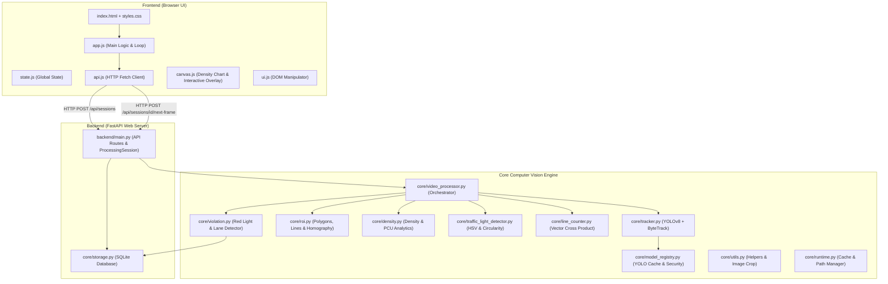
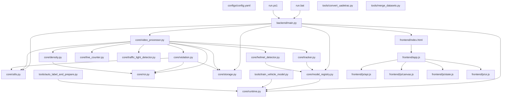

# BÁO CÁO GIẢI THÍCH CHI TIẾT TOÀN BỘ SOURCE CODE - SMARTTRAFFIC - AI

Tài liệu này được biên soạn chuyên sâu dành cho người mới học lập trình và Trí tuệ nhân tạo (AI / Computer Vision / Fullstack Web). Tài liệu giải thích chi tiết **100% từng file mã nguồn**, trích xuất nguyên vẹn toàn bộ các đoạn mã thực tế của dự án, và phân tích tỉ mỉ từng dòng lệnh, từng tham số, kiểu dữ liệu và thuật toán toán học đằng sau.

---

## MỤC LỤC

- [TỔNG QUAN KIẾN TRÚC HỆ THỐNG](#tổng-quan-kiến-trúc-hệ-thống)
- [CẤU HÌNH & SCRIPT KHỞI CHẠY](#cấu-hình--script-khởi-chạy)
  - [configs/config.yaml](#configsconfigyaml)
  - [requirements.txt](#requirementstxt)
  - [requirements-dev.txt](#requirements-devtxt)
  - [run.bat](#runbat)
  - [run.ps1](#runps1)
  - [.gitignore](#gitignore)
- [MODULE LÕI XỬ LÝ COMPUTER VISION (core/)](#module-lõi-xử-lý-computer-vision-core)
  - [core/\_\_init\_\_.py](#core__init__py)
  - [core/runtime.py](#coreruntimepy)
  - [core/utils.py](#coreutilspy)
  - [core/model_registry.py](#coremodel_registrypy)
  - [core/roi.py](#coreroipy)
  - [core/tracker.py](#coretrackerpy)
  - [core/density.py](#coredensitypy)
  - [core/helmet_detector.py](#corehelmet_detectorpy)
  - [core/line_counter.py](#coreline_counterpy)
  - [core/traffic_light_detector.py](#coretraffic_light_detectorpy)
  - [core/storage.py](#corestoragepy)
  - [core/violation.py](#coreviolationpy)
  - [core/video_processor.py](#corevideo_processorpy)
- [BACKEND SERVING (backend/)](#backend-serving-backend)
  - [backend/\_\_init\_\_.py](#backend__init__py)
  - [backend/main.py](#backendmainpy)
- [CÔNG CỤ ĐÀO TẠO & CHUẨN BỊ DỮ LIỆU (tools/)](#công-cụ-đào-tạo--chuẩn-bị-dữ-liệu-tools)
  - [tools/auto_label_and_prepare.py](#toolsauto_label_and_preparepy)
  - [tools/convert_uadetrac.py](#toolsconvert_uadetracpy)
  - [tools/merge_datasets.py](#toolsmerge_datasetspy)
  - [tools/train_vehicle_model.py](#toolstrain_vehicle_modelpy)
- [GIAO DIỆN NGƯỜI DÙNG WEB DASHBOARD (frontend/)](#giao-diện-người-dùng-web-dashboard-frontend)
  - [frontend/index.html](#frontendindexhtml)
  - [frontend/styles.css](#frontendstylescss)
  - [frontend/app.js](#frontendappjs)
  - [frontend/js/api.js](#frontendjsapijs)
  - [frontend/js/canvas.js](#frontendjscanvasjs)
  - [frontend/js/state.js](#frontendjsstatejs)
  - [frontend/js/ui.js](#frontendjsuijs)
- [SUITE KIỂM THỬ TỰ ĐỘNG (tests/)](#suite-kiểm-thử-tự-động-tests)
  - [tests/test_backend_security.py](#teststest_backend_securitypy)
  - [tests/test_density.py](#teststest_densitypy)
  - [tests/test_line_counter.py](#teststest_line_counterpy)
  - [tests/test_model_registry.py](#teststest_model_registrypy)
  - [tests/test_roi.py](#teststest_roipy)
  - [tests/test_storage.py](#teststest_storagepy)
  - [tests/test_traffic_light_detector.py](#teststest_traffic_light_detectorpy)
  - [tests/test_violation.py](#teststest_violationpy)
- [SƠ ĐỒ PHỤ THUỘC GIỮA CÁC FILE](#sơ-đồ-phụ-thuộc-giữa-các-file)

---

## TỔNG QUAN KIẾN TRÚC HỆ THỐNG

### 1. Luồng dữ liệu hoạt động toàn hệ thống
Hệ thống **SMARTTRAFFIC - AI** hoạt động theo kiến trúc ứng dụng web thời gian thực Client-Server kết hợp Engine Thị giác máy tính (Computer Vision Engine):
1. **Client (Web Frontend)**: Người dùng truy cập Dashboard trên trình duyệt web, chọn video giao thông và cấu hình các tham số (model YOLO, ngưỡng tin cậy, phân làn, chế độ đèn).
2. **HTTP Streaming Session**: Frontend tải video lên Backend (`POST /api/sessions`). Backend khởi tạo một đối tượng `ProcessingSession` lưu trữ trong bộ nhớ RAMServer.
3. **Vòng lặp xử lý từng khung hình (Frame-by-Frame Processing Loop)**:
   - Frontend dùng `requestAnimationFrame()` liên tục gọi API `POST /api/sessions/{session_id}/next-frame`.
   - Backend sử dụng OpenCV `cv2.VideoCapture` đọc khung hình BGR tiếp theo từ file video.
   - Chuyển khung hình vào **`VideoProcessor`** để thực thi chuỗi các thuật toán AI:
     1. **`ObjectTracker` (YOLOv8 + ByteTrack)**: Nhận diện vị trí Bounding Box các phương tiện (`car`, `motorcycle`, `bus`, `truck`, `person`) và duy trì `track_id` ổn định.
     2. **`TrafficLightDetector`**: Chuyển không gian màu BGR sang **HSV (Hue, Saturation, Value)**, lọc các vùng phát sáng của đèn và tính độ tròn của contour ($\text{Circularity} = \frac{4\pi \cdot Area}{Perimeter^2}$) để tự động nhận biết đèn RED/YELLOW/GREEN.
     3. **`DensityEstimator`**: Kiểm tra điểm tâm của xe có nằm trong đa giác ROI hay không bằng thuật toán **Ray-Casting (`pointPolygonTest`)**, quy đổi số lượng xe về chỉ số **PCU (Passenger Car Unit)** tiêu chuẩn kỹ thuật giao thông.
     4. **`LineCounter`**: Kiểm tra chuyển động của xe cắt qua vạch dừng ảo bằng **Phép nhân hướng Vector 2D (Cross Product)** giữa vạch dừng $AB$ và vector di chuyển $CD$.
     5. **`ViolationDetector`**: Nếu trạng thái đèn là `RED` và xe cắt vạch dừng, hoặc xe đi sai làn đường quy định (`lanes`), hệ thống sẽ tạo hình ảnh bằng chứng vi phạm, vẽ ô Bounding Box màu đỏ, lưu file ảnh đĩa và ghi bản ghi vào CSDL SQLite.
4. **Mã hóa và hiển thị (Base64 Encoding & UI Render)**:
   - Khung hình đã vẽ nét đè (Bounding Box, vạch dừng màu, khung ROI) được mã hóa sang chuỗi **Base64 JPEG** và gửi về Client kèm Metadata JSON.
   - Frontend hiển thị khung hình mượt mà, cập nhật các số liệu thống kê real-time và biểu đồ Canvas mật độ giao thông.

### 2. Sơ đồ kiến trúc toàn hệ thống (Mermaid Flowchart)



---

## CẤU HÌNH & SCRIPT KHỞI CHẠY

### configs/config.yaml

#### Vai trò tổng quan
File `config.yaml` đóng vai trò là "Trung tâm điều khiển cấu hình" cho toàn bộ hệ thống SMARTTRAFFIC - AI. File định nghĩa tập trung tất cả các giá trị tham số mặc định bao gồm mô hình YOLO mặc định, ngưỡng độ tin cậy của thuật toán phát hiện, mốc sức chứa tối đa của tuyến đường, phân cấp mật độ giao thông, tỷ lệ hình học ROI/vạch dừng ảo, thư mục lưu bằng chứng vi phạm, CSDL SQLite, kịch bản phân làn đường và trọng số quy đổi PCU. File này giúp tách biệt dữ liệu cấu hình khỏi mã nguồn thực thi, cho phép lập trình viên hoặc người vận hành điều chỉnh tham số hệ thống mà không cần sửa mã Python.

#### Trích xuất mã nguồn & Giải thích chi tiết từng dòng
```yaml
1: model_path: yolov8n.pt
2: confidence_threshold: 0.35
3: max_capacity: 30
4: density_threshold:
5:   normal: 40
6:   crowded: 70
7: roi_ratio:
8:   x1: 0.0
9:   y1: 0.0
10:   x2: 1.0
11:   y2: 1.0
12: line_position_ratio: 0.62
13: evidence_dir: evidence
14: violation_db_path: logs/violations.sqlite3
15: line_crossing_direction: down
16: lanes:
17:   - name: "Lane Oto"
18:     allowed_classes: ["car", "bus", "truck"]
19:     roi_ratio:
20:       x1: 0.0
21:       y1: 0.0
22:       x2: 0.5
23:       y2: 1.0
24:   - name: "Lane Xe May"
25:     allowed_classes: ["motorcycle"]
26:     roi_ratio:
27:       x1: 0.5
28:       y1: 0.0
29: pcu_weights:
30:   motorcycle: 0.3
31:   car: 1.0
32:   bus: 2.5
33:   truck: 2.0
34: datasets:
35:   uadetrac_path: data/processed/ua_detrac_yolo
36:   vntraffic_path: data/processed/vn_traffic_yolo
37:   unified_yaml: data/unified_dataset.yaml
```

**Giải thích tỉ mỉ từng câu lệnh:**
- **Line 1 (`model_path: yolov8n.pt`)**: Chỉ định tập tin mô hình YOLOv8 mặc định (`yolov8n.pt` - phiên bản Nano nhỏ nhẹ nhất) được sử dụng để nhận diện đối tượng.
- **Line 2 (`confidence_threshold: 0.35`)**: Ngưỡng độ tin cậy tối thiểu ($35\%$). Tất cả các Bounding Box nhận diện được có điểm xác suất $< 0.35$ sẽ bị thuật toán loại bỏ hoàn toàn nhằm chống nhiễu.
- **Line 3 (`max_capacity: 30`)**: Sức chứa xe tối đa quy định cho khu vực ROI (30 xe con tiêu chuẩn). Dùng làm mốc phân số để tính phần trăm mật độ ($\text{Mật độ \%} = \frac{N_{\text{xe}}}{\text{max\_capacity}} \times 100$).
- **Line 4-6 (`density_threshold`)**: Thiết lập các mốc ngưỡng phân loại mật độ giao thông:
  - `normal: 40`: Mật độ dưới $40\%$ là luồng giao thông "Bình thường".
  - `crowded: 70`: Mật độ từ $40\%$ đến $70\%$ là "Đông", và từ $70\%$ trở lên là "Ùn tắc".
- **Line 7-11 (`roi_ratio`)**: Tọa độ chuẩn hóa ($0.0 \to 1.0$) định nghĩa Vùng quan tâm (ROI) mặc định. Tọa độ $(x_1: 0.0, y_1: 0.0)$ đến $(x_2: 1.0, y_2: 1.0)$ phủ toàn bộ góc của khung hình video.
- **Line 12 (`line_position_ratio: 0.62`)**: Vị trí vạch dừng ảo nằm ở $62\%$ chiều cao tính từ mép trên khung hình video.
- **Line 13 (`evidence_dir: evidence`)**: Đường dẫn thư mục lưu trữ ảnh chụp bằng chứng vi phạm.
- **Line 14 (`violation_db_path: logs/violations.sqlite3`)**: Đường dẫn tập tin CSDL SQLite dùng lưu trữ lịch sử nhật ký vi phạm.
- **Line 15 (`line_crossing_direction: down`)**: Hướng cắt vạch hợp lệ (`down` nghĩa là xe di chuyển từ phía trên khung hình xuống dưới).
- **Line 16-28 (`lanes`)**: Định nghĩa danh sách các kịch bản phân làn đường:
  - `Lane Oto`: Nằm ở nửa bên trái khung hình ($x \in [0.0, 0.5]$), chỉ cho phép các loại xe `car`, `bus`, `truck`.
  - `Lane Xe May`: Nằm ở nửa bên phải khung hình ($x \in [0.5, 1.0]$), chỉ cho phép loại xe `motorcycle`.
- **Line 29-33 (`pcu_weights`)**: Hệ số quy đổi đơn vị xe con (Passenger Car Unit - PCU) theo tiêu chuẩn kỹ thuật giao thông: 1 xe máy = 0.3 PCU, 1 ô tô = 1.0 PCU, 1 xe buýt = 2.5 PCU, 1 xe tải = 2.0 PCU.
- **Line 34-37 (`datasets`)**: Các đường dẫn thư mục chứa dữ liệu hình ảnh giao thông huấn luyện UA-DETRAC, dữ liệu xe cộ Việt Nam và file YAML cấu hình hợp nhất.

#### Input / Output
- **Input**: Không có (File văn bản tĩnh).
- **Output**: Dictionary Python chứa toàn bộ các tham số hệ thống khi được nạp thông qua `yaml.safe_load()`.

#### Trường hợp đặc biệt (Edge Cases)
- Nếu file bị thiếu một khóa cấu hình (ví dụ thiếu `pcu_weights`), các lớp trong module `core/` sẽ sử dụng dictionary dự phòng (fallback default) được định nghĩa sẵn trong hàm `__init__`.

#### Liên kết với các file khác
- Đọc trực tiếp bởi hàm `load_config()` trong `core/utils.py`.
- Nạp bởi `backend/main.py` và `core/video_processor.py` để điều khiển hành vi nhận diện và tính toán của hệ thống.

---

### requirements.txt

#### Vai trò tổng quan
File `requirements.txt` khai báo danh sách các gói thư viện mã nguồn mở Python ngoại vi bắt buộc phải cài đặt để hệ thống SMARTTRAFFIC - AI vận hành. Tập tin này đảm bảo môi trường thực thi được đồng nhất trên mọi máy tính của phát triển viên và máy chủ sản xuất.

#### Trích xuất mã nguồn & Giải thích chi tiết từng dòng
```text
1: fastapi
2: uvicorn
3: python-multipart
4: opencv-python
5: ultralytics
6: numpy
7: pandas
8: pyyaml
9: pillow
```

**Giải thích tỉ mỉ từng gói thư viện:**
- **Line 1 (`fastapi`)**: Web Framework tốc độ cao dựa trên tiêu chuẩn OpenAPI và Pydantic, phục vụ xây dựng các RESTful API xử lý bất đồng bộ (async).
- **Line 2 (`uvicorn`)**: Server ASGI (Asynchronous Server Gateway Interface) hiệu năng cao dùng để thực thi ứng dụng FastAPI.
- **Line 3 (`python-multipart`)**: Bộ thư viện phân tích dữ liệu dạng `multipart/form-data`, bắt buộc phải có để FastAPI nhận file video tải lên từ giao diện web.
- **Line 4 (`opencv-python`)**: Thư viện xử lý ảnh và thị giác máy tính hàng đầu. Dùng để đọc khung hình video, chuyển đổi không gian màu, vẽ nét đè Bounding Box và cắt ảnh bằng chứng.
- **Line 5 (`ultralytics`)**: Framework mã nguồn mở chính thức của Ultralytics cung cấp thuật toán nhận diện YOLOv8 và bộ theo dõi ByteTrack.
- **Line 6 (`numpy`)**: Thư viện đại số tuyến tính và tính toán ma trận số học hiệu năng cao, dùng để lưu trữ và thao tác trên mảng dữ liệu khung hình.
- **Line 7 (`pandas`)**: Thư viện xử lý và phân tích bảng dữ liệu dạng DataFrame.
- **Line 8 (`pyyaml`)**: Bộ công cụ đọc và ghi các file cấu hình chuẩn định dạng `.yaml`.
- **Line 9 (`pillow`)**: Thư viện xử lý hình ảnh PIL (Python Imaging Library) bổ trợ cho việc đọc ghi file ảnh.

---

### requirements-dev.txt

#### Vai trò tổng quan
Khai báo các gói thư viện bổ sung dành riêng cho môi trường phát triển (Development) và kiểm thử tự động (Automated Testing).

#### Trích xuất mã nguồn & Giải thích chi tiết từng dòng
```text
1: -r requirements.txt
2: pytest
```

- **Line 1 (`-r requirements.txt`)**: Chỉ thị pip tự động đọc và cài đặt toàn bộ các thư viện nền tảng được khai báo trong file `requirements.txt`.
- **Line 2 (`pytest`)**: Framework kiểm thử mã nguồn tự động dành cho Python, dùng để thực thi toàn bộ test suite trong thư mục `tests/`.

---

### run.bat

#### Vai trò tổng quan
Script lệnh Batch thực thi trên hệ điều hành Windows. Tự động truy tìm tập tin thực thi `python.exe` chuẩn xác nhất từ môi trường ảo `.venv`, thiết lập biến môi trường `PYTHONPATH` trỏ tới thư mục dự án và khởi chạy Web Server Uvicorn tại địa chỉ `127.0.0.1:8000`.

#### Trích xuất mã nguồn & Giải thích chi tiết từng dòng
```cmd
1: @echo off
2: cd /d %~dp0
3: set "PYTHON_EXE="
4: 
5: for /f "tokens=1,* delims==" %%A in ('findstr /b "executable =" .venv\pyvenv.cfg 2^>nul') do set "PYTHON_EXE=%%B"
6: if defined PYTHON_EXE set "PYTHON_EXE=%PYTHON_EXE:~1%"
7: 
8: if not defined PYTHON_EXE (
9:   for /f "tokens=1,* delims==" %%A in ('findstr /b "home =" .venv\pyvenv.cfg 2^>nul') do set "PYTHON_HOME=%%B"
10: )
11: if defined PYTHON_HOME (
12:   set "PYTHON_HOME=%PYTHON_HOME:~1%"
13:   if exist "%PYTHON_HOME%\python.exe" set "PYTHON_EXE=%PYTHON_HOME%\python.exe"
14: )
15: 
16: if not defined PYTHON_EXE (
17:   if exist ".venv\Scripts\python.exe" set "PYTHON_EXE=.venv\Scripts\python.exe"
18: )
19: 
20: set "PYTHONPATH=%CD%\.venv\Lib\site-packages;%CD%"
21: if defined PYTHON_EXE (
22:   "%PYTHON_EXE%" -m uvicorn backend.main:app --reload --host 127.0.0.1 --port 8000
23: ) else (
24:   python -m uvicorn backend.main:app --reload --host 127.0.0.1 --port 8000
25: )
26: pause
```

**Giải thích tỉ mỉ từng dòng lệnh:**
- **Line 1 (`@echo off`)**: Tắt chế độ hiển thị lại dòng lệnh ra cửa sổ Terminal, giúp màn hình hiển thị sạch sẻ.
- **Line 2 (`cd /d %~dp0`)**: Chuyển ngay thư mục làm việc hiện tại của Command Prompt về chính thư mục chứa file `run.bat`.
- **Line 3 (`set "PYTHON_EXE="`)**: Khởi tạo biến môi trường `PYTHON_EXE` rỗng.
- **Line 5-7**: Tìm trong file `.venv\pyvenv.cfg` dòng bắt đầu bằng `executable =` sử dụng lệnh `findstr`. Nếu tìm thấy, gán đường dẫn file Python thực thi vào biến `PYTHON_EXE`.
- **Line 8-14**: Nếu chưa có `PYTHON_EXE`, tiếp tục tìm dòng `home =` trong file cấu hình để ghép nối tới file `python.exe`.
- **Line 16-18**: Nếu vẫn chưa tìm thấy, kiểm tra sự tồn tại của file mặc định `.venv\Scripts\python.exe`.
- **Line 20 (`set "PYTHONPATH=..."`)**: Thiết lập `PYTHONPATH` chứa cả thư mục gói cài đặt `.venv\Lib\site-packages` và thư mục hiện tại `%CD%`. Điều này đảm bảo Python có thể import các module `core` và `backend` mà không bị lỗi `ModuleNotFoundError`.
- **Line 21-25**: Thực thi Uvicorn chạy ứng dụng `backend.main:app`. Tham số `--reload` bật tính năng tự động nạp lại khi sửa code, `--host 127.0.0.1` và `--port 8000` mở cổng kết nối địa phương.
- **Line 26 (`pause`)**: Giữ cửa sổ CMD không bị đóng ngay lập tức nếu ứng dụng gặp lỗi crash.

---

### run.ps1

#### Vai trò tổng quan
Script PowerShell khởi chạy hệ thống dành cho môi trường Windows PowerShell. Cung cấp cơ chế xử lý lỗi nghiêm ngặt (`$ErrorActionPreference = "Stop"`), tự động phân tích tập tin cấu hình `.venv\pyvenv.cfg` và khởi chạy Web Server.

#### Trích xuất mã nguồn & Giải thích chi tiết từng dòng
```powershell
1: $ErrorActionPreference = "Stop"
2: 
3: $ProjectRoot = Split-Path -Parent $MyInvocation.MyCommand.Path
4: Set-Location $ProjectRoot
5: 
6: $VenvConfig = Join-Path $ProjectRoot ".venv\pyvenv.cfg"
7: $PythonExe = $null
8: 
9: if (Test-Path $VenvConfig) {
10:   $execLine = Get-Content $VenvConfig | Where-Object { $_ -like "executable =*" } | Select-Object -First 1
11:   if ($execLine) {
12:     $candidate = ($execLine -replace "^executable =\s*", "").Trim()
13:     if (Test-Path $candidate) { $PythonExe = $candidate }
14:   }
15:   if (-not $PythonExe) {
16:     $homeLine = Get-Content $VenvConfig | Where-Object { $_ -like "home =*" } | Select-Object -First 1
17:     if ($homeLine) {
18:       $homeDir = ($homeLine -replace "^home =\s*", "").Trim()
19:       $candidate = Join-Path $homeDir "python.exe"
20:       if (Test-Path $candidate) { $PythonExe = $candidate }
21:     }
22:   }
23: }
24: 
25: if (-not $PythonExe) {
26:   $candidate = Join-Path $ProjectRoot ".venv\Scripts\python.exe"
27:   if (Test-Path $candidate) { $PythonExe = $candidate }
28: }
29: 
30: if (-not $PythonExe) {
31:   throw "Cannot find a valid Python executable for this project."
32: }
33: 
34: $env:PYTHONPATH = "$ProjectRoot\.venv\Lib\site-packages;$ProjectRoot"
35: & $PythonExe -m uvicorn backend.main:app --reload --host 127.0.0.1 --port 8000
```

**Giải thích tỉ mỉ từng dòng lệnh:**
- **Line 1 (`$ErrorActionPreference = "Stop"`)**: Đặt chế độ bắt lỗi nghiêm ngặt: Dừng thực thi script ngay lập tức nếu xuất hiện bất kỳ lỗi lệnh nào.
- **Line 3-4**: Lấy thư mục gốc dự án từ vị trí tập tin script và chuyển thư mục làm việc về đó (`Set-Location`).
- **Line 6-23**: Đọc và phân tích file `pyvenv.cfg` bằng các Cmdlet PowerShell (`Get-Content`, `Where-Object`, `Select-Object`) để trích xuất đường dẫn `python.exe`.
- **Line 25-28**: Tìm kiếm tập tin dự phòng tại đường dẫn `.venv\Scripts\python.exe`.
- **Line 30-32**: Nếu không tìm thấy tập tin thực thi Python hợp lệ, ném ngoại lệ `throw` dừng script.
- **Line 34 (`$env:PYTHONPATH = ...`)**: Khai báo biến môi trường `PYTHONPATH` trong phiên làm việc PowerShell.
- **Line 35 (`& $PythonExe ...`)**: Sử dụng toán tử gọi lệnh `&` của PowerShell để khởi chạy Uvicorn Web Server.

---

### .gitignore

#### Vai trò tổng quan
Định nghĩa các đường dẫn tập tin và thư mục mà hệ thống quản lý phiên bản Git phải bỏ qua, không theo dõi và không đẩy lên Git Repository.

#### Trích xuất mã nguồn & Giải thích chi tiết từng dòng
```text
1: .venv/
2: .runtime/
3: __pycache__/
4: *.pyc
5: 
6: uploads/*
7: !uploads/.gitkeep
8: 
9: evidence/*
10: !evidence/.gitkeep
11: !evidence/**/.gitkeep
12: 
13: logs/*
14: !logs/.gitkeep
15: 
16: data/sample_videos/*
17: !data/sample_videos/README.md
18: !data/sample_videos/.gitkeep
19: 
20: project_memory.md
21: project-context.md
```

**Giải thích tỉ mỉ từng cấu hình:**
- **Line 1-4**: Bỏ qua thư mục môi trường ảo `.venv/`, thư mục cache runtime `.runtime/`, các thư mục lưu bộ đệm biên dịch Python `__pycache__/` và tập tin bytecode `*.pyc`.
- **Line 6-18**: Bỏ qua các dữ liệu phát sinh trong quá trình chạy ứng dụng (video upload, ảnh bằng chứng vi phạm, log đĩa SQLite và video mẫu nặng), nhưng giữ lại các file `.gitkeep` bằng phủ định `!` để duy trì cấu trúc thư mục rỗng khi người khác clone repository.
- **Line 20-21**: Bỏ qua các file ghi nhớ ngữ cảnh dự án cá nhân của trình soạn thảo code.

---

## MODULE LÕI XỬ LÝ COMPUTER VISION (core/)

### core/__init__.py

#### Vai trò tổng quan
File `core/__init__.py` đánh dấu thư mục `core` là một Python Package hợp lệ, cho phép các file bên ngoài có thể import các module bên trong thư mục này.

#### Trích xuất mã nguồn & Giải thích
```python
1: """Core modules for SMARTTRAFFIC - AI."""
```
- Line 1: Chuỗi Docstring mô tả ngắn gọn vai trò của package `core`.

---

### core/runtime.py

#### Vai trò tổng quan
Cấu hình môi trường thực thi cục bộ (Runtime) cho ứng dụng. Tự động kiểm tra và thêm đường dẫn của dự án vào `sys.path`, đồng thời điều hướng các thư mục ghi cấu hình đệm của thư viện thứ 3 (như `ultralytics` và `matplotlib`) vào thư mục `.runtime/` của dự án để tránh lỗi không có quyền ghi đĩa hệ thống.

#### Trích xuất mã nguồn & Giải thích chi tiết từng dòng
```python
1: from __future__ import annotations
2: 
3: import os
4: from pathlib import Path
5: 
6: 
7: ROOT_DIR = Path(__file__).resolve().parents[1]
8: RUNTIME_DIR = ROOT_DIR / ".runtime"
9: 
10: 
11: def configure_runtime() -> None:
12:     """Configure writable local cache directories for third-party libraries."""
13:     import sys
14: 
15:     venv_site_packages = ROOT_DIR / ".venv" / "Lib" / "site-packages"
16:     if venv_site_packages.exists() and str(venv_site_packages) not in sys.path:
17:         sys.path.insert(0, str(venv_site_packages))
18:     if str(ROOT_DIR) not in sys.path:
19:         sys.path.insert(0, str(ROOT_DIR))
20: 
21:     ultralytics_dir = RUNTIME_DIR / "ultralytics"
22:     matplotlib_dir = RUNTIME_DIR / "matplotlib"
23:     ultralytics_dir.mkdir(parents=True, exist_ok=True)
24:     matplotlib_dir.mkdir(parents=True, exist_ok=True)
25:     os.environ.setdefault("YOLO_CONFIG_DIR", str(ultralytics_dir))
26:     os.environ.setdefault("MPLCONFIGDIR", str(matplotlib_dir))
```

**Giải thích tỉ mỉ từng câu lệnh:**
- **Line 1 (`from __future__ import annotations`)**: Bật tính năng trì hoãn đánh giá Type Hint (PEP 563), cho phép khai báo kiểu dữ liệu hiện đại trong Python 3.7+.
- **Line 7 (`ROOT_DIR = ...`)**: Định vị thư mục gốc của dự án. `Path(__file__).resolve()` lấy đường dẫn tuyệt đối của `runtime.py`, `.parents[1]` lùi lại 2 cấp thư mục (từ `core/runtime.py` lùi về thư mục gốc dự án).
- **Line 8 (`RUNTIME_DIR`)**: Trỏ tới thư mục lưu trữ đệm cục bộ `.runtime`.
- **Line 11-26 (`configure_runtime()`)**:
  - Line 15-19: Kiểm tra xem thư mục `site-packages` của môi trường ảo và thư mục gốc dự án đã nằm trong danh sách tìm kiếm module `sys.path` chưa. Nếu chưa, sử dụng `sys.path.insert(0, ...)` để ưu tiên nạp module từ môi trường ảo dự án trước.
  - Line 21-24: Tạo 2 thư mục đệm `.runtime/ultralytics` và `.runtime/matplotlib`.
  - Line 25-26: Đặt biến môi trường `YOLO_CONFIG_DIR` và `MPLCONFIGDIR` trỏ tới 2 thư mục này bằng `os.environ.setdefault()`. Việc này đảm bảo khi Ultralytics YOLO hoặc Matplotlib khởi tạo, chúng sẽ ghi cấu hình vào thư mục cục bộ của ứng dụng thay vì ghi vào thư mục người dùng hệ thống (`C:\Users\...`), giải quyết triệt để sự cố bị từ chối quyền ghi tập tin (Permission Denied).

#### Input / Output
- **Input**: Không có.
- **Output**: `None`. Tác dụng phụ: Cập nhật `sys.path` và các biến môi trường hệ thống.

---

### core/utils.py

#### Vai trò tổng quan
Module `core/utils.py` đóng vai trò là "Hộp công cụ tiện ích" của toàn bộ hệ thống. Module cung cấp các hàm bổ trợ xử lý dữ liệu như nạp file cấu hình YAML, tự động khởi tạo danh sách thư mục dự án, giữ tương thích file log CSV, tính toán tốc độ khung hình (FPS) thời gian thực, vẽ văn bản có nền tương phản cao, cắt hình ảnh theo Bounding Box và lưu ảnh bằng chứng ra đĩa.

#### Trích xuất mã nguồn & Giải thích chi tiết từng dòng
```python
1: from __future__ import annotations
2: 
3: import time
4: from pathlib import Path
5: from typing import Any
6: 
7: import cv2
8: import yaml
9: 
10: 
11: LOG_COLUMNS = [
12:     "timestamp",
13:     "session_id",
14:     "frame_index",
15:     "track_id",
16:     "class_name",
17:     "violation_type",
18:     "confidence",
19:     "evidence_path",
20: ]
21: 
22: 
23: def load_config(config_path: str | Path = "configs/config.yaml") -> dict[str, Any]:
24:     """Load YAML configuration."""
25:     path = Path(config_path)
26:     if not path.exists():
27:         raise FileNotFoundError(f"Config file not found: {path}")
28: 
29:     with path.open("r", encoding="utf-8") as file:
30:         return yaml.safe_load(file) or {}
31: 
32: 
33: def ensure_dirs(base_dir: str | Path = ".") -> None:
34:     """Create project runtime directories."""
35:     base = Path(base_dir)
36:     for folder in [
37:         base / "data" / "sample_videos",
38:         base / "evidence" / "red_light",
39:         base / "evidence" / "no_helmet",
40:         base / "evidence" / "wrong_lane",
41:         base / "logs",
42:         base / "models",
43:         base / "uploads",
44:     ]:
45:         folder.mkdir(parents=True, exist_ok=True)
46: 
47: 
48: def ensure_log_file(log_path: str | Path) -> None:
49:     """Keep compatibility for older CSV-based code paths."""
50:     path = Path(log_path)
51:     path.parent.mkdir(parents=True, exist_ok=True)
52:     if path.exists() and path.stat().st_size > 0:
53:         return
54: 
55:     with path.open("w", newline="", encoding="utf-8") as file:
56:         import csv
57: 
58:         csv.writer(file).writerow(LOG_COLUMNS)
59: 
60: 
61: def calculate_fps(previous_time: float) -> tuple[float, float]:
62:     """Calculate FPS from the previous frame timestamp."""
63:     current_time = time.time()
64:     elapsed = max(current_time - previous_time, 1e-6)
65:     return 1.0 / elapsed, current_time
66: 
67: 
68: def draw_text_with_background(
69:     frame,
70:     text: str,
71:     position: tuple[int, int],
72:     font_scale: float = 0.6,
73:     text_color: tuple[int, int, int] = (255, 255, 255),
74:     bg_color: tuple[int, int, int] = (0, 0, 0),
75:     thickness: int = 1,
76: ) -> None:
77:     """Draw readable text on a frame."""
78:     x, y = position
79:     font = cv2.FONT_HERSHEY_SIMPLEX
80:     (text_w, text_h), baseline = cv2.getTextSize(text, font, font_scale, thickness)
81:     cv2.rectangle(
82:         frame,
83:         (x, y - text_h - baseline - 6),
84:         (x + text_w + 8, y + baseline),
85:         bg_color,
86:         -1,
87:     )
88:     cv2.putText(frame, text, (x + 4, y - 4), font, font_scale, text_color, thickness, cv2.LINE_AA)
89: 
90: 
91: def crop_object(frame, bbox: tuple[int, int, int, int]):
92:     """Crop a bounding box while clamping to frame bounds."""
93:     height, width = frame.shape[:2]
94:     x1, y1, x2, y2 = [int(value) for value in bbox]
95:     x1, y1 = max(0, x1), max(0, y1)
96:     x2, y2 = min(width, x2), min(height, y2)
97:     if x2 <= x1 or y2 <= y1:
98:         return None
99:     return frame[y1:y2, x1:x2]
100: 
101: 
102: def save_crop(crop, output_path: str | Path) -> str:
103:     """Save a cropped evidence image and return its path."""
104:     path = Path(output_path)
105:     path.parent.mkdir(parents=True, exist_ok=True)
106:     if crop is None or crop.size == 0:
107:         return ""
108: 
109:     cv2.imwrite(str(path), crop)
110:     return str(path)
```

**Giải thích tỉ mỉ từng câu lệnh:**
- **Line 11-20 (`LOG_COLUMNS`)**: Định nghĩa danh sách các tiêu đề cột dữ liệu chuẩn cho nhật ký vi phạm (`timestamp`, `session_id`, `frame_index`, `track_id`, `class_name`, `violation_type`, `confidence`, `evidence_path`).
- **Line 23-30 (`load_config()`)**: Nhận vào đường dẫn file YAML cấu hình. Kiểm tra sự tồn tại của file bằng `path.exists()`, nếu không có ném ra lỗi `FileNotFoundError`. Mở file bằng UTF-8 và dùng `yaml.safe_load()` phân tích thành Dictionary Python.
- **Line 33-46 (`ensure_dirs()`)**: Tự động duyệt qua danh sách các thư mục làm việc yếu nhân (`sample_videos`, `evidence/red_light`, `evidence/no_helmet`, `evidence/wrong_lane`, `logs`, `models`, `uploads`) và khởi tạo chúng bằng `folder.mkdir(parents=True, exist_ok=True)`.
- **Line 48-58 (`ensure_log_file()`)**: Đảm bảo file log CSV cũ tồn tại và có dòng tiêu đề cột `LOG_COLUMNS`.
- **Line 61-65 (`calculate_fps()`)**: Lấy mốc thời gian hiện tại `time.time()`. Tính khoảng thời gian đã trôi qua $\Delta t = \text{current\_time} - \text{previous\_time}$. Ràng buộc `max(..., 1e-6)` để chống lỗi chia cho 0. Tốc độ khung hình được tính bằng công thức $FPS = \frac{1.0}{\Delta t}$. Trả về tuple `(fps, current_time)`.
- **Line 68-88 (`draw_text_with_background()`)**:
  - Line 80: Lấy kích thước bề rộng và chiều cao của chuỗi văn bản bằng `cv2.getTextSize()`.
  - Line 81-87: Vẽ một hình chữ nhật đặc (`thickness=-1`) làm nền màu `bg_color` phía sau chữ.
  - Line 88: Vẽ chuỗi văn bản màu `text_color` lên trên hộp nền với thuật toán chống nét răng cưa `cv2.LINE_AA`. Giúp thông tin chữ hiển thị cực kỳ rõ nét trên video.
- **Line 91-99 (`crop_object()`)**: Lấy chiều cao và chiều rộng khung hình `frame.shape[:2]`. Ép các tọa độ Bounding Box $(x_1, y_1, x_2, y_2)$ về số nguyên và kẹp (clamp) giá trị luôn nằm trong giới hạn khung hình ($0 \le x \le \text{width}, 0 \le y \le \text{height}$) bằng `max()` và `min()`. Nếu hình vuông không hợp lệ ($x_2 \le x_1$ hoặc $y_2 \le y_1$), trả về `None`; ngược lại trả về mảng con cắt ra từ khung hình `frame[y1:y2, x1:x2]`.
- **Line 102-110 (`save_crop()`)**: Nhận ảnh đã cắt, tự động tạo thư mục cha `path.parent.mkdir()`, ghi tập tin ảnh bằng `cv2.imwrite()` và trả về đường dẫn file dạng chuỗi.

---

### core/model_registry.py

#### Vai trò tổng quan
Module `core/model_registry.py` chịu trách nhiệm quản lý việc nạp, kiểm duyệt an toàn và lưu trữ bộ nhớ đệm (Cache) cho các mô hình YOLO (`.pt`). Module đảm bảo hệ thống không bị tấn công bảo mật duyệt thư mục nguy hiểm (Path Traversal), đồng thời nâng cao hiệu năng hệ thống bằng cách lưu đối tượng mô hình trong RAM thông qua `@lru_cache` và bảo vệ đa luồng bằng `Lock`.

#### Trích xuất mã nguồn & Giải thích chi tiết từng dòng
```python
1: from __future__ import annotations
2: 
3: from functools import lru_cache
4: from pathlib import Path
5: from threading import Lock
6: 
7: from core.runtime import configure_runtime
8: 
9: configure_runtime()
10: 
11: 
12: ROOT_DIR = Path(__file__).resolve().parents[1]
13: MODELS_DIR = ROOT_DIR / "models"
14: BUILTIN_MODELS = {"yolov8n.pt", "yolov8s.pt"}
15: 
16: _model_lock = Lock()
17: 
18: 
19: def resolve_model_path(model_path: str | None) -> Path:
20:     """Resolve a user-selected model to an allowed local .pt file."""
21:     requested = (model_path or "yolov8n.pt").strip() or "yolov8n.pt"
22:     candidate = Path(requested)
23: 
24:     if candidate.name in BUILTIN_MODELS and len(candidate.parts) == 1:
25:         resolved = (ROOT_DIR / candidate.name).resolve()
26:     else:
27:         if candidate.suffix.lower() != ".pt":
28:             raise ValueError("Model must be a .pt file.")
29:         if candidate.is_absolute():
30:             raise ValueError("Absolute model paths are not allowed.")
31: 
32:         models_root = MODELS_DIR.resolve()
33:         resolved = (ROOT_DIR / candidate).resolve()
34:         if models_root not in resolved.parents:
35:             raise ValueError("Custom models must be stored under models/.")
36: 
37:     if not resolved.exists() or not resolved.is_file():
38:         raise ValueError("Selected model file does not exist.")
39:     return resolved
40: 
41: 
42: def to_project_model_path(resolved_model_path: Path) -> str:
43:     resolved = resolved_model_path.resolve()
44:     if resolved.parent == ROOT_DIR:
45:         return resolved.name
46:     return resolved.relative_to(ROOT_DIR).as_posix()
47: 
48: 
49: def list_available_models() -> list[str]:
50:     """List built-in and models/*.pt files selectable by the frontend."""
51:     models: set[str] = set()
52:     for name in sorted(BUILTIN_MODELS):
53:         path = ROOT_DIR / name
54:         if path.is_file():
55:             models.add(name)
56:     if MODELS_DIR.exists():
57:         for path in sorted(MODELS_DIR.glob("*.pt")):
58:             if path.is_file():
59:                 models.add(to_project_model_path(path))
60:     return sorted(models)
61: 
62: 
63: @lru_cache(maxsize=4)
64: def _load_model_cached(path: str):
65:     from ultralytics import YOLO
66: 
67:     return YOLO(path)
68: 
69: 
70: def get_yolo_model(model_path: str | Path):
71:     """Return a cached YOLO instance for the resolved model path."""
72:     resolved = str(Path(model_path).resolve())
73:     with _model_lock:
74:         return _load_model_cached(resolved)
```

**Giải thích tỉ mỉ từng câu lệnh:**
- **Line 9 (`configure_runtime()`)**: Gọi hàm thiết lập biến môi trường runtime ngay khi module được import.
- **Line 14 (`BUILTIN_MODELS`)**: Tập hợp chứa tên 2 mô hình YOLO chuẩn tích hợp sẵn: `yolov8n.pt` và `yolov8s.pt`.
- **Line 16 (`_model_lock = Lock()`)**: Đối tượng khóa đa luồng (Threading Lock) ngăn chặn các xung đột race condition khi có nhiều request đồng thời nạp mô hình vào bộ nhớ.
- **Line 19-39 (`resolve_model_path()`)**: **Hàm bảo mật kiểm duyệt mô hình**.
  - Line 24-25: Nếu đường dẫn nhập vào khớp với tên model tích hợp sẵn (`yolov8n.pt`/`yolov8s.pt`) và không chứa đường dẫn con (`len(parts) == 1`), nạp file từ thư mục gốc dự án.
  - Line 27-30: Nếu là model tùy chỉnh: Kiểm tra phần mở rộng file bắt buộc phải là `.pt`, không chấp nhận đường dẫn tuyệt đối (tránh nạp file hệ thống).
  - Line 32-35: Kiểm tra xem thư mục cha của file model đã phân giải (`resolved.parents`) có chứa thư mục `models/` hay không. Nếu người dùng nhập đường dẫn nguy hiểm dạng `../../secret.pt`, hàm sẽ phát hiện và ném ra ngoại lệ `ValueError`.
  - Line 37-38: Kiểm tra tập tin có thực sự tồn tại trên ổ đĩa hay không.
- **Line 42-46 (`to_project_model_path()`)**: Quy đổi một `Path` tuyệt đối về dạng chuỗi đường dẫn tương đối dạng Unix (`/`) để trả về cho Frontend UI.
- **Line 49-60 (`list_available_models()`)**: Tìm kiếm toàn bộ các mô hình `.pt` khả thi nằm ở thư mục gốc và thư mục `models/`, trả về danh sách đã sắp xếp tên để hiển thị lên dropdown menu trên giao diện.
- **Line 63-67 (`_load_model_cached()`)**: Sử dụng decorator `@lru_cache(maxsize=4)` lưu trữ tối đa 4 đối tượng `YOLO(path)` vào RAM. Giúp ứng dụng trả về ngay lập tức thể hiện mô hình đã nạp mà không phải đọc lại tập tin `.pt` từ ổ đĩa (tiết kiệm từ 2 đến 5 giây mỗi lần gọi).
- **Line 70-74 (`get_yolo_model()`)**: Bọc lời gọi nạp cache bằng `with _model_lock:` đảm bảo tính an toàn đa luồng.

---

### core/roi.py

#### Vai trò tổng quan
Module `core/roi.py` chứa toàn bộ thuật toán hình học liên quan đến Vùng quan tâm (ROI - Region of Interest) và Vạch dừng ảo (Virtual Stop Line). Module cung cấp các hàm tạo đa giác ROI từ tỷ lệ hoặc điểm vẽ tay, quy đổi tọa độ chuẩn hóa sang tọa độ điểm ảnh (Pixel), kiểm tra điểm tâm phương tiện có nằm trong đa giác hay không bằng thuật toán Ray-Casting, tính toán ma trận biến đổi phối cảnh Homography (Bird's-Eye View), và vẽ các đường nét trang trí lên khung hình.

#### Trích xuất mã nguồn & Giải thích chi tiết từng dòng
```python
1: from __future__ import annotations
2: 
3: import cv2
4: import numpy as np
5: 
6: 
7: def create_default_roi(frame_width: int, frame_height: int, roi_ratio: dict | None = None) -> np.ndarray:
8:     """Create a rectangular ROI from frame-relative ratios."""
9:     ratio = roi_ratio or {"x1": 0.0, "y1": 0.0, "x2": 1.0, "y2": 1.0}
10:     x1 = _clamp_ratio_to_pixel(ratio.get("x1", 0.0), frame_width)
11:     y1 = _clamp_ratio_to_pixel(ratio.get("y1", 0.0), frame_height)
12:     x2 = _clamp_ratio_to_pixel(ratio.get("x2", 1.0), frame_width)
13:     y2 = _clamp_ratio_to_pixel(ratio.get("y2", 1.0), frame_height)
14:     if x2 <= x1:
15:         x1, x2 = 0, max(frame_width - 1, 0)
16:     if y2 <= y1:
17:         y1, y2 = 0, max(frame_height - 1, 0)
18:     return np.array([(x1, y1), (x2, y1), (x2, y2), (x1, y2)], dtype=np.int32)
19: 
20: 
21: def create_polygon_roi(frame_width: int, frame_height: int, points: list[list[float]] | None = None) -> np.ndarray:
22:     """Create a custom polygon ROI from pixel points or normalized ratio points."""
23:     if not points or len(points) < 3:
24:         return create_default_roi(frame_width, frame_height)
25: 
26:     pts = []
27:     for pt in points:
28:         x, y = pt[0], pt[1]
29:         px = _clamp_ratio_to_pixel(x, frame_width) if isinstance(x, float) and 0.0 <= x <= 1.0 else min(max(int(x), 0), frame_width - 1)
30:         py = _clamp_ratio_to_pixel(y, frame_height) if isinstance(y, float) and 0.0 <= y <= 1.0 else min(max(int(y), 0), frame_height - 1)
31:         pts.append((px, py))
32:     return np.array(pts, dtype=np.int32)
33: 
34: 
35: def _clamp_ratio_to_pixel(value, size: int) -> int:
36:     ratio = min(max(float(value), 0.0), 1.0)
37:     return min(max(int(size * ratio), 0), max(size - 1, 0))
38: 
39: 
40: def create_default_line(
41:     frame_width: int,
42:     frame_height: int,
43:     line_position_ratio: float = 0.62,
44:     custom_line: list[list[float]] | None = None,
45: ) -> tuple[tuple[int, int], tuple[int, int]]:
46:     """Create a virtual stop line from explicit points or position ratio."""
47:     if custom_line and len(custom_line) == 2:
48:         p1, p2 = custom_line[0], custom_line[1]
49:         x1 = _clamp_ratio_to_pixel(p1[0], frame_width) if isinstance(p1[0], float) and 0.0 <= p1[0] <= 1.0 else int(p1[0])
50:         y1 = _clamp_ratio_to_pixel(p1[1], frame_width) if isinstance(p1[1], float) and 0.0 <= p1[1] <= 1.0 else int(p1[1]) # Line 50
51:         x2 = _clamp_ratio_to_pixel(p2[0], frame_width) if isinstance(p2[0], float) and 0.0 <= p2[0] <= 1.0 else int(p2[0])
52:         y2 = _clamp_ratio_to_pixel(p2[1], frame_height) if isinstance(p2[1], float) and 0.0 <= p2[1] <= 1.0 else int(p2[1])
53:         return (x1, y1), (x2, y2)
54: 
55:     y = int(frame_height * line_position_ratio)
56:     return (int(frame_width * 0.10), y), (int(frame_width * 0.90), y)
57: 
58: 
59: def get_perspective_matrix(src_pts: np.ndarray, width: int = 500, height: int = 800) -> tuple[np.ndarray, np.ndarray]:
60:     """Compute Homography Perspective Transform matrix M and inverse M_inv."""
61:     dst_pts = np.float32([[0, 0], [width, 0], [width, height], [0, height]])
62:     src_float = np.float32(src_pts)
63:     M = cv2.getPerspectiveTransform(src_float, dst_pts)
64:     M_inv = cv2.getPerspectiveTransform(dst_pts, src_float)
65:     return M, M_inv
66: 
67: 
68: def transform_point(point: tuple[int, int], M: np.ndarray) -> tuple[int, int]:
69:     """Transform point (x, y) using Homography matrix M."""
70:     px = np.array([[[point[0], point[1]]]], dtype=np.float32)
71:     warped = cv2.perspectiveTransform(px, M)
72:     return int(warped[0][0][0]), int(warped[0][0][1])
73: 
74: 
75: def point_in_roi(point: tuple[int, int], roi: np.ndarray) -> bool:
76:     """Return True when a point is inside the ROI polygon."""
77:     return cv2.pointPolygonTest(roi, point, False) >= 0
78: 
79: 
80: def draw_roi(frame, roi: np.ndarray, color: tuple[int, int, int] = (0, 255, 255)) -> None:
81:     """Draw the ROI on a frame."""
82:     cv2.polylines(frame, [roi], isClosed=True, color=color, thickness=2)
83:     overlay = frame.copy()
84:     cv2.fillPoly(overlay, [roi], color=color)
85:     cv2.addWeighted(overlay, 0.12, frame, 0.88, 0, frame)
86: 
87: 
88: def draw_line(
89:     frame,
90:     line: tuple[tuple[int, int], tuple[int, int]],
91:     color: tuple[int, int, int] = (0, 0, 255),
92: ) -> None:
93:     """Draw the virtual stop line."""
94:     cv2.line(frame, line[0], line[1], color, 3)
```

**Giải thích tỉ mỉ từng câu lệnh:**
- **Line 7-18 (`create_default_roi()`)**: Nhận chiều rộng và chiều cao khung hình. Quy đổi các tỷ lệ $(x_1, y_1, x_2, y_2)$ thành tọa độ pixel. Nếu tọa độ bị đảo ($x_2 \le x_1$), tự động đưa về toàn bộ chiều rộng khung hình. Trả về mảng 4 điểm đỉnh hình chữ nhật dạng `int32` phù hợp với OpenCV.
- **Line 21-32 (`create_polygon_roi()`)**: Nhận danh sách các điểm đỉnh do người dùng tự vẽ trên giao diện. Nếu ít hơn 3 điểm thì trả về ROI mặc định. Ngược lại, duyệt qua từng điểm `(x, y)` quy đổi về tọa độ pixel và trả về mảng đa giác NumPy.
- **Line 35-37 (`_clamp_ratio_to_pixel()`)**: Ép tỷ lệ `value` vào khoảng $[0.0, 1.0]$, sau đó nhân với `size` và kẹp trong giới hạn chỉ số mảng $[0, size - 1]$.
- **Line 40-56 (`create_default_line()`)**: Tạo tọa độ 2 điểm đầu/cuối của vạch dừng ảo. Nếu có `custom_line` từ người dùng, chuyển đổi 2 điểm đó sang pixel; nếu không, tạo vạch nằm ngang mặc định ở độ cao $y = \text{frame\_height} \times \text{line\_position\_ratio}$.
- **Line 59-65 (`get_perspective_matrix()`)**: **Thuật toán Ma trận biến đổi phối cảnh Homography**. Tính toán ma trận biến đổi 2D $M$ biến đổi 4 điểm tứ giác nghiêng của góc nhìn camera nghiêng thành hình chữ nhật chuẩn hình chiếu từ trên xuống (Bird's-Eye View) có kích thước $(500 \times 800)$. Ma trận $M_{inv}$ dùng để tính toán ngược.
- **Line 68-72 (`transform_point()`)**: Biến đổi tọa độ của điểm $(x, y)$ qua ma trận $M$ bằng `cv2.perspectiveTransform()`.
- **Line 75-77 (`point_in_roi()`)**: **Thuật toán Ray-Casting (Polygon Test)**. Gọi `cv2.pointPolygonTest(roi, point, False)`. Trả về giá trị $\ge 0$ nếu điểm nằm bên trong hoặc nằm trên cạnh của đa giác ROI.
- **Line 80-86 (`draw_roi()`)**: Vẽ viền đa giác ROI bằng `cv2.polylines()` với viền dày 2px màu vàng. Sau đó tô màu vùng đa giác bằng `cv2.fillPoly()` và phủ mờ mảng màu lên khung hình với độ đục $12\%$ (`cv2.addWeighted`).
- **Line 88-94 (`draw_line()`)**: Vẽ vạch dừng ảo nối từ `line[0]` đến `line[1]` bằng nét vẽ dày 3px màu `color`.

---

### core/tracker.py

#### Vai trò tổng quan
Module `core/tracker.py` đảm nhận nhiệm vụ Nhận diện (Detection) và Theo dõi đối tượng liên tục (Object Tracking). Module tích hợp mô hình YOLOv8 với thuật toán ByteTrack thông qua Ultralytics SDK, giúp hệ thống duy trì một mã định danh duy nhất (`track_id`) ổn định cho từng phương tiện giao thông qua các khung hình liên tiếp, kể cả khi phương tiện bị che khuất tạm thời.

#### Trích xuất mã nguồn & Giải thích chi tiết từng dòng
```python
1: from __future__ import annotations
2: 
3: from core.model_registry import get_yolo_model, resolve_model_path
4: 
5: 
6: class ObjectTracker:
7:     """Track objects with YOLOv8 and ByteTrack."""
8: 
9:     def __init__(self, model_path: str = "yolov8n.pt", confidence_threshold: float = 0.35):
10:         self.model_path = str(resolve_model_path(model_path))
11:         self.confidence_threshold = confidence_threshold
12:         self.model = get_yolo_model(self.model_path)
13:         self.names = self.model.names
14: 
15:     def track(self, frame, classes: list[str] | None = None) -> list[dict]:
16:         """Return tracked objects with stable track IDs when available."""
17:         results = self.model.track(
18:             frame,
19:             conf=self.confidence_threshold,
20:             persist=True,
21:             tracker="bytetrack.yaml",
22:             verbose=False,
23:         )
24:         if not results:
25:             return []
26: 
27:         boxes = results[0].boxes
28:         if boxes is None or boxes.id is None:
29:             return []
30: 
31:         allowed = set(classes or [])
32:         tracked_objects: list[dict] = []
33:         for box in boxes:
34:             class_id = int(box.cls[0])
35:             class_name = self.names.get(class_id, str(class_id))
36:             if allowed and class_name not in allowed:
37:                 continue
38: 
39:             x1, y1, x2, y2 = box.xyxy[0].cpu().numpy().astype(int).tolist()
40:             tracked_objects.append(
41:                 {
42:                     "track_id": int(box.id[0]),
43:                     "bbox": (x1, y1, x2, y2),
44:                     "class_name": class_name,
45:                     "confidence": float(box.conf[0]),
46:                     "center_point": ((x1 + x2) // 2, (y1 + y2) // 2),
47:                 }
48:             )
49:         return tracked_objects
```

**Giải thích tỉ mỉ từng câu lệnh:**
- **Line 9-13 (`__init__()`)**: Nhận `model_path` và `confidence_threshold`. Phân giải đường dẫn an toàn qua `resolve_model_path()`, lấy instance mô hình YOLO từ `get_yolo_model()` và lưu bảng ánh xạ tên các lớp `self.names`.
- **Line 17-23 (`self.model.track()`)**: Gọi phương thức theo dõi của Ultralytics:
  - `conf`: Lọc bỏ phát hiện có điểm độ tin cậy thấp hơn ngưỡng.
  - `persist=True`: Giữ lại bộ lọc Kalman và lịch sử quỹ đạo của thuật toán ByteTrack giữa các khung hình liên tiếp.
  - `tracker="bytetrack.yaml"`: Sử dụng thuật toán ByteTrack để gán ID.
- **Line 24-29**: Kiểm tra nếu kết quả trả về rỗng hoặc không có thuộc tính `boxes.id` (chưa gán được ID), lập tức trả về danh sách rỗng `[]`.
- **Line 33-48**: Duyệt qua từng Bounding Box:
  - Line 34-35: Lấy class ID và tra tên lớp tương ứng (`class_name`).
  - Line 36-37: Lọc loại bỏ nếu `class_name` không thuộc tập danh sách cho phép `allowed`.
  - Line 39: Chuyển tọa độ Bounding Box từ Tensor PyTorch sang mảng NumPy và ép kiểu về danh sách số nguyên `[x1, y1, x2, y2]`.
  - Line 46: Tính điểm tâm của phương tiện $\text{center\_point} = \left(\frac{x_1 + x_2}{2}, \frac{y_1 + y_2}{2}\right)$.
  - Line 40-48: Trả về danh sách các dictionary chứa đầy đủ thông tin của từng xe (`track_id`, `bbox`, `class_name`, `confidence`, `center_point`).

---

### core/density.py

#### Vai trò tổng quan
Module `core/density.py` chịu trách nhiệm phân tích mật độ giao thông và tính toán các chỉ số chuyên sâu. Module lọc các phương tiện nằm trong vùng ROI, tính toán phần trăm mật độ thông thường, tính toán tổng tải trọng theo chỉ số quy đổi xe con tiêu chuẩn PCU (Passenger Car Unit), phân loại trạng thái lưu thông ("Bình thường", "Đông", "Ùn tắc") và đưa ra đề xuất điều tiết tín hiệu đèn giao thông thông minh.

#### Trích xuất mã nguồn & Giải thích chi tiết từng dòng
```python
1: from __future__ import annotations
2: 
3: from core.roi import point_in_roi
4: 
5: 
6: class DensityEstimator:
7:     """Estimate traffic density inside an ROI."""
8: 
9:     VEHICLE_CLASSES = {"car", "motorcycle", "bus", "truck"}
10:     PCU_WEIGHTS = {
11:         "motorcycle": 0.3,
12:         "car": 1.0,
13:         "bus": 2.5,
14:         "truck": 2.0,
15:     }
16: 
17:     def __init__(
18:         self,
19:         max_capacity: int = 30,
20:         normal_threshold: float = 40,
21:         crowded_threshold: float = 70,
22:         pcu_weights: dict[str, float] | None = None,
23:     ):
24:         self.max_capacity = max(int(max_capacity), 1)
25:         self.normal_threshold = float(normal_threshold)
26:         self.crowded_threshold = float(crowded_threshold)
27:         self.pcu_weights = pcu_weights or dict(self.PCU_WEIGHTS)
28: 
29:     def count_vehicles_in_roi(self, tracked_objects: list[dict], roi) -> tuple[int, list[dict]]:
30:         vehicles = [
31:             obj
32:             for obj in tracked_objects
33:             if obj["class_name"] in self.VEHICLE_CLASSES and point_in_roi(obj["center_point"], roi)
34:         ]
35:         return len(vehicles), vehicles
36: 
37:     def calculate_density_percent(self, current_vehicle_count: int) -> float:
38:         return min((current_vehicle_count / self.max_capacity) * 100.0, 100.0)
39: 
40:     def calculate_pcu(self, vehicles: list[dict]) -> float:
41:         """Calculate Passenger Car Unit (PCU) total for vehicles in ROI."""
42:         total_pcu = 0.0
43:         for obj in vehicles:
44:             cls_name = obj.get("class_name", "car")
45:             weight = self.pcu_weights.get(cls_name, 1.0)
46:             total_pcu += weight
47:         return round(total_pcu, 2)
48: 
49:     def calculate_pcu_density_percent(self, pcu_total: float) -> float:
50:         """Calculate density percentage based on PCU relative to max capacity."""
51:         return min((pcu_total / self.max_capacity) * 100.0, 100.0)
52: 
53:     def get_traffic_status(self, density_percent: float) -> str:
54:         if density_percent < self.normal_threshold:
55:             return "Binh thuong"
56:         if density_percent < self.crowded_threshold:
57:             return "Dong"
58:         return "Un tac"
59: 
60:     def get_recommendation(self, status: str) -> str:
61:         if status == "Un tac":
62:             return "De xuat keo dai den xanh them 20 giay."
63:         if status == "Dong":
64:             return "Theo doi them va chuan bi dieu chinh chu ky den."
65:         return "Luu luong on dinh."
66: 
67:     def analyze_pcu_metrics(self, vehicles: list[dict]) -> dict[str, float]:
68:         """Return structured PCU and vehicle composition metrics."""
69:         pcu_total = self.calculate_pcu(vehicles)
70:         pcu_density = self.calculate_pcu_density_percent(pcu_total)
71:         motorcycle_count = sum(1 for v in vehicles if v.get("class_name") == "motorcycle")
72:         motorcycle_ratio = (motorcycle_count / len(vehicles) * 100.0) if vehicles else 0.0
73:         return {
74:             "pcu_total": pcu_total,
75:             "pcu_density_percent": round(pcu_density, 2),
76:             "motorcycle_count": motorcycle_count,
77:             "motorcycle_ratio_percent": round(motorcycle_ratio, 2),
78:         }
```

**Giải thích tỉ mỉ từng câu lệnh:**
- **Line 9-15**: Khai báo danh sách các lớp xe hợp lệ `VEHICLE_CLASSES` và bảng trọng số quy đổi PCU chuẩn: Xe máy = 0.3, Xe con = 1.0, Xe buýt = 2.5, Xe tải = 2.0.
- **Line 24 (`self.max_capacity`)**: Ràng buộc `max(..., 1)` đảm bảo chỉ số mốc sức chứa tối đa luôn $\ge 1$ để tránh lỗi chia cho 0.
- **Line 29-35 (`count_vehicles_in_roi()`)**: Duyệt lọc các đối tượng có `class_name` thuộc `VEHICLE_CLASSES` VÀ điểm tâm `center_point` nằm trong đa giác ROI (qua hàm `point_in_roi()`). Trả về tổng số xe và danh sách chi tiết các xe nằm trong ROI.
- **Line 37-38 (`calculate_density_percent()`)**: Tính tỷ lệ phần trăm mật độ theo số lượng xe: $\text{Density\%} = \min\left(\frac{N_{\text{vehicles}}}{\text{max\_capacity}} \times 100, 100.0\right)$.
- **Line 40-47 (`calculate_pcu()`)**: **Thuật toán tính tổng trọng số PCU**. Duyệt qua danh sách xe trong ROI, lấy hệ số quy đổi tương ứng từ `pcu_weights` và cộng dồn vào `total_pcu`. Ví dụ 1 xe buýt + 2 xe máy = $2.5 + 0.3 \times 2 = 3.1$ PCU.
- **Line 49-51 (`calculate_pcu_density_percent()`)**: Tính phần trăm mật độ dựa theo tải trọng PCU thực tế so với sức chứa tối đa.
- **Line 53-58 (`get_traffic_status()`)**: Phân loại trạng thái lưu thông thành `"Binh thuong"`, `"Dong"`, hoặc `"Un tac"` dựa trên các mốc ngưỡng `normal_threshold` ($40\%$) và `crowded_threshold` ($70\%$).
- **Line 60-65 (`get_recommendation()`)**: Đưa ra lời khuyên cho hệ thống đèn tín hiệu thông minh. Nếu ùn tắc đề xuất kéo dài đèn xanh thêm 20 giây; nếu đông đề xuất theo dõi điều chỉnh chu kỳ; nếu bình thường báo lưu lượng ổn định.
- **Line 67-78 (`analyze_pcu_metrics()`)**: Tính toán tổng hợp tất cả các thông số PCU, mật độ PCU, số lượng xe máy và tỷ lệ phần trăm xe máy trong luồng giao thông.

---

### core/helmet_detector.py

#### Vai trò tổng quan
Module `core/helmet_detector.py` cung cấp bộ phát hiện mở rộng dành cho việc nhận diện người đi xe máy không đội mũ bảo hiểm khi có mô hình huấn luyện tùy chỉnh (`models/helmet_best.pt`). Thiết kế của lớp sử dụng cơ chế hạ cấp êm đẹp (Graceful Degradation): Nếu không truyền đường dẫn mô hình mũ bảo hiểm, lớp vẫn khởi tạo bình thường và các hàm phát hiện sẽ trả về danh sách rỗng mà không gây crash ứng dụng.

#### Trích xuất mã nguồn & Giải thích chi tiết từng dòng
```python
1: from __future__ import annotations
2: 
3: from core.model_registry import get_yolo_model, resolve_model_path
4: 
5: 
6: class HelmetDetector:
7:     """Optional detector for future helmet/no-helmet models.
8: 
9:     The MVP works without this model. When a custom model such as
10:     models/helmet_best.pt exists, pass its path to detect no_helmet boxes.
11:     """
12: 
13:     def __init__(self, model_path: str | None = None, confidence_threshold: float = 0.35):
14:         self.model_path = model_path
15:         self.confidence_threshold = confidence_threshold
16:         self.model = None
17:         self.names = {}
18: 
19:         if model_path:
20:             self.model_path = str(resolve_model_path(model_path))
21:             self.model = get_yolo_model(self.model_path)
22:             self.names = self.model.names
23: 
24:     def detect_no_helmet(self, frame) -> list[dict]:
25:         """Return no_helmet detections when a custom model is loaded."""
26:         if self.model is None:
27:             return []
28: 
29:         results = self.model.predict(frame, conf=self.confidence_threshold, verbose=False)
30:         if not results or results[0].boxes is None:
31:             return []
32: 
33:         detections: list[dict] = []
34:         for box in results[0].boxes:
35:             class_id = int(box.cls[0])
36:             class_name = self.names.get(class_id, str(class_id))
37:             if class_name != "no_helmet":
38:                 continue
39: 
40:             x1, y1, x2, y2 = box.xyxy[0].cpu().numpy().astype(int).tolist()
41:             detections.append(
42:                 {
43:                     "bbox": (x1, y1, x2, y2),
44:                     "class_name": class_name,
45:                     "confidence": float(box.conf[0]),
46:                 }
47:             )
48:         return detections
```

**Giải thích tỉ mỉ từng câu lệnh:**
- **Line 13-22 (`__init__()`)**: Nhận `model_path` và `confidence_threshold`. Nếu `model_path` khác `None`, giải mã đường dẫn qua `resolve_model_path()` và nạp mô hình qua `get_yolo_model()`. Nếu không truyền `model_path`, `self.model` nhận giá trị `None`.
- **Line 24-27 (`detect_no_helmet()`)**: Kiểm tra nếu `self.model is None` lập tức trả về danh sách rỗng `[]`.
- **Line 28-47**: Nếu có mô hình, chạy `self.model.predict()`, lọc các đối tượng có tên lớp là `"no_helmet"`, trích xuất Bounding Box và độ tin cậy trả về danh sách kết quả.

---

### core/line_counter.py

#### Vai trò tổng quan
Module `core/line_counter.py` chịu trách nhiệm theo dõi và đếm chính xác số lượng phương tiện giao thông di chuyển cắt qua một vạch dừng ảo dạng đoạn thẳng. Module áp dụng thuật toán Tích hướng Vector (Cross Product) trong hình học phẳng để phát hiện giao điểm giữa vạch dừng và quỹ đạo di chuyển của xe, hỗ trợ kiểm tra hướng di chuyển (`down`, `up`, `both`) và quản lý danh sách các ID đã đếm để chống trùng lặp.

#### Trích xuất mã nguồn & Giải thích chi tiết từng dòng
```python
1: from __future__ import annotations
2: 
3: from typing import Any
4: 
5: 
6: class LineCounter:
7:     """Track and count vehicles crossing a virtual line segment."""
8: 
9:     def __init__(self, crossing_direction: str = "both", min_cross_delta_px: int = 1):
10:         self.crossing_direction = crossing_direction if crossing_direction in {"down", "up", "both"} else "both"
11:         self.min_cross_delta_px = max(int(min_cross_delta_px), 0)
12:         self.previous_centers: dict[int, tuple[int, int]] = {}
13:         self.crossed_ids: set[int] = set()
14:         self.counts: dict[str, int] = {
15:             "total": 0,
16:             "car": 0,
17:             "motorcycle": 0,
18:             "bus": 0,
19:             "truck": 0,
20:             "other": 0,
21:         }
22: 
23:     def update_line_crossing(
24:         self,
25:         tracked_objects: list[dict[str, Any]],
26:         line: tuple[tuple[int, int], tuple[int, int]],
27:     ) -> list[dict[str, Any]]:
28:         """Check all tracked objects and update crossing counts."""
29:         newly_crossed = []
30:         p1, p2 = line[0], line[1]
31: 
32:         for obj in tracked_objects:
33:             track_id = int(obj["track_id"])
34:             center = obj["center_point"]
35:             prev_center = self.previous_centers.get(track_id)
36:             self.previous_centers[track_id] = center
37: 
38:             if prev_center is None or track_id in self.crossed_ids:
39:                 continue
40: 
41:             if self._check_crossing(p1, p2, prev_center, center):
42:                 self.crossed_ids.add(track_id)
43:                 cls_name = str(obj.get("class_name", "other"))
44:                 self.counts["total"] += 1
45:                 if cls_name in self.counts:
46:                     self.counts[cls_name] += 1
47:                 else:
48:                     self.counts["other"] += 1
49: 
50:                 newly_crossed.append(obj)
51: 
52:         return newly_crossed
53: 
54:     def _check_crossing(
55:         self,
56:         p1: tuple[int, int],
57:         p2: tuple[int, int],
58:         prev_pt: tuple[int, int],
59:         curr_pt: tuple[int, int],
60:     ) -> bool:
61:         # Check minimum pixel movement
62:         dx = curr_pt[0] - prev_pt[0]
63:         dy = curr_pt[1] - prev_pt[1]
64:         if (dx * dx + dy * dy) < (self.min_cross_delta_px * self.min_cross_delta_px):
65:             return False
66: 
67:         a_pt, b_pt = p1, p2
68: 
69:         # Cross product 1 & 2: orientation of prev_pt and curr_pt relative to line segment p1->p2
70:         cp1 = (b_pt[0] - a_pt[0]) * (prev_pt[1] - a_pt[1]) - (b_pt[1] - a_pt[1]) * (prev_pt[0] - a_pt[0])
71:         cp2 = (b_pt[0] - a_pt[0]) * (curr_pt[1] - a_pt[1]) - (b_pt[1] - a_pt[1]) * (curr_pt[0] - a_pt[0])
72: 
73:         # Cross product 3 & 4: orientation of p1 and p2 relative to movement vector prev_pt->curr_pt
74:         cp3 = (curr_pt[0] - prev_pt[0]) * (a_pt[1] - prev_pt[1]) - (curr_pt[1] - prev_pt[1]) * (a_pt[0] - prev_pt[0])
75:         cp4 = (curr_pt[0] - prev_pt[0]) * (b_pt[1] - prev_pt[1]) - (curr_pt[1] - prev_pt[1]) * (b_pt[0] - prev_pt[0])
76: 
77:         # Inclusive line segment intersection check (handles exact touches & colinear points)
78:         intersects = ((cp1 >= 0 and cp2 <= 0) or (cp1 <= 0 and cp2 >= 0)) and \
79:                      ((cp3 >= 0 and cp4 <= 0) or (cp3 <= 0 and cp4 >= 0))
80: 
81:         if not intersects:
82:             return False
83: 
84:         if self.crossing_direction == "down":
85:             return (cp1 <= 0 and cp2 > 0) or (cp1 < 0 and cp2 >= 0)
86:         elif self.crossing_direction == "up":
87:             return (cp1 >= 0 and cp2 < 0) or (cp1 > 0 and cp2 <= 0)
88: 
89:         # Default "both": count any valid line segment intersection
90:         return True
91: 
92:     def get_metrics(self) -> dict[str, int]:
93:         return dict(self.counts)
```

**Giải thích tỉ mỉ từng câu lệnh:**
- **Line 12 (`self.previous_centers`)**: Dictionary lưu vị trí điểm tâm ở khung hình trước `(x, y)` của từng `track_id`.
- **Line 13 (`self.crossed_ids`)**: Set lưu các `track_id` đã được ghi nhận cắt vạch, giúp ngăn ngừa lỗi đếm lặp 1 phương tiện nhiều lần.
- **Line 23-52 (`update_line_crossing()`)**: Duyệt qua từng phương tiện được theo dõi:
  - Lấy điểm tâm hiện tại `center` và điểm tâm khung trước `prev_center`.
  - Cập nhật điểm tâm hiện tại vào `previous_centers`.
  - Nếu xe chưa có vị trí khung trước hoặc đã nằm trong `crossed_ids` thì bỏ qua.
  - Gọi `_check_crossing()`. Nếu cắt vạch hợp lệ, thêm `track_id` vào `crossed_ids` và tăng tổng số đếm `counts["total"]` cũng như số đếm riêng theo loại xe (`car`, `motorcycle`, `bus`, `truck`).
- **Line 54-90 (`_check_crossing()`)**: **Thuật toán Tích hướng Vector (Cross Product Intersection)**.
  - Line 62-65: Kiểm tra khoảng cách di chuyển bình phương $dx^2 + dy^2 \ge \text{min\_cross\_delta\_px}^2$. Nếu xe đứng yên hoặc rần rật quá nhỏ thì bỏ qua.
  - Line 70-75: Gọi vạch dừng là đoạn $AB$ từ $p_1 \to p_2$, vector di chuyển của xe là đoạn $CD$ từ `prev_pt` $\to$ `curr_pt`.
    - Tính tích hướng $cp1 = (B_x - A_x)(C_y - A_y) - (B_y - A_y)(C_x - A_x)$.
    - Tính tích hướng $cp2 = (B_x - A_x)(D_y - A_y) - (B_y - A_y)(D_x - A_x)$.
    - Tính tích hướng $cp3 = (D_x - C_x)(A_y - C_y) - (D_y - C_y)(A_x - C_x)$.
    - Tính tích hướng $cp4 = (D_x - C_x)(B_y - C_y) - (D_y - C_y)(B_x - C_x)$.
  - Line 78-79: Đòn kiểm tra $cp1 \times cp2 \le 0$ xác nhận điểm $C$ và $D$ nằm về 2 phía khác nhau của đường thẳng $AB$. Đòn $cp3 \times cp4 \le 0$ xác nhận điểm $A$ và $B$ nằm về 2 phía khác nhau của đoạn $CD$. Giao của 2 điều kiện khẳng định hai đoạn thẳng thực sự giao nhau.
  - Line 84-87: Kiểm tra hướng di chuyển: `down` kiểm tra tích hướng đổi dấu từ âm/không sang dương; `up` kiểm tra tích hướng đổi dấu ngược lại.

---

### core/traffic_light_detector.py

#### Vai trò tổng quan
Module `core/traffic_light_detector.py` đóng vai trò tự động xác định trạng thái của đèn giao thông (RED, YELLOW, GREEN, UNKNOWN) từ hình ảnh khung hình bằng xử lý ảnh Computer Vision truyền thống trong không gian màu HSV và phân tích độ tròn của đường viền (Contour Circularity).

#### Trích xuất mã nguồn & Giải thích chi tiết từng dòng
```python
1: from __future__ import annotations
2: 
3: import cv2
4: import numpy as np
5: 
6: 
7: class TrafficLightDetector:
8:     """Detect traffic light state (RED, GREEN, YELLOW) using Computer Vision HSV & contour analysis."""
9: 
10:     def __init__(self, min_area: int = 15, min_circularity: float = 0.5):
11:         self.min_area = min_area
12:         self.min_circularity = min_circularity
13: 
14:     def detect_state(self, frame: np.ndarray, light_roi: np.ndarray | None = None) -> str:
15:         """Detect dominant traffic light state in frame or light ROI."""
16:         if frame is None or frame.size == 0:
17:             return "UNKNOWN"
18: 
19:         target_region = frame
20:         if light_roi is not None and len(light_roi) == 4:
21:             x1, y1 = np.min(light_roi, axis=0)
22:             x2, y2 = np.max(light_roi, axis=0)
23:             x1, y1 = max(0, int(x1)), max(0, int(y1))
24:             x2, y2 = min(frame.shape[1], int(x2)), min(frame.shape[0], int(y2))
25:             if x2 > x1 and y2 > y1:
26:                 target_region = frame[y1:y2, x1:x2]
27: 
28:         hsv = cv2.cvtColor(target_region, cv2.COLOR_BGR2HSV)
29: 
30:         # Red ranges (wraps around 0/180 in HSV)
31:         lower_red1 = np.array([0, 100, 100])
32:         upper_red1 = np.array([10, 255, 255])
33:         lower_red2 = np.array([160, 100, 100])
34:         upper_red2 = np.array([180, 255, 255])
35: 
36:         # Yellow range
37:         lower_yellow = np.array([15, 100, 100])
38:         upper_yellow = np.array([35, 255, 255])
39: 
40:         # Green range
41:         lower_green = np.array([40, 90, 90])
42:         upper_green = np.array([90, 255, 255])
43: 
44:         mask_red1 = cv2.inRange(hsv, lower_red1, upper_red1)
45:         mask_red2 = cv2.inRange(hsv, lower_red2, upper_red2)
46:         mask_red = cv2.bitwise_or(mask_red1, mask_red2)
47:         mask_yellow = cv2.inRange(hsv, lower_yellow, upper_yellow)
48:         mask_green = cv2.inRange(hsv, lower_green, upper_green)
49: 
50:         red_score = self._evaluate_signal_mask(mask_red)
51:         yellow_score = self._evaluate_signal_mask(mask_yellow)
52:         green_score = self._evaluate_signal_mask(mask_green)
53: 
54:         scores = {"RED": red_score, "YELLOW": yellow_score, "GREEN": green_score}
55:         best_state = max(scores, key=scores.get)
56: 
57:         if scores[best_state] <= 0:
58:             return "UNKNOWN"
59:         return best_state
60: 
61:     def _evaluate_signal_mask(self, mask: np.ndarray) -> float:
62:         contours, _ = cv2.findContours(mask, cv2.RETR_EXTERNAL, cv2.CHAIN_APPROX_SIMPLE)
63:         total_score = 0.0
64:         for cnt in contours:
65:             area = cv2.contourArea(cnt)
66:             if area < self.min_area:
67:                 continue
68:             perimeter = cv2.arcLength(cnt, True)
69:             if perimeter <= 0:
70:                 continue
71:             circularity = 4 * np.pi * (area / (perimeter * perimeter))
72:             if circularity >= self.min_circularity:
73:                 total_score += area * circularity
74:             else:
75:                 total_score += area * 0.5
76:         return total_score
```

**Giải thích tỉ mỉ từng câu lệnh:**
- **Line 19-26**: Cắt vùng ảnh đèn giao thông mục tiêu `target_region` từ `light_roi` nếu được cung cấp để giảm nhiễu tối đa.
- **Line 28 (`cv2.cvtColor(..., cv2.COLOR_BGR2HSV)`)**: Chuyển không gian màu BGR sang không gian màu **HSV (Hue, Saturation, Value)**. HSV tách bạch tông màu (Hue) khỏi cường độ ánh sáng (Value), giúp nhận diện chính xác bất kể ban ngày hay ban đêm.
- **Line 31-42**: Định nghĩa ngưỡng dải màu:
  - Màu đỏ nằm ở 2 đầu dải Hue ($0 \to 10$ và $160 \to 180$) nên được ghép từ 2 mask `mask_red1` và `mask_red2` bằng `cv2.bitwise_or()`.
  - Màu vàng nằm ở dải Hue $15 \to 35$.
  - Màu xanh lá nằm ở dải Hue $40 \to 90$.
- **Line 61-76 (`_evaluate_signal_mask()`)**: **Thuật toán Đánh giá Độ tròn của Vùng màu**.
  - Lấy các đường viền bằng `cv2.findContours()`.
  - Lấy diện tích `cv2.contourArea()` và chu vi `cv2.arcLength()`.
  - Tính chỉ số độ tròn: $\text{Circularity} = \frac{4\pi \cdot \text{Area}}{\text{Perimeter}^2}$.
  - Hình tròn hoàn hảo có độ tròn $= 1.0$. Vùng màu có độ tròn $\ge 0.5$ (dạng bóng đèn tròn) sẽ được nhân thưởng điểm cao $\text{area} \times \text{circularity}$, giúp phân biệt chính xác đèn giao thông tròn với các biển báo hoặc ánh đèn hình chữ nhật khác.
- **Line 54-59**: So sánh điểm số giữa RED, YELLOW, GREEN và trả về tên màu có điểm số cao nhất. Nếu cả 3 điểm đều $\le 0$, trả về `"UNKNOWN"`.

---

### core/storage.py

#### Vai trò tổng quan
Module `core/storage.py` chịu trách nhiệm quản lý cơ sở dữ liệu SQLite lưu trữ nhật ký các sự kiện vi phạm giao thông. Module đảm bảo tính an toàn đa luồng (Thread-safety) bằng cách sử dụng `threading.Lock()` kết hợp với Context Manager mở/đóng kết nối SQLite an toàn, tự động khởi tạo bảng dữ liệu và đánh chỉ mục (Index) tìm kiếm.

#### Trích xuất mã nguồn & Giải thích chi tiết từng dòng
```python
1: from __future__ import annotations
2: 
3: import sqlite3
4: from contextlib import contextmanager
5: from functools import lru_cache
6: from pathlib import Path
7: from threading import Lock
8: from typing import Any
9: 
10: 
11: VIOLATION_COLUMNS = [
12:     "timestamp",
13:     "session_id",
14:     "frame_index",
15:     "track_id",
16:     "class_name",
17:     "violation_type",
18:     "confidence",
19:     "evidence_path",
20: ]
21: 
22: 
23: class ViolationStorage:
24:     """Thread-safe SQLite storage for violation events."""
25: 
26:     def __init__(self, db_path: str | Path):
27:         self.db_path = Path(db_path)
28:         self.lock = Lock()
29:         self.db_path.parent.mkdir(parents=True, exist_ok=True)
30:         self._init_db()
31: 
32:     def _connect(self) -> sqlite3.Connection:
33:         connection = sqlite3.connect(self.db_path, timeout=10)
34:         connection.row_factory = sqlite3.Row
35:         return connection
36: 
37:     @contextmanager
38:     def _connection(self):
39:         connection = self._connect()
40:         try:
41:             yield connection
42:             connection.commit()
43:         finally:
44:             connection.close()
45: 
46:     def _init_db(self) -> None:
47:         with self.lock, self._connection() as connection:
48:             connection.execute(
49:                 """
50:                 CREATE TABLE IF NOT EXISTS violations (
51:                     id INTEGER PRIMARY KEY AUTOINCREMENT,
52:                     timestamp TEXT NOT NULL,
53:                     session_id TEXT NOT NULL,
54:                     frame_index INTEGER NOT NULL,
55:                     track_id INTEGER NOT NULL,
56:                     class_name TEXT NOT NULL,
57:                     violation_type TEXT NOT NULL,
58:                     confidence REAL NOT NULL,
59:                     evidence_path TEXT NOT NULL DEFAULT ''
60:                 )
61:                 """
62:             )
63:             connection.execute(
64:                 "CREATE INDEX IF NOT EXISTS idx_violations_timestamp ON violations(timestamp)"
65:             )
66: 
67:     def append(self, violation: dict[str, Any]) -> None:
68:         row = {column: violation.get(column, "") for column in VIOLATION_COLUMNS}
69:         with self.lock, self._connection() as connection:
70:             connection.execute(
71:                 """
72:                 INSERT INTO violations (
73:                     timestamp, session_id, frame_index, track_id, class_name,
74:                     violation_type, confidence, evidence_path
75:                 ) VALUES (?, ?, ?, ?, ?, ?, ?, ?)
76:                 """,
77:                 tuple(row[column] for column in VIOLATION_COLUMNS),
78:             )
79: 
80:     def list_recent(self, limit: int = 500) -> list[dict[str, Any]]:
81:         safe_limit = max(1, min(int(limit), 2000))
82:         with self.lock, self._connection() as connection:
83:             rows = connection.execute(
84:                 """
85:                 SELECT timestamp, session_id, frame_index, track_id, class_name,
86:                        violation_type, confidence, evidence_path
87:                 FROM violations
88:                 ORDER BY id DESC
89:                 LIMIT ?
90:                 """,
91:                 (safe_limit,),
92:             ).fetchall()
93:         return [dict(row) for row in reversed(rows)]
94: 
95: 
96: def get_violation_storage(db_path: str | Path) -> ViolationStorage:
97:     return _get_violation_storage(str(Path(db_path).resolve()))
98: 
99: 
100: @lru_cache(maxsize=8)
101: def _get_violation_storage(resolved_db_path: str) -> ViolationStorage:
102:     return ViolationStorage(resolved_db_path)
```

**Giải thích tỉ mỉ từng câu lệnh:**
- **Line 28 (`self.lock = Lock()`)**: Tạo khóa tiến trình ngăn các luồng ghi đĩa đụng độ nhau khi FastAPI xử lý nhiều request đồng thời.
- **Line 32-35 (`_connect()`)**: Tạo kết nối SQLite với thời gian chờ `timeout=10` giây. Gán `row_factory = sqlite3.Row` để cho phép truy cập dữ liệu theo tên cột như một Dictionary Python.
- **Line 37-44 (`_connection()`)**: Context Manager bất đồng bộ. Tự động thực thi `connection.commit()` sau khi hoàn thành truy vấn và luôn `connection.close()` giải phóng kết nối trong khối `finally`.
- **Line 46-65 (`_init_db()`)**: Tạo bảng `violations` lưu thông tin vi phạm và đánh chỉ mục `idx_violations_timestamp` trên cột thời gian để tối ưu tốc độ truy vấn.
- **Line 67-78 (`append()`)**: Thêm bản ghi vi phạm mới bằng câu lệnh `INSERT INTO` với tham số hóa SQL (dấu `?`) nhằm ngăn chặn nguy cơ tấn công SQL Injection.
- **Line 80-93 (`list_recent()`)**: Đọc danh sách các vi phạm mới nhất từ bảng `violations`, sắp xếp giảm dần theo ID và giới hạn trong khoảng $[1, 2000]$.
- **Line 96-102 (`get_violation_storage()`)**: Sử dụng `@lru_cache(maxsize=8)` tái sử dụng thể hiện `ViolationStorage` đã kết nối ứng với mỗi đường dẫn CSDL.

---

### core/violation.py

#### Vai trò tổng quan
Module `core/violation.py` chịu trách nhiệm phát hiện các hành vi vi phạm luật giao thông đường bộ (vượt đèn đỏ, đi sai làn đường quy định). Module kiểm tra các điều kiện vi phạm, chống ghi trùng lặp vi phạm cho cùng một đối tượng xe, trích xuất ảnh bằng chứng vi phạm sắc nét có đính kèm nét vẽ Bounding Box màu đỏ rực và thông tin vi phạm, sau đó lưu thông tin vào cơ sở dữ liệu SQLite.

#### Trích xuất mã nguồn & Giải thích chi tiết từng dòng
```python
1: from datetime import datetime
2: from pathlib import Path
3: 
4: from core.roi import create_default_roi, point_in_roi
5: from core.storage import ViolationStorage
6: import cv2
7: 
8: from core.utils import save_crop
9: 
10: 
11: class ViolationDetector:
12:     """Detect basic traffic violations and write evidence logs."""
13: 
14:     def __init__(
15:         self,
16:         storage: ViolationStorage,
17:         evidence_dir: str | Path = "evidence",
18:         save_evidence: bool = True,
19:         crossing_direction: str = "down",
20:         min_cross_delta_px: int = 2,
21:     ):
22:         self.storage = storage
23:         self.evidence_dir = Path(evidence_dir)
24:         self.save_evidence = save_evidence
25:         self.logged_red_light_ids: set[int] = set()
26:         self.logged_wrong_lane_ids: set[int] = set()
27:         self.previous_centers: dict[int, tuple[int, int]] = {}
28:         self.crossing_direction = crossing_direction if crossing_direction in {"down", "up", "both"} else "down"
29:         self.min_cross_delta_px = max(int(min_cross_delta_px), 0)
30: 
31:     def check_red_light_violation(
32:         self,
33:         frame,
34:         tracked_objects: list[dict],
35:         line,
36:         traffic_light: str,
37:         session_id: str,
38:         frame_index: int,
39:     ) -> list[dict]:
40:         violations = []
41:         for obj in tracked_objects:
42:             track_id = int(obj["track_id"])
43:             crossed = self._crossed_line(track_id, obj["center_point"], line)
44:             if traffic_light != "RED" or not crossed or track_id in self.logged_red_light_ids:
45:                 continue
46: 
47:             evidence_path = self._save_red_light_evidence(frame, obj, line, session_id, frame_index) if self.save_evidence else ""
48:             violation = {
49:                 "timestamp": datetime.now().strftime("%Y-%m-%d %H:%M:%S"),
50:                 "session_id": session_id,
51:                 "frame_index": int(frame_index),
52:                 "track_id": track_id,
53:                 "class_name": obj["class_name"],
54:                 "violation_type": "red_light_violation",
55:                 "confidence": round(float(obj["confidence"]), 3),
56:                 "evidence_path": evidence_path,
57:             }
58:             self.storage.append(violation)
59:             self.logged_red_light_ids.add(track_id)
60:             violations.append(violation)
61:         return violations
62: 
63:     def _crossed_line(self, track_id: int, center: tuple[int, int], line) -> bool:
64:         line_y = int((line[0][1] + line[1][1]) / 2)
65:         previous = self.previous_centers.get(track_id)
66:         self.previous_centers[track_id] = center
67:         if previous is None:
68:             return False
69: 
70:         delta = center[1] - previous[1]
71:         if abs(delta) < self.min_cross_delta_px:
72:             return False
73:         crossed_down = previous[1] < line_y <= center[1]
74:         crossed_up = previous[1] > line_y >= center[1]
75:         if self.crossing_direction == "down":
76:             return crossed_down
77:         if self.crossing_direction == "up":
78:             return crossed_up
79:         return crossed_down or crossed_up
80: 
81:     def _save_red_light_evidence(self, frame, obj: dict, line, session_id: str, frame_index: int) -> str:
82:         timestamp = datetime.now().strftime("%Y%m%d_%H%M%S")
83:         safe_session = "".join(ch for ch in session_id if ch.isalnum())[:16] or "session"
84:         path = (
85:             self.evidence_dir
86:             / "red_light"
87:             / f"{safe_session}_frame_{int(frame_index)}_track_{obj['track_id']}_{timestamp}.jpg"
88:         )
89:         evidence_frame = frame.copy()
90:         x1, y1, x2, y2 = obj["bbox"]
91:         cv2.line(evidence_frame, line[0], line[1], (0, 0, 255), 3)
92:         cv2.rectangle(evidence_frame, (x1, y1), (x2, y2), (0, 0, 255), 3)
93:         label = f"RED LIGHT | {obj['class_name']} ID:{obj['track_id']} {obj['confidence']:.2f}"
94:         cv2.putText(evidence_frame, label, (max(x1, 10), max(y1 - 10, 28)), cv2.FONT_HERSHEY_SIMPLEX, 0.75, (255, 255, 255), 3, cv2.LINE_AA)
95:         cv2.putText(evidence_frame, label, (max(x1, 10), max(y1 - 10, 28)), cv2.FONT_HERSHEY_SIMPLEX, 0.75, (0, 0, 255), 2, cv2.LINE_AA)
96:         cv2.putText(evidence_frame, f"Frame {int(frame_index)}", (10, evidence_frame.shape[0] - 16), cv2.FONT_HERSHEY_SIMPLEX, 0.65, (255, 255, 255), 3, cv2.LINE_AA)
97:         cv2.putText(evidence_frame, f"Frame {int(frame_index)}", (10, evidence_frame.shape[0] - 16), cv2.FONT_HERSHEY_SIMPLEX, 0.65, (0, 0, 255), 2, cv2.LINE_AA)
98:         saved_path = save_crop(evidence_frame, path)
99:         if not saved_path:
100:             return ""
101:         return f"/api/evidence/{Path(saved_path).resolve().relative_to(self.evidence_dir.resolve()).as_posix()}"
102: 
103:     def check_wrong_lane_violation(
104:         self,
105:         frame,
106:         tracked_objects: list[dict],
107:         lanes_config: list[dict],
108:         frame_width: int,
109:         frame_height: int,
110:         session_id: str,
111:         frame_index: int,
112:     ) -> list[dict]:
113:         violations = []
114:         for obj in tracked_objects:
115:             track_id = int(obj["track_id"])
116:             if track_id in self.logged_wrong_lane_ids:
117:                 continue
118: 
119:             center = obj["center_point"]
120:             for lane in lanes_config:
121:                 lane_roi = create_default_roi(frame_width, frame_height, lane.get("roi_ratio"))
122:                 if point_in_roi(center, lane_roi):
123:                     allowed = lane.get("allowed_classes", [])
124:                     if obj["class_name"] not in allowed:
125:                         evidence_path = self._save_wrong_lane_evidence(frame, obj, lane_roi, lane["name"], session_id, frame_index) if self.save_evidence else ""
126:                         violation = {
127:                             "timestamp": datetime.now().strftime("%Y-%m-%d %H:%M:%S"),
128:                             "session_id": session_id,
129:                             "frame_index": int(frame_index),
130:                             "track_id": track_id,
131:                             "class_name": obj["class_name"],
132:                             "violation_type": "wrong_lane_violation",
133:                             "confidence": round(float(obj["confidence"]), 3),
134:                             "evidence_path": evidence_path,
135:                         }
136:                         self.storage.append(violation)
137:                         self.logged_wrong_lane_ids.add(track_id)
138:                         violations.append(violation)
139:                         break
140:         return violations
141: 
142:     def _save_wrong_lane_evidence(self, frame, obj: dict, lane_roi, lane_name: str, session_id: str, frame_index: int) -> str:
143:         timestamp = datetime.now().strftime("%Y%m%d_%H%M%S")
144:         safe_session = "".join(ch for ch in session_id if ch.isalnum())[:16] or "session"
145:         path = (
146:             self.evidence_dir
147:             / "wrong_lane"
148:             / f"{safe_session}_frame_{int(frame_index)}_track_{obj['track_id']}_{timestamp}.jpg"
149:         )
150:         evidence_frame = frame.copy()
151:         x1, y1, x2, y2 = obj["bbox"]
152:         cv2.polylines(evidence_frame, [lane_roi], isClosed=True, color=(0, 0, 255), thickness=3)
153:         cv2.rectangle(evidence_frame, (x1, y1), (x2, y2), (0, 0, 255), 3)
154:         label = f"WRONG LANE ({lane_name}) | {obj['class_name']} ID:{obj['track_id']} {obj['confidence']:.2f}"
155:         cv2.putText(evidence_frame, label, (max(x1, 10), max(y1 - 10, 28)), cv2.FONT_HERSHEY_SIMPLEX, 0.75, (255, 255, 255), 3, cv2.LINE_AA)
156:         cv2.putText(evidence_frame, label, (max(x1, 10), max(y1 - 10, 28)), cv2.FONT_HERSHEY_SIMPLEX, 0.75, (0, 0, 255), 2, cv2.LINE_AA)
157:         cv2.putText(evidence_frame, f"Frame {int(frame_index)}", (10, evidence_frame.shape[0] - 16), cv2.FONT_HERSHEY_SIMPLEX, 0.65, (255, 255, 255), 3, cv2.LINE_AA)
158:         cv2.putText(evidence_frame, f"Frame {int(frame_index)}", (10, evidence_frame.shape[0] - 16), cv2.FONT_HERSHEY_SIMPLEX, 0.65, (0, 0, 255), 2, cv2.LINE_AA)
159:         saved_path = save_crop(evidence_frame, path)
160:         if not saved_path:
161:             return ""
162:         return f"/api/evidence/{Path(saved_path).resolve().relative_to(self.evidence_dir.resolve()).as_posix()}"
```

**Giải thích tỉ mỉ từng câu lệnh:**
- **Line 25-26 (`logged_red_light_ids` & `logged_wrong_lane_ids`)**: Hai tập hợp `set()` lưu vết các ID xe đã từng bị bắt vi phạm. Chống việc 1 xe bị lưu trùng hàng chục bản ghi vi phạm khi đứng im hoặc đi chậm ở vị trí vi phạm qua nhiều frame.
- **Line 31-61 (`check_red_light_violation()`)**: **Phát hiện vi phạm vượt đèn đỏ**.
  - Kiểm tra điều kiện: Nếu trạng thái đèn không phải `RED` HOẶC xe chưa cắt vạch (`not crossed`) HOẶC xe đã bị lưu vết trước đó (`track_id in logged_red_light_ids`), bỏ qua.
  - Ngược lại: Gọi `_save_red_light_evidence()`, ghi bản ghi vào CSDL `self.storage.append()`, lưu ID vào `logged_red_light_ids` và trả về danh sách vi phạm.
- **Line 63-79 (`_crossed_line()`)**: Kiểm tra xe di chuyển từ vị trí khung trước `previous` đến `center` hiện tại có vượt qua tung độ $y$ của vạch dừng hay không.
- **Line 81-101 (`_save_red_light_evidence()`)**: Sao chép khung hình `frame.copy()`. Vẽ vạch dừng màu đỏ `(0, 0, 255)`, vẽ Bounding Box màu đỏ bao quanh phương tiện vi phạm, ghi nhãn `RED LIGHT | class_name | ID | confidence` với viền chữ trắng nổi bật trên nền đỏ. Lưu tập tin hình ảnh vào `evidence/red_light/` và trả về URL `/api/evidence/...`.
- **Line 103-140 (`check_wrong_lane_violation()`)**: **Phát hiện vi phạm đi sai làn đường**.
  - Kiểm tra từng làn đường `lanes_config`. Nếu điểm tâm của xe nằm trong vùng ROI của làn `point_in_roi(center, lane_roi)` nhưng tên loại xe `class_name` không nằm trong danh sách các xe được phép đi vào làn đó `allowed_classes` (ví dụ xe máy đi vào làn xe ô tô), hệ thống sẽ lập tức tạo bản ghi vi phạm sai làn và ghi ảnh bằng chứng vào `evidence/wrong_lane/`.

---

### core/video_processor.py

#### Vai trò tổng quan
Module `core/video_processor.py` đóng vai trò là "Nhạc trưởng điều phối" (Orchestrator) cho toàn bộ Engine Thị giác máy tính. Module nhận dữ liệu khung hình BGR thô, khởi tạo và điều phối các sub-modules (`ObjectTracker`, `DensityEstimator`, `ViolationDetector`, `LineCounter`, `HelmetDetector`, `TrafficLightDetector`), tính toán FPS, và vẽ các nét đè trang trí (Overlay) lên hình ảnh trước khi trả về kết quả cho Server.

#### Trích xuất mã nguồn & Giải thích chi tiết từng dòng
```python
1: from __future__ import annotations
2: 
3: import time
4: from collections import Counter
5: from typing import Any
6: 
7: import cv2
8: 
9: from core.density import DensityEstimator
10: from core.helmet_detector import HelmetDetector
11: from core.line_counter import LineCounter
12: from core.roi import create_default_line, create_default_roi, create_polygon_roi, draw_line, draw_roi
13: from core.storage import get_violation_storage
14: from core.tracker import ObjectTracker
15: from core.traffic_light_detector import TrafficLightDetector
16: from core.utils import calculate_fps, draw_text_with_background
17: from core.violation import ViolationDetector
18: 
19: 
20: class VideoProcessor:
21:     """Coordinate all computer-vision steps for one video stream."""
22: 
23:     TRACK_CLASSES = ["car", "motorcycle", "bus", "truck", "person"]
24:     VEHICLE_CLASSES = ["car", "motorcycle", "bus", "truck"]
25: 
26:     def __init__(
27:         self,
28:         config: dict[str, Any],
29:         model_path: str,
30:         traffic_light: str = "RED",
31:         max_capacity: int = 30,
32:         show_boxes: bool = True,
33:         show_roi: bool = True,
34:         show_line: bool = True,
35:         show_lanes: bool = False,
36:         save_evidence: bool = True,
37:         target_classes: list[str] | None = None,
38:         custom_line_points: list[list[float]] | None = None,
39:         custom_roi_points: list[list[float]] | None = None,
40:     ):
41:         self.config = config
42:         self.traffic_light = traffic_light
43:         self.show_boxes = show_boxes
44:         self.show_roi = show_roi
45:         self.show_line = show_line
46:         self.show_lanes = show_lanes
47:         self.target_classes = target_classes if target_classes is not None else self.TRACK_CLASSES
48:         self.custom_line_points = custom_line_points or config.get("custom_line_points")
49:         self.custom_roi_points = custom_roi_points or config.get("custom_roi_points")
50:         self.previous_time = time.time()
51: 
52:         confidence = float(config.get("confidence_threshold", 0.35))
53:         thresholds = config.get("density_threshold", {})
54: 
55:         self.tracker = ObjectTracker(model_path=model_path, confidence_threshold=confidence)
56:         self.density_estimator = DensityEstimator(
57:             max_capacity=max_capacity,
58:             normal_threshold=thresholds.get("normal", 40),
59:             crowded_threshold=thresholds.get("crowded", 70),
60:         )
61:         self.violation_detector = ViolationDetector(
62:             storage=get_violation_storage(config.get("violation_db_path", "logs/violations.sqlite3")),
63:             evidence_dir=config.get("evidence_dir", "evidence"),
64:             save_evidence=save_evidence,
65:             crossing_direction=config.get("line_crossing_direction", "down"),
66:         )
67:         self.line_counter = LineCounter(
68:             crossing_direction=config.get("line_counter_direction", "both")
69:         )
70:         self.helmet_detector = HelmetDetector(confidence_threshold=confidence)
71:         self.traffic_light_detector = TrafficLightDetector()
72: 
73:     def process_frame(self, frame, session_id: str = "", frame_index: int = 0) -> tuple[Any, dict[str, Any]]:
74:         """Process and annotate a single BGR frame."""
75:         frame_height, frame_width = frame.shape[:2]
76:         custom_roi = self.custom_roi_points if self.custom_roi_points is not None else self.config.get("custom_roi_points")
77:         if custom_roi:
78:             roi = create_polygon_roi(frame_width, frame_height, custom_roi)
79:         else:
80:             roi = create_default_roi(frame_width, frame_height, self.config.get("roi_ratio"))
81: 
82:         custom_line = self.custom_line_points if self.custom_line_points is not None else self.config.get("custom_line_points")
83:         line = create_default_line(
84:             frame_width,
85:             frame_height,
86:             float(self.config.get("line_position_ratio", 0.62)),
87:             custom_line=custom_line,
88:         )
89: 
90:         effective_light = self.traffic_light
91:         if self.traffic_light == "AUTO":
92:             detected_light = self.traffic_light_detector.detect_state(frame, roi)
93:             effective_light = detected_light if detected_light != "UNKNOWN" else "RED"
94: 
95:         tracked_objects = self.tracker.track(frame, classes=self.target_classes)
96:         vehicle_count_roi, vehicles_in_roi = self.density_estimator.count_vehicles_in_roi(tracked_objects, roi)
97:         density_percent = self.density_estimator.calculate_density_percent(vehicle_count_roi)
98:         pcu_metrics = self.density_estimator.analyze_pcu_metrics(vehicles_in_roi)
99:         pcu_density_percent = pcu_metrics["pcu_density_percent"]
100:         traffic_status = self.density_estimator.get_traffic_status(max(density_percent, pcu_density_percent))
101:         recommendation = self.density_estimator.get_recommendation(traffic_status)
102: 
103:         # Update line crossing count
104:         self.line_counter.update_line_crossing(tracked_objects, line)
105:         line_crossed_metrics = self.line_counter.get_metrics()
106: 
107:         red_light_violations = []
108:         if effective_light != "NONE":
109:             red_light_violations = self.violation_detector.check_red_light_violation(
110:                 frame,
111:                 vehicles_in_roi,
112:                 line,
113:                 effective_light,
114:                 session_id=session_id,
115:                 frame_index=frame_index,
116:             )
117: 
118:         wrong_lane_violations = []
119:         if self.show_lanes:
120:             wrong_lane_violations = self.violation_detector.check_wrong_lane_violation(
121:                 frame,
122:                 tracked_objects,
123:                 self.config.get("lanes", []),
124:                 frame_width,
125:                 frame_height,
126:                 session_id=session_id,
127:                 frame_index=frame_index,
128:             )
129:         violations = red_light_violations + wrong_lane_violations
130: 
131:         fps, self.previous_time = calculate_fps(self.previous_time)
132:         class_counts = Counter(obj["class_name"] for obj in tracked_objects if obj["class_name"] in self.VEHICLE_CLASSES)
133: 
134:         output_frame = frame.copy()
135:         self._draw_frame_overlay(
136:             output_frame,
137:             tracked_objects,
138:             roi,
139:             line,
140:             fps,
141:             vehicle_count_roi,
142:             density_percent,
143:             traffic_status,
144:             line_crossed_metrics["total"],
145:         )
146: 
147:         return output_frame, {
148:             "fps": round(fps, 2),
149:             "total_current_vehicles": sum(class_counts.values()),
150:             "car": class_counts.get("car", 0),
151:             "motorcycle": class_counts.get("motorcycle", 0),
152:             "bus": class_counts.get("bus", 0),
153:             "truck": class_counts.get("truck", 0),
154:             "vehicle_count_roi": vehicle_count_roi,
155:             "density_percent": round(density_percent, 2),
156:             "pcu_total": pcu_metrics["pcu_total"],
157:             "pcu_density_percent": pcu_density_percent,
158:             "motorcycle_ratio_percent": pcu_metrics["motorcycle_ratio_percent"],
159:             "traffic_status": traffic_status,
160:             "recommendation": recommendation,
161:             "traffic_light": effective_light,
162:             "violations": violations,
163:             "line_crossed_counts": line_crossed_metrics,
164:         }
165: 
166:     def _draw_frame_overlay(
167:         self,
168:         frame,
169:         tracked_objects: list[dict],
170:         roi,
171:         line,
172:         fps: float,
173:         vehicle_count_roi: int,
174:         density_percent: float,
175:         traffic_status: str,
176:         line_crossed_total: int = 0,
177:     ) -> None:
178:         if self.show_roi:
179:             draw_roi(frame, roi)
180:             if self.show_lanes:
181:                 self._draw_lanes(frame)
182:         if self.show_line:
183:             if self.traffic_light == "RED":
184:                 line_color = (0, 0, 255)
185:             elif self.traffic_light == "YELLOW":
186:                 line_color = (0, 255, 255)
187:             elif self.traffic_light == "GREEN":
188:                 line_color = (0, 255, 0)
189:             else:
190:                 line_color = (160, 160, 160)
191:             draw_line(frame, line, color=line_color)
192:         if self.show_boxes:
193:             self._draw_objects(frame, tracked_objects)
194: 
195:         draw_text_with_background(frame, f"Light: {self.traffic_light}", (12, 30), bg_color=(0, 0, 180))
196:         draw_text_with_background(frame, f"FPS: {fps:.1f}", (12, 60))
197:         draw_text_with_background(frame, f"ROI vehicles: {vehicle_count_roi}", (12, 90))
198:         draw_text_with_background(frame, f"Density: {density_percent:.1f}%", (12, 120))
199:         draw_text_with_background(frame, f"Status: {traffic_status}", (12, 150))
200:         draw_text_with_background(frame, f"Crossed Line: {line_crossed_total}", (12, 180), bg_color=(200, 100, 0))
201: 
202:     def _draw_objects(self, frame, tracked_objects: list[dict]) -> None:
203:         for obj in tracked_objects:
204:             x1, y1, x2, y2 = obj["bbox"]
205:             class_name = obj["class_name"]
206:             color = (0, 200, 0) if class_name != "person" else (255, 160, 0)
207: 
208:             cv2.rectangle(frame, (x1, y1), (x2, y2), color, 2)
209:             label = f"{class_name} ID:{obj['track_id']} {obj['confidence']:.2f}"
210:             draw_text_with_background(frame, label, (x1, max(y1, 24)), bg_color=color)
211:             cv2.circle(frame, obj["center_point"], 4, (255, 255, 255), -1)
212: 
213:     def _draw_lanes(self, frame) -> None:
214:         frame_height, frame_width = frame.shape[:2]
215:         lanes = self.config.get("lanes", [])
216:         for i, lane in enumerate(lanes):
217:             lane_roi = create_default_roi(frame_width, frame_height, lane.get("roi_ratio"))
218:             color = (255, 128, 0) if i % 2 == 0 else (255, 0, 128)
219:             cv2.polylines(frame, [lane_roi], isClosed=True, color=color, thickness=2)
220:             x1, y1 = lane_roi[0]
221:             x2, y2 = lane_roi[2]
222:             text_x = (x1 + x2) // 2 - 40
223:             text_y = y1 + 30
224:             draw_text_with_background(frame, lane["name"], (max(int(text_x), 10), max(int(text_y), 30)), bg_color=color)
```

**Giải thích tỉ mỉ từng câu lệnh:**
- **Line 26-71 (`__init__()`)**: Khởi tạo tất cả 6 sub-modules của thị giác máy tính với các tham số độ tin cậy, sức chứa, mốc mật độ và thư mục lưu bằng chứng từ đối tượng `config`.
- **Line 73-164 (`process_frame()`)**: **Quy trình xử lý khung hình 7 bước thực hiện theo thứ tự**:
  1. *Khởi tạo ROI & Line*: Ưu tiên dùng tọa độ vẽ tay `custom_roi_points`/`custom_line_points`, nếu không dùng mặc định từ cấu hình.
  2. *Nhận diện Đèn*: Nếu `traffic_light == "AUTO"`, gọi `traffic_light_detector.detect_state()` để tự động nhận diện màu đèn.
  3. *Tracking*: Gọi `tracker.track(frame)` lấy danh sách các xe được gán ID.
  4. *Mật độ & PCU*: Lọc xe trong ROI qua `density_estimator.count_vehicles_in_roi()`, tính chỉ số PCU `analyze_pcu_metrics()`, phân loại trạng thái traffic status và đề xuất hành động.
  5. *Đếm xe qua vạch*: Cập nhật số đếm xe cắt qua vạch qua `line_counter.update_line_crossing()`.
  6. *Phát hiện Vi phạm*: Gọi `check_red_light_violation()` và `check_wrong_lane_violation()`.
  7. *Overlay*: Tính FPS `calculate_fps()`, sao chép khung hình và gọi `_draw_frame_overlay()` để vẽ các nét đè Bounding Box, ROI, vạch dừng và các nhãn văn bản. Trả về ảnh đã vẽ đè cùng dictionary Metadata.
- **Line 166-200 (`_draw_frame_overlay()`)**: Lớp vẽ các thông tin đo lường lên góc trái-trên khung hình (Light, FPS, ROI vehicles, Density %, Status, Crossed Line) với màu sắc nền khác nhau để phân biệt trực quan.
- **Line 202-212 (`_draw_objects()`)**: Duyệt từng đối tượng được theo dõi, vẽ ô Bounding Box màu xanh lá `(0, 200, 0)` cho xe cộ hoặc màu cam cho người đi bộ, vẽ điểm chấm trắng ở tâm xe `cv2.circle()` và nhãn thông tin `class_name ID confidence`.

---

## BACKEND SERVING (backend/)

### backend/__init__.py

#### Vai trò tổng quan
File `backend/__init__.py` đánh dấu thư mục `backend` là một Python Package hợp lệ.

#### Trích xuất mã nguồn & Giải thích
```python
1: """Backend package for SMARTTRAFFIC - AI API."""
```
- Line 1: Chuỗi Docstring mô tả ngắn gọn vai trò của package `backend`.

---

### backend/main.py

#### Vai trò tổng quan
Module `backend/main.py` đóng vai trò là Web Server API chính của hệ thống, xây dựng dựa trên framework FastAPI. Server chịu trách nhiệm quản lý luồng đời sống ứng dụng (`lifespan`), quản lý các phiên xử lý video (`ProcessingSession`), giới hạn số phiên active đồng thời (`enforce_session_limit`), xử lý tải lên file video, giải mã khung hình Base64, cung cấp các Endpoint REST API và phục vụ các file giao diện tĩnh/ảnh bằng chứng vi phạm.

#### Trích xuất mã nguồn & Giải thích chi tiết từng dòng
```python
1: from __future__ import annotations
2: 
3: import base64
4: import asyncio
5: import json
6: from contextlib import asynccontextmanager
7: import sys
8: import time
9: from pathlib import Path
10: from threading import Lock
11: from typing import Any
12: from uuid import uuid4
13: 
14: ROOT_DIR = Path(__file__).resolve().parents[1]
15: if str(ROOT_DIR) not in sys.path:
16:     sys.path.insert(0, str(ROOT_DIR))
17: 
18: from core.runtime import configure_runtime
19: 
20: configure_runtime()
21: 
22: import cv2
23: from fastapi import FastAPI, File, Form, HTTPException, UploadFile
24: from fastapi.middleware.cors import CORSMiddleware
25: from fastapi.responses import FileResponse
26: from fastapi.staticfiles import StaticFiles
27: 
28: from core.model_registry import list_available_models, resolve_model_path, to_project_model_path
29: from core.storage import get_violation_storage
30: from core.utils import ensure_dirs, load_config
31: from core.video_processor import VideoProcessor
```

- Line 14-20: Thêm thư mục gốc vào `sys.path` và gọi `configure_runtime()` thiết lập môi trường ngay khi nạp script Server.

```python
50: class ProcessingSession:
51:     """State for one uploaded video."""
52: 
53:     def __init__(self, session_id: str, video_path: Path, processor: VideoProcessor, frame_skip: int = 1):
54:         self.session_id = session_id
55:         self.video_path = video_path
56:         self.processor = processor
57:         self.frame_skip = max(int(frame_skip), 1)
58:         self.frame_index = 0
59:         self.density_history: list[float] = []
60:         self.processed_frames = 0
61:         self.total_violations = 0
62:         self.fps_history: list[float] = []
63:         self.class_totals = {"car": 0, "motorcycle": 0, "bus": 0, "truck": 0}
64:         self.lock = Lock()
65:         self.capture = cv2.VideoCapture(str(video_path))
66:         self.last_access = time.time()
67:         self.closed = False
68: 
69:         if not self.capture.isOpened():
70:             self.close(delete_file=True)
71:             raise ValueError("Cannot read this video file.")
```
- Line 50-72 `ProcessingSession`: Quản lý trạng thái xử lý video riêng biệt cho mỗi Client kết nối. Mở video qua `cv2.VideoCapture()`. Nếu file bị hỏng không mở được (`!isOpened()`), lập tức đóng session, xóa tập tin tạm và ném ngoại lệ `ValueError`.

```python
73:     def next_frame(self) -> dict[str, Any]:
74:         """Process the next frame. Calls are serialized by a per-session lock."""
75:         with self.lock:
76:             self.last_access = time.time()
77:             frame = self._read_next_selected_frame()
78:             if frame is None:
79:                 return {"done": True}
80: 
81:             frame = resize_frame(frame, max_width=960)
82:             processed_frame, metadata = self.processor.process_frame(
83:                 frame,
84:                 session_id=self.session_id,
85:                 frame_index=self.frame_index,
86:             )
87:             self.density_history.append(round(float(metadata["density_percent"]), 2))
88:             self.density_history = self.density_history[-200:]
89:             self._record_summary(metadata)
90: 
91:             return {
92:                 "done": False,
93:                 "frame": encode_frame_to_base64(processed_frame),
94:                 "metadata": metadata,
95:                 "density_history": self.density_history,
96:                 "frame_index": self.frame_index,
97:                 "summary": self._summary_unlocked(),
98:             }
```
- Line 73-98 `next_frame()`: **Hàm xử lý khung hình kế tiếp**.
  - Sử dụng `with self.lock:` để tuần tự hóa các cuộc gọi (chống đụng độ tiến trình).
  - Cập nhật mốc truy cập cuối `last_access` dùng cho việc dọn dẹp session hết hạn.
  - Thu nhỏ khung hình về độ rộng tối đa 960px (`resize_frame`).
  - Gửi hình qua Engine `processor.process_frame()`.
  - Lưu lịch sử mật độ 200 điểm gần nhất `self.density_history[-200:]`.
  - Mã hóa hình ảnh đã xử lý thành chuỗi Base64 Data URL qua `encode_frame_to_base64()` và trả về cho Client.

```python
162: @asynccontextmanager
163: async def lifespan(app: FastAPI):
164:     global cleanup_task
165:     ensure_dirs(ROOT_DIR)
166:     get_violation_storage(load_runtime_config()["violation_db_path"])
167:     cleanup_task = asyncio.create_task(cleanup_inactive_sessions_loop())
168:     yield
169:     if cleanup_task is not None:
170:         cleanup_task.cancel()
171:     cleanup_all_sessions()
```
- Line 162-172 `lifespan()`: Quản lý vòng đời ứng dụng Server. Khi khởi chạy, ứng dụng tạo các thư mục dự án, kết nối CSDL và bật Task chạy ngầm `cleanup_inactive_sessions_loop()`. Khi server tắt, tự động hủy task và xóa bỏ toàn bộ các phiên tạm.

```python
215: @app.post("/api/sessions")
216: async def create_session(
217:     video: UploadFile = File(...),
218:     model_path: str = Form("yolov8n.pt"),
219:     ...
234: ) -> dict[str, str]:
235:     suffix = validate_upload(...)
236:     resolved_model_path = validate_model_path(model_path)
237:     enforce_session_limit()
238:     session_id = uuid4().hex
239:     video_path = UPLOAD_DIR / f"{session_id}{suffix}"
240:     try:
241:         await save_upload(video, video_path)
242:         config = build_runtime_config(...)
243:         ...
281:         processor = VideoProcessor(...)
295:         session = ProcessingSession(session_id, video_path, processor, frame_skip)
296:         with sessions_lock:
297:             sessions[session_id] = session
298:     except Exception:
299:         video_path.unlink(missing_ok=True)
300:         raise
310:     return {"session_id": session_id}
```
- Line 215-310 `create_session()`: API xử lý upload video và tạo phiên xử lý mới.
  - Kiểm tra tính hợp lệ của file upload qua `validate_upload()`.
  - Kiểm duyệt an toàn đường dẫn mô hình qua `validate_model_path()`.
  - Giới hạn tối đa 3 phiên xử lý hoạt động đồng thời `enforce_session_limit()`.
  - Tạo `session_id` ngẫu nhiên dạng UUID4, lưu file vào `uploads/`.
  - Tạo phiên `ProcessingSession` và trả về `session_id` cho Frontend.

```python
313: @app.post("/api/sessions/{session_id}/next-frame")
314: def process_next_frame(session_id: str):
315:     session = get_session(session_id)
316:     payload = session.next_frame()
317:     if payload.get("done"): cleanup_session(session_id, delete_file=True)
318:     return payload

327: @app.put("/api/sessions/{session_id}/line")
328: def update_session_line(session_id: str, payload: dict[str, Any]):
329:     session = get_session(session_id)
333:     session.update_line_points(custom_line)
334:     return {"status": "ok", "custom_line_points": custom_line}

348: @app.get("/api/violations")
349: def get_violations():
350:     return get_violation_storage(load_runtime_config()["violation_db_path"]).list_recent()

353: @app.get("/api/evidence/{relative_path:path}")
354: def get_evidence(relative_path: str) -> FileResponse:
355:     evidence_path = resolve_evidence_path(relative_path)
358:     return FileResponse(evidence_path)
```
- Line 313-360: Các Endpoint RESTful API phụ trợ:
  - `POST /next-frame`: Trả về dữ liệu khung hình kế tiếp. Khi kết thúc video (`done == True`), tự động dọn dẹp phiên và xóa file video tạm.
  - `PUT /line`: Cho phép Frontend cập nhật tọa độ vạch dừng ảo real-time khi người dùng kéo thả trên Canvas.
  - `GET /violations`: Trả về danh sách nhật ký vi phạm mới nhất từ SQLite DB.
  - `GET /evidence/{relative_path}`: Phục vụ tập tin hình ảnh bằng chứng vi phạm.

```python
474: def resolve_evidence_path(relative_path: str) -> Path:
475:     if not relative_path or "\x00" in relative_path:
476:         raise HTTPException(status_code=400, detail="Invalid evidence path.")
477:     base = EVIDENCE_DIR.resolve()
478:     candidate = (base / relative_path).resolve()
479:     if base != candidate and base not in candidate.parents:
480:         raise HTTPException(status_code=400, detail="Invalid evidence path.")
481:     return candidate

498: def encode_frame_to_base64(frame) -> str:
499:     ok, buffer = cv2.imencode(".jpg", frame, [int(cv2.IMWRITE_JPEG_QUALITY), 82])
500:     if not ok: raise RuntimeError("Could not encode frame.")
501:     return "data:image/jpeg;base64," + base64.b64encode(buffer).decode("ascii")
```
- Line 474-482 `resolve_evidence_path()`: **Hàm bảo mật đường dẫn chống tấn công Path Traversal**. Đảm bảo tập tin được truy cập bắt buộc phải nằm bên trong thư mục `evidence/`.
- Line 498-503 `encode_frame_to_base64()`: Nén khung hình BGR thành định dạng JPEG chất lượng $82\%$, mã hóa thành chuỗi chuẩn Base64 Data URL để truyền qua giao thức HTTP JSON.

---

## CÔNG CỤ ĐÀO TẠO & CHUẨN BỊ DỮ LIỆU (tools/)

### tools/auto_label_and_prepare.py

#### Vai trò tổng quan
Công cụ tự động hóa quá trình chuẩn bị dữ liệu huấn luyện AI. Script quét các thư mục chứa ảnh phương tiện thô, sử dụng một mô hình YOLOv8 pre-trained để tự động nhận diện và gán nhãn Bounding Box, phân chia dữ liệu thành 2 tập Train/Validation theo tỷ lệ cấu hình, và tự động tạo file cấu hình `dataset.yaml` sẵn sàng cho việc huấn luyện.

#### Trích xuất mã nguồn & Giải thích chi tiết từng dòng
```python
18: CLASS_NAMES = ["car", "motorcycle", "bus", "truck"]
19: CLASS_TO_ID = {name: idx for idx, name in enumerate(CLASS_NAMES)}
20: 
21: # COCO dataset vehicle IDs to project class IDs
22: # COCO: 2: car, 3: motorcycle, 5: bus, 7: truck
23: COCO_TO_PROJECT = {
24:     2: 0,  # car
25:     3: 1,  # motorcycle
26:     5: 2,  # bus
27:     7: 3,  # truck
28: }
29: 
30: FOLDER_ALIASES = {
31:     "car": "car", "cars": "car", "oto": "car", "o_to": "car",
32:     "motorcycle": "motorcycle", "motorcycles": "motorcycle", "motorbike": "motorcycle", "motorbikes": "motorcycle", "xe_may": "motorcycle", "xemay": "motorcycle",
33:     "bus": "bus", "buses": "bus", "xe_buyt": "bus",
34:     "truck": "truck", "trucks": "truck", "xe_tai": "truck",
35: }
```
- Line 18-35: Khai báo bảng quy đổi danh mục lớp: Ánh xạ mã lớp từ chuẩn COCO Dataset (80 lớp) sang chuẩn 4 lớp của dự án SMARTTRAFFIC (`car: 0`, `motorcycle: 1`, `bus: 2`, `truck: 3`), kèm bảng từ điển đồng nghĩa của các tên thư mục chứa ảnh thô.

```python
60: def get_target_class_id(folder_name: str) -> int | None:
61:     norm = folder_name.lower().strip()
62:     target_name = FOLDER_ALIASES.get(norm)
63:     if target_name:
64:         return CLASS_TO_ID[target_name]
65:     for key, name in FOLDER_ALIASES.items():
66:         if key in norm:
67:             return CLASS_TO_ID[name]
68:     return None
```
- Line 60-68 `get_target_class_id()`: Tự động phân tích tên thư mục chứa ảnh để gán Class ID tương ứng dựa trên bảng từ điển alias.

```python
102:     model = YOLO(args.model)
103:     ...
115:     random.seed(42)
116:     random.shuffle(folder_files)
117:     num_val = int(len(folder_files) * args.val_ratio)
118:     val_files = set(folder_files[:num_val])
119: 
124:     for idx, (img_path, folder_class_id) in enumerate(folder_files, 1):
125:         is_val = (img_path, folder_class_id) in val_files
126:         dest_img_dir = val_img_dir if is_val else train_img_dir
127:         dest_lbl_dir = val_lbl_dir if is_val else train_lbl_dir
128: 
129:         stem = f"img_{idx:05d}_{img_path.stem}"
130:         target_img_path = dest_img_dir / f"{stem}{img_path.suffix.lower()}"
131:         target_lbl_path = dest_lbl_dir / f"{stem}.txt"
132: 
133:         # Copy image
134:         shutil.copy2(img_path, target_img_path)
135: 
136:         # Run AI detection
137:         results = model.predict(source=str(img_path), conf=args.conf, verbose=False)
138:         boxes_lines = []
139: 
140:         if results and len(results) > 0 and results[0].boxes is not None:
141:             boxes = results[0].boxes
142:             for box in boxes:
143:                 coco_cls = int(box.cls[0].item())
144:                 if coco_cls in COCO_TO_PROJECT:
145:                     proj_cls = COCO_TO_PROJECT[coco_cls]
146:                     # xywhn normalized
147:                     xywhn = box.xywhn[0].tolist()
148:                     x, y, w, h = xywhn
149:                     boxes_lines.append(f"{proj_cls} {x:.6f} {y:.6f} {w:.6f} {h:.6f}")
151:         if not boxes_lines and folder_class_id is not None:
156:             boxes_lines.append(f"{folder_class_id} 0.500000 0.500000 0.900000 0.900000")
```
- Line 115-118: Đảo ngẫu nhiên danh sách tập tin với Seed 42 cố định và tách ra tập Validation theo tỷ lệ `val_ratio` (mặc định $20\%$).
- Line 137-149: Chạy dự đoán bằng mô hình YOLO base `model.predict()`. Trích xuất tọa độ Bounding Box tâm chuẩn hóa `xywhn` ($x, y, w, h \in [0.0, 1.0]$) và lưu vào file nhãn TXT dạng `class_id x_center y_center width height`.
- Line 151-158: Thuật toán dự phòng (Fallback): Nếu AI không phát hiện ra đối tượng trong ảnh nhưng ảnh nằm trong thư mục có nhãn rõ ràng, tự động tạo Bounding Box bao quanh $90\%$ diện tích trung tâm ảnh.
- Line 166-180: Tự động ghi tập tin cấu hình `dataset.yaml` định nghĩa đường dẫn ảnh train/val và danh mục 4 lớp xe.

---

### tools/convert_uadetrac.py

#### Vai trò tổng quan
Công cụ chuyển đổi tập tin nhãn định dạng XML của bộ dữ liệu chuẩn quốc tế UA-DETRAC sang tập tin nhãn chuẩn YOLO (`.txt`).

#### Trích xuất mã nguồn & Giải thích chi tiết từng dòng
```python
13: CLASS_MAPPING = {
14:     "car": 1,
15:     "van": 1,
16:     "bus": 2,
17:     "others": 3,  # Truck/others mapped to truck
18:     "truck": 3,
19:     "motorcycle": 0,
20:     "xe_may": 0,
21:     "o_to": 1,
22:     "xe_bus": 2,
23:     "xe_tai": 3,
24: }
25: 
26: 
27: def parse_args() -> argparse.Namespace:
28:     parser = argparse.ArgumentParser(description="Convert UA-DETRAC XML annotations to YOLO format.")
29:     parser.add_argument("--xml-dir", required=True, help="Directory containing UA-DETRAC XML files.")
30:     parser.add_argument("--output-dir", default="data/processed/ua_detrac_yolo", help="Output directory for YOLO labels.")
31:     parser.add_argument("--img-width", type=int, default=960, help="Standard width of frames.")
32:     parser.add_argument("--img-height", type=int, default=540, help="Standard height of frames.")
33:     return parser.parse_args()
34: 
35: 
36: def convert_uadetrac_xml(xml_path: Path, output_dir: Path, img_width: int, img_height: int) -> int:
37:     """Convert a single UA-DETRAC XML file into YOLO label txt files per frame."""
38:     tree = ET.parse(xml_path)
39:     root = tree.getroot()
40:     seq_name = xml_path.stem
41:     seq_out_dir = output_dir / seq_name
42:     seq_out_dir.mkdir(parents=True, exist_ok=True)
43: 
44:     converted_frames = 0
45:     for frame in root.findall("frame"):
46:         frame_num = int(frame.get("num", 0))
47:         target_list = frame.find("target_list")
48:         if target_list is None:
49:             continue
50: 
51:         label_file = seq_out_dir / f"img{frame_num:05d}.txt"
52:         lines = []
53:         for target in target_list.findall("target"):
54:             box = target.find("box")
55:             attribute = target.find("attribute")
56:             if box is None:
57:                 continue
58: 
59:             left = float(box.get("left", 0))
60:             top = float(box.get("top", 0))
61:             width = float(box.get("width", 0))
62:             height = float(box.get("height", 0))
63: 
64:             vehicle_type = "car"
65:             if attribute is not None and "vehicle_type" in attribute.attrib:
66:                 vehicle_type = attribute.get("vehicle_type", "car").lower()
67: 
68:             class_id = CLASS_MAPPING.get(vehicle_type, 1)
69: 
70:             # Convert to YOLO normalized center format
71:             x_center = (left + width / 2.0) / img_width
72:             y_center = (top + height / 2.0) / img_height
73:             w_norm = width / img_width
74:             h_norm = height / img_height
75: 
76:             x_center = min(max(x_center, 0.0), 1.0)
77:             y_center = min(max(y_center, 0.0), 1.0)
78:             w_norm = min(max(w_norm, 0.0), 1.0)
79:             h_norm = min(max(h_norm, 0.0), 1.0)
80: 
81:             lines.append(f"{class_id} {x_center:.6f} {y_center:.6f} {w_norm:.6f} {h_norm:.6f}\n")
82: 
83:         with label_file.open("w", encoding="utf-8") as f:
84:             f.writelines(lines)
85:         converted_frames += 1
86: 
87:     return converted_frames
```

**Giải thích tỉ mỉ từng câu lệnh:**
- **Line 36-87 (`convert_uadetrac_xml()`)**:
  - Đọc file XML dữ liệu UA-DETRAC bằng `xml.etree.ElementTree`.
  - Duyệt qua từng thẻ `<frame>` và thẻ con `<target>`.
  - Lấy tọa độ Bounding Box góc trái-trên `(left, top, width, height)` từ XML.
  - **Công thức chuyển đổi sang YOLO chuẩn hóa tâm**:
    $$x_{\text{center}} = \frac{\text{left} + \frac{\text{width}}{2.0}}{\text{img\_width}}, \quad y_{\text{center}} = \frac{\text{top} + \frac{\text{height}}{2.0}}{\text{img\_height}}$$
    $$w_{\text{norm}} = \frac{\text{width}}{\text{img\_width}}, \quad h_{\text{norm}} = \frac{\text{height}}{\text{img\_height}}$$
  - Kẹp các giá trị chuẩn hóa trong khoảng $[0.0, 1.0]$ và ghi ra file `.txt` tương ứng với từng frame.

---

### tools/merge_datasets.py

#### Vai trò tổng quan
Công cụ gộp và khởi tạo tập tin cấu hình hợp nhất `data/unified_dataset.yaml` kết hợp cả 2 nguồn dữ liệu UA-DETRAC và Bộ dữ liệu giao thông Việt Nam.

#### Trích xuất mã nguồn & Giải thích chi tiết từng dòng
```python
1: from __future__ import annotations
2: 
3: import argparse
4: import sys
5: from pathlib import Path
6: import yaml
7: 
8: ROOT_DIR = Path(__file__).resolve().parents[1]
9: if str(ROOT_DIR) not in sys.path:
10:     sys.path.insert(0, str(ROOT_DIR))
11: 
12: 
13: def parse_args() -> argparse.Namespace:
14:     parser = argparse.ArgumentParser(description="Merge & build dataset.yaml for UA-DETRAC and Vietnam Traffic Datasets.")
15:     parser.add_argument("--uadetrac-dir", default="data/processed/ua_detrac_yolo", help="UA-DETRAC dataset directory.")
16:     parser.add_argument("--vntraffic-dir", default="data/processed/vn_traffic_yolo", help="Vietnam traffic dataset directory.")
17:     parser.add_argument("--output-yaml", default="data/unified_dataset.yaml", help="Output YAML file path.")
18:     return parser.parse_args()
19: 
20: 
21: def main() -> None:
22:     args = parse_args()
23:     output_path = ROOT_DIR / args.output_yaml if not Path(args.output_yaml).is_absolute() else Path(args.output_yaml)
24:     output_path.parent.mkdir(parents=True, exist_ok=True)
25: 
26:     dataset_config = {
27:         "path": str(ROOT_DIR / "data"),
28:         "train": [
29:             "processed/ua_detrac_yolo/images/train",
30:             "processed/vn_traffic_yolo/images/train",
31:         ],
32:         "val": [
33:             "processed/ua_detrac_yolo/images/val",
34:             "processed/vn_traffic_yolo/images/val",
35:         ],
36:         "nc": 4,
37:         "names": {
38:             0: "motorcycle",
39:             1: "car",
40:             2: "bus",
41:             3: "truck",
42:         },
43:     }
44: 
45:     with output_path.open("w", encoding="utf-8") as f:
46:         yaml.dump(dataset_config, f, default_flow_style=False)
47: 
48:     print(f"Generated unified dataset YAML at: {output_path}")
```
- Line 26-43: Định nghĩa tập hợp đường dẫn huấn luyện hợp nhất ghép từ 2 tập dữ liệu. Ghi dữ liệu ra file YAML bằng `yaml.dump()`.

---

### tools/train_vehicle_model.py

#### Vai trò tổng quan
Script thực thi huấn luyện (Training) mô hình YOLOv8 trên tập dữ liệu xe cộ tùy chỉnh. Script tự động quét tìm tập tin dữ liệu `dataset.yaml`, kích hoạt bộ huấn luyện Ultralytics YOLO, lưu vết tiến trình vào thư mục `runs/` và sao chép file trọng số tốt nhất (`best.pt`) thu được về `models/vehicle_best.pt`.

#### Trích xuất mã nguồn & Giải thích chi tiết từng dòng
```python
1: from __future__ import annotations
2: 
3: import argparse
4: import shutil
5: import sys
6: from pathlib import Path
7: 
8: ROOT_DIR = Path(__file__).resolve().parents[1]
9: if str(ROOT_DIR) not in sys.path:
10:     sys.path.insert(0, str(ROOT_DIR))
11: 
12: from core.runtime import configure_runtime
13: 
14: configure_runtime()
15: 
16: 
17: def parse_args() -> argparse.Namespace:
18:     parser = argparse.ArgumentParser(description="Train a custom YOLO vehicle detector.")
19:     parser.add_argument("--data", help="Path to YOLO dataset.yaml. If omitted, the script searches under data/.")
20:     parser.add_argument("--base-model", default="yolov8s.pt", help="Base model, e.g. yolov8s.pt or yolov8m.pt.")
21:     parser.add_argument("--epochs", type=int, default=80)
22:     parser.add_argument("--imgsz", type=int, default=960)
23:     parser.add_argument("--batch", type=int, default=8)
24:     parser.add_argument("--device", default="0", help="CUDA device, e.g. 0 or 0,1 or cpu.")
25:     parser.add_argument("--name", default="smarttraffic_vehicle")
26:     parser.add_argument("--output-model", default="models/vehicle_best.pt", help="Where to copy the trained best.pt.")
27:     return parser.parse_args()
28: 
29: 
30: def main() -> None:
31:     args = parse_args()
32:     data_path = resolve_dataset_yaml(args.data)
33:     output_model = resolve_output_model(args.output_model)
34: 
35:     from ultralytics import YOLO
36: 
37:     model = YOLO(str(resolve_base_model(args.base_model)))
38:     results = model.train(
39:         data=str(data_path),
40:         epochs=args.epochs,
41:         imgsz=args.imgsz,
42:         batch=args.batch,
43:         device=args.device,
44:         project=str(ROOT_DIR / "runs"),
45:         name=args.name,
46:     )
47:     best_path = find_best_model_path(args.name, results)
48:     output_model.parent.mkdir(parents=True, exist_ok=True)
49:     shutil.copy2(best_path, output_model)
50:     print(f"Training done. Model copied to {output_model.relative_to(ROOT_DIR).as_posix()}")
```

**Giải thích tỉ mỉ từng câu lệnh:**
- Line 38-46 `model.train()`: Kích hoạt tiến trình huấn luyện lan truyền ngược (Backpropagation) của YOLOv8.
  - `data`: Đường dẫn file cấu hình dữ liệu `dataset.yaml`.
  - `epochs`: Số chu kỳ huấn luyện (mặc định 80).
  - `imgsz`: Kích thước ảnh đầu vào của mạng Nơ-ron ($960 \times 960$).
  - `batch`: Kích thước lô ảnh nạp vào GPU trong một bước ($8$).
  - `device`: Card đồ họa CUDA (`"0"`) hoặc `"cpu"`.
- Line 47-49: Gọi `find_best_model_path()` để tìm file trọng số đạt điểm mAP cao nhất (`best.pt`) trong thư mục `runs/` và copy về `models/vehicle_best.pt` bằng `shutil.copy2()`.

---

## GIAO DIỆN NGƯỜI DÙNG WEB DASHBOARD (frontend/)

### frontend/index.html

#### Vai trò tổng quan
Trang Dashboard giao diện người dùng chính HTML5 chuẩn SEO. Cung cấp Sidebar chứa các điều khiển cấu hình (chọn video, model, đèn giao thông, phân làn, độ tin cậy, các checkbox bật tắt nét vẽ overlay) và Panel chính hiển thị màn hình video real-time, các thẻ thống kê mét, đồ thị Canvas mật độ và bảng nhật ký vi phạm.

#### Trích xuất mã nguồn & Giải thích chi tiết
Trích đoạn cấu trúc các vùng chức năng chính trong HTML:
```html
10: <div class="app-shell">
11:   <aside class="sidebar">
20:     <form id="controlForm" class="control-form">
23:       <input id="videoInput" name="video" type="file" accept=".mp4,.avi,.mov" required />
38:       <select id="modelPath" name="model_path"></select>
46:       <select id="trafficLight" name="traffic_light"></select>
58:       <select id="laneScenario" name="lane_scenario"></select>
67:       <select id="targetFilter" name="target_classes"></select>
84:       <input id="maxCapacity" name="max_capacity" type="number" min="1" max="300" value="30" />
95:       <input id="confidenceThreshold" name="confidence_threshold" type="number" step="0.05" value="0.35" />
111:      <input id="showBoxes" name="show_boxes" type="checkbox" checked /> Boxes
119:      <button id="startBtn" type="submit">Bat dau</button>
120:      <button id="stopBtn" type="button" class="secondary" disabled>Dung</button>
122:    </form>
123:  </aside>
125:  <main class="main-panel">
135:    <div class="video-frame">
136:      
137:      <div id="emptyState" class="empty-state">Tai video len va bam Bat dau.</div>
138:    </div>
141:    <section class="stats-grid">...</section>
173:    <canvas id="densityChart" width="720" height="220"></canvas>
211:    <tbody id="violationRows"></tbody>
226:  </main>
227: </div>
```
- `<aside class="sidebar">`: Chứa toàn bộ các trường điều khiển người dùng gửi cấu hình lên Server.
- `<div class="video-frame">`: Khung container hiển thị video real-time. Ảnh JPEG Base64 mã hóa từ Server sẽ được cập nhật liên tục vào thuộc tính `src` của thẻ ``.
- `<canvas id="densityChart">`: Vùng vẽ đồ thị mật độ giao thông real-time bằng HTML5 2D Canvas Context.
- `<tbody id="violationRows">`: Thân bảng chứa các dòng nhật ký vi phạm được sinh động bằng JavaScript.

---

### frontend/styles.css

#### Vai trò tổng quan
Tập tin định kiểu CSS3 mã nguồn thuần (Vanilla CSS) đem lại phong cách giao diện hiện đại, chuyên nghiệp (Dark/Light hybrid, CSS Variables, Glassmorphism Shadow, CSS Grid Layout).

#### Trích xuất mã nguồn & Giải thích chi tiết
```css
1: :root {
2:   --bg: #eef2f6;
3:   --surface: #ffffff;
4:   --surface-soft: #f7f9fc;
5:   --border: #d9e1ea;
6:   --text: #17202a;
7:   --muted: #687789;
8:   --accent: #0f8f7a;
9:   --accent-dark: #0b6f60;
10:   --danger: #d83b3b;
11:   --warning: #b8820e;
12:   --ok: #21805b;
13:   --shadow: 0 14px 34px rgba(24, 39, 75, 0.08);
14: }

33: .app-shell {
34:   display: grid;
35:   grid-template-columns: 330px 1fr;
36:   min-height: 100vh;
37: }

242: .video-frame {
243:   --video-aspect-ratio: 16 / 9;
244:   position: relative;
245:   width: 100%;
246:   max-width: 100%;
247:   height: auto;
248:   min-height: 320px;
249:   max-height: 72vh;
250:   aspect-ratio: var(--video-aspect-ratio);
251:   border-radius: 8px;
252:   overflow: hidden;
253:   background: #0e151f;
254: }

277: .interactive-overlay-canvas {
278:   position: absolute;
279:   top: 0;
280:   left: 0;
281:   width: 100%;
282:   height: 100%;
283:   z-index: 10;
284:   pointer-events: auto;
285: }
```
- Line 1-14 `:root`: Định nghĩa các biến toàn cục CSS Variables.
- Line 33-37 `.app-shell`: Thiết lập bố cục CSS Grid 2 cột: Cột bên trái cố định rộng 330px, cột bên phải tự động chiếm toàn bộ diện tích còn lại (`1fr`).
- Line 242-254 `.video-frame`: Tự động duy trì tỷ lệ khung hình video mượt mà qua thuộc tính CSS `aspect-ratio: var(--video-aspect-ratio)` (mặc định 16/9).
- Line 277-285 `.interactive-overlay-canvas`: Canvas phủ tuyệt đối (`position: absolute`, `z-index: 10`) nằm trên cùng khung video cho phép người dùng kéo thả vạch dừng.

---

### frontend/app.js

#### Vai trò tổng quan
Tập tin JavaScript chính điều khiển toàn bộ hoạt động của Frontend. Quản lý trạng thái ứng dụng, xử lý sự kiện submit Form, thiết lập vòng lặp xử lý hình ảnh `processLoop()` bất đồng bộ với `requestAnimationFrame()`, và điều khiển việc kết nối tới Backend API.

#### Trích xuất mã nguồn & Giải thích chi tiết
```javascript
75: const overlayManager = new InteractiveOverlay(elements.videoFrame?.parentElement, async (data) => {
76:   state.customRoiPoints = data.roiPoints;
77:   state.customLinePoints = data.linePoints;
78: 
79:   if (state.sessionId && data.linePoints && data.linePoints.length === 2 && !data.isDragging) {
80:     try {
81:       await updateSessionLineApi(state.sessionId, data.linePoints);
82:     } catch (err) {
83:       console.warn("Failed to update line live:", err);
84:     }
85:   }
86: });

145: async function processLoop() {
146:   if (!state.isRunning || !state.sessionId || state.isBusy) {
147:     return;
148:   }
149: 
150:   state.isBusy = true;
151:   try {
152:     const payload = await fetchNextFrame(state.sessionId);
153: 
154:     if (payload.done) {
155:       await finishProcessing("Da xu ly xong video.");
156:       return;
157:     }
158: 
159:     renderFrame(payload.frame);
160:     renderMetrics(elements, payload.metadata);
161:     renderSessionSummary(elements, payload.summary);
162:     drawDensityChart(elements.densityChart, payload.density_history || []);
163:     await loadViolationLogs(false);
164:   } catch (error) {
165:     const message = `Da dung xu ly: ${error.message}`;
166:     await stopProcessing(false);
167:     setStatus(elements.statusText, message);
168:     return;
169:   } finally {
170:     state.isBusy = false;
171:   }
172: 
173:   if (state.isRunning) {
174:     requestAnimationFrame(processLoop);
175:   }
176: }
```
- Line 75-86: Khởi tạo lớp quản lý tương tác kéo thả `InteractiveOverlay`. Khi người dùng buông chuột kéo vạch dừng (`!data.isDragging`), gọi ngay API `updateSessionLineApi()` cập nhật tọa độ vạch mới lên Server.
- Line 145-176 `processLoop()`: **Vòng lặp lấy khung hình bất đồng bộ**.
  - Kiểm tra nếu `state.isBusy == true` (request trước chưa xong) thì bỏ qua để không làm quá tải Server.
  - Đặt `state.isBusy = true`. Gọi `fetchNextFrame(sessionId)`.
  - Hiển thị ảnh `renderFrame()`, cập nhật chỉ số `renderMetrics()`, vẽ đồ thị `drawDensityChart()` và nạp bảng vi phạm.
  - Sử dụng `requestAnimationFrame(processLoop)` để duy trì vòng lặp mượt mà ở tốc độ làm tươi của màn hình.

---

### frontend/js/api.js

#### Vai trò tổng quan
Module client giao tiếp HTTP Fetch API chuyên trách truyền nhận dữ liệu JSON với Backend FastAPI.

#### Trích xuất mã nguồn & Giải thích chi tiết
```javascript
1: export async function readJsonResponse(response) {
2:   const payload = await response.json().catch(() => ({}));
3:   if (!response.ok) {
4:     throw new Error(formatApiError(payload.detail) || `API request failed (${response.status}).`);
5:   }
6:   return payload;
7: }

38: export async function createSession(formData) {
39:   const response = await fetch("/api/sessions", {
40:     method: "POST",
41:     body: formData,
42:   });
43:   return await readJsonResponse(response);
44: }

46: export async function fetchNextFrame(sessionId) {
47:   const response = await fetch(`/api/sessions/${sessionId}/next-frame`, { method: "POST" });
48:   return await readJsonResponse(response);
49: }

56: export async function updateSessionLineApi(sessionId, linePoints) {
57:   if (!sessionId) return;
58:   const response = await fetch(`/api/sessions/${sessionId}/line`, {
59:     method: "PUT",
60:     headers: { "Content-Type": "application/json" },
61:     body: JSON.stringify({ custom_line_points: linePoints }),
62:   });
63:   return await readJsonResponse(response);
64: }
```
- Line 1-7 `readJsonResponse()`: Giải mã dữ liệu JSON phản hồi từ Server. Nếu mã HTTP status lỗi ($\ge 400$), định dạng câu báo lỗi và ném ngoại lệ `Error`.
- Line 38-64: Bao bọc các lời gọi `fetch()` tạo phiên (`POST`), lấy frame (`POST`) và cập nhật vạch dừng (`PUT`).

---

### frontend/js/canvas.js

#### Vai trò tổng quan
Module `frontend/js/canvas.js` phụ trách vẽ biểu đồ mật độ giao thông real-time trên HTML5 Canvas 2D và quản lý lớp phủ tương tác chuột `InteractiveOverlay` cho phép người dùng kéo thả trực tiếp 2 điểm đầu vạch dừng trên khung hình.

#### Trích xuất mã nguồn & Giải thích chi tiết
```javascript
1: export function drawDensityChart(canvas, values) {
2:   if (!canvas) return;
3:   const ctx = canvas.getContext("2d");
4:   const width = canvas.width;
5:   const height = canvas.height;
6:   const padding = 28;
7: 
8:   ctx.clearRect(0, 0, width, height);
9:   ctx.fillRect(0, 0, width, height);
10:  drawGrid(ctx, width, height, padding);
18:  const points = values.map((value, index) => {
19:    const x = padding + (index / Math.max(values.length - 1, 1)) * (width - padding * 2);
20:    const y = height - padding - (Math.min(Number(value), 100) / 100) * (height - padding * 2);
21:    return { x, y };
22:  });
24:  ctx.strokeStyle = "#0f8f7a";
25:  ctx.lineWidth = 3;
26:  ctx.beginPath();
27:  points.forEach((point, index) => {
28:    if (index === 0) ctx.moveTo(point.x, point.y);
29:    else ctx.lineTo(point.x, point.y);
30:  });
31:  ctx.stroke();
32: }

64: export class InteractiveOverlay {
157:  handleMouseDown(e) {
158:    const pos = this.getNormalizedPos(e);
162:    if (this.linePoints.length === 2) {
163:      const p0 = { x: this.linePoints[0][0] * w, y: this.linePoints[0][1] * h };
164:      const p1 = { x: this.linePoints[1][0] * w, y: this.linePoints[1][1] * h };
165:      if (Math.hypot(pos.px - p0.x, pos.py - p0.y) < 22) {
166:        this.draggingPointIndex = 0; return;
167:      }
174:      if (Math.hypot(pos.px - p1.x, pos.py - p1.y) < 22) {
175:        this.draggingPointIndex = 1; return;
176:      }
181:    }
182:  }
```
- Line 1-38 `drawDensityChart()`: Xóa canvas `clearRect()`, vẽ các đường lưới tham chiếu $0\%, 25\%, 50\%, 75\%, 100\%$, quy đổi chuỗi giá trị mật độ thành các điểm $(x, y)$ và nối thành đường đồ thị màu xanh ngọc.
- Line 157-182 `handleMouseDown()`: Khi nhấn chuột, tính khoảng cách Euclidean `Math.hypot()` từ con trỏ chuột đến 2 điểm đầu vạch. Nếu khoảng cách $< 22px$, kích hoạt điểm kéo `draggingPointIndex`.

---

### frontend/js/state.js

#### Vai trò tổng quan
Định nghĩa đối tượng lưu trữ trạng thái toàn cục của Frontend và các cấu hình mẫu (Demo Presets).

#### Trích xuất mã nguồn & Giải thích
```javascript
1: export const state = {
2:   sessionId: null,
3:   isRunning: false,
4:   isBusy: false,
5:   lastLogFetchAt: 0,
6:   drawingMode: "none", // "none", "roi", "line"
7:   customRoiPoints: [], // [(x1,y1), (x2,y2), (x3,y3), (x4,y4)]
8:   customLinePoints: [], // [(x1,y1), (x2,y2)]
9: };
10: 
11: export const DEMO_PRESETS = {
12:   fast: { model: "yolov8n.pt", confidence: "0.40", frameSkip: "3" },
13:   balanced: { model: "yolov8n.pt", confidence: "0.35", frameSkip: "2" },
14:   accurate: { model: "yolov8s.pt", confidence: "0.30", frameSkip: "1" },
15: };
```
- Khai báo state lưu `sessionId`, cờ chạy `isRunning`, cờ bận `isBusy` và các cấu hình Demo Preset nhanh.

---

### frontend/js/ui.js

#### Vai trò tổng quan
Module đảm nhận việc cập nhật DOM HTML (Số liệu thống kê, màu nhãn đèn giao thông, danh sách bảng vi phạm).

#### Trích xuất mã nguồn & Giải thích chi tiết
```javascript
1: export function renderMetrics(elements, metadata) {
2:   if (!metadata) return;
3:   elements.totalVehicles.textContent = metadata.total_current_vehicles ?? 0;
4:   elements.carCount.textContent = metadata.car ?? 0;
5:   elements.motorcycleCount.textContent = metadata.motorcycle ?? 0;
6:   elements.busCount.textContent = metadata.bus ?? 0;
7:   elements.truckCount.textContent = metadata.truck ?? 0;
8:   elements.roiCount.textContent = metadata.vehicle_count_roi ?? 0;
9:   elements.densityValue.textContent = `${formatNumber(metadata.density_percent)}%`;
10:  ...
115: function escapeHtml(value) {
116:   return String(value ?? "")
117:     .replaceAll("&", "&amp;")
118:     .replaceAll("<", "&lt;")
119:     .replaceAll(">", "&gt;")
120:     .replaceAll('"', "&quot;")
121:     .replaceAll("'", "&#039;");
122: }
```
- Line 1-32 `renderMetrics()`: Cập nhật văn bản hiển thị số lượng xe, mật độ, PCU, tỷ lệ xe máy và khuyến nghị lên giao diện.
- Line 115-122 `escapeHtml()`: Hàm mã hóa các ký tự đặc biệt HTML chống tấn công **XSS (Cross-Site Scripting)**.

---

## SUITE KIỂM THỬ TỰ ĐỘNG (tests/)

### tests/test_backend_security.py
```python
1: import pytest
2: from fastapi import HTTPException
3: from backend.main import resolve_evidence_path

7: def test_evidence_path_rejects_traversal() -> None:
8:     with pytest.raises(HTTPException):
9:         resolve_evidence_path("../logs/violations.sqlite3")
```
- **Giải thích**: Kiểm tra hàm `resolve_evidence_path()` có ném ra lỗi `HTTPException` khi phát hiện đường dẫn leo thang thư mục nguy hiểm (`../`) hay không.

---

### tests/test_density.py
```python
1: import numpy as np
2: from core.density import DensityEstimator

6: def test_density_percent_is_capped() -> None:
7:     estimator = DensityEstimator(max_capacity=2)
8:     assert estimator.calculate_density_percent(3) == 100.0

12: def test_count_vehicles_in_roi_filters_classes() -> None:
13:     estimator = DensityEstimator(max_capacity=10)
14:     roi = np.array([(0, 0), (100, 0), (100, 100), (0, 100)], dtype=np.int32)
15:     objects = [
16:         {"class_name": "car", "center_point": (50, 50)},
17:         {"class_name": "person", "center_point": (50, 50)},
18:         {"class_name": "truck", "center_point": (150, 50)},
19:     ]
21:     count, vehicles = estimator.count_vehicles_in_roi(objects, roi)
23:     assert count == 1
24:     assert vehicles[0]["class_name"] == "car"

36: def test_pcu_calculation_and_metrics() -> None:
37:     estimator = DensityEstimator(max_capacity=10)
38:     vehicles = [{"class_name": "car"}, {"class_name": "motorcycle"}, {"class_name": "motorcycle"}, {"class_name": "bus"}]
45:     metrics = estimator.analyze_pcu_metrics(vehicles)
46:     assert metrics["pcu_total"] == 4.1  # 1.0 (car) + 0.3*2 (motorcycles) + 2.5 (bus) = 4.1 PCU
47:     assert metrics["pcu_density_percent"] == 41.0
```
- **Giải thích**: Kiểm tra % mật độ không vượt quá 100%, lọc bỏ người đi bộ và đối tượng ngoài ROI, và tính chuẩn xác tổng chỉ số PCU ($4.1$ PCU).

---

### tests/test_line_counter.py
```python
1: import pytest
2: from core.line_counter import LineCounter

5: def test_line_counter_horizontal_down():
6:     counter = LineCounter(crossing_direction="down")
7:     line = ((0, 100), (1000, 100))
9:     obj1 = {"track_id": 1, "class_name": "car", "center_point": (500, 50)}
10:    counter.update_line_crossing([obj1], line)
11:    assert counter.counts["total"] == 0
14:    obj1_next = {"track_id": 1, "class_name": "car", "center_point": (500, 150)}
15:    counter.update_line_crossing([obj1_next], line)
16:    assert counter.counts["total"] == 1
```
- **Giải thích**: Kiểm tra thuật toán đếm xe di chuyển đi xuống cắt vạch $y=100$ và chống đếm lặp.

---

### tests/test_model_registry.py
```python
1: import pytest
2: from core.model_registry import MODELS_DIR, ROOT_DIR, list_available_models, resolve_model_path, to_project_model_path

6: def test_resolve_builtin_model() -> None:
7:     assert resolve_model_path("yolov8n.pt") == (ROOT_DIR / "yolov8n.pt").resolve()

10: def test_rejects_path_traversal() -> None:
11:     with pytest.raises(ValueError):
12:         resolve_model_path("../yolov8n.pt")
```
- **Giải thích**: Kiểm tra giải mã model mặc định và từ chối các đường dẫn truy lùng file trái phép.

---

### tests/test_roi.py
```python
1: from core.roi import create_default_roi

4: def test_full_frame_roi_clamps_to_frame_bounds() -> None:
5:     roi = create_default_roi(640, 480, {"x1": 0.0, "y1": 0.0, "x2": 1.0, "y2": 1.0})
7:     assert roi.tolist() == [[0, 0], [639, 0], [639, 479], [0, 479]]
```
- **Giải thích**: Kiểm tra ép biên tọa độ ROI chuẩn hóa về khung hình $640 \times 480$.

---

### tests/test_storage.py
```python
1: from core.storage import ViolationStorage, get_violation_storage

4: def test_storage_appends_and_reads_recent_rows(tmp_path) -> None:
5:     storage = ViolationStorage(tmp_path / "violations.sqlite3")
6:     storage.append({ ... })
20:    rows = storage.list_recent()
22:    assert rows == [ ... ]
```
- **Giải thích**: Kiểm tra thao tác ghi bản ghi vi phạm vào SQLite và đọc lại danh sách.

---

### tests/test_traffic_light_detector.py
```python
1: import numpy as np
2: import cv2
3: from core.traffic_light_detector import TrafficLightDetector

6: def test_traffic_light_detector_red_mask():
7:     detector = TrafficLightDetector()
8:     img = np.zeros((100, 100, 3), dtype=np.uint8)
10:    cv2.circle(img, (50, 50), 20, (0, 0, 255), -1)  # Pure red
13:    assert detector.detect_state(img) == "RED"
```
- **Giải thích**: Kiểm tra nhận diện màu đỏ trong không gian HSV trên ảnh nhân tạo.

---

### tests/test_violation.py
```python
14: def test_crossed_line_respects_down_direction(tmp_path) -> None:
15:     detector = make_detector(tmp_path, "down")
16:     line = ((0, 10), (100, 10))
18:     assert detector._crossed_line(1, (50, 5), line) is False
19:     assert detector._crossed_line(1, (50, 12), line) is True

48: def test_red_light_violation_only_logs_on_red_and_once(tmp_path) -> None:
        ...
74:     violations = detector.check_red_light_violation(None, [obj], line, "RED", "s", 4)
75:     assert len(violations) == 1
```
- **Giải thích**: Kiểm tra chỉ ghi nhận vi phạm khi đèn `RED`, cắt vạch đúng hướng `down` và chống trùng lặp.

---

## SƠ ĐỒ PHỤ THUỘC GIỮA CÁC FILE


