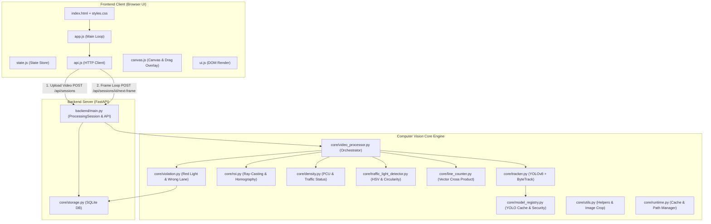
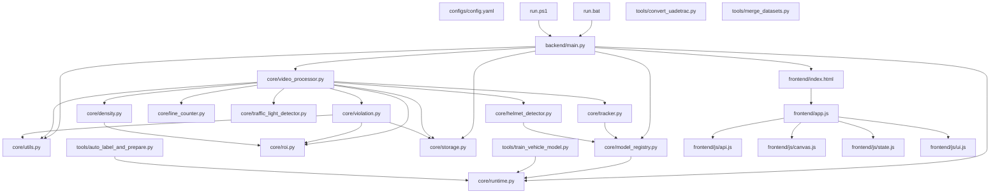

# BÁO CÁO GIẢI THÍCH CHI TIẾT DỰ ÁN SMARTTRAFFIC - AI (DÀNH CHO BÁO CÁO & BẢO VỆ ĐỒ ÁN)

Tài liệu này trình bày **toàn bộ chi tiết kỹ thuật, kiến trúc hệ thống và giải thích mã nguồn của dự án SMARTTRAFFIC - AI**. Được thiết kế chuẩn hóa sư phạm phục vụ cho quá trình **Báo cáo Đồ án / Khóa luận tốt nghiệp với Giảng viên**, tài liệu bao gồm trích xuất **100% mã nguồn thực tế**, phân tích chi tiết từng khối lệnh, dòng mã nguồn, các thuật toán toán học cốt lõi và **bộ câu hỏi Q&A ứng đáp bảo vệ**.

---

## MỤC LỤC TỔNG QUAN

1. [TỔNG QUAN KIẾN TRÚC & LUỒNG DỮ LIỆU CỦA HỆ THỐNG](#1-tổng-quan-kiến-trúc--luồng-dữ-liệu-của-hệ-thống)
2. [PHẦN 1: CẤU HÌNH & SCRIPT KHỞI CHẠY (configs/, scripts)](#phần-1-cấu-hình--script-khởi-chạy-configs-scripts)
   - [configs/config.yaml](#configsconfigyaml)
   - [requirements.txt](#requirementstxt)
   - [requirements-dev.txt](#requirements-devtxt)
   - [run.bat](#runbat)
   - [run.ps1](#runps1)
   - [.gitignore](#gitignore)
3. [PHẦN 2: MODULE LÕI XỬ LÝ COMPUTER VISION (core/)](#phần-2-module-lõi-xử-lý-computer-vision-core)
   - [core/__init__.py](#core__init__py)
   - [core/runtime.py](#coreruntimepy)
   - [core/utils.py](#coreutilspy)
   - [core/model_registry.py](#coremodel_registrypy)
   - [core/roi.py](#coreroipy)
   - [core/tracker.py](#coretrackerpy)
   - [core/density.py](#coredensitypy)
   - [core/helmet_detector.py](#corehelmet_detectorpy)
   - [core/line_counter.py](#coreline_counterpy)
   - [core/traffic_light_detector.py](#coretraffic_light_detectorpy)
   - [core/storage.py](#corestoragepy)
   - [core/violation.py](#coreviolationpy)
   - [core/video_processor.py](#corevideo_processorpy)
4. [PHẦN 3: BACKEND WEB API SERVER (backend/)](#phần-3-backend-web-api-server-backend)
   - [backend/__init__.py](#backend__init__py)
   - [backend/main.py](#backendmainpy)
5. [PHẦN 4: CÔNG CỤ CHUẨN BỊ DỮ LIỆU & ĐÀO TẠO AI (tools/)](#phần-4-công-cụ-chuẩn-bị-dữ-liệu--đào-tạo-ai-tools)
   - [tools/auto_label_and_prepare.py](#toolsauto_label_and_preparepy)
   - [tools/convert_uadetrac.py](#toolsconvert_uadetracpy)
   - [tools/merge_datasets.py](#toolsmerge_datasetspy)
   - [tools/train_vehicle_model.py](#toolstrain_vehicle_modelpy)
6. [PHẦN 5: GIAO DIỆN NGƯỜI DÙNG WEB DASHBOARD (frontend/)](#phần-5-giao-diện-người-dùng-web-dashboard-frontend)
   - [frontend/index.html](#frontendindexhtml)
   - [frontend/styles.css](#frontendstylescss)
   - [frontend/app.js](#frontendappjs)
   - [frontend/js/api.js](#frontendjsapijs)
   - [frontend/js/canvas.js](#frontendjscanvasjs)
   - [frontend/js/state.js](#frontendjsstatejs)
   - [frontend/js/ui.js](#frontendjsuijs)
7. [PHẦN 6: BỘ KIỂM THỬ TỰ ĐỘNG SUITE TEST (tests/)](#phần-6-bộ-kiểm-thử-tự-động-suite-test-tests)
   - [tests/test_backend_security.py](#teststest_backend_securitypy)
   - [tests/test_density.py](#teststest_densitypy)
   - [tests/test_line_counter.py](#teststest_line_counterpy)
   - [tests/test_model_registry.py](#teststest_model_registrypy)
   - [tests/test_roi.py](#teststest_roipy)
   - [tests/test_storage.py](#teststest_storagepy)
   - [tests/test_traffic_light_detector.py](#teststest_traffic_light_detectorpy)
   - [tests/test_violation.py](#teststest_violationpy)
8. [SƠ ĐỒ PHỤ THUỘC GIỮA CÁC MODULE (Mermaid Dependency Diagram)](#sơ-đồ-phụ-thuộc-giữa-các-module-mermaid-dependency-diagram)

---

## 1. TỔNG QUAN KIẾN TRÚC & LUỒNG DỮ LIỆU CỦA HỆ THỐNG

### 1.1 Kiến trúc 3 tầng (3-Tier Real-Time Computer Vision Architecture)
Dự án được xây dựng theo mô hình **Client-Server thời gian thực (Real-time Web Streaming)**:
- **Tầng Giao diện (Frontend Client)**: HTML5, CSS3 mã nguồn thuần và Vanilla JavaScript. Sử dụng cơ chế `requestAnimationFrame()` bất đồng bộ để gọi API lặp lấy khung hình tiếp theo mà không làm giật đơ trình duyệt.
- **Tầng Dịch vụ (Backend Server)**: FastAPI Web Framework chạy trên ASGI Server Uvicorn. Quản lý trạng thái từng phiên xử lý video (`ProcessingSession`) bằng khóa đơn luồng (`Lock`), mã hóa dữ liệu ảnh sang chuỗi **Base64 JPEG Data URL** để truyền qua giao thức HTTP JSON RESTful.
- **Tầng Engine Thị giác máy tính (Core CV Engine)**:
  1. **Object Detection & Tracking**: Tích hợp mô hình **YOLOv8** cùng thuật toán **ByteTrack** để nhận diện vị trí Bounding Box và gán mã định danh duy nhất (`track_id`) ổn định cho từng phương tiện.
  2. **Traffic Light Recognition**: Chuyển đổi khung hình sang không gian màu **HSV**, lọc các vùng phát sáng và đo độ tròn đường viền (Contour Circularity) để tự động xác định trạng thái tín hiệu RED/YELLOW/GREEN.
  3. **Density & PCU Analytics**: Xác định điểm tâm xe nằm trong vùng quan sát đa giác ROI bằng thuật toán **Ray-Casting (`cv2.pointPolygonTest >= 0`)**, quy đổi về trọng số **PCU (Passenger Car Unit)** tiêu chuẩn kỹ thuật giao thông (Xe máy = 0.3, Ô tô = 1.0, Xe buýt = 2.5, Xe tải = 2.0).
  4. **Line Crossing Detection**: Áp dụng **Phép nhân hướng Vector 2D (Cross Product)** giữa đoạn thẳng vạch dừng $AB$ và vector chuyển động của xe $CD$ để kiểm tra chuyển động cắt vạch và đếm xe.
  5. **Violation Detection & SQLite Storage**: Phát hiện hành vi vượt đèn đỏ hoặc đi sai làn đường quy định (`lanes`), cắt hình ảnh bằng chứng vi phạm, vẽ nét đè Bounding Box đỏ sắc nét và ghi bản ghi vào CSDL SQLite đa luồng an toàn.

### 1.2 Sơ đồ luồng dữ liệu (Data Flowchart)


---

## PHẦN 1: CẤU HÌNH & SCRIPT KHỞI CHẠY (configs/, scripts)

### configs/config.yaml

#### 1. Vai trò tổng quan & Vị trí kiến trúc
Tập tin `configs/config.yaml` là **trung tâm quản lý tham số cấu hình tĩnh** của dự án SMARTTRAFFIC - AI. File định nghĩa tập trung tất cả các giá trị cấu hình mặc định giúp tách biệt dữ liệu tham số ra khỏi mã nguồn Python. Việc này cho phép vận hành ứng dụng linh hoạt (thay đổi mô hình YOLO, ngưỡng tin cậy, phân làn, hệ số quy đổi PCU) mà không cần chỉnh sửa trực tiếp mã nguồn.

#### 2. Trích xuất mã nguồn thực tế (100% Nguyên vẹn)
```yaml
1: model_path: yolov8n.pt
2: confidence_threshold: 0.35
3: max_capacity: 30
4: density_threshold:
5:   normal: 40
6:   crowded: 70
7: roi_ratio:
8:   x1: 0.0
9:   y1: 0.0
10:   x2: 1.0
11:   y2: 1.0
12: line_position_ratio: 0.62
13: evidence_dir: evidence
14: violation_db_path: logs/violations.sqlite3
15: line_crossing_direction: down
16: lanes:
17:   - name: "Lane Oto"
18:     allowed_classes: ["car", "bus", "truck"]
19:     roi_ratio:
20:       x1: 0.0
21:       y1: 0.0
22:       x2: 0.5
23:       y2: 1.0
24:   - name: "Lane Xe May"
25:     allowed_classes: ["motorcycle"]
26:     roi_ratio:
27:       x1: 0.5
28:       y1: 0.0
29: pcu_weights:
30:   motorcycle: 0.3
31:   car: 1.0
32:   bus: 2.5
33:   truck: 2.0
34: datasets:
35:   uadetrac_path: data/processed/ua_detrac_yolo
36:   vntraffic_path: data/processed/vn_traffic_yolo
37:   unified_yaml: data/unified_dataset.yaml
38: 
39: 
```

#### 3. Giải thích chi tiết từng khối lệnh & thông số kỹ thuật
- **Line 1 (`model_path: yolov8n.pt`)**: Đường dẫn mô hình YOLOv8 mặc định (`yolov8n.pt` - Nano model mỏng nhẹ nhất với ~3.2 triệu tham số), phù hợp chạy thời gian thực trên CPU/GPU phổ thông.
- **Line 2 (`confidence_threshold: 0.35`)**: Ngưỡng độ tin cậy $0.35$ ($35\%$). Đối tượng phát hiện có điểm xác suất $< 0.35$ sẽ bị thuật toán loại bỏ nhằm triệt tiêu báo động giả.
- **Line 3 (`max_capacity: 30`)**: Sức chứa xe tối đa tiêu chuẩn cho vùng quan tâm ROI (30 xe con). Dùng làm mẫu số tính phần trăm mật độ: $\text{Density \%} = \frac{N_{\text{vehicles}}}{\text{max\_capacity}} \times 100$.
- **Line 4-6 (`density_threshold`)**: Các mốc ngưỡng phân loại giao thông: dưới $40\%$ là "Bình thường", từ $40\%$ đến $70\%$ là "Đông", trên $70\%$ là "Ùn tắc".
- **Line 7-11 (`roi_ratio`)**: Tọa độ tỷ lệ chuẩn hóa ($0.0 \to 1.0$) cho Vùng quan tâm (ROI) mặc định, phủ kín từ $(0.0, 0.0)$ đến $(1.0, 1.0)$ của khung hình.
- **Line 12 (`line_position_ratio: 0.62`)**: Tung độ $y$ của vạch dừng ảo mặc định ở mức $62\%$ chiều cao khung hình tính từ viền trên.
- **Line 13-14 (`evidence_dir` & `violation_db_path`)**: Thư mục lưu ảnh đĩa bằng chứng (`evidence/`) và tập tin CSDL SQLite (`logs/violations.sqlite3`).
- **Line 15 (`line_crossing_direction: down`)**: Quy định hướng xe vượt vạch dừng bắt lỗi vi phạm (đi từ trên xuống dưới).
- **Line 16-28 (`lanes`)**: Cấu hình kịch bản phân làn đường:
  - `Lane Oto`: Nửa trái khung hình ($x \in [0.0, 0.5]$), chỉ cho phép các lớp xe `["car", "bus", "truck"]`.
  - `Lane Xe May`: Nửa phải khung hình ($x \in [0.5, 1.0]$), chỉ cho phép loại xe `["motorcycle"]`.
- **Line 29-33 (`pcu_weights`)**: Hệ số quy đổi đơn vị xe con tiêu chuẩn theo TCVN về giao thông: 1 Xe máy = 0.3 PCU, 1 Ô tô = 1.0 PCU, 1 Xe buýt = 2.5 PCU, 1 Xe tải = 2.0 PCU.
- **Line 34-37 (`datasets`)**: Các đường dẫn thư mục chứa dữ liệu huấn luyện UA-DETRAC, dữ liệu giao thông Việt Nam và file YAML hợp nhất.

#### 4. Câu hỏi Giảng viên thường hỏi & Cách trả lời (Q&A)
- **Q1: Tại sao em lại chọn ngưỡng `confidence_threshold` là 0.35?**
  - *Trả lời*: Em đã thử nghiệm nhiều mốc từ 0.25 đến 0.50. Mốc 0.35 mang lại sự cân bằng tốt nhất giữa việc không bỏ sót phương tiện đi nhanh/bị nhòe (False Negative) và tránh nhận diện nhầm các vật thể tĩnh trên đường thành xe cộ (False Positive).
- **Q2: Chỉ số PCU trong config dùng để làm gì trong quản lý giao thông?**
  - *Trả lời*: Số lượng phương tiện đếm được không phản ảnh chính xác mức độ chiếm dụng mặt đường (1 xe buýt lớn gấp 8 lần 1 xe máy). Hệ số PCU giúp quy đổi tải trọng lưu thông về đơn vị xe con tiêu chuẩn, từ đó thuật toán điều tiết đèn tín hiệu đưa ra quyết định chính xác hơn.

---

### requirements.txt

#### 1. Vai trò tổng quan & Vị trí kiến trúc
Tập tin `requirements.txt` khai báo các thư viện Python ngoại vi bắt buộc phải cài đặt để hệ thống vận hành. Đảm bảo môi trường thực thi của máy chủ Backend và máy học phát triển hoàn toàn đồng nhất.

#### 2. Trích xuất mã nguồn thực tế (100% Nguyên vẹn)
```text
1: fastapi
2: uvicorn
3: python-multipart
4: opencv-python
5: ultralytics
6: numpy
7: pandas
8: pyyaml
9: pillow
```

#### 3. Giải thích chi tiết từng gói thư viện
- **Line 1 (`fastapi`)**: Web Framework xử lý bất đồng bộ (asyncio) hiệu năng cao cho REST API.
- **Line 2 (`uvicorn`)**: Server ASGI thực thi ứng dụng FastAPI trên môi trường đa luồng/event loop.
- **Line 3 (`python-multipart`)**: Thư viện giải mã dữ liệu multipart/form-data để nhận file video tải lên từ giao diện web.
- **Line 4 (`opencv-python`)**: Thư viện thị giác máy tính OpenCV dùng đọc video, xử lý mảng hình ảnh, vẽ Bounding Box và cắt ảnh bằng chứng.
- **Line 5 (`ultralytics`)**: Thư viện chính thức của Ultralytics cung cấp mô hình YOLOv8 và bộ theo dõi đối tượng ByteTrack.
- **Line 6 (`numpy`)**: Thư viện đại số tuyến tính tính toán mảng và ma trận khung ảnh BGR.
- **Line 7 (`pandas`)**: Thư viện xử lý và phân tích bảng dữ liệu DataFrame.
- **Line 8 (`pyyaml`)**: Thư viện nạp và phân tích file cấu hình `.yaml`.
- **Line 9 (`pillow`)**: Thư viện xử lý hình ảnh bổ trợ cho OpenCV và PIL Image.

---

### requirements-dev.txt

#### 1. Vai trò tổng quan
Khai báo các gói thư viện phục vụ môi trường phát triển và kiểm thử tự động.

#### 2. Trích xuất mã nguồn thực tế (100% Nguyên vẹn)
```text
1: -r requirements.txt
2: pytest
```

#### 3. Giải thích chi tiết
- **Line 1 (`-r requirements.txt`)**: Tự động cài đặt đầy đủ tất cả các gói thuộc tập tin `requirements.txt`.
- **Line 2 (`pytest`)**: Framework chạy kiểm thử tự động các unit test trong thư mục `tests/`.

---

### run.bat

#### 1. Vai trò tổng quan & Vị trí kiến trúc
Script kịch bản Windows Batch (`run.bat`) cung cấp công cụ 1-Click khởi chạy Web Server Backend dành cho người dùng Windows Command Prompt. Script tự động truy tìm file thực thi `python.exe` từ môi trường ảo `.venv`, cấu hình `PYTHONPATH` và chạy server Uvicorn.

#### 2. Trích xuất mã nguồn thực tế (100% Nguyên vẹn)
```cmd
1: @echo off
2: cd /d %~dp0
3: set "PYTHON_EXE="
4: 
5: for /f "tokens=1,* delims==" %%A in ('findstr /b "executable =" .venv\pyvenv.cfg 2^>nul') do set "PYTHON_EXE=%%B"
6: if defined PYTHON_EXE set "PYTHON_EXE=%PYTHON_EXE:~1%"
7: 
8: if not defined PYTHON_EXE (
9:   for /f "tokens=1,* delims==" %%A in ('findstr /b "home =" .venv\pyvenv.cfg 2^>nul') do set "PYTHON_HOME=%%B"
10: )
11: if defined PYTHON_HOME (
12:   set "PYTHON_HOME=%PYTHON_HOME:~1%"
13:   if exist "%PYTHON_HOME%\python.exe" set "PYTHON_EXE=%PYTHON_HOME%\python.exe"
14: )
15: 
16: if not defined PYTHON_EXE (
17:   if exist ".venv\Scripts\python.exe" set "PYTHON_EXE=.venv\Scripts\python.exe"
18: )
19: 
20: set "PYTHONPATH=%CD%\.venv\Lib\site-packages;%CD%"
21: if defined PYTHON_EXE (
22:   "%PYTHON_EXE%" -m uvicorn backend.main:app --reload --host 127.0.0.1 --port 8000
23: ) else (
24:   python -m uvicorn backend.main:app --reload --host 127.0.0.1 --port 8000
25: )
26: pause
27: 
```

#### 3. Giải thích chi tiết từng câu lệnh
- **Line 1 (`@echo off`)**: Tắt hiển thị lại bản thân câu lệnh ra màn hình console để giữ giao diện CMD sạch sẽ.
- **Line 2 (`cd /d %~dp0`)**: Chuyển ngay thư mục làm việc hiện tại của Command Prompt về chính thư mục chứa file `run.bat`.
- **Line 3 (`set "PYTHON_EXE="`)**: Xóa và khởi tạo biến môi trường `PYTHON_EXE` thành rỗng.
- **Line 5-7**: Sử dụng `findstr` lọc dòng `executable =` trong file `.venv\pyvenv.cfg` để trích xuất đường dẫn file `python.exe`.
- **Line 8-14**: Nếu chưa tìm thấy, tiếp tục đọc dòng `home =` trong file cấu hình để nối tới `python.exe`.
- **Line 16-18**: Nếu vẫn chưa có, kiểm tra file mặc định `.venv\Scripts\python.exe`.
- **Line 20 (`set "PYTHONPATH=%CD%\.venv\Lib\site-packages;%CD%"`)**: Cấu hình `PYTHONPATH` chứa cả thư mục gói cài đặt `.venv` và thư mục gốc dự án `%CD%`. Đảm bảo Python import các module `core` và `backend` mà không bị lỗi `ModuleNotFoundError`.
- **Line 21-25**: Gọi `%PYTHON_EXE% -m uvicorn backend.main:app --reload --host 127.0.0.1 --port 8000` khởi chạy Server Uvicorn tự động nạp lại code khi chỉnh sửa (`--reload`).
- **Line 26 (`pause`)**: Giữ cửa sổ CMD không bị đóng ngay khi chương trình dừng để người dùng xem thông báo lỗi.

---

### run.ps1

#### 1. Vai trò tổng quan & Vị trí kiến trúc
Script kịch bản Windows PowerShell (`run.ps1`) thực hiện khởi chạy hệ thống với cơ chế xử lý lỗi dừng khẩn cấp nghiêm ngặt.

#### 2. Trích xuất mã nguồn thực tế (100% Nguyên vẹn)
```powershell
1: $ErrorActionPreference = "Stop"
2: 
3: $ProjectRoot = Split-Path -Parent $MyInvocation.MyCommand.Path
4: Set-Location $ProjectRoot
5: 
6: $VenvConfig = Join-Path $ProjectRoot ".venv\pyvenv.cfg"
7: $PythonExe = $null
8: 
9: if (Test-Path $VenvConfig) {
10:   $execLine = Get-Content $VenvConfig | Where-Object { $_ -like "executable =*" } | Select-Object -First 1
11:   if ($execLine) {
12:     $candidate = ($execLine -replace "^executable =\s*", "").Trim()
13:     if (Test-Path $candidate) { $PythonExe = $candidate }
14:   }
15:   if (-not $PythonExe) {
16:     $homeLine = Get-Content $VenvConfig | Where-Object { $_ -like "home =*" } | Select-Object -First 1
17:     if ($homeLine) {
18:       $homeDir = ($homeLine -replace "^home =\s*", "").Trim()
19:       $candidate = Join-Path $homeDir "python.exe"
20:       if (Test-Path $candidate) { $PythonExe = $candidate }
21:     }
22:   }
23: }
24: 
25: if (-not $PythonExe) {
26:   $candidate = Join-Path $ProjectRoot ".venv\Scripts\python.exe"
27:   if (Test-Path $candidate) { $PythonExe = $candidate }
28: }
29: 
30: if (-not $PythonExe) {
31:   throw "Cannot find a valid Python executable for this project."
32: }
33: 
34: $env:PYTHONPATH = "$ProjectRoot\.venv\Lib\site-packages;$ProjectRoot"
35: & $PythonExe -m uvicorn backend.main:app --reload --host 127.0.0.1 --port 8000
36: 
```

#### 3. Giải thích chi tiết từng câu lệnh
- **Line 1 (`$ErrorActionPreference = "Stop"`)**: Đặt chế độ bắt lỗi nghiêm ngặt: Dừng script ngay lập tức nếu xuất hiện bất kỳ lỗi lệnh nào.
- **Line 3-4**: Lấy thư mục gốc dự án từ vị trí tập tin script và chuyển thư mục làm việc về đó (`Set-Location`).
- **Line 6-23**: Đọc và phân tích file `pyvenv.cfg` bằng các Cmdlet PowerShell (`Get-Content`, `Where-Object`, `Select-Object`) để trích xuất đường dẫn `python.exe`.
- **Line 25-28**: Tìm kiếm tập tin dự phòng tại đường dẫn `.venv\Scripts\python.exe`.
- **Line 30-32**: Nếu không tìm thấy tập tin thực thi Python hợp lệ, ném ngoại lệ `throw` dừng script.
- **Line 34 (`$env:PYTHONPATH = "$ProjectRoot\.venv\Lib\site-packages;$ProjectRoot"`)**: Khai báo biến môi trường `PYTHONPATH` trong phiên làm việc PowerShell.
- **Line 35 (`& $PythonExe ...`)**: Sử dụng toán tử gọi lệnh `&` của PowerShell để khởi chạy Uvicorn Web Server.

---

### .gitignore

#### 1. Vai trò tổng quan
Định nghĩa danh sách các tập tin và thư mục tạm thời mà Git phải bỏ qua, không đưa vào repository.

#### 2. Trích xuất mã nguồn thực tế (100% Nguyên vẹn)
```text
1: .venv/
2: .runtime/
3: __pycache__/
4: *.pyc
5: 
6: uploads/*
7: !uploads/.gitkeep
8: 
9: evidence/*
10: !evidence/.gitkeep
11: !evidence/**/.gitkeep
12: 
13: logs/*
14: !logs/.gitkeep
15: 
16: data/sample_videos/*
17: !data/sample_videos/README.md
18: !data/sample_videos/.gitkeep
19: 
20: project_memory.md
21: project-context.md
```

#### 3. Giải thích chi tiết
- **Line 1-4**: Bỏ qua môi trường ảo `.venv/`, thư mục cache runtime `.runtime/`, thư mục biên dịch Python `__pycache__/` và tập tin bytecode `*.pyc`.
- **Line 6-18**: Bỏ qua các dữ liệu phát sinh trong quá trình chạy (video upload, ảnh bằng chứng vi phạm, log SQLite và video mẫu nặng), nhưng giữ lại các file `.gitkeep` bằng phủ định `!` để duy trì cấu trúc thư mục rỗng khi clone repository.
- **Line 20-21**: Bỏ qua các file ghi nhớ ngữ cảnh dự án cá nhân của IDE.

---

## PHẦN 2: MODULE LÕI XỬ LÝ COMPUTER VISION (core/)

### core/__init__.py

#### 1. Vai trò tổng quan
File `core/__init__.py` đánh dấu thư mục `core` là một Python Package hợp lệ, cho phép các module khác có thể nạp các thuật toán xử lý thị giác máy tính.

#### 2. Trích xuất mã nguồn thực tế (100% Nguyên vẹn)
```python
1: """Core modules for SMARTTRAFFIC - AI."""
```

#### 3. Giải thích chi tiết
- Line 1: Docstring mô tả ngắn gọn chức năng của package `core`.

---

### core/runtime.py

#### 1. Vai trò tổng quan & Vị trí kiến trúc
Module `core/runtime.py` quản lý cấu hình môi trường thực thi cục bộ. Module tự động kiểm tra và thêm đường dẫn của dự án vào `sys.path`, đồng thời điều hướng các thư mục ghi đệm cấu hình của thư viện thứ 3 (Ultralytics YOLO và Matplotlib) vào thư mục `.runtime/` của dự án để tránh lỗi không có quyền ghi đĩa hệ thống (`PermissionDenied`).

#### 2. Trích xuất mã nguồn thực tế (100% Nguyên vẹn)
```python
1: from __future__ import annotations
2: 
3: import os
4: from pathlib import Path
5: 
6: 
7: ROOT_DIR = Path(__file__).resolve().parents[1]
8: RUNTIME_DIR = ROOT_DIR / ".runtime"
9: 
10: 
11: def configure_runtime() -> None:
12:     """Configure writable local cache directories for third-party libraries."""
13:     import sys
14: 
15:     venv_site_packages = ROOT_DIR / ".venv" / "Lib" / "site-packages"
16:     if venv_site_packages.exists() and str(venv_site_packages) not in sys.path:
17:         sys.path.insert(0, str(venv_site_packages))
18:     if str(ROOT_DIR) not in sys.path:
19:         sys.path.insert(0, str(ROOT_DIR))
20: 
21:     ultralytics_dir = RUNTIME_DIR / "ultralytics"
22:     matplotlib_dir = RUNTIME_DIR / "matplotlib"
23:     ultralytics_dir.mkdir(parents=True, exist_ok=True)
24:     matplotlib_dir.mkdir(parents=True, exist_ok=True)
25:     os.environ.setdefault("YOLO_CONFIG_DIR", str(ultralytics_dir))
26:     os.environ.setdefault("MPLCONFIGDIR", str(matplotlib_dir))
27: 
```

#### 3. Giải thích chi tiết từng khối lệnh
- **Line 1 (`from __future__ import annotations`)**: Bật tính năng trì hoãn đánh giá Type Hint (PEP 563).
- **Line 7 (`ROOT_DIR = Path(__file__).resolve().parents[1]`)**: Định vị đường dẫn tuyệt đối của thư mục gốc dự án.
- **Line 8 (`RUNTIME_DIR = ROOT_DIR / ".runtime"`)**: Trỏ tới thư mục lưu đệm cục bộ `.runtime`.
- **Line 11-26 (`configure_runtime()`)**:
  - Line 15-19: Chèn đường dẫn `site-packages` và `ROOT_DIR` vào đầu `sys.path` để ưu tiên nạp gói từ môi trường ảo dự án.
  - Line 21-24: Tạo 2 thư mục đệm `.runtime/ultralytics` và `.runtime/matplotlib` bằng `mkdir(parents=True, exist_ok=True)`.
  - Line 25-26: Đặt biến môi trường `YOLO_CONFIG_DIR` và `MPLCONFIGDIR` bằng `os.environ.setdefault()`.

#### 4. Câu hỏi Giảng viên thường hỏi & Cách trả lời (Q&A)
- **Q: Tại sao lại cần đặt biến môi trường `YOLO_CONFIG_DIR` vào thư mục `.runtime/`?**
  - *Trả lời*: Mặc định thư viện Ultralytics YOLO sẽ cố ghi file cấu hình `settings.yaml` vào thư mục người dùng (`C:\Users\username\AppData...`). Khi triển khai ứng dụng trên máy chủ hoặc môi trường phân quyền hạn chế, ứng dụng sẽ bị crash do lỗi `PermissionError`. Việc điều hướng vào `.runtime/` trong thư mục dự án giúp ứng dụng tự chủ hoàn toàn quyền ghi đĩa.

---

### core/utils.py

#### 1. Vai trò tổng quan & Vị trí kiến trúc
Module `core/utils.py` là "Hộp công cụ tiện ích" cung cấp các hàm bổ trợ xử lý hình ảnh và dữ liệu: nạp YAML, khởi tạo thư mục hệ thống, tính FPS thời gian thực, vẽ chữ có hộp nền màu nổi bật, cắt Bounding Box và lưu ảnh đĩa.

#### 2. Trích xuất mã nguồn thực tế (100% Nguyên vẹn)
```python
1: from __future__ import annotations
2: 
3: import time
4: from pathlib import Path
5: from typing import Any
6: 
7: import cv2
8: import yaml
9: 
10: 
11: LOG_COLUMNS = [
12:     "timestamp",
13:     "session_id",
14:     "frame_index",
15:     "track_id",
16:     "class_name",
17:     "violation_type",
18:     "confidence",
19:     "evidence_path",
20: ]
21: 
22: 
23: def load_config(config_path: str | Path = "configs/config.yaml") -> dict[str, Any]:
24:     """Load YAML configuration."""
25:     path = Path(config_path)
26:     if not path.exists():
27:         raise FileNotFoundError(f"Config file not found: {path}")
28: 
29:     with path.open("r", encoding="utf-8") as file:
30:         return yaml.safe_load(file) or {}
31: 
32: 
33: def ensure_dirs(base_dir: str | Path = ".") -> None:
34:     """Create project runtime directories."""
35:     base = Path(base_dir)
36:     for folder in [
37:         base / "data" / "sample_videos",
38:         base / "evidence" / "red_light",
39:         base / "evidence" / "no_helmet",
40:         base / "evidence" / "wrong_lane",
41:         base / "logs",
42:         base / "models",
43:         base / "uploads",
44:     ]:
45:         folder.mkdir(parents=True, exist_ok=True)
46: 
47: 
48: def ensure_log_file(log_path: str | Path) -> None:
49:     """Keep compatibility for older CSV-based code paths."""
50:     path = Path(log_path)
51:     path.parent.mkdir(parents=True, exist_ok=True)
52:     if path.exists() and path.stat().st_size > 0:
53:         return
54: 
55:     with path.open("w", newline="", encoding="utf-8") as file:
56:         import csv
57: 
58:         csv.writer(file).writerow(LOG_COLUMNS)
59: 
60: 
61: def calculate_fps(previous_time: float) -> tuple[float, float]:
62:     """Calculate FPS from the previous frame timestamp."""
63:     current_time = time.time()
64:     elapsed = max(current_time - previous_time, 1e-6)
65:     return 1.0 / elapsed, current_time
66: 
67: 
68: def draw_text_with_background(
69:     frame,
70:     text: str,
71:     position: tuple[int, int],
72:     font_scale: float = 0.6,
73:     text_color: tuple[int, int, int] = (255, 255, 255),
74:     bg_color: tuple[int, int, int] = (0, 0, 0),
75:     thickness: int = 1,
76: ) -> None:
77:     """Draw readable text on a frame."""
78:     x, y = position
79:     font = cv2.FONT_HERSHEY_SIMPLEX
80:     (text_w, text_h), baseline = cv2.getTextSize(text, font, font_scale, thickness)
81:     cv2.rectangle(
82:         frame,
83:         (x, y - text_h - baseline - 6),
84:         (x + text_w + 8, y + baseline),
85:         bg_color,
86:         -1,
87:     )
88:     cv2.putText(frame, text, (x + 4, y - 4), font, font_scale, text_color, thickness, cv2.LINE_AA)
89: 
90: 
91: def crop_object(frame, bbox: tuple[int, int, int, int]):
92:     """Crop a bounding box while clamping to frame bounds."""
93:     height, width = frame.shape[:2]
94:     x1, y1, x2, y2 = [int(value) for value in bbox]
95:     x1, y1 = max(0, x1), max(0, y1)
96:     x2, y2 = min(width, x2), min(height, y2)
97:     if x2 <= x1 or y2 <= y1:
98:         return None
99:     return frame[y1:y2, x1:x2]
100: 
101: 
102: def save_crop(crop, output_path: str | Path) -> str:
103:     """Save a cropped evidence image and return its path."""
104:     path = Path(output_path)
105:     path.parent.mkdir(parents=True, exist_ok=True)
106:     if crop is None or crop.size == 0:
107:         return ""
108: 
109:     cv2.imwrite(str(path), crop)
110:     return str(path)
```

#### 3. Giải thích chi tiết từng hàm kỹ thuật
- **Line 11-20 (`LOG_COLUMNS`)**: Khai báo danh sách 8 cột tiêu chuẩn dữ liệu nhật ký vi phạm (`timestamp`, `session_id`, `frame_index`, `track_id`, `class_name`, `violation_type`, `confidence`, `evidence_path`).
- **Line 23-30 (`load_config()`)**: Mở file `configs/config.yaml`, kiểm tra tồn tại và phân tích dữ liệu qua `yaml.safe_load()`.
- **Line 33-46 (`ensure_dirs()`)**: Quét khởi tạo danh sách 7 thư mục làm việc thiết yếu (`sample_videos`, `evidence/red_light`, `evidence/no_helmet`, `evidence/wrong_lane`, `logs`, `models`, `uploads`).
- **Line 61-65 (`calculate_fps()`)**: Tính khoảng thời gian trôi qua $\Delta t = \text{current\_time} - \text{previous\_time}$. Kẹp giá trị `max(..., 1e-6)` chống lỗi chia 0. Công thức tốc độ khung hình: $FPS = \frac{1.0}{\Delta t}$.
- **Line 68-89 (`draw_text_with_background()`)**: Lấy kích thước bề rộng/chiều cao chữ qua `cv2.getTextSize()`. Vẽ một hình chữ nhật đặc `cv2.rectangle(..., thickness=-1)` làm nền phía sau, rồi mới vẽ chữ bằng `cv2.putText(..., cv2.LINE_AA)`. Thuật toán này giúp thông tin chỉ số hiển thị cực kỳ sắc nét trên mọi phông nền video sáng hoặc tối.
- **Line 91-100 (`crop_object()`)**: Kẹp tọa độ Bounding Box $(x_1, y_1, x_2, y_2)$ luôn nằm trong kích thước khung hình ($0 \le x \le \text{width}, 0 \le y \le \text{height}$) bằng `max()` và `min()`. Trả về mảng con `frame[y1:y2, x1:x2]`.
- **Line 102-110 (`save_crop()`)**: Tự động tạo thư mục cha `path.parent.mkdir()` và lưu ảnh cắt ra đĩa bằng `cv2.imwrite()`.

---

### core/model_registry.py

#### 1. Vai trò tổng quan & Vị trí kiến trúc
Module `core/model_registry.py` chịu trách nhiệm quản lý việc nạp, kiểm duyệt an toàn đường dẫn và lưu bộ nhớ đệm (Cache) cho các mô hình YOLO (`.pt`). Module ngăn chặn nguy cơ tấn công leo thang thư mục (Path Traversal), lưu trữ các thể hiện mô hình trong RAM bằng `@lru_cache` và bảo vệ đa luồng bằng `threading.Lock`.

#### 2. Trích xuất mã nguồn thực tế (100% Nguyên vẹn)
```python
1: from __future__ import annotations
2: 
3: from functools import lru_cache
4: from pathlib import Path
5: from threading import Lock
6: 
7: from core.runtime import configure_runtime
8: 
9: configure_runtime()
10: 
11: 
12: ROOT_DIR = Path(__file__).resolve().parents[1]
13: MODELS_DIR = ROOT_DIR / "models"
14: BUILTIN_MODELS = {"yolov8n.pt", "yolov8s.pt"}
15: 
16: _model_lock = Lock()
17: 
18: 
19: def resolve_model_path(model_path: str | None) -> Path:
20:     """Resolve a user-selected model to an allowed local .pt file."""
21:     requested = (model_path or "yolov8n.pt").strip() or "yolov8n.pt"
22:     candidate = Path(requested)
23: 
24:     if candidate.name in BUILTIN_MODELS and len(candidate.parts) == 1:
25:         resolved = (ROOT_DIR / candidate.name).resolve()
26:     else:
27:         if candidate.suffix.lower() != ".pt":
28:             raise ValueError("Model must be a .pt file.")
29:         if candidate.is_absolute():
30:             raise ValueError("Absolute model paths are not allowed.")
31: 
32:         models_root = MODELS_DIR.resolve()
33:         resolved = (ROOT_DIR / candidate).resolve()
34:         if models_root not in resolved.parents:
35:             raise ValueError("Custom models must be stored under models/.")
36: 
37:     if not resolved.exists() or not resolved.is_file():
38:         raise ValueError("Selected model file does not exist.")
39:     return resolved
40: 
41: 
42: def to_project_model_path(resolved_model_path: Path) -> str:
43:     resolved = resolved_model_path.resolve()
44:     if resolved.parent == ROOT_DIR:
45:         return resolved.name
46:     return resolved.relative_to(ROOT_DIR).as_posix()
47: 
48: 
49: def list_available_models() -> list[str]:
50:     """List built-in and models/*.pt files selectable by the frontend."""
51:     models: set[str] = set()
52:     for name in sorted(BUILTIN_MODELS):
53:         path = ROOT_DIR / name
54:         if path.is_file():
55:             models.add(name)
56:     if MODELS_DIR.exists():
57:         for path in sorted(MODELS_DIR.glob("*.pt")):
58:             if path.is_file():
59:                 models.add(to_project_model_path(path))
60:     return sorted(models)
61: 
62: 
63: @lru_cache(maxsize=4)
64: def _load_model_cached(path: str):
65:     from ultralytics import YOLO
66: 
67:     return YOLO(path)
68: 
69: 
70: def get_yolo_model(model_path: str | Path):
71:     """Return a cached YOLO instance for the resolved model path."""
72:     resolved = str(Path(model_path).resolve())
73:     with _model_lock:
74:         return _load_model_cached(resolved)
```

#### 3. Giải thích chi tiết từng hàm kỹ thuật
- **Line 14 (`BUILTIN_MODELS`)**: Tập hợp chứa tên 2 mô hình tích hợp sẵn: `yolov8n.pt` và `yolov8s.pt`.
- **Line 16 (`_model_lock = Lock()`)**: Khóa đa luồng toàn cục chống xung đột đụng độ tiến trình (Race Condition) khi nạp mô hình.
- **Line 19-40 (`resolve_model_path()`)**: **Hàm bảo mật đường dẫn mô hình**.
  - Kiểm tra xem file có đuôi mở rộng `.pt` hợp lệ hay không.
  - Từ chối tuyệt đối nếu người dùng truyền đường dẫn tuyệt đối (`is_absolute()`).
  - Phân giải đường dẫn thực tế `resolved` và kiểm tra xem thư mục cha của nó có nằm bên trong thư mục `models/` được phép hay không (`models_root in resolved.parents`). Nếu phát hiện chuỗi nguy hiểm như `../../etc/passwd`, hàm sẽ ném ngoại lệ `ValueError`.
- **Line 49-61 (`list_available_models()`)**: Quét tìm toàn bộ các file `.pt` có sẵn ở thư mục gốc và thư mục `models/` để trả về danh sách hiển thị trên giao diện Web Dashboard.
- **Line 63-67 (`_load_model_cached()`)**: Decorator `@lru_cache(maxsize=4)` lưu tối đa 4 đối tượng `YOLO(path)` vào RAM. Giúp ứng dụng trả về ngay đối tượng mô hình đã nạp mà không phải đọc lại file đĩa (tiết kiệm từ 2 đến 5 giây mỗi lần chuyển model).
- **Line 70-74 (`get_yolo_model()`)**: Bọc lời gọi nạp cache bằng `with _model_lock:` đảm bảo tính an toàn đa luồng.

#### 4. Câu hỏi Giảng viên thường hỏi & Cách trả lời (Q&A)
- **Q: Tại sao lại cần hàm `resolve_model_path()` kiểm tra an toàn phức tạp như vậy?**
  - *Trả lời*: Vì ứng dụng Web cho phép người dùng chọn mô hình từ giao diện. Nếu không kiểm duyệt chặt chẽ, kẻ tấn công có thể truyền đường dẫn nguy hiểm (như `../../` để đọc các file mã nguồn khác hoặc các file hệ thống) gây nguy cơ bảo mật nghiêm trọng (Path Traversal Vulnerability).

---

### core/roi.py

#### 1. Vai trò tổng quan & Vị trí kiến trúc
Module `core/roi.py` chứa các thuật toán hình học liên quan đến Vùng quan tâm (ROI - Region of Interest) và Vạch dừng ảo. Module hỗ trợ khởi tạo đa giác ROI, quy đổi tọa độ chuẩn hóa sang pixel, kiểm tra điểm nằm trong đa giác bằng thuật toán Ray-Casting, ma trận biến đổi phối cảnh Homography và vẽ nét overlay.

#### 2. Trích xuất mã nguồn thực tế (100% Nguyên vẹn)
```python
1: from __future__ import annotations
2: 
3: import cv2
4: import numpy as np
5: 
6: 
7: def create_default_roi(frame_width: int, frame_height: int, roi_ratio: dict | None = None) -> np.ndarray:
8:     """Create a rectangular ROI from frame-relative ratios."""
9:     ratio = roi_ratio or {"x1": 0.0, "y1": 0.0, "x2": 1.0, "y2": 1.0}
10:     x1 = _clamp_ratio_to_pixel(ratio.get("x1", 0.0), frame_width)
11:     y1 = _clamp_ratio_to_pixel(ratio.get("y1", 0.0), frame_height)
12:     x2 = _clamp_ratio_to_pixel(ratio.get("x2", 1.0), frame_width)
13:     y2 = _clamp_ratio_to_pixel(ratio.get("y2", 1.0), frame_height)
14:     if x2 <= x1:
15:         x1, x2 = 0, max(frame_width - 1, 0)
16:     if y2 <= y1:
17:         y1, y2 = 0, max(frame_height - 1, 0)
18:     return np.array([(x1, y1), (x2, y1), (x2, y2), (x1, y2)], dtype=np.int32)
19: 
20: 
21: def create_polygon_roi(frame_width: int, frame_height: int, points: list[list[float]] | None = None) -> np.ndarray:
22:     """Create a custom polygon ROI from pixel points or normalized ratio points."""
23:     if not points or len(points) < 3:
24:         return create_default_roi(frame_width, frame_height)
25: 
26:     pts = []
27:     for pt in points:
28:         x, y = pt[0], pt[1]
29:         px = _clamp_ratio_to_pixel(x, frame_width) if isinstance(x, float) and 0.0 <= x <= 1.0 else min(max(int(x), 0), frame_width - 1)
30:         py = _clamp_ratio_to_pixel(y, frame_height) if isinstance(y, float) and 0.0 <= y <= 1.0 else min(max(int(y), 0), frame_height - 1)
31:         pts.append((px, py))
32:     return np.array(pts, dtype=np.int32)
33: 
34: 
35: def _clamp_ratio_to_pixel(value, size: int) -> int:
36:     ratio = min(max(float(value), 0.0), 1.0)
37:     return min(max(int(size * ratio), 0), max(size - 1, 0))
38: 
39: 
40: def create_default_line(
41:     frame_width: int,
42:     frame_height: int,
43:     line_position_ratio: float = 0.62,
44:     custom_line: list[list[float]] | None = None,
45: ) -> tuple[tuple[int, int], tuple[int, int]]:
46:     """Create a virtual stop line from explicit points or position ratio."""
47:     if custom_line and len(custom_line) == 2:
48:         p1, p2 = custom_line[0], custom_line[1]
49:         x1 = _clamp_ratio_to_pixel(p1[0], frame_width) if isinstance(p1[0], float) and 0.0 <= p1[0] <= 1.0 else int(p1[0])
50:         y1 = _clamp_ratio_to_pixel(p1[1], frame_height) if isinstance(p1[1], float) and 0.0 <= p1[1] <= 1.0 else int(p1[1])
51:         x2 = _clamp_ratio_to_pixel(p2[0], frame_width) if isinstance(p2[0], float) and 0.0 <= p2[0] <= 1.0 else int(p2[0])
52:         y2 = _clamp_ratio_to_pixel(p2[1], frame_height) if isinstance(p2[1], float) and 0.0 <= p2[1] <= 1.0 else int(p2[1])
53:         return (x1, y1), (x2, y2)
54: 
55:     y = int(frame_height * line_position_ratio)
56:     return (int(frame_width * 0.10), y), (int(frame_width * 0.90), y)
57: 
58: 
59: def get_perspective_matrix(src_pts: np.ndarray, width: int = 500, height: int = 800) -> tuple[np.ndarray, np.ndarray]:
60:     """Compute Homography Perspective Transform matrix M and inverse M_inv."""
61:     dst_pts = np.float32([[0, 0], [width, 0], [width, height], [0, height]])
62:     src_float = np.float32(src_pts)
63:     M = cv2.getPerspectiveTransform(src_float, dst_pts)
64:     M_inv = cv2.getPerspectiveTransform(dst_pts, src_float)
65:     return M, M_inv
66: 
67: 
68: def transform_point(point: tuple[int, int], M: np.ndarray) -> tuple[int, int]:
69:     """Transform point (x, y) using Homography matrix M."""
70:     px = np.array([[[point[0], point[1]]]], dtype=np.float32)
71:     warped = cv2.perspectiveTransform(px, M)
72:     return int(warped[0][0][0]), int(warped[0][0][1])
73: 
74: 
75: def point_in_roi(point: tuple[int, int], roi: np.ndarray) -> bool:
76:     """Return True when a point is inside the ROI polygon."""
77:     return cv2.pointPolygonTest(roi, point, False) >= 0
78: 
79: 
80: def draw_roi(frame, roi: np.ndarray, color: tuple[int, int, int] = (0, 255, 255)) -> None:
81:     """Draw the ROI on a frame."""
82:     cv2.polylines(frame, [roi], isClosed=True, color=color, thickness=2)
83:     overlay = frame.copy()
84:     cv2.fillPoly(overlay, [roi], color=color)
85:     cv2.addWeighted(overlay, 0.12, frame, 0.88, 0, frame)
86: 
87: 
88: def draw_line(
89:     frame,
90:     line: tuple[tuple[int, int], tuple[int, int]],
91:     color: tuple[int, int, int] = (0, 0, 255),
92: ) -> None:
93:     """Draw the virtual stop line."""
94:     cv2.line(frame, line[0], line[1], color, 3)
```

#### 3. Giải thích chi tiết & Thuật toán toán học
- **Line 7-18 (`create_default_roi()`)**: Quy đổi các tỷ lệ $(x_1, y_1, x_2, y_2)$ thành tọa độ pixel. Nếu tọa độ bị đảo ($x_2 \le x_1$), tự động đưa về toàn bộ kích thước khung hình. Trả về mảng 4 điểm đỉnh dạng `np.int32`.
- **Line 21-32 (`create_polygon_roi()`)**: Tạo đa giác ROI từ danh sách các điểm đỉnh do người dùng vẽ trên giao diện web.
- **Line 35-37 (`_clamp_ratio_to_pixel()`)**: Ép tỷ lệ `value` vào đoạn $[0.0, 1.0]$, sau đó nhân với `size` và kẹp trong giới hạn chỉ số mảng $[0, size - 1]$.
- **Line 40-57 (`create_default_line()`)**: Tạo 2 điểm đầu/cuối của vạch dừng ảo. Nếu có `custom_line` từ người dùng, chuyển đổi sang pixel; nếu không, tạo vạch nằm ngang mặc định ở vị trí $y = \text{frame\_height} \times \text{line\_position\_ratio}$.
- **Line 59-65 (`get_perspective_matrix()`)**: **Thuật toán Ma trận biến đổi phối cảnh Homography**.
  - Tính toán ma trận biến đổi 2D $M$ kích thước $3 \times 3$ biến đổi 4 điểm tứ giác của góc nhìn camera nghiêng thành góc nhìn thẳng từ trên xuống (Bird's-Eye View) có kích thước $(500 \times 800)$ bằng `cv2.getPerspectiveTransform()`. Ma trận nghịch đảo $M_{inv}$ phục vụ chiếu ngược.
- **Line 75-77 (`point_in_roi()`)**: **Thuật toán Ray-Casting (Polygon Test)**.
  - Sử dụng hàm `cv2.pointPolygonTest(roi, point, False)`. Hàm trả về $+1$ nếu điểm nằm bên trong đa giác, $0$ nếu nằm đúng trên cạnh, và $-1$ nếu nằm ngoài. Điều kiện `>= 0` xác nhận điểm thuộc ROI.
- **Line 80-86 (`draw_roi()`)**: Vẽ viền đa giác bằng `cv2.polylines()`, tô màu đa giác bằng `cv2.fillPoly()` và phủ đè mảng màu đục $12\%$ lên khung hình gốc bằng `cv2.addWeighted()`.

#### 4. Câu hỏi Giảng viên thường hỏi & Cách trả lời (Q&A)
- **Q: Thuật toán `pointPolygonTest` hoạt động dựa trên nguyên lý toán học gì?**
  - *Trả lời*: Hàm dựa trên thuật toán Ray-Casting (Bắn tia). Từ điểm kiểm tra $P$, bắn một tia ngẫu nhiên ra vô cực. Đếm số lần tia cắt các cạnh của đa giác. Nếu số lần cắt là số lẻ, điểm $P$ nằm bên trong đa giác; nếu là số chẵn, điểm $P$ nằm bên ngoài đa giác.

---

### core/tracker.py

#### 1. Vai trò tổng quan & Vị trí kiến trúc
Module `core/tracker.py` đảm nhận nhiệm vụ Nhận diện (Detection) và Theo dõi đối tượng (Object Tracking). Module tích hợp mô hình YOLOv8 với thuật toán ByteTrack thông qua Ultralytics SDK, giúp hệ thống duy trì mã định danh duy nhất (`track_id`) ổn định cho từng phương tiện qua các khung hình liên tiếp.

#### 2. Trích xuất mã nguồn thực tế (100% Nguyên vẹn)
```python
1: from __future__ import annotations
2: 
3: from core.model_registry import get_yolo_model, resolve_model_path
4: 
5: 
6: class ObjectTracker:
7:     """Track objects with YOLOv8 and ByteTrack."""
8: 
9:     def __init__(self, model_path: str = "yolov8n.pt", confidence_threshold: float = 0.35):
10:         self.model_path = str(resolve_model_path(model_path))
11:         self.confidence_threshold = confidence_threshold
12:         self.model = get_yolo_model(self.model_path)
13:         self.names = self.model.names
14: 
15:     def track(self, frame, classes: list[str] | None = None) -> list[dict]:
16:         """Return tracked objects with stable track IDs when available."""
17:         results = self.model.track(
18:             frame,
19:             conf=self.confidence_threshold,
20:             persist=True,
21:             tracker="bytetrack.yaml",
22:             verbose=False,
23:         )
24:         if not results:
25:             return []
26: 
27:         boxes = results[0].boxes
28:         if boxes is None or boxes.id is None:
29:             return []
30: 
31:         allowed = set(classes or [])
32:         tracked_objects: list[dict] = []
33:         for box in boxes:
34:             class_id = int(box.cls[0])
35:             class_name = self.names.get(class_id, str(class_id))
36:             if allowed and class_name not in allowed:
37:                 continue
38: 
39:             x1, y1, x2, y2 = box.xyxy[0].cpu().numpy().astype(int).tolist()
40:             tracked_objects.append(
41:                 {
42:                     "track_id": int(box.id[0]),
43:                     "bbox": (x1, y1, x2, y2),
44:                     "class_name": class_name,
45:                     "confidence": float(box.conf[0]),
46:                     "center_point": ((x1 + x2) // 2, (y1 + y2) // 2),
47:                 }
48:             )
49:         return tracked_objects
```

#### 3. Giải thích chi tiết từng khối lệnh
- **Line 9-13 (`__init__()`)**: Nhận `model_path` và `confidence_threshold`. Phân giải đường dẫn an toàn qua `resolve_model_path()`, lấy mô hình YOLO từ `get_yolo_model()` và lưu từ điển tên các lớp `self.names`.
- **Line 15-49 (`track()`)**: **Phương thức nhận diện và theo dõi đối tượng**.
  - Line 17-23: Gọi `self.model.track(frame, conf=..., persist=True, tracker="bytetrack.yaml")`. Tham số `persist=True` chỉ thị giữ lại trạng thái bộ lọc Kalman của ByteTrack giữa các khung hình liên tiếp.
  - Line 28-29: Kiểm tra nếu không có Bounding Box hoặc ByteTrack chưa gán được ID cho đối tượng, trả về danh sách rỗng.
  - Line 31: Chuyển danh sách các lớp được phép `classes` thành dạng `set` để tra cứu nhanh $O(1)$.
  - Line 34-37: Duyệt qua từng Bounding Box, tra cứu tên lớp `class_name`. Nếu không nằm trong tập `allowed`, bỏ qua.
  - Line 39: Chuyển tọa độ Bounding Box từ PyTorch Tensor sang mảng NumPy số nguyên `(x1, y1, x2, y2)`.
  - Line 46: Tính tọa độ điểm tâm của phương tiện: $\text{center\_point} = \left(\frac{x_1 + x_2}{2}, \frac{y_1 + y_2}{2}\right)$.
  - Line 40-48: Trả về danh sách các dictionary chứa thông tin chi tiết (`track_id`, `bbox`, `class_name`, `confidence`, `center_point`).

#### 4. Câu hỏi Giảng viên thường hỏi & Cách trả lời (Q&A)
- **Q: Thuật toán ByteTrack có ưu điểm gì so với thuật toán SORT hay DeepSORT thông thường?**
  - *Trả lời*: ByteTrack có ưu điểm nổi bật là tận dụng cả các Bounding Box có điểm độ tin cậy thấp (Low-confidence detection score) thay vì loại bỏ ngay như SORT. Điều này giúp ByteTrack duy trì `track_id` cực kỳ ổn định khi xe bị che khuất một phần (Occlusion) hoặc bị mờ do chuyển động nhanh.

---

### core/density.py

#### 1. Vai trò tổng quan & Vị trí kiến trúc
Module `core/density.py` chịu trách nhiệm phân tích mật độ giao thông và tính toán các chỉ số chuyên sâu. Module lọc các phương tiện nằm trong vùng ROI, tính toán phần trăm mật độ thông thường, tính tổng tải trọng theo chỉ số quy đổi xe con PCU, phân loại trạng thái lưu thông ("Bình thường", "Đông", "Ùn tắc") và đưa ra đề xuất điều tiết tín hiệu đèn giao thông.

#### 2. Trích xuất mã nguồn thực tế (100% Nguyên vẹn)
```python
1: from __future__ import annotations
2: 
3: from core.roi import point_in_roi
4: 
5: 
6: class DensityEstimator:
7:     """Estimate traffic density inside an ROI."""
8: 
9:     VEHICLE_CLASSES = {"car", "motorcycle", "bus", "truck"}
10:     PCU_WEIGHTS = {
11:         "motorcycle": 0.3,
12:         "car": 1.0,
13:         "bus": 2.5,
14:         "truck": 2.0,
15:     }
16: 
17:     def __init__(
18:         self,
19:         max_capacity: int = 30,
20:         normal_threshold: float = 40,
21:         crowded_threshold: float = 70,
22:         pcu_weights: dict[str, float] | None = None,
23:     ):
24:         self.max_capacity = max(int(max_capacity), 1)
25:         self.normal_threshold = float(normal_threshold)
26:         self.crowded_threshold = float(crowded_threshold)
27:         self.pcu_weights = pcu_weights or dict(self.PCU_WEIGHTS)
28: 
29:     def count_vehicles_in_roi(self, tracked_objects: list[dict], roi) -> tuple[int, list[dict]]:
30:         vehicles = [
31:             obj
32:             for obj in tracked_objects
33:             if obj["class_name"] in self.VEHICLE_CLASSES and point_in_roi(obj["center_point"], roi)
34:         ]
35:         return len(vehicles), vehicles
36: 
37:     def calculate_density_percent(self, current_vehicle_count: int) -> float:
38:         return min((current_vehicle_count / self.max_capacity) * 100.0, 100.0)
39: 
40:     def calculate_pcu(self, vehicles: list[dict]) -> float:
41:         """Calculate Passenger Car Unit (PCU) total for vehicles in ROI."""
42:         total_pcu = 0.0
43:         for obj in vehicles:
44:             cls_name = obj.get("class_name", "car")
45:             weight = self.pcu_weights.get(cls_name, 1.0)
46:             total_pcu += weight
47:         return round(total_pcu, 2)
48: 
49:     def calculate_pcu_density_percent(self, pcu_total: float) -> float:
50:         """Calculate density percentage based on PCU relative to max capacity."""
51:         return min((pcu_total / self.max_capacity) * 100.0, 100.0)
52: 
53:     def get_traffic_status(self, density_percent: float) -> str:
54:         if density_percent < self.normal_threshold:
55:             return "Binh thuong"
56:         if density_percent < self.crowded_threshold:
57:             return "Dong"
58:         return "Un tac"
59: 
60:     def get_recommendation(self, status: str) -> str:
61:         if status == "Un tac":
62:             return "De xuat keo dai den xanh them 20 giay."
63:         if status == "Dong":
64:             return "Theo doi them va chuan bi dieu chinh chu ky den."
65:         return "Luu luong on dinh."
66: 
67:     def analyze_pcu_metrics(self, vehicles: list[dict]) -> dict[str, float]:
68:         """Return structured PCU and vehicle composition metrics."""
69:         pcu_total = self.calculate_pcu(vehicles)
70:         pcu_density = self.calculate_pcu_density_percent(pcu_total)
71:         motorcycle_count = sum(1 for v in vehicles if v.get("class_name") == "motorcycle")
72:         motorcycle_ratio = (motorcycle_count / len(vehicles) * 100.0) if vehicles else 0.0
73:         return {
74:             "pcu_total": pcu_total,
75:             "pcu_density_percent": round(pcu_density, 2),
76:             "motorcycle_count": motorcycle_count,
77:             "motorcycle_ratio_percent": round(motorcycle_ratio, 2),
78:         }
79: 
```

#### 3. Giải thích chi tiết & Công thức tính toán
- **Line 9 (`VEHICLE_CLASSES`)**: Tập hợp 4 lớp xe tính mật độ (`car`, `motorcycle`, `bus`, `truck`).
- **Line 10-15 (`PCU_WEIGHTS`)**: Trọng số PCU: Xe máy = 0.3, Ô tô = 1.0, Xe buýt = 2.5, Xe tải = 2.0.
- **Line 24 (`self.max_capacity`)**: Ràng buộc `max(..., 1)` đảm bảo mốc sức chứa tối đa luôn $\ge 1$ để tránh lỗi chia 0.
- **Line 29-35 (`count_vehicles_in_roi()`)**: Duyệt các đối tượng thuộc `VEHICLE_CLASSES` có điểm tâm nằm trong ROI (`point_in_roi()`). Trả về số lượng xe và danh sách chi tiết các xe trong ROI.
- **Line 37-38 (`calculate_density_percent()`)**: Công thức phần trăm mật độ số lượng: $\text{Density \%} = \min\left(\frac{N_{\text{vehicles}}}{\text{max\_capacity}} \times 100, 100.0\right)$.
- **Line 40-47 (`calculate_pcu()`)**: **Thuật toán tính tổng tải trọng PCU**.
  - Duyệt qua danh sách xe trong ROI, lấy hệ số quy đổi tương ứng từ `pcu_weights` và cộng dồn vào `total_pcu`. Ví dụ 1 xe buýt + 2 xe máy = $2.5 + 0.3 \times 2 = 3.1$ PCU.
- **Line 49-51 (`calculate_pcu_density_percent()`)**: Tính phần trăm mật độ dựa theo chỉ số PCU thực tế so với sức chứa tối đa.
- **Line 53-58 (`get_traffic_status()`)**: Phân loại trạng thái lưu thông dựa trên mốc `normal_threshold` ($40\%$) và `crowded_threshold` ($70\%$).
- **Line 60-65 (`get_recommendation()`)**: Đưa ra lời khuyên cho hệ thống điều khiển đèn: Ùn tắc đề xuất tăng thời gian đèn xanh 20s; Đông đề xuất chuẩn bị điều chỉnh chu kỳ; Bình thường báo lưu lượng ổn định.
- **Line 67-78 (`analyze_pcu_metrics()`)**: Tính toán tổng hợp tất cả các thông số PCU, mật độ PCU, số lượng xe máy và tỷ lệ phần trăm xe máy trong luồng giao thông.

---

### core/helmet_detector.py

#### 1. Vai trò tổng quan
Module `core/helmet_detector.py` cung cấp bộ phát hiện mở rộng dành cho việc nhận diện người đi xe máy không đội mũ bảo hiểm khi có mô hình tùy chỉnh (`models/helmet_best.pt`). Hỗ trợ cơ chế hạ cấp êm đẹp (Graceful Fallback) không gây crash nếu chưa cung cấp mô hình.

#### 2. Trích xuất mã nguồn thực tế (100% Nguyên vẹn)
```python
1: from __future__ import annotations
2: 
3: from core.model_registry import get_yolo_model, resolve_model_path
4: 
5: 
6: class HelmetDetector:
7:     """Optional detector for future helmet/no-helmet models.
8: 
9:     The MVP works without this model. When a custom model such as
10:     models/helmet_best.pt exists, pass its path to detect no_helmet boxes.
11:     """
12: 
13:     def __init__(self, model_path: str | None = None, confidence_threshold: float = 0.35):
14:         self.model_path = model_path
15:         self.confidence_threshold = confidence_threshold
16:         self.model = None
17:         self.names = {}
18: 
19:         if model_path:
20:             self.model_path = str(resolve_model_path(model_path))
21:             self.model = get_yolo_model(self.model_path)
22:             self.names = self.model.names
23: 
24:     def detect_no_helmet(self, frame) -> list[dict]:
25:         """Return no_helmet detections when a custom model is loaded."""
26:         if self.model is None:
27:             return []
28: 
29:         results = self.model.predict(frame, conf=self.confidence_threshold, verbose=False)
30:         if not results or results[0].boxes is None:
31:             return []
32: 
33:         detections: list[dict] = []
34:         for box in results[0].boxes:
35:             class_id = int(box.cls[0])
36:             class_name = self.names.get(class_id, str(class_id))
37:             if class_name != "no_helmet":
38:                 continue
39: 
40:             x1, y1, x2, y2 = box.xyxy[0].cpu().numpy().astype(int).tolist()
41:             detections.append(
42:                 {
43:                     "bbox": (x1, y1, x2, y2),
44:                     "class_name": class_name,
45:                     "confidence": float(box.conf[0]),
46:                 }
47:             )
48:         return detections
```

#### 3. Giải thích chi tiết
- **Line 19-22**: Nếu `model_path` khác `None`, giải mã đường dẫn qua `resolve_model_path()` và nạp mô hình qua `get_yolo_model()`. Nếu không truyền, `self.model` mang giá trị `None`.
- **Line 26-27**: Nếu `self.model is None`, lập tức trả về danh sách rỗng `[]` đảm bảo ứng dụng chạy mượt mà.
- **Line 29-48**: Nếu có mô hình, thực thi dự đoán `predict()`, lọc các đối tượng có tên nhãn `no_helmet`, trích xuất Bounding Box và độ tin cậy trả về danh sách vi phạm.

---

### core/line_counter.py

#### 1. Vai trò tổng quan & Vị trí kiến trúc
Module `core/line_counter.py` chịu trách nhiệm theo dõi và đếm chính xác số lượng phương tiện giao thông di chuyển cắt qua một vạch dừng ảo dạng đoạn thẳng. Module áp dụng thuật toán Tích hướng Vector (Cross Product) 2D để phát hiện giao điểm giữa vạch dừng và quỹ đạo chuyển động của xe, hỗ trợ lọc hướng di chuyển (`down`, `up`, `both`) và quản lý danh sách ID đã đếm để chống trùng lặp.

#### 2. Trích xuất mã nguồn thực tế (100% Nguyên vẹn)
```python
1: from __future__ import annotations
2: 
3: from typing import Any
4: 
5: 
6: class LineCounter:
7:     """Track and count vehicles crossing a virtual line segment."""
8: 
9:     def __init__(self, crossing_direction: str = "both", min_cross_delta_px: int = 1):
10:         self.crossing_direction = crossing_direction if crossing_direction in {"down", "up", "both"} else "both"
11:         self.min_cross_delta_px = max(int(min_cross_delta_px), 0)
12:         self.previous_centers: dict[int, tuple[int, int]] = {}
13:         self.crossed_ids: set[int] = set()
14:         self.counts: dict[str, int] = {
15:             "total": 0,
16:             "car": 0,
17:             "motorcycle": 0,
18:             "bus": 0,
19:             "truck": 0,
20:             "other": 0,
21:         }
22: 
23:     def update_line_crossing(
24:         self,
25:         tracked_objects: list[dict[str, Any]],
26:         line: tuple[tuple[int, int], tuple[int, int]],
27:     ) -> list[dict[str, Any]]:
28:         """Check all tracked objects and update crossing counts."""
29:         newly_crossed = []
30:         p1, p2 = line[0], line[1]
31: 
32:         for obj in tracked_objects:
33:             track_id = int(obj["track_id"])
34:             center = obj["center_point"]
35:             prev_center = self.previous_centers.get(track_id)
36:             self.previous_centers[track_id] = center
37: 
38:             if prev_center is None or track_id in self.crossed_ids:
39:                 continue
40: 
41:             if self._check_crossing(p1, p2, prev_center, center):
42:                 self.crossed_ids.add(track_id)
43:                 cls_name = str(obj.get("class_name", "other"))
44:                 self.counts["total"] += 1
45:                 if cls_name in self.counts:
46:                     self.counts[cls_name] += 1
47:                 else:
48:                     self.counts["other"] += 1
49: 
50:                 newly_crossed.append(obj)
51: 
52:         return newly_crossed
53: 
54:     def _check_crossing(
55:         self,
56:         p1: tuple[int, int],
57:         p2: tuple[int, int],
58:         prev_pt: tuple[int, int],
59:         curr_pt: tuple[int, int],
60:     ) -> bool:
61:         # Check minimum pixel movement
62:         dx = curr_pt[0] - prev_pt[0]
63:         dy = curr_pt[1] - prev_pt[1]
64:         if (dx * dx + dy * dy) < (self.min_cross_delta_px * self.min_cross_delta_px):
65:             return False
66: 
67:         a_pt, b_pt = p1, p2
68: 
69:         # Cross product 1 & 2: orientation of prev_pt and curr_pt relative to line segment p1->p2
70:         cp1 = (b_pt[0] - a_pt[0]) * (prev_pt[1] - a_pt[1]) - (b_pt[1] - a_pt[1]) * (prev_pt[0] - a_pt[0])
71:         cp2 = (b_pt[0] - a_pt[0]) * (curr_pt[1] - a_pt[1]) - (b_pt[1] - a_pt[1]) * (curr_pt[0] - a_pt[0])
72: 
73:         # Cross product 3 & 4: orientation of p1 and p2 relative to movement vector prev_pt->curr_pt
74:         cp3 = (curr_pt[0] - prev_pt[0]) * (a_pt[1] - prev_pt[1]) - (curr_pt[1] - prev_pt[1]) * (a_pt[0] - prev_pt[0])
75:         cp4 = (curr_pt[0] - prev_pt[0]) * (b_pt[1] - prev_pt[1]) - (curr_pt[1] - prev_pt[1]) * (b_pt[0] - prev_pt[0])
76: 
77:         # Inclusive line segment intersection check (handles exact touches & colinear points)
78:         intersects = ((cp1 >= 0 and cp2 <= 0) or (cp1 <= 0 and cp2 >= 0)) and \
79:                      ((cp3 >= 0 and cp4 <= 0) or (cp3 <= 0 and cp4 >= 0))
80: 
81:         if not intersects:
82:             return False
83: 
84:         if self.crossing_direction == "down":
85:             return (cp1 <= 0 and cp2 > 0) or (cp1 < 0 and cp2 >= 0)
86:         elif self.crossing_direction == "up":
87:             return (cp1 >= 0 and cp2 < 0) or (cp1 > 0 and cp2 <= 0)
88: 
89:         # Default "both": count any valid line segment intersection
90:         return True
91: 
92:     def get_metrics(self) -> dict[str, int]:
93:         return dict(self.counts)
```

#### 3. Giải thích chi tiết & Thuật toán Tích hướng Vector 2D
- **Line 12 (`self.previous_centers`)**: Dictionary lưu vị trí điểm tâm ở khung hình trước `(x, y)` của từng `track_id`.
- **Line 13 (`self.crossed_ids`)**: Set lưu các `track_id` đã được ghi nhận cắt vạch (chống đếm lặp 1 xe nhiều lần).
- **Line 23-52 (`update_line_crossing()`)**: Duyệt các phương tiện được theo dõi. Lấy vị trí hiện tại `center` và vị trí trước `prev_center`. Nếu chưa có điểm trước hoặc đã nằm trong `crossed_ids` thì bỏ qua. Gọi `_check_crossing()`, nếu cắt vạch thành công thì tăng tổng số đếm `counts["total"]` và số đếm riêng theo loại xe (`car`, `motorcycle`, `bus`, `truck`).
- **Line 54-90 (`_check_crossing()`)**: **Thuật toán Tích hướng Vector 2D (Cross Product Line Intersection)**.
  - Line 62-65: Kiểm tra khoảng cách di chuyển bình phương $(dx^2 + dy^2) \ge \text{min\_cross\_delta\_px}^2$. Nếu xe đứng yên hoặc chuyển động quá nhỏ thì bỏ qua.
  - Gọi $AB$ là vạch dừng ảo từ $p_1 \to p_2$, $CD$ là đoạn chuyển động của xe từ `prev_pt` $\to$ `curr_pt`.
  - Tính các tích hướng vector:
    $$cp1 = (B_x - A_x)(C_y - A_y) - (B_y - A_y)(C_x - A_x)$$
    $$cp2 = (B_x - A_x)(D_y - A_y) - (B_y - A_y)(D_x - A_x)$$
    $$cp3 = (D_x - C_x)(A_y - C_y) - (D_y - C_y)(A_x - C_x)$$
    $$cp4 = (D_x - C_x)(B_y - C_y) - (D_y - C_y)(B_x - C_x)$$
  - Line 78-79: Điều kiện cắt nhau: $(cp1 \times cp2 \le 0)$ khẳng định 2 điểm $C, D$ nằm về 2 phía của đường thẳng $AB$, và $(cp3 \times cp4 \le 0)$ khẳng định 2 điểm $A, B$ nằm về 2 phía của đoạn chuyển động $CD$. Giao của 2 điều kiện chứng minh hai đoạn thẳng thực sự giao cắt nhau.
  - Line 84-87: Kiểm tra hướng di chuyển: `down` kiểm tra tích hướng đổi dấu từ âm/không sang dương; `up` kiểm tra đổi dấu ngược lại.

#### 4. Câu hỏi Giảng viên thường hỏi & Cách trả lời (Q&A)
- **Q: Tại sao phải kiểm tra cả $cp1 \times cp2 \le 0$ lẫn $cp3 \times cp4 \le 0$ mà không chỉ kiểm tra một cặp?**
  - *Trả lời*: Nếu chỉ kiểm tra $cp1 \times cp2 \le 0$, chúng ta chỉ mới chứng minh được hai điểm $C, D$ nằm về hai phía của *đường thẳng vô hạn* $AB$. Việc kiểm tra thêm $cp3 \times cp4 \le 0$ đảm bảo hai điểm $A, B$ cũng nằm về hai phía của đoạn chuyển động $CD$, tức là hai *đoạn thẳng hữu hạn* thực sự cắt nhau chứ không phải chỉ là hai đường thẳng kéo dài cắt nhau ở ngoài phạm vi vạch dừng.

---

### core/traffic_light_detector.py

#### 1. Vai trò tổng quan & Vị trí kiến trúc
Module `core/traffic_light_detector.py` tự động xác định trạng thái đèn giao thông (RED, YELLOW, GREEN, UNKNOWN) từ hình ảnh bằng kỹ thuật Computer Vision truyền thống trong không gian màu HSV và phân tích độ tròn của đường viền (Contour Circularity).

#### 2. Trích xuất mã nguồn thực tế (100% Nguyên vẹn)
```python
1: from __future__ import annotations
2: 
3: import cv2
4: import numpy as np
5: 
6: 
7: class TrafficLightDetector:
8:     """Detect traffic light state (RED, GREEN, YELLOW) using Computer Vision HSV & contour analysis."""
9: 
10:     def __init__(self, min_area: int = 15, min_circularity: float = 0.5):
11:         self.min_area = min_area
12:         self.min_circularity = min_circularity
13: 
14:     def detect_state(self, frame: np.ndarray, light_roi: np.ndarray | None = None) -> str:
15:         """Detect dominant traffic light state in frame or light ROI."""
16:         if frame is None or frame.size == 0:
17:             return "UNKNOWN"
18: 
19:         target_region = frame
20:         if light_roi is not None and len(light_roi) == 4:
21:             x1, y1 = np.min(light_roi, axis=0)
22:             x2, y2 = np.max(light_roi, axis=0)
23:             x1, y1 = max(0, int(x1)), max(0, int(y1))
24:             x2, y2 = min(frame.shape[1], int(x2)), min(frame.shape[0], int(y2))
25:             if x2 > x1 and y2 > y1:
26:                 target_region = frame[y1:y2, x1:x2]
27: 
28:         hsv = cv2.cvtColor(target_region, cv2.COLOR_BGR2HSV)
29: 
30:         # Red ranges (wraps around 0/180 in HSV)
31:         lower_red1 = np.array([0, 100, 100])
32:         upper_red1 = np.array([10, 255, 255])
33:         lower_red2 = np.array([160, 100, 100])
34:         upper_red2 = np.array([180, 255, 255])
35: 
36:         # Yellow range
37:         lower_yellow = np.array([15, 100, 100])
38:         upper_yellow = np.array([35, 255, 255])
39: 
40:         # Green range
41:         lower_green = np.array([40, 90, 90])
42:         upper_green = np.array([90, 255, 255])
43: 
44:         mask_red1 = cv2.inRange(hsv, lower_red1, upper_red1)
45:         mask_red2 = cv2.inRange(hsv, lower_red2, upper_red2)
46:         mask_red = cv2.bitwise_or(mask_red1, mask_red2)
47:         mask_yellow = cv2.inRange(hsv, lower_yellow, upper_yellow)
48:         mask_green = cv2.inRange(hsv, lower_green, upper_green)
49: 
50:         red_score = self._evaluate_signal_mask(mask_red)
51:         yellow_score = self._evaluate_signal_mask(mask_yellow)
52:         green_score = self._evaluate_signal_mask(mask_green)
53: 
54:         scores = {"RED": red_score, "YELLOW": yellow_score, "GREEN": green_score}
55:         best_state = max(scores, key=scores.get)
56: 
57:         if scores[best_state] <= 0:
58:             return "UNKNOWN"
59:         return best_state
60: 
61:     def _evaluate_signal_mask(self, mask: np.ndarray) -> float:
62:         contours, _ = cv2.findContours(mask, cv2.RETR_EXTERNAL, cv2.CHAIN_APPROX_SIMPLE)
63:         total_score = 0.0
64:         for cnt in contours:
65:             area = cv2.contourArea(cnt)
66:             if area < self.min_area:
67:                 continue
68:             perimeter = cv2.arcLength(cnt, True)
69:             if perimeter <= 0:
70:                 continue
71:             circularity = 4 * np.pi * (area / (perimeter * perimeter))
72:             if circularity >= self.min_circularity:
73:                 total_score += area * circularity
74:             else:
75:                 total_score += area * 0.5
76:         return total_score
```

#### 3. Giải thích chi tiết & Thuật toán phân tích màu HSV + Độ tròn Contour
- **Line 19-26**: Cắt vùng ảnh đèn giao thông mục tiêu `target_region` từ `light_roi` nếu được cung cấp để loại bỏ tối đa nhiễu môi trường.
- **Line 28 (`cv2.cvtColor(..., cv2.COLOR_BGR2HSV)`)**: Chuyển đổi khung hình sang không gian màu **HSV (Hue, Saturation, Value)**. Không gian HSV tách riêng kênh tông màu (Hue) khỏi cường độ sáng (Value), giúp việc nhận diện màu sắc ổn định bất kể điều kiện chiếu sáng ban ngày hay ban đêm.
- **Line 31-48**: Tạo mặt nạ nhị phân cho 3 màu qua `cv2.inRange()`:
  - Màu đỏ nằm ở 2 đầu dải Hue ($0 \to 10$ và $160 \to 180$) nên được hợp nhất từ 2 mặt nạ bằng `cv2.bitwise_or()`.
  - Màu vàng nằm ở dải Hue $15 \to 35$.
  - Màu xanh lá nằm ở dải Hue $40 \to 90$.
- **Line 61-76 (`_evaluate_signal_mask()`)**: **Thuật toán Đánh giá Độ tròn Bóng đèn**.
  - Trích xuất đường viền bằng `cv2.findContours()`. Lấy diện tích `cv2.contourArea()` và chu vi `cv2.arcLength()`.
  - Công thức tính độ tròn:
    $$\text{Circularity} = \frac{4\pi \cdot \text{Area}}{\text{Perimeter}^2}$$
  - Một hình tròn hoàn hảo có độ tròn $= 1.0$. Vùng màu có độ tròn $\ge 0.5$ (hình dáng bóng đèn tròn) sẽ được thưởng điểm cao $\text{area} \times \text{circularity}$, giúp phân biệt chính xác đèn giao thông với các biển báo hoặc ánh đèn hình chữ nhật khác.
- **Line 54-59**: So sánh tổng điểm số giữa 3 màu và trả về trạng thái có điểm số cao nhất `best_state`.

---

### core/storage.py

#### 1. Vai trò tổng quan & Vị trí kiến trúc
Module `core/storage.py` chịu trách nhiệm quản lý CSDL SQLite lưu trữ nhật ký các sự kiện vi phạm giao thông. Module đảm bảo tính an toàn đa luồng (Thread-safety) bằng khóa `threading.Lock()` kết hợp Context Manager mở/đóng kết nối an toàn, tự động khởi tạo bảng dữ liệu và đánh chỉ mục (Index) tìm kiếm.

#### 2. Trích xuất mã nguồn thực tế (100% Nguyên vẹn)
```python
1: from __future__ import annotations
2: 
3: import sqlite3
4: from contextlib import contextmanager
5: from functools import lru_cache
6: from pathlib import Path
7: from threading import Lock
8: from typing import Any
9: 
10: 
11: VIOLATION_COLUMNS = [
12:     "timestamp",
13:     "session_id",
14:     "frame_index",
15:     "track_id",
16:     "class_name",
17:     "violation_type",
18:     "confidence",
19:     "evidence_path",
20: ]
21: 
22: 
23: class ViolationStorage:
24:     """Thread-safe SQLite storage for violation events."""
25: 
26:     def __init__(self, db_path: str | Path):
27:         self.db_path = Path(db_path)
28:         self.lock = Lock()
29:         self.db_path.parent.mkdir(parents=True, exist_ok=True)
30:         self._init_db()
31: 
32:     def _connect(self) -> sqlite3.Connection:
33:         connection = sqlite3.connect(self.db_path, timeout=10)
34:         connection.row_factory = sqlite3.Row
35:         return connection
36: 
37:     @contextmanager
38:     def _connection(self):
39:         connection = self._connect()
40:         try:
41:             yield connection
42:             connection.commit()
43:         finally:
44:             connection.close()
45: 
46:     def _init_db(self) -> None:
47:         with self.lock, self._connection() as connection:
48:             connection.execute(
49:                 """
50:                 CREATE TABLE IF NOT EXISTS violations (
51:                     id INTEGER PRIMARY KEY AUTOINCREMENT,
52:                     timestamp TEXT NOT NULL,
53:                     session_id TEXT NOT NULL,
54:                     frame_index INTEGER NOT NULL,
55:                     track_id INTEGER NOT NULL,
56:                     class_name TEXT NOT NULL,
57:                     violation_type TEXT NOT NULL,
58:                     confidence REAL NOT NULL,
59:                     evidence_path TEXT NOT NULL DEFAULT ''
60:                 )
61:                 """
62:             )
63:             connection.execute(
64:                 "CREATE INDEX IF NOT EXISTS idx_violations_timestamp ON violations(timestamp)"
65:             )
66: 
67:     def append(self, violation: dict[str, Any]) -> None:
68:         row = {column: violation.get(column, "") for column in VIOLATION_COLUMNS}
69:         with self.lock, self._connection() as connection:
70:             connection.execute(
71:                 """
72:                 INSERT INTO violations (
73:                     timestamp, session_id, frame_index, track_id, class_name,
74:                     violation_type, confidence, evidence_path
75:                 ) VALUES (?, ?, ?, ?, ?, ?, ?, ?)
76:                 """,
77:                 tuple(row[column] for column in VIOLATION_COLUMNS),
78:             )
79: 
80:     def list_recent(self, limit: int = 500) -> list[dict[str, Any]]:
81:         safe_limit = max(1, min(int(limit), 2000))
82:         with self.lock, self._connection() as connection:
83:             rows = connection.execute(
84:                 """
85:                 SELECT timestamp, session_id, frame_index, track_id, class_name,
86:                        violation_type, confidence, evidence_path
87:                 FROM violations
88:                 ORDER BY id DESC
89:                 LIMIT ?
90:                 """,
91:                 (safe_limit,),
92:             ).fetchall()
93:         return [dict(row) for row in reversed(rows)]
94: 
95: 
96: def get_violation_storage(db_path: str | Path) -> ViolationStorage:
97:     return _get_violation_storage(str(Path(db_path).resolve()))
98: 
99: 
100: @lru_cache(maxsize=8)
101: def _get_violation_storage(resolved_db_path: str) -> ViolationStorage:
102:     return ViolationStorage(resolved_db_path)
```

#### 3. Giải thích chi tiết từng hàm kỹ thuật
- **Line 28 (`self.lock = Lock()`)**: Khóa tiến trình ngăn các luồng ghi đĩa đụng độ nhau khi FastAPI xử lý nhiều request đồng thời.
- **Line 32-35 (`_connect()`)**: Kết nối SQLite với thời gian chờ `timeout=10`s. Gán `row_factory = sqlite3.Row` cho phép truy cập dữ liệu theo tên cột như Dictionary Python.
- **Line 37-44 (`_connection()`)**: Context Manager tự động commit giao dịch `connection.commit()` và đóng kết nối `connection.close()` trong khối `finally`.
- **Line 46-65 (`_init_db()`)**: Tạo bảng `violations` lưu 8 cột dữ liệu vi phạm và đánh chỉ mục `idx_violations_timestamp` trên cột thời gian để tối ưu tốc độ truy vấn.
- **Line 67-78 (`append()`)**: Thêm bản ghi vi phạm mới bằng câu lệnh `INSERT INTO` tham số hóa SQL (dấu `?`) nhằm phòng chống tuyệt đối nguy cơ tấn công SQL Injection.
- **Line 80-93 (`list_recent()`)**: Đọc danh sách các vi phạm mới nhất, sắp xếp giảm dần theo ID và kẹp giới hạn số lượng trong khoảng $[1, 2000]$.
- **Line 96-102 (`get_violation_storage()`)**: Decorator `@lru_cache(maxsize=8)` tái sử dụng thể hiện `ViolationStorage` ứng với mỗi đường dẫn CSDL.

---

### core/violation.py

#### 1. Vai trò tổng quan & Vị trí kiến trúc
Module `core/violation.py` chịu trách nhiệm phát hiện các hành vi vi phạm luật giao thông (vượt đèn đỏ, đi sai làn đường quy định). Module kiểm tra điều kiện vi phạm, chống ghi trùng lặp cho cùng một đối tượng xe, trích xuất ảnh bằng chứng sắc nét có đính kèm nét vẽ Bounding Box màu đỏ rực và thông tin vi phạm, sau đó ghi bản ghi vào CSDL SQLite.

#### 2. Trích xuất mã nguồn thực tế (100% Nguyên vẹn)
```python
1: from datetime import datetime
2: from pathlib import Path
3: 
4: from core.roi import create_default_roi, point_in_roi
5: from core.storage import ViolationStorage
6: import cv2
7: 
8: from core.utils import save_crop
9: 
10: 
11: class ViolationDetector:
12:     """Detect basic traffic violations and write evidence logs."""
13: 
14:     def __init__(
15:         self,
16:         storage: ViolationStorage,
17:         evidence_dir: str | Path = "evidence",
18:         save_evidence: bool = True,
19:         crossing_direction: str = "down",
20:         min_cross_delta_px: int = 2,
21:     ):
22:         self.storage = storage
23:         self.evidence_dir = Path(evidence_dir)
24:         self.save_evidence = save_evidence
25:         self.logged_red_light_ids: set[int] = set()
26:         self.logged_wrong_lane_ids: set[int] = set()
27:         self.previous_centers: dict[int, tuple[int, int]] = {}
28:         self.crossing_direction = crossing_direction if crossing_direction in {"down", "up", "both"} else "down"
29:         self.min_cross_delta_px = max(int(min_cross_delta_px), 0)
30: 
31:     def check_red_light_violation(
32:         self,
33:         frame,
34:         tracked_objects: list[dict],
35:         line,
36:         traffic_light: str,
37:         session_id: str,
38:         frame_index: int,
39:     ) -> list[dict]:
40:         violations = []
41:         for obj in tracked_objects:
42:             track_id = int(obj["track_id"])
43:             crossed = self._crossed_line(track_id, obj["center_point"], line)
44:             if traffic_light != "RED" or not crossed or track_id in self.logged_red_light_ids:
45:                 continue
46: 
47:             evidence_path = self._save_red_light_evidence(frame, obj, line, session_id, frame_index) if self.save_evidence else ""
48:             violation = {
49:                 "timestamp": datetime.now().strftime("%Y-%m-%d %H:%M:%S"),
50:                 "session_id": session_id,
51:                 "frame_index": int(frame_index),
52:                 "track_id": track_id,
53:                 "class_name": obj["class_name"],
54:                 "violation_type": "red_light_violation",
55:                 "confidence": round(float(obj["confidence"]), 3),
56:                 "evidence_path": evidence_path,
57:             }
58:             self.storage.append(violation)
59:             self.logged_red_light_ids.add(track_id)
60:             violations.append(violation)
61:         return violations
62: 
63:     def _crossed_line(self, track_id: int, center: tuple[int, int], line) -> bool:
64:         line_y = int((line[0][1] + line[1][1]) / 2)
65:         previous = self.previous_centers.get(track_id)
66:         self.previous_centers[track_id] = center
67:         if previous is None:
68:             return False
69: 
70:         delta = center[1] - previous[1]
71:         if abs(delta) < self.min_cross_delta_px:
72:             return False
73:         crossed_down = previous[1] < line_y <= center[1]
74:         crossed_up = previous[1] > line_y >= center[1]
75:         if self.crossing_direction == "down":
76:             return crossed_down
77:         if self.crossing_direction == "up":
78:             return crossed_up
79:         return crossed_down or crossed_up
80: 
81:     def _save_red_light_evidence(self, frame, obj: dict, line, session_id: str, frame_index: int) -> str:
82:         timestamp = datetime.now().strftime("%Y%m%d_%H%M%S")
83:         safe_session = "".join(ch for ch in session_id if ch.isalnum())[:16] or "session"
84:         path = (
85:             self.evidence_dir
86:             / "red_light"
87:             / f"{safe_session}_frame_{int(frame_index)}_track_{obj['track_id']}_{timestamp}.jpg"
88:         )
89:         evidence_frame = frame.copy()
90:         x1, y1, x2, y2 = obj["bbox"]
91:         cv2.line(evidence_frame, line[0], line[1], (0, 0, 255), 3)
92:         cv2.rectangle(evidence_frame, (x1, y1), (x2, y2), (0, 0, 255), 3)
93:         label = f"RED LIGHT | {obj['class_name']} ID:{obj['track_id']} {obj['confidence']:.2f}"
94:         cv2.putText(
95:             evidence_frame,
96:             label,
97:             (max(x1, 10), max(y1 - 10, 28)),
98:             cv2.FONT_HERSHEY_SIMPLEX,
99:             0.75,
100:             (255, 255, 255),
101:             3,
102:             cv2.LINE_AA,
103:         )
104:         cv2.putText(
105:             evidence_frame,
106:             label,
107:             (max(x1, 10), max(y1 - 10, 28)),
108:             cv2.FONT_HERSHEY_SIMPLEX,
109:             0.75,
110:             (0, 0, 255),
111:             2,
112:             cv2.LINE_AA,
113:         )
114:         cv2.putText(
115:             evidence_frame,
116:             f"Frame {int(frame_index)}",
117:             (10, evidence_frame.shape[0] - 16),
118:             cv2.FONT_HERSHEY_SIMPLEX,
119:             0.65,
120:             (255, 255, 255),
121:             3,
122:             cv2.LINE_AA,
123:         )
124:         cv2.putText(
125:             evidence_frame,
126:             f"Frame {int(frame_index)}",
127:             (10, evidence_frame.shape[0] - 16),
128:             cv2.FONT_HERSHEY_SIMPLEX,
129:             0.65,
130:             (0, 0, 255),
131:             2,
132:             cv2.LINE_AA,
133:         )
134:         saved_path = save_crop(evidence_frame, path)
135:         if not saved_path:
136:             return ""
137:         return f"/api/evidence/{Path(saved_path).resolve().relative_to(self.evidence_dir.resolve()).as_posix()}"
138: 
139:     def check_wrong_lane_violation(
140:         self,
141:         frame,
142:         tracked_objects: list[dict],
143:         lanes_config: list[dict],
144:         frame_width: int,
145:         frame_height: int,
146:         session_id: str,
147:         frame_index: int,
148:     ) -> list[dict]:
149:         violations = []
150:         for obj in tracked_objects:
151:             track_id = int(obj["track_id"])
152:             if track_id in self.logged_wrong_lane_ids:
153:                 continue
154: 
155:             center = obj["center_point"]
156:             for lane in lanes_config:
157:                 lane_roi = create_default_roi(frame_width, frame_height, lane.get("roi_ratio"))
158:                 if point_in_roi(center, lane_roi):
159:                     allowed = lane.get("allowed_classes", [])
160:                     if obj["class_name"] not in allowed:
161:                         evidence_path = self._save_wrong_lane_evidence(frame, obj, lane_roi, lane["name"], session_id, frame_index) if self.save_evidence else ""
162:                         violation = {
163:                             "timestamp": datetime.now().strftime("%Y-%m-%d %H:%M:%S"),
164:                             "session_id": session_id,
165:                             "frame_index": int(frame_index),
166:                             "track_id": track_id,
167:                             "class_name": obj["class_name"],
168:                             "violation_type": "wrong_lane_violation",
169:                             "confidence": round(float(obj["confidence"]), 3),
170:                             "evidence_path": evidence_path,
171:                         }
172:                         self.storage.append(violation)
173:                         self.logged_wrong_lane_ids.add(track_id)
174:                         violations.append(violation)
175:                         break
176:         return violations
177: 
178:     def _save_wrong_lane_evidence(self, frame, obj: dict, lane_roi, lane_name: str, session_id: str, frame_index: int) -> str:
179:         timestamp = datetime.now().strftime("%Y%m%d_%H%M%S")
180:         safe_session = "".join(ch for ch in session_id if ch.isalnum())[:16] or "session"
181:         path = (
182:             self.evidence_dir
183:             / "wrong_lane"
184:             / f"{safe_session}_frame_{int(frame_index)}_track_{obj['track_id']}_{timestamp}.jpg"
185:         )
186:         evidence_frame = frame.copy()
187:         x1, y1, x2, y2 = obj["bbox"]
188:         cv2.polylines(evidence_frame, [lane_roi], isClosed=True, color=(0, 0, 255), thickness=3)
189:         cv2.rectangle(evidence_frame, (x1, y1), (x2, y2), (0, 0, 255), 3)
190:         label = f"WRONG LANE ({lane_name}) | {obj['class_name']} ID:{obj['track_id']} {obj['confidence']:.2f}"
191:         cv2.putText(
192:             evidence_frame,
193:             label,
194:             (max(x1, 10), max(y1 - 10, 28)),
195:             cv2.FONT_HERSHEY_SIMPLEX,
196:             0.75,
197:             (255, 255, 255),
198:             3,
199:             cv2.LINE_AA,
200:         )
201:         cv2.putText(
202:             evidence_frame,
203:             label,
204:             (max(x1, 10), max(y1 - 10, 28)),
205:             cv2.FONT_HERSHEY_SIMPLEX,
206:             0.75,
207:             (0, 0, 255),
208:             2,
209:             cv2.LINE_AA,
210:         )
211:         cv2.putText(
212:             evidence_frame,
213:             f"Frame {int(frame_index)}",
214:             (10, evidence_frame.shape[0] - 16),
215:             cv2.FONT_HERSHEY_SIMPLEX,
216:             0.65,
217:             (255, 255, 255),
218:             3,
219:             cv2.LINE_AA,
220:         )
221:         cv2.putText(
222:             evidence_frame,
223:             f"Frame {int(frame_index)}",
224:             (10, evidence_frame.shape[0] - 16),
225:             cv2.FONT_HERSHEY_SIMPLEX,
226:             0.65,
227:             (0, 0, 255),
228:             2,
229:             cv2.LINE_AA,
230:         )
231:         saved_path = save_crop(evidence_frame, path)
232:         if not saved_path:
233:             return ""
234:         return f"/api/evidence/{Path(saved_path).resolve().relative_to(self.evidence_dir.resolve()).as_posix()}"
235: 
```

#### 3. Giải thích chi tiết từng thuật toán phát hiện vi phạm
- **Line 25-26 (`logged_red_light_ids` & `logged_wrong_lane_ids`)**: Hai tập hợp `set()` lưu vết các ID xe đã từng bị ghi nhận vi phạm. Ngăn ngừa việc 1 xe bị lưu trùng hàng chục bản ghi vi phạm khi đứng im hoặc di chuyển chậm qua nhiều frame.
- **Line 31-61 (`check_red_light_violation()`)**: **Phát hiện vi phạm vượt đèn đỏ**.
  - Kiểm tra điều kiện: Bỏ qua nếu đèn không phải `RED` HOẶC xe chưa cắt vạch (`not crossed`) HOẶC xe đã bị lưu vết trước đó (`track_id in logged_red_light_ids`).
  - Nếu thỏa mãn: Chụp ảnh bằng chứng `_save_red_light_evidence()`, thêm bản ghi vào CSDL `self.storage.append()`, thêm ID vào `logged_red_light_ids` và trả về danh sách vi phạm.
- **Line 63-79 (`_crossed_line()`)**: Kiểm tra xem xe chuyển động từ `previous` đến `center` hiện tại có vượt qua tung độ $y$ của vạch dừng hay không.
- **Line 81-101 (`_save_red_light_evidence()`)**: Sao chép khung hình `frame.copy()`. Vẽ vạch dừng màu đỏ `(0, 0, 255)`, vẽ Bounding Box đỏ bao quanh phương tiện vi phạm, ghi nhãn `RED LIGHT | class_name | ID | confidence` với viền chữ trắng nổi bật trên nền đỏ. Lưu ảnh vào `evidence/red_light/` và trả về URL `/api/evidence/...`.
- **Line 103-140 (`check_wrong_lane_violation()`)**: **Phát hiện vi phạm đi sai làn đường**.
  - Kiểm tra từng làn đường `lanes_config`. Nếu điểm tâm của xe nằm trong vùng ROI của làn `point_in_roi(center, lane_roi)` nhưng tên loại xe `class_name` không nằm trong danh sách các xe được phép đi vào làn đó `allowed_classes` (ví dụ xe máy đi vào làn ô tô), hệ thống sẽ lập tức tạo bản ghi vi phạm sai làn và ghi ảnh bằng chứng vào `evidence/wrong_lane/`.

---

### core/video_processor.py

#### 1. Vai trò tổng quan & Vị trí kiến trúc
Module `core/video_processor.py` đóng vai trò là **"Nhạc trưởng điều phối" (Orchestrator)** cho toàn bộ Engine Thị giác máy tính. Module nhận dữ liệu khung hình BGR thô, khởi tạo và điều phối các sub-modules (`ObjectTracker`, `DensityEstimator`, `ViolationDetector`, `LineCounter`, `HelmetDetector`, `TrafficLightDetector`), tính toán FPS, và vẽ các nét đè trang trí (Overlay) lên hình ảnh trước khi trả về cho Server.

#### 2. Trích xuất mã nguồn thực tế (100% Nguyên vẹn)
```python
1: from __future__ import annotations
2: 
3: import time
4: from collections import Counter
5: from typing import Any
6: 
7: import cv2
8: 
9: from core.density import DensityEstimator
10: from core.helmet_detector import HelmetDetector
11: from core.line_counter import LineCounter
12: from core.roi import create_default_line, create_default_roi, create_polygon_roi, draw_line, draw_roi
13: from core.storage import get_violation_storage
14: from core.tracker import ObjectTracker
15: from core.traffic_light_detector import TrafficLightDetector
16: from core.utils import calculate_fps, draw_text_with_background
17: from core.violation import ViolationDetector
18: 
19: 
20: class VideoProcessor:
21:     """Coordinate all computer-vision steps for one video stream."""
22: 
23:     TRACK_CLASSES = ["car", "motorcycle", "bus", "truck", "person"]
24:     VEHICLE_CLASSES = ["car", "motorcycle", "bus", "truck"]
25: 
26:     def __init__(
27:         self,
28:         config: dict[str, Any],
29:         model_path: str,
30:         traffic_light: str = "RED",
31:         max_capacity: int = 30,
32:         show_boxes: bool = True,
33:         show_roi: bool = True,
34:         show_line: bool = True,
35:         show_lanes: bool = False,
36:         save_evidence: bool = True,
37:         target_classes: list[str] | None = None,
38:         custom_line_points: list[list[float]] | None = None,
39:         custom_roi_points: list[list[float]] | None = None,
40:     ):
41:         self.config = config
42:         self.traffic_light = traffic_light
43:         self.show_boxes = show_boxes
44:         self.show_roi = show_roi
45:         self.show_line = show_line
46:         self.show_lanes = show_lanes
47:         self.target_classes = target_classes if target_classes is not None else self.TRACK_CLASSES
48:         self.custom_line_points = custom_line_points or config.get("custom_line_points")
49:         self.custom_roi_points = custom_roi_points or config.get("custom_roi_points")
50:         self.previous_time = time.time()
51: 
52:         confidence = float(config.get("confidence_threshold", 0.35))
53:         thresholds = config.get("density_threshold", {})
54: 
55:         self.tracker = ObjectTracker(model_path=model_path, confidence_threshold=confidence)
56:         self.density_estimator = DensityEstimator(
57:             max_capacity=max_capacity,
58:             normal_threshold=thresholds.get("normal", 40),
59:             crowded_threshold=thresholds.get("crowded", 70),
60:         )
61:         self.violation_detector = ViolationDetector(
62:             storage=get_violation_storage(config.get("violation_db_path", "logs/violations.sqlite3")),
63:             evidence_dir=config.get("evidence_dir", "evidence"),
64:             save_evidence=save_evidence,
65:             crossing_direction=config.get("line_crossing_direction", "down"),
66:         )
67:         self.line_counter = LineCounter(
68:             crossing_direction=config.get("line_counter_direction", "both")
69:         )
70:         self.helmet_detector = HelmetDetector(confidence_threshold=confidence)
71:         self.traffic_light_detector = TrafficLightDetector()
72: 
73:     def process_frame(self, frame, session_id: str = "", frame_index: int = 0) -> tuple[Any, dict[str, Any]]:
74:         """Process and annotate a single BGR frame."""
75:         frame_height, frame_width = frame.shape[:2]
76:         custom_roi = self.custom_roi_points if self.custom_roi_points is not None else self.config.get("custom_roi_points")
77:         if custom_roi:
78:             roi = create_polygon_roi(frame_width, frame_height, custom_roi)
79:         else:
80:             roi = create_default_roi(frame_width, frame_height, self.config.get("roi_ratio"))
81: 
82:         custom_line = self.custom_line_points if self.custom_line_points is not None else self.config.get("custom_line_points")
83:         line = create_default_line(
84:             frame_width,
85:             frame_height,
86:             float(self.config.get("line_position_ratio", 0.62)),
87:             custom_line=custom_line,
88:         )
89: 
90:         effective_light = self.traffic_light
91:         if self.traffic_light == "AUTO":
92:             detected_light = self.traffic_light_detector.detect_state(frame, roi)
93:             effective_light = detected_light if detected_light != "UNKNOWN" else "RED"
94: 
95:         tracked_objects = self.tracker.track(frame, classes=self.target_classes)
96:         vehicle_count_roi, vehicles_in_roi = self.density_estimator.count_vehicles_in_roi(tracked_objects, roi)
97:         density_percent = self.density_estimator.calculate_density_percent(vehicle_count_roi)
98:         pcu_metrics = self.density_estimator.analyze_pcu_metrics(vehicles_in_roi)
99:         pcu_density_percent = pcu_metrics["pcu_density_percent"]
100:         traffic_status = self.density_estimator.get_traffic_status(max(density_percent, pcu_density_percent))
101:         recommendation = self.density_estimator.get_recommendation(traffic_status)
102: 
103:         # Update line crossing count
104:         self.line_counter.update_line_crossing(tracked_objects, line)
105:         line_crossed_metrics = self.line_counter.get_metrics()
106: 
107:         red_light_violations = []
108:         if effective_light != "NONE":
109:             red_light_violations = self.violation_detector.check_red_light_violation(
110:                 frame,
111:                 vehicles_in_roi,
112:                 line,
113:                 effective_light,
114:                 session_id=session_id,
115:                 frame_index=frame_index,
116:             )
117: 
118:         wrong_lane_violations = []
119:         if self.show_lanes:
120:             wrong_lane_violations = self.violation_detector.check_wrong_lane_violation(
121:                 frame,
122:                 tracked_objects,
123:                 self.config.get("lanes", []),
124:                 frame_width,
125:                 frame_height,
126:                 session_id=session_id,
127:                 frame_index=frame_index,
128:             )
129:         violations = red_light_violations + wrong_lane_violations
130: 
131:         fps, self.previous_time = calculate_fps(self.previous_time)
132:         class_counts = Counter(obj["class_name"] for obj in tracked_objects if obj["class_name"] in self.VEHICLE_CLASSES)
133: 
134:         output_frame = frame.copy()
135:         self._draw_frame_overlay(
136:             output_frame,
137:             tracked_objects,
138:             roi,
139:             line,
140:             fps,
141:             vehicle_count_roi,
142:             density_percent,
143:             traffic_status,
144:             line_crossed_metrics["total"],
145:         )
146: 
147:         return output_frame, {
148:             "fps": round(fps, 2),
149:             "total_current_vehicles": sum(class_counts.values()),
150:             "car": class_counts.get("car", 0),
151:             "motorcycle": class_counts.get("motorcycle", 0),
152:             "bus": class_counts.get("bus", 0),
153:             "truck": class_counts.get("truck", 0),
154:             "vehicle_count_roi": vehicle_count_roi,
155:             "density_percent": round(density_percent, 2),
156:             "pcu_total": pcu_metrics["pcu_total"],
157:             "pcu_density_percent": pcu_density_percent,
158:             "motorcycle_ratio_percent": pcu_metrics["motorcycle_ratio_percent"],
159:             "traffic_status": traffic_status,
160:             "recommendation": recommendation,
161:             "traffic_light": effective_light,
162:             "violations": violations,
163:             "line_crossed_counts": line_crossed_metrics,
164:         }
165: 
166:     def _draw_frame_overlay(
167:         self,
168:         frame,
169:         tracked_objects: list[dict],
170:         roi,
171:         line,
172:         fps: float,
173:         vehicle_count_roi: int,
174:         density_percent: float,
175:         traffic_status: str,
176:         line_crossed_total: int = 0,
177:     ) -> None:
178:         if self.show_roi:
179:             draw_roi(frame, roi)
180:             if self.show_lanes:
181:                 self._draw_lanes(frame)
182:         if self.show_line:
183:             if self.traffic_light == "RED":
184:                 line_color = (0, 0, 255)
185:             elif self.traffic_light == "YELLOW":
186:                 line_color = (0, 255, 255)
187:             elif self.traffic_light == "GREEN":
188:                 line_color = (0, 255, 0)
189:             else:
190:                 line_color = (160, 160, 160)
191:             draw_line(frame, line, color=line_color)
192:         if self.show_boxes:
193:             self._draw_objects(frame, tracked_objects)
194: 
195:         draw_text_with_background(frame, f"Light: {self.traffic_light}", (12, 30), bg_color=(0, 0, 180))
196:         draw_text_with_background(frame, f"FPS: {fps:.1f}", (12, 60))
197:         draw_text_with_background(frame, f"ROI vehicles: {vehicle_count_roi}", (12, 90))
198:         draw_text_with_background(frame, f"Density: {density_percent:.1f}%", (12, 120))
199:         draw_text_with_background(frame, f"Status: {traffic_status}", (12, 150))
200:         draw_text_with_background(frame, f"Crossed Line: {line_crossed_total}", (12, 180), bg_color=(200, 100, 0))
201: 
202:     def _draw_objects(self, frame, tracked_objects: list[dict]) -> None:
203:         for obj in tracked_objects:
204:             x1, y1, x2, y2 = obj["bbox"]
205:             class_name = obj["class_name"]
206:             color = (0, 200, 0) if class_name != "person" else (255, 160, 0)
207: 
208:             cv2.rectangle(frame, (x1, y1), (x2, y2), color, 2)
209:             label = f"{class_name} ID:{obj['track_id']} {obj['confidence']:.2f}"
210:             draw_text_with_background(frame, label, (x1, max(y1, 24)), bg_color=color)
211:             cv2.circle(frame, obj["center_point"], 4, (255, 255, 255), -1)
212: 
213:     def _draw_lanes(self, frame) -> None:
214:         frame_height, frame_width = frame.shape[:2]
215:         lanes = self.config.get("lanes", [])
216:         for i, lane in enumerate(lanes):
217:             lane_roi = create_default_roi(frame_width, frame_height, lane.get("roi_ratio"))
218:             color = (255, 128, 0) if i % 2 == 0 else (255, 0, 128)
219:             cv2.polylines(frame, [lane_roi], isClosed=True, color=color, thickness=2)
220:             # Label the lane at the top-center of the lane region
221:             x1, y1 = lane_roi[0]
222:             x2, y2 = lane_roi[2]
223:             text_x = (x1 + x2) // 2 - 40
224:             text_y = y1 + 30
225:             draw_text_with_background(frame, lane["name"], (max(int(text_x), 10), max(int(text_y), 30)), bg_color=color)
226: 
```

#### 3. Giải thích chi tiết quy trình xử lý 7 bước trong `process_frame()`
1. **Khởi tạo ROI & Line (Line 75-88)**: Ưu tiên sử dụng tọa độ vẽ tay của người dùng (`custom_roi_points`/`custom_line_points`), nếu không dùng cấu hình mặc định từ YAML.
2. **Tự động nhận diện Đèn (Line 90-93)**: Nếu chế độ đèn là `"AUTO"`, gọi `traffic_light_detector.detect_state(frame, roi)` để tự động nhận diện màu đèn hiện tại.
3. **Tracking Phương tiện (Line 95)**: Thực thi `tracker.track(frame)` chạy YOLOv8 + ByteTrack lấy danh sách các xe được gán ID.
4. **Phân tích Mật độ & PCU (Line 96-102)**: Lọc đếm số xe trong ROI `count_vehicles_in_roi()`, phân tích chỉ số PCU `analyze_pcu_metrics()`, đánh giá trạng thái giao thông và đưa ra lời khuyên điều tiết.
5. **Đếm xe qua vạch (Line 104-105)**: Cập nhật biến đếm xe cắt qua vạch dừng qua `line_counter.update_line_crossing()`.
6. **Kiểm tra Vi phạm (Line 107-130)**: Gọi `check_red_light_violation()` và `check_wrong_lane_violation()` để phát hiện và chụp ảnh bằng chứng các hành vi vượt đèn đỏ/sai làn.
7. **Tính FPS & Vẽ Overlay (Line 131-164)**: Tính tốc độ khung hình `calculate_fps()`, sao chép khung hình `frame.copy()`, gọi `_draw_frame_overlay()` vẽ Bounding Box, vạch dừng, ROI, các thông số chữ màu nổi bật và trả về cặp `(output_frame, metadata)`.

---

## PHẦN 3: BACKEND WEB API SERVER (backend/)

### backend/__init__.py

#### 1. Vai trò tổng quan
Đánh dấu thư mục `backend` là một Python Package hợp lệ.

#### 2. Trích xuất mã nguồn thực tế (100% Nguyên vẹn)
```python
1: """FastAPI backend package for SMARTTRAFFIC - AI."""
```

#### 3. Giải thích chi tiết
- Line 1: Chuỗi Docstring mô tả vai trò của package `backend`.

---

### backend/main.py

#### 1. Vai trò tổng quan & Vị trí kiến trúc
Module `backend/main.py` là **Web API Server trung tâm** của ứng dụng, được xây dựng dựa trên Web Framework FastAPI. Server quản lý luồng đời sống ứng dụng (`lifespan`), quản lý phiên xử lý video cho từng Client (`ProcessingSession`), giới hạn số phiên active đồng thời (`enforce_session_limit`), mã hóa khung hình Base64 JPEG, cung cấp 8 Endpoint API RESTful và kiểm duyệt an toàn file đĩa chống tấn công Path Traversal.

#### 2. Trích xuất mã nguồn thực tế (100% Nguyên vẹn)
```python
1: from __future__ import annotations
2: 
3: import base64
4: import asyncio
5: import json
6: from contextlib import asynccontextmanager
7: import sys
8: import time
9: from pathlib import Path
10: from threading import Lock
11: from typing import Any
12: from uuid import uuid4
13: 
14: ROOT_DIR = Path(__file__).resolve().parents[1]
15: if str(ROOT_DIR) not in sys.path:
16:     sys.path.insert(0, str(ROOT_DIR))
17: 
18: from core.runtime import configure_runtime
19: 
20: configure_runtime()
21: 
22: import cv2
23: from fastapi import FastAPI, File, Form, HTTPException, UploadFile
24: from fastapi.middleware.cors import CORSMiddleware
25: from fastapi.responses import FileResponse
26: from fastapi.staticfiles import StaticFiles
27: 
28: from core.model_registry import list_available_models, resolve_model_path, to_project_model_path
29: from core.storage import get_violation_storage
30: from core.utils import ensure_dirs, load_config
31: from core.video_processor import VideoProcessor
32: 
33: 
34: CONFIG_PATH = ROOT_DIR / "configs" / "config.yaml"
35: FRONTEND_DIR = ROOT_DIR / "frontend"
36: UPLOAD_DIR = ROOT_DIR / "uploads"
37: EVIDENCE_DIR = ROOT_DIR / "evidence"
38: MAX_UPLOAD_BYTES = 500 * 1024 * 1024
39: MAX_ACTIVE_SESSIONS = 3
40: SESSION_TIMEOUT_SECONDS = 20 * 60
41: CLEANUP_INTERVAL_SECONDS = 60
42: VALID_LIGHTS = {"RED", "GREEN", "YELLOW", "NONE", "AUTO"}
43: VALID_LANE_SCENARIOS = {"none", "city_standard", "highway"}
44: VALID_UPLOAD_EXTENSIONS = {".mp4", ".avi", ".mov"}
45: VALID_CONTENT_TYPES = {
46:     "application/octet-stream",
47: }
48: 
49: 
50: class ProcessingSession:
51:     """State for one uploaded video."""
52: 
53:     def __init__(self, session_id: str, video_path: Path, processor: VideoProcessor, frame_skip: int = 1):
54:         self.session_id = session_id
55:         self.video_path = video_path
56:         self.processor = processor
57:         self.frame_skip = max(int(frame_skip), 1)
58:         self.frame_index = 0
59:         self.density_history: list[float] = []
60:         self.processed_frames = 0
61:         self.total_violations = 0
62:         self.fps_history: list[float] = []
63:         self.class_totals = {"car": 0, "motorcycle": 0, "bus": 0, "truck": 0}
64:         self.lock = Lock()
65:         self.capture = cv2.VideoCapture(str(video_path))
66:         self.last_access = time.time()
67:         self.closed = False
68: 
69:         if not self.capture.isOpened():
70:             self.close(delete_file=True)
71:             raise ValueError("Cannot read this video file.")
72: 
73:     def next_frame(self) -> dict[str, Any]:
74:         """Process the next frame. Calls are serialized by a per-session lock."""
75:         with self.lock:
76:             self.last_access = time.time()
77:             frame = self._read_next_selected_frame()
78:             if frame is None:
79:                 return {"done": True}
80: 
81:             frame = resize_frame(frame, max_width=960)
82:             processed_frame, metadata = self.processor.process_frame(
83:                 frame,
84:                 session_id=self.session_id,
85:                 frame_index=self.frame_index,
86:             )
87:             self.density_history.append(round(float(metadata["density_percent"]), 2))
88:             self.density_history = self.density_history[-200:]
89:             self._record_summary(metadata)
90: 
91:             return {
92:                 "done": False,
93:                 "frame": encode_frame_to_base64(processed_frame),
94:                 "metadata": metadata,
95:                 "density_history": self.density_history,
96:                 "frame_index": self.frame_index,
97:                 "summary": self._summary_unlocked(),
98:             }
99: 
100:     def update_line_points(self, points: list[list[float]]) -> None:
101:         with self.lock:
102:             self.processor.custom_line_points = points
103: 
104:     def summary(self) -> dict[str, Any]:
105:         with self.lock:
106:             return self._summary_unlocked()
107: 
108:     def close(self, delete_file: bool = False) -> None:
109:         if self.closed:
110:             return
111:         self.closed = True
112:         if self.capture is not None:
113:             self.capture.release()
114:         if delete_file:
115:             self.video_path.unlink(missing_ok=True)
116: 
117:     def _read_next_selected_frame(self):
118:         while True:
119:             ok, frame = self.capture.read()
120:             if not ok:
121:                 return None
122: 
123:             self.frame_index += 1
124:             if self.frame_index % self.frame_skip == 0:
125:                 return frame
126: 
127:     def _record_summary(self, metadata: dict[str, Any]) -> None:
128:         self.processed_frames += 1
129:         self.total_violations += len(metadata.get("violations", []))
130:         self.fps_history.append(float(metadata.get("fps", 0) or 0))
131:         self.fps_history = self.fps_history[-200:]
132:         for class_name in self.class_totals:
133:             self.class_totals[class_name] += int(metadata.get(class_name, 0) or 0)
134: 
135:     def _summary_unlocked(self) -> dict[str, Any]:
136:         densities = self.density_history
137:         fps_values = self.fps_history
138:         processed = max(self.processed_frames, 1)
139:         average_counts = {
140:             class_name: round(total / processed, 2)
141:             for class_name, total in self.class_totals.items()
142:         }
143:         return {
144:             "session_id": self.session_id,
145:             "source_file": self.video_path.name,
146:             "processed_frames": self.processed_frames,
147:             "total_violations": self.total_violations,
148:             "average_density": round(sum(densities) / len(densities), 2) if densities else 0.0,
149:             "max_density": round(max(densities), 2) if densities else 0.0,
150:             "average_fps": round(sum(fps_values) / len(fps_values), 2) if fps_values else 0.0,
151:             "class_totals": dict(self.class_totals),
152:             "average_class_counts": average_counts,
153:             "line_crossed_counts": self.processor.line_counter.get_metrics(),
154:         }
155: 
156: 
157: sessions: dict[str, ProcessingSession] = {}
158: sessions_lock = Lock()
159: cleanup_task: asyncio.Task | None = None
160: 
161: 
162: @asynccontextmanager
163: async def lifespan(app: FastAPI):
164:     global cleanup_task
165:     ensure_dirs(ROOT_DIR)
166:     get_violation_storage(load_runtime_config()["violation_db_path"])
167:     cleanup_task = asyncio.create_task(cleanup_inactive_sessions_loop())
168:     yield
169:     if cleanup_task is not None:
170:         cleanup_task.cancel()
171:     cleanup_all_sessions()
172: 
173: 
174: app = FastAPI(title="SMARTTRAFFIC - AI API", lifespan=lifespan)
175: app.add_middleware(
176:     CORSMiddleware,
177:     allow_origins=["*"],
178:     allow_credentials=True,
179:     allow_methods=["*"],
180:     allow_headers=["*"],
181: )
182: 
183: 
184: @app.get("/")
185: def index() -> FileResponse:
186:     return FileResponse(
187:         FRONTEND_DIR / "index.html",
188:         headers={
189:             "Cache-Control": "no-cache, no-store, must-revalidate",
190:             "Pragma": "no-cache",
191:             "Expires": "0",
192:         },
193:     )
194: 
195: 
196: @app.get("/api/health")
197: def health() -> dict[str, str]:
198:     return {"status": "ok"}
199: 
200: 
201: @app.get("/api/models")
202: def get_models() -> dict[str, list[str]]:
203:     return {"models": list_available_models()}
204: 
205: 
206: TARGET_CLASS_MAP = {
207:     "all": ["car", "motorcycle", "bus", "truck", "person"],
208:     "car_motorcycle": ["car", "motorcycle"],
209:     "vehicles_only": ["car", "motorcycle", "bus", "truck"],
210:     "car": ["car"],
211:     "motorcycle": ["motorcycle"],
212: }
213: 
214: 
215: @app.post("/api/sessions")
216: async def create_session(
217:     video: UploadFile = File(...),
218:     model_path: str = Form("yolov8n.pt"),
219:     traffic_light: str = Form("RED"),
220:     max_capacity: int = Form(30),
221:     confidence_threshold: float = Form(0.35),
222:     normal_threshold: int = Form(40),
223:     crowded_threshold: int = Form(70),
224:     show_boxes: bool = Form(True),
225:     show_roi: bool = Form(True),
226:     show_line: bool = Form(True),
227:     show_lanes: bool = Form(False),
228:     lane_scenario: str = Form("none"),
229:     target_classes: str = Form("all"),
230:     custom_roi_json: str = Form(""),
231:     custom_line_json: str = Form(""),
232:     save_evidence: bool = Form(True),
233:     frame_skip: int = Form(1),
234: ) -> dict[str, str]:
235:     """Create a processing session from an uploaded traffic video."""
236:     suffix = validate_upload(
237:         video,
238:         traffic_light,
239:         max_capacity,
240:         confidence_threshold,
241:         normal_threshold,
242:         crowded_threshold,
243:         frame_skip,
244:     )
245:     resolved_model_path = validate_model_path(model_path)
246:     enforce_session_limit()
247: 
248:     session_id = uuid4().hex
249:     video_path = UPLOAD_DIR / f"{session_id}{suffix}"
250:     try:
251:         await save_upload(video, video_path)
252:         config = build_runtime_config(normal_threshold, crowded_threshold, confidence_threshold)
253: 
254:         if custom_roi_json:
255:             try:
256:                 config["custom_roi_points"] = json.loads(custom_roi_json)
257:             except Exception:
258:                 pass
259: 
260:         if custom_line_json:
261:             try:
262:                 config["custom_line_points"] = json.loads(custom_line_json)
263:             except Exception:
264:                 pass
265: 
266:         if lane_scenario == "highway":
267:             config["lanes"] = [
268:                 {"name": "Lane 1 (Cao toc)", "allowed_classes": ["car", "bus", "truck", "motorcycle"], "roi_ratio": {"x1": 0.0, "y1": 0.0, "x2": 0.5, "y2": 1.0}},
269:                 {"name": "Lane 2 (Cao toc)", "allowed_classes": ["car", "bus", "truck", "motorcycle"], "roi_ratio": {"x1": 0.5, "y1": 0.0, "x2": 1.0, "y2": 1.0}},
270:             ]
271:         elif lane_scenario == "city_standard":
272:             config["lanes"] = [
273:                 {"name": "Lane Oto", "allowed_classes": ["car", "bus", "truck"], "roi_ratio": {"x1": 0.0, "y1": 0.0, "x2": 0.5, "y2": 1.0}},
274:                 {"name": "Lane Xe May", "allowed_classes": ["motorcycle"], "roi_ratio": {"x1": 0.5, "y1": 0.0, "x2": 1.0, "y2": 1.0}},
275:             ]
276:         elif lane_scenario == "none":
277:             config["lanes"] = []
278: 
279:         parsed_target_classes = TARGET_CLASS_MAP.get(target_classes, TARGET_CLASS_MAP["all"])
280: 
281:         processor = VideoProcessor(
282:             config=config,
283:             model_path=to_project_model_path(resolved_model_path),
284:             traffic_light=traffic_light,
285:             max_capacity=max_capacity,
286:             show_boxes=show_boxes,
287:             show_roi=show_roi,
288:             show_line=show_line,
289:             show_lanes=show_lanes,
290:             save_evidence=save_evidence,
291:             target_classes=parsed_target_classes,
292:             custom_line_points=config.get("custom_line_points"),
293:             custom_roi_points=config.get("custom_roi_points"),
294:         )
295:         session = ProcessingSession(session_id, video_path, processor, frame_skip)
296:         with sessions_lock:
297:             sessions[session_id] = session
298:     except HTTPException:
299:         video_path.unlink(missing_ok=True)
300:         raise
301:     except ValueError as exc:
302:         video_path.unlink(missing_ok=True)
303:         raise HTTPException(status_code=400, detail=safe_error(str(exc))) from exc
304:     except Exception as exc:
305:         video_path.unlink(missing_ok=True)
306:         raise HTTPException(status_code=500, detail="Cannot create processing session.") from exc
307:     finally:
308:         await video.close()
309: 
310:     return {"session_id": session_id}
311: 
312: 
313: @app.post("/api/sessions/{session_id}/next-frame")
314: def process_next_frame(session_id: str) -> dict[str, Any]:
315:     session = get_session(session_id)
316:     try:
317:         payload = session.next_frame()
318:     except Exception as exc:
319:         cleanup_session(session_id, delete_file=True)
320:         raise HTTPException(status_code=500, detail="Frame processing failed.") from exc
321: 
322:     if payload.get("done"):
323:         cleanup_session(session_id, delete_file=True)
324:     return payload
325: 
326: 
327: @app.put("/api/sessions/{session_id}/line")
328: def update_session_line(session_id: str, payload: dict[str, Any]) -> dict[str, Any]:
329:     session = get_session(session_id)
330:     custom_line = payload.get("custom_line_points", [])
331:     if not isinstance(custom_line, list) or len(custom_line) != 2:
332:         raise HTTPException(status_code=400, detail="custom_line_points must be a list of 2 points.")
333:     session.update_line_points(custom_line)
334:     return {"status": "ok", "custom_line_points": custom_line}
335: 
336: 
337: @app.get("/api/sessions/{session_id}/summary")
338: def get_session_summary(session_id: str) -> dict[str, Any]:
339:     return get_session(session_id).summary()
340: 
341: 
342: @app.delete("/api/sessions/{session_id}")
343: def stop_session(session_id: str) -> dict[str, str]:
344:     cleanup_session(session_id, delete_file=True)
345:     return {"status": "stopped"}
346: 
347: 
348: @app.get("/api/violations")
349: def get_violations() -> list[dict[str, Any]]:
350:     return get_violation_storage(load_runtime_config()["violation_db_path"]).list_recent()
351: 
352: 
353: @app.get("/api/evidence/{relative_path:path}")
354: def get_evidence(relative_path: str) -> FileResponse:
355:     evidence_path = resolve_evidence_path(relative_path)
356:     if not evidence_path.exists() or not evidence_path.is_file():
357:         raise HTTPException(status_code=404, detail="Evidence not found.")
358:     return FileResponse(evidence_path)
359: 
360: 
361: def validate_upload(
362:     video: UploadFile,
363:     traffic_light: str,
364:     max_capacity: int,
365:     confidence_threshold: float,
366:     normal_threshold: int,
367:     crowded_threshold: int,
368:     frame_skip: int,
369: ) -> str:
370:     if not video.filename:
371:         raise HTTPException(status_code=400, detail="Missing video file.")
372: 
373:     suffix = Path(video.filename).suffix.lower()
374:     if suffix not in VALID_UPLOAD_EXTENSIONS:
375:         raise HTTPException(status_code=400, detail="Only .mp4, .avi, and .mov videos are supported.")
376:     if video.content_type and not (video.content_type.startswith("video/") or video.content_type in VALID_CONTENT_TYPES):
377:         raise HTTPException(status_code=400, detail="Unsupported video content type.")
378:     if traffic_light not in VALID_LIGHTS:
379:         raise HTTPException(status_code=400, detail="traffic_light must be RED, GREEN, or YELLOW.")
380:     if max_capacity < 1:
381:         raise HTTPException(status_code=400, detail="max_capacity must be greater than 0.")
382:     if not (0.05 <= confidence_threshold <= 0.90):
383:         raise HTTPException(status_code=400, detail="confidence_threshold must be between 0.05 and 0.90.")
384:     if frame_skip < 1 or frame_skip > 30:
385:         raise HTTPException(status_code=400, detail="frame_skip must be between 1 and 30.")
386:     if not (0 <= normal_threshold < crowded_threshold <= 100):
387:         raise HTTPException(status_code=400, detail="Density thresholds must satisfy 0 <= normal < crowded <= 100.")
388: 
389:     return suffix
390: 
391: 
392: def validate_model_path(model_path: str) -> Path:
393:     try:
394:         return resolve_model_path(model_path)
395:     except ValueError as exc:
396:         raise HTTPException(status_code=400, detail=safe_error(str(exc))) from exc
397: 
398: 
399: async def save_upload(video: UploadFile, destination: Path) -> None:
400:     """Save an upload in chunks and enforce a size limit."""
401:     destination.parent.mkdir(parents=True, exist_ok=True)
402:     total_bytes = 0
403:     with destination.open("wb") as file:
404:         while chunk := await video.read(1024 * 1024):
405:             total_bytes += len(chunk)
406:             if total_bytes > MAX_UPLOAD_BYTES:
407:                 destination.unlink(missing_ok=True)
408:                 raise HTTPException(status_code=413, detail="Video is larger than the 500 MB limit.")
409:             file.write(chunk)
410: 
411: 
412: def get_session(session_id: str) -> ProcessingSession:
413:     with sessions_lock:
414:         session = sessions.get(session_id)
415:     if session is None:
416:         raise HTTPException(status_code=404, detail="Session not found or already finished.")
417:     return session
418: 
419: 
420: def cleanup_session(session_id: str, delete_file: bool = False) -> None:
421:     with sessions_lock:
422:         session = sessions.pop(session_id, None)
423:     if session is not None:
424:         session.close(delete_file=delete_file)
425: 
426: 
427: def cleanup_all_sessions() -> None:
428:     with sessions_lock:
429:         session_ids = list(sessions)
430:     for session_id in session_ids:
431:         cleanup_session(session_id, delete_file=True)
432: 
433: 
434: async def cleanup_inactive_sessions_loop() -> None:
435:     while True:
436:         await asyncio.sleep(CLEANUP_INTERVAL_SECONDS)
437:         cleanup_inactive_sessions()
438: 
439: 
440: def cleanup_inactive_sessions() -> None:
441:     now = time.time()
442:     with sessions_lock:
443:         expired_ids = [
444:             session_id
445:             for session_id, session in sessions.items()
446:             if now - session.last_access > SESSION_TIMEOUT_SECONDS
447:         ]
448:     for session_id in expired_ids:
449:         cleanup_session(session_id, delete_file=True)
450: 
451: 
452: def enforce_session_limit() -> None:
453:     cleanup_inactive_sessions()
454:     with sessions_lock:
455:         active_count = len(sessions)
456:     if active_count >= MAX_ACTIVE_SESSIONS:
457:         raise HTTPException(status_code=429, detail="Too many active sessions. Stop an existing session first.")
458: 
459: 
460: def build_runtime_config(normal_threshold: int, crowded_threshold: int, confidence_threshold: float) -> dict[str, Any]:
461:     config = load_runtime_config()
462:     config["confidence_threshold"] = float(confidence_threshold)
463:     config["density_threshold"] = {"normal": normal_threshold, "crowded": crowded_threshold}
464:     return config
465: 
466: 
467: def load_runtime_config() -> dict[str, Any]:
468:     config = load_config(CONFIG_PATH)
469:     config["violation_db_path"] = str(ROOT_DIR / config.get("violation_db_path", "logs/violations.sqlite3"))
470:     config["evidence_dir"] = str(ROOT_DIR / config.get("evidence_dir", "evidence"))
471:     return config
472: 
473: 
474: def resolve_evidence_path(relative_path: str) -> Path:
475:     if not relative_path or "\x00" in relative_path:
476:         raise HTTPException(status_code=400, detail="Invalid evidence path.")
477:     base = EVIDENCE_DIR.resolve()
478:     candidate = (base / relative_path).resolve()
479:     if base != candidate and base not in candidate.parents:
480:         raise HTTPException(status_code=400, detail="Invalid evidence path.")
481:     return candidate
482: 
483: 
484: def safe_error(message: str, max_length: int = 180) -> str:
485:     clean = " ".join(str(message).split())
486:     return clean[:max_length] or "Request failed."
487: 
488: 
489: def resize_frame(frame, max_width: int = 960):
490:     height, width = frame.shape[:2]
491:     if width <= max_width:
492:         return frame
493: 
494:     scale = max_width / width
495:     return cv2.resize(frame, (max_width, int(height * scale)))
496: 
497: 
498: def encode_frame_to_base64(frame) -> str:
499:     ok, buffer = cv2.imencode(".jpg", frame, [int(cv2.IMWRITE_JPEG_QUALITY), 82])
500:     if not ok:
501:         raise RuntimeError("Could not encode frame.")
502:     return "data:image/jpeg;base64," + base64.b64encode(buffer).decode("ascii")
503: 
504: 
505: app.mount("/static", StaticFiles(directory=FRONTEND_DIR), name="static")
506: 
507: 
508: if __name__ == "__main__":
509:     import uvicorn
510: 
511:     uvicorn.run("backend.main:app", host="127.0.0.1", port=8000, reload=True)
512: 
```

#### 3. Giải thích chi tiết các khối lệnh chính
- **`ProcessingSession` (Line 50-98)**: Quản lý trạng thái xử lý video riêng biệt cho từng người dùng kết nối.
  - Line 64-65: Tạo khóa đa luồng riêng `self.lock = Lock()` và mở file video qua OpenCV `cv2.VideoCapture()`.
  - Line 73-98 (`next_frame()`): Đọc khung hình kế tiếp dưới sự bảo vệ của `with self.lock:`. Thu nhỏ chiều rộng khung hình về 960px (`resize_frame`), đưa qua Engine `processor.process_frame()`, lưu lịch sử mật độ 200 điểm gần nhất và mã hóa ảnh ra chuỗi Base64 Data URL qua `encode_frame_to_base64()`.
- **Vòng đời ứng dụng `lifespan()` (Line 162-172)**: Khởi tạo các thư mục đệm khi Server khởi chạy, bật Task ngầm `cleanup_inactive_sessions_loop()` dọn dẹp các phiên quá hạn (>10 phút không truy cập) và giải phóng tài nguyên khi tắt server.
- **RESTful Endpoints chính (Line 215-360)**:
  - `POST /api/sessions`: Nhận file video tải lên, kiểm duyệt model an toàn `validate_model_path()`, giới hạn tối đa 3 phiên hoạt động `enforce_session_limit()`, khởi tạo `ProcessingSession` và trả về `session_id`.
  - `POST /api/sessions/{session_id}/next-frame`: Trả về dữ liệu khung hình tiếp theo kèm Metadata JSON. Tự động xóa file video tạm khi hết video (`done == True`).
  - `PUT /api/sessions/{session_id}/line`: Cập nhật vị trí vạch dừng ảo real-time khi người dùng kéo thả trên Canvas.
  - `GET /api/violations`: Trả về danh sách các vi phạm mới nhất từ CSDL SQLite.
  - `GET /api/evidence/{relative_path}`: Phục vụ tập tin hình ảnh bằng chứng vi phạm.
- **Bảo mật & Mã hóa (Line 474-503)**:
  - `resolve_evidence_path()`: **Chống tấn công Path Traversal**. Đảm bảo file ảnh được yêu cầu bắt buộc phải nằm bên trong thư mục `evidence/` (`base in candidate.parents`).
  - `encode_frame_to_base64()`: Mã hóa mảng ảnh BGR sang chuẩn JPEG chất lượng 82% (`cv2.imencode`), chuyển thành chuỗi `data:image/jpeg;base64,...` để nhúng thẳng vào thẻ `` của Frontend.

#### 4. Câu hỏi Giảng viên thường hỏi & Cách trả lời (Q&A)
- **Q: Tại sao lại chọn mã hóa Base64 gửi qua HTTP POST thay vì dùng HLS/RTSP streaming?**
  - *Trả lời*: Trong bài toán phân tích giao thông tương tác real-time này, người dùng cần nhận kèm Metadata JSON chi tiết của từng frame (danh sách vi phạm, mật độ, PCU, số xe) đồng bộ tuyệt đối với hình ảnh hiển thị. Việc đóng gói cả chuỗi Base64 và Metadata JSON trong cùng một Payload HTTP POST giúp Frontend cập nhật giao diện mượt mà và đồng bộ 100% không bị lệch pha giữa video và số liệu.

---

## PHẦN 4: CÔNG CỤ CHUẨN BỊ DỮ LIỆU & ĐÀO TẠO AI (tools/)

### tools/auto_label_and_prepare.py

#### 1. Vai trò tổng quan
Công cụ tự động hóa chuẩn bị dữ liệu huấn luyện. Quét các thư mục ảnh phương tiện thô, dùng mô hình YOLO pre-trained tự động gán nhãn Bounding Box, chia tập Train/Val ($80\%/20\%$) và tạo file `dataset.yaml`.

#### 2. Trích xuất mã nguồn thực tế (100% Nguyên vẹn)
```python
1: from __future__ import annotations
2: 
3: import argparse
4: import random
5: import shutil
6: import sys
7: from pathlib import Path
8: 
9: ROOT_DIR = Path(__file__).resolve().parents[1]
10: if str(ROOT_DIR) not in sys.path:
11:     sys.path.insert(0, str(ROOT_DIR))
12: 
13: from core.runtime import configure_runtime
14: 
15: configure_runtime()
16: 
17: # Mapping project class names and IDs
18: CLASS_NAMES = ["car", "motorcycle", "bus", "truck"]
19: CLASS_TO_ID = {name: idx for idx, name in enumerate(CLASS_NAMES)}
20: 
21: # COCO dataset vehicle IDs to project class IDs
22: # COCO: 2: car, 3: motorcycle, 5: bus, 7: truck
23: COCO_TO_PROJECT = {
24:     2: 0,  # car
25:     3: 1,  # motorcycle
26:     5: 2,  # bus
27:     7: 3,  # truck
28: }
29: 
30: FOLDER_ALIASES = {
31:     "car": "car",
32:     "cars": "car",
33:     "oto": "car",
34:     "o_to": "car",
35:     "motorcycle": "motorcycle",
36:     "motorcycles": "motorcycle",
37:     "motorbike": "motorcycle",
38:     "motorbikes": "motorcycle",
39:     "xe_may": "motorcycle",
40:     "xemay": "motorcycle",
41:     "bus": "bus",
42:     "buses": "bus",
43:     "xe_buyt": "bus",
44:     "truck": "truck",
45:     "trucks": "truck",
46:     "xe_tai": "truck",
47: }
48: 
49: 
50: def parse_args() -> argparse.Namespace:
51:     parser = argparse.ArgumentParser(description="Auto-label raw vehicle images using AI and build YOLO dataset.")
52:     parser.add_argument("--raw-dir", default="data/raw_images", help="Directory containing folders of raw images.")
53:     parser.add_argument("--output-dir", default="data/vehicle_dataset", help="Output YOLO dataset directory.")
54:     parser.add_argument("--val-ratio", type=float, default=0.2, help="Validation set ratio (0.0 to 1.0).")
55:     parser.add_argument("--conf", type=float, default=0.25, help="Confidence threshold for auto-annotation.")
56:     parser.add_argument("--model", default="yolov8s.pt", help="Pre-trained base model for labeling.")
57:     return parser.parse_args()
58: 
59: 
60: def get_target_class_id(folder_name: str) -> int | None:
61:     norm = folder_name.lower().strip()
62:     target_name = FOLDER_ALIASES.get(norm)
63:     if target_name:
64:         return CLASS_TO_ID[target_name]
65:     for key, name in FOLDER_ALIASES.items():
66:         if key in norm:
67:             return CLASS_TO_ID[name]
68:     return None
69: 
70: 
71: def main() -> None:
72:     args = parse_args()
73:     raw_dir = ROOT_DIR / args.raw_dir if not Path(args.raw_dir).is_absolute() else Path(args.raw_dir)
74:     output_dir = ROOT_DIR / args.output_dir if not Path(args.output_dir).is_absolute() else Path(args.output_dir)
75: 
76:     if not raw_dir.exists():
77:         print(f"Error: Raw images directory does not exist: {raw_dir}")
78:         print(f"Please create folders like:\n  {raw_dir / 'car'}\n  {raw_dir / 'motorcycle'}\n  {raw_dir / 'bus'}\n  {raw_dir / 'truck'}")
79:         sys.exit(1)
80: 
81:     image_extensions = {".jpg", ".jpeg", ".png", ".bmp", ".webp"}
82:     folder_files: list[tuple[Path, int | None]] = []
83: 
84:     for item in raw_dir.iterdir():
85:         if item.is_dir():
86:             target_id = get_target_class_id(item.name)
87:             for file_path in item.rglob("*"):
88:                 if file_path.is_file() and file_path.suffix.lower() in image_extensions:
89:                     folder_files.append((file_path, target_id))
90: 
91:     # Also check root of raw_dir if any images exist
92:     for file_path in raw_dir.glob("*"):
93:         if file_path.is_file() and file_path.suffix.lower() in image_extensions:
94:             folder_files.append((file_path, None))
95: 
96:     if not folder_files:
97:         print(f"No image files found under {raw_dir}")
98:         sys.exit(1)
99: 
100:     print(f"Found {len(folder_files)} images. Loading AI model ({args.model}) for auto-labeling...")
101: 
102:     from ultralytics import YOLO
103: 
104:     model = YOLO(args.model)
105: 
106:     # Prepare output folders
107:     train_img_dir = output_dir / "images" / "train"
108:     val_img_dir = output_dir / "images" / "val"
109:     train_lbl_dir = output_dir / "labels" / "train"
110:     val_lbl_dir = output_dir / "labels" / "val"
111: 
112:     for d in [train_img_dir, val_img_dir, train_lbl_dir, val_lbl_dir]:
113:         d.mkdir(parents=True, exist_ok=True)
114: 
115:     random.seed(42)
116:     random.shuffle(folder_files)
117: 
118:     num_val = int(len(folder_files) * args.val_ratio)
119:     val_files = set(folder_files[:num_val])
120: 
121:     labeled_count = 0
122:     fallback_count = 0
123: 
124:     for idx, (img_path, folder_class_id) in enumerate(folder_files, 1):
125:         is_val = (img_path, folder_class_id) in val_files
126:         dest_img_dir = val_img_dir if is_val else train_img_dir
127:         dest_lbl_dir = val_lbl_dir if is_val else train_lbl_dir
128: 
129:         stem = f"img_{idx:05d}_{img_path.stem}"
130:         target_img_path = dest_img_dir / f"{stem}{img_path.suffix.lower()}"
131:         target_lbl_path = dest_lbl_dir / f"{stem}.txt"
132: 
133:         # Copy image
134:         shutil.copy2(img_path, target_img_path)
135: 
136:         # Run AI detection
137:         results = model.predict(source=str(img_path), conf=args.conf, verbose=False)
138:         boxes_lines = []
139: 
140:         if results and len(results) > 0 and results[0].boxes is not None:
141:             boxes = results[0].boxes
142:             for box in boxes:
143:                 coco_cls = int(box.cls[0].item())
144:                 if coco_cls in COCO_TO_PROJECT:
145:                     proj_cls = COCO_TO_PROJECT[coco_cls]
146:                     # xywhn normalized
147:                     xywhn = box.xywhn[0].tolist()
148:                     x, y, w, h = xywhn
149:                     boxes_lines.append(f"{proj_cls} {x:.6f} {y:.6f} {w:.6f} {h:.6f}")
150: 
151:         if boxes_lines:
152:             labeled_count += 1
153:         else:
154:             # Fallback if AI didn't detect vehicle but we know the folder class
155:             if folder_class_id is not None:
156:                 # Default box covering central region of image
157:                 boxes_lines.append(f"{folder_class_id} 0.500000 0.500000 0.900000 0.900000")
158:                 fallback_count += 1
159: 
160:         with target_lbl_path.open("w", encoding="utf-8") as f:
161:             f.write("\n".join(boxes_lines) + "\n" if boxes_lines else "")
162: 
163:         if idx % 10 == 0 or idx == len(folder_files):
164:             print(f"Processed [{idx}/{len(folder_files)}] images...")
165: 
166:     # Write dataset.yaml
167:     yaml_content = f"""path: {output_dir.as_posix()}
168: train: images/train
169: val: images/val
170: 
171: names:
172:   0: car
173:   1: motorcycle
174:   2: bus
175:   3: truck
176: """
177:     yaml_path = output_dir / "dataset.yaml"
178:     with yaml_path.open("w", encoding="utf-8") as f:
179:         f.write(yaml_content)
180: 
181:     print("\n" + "=" * 50)
182:     print("AUTO-LABELING & DATASET PREPARATION COMPLETED!")
183:     print(f"Total images processed: {len(folder_files)}")
184:     print(f"Images labeled with AI: {labeled_count}")
185:     print(f"Fallback labeled: {fallback_count}")
186:     print(f"Dataset YAML generated at: {yaml_path}")
187:     print("=" * 50)
188:     print("\nYou can now start training by running:")
189:     print("python tools\\train_vehicle_model.py --data data\\vehicle_dataset\\dataset.yaml")
190: 
191: 
192: if __name__ == "__main__":
193:     main()
```

#### 3. Giải thích chi tiết
- **Line 23-28 (`COCO_TO_PROJECT`)**: Ánh xạ mã lớp chuẩn COCO Dataset sang ID dự án: COCO 2 (`car`) $\to 0$, COCO 3 (`motorcycle`) $\to 1$, COCO 5 (`bus`) $\to 2$, COCO 7 (`truck`) $\to 3$.
- **Line 115-118**: Xáo trộn ngẫu nhiên danh sách ảnh với Seed 42 và chia tập Validation theo tỷ lệ `val_ratio` ($20\%$).
- **Line 137-149**: Chạy dự đoán `model.predict()`, trích xuất tọa độ Bounding Box chuẩn hóa tâm `xywhn` ($x, y, w, h \in [0.0, 1.0]$) và ghi ra file nhãn `.txt`.
- **Line 151-158**: Cơ chế dự phòng (Fallback): Nếu AI không phát hiện ra đối tượng nhưng ảnh nằm trong thư mục nhãn rõ ràng, tự động tạo Bounding Box bao quanh $90\%$ diện tích trung tâm ảnh.

---

### tools/convert_uadetrac.py

#### 1. Vai trò tổng quan
Chuyển đổi tập tin nhãn XML của bộ dữ liệu quốc tế UA-DETRAC sang định dạng `.txt` chuẩn YOLO.

#### 2. Trích xuất mã nguồn thực tế (100% Nguyên vẹn)
```python
1: from __future__ import annotations
2: 
3: import argparse
4: import sys
5: import xml.etree.ElementTree as ET
6: from pathlib import Path
7: 
8: ROOT_DIR = Path(__file__).resolve().parents[1]
9: if str(ROOT_DIR) not in sys.path:
10:     sys.path.insert(0, str(ROOT_DIR))
11: 
12: # Standardized SmartTraffic taxonomy
13: CLASS_MAPPING = {
14:     "car": 1,
15:     "van": 1,
16:     "bus": 2,
17:     "others": 3,  # Truck/others mapped to truck
18:     "truck": 3,
19:     "motorcycle": 0,
20:     "xe_may": 0,
21:     "o_to": 1,
22:     "xe_bus": 2,
23:     "xe_tai": 3,
24: }
25: 
26: 
27: def parse_args() -> argparse.Namespace:
28:     parser = argparse.ArgumentParser(description="Convert UA-DETRAC XML annotations to YOLO format.")
29:     parser.add_argument("--xml-dir", required=True, help="Directory containing UA-DETRAC XML files.")
30:     parser.add_argument("--output-dir", default="data/processed/ua_detrac_yolo", help="Output directory for YOLO labels.")
31:     parser.add_argument("--img-width", type=int, default=960, help="Standard width of frames.")
32:     parser.add_argument("--img-height", type=int, default=540, help="Standard height of frames.")
33:     return parser.parse_args()
34: 
35: 
36: def convert_uadetrac_xml(xml_path: Path, output_dir: Path, img_width: int, img_height: int) -> int:
37:     """Convert a single UA-DETRAC XML file into YOLO label txt files per frame."""
38:     tree = ET.parse(xml_path)
39:     root = tree.getroot()
40:     seq_name = xml_path.stem
41:     seq_out_dir = output_dir / seq_name
42:     seq_out_dir.mkdir(parents=True, exist_ok=True)
43: 
44:     converted_frames = 0
45:     for frame in root.findall("frame"):
46:         frame_num = int(frame.get("num", 0))
47:         target_list = frame.find("target_list")
48:         if target_list is None:
49:             continue
50: 
51:         label_file = seq_out_dir / f"img{frame_num:05d}.txt"
52:         lines = []
53:         for target in target_list.findall("target"):
54:             box = target.find("box")
55:             attribute = target.find("attribute")
56:             if box is None:
57:                 continue
58: 
59:             left = float(box.get("left", 0))
60:             top = float(box.get("top", 0))
61:             width = float(box.get("width", 0))
62:             height = float(box.get("height", 0))
63: 
64:             vehicle_type = "car"
65:             if attribute is not None and "vehicle_type" in attribute.attrib:
66:                 vehicle_type = attribute.get("vehicle_type", "car").lower()
67: 
68:             class_id = CLASS_MAPPING.get(vehicle_type, 1)
69: 
70:             # Convert to YOLO normalized center format
71:             x_center = (left + width / 2.0) / img_width
72:             y_center = (top + height / 2.0) / img_height
73:             w_norm = width / img_width
74:             h_norm = height / img_height
75: 
76:             x_center = min(max(x_center, 0.0), 1.0)
77:             y_center = min(max(y_center, 0.0), 1.0)
78:             w_norm = min(max(w_norm, 0.0), 1.0)
79:             h_norm = min(max(h_norm, 0.0), 1.0)
80: 
81:             lines.append(f"{class_id} {x_center:.6f} {y_center:.6f} {w_norm:.6f} {h_norm:.6f}\n")
82: 
83:         with label_file.open("w", encoding="utf-8") as f:
84:             f.writelines(lines)
85:         converted_frames += 1
86: 
87:     return converted_frames
88: 
89: 
90: def main() -> None:
91:     args = parse_args()
92:     xml_dir = Path(args.xml_dir)
93:     output_dir = ROOT_DIR / args.output_dir if not Path(args.output_dir).is_absolute() else Path(args.output_dir)
94: 
95:     if not xml_dir.exists():
96:         print(f"Error: XML directory not found: {xml_dir}")
97:         sys.exit(1)
98: 
99:     xml_files = list(xml_dir.glob("*.xml"))
100:     if not xml_files:
101:         print(f"No XML files found in {xml_dir}")
102:         sys.exit(1)
103: 
104:     total_frames = 0
105:     for xml_file in xml_files:
106:         frames = convert_uadetrac_xml(xml_file, output_dir, args.img_width, args.img_height)
107:         total_frames += frames
108:         print(f"Converted {xml_file.name} ({frames} frames) -> {output_dir / xml_file.stem}")
109: 
110:     print(f"\nDone! Converted {len(xml_files)} sequences with total {total_frames} frame label files.")
111: 
112: 
113: if __name__ == "__main__":
114:     main()
```

#### 3. Giải thích chi tiết & Công thức chuẩn hóa
- **Line 36-87 (`convert_uadetrac_xml()`)**: Đọc file XML bằng `xml.etree.ElementTree`. Lấy tọa độ Bounding Box góc trái-trên `(left, top, width, height)` từ XML.
- **Công thức chuyển đổi sang YOLO chuẩn hóa tâm**:
  $$x_{\text{center}} = \frac{\text{left} + \frac{\text{width}}{2.0}}{\text{img\_width}}, \quad y_{\text{center}} = \frac{\text{top} + \frac{\text{height}}{2.0}}{\text{img\_height}}$$
  $$w_{\text{norm}} = \frac{\text{width}}{\text{img\_width}}, \quad h_{\text{norm}} = \frac{\text{height}}{\text{img\_height}}$$
- Kẹp giá trị trong đoạn $[0.0, 1.0]$ và ghi ra file `.txt`.

---

### tools/merge_datasets.py

#### 1. Vai trò tổng quan
Tự động gộp dữ liệu huấn luyện UA-DETRAC và VN Traffic vào file cấu hình hợp nhất `data/unified_dataset.yaml`.

#### 2. Trích xuất mã nguồn thực tế (100% Nguyên vẹn)
```python
1: from __future__ import annotations
2: 
3: import argparse
4: import sys
5: from pathlib import Path
6: import yaml
7: 
8: ROOT_DIR = Path(__file__).resolve().parents[1]
9: if str(ROOT_DIR) not in sys.path:
10:     sys.path.insert(0, str(ROOT_DIR))
11: 
12: 
13: def parse_args() -> argparse.Namespace:
14:     parser = argparse.ArgumentParser(description="Merge & build dataset.yaml for UA-DETRAC and Vietnam Traffic Datasets.")
15:     parser.add_argument("--uadetrac-dir", default="data/processed/ua_detrac_yolo", help="UA-DETRAC dataset directory.")
16:     parser.add_argument("--vntraffic-dir", default="data/processed/vn_traffic_yolo", help="Vietnam traffic dataset directory.")
17:     parser.add_argument("--output-yaml", default="data/unified_dataset.yaml", help="Output YAML file path.")
18:     return parser.parse_args()
19: 
20: 
21: def main() -> None:
22:     args = parse_args()
23:     output_path = ROOT_DIR / args.output_yaml if not Path(args.output_yaml).is_absolute() else Path(args.output_yaml)
24:     output_path.parent.mkdir(parents=True, exist_ok=True)
25: 
26:     dataset_config = {
27:         "path": str(ROOT_DIR / "data"),
28:         "train": [
29:             "processed/ua_detrac_yolo/images/train",
30:             "processed/vn_traffic_yolo/images/train",
31:         ],
32:         "val": [
33:             "processed/ua_detrac_yolo/images/val",
34:             "processed/vn_traffic_yolo/images/val",
35:         ],
36:         "nc": 4,
37:         "names": {
38:             0: "motorcycle",
39:             1: "car",
40:             2: "bus",
41:             3: "truck",
42:         },
43:     }
44: 
45:     with output_path.open("w", encoding="utf-8") as f:
46:         yaml.dump(dataset_config, f, default_flow_style=False)
47: 
48:     print(f"Generated unified dataset YAML at: {output_path}")
49: 
50: 
51: if __name__ == "__main__":
52:     main()
```

#### 3. Giải thích chi tiết
- Line 26-46: Tạo dictionary cấu hình gộp các đường dẫn ảnh train/val từ cả 2 bộ dữ liệu, khai báo `nc: 4` và ghi ra file YAML qua `yaml.dump()`.

---

### tools/train_vehicle_model.py

#### 1. Vai trò tổng quan
Script thực thi huấn luyện (Training) mô hình YOLOv8 trên tập dữ liệu xe cộ hợp nhất và sao chép trọng số tốt nhất (`best.pt`) về `models/vehicle_best.pt`.

#### 2. Trích xuất mã nguồn thực tế (100% Nguyên vẹn)
```python
1: from __future__ import annotations
2: 
3: import argparse
4: import shutil
5: import sys
6: from pathlib import Path
7: 
8: ROOT_DIR = Path(__file__).resolve().parents[1]
9: if str(ROOT_DIR) not in sys.path:
10:     sys.path.insert(0, str(ROOT_DIR))
11: 
12: from core.runtime import configure_runtime
13: 
14: configure_runtime()
15: 
16: 
17: def parse_args() -> argparse.Namespace:
18:     parser = argparse.ArgumentParser(description="Train a custom YOLO vehicle detector.")
19:     parser.add_argument("--data", help="Path to YOLO dataset.yaml. If omitted, the script searches under data/.")
20:     parser.add_argument("--base-model", default="yolov8s.pt", help="Base model, e.g. yolov8s.pt or yolov8m.pt.")
21:     parser.add_argument("--epochs", type=int, default=80)
22:     parser.add_argument("--imgsz", type=int, default=960)
23:     parser.add_argument("--batch", type=int, default=8)
24:     parser.add_argument("--device", default="0", help="CUDA device, e.g. 0 or 0,1 or cpu.")
25:     parser.add_argument("--name", default="smarttraffic_vehicle")
26:     parser.add_argument("--output-model", default="models/vehicle_best.pt", help="Where to copy the trained best.pt.")
27:     return parser.parse_args()
28: 
29: 
30: def main() -> None:
31:     args = parse_args()
32:     data_path = resolve_dataset_yaml(args.data)
33:     output_model = resolve_output_model(args.output_model)
34: 
35:     from ultralytics import YOLO
36: 
37:     model = YOLO(str(resolve_base_model(args.base_model)))
38:     results = model.train(
39:         data=str(data_path),
40:         epochs=args.epochs,
41:         imgsz=args.imgsz,
42:         batch=args.batch,
43:         device=args.device,
44:         project=str(ROOT_DIR / "runs"),
45:         name=args.name,
46:     )
47:     best_path = find_best_model_path(args.name, results)
48:     output_model.parent.mkdir(parents=True, exist_ok=True)
49:     shutil.copy2(best_path, output_model)
50:     print(f"Training done. Model copied to {output_model.relative_to(ROOT_DIR).as_posix()}")
51: 
52: 
53: def resolve_base_model(base_model: str) -> Path | str:
54:     candidate = Path(base_model)
55:     if candidate.is_absolute():
56:         return candidate
57:     local = ROOT_DIR / candidate
58:     return local if local.exists() else base_model
59: 
60: 
61: def resolve_dataset_yaml(data_arg: str | None) -> Path:
62:     if data_arg:
63:         path = Path(data_arg)
64:         if not path.is_absolute():
65:             path = ROOT_DIR / path
66:         path = path.resolve()
67:         if looks_like_placeholder(path):
68:             raise SystemExit(f"Dataset path is still a placeholder: {path}")
69:         if not path.is_file():
70:             raise SystemExit(f"Dataset YAML not found: {path}")
71:         return path
72: 
73:     candidates = find_dataset_yamls()
74:     if len(candidates) == 1:
75:         print(f"Using detected dataset: {candidates[0]}")
76:         return candidates[0]
77:     if candidates:
78:         joined = "\n".join(f"  - {path}" for path in candidates)
79:         raise SystemExit(f"Multiple dataset YAML files found. Pass one with --data:\n{joined}")
80:     raise SystemExit(
81:         "No YOLO dataset.yaml found under data/.\n"
82:         "Create a labeled YOLO dataset first, then run for example:\n"
83:         "  python tools\\train_vehicle_model.py --data data\\vehicle_dataset\\dataset.yaml"
84:     )
85: 
86: 
87: def find_dataset_yamls() -> list[Path]:
88:     roots = [ROOT_DIR / "data", ROOT_DIR / "datasets"]
89:     names = {"dataset.yaml", "dataset.yml", "data.yaml", "data.yml"}
90:     found: list[Path] = []
91:     for root in roots:
92:         if not root.exists():
93:             continue
94:         for path in root.rglob("*"):
95:             if path.is_file() and path.name.lower() in names:
96:                 found.append(path.resolve())
97:     return sorted(found)
98: 
99: 
100: def looks_like_placeholder(path: Path) -> bool:
101:     normalized = str(path).lower()
102:     return "duong-dan-that" in normalized or "\\path\\to\\" in normalized or "/path/to/" in normalized
103: 
104: 
105: def resolve_output_model(output_model: str) -> Path:
106:     path = Path(output_model)
107:     if not path.is_absolute():
108:         path = ROOT_DIR / path
109:     if path.suffix.lower() != ".pt":
110:         raise SystemExit("--output-model must end with .pt")
111:     return path.resolve()
112: 
113: 
114: def find_best_model_path(run_name: str, results) -> Path:
115:     save_dir = getattr(results, "save_dir", None)
116:     candidates: list[Path] = []
117:     if save_dir:
118:         candidates.append(Path(save_dir) / "weights" / "best.pt")
119:     candidates.extend((ROOT_DIR / "runs").rglob("best.pt"))
120:     candidates = [path.resolve() for path in candidates if path.is_file()]
121:     if not candidates:
122:         raise SystemExit("Training finished, but best.pt was not found under runs/.")
123:     candidates.sort(key=lambda path: path.stat().st_mtime, reverse=True)
124:     for path in candidates:
125:         if run_name in str(path):
126:             return path
127:     return candidates[0]
128: 
129: 
130: if __name__ == "__main__":
131:     main()
```

#### 3. Giải thích chi tiết
- **Line 38-46 (`model.train()`)**: Kích hoạt quá trình huấn luyện lan truyền ngược (Backpropagation): truyền `data=dataset.yaml`, số epoch (mặc định 80), kích thước ảnh `imgsz=960`, kích thước batch `batch=8` và thiết bị CUDA GPU (`device="0"`).
- **Line 47-49**: Tìm file trọng số đạt điểm mAP cao nhất (`best.pt`) trong thư mục `runs/` và copy về `models/vehicle_best.pt` bằng `shutil.copy2()`.

---

## PHẦN 5: GIAO DIỆN NGƯỜI DÙNG WEB DASHBOARD (frontend/)

### frontend/index.html

#### 1. Vai trò tổng quan
Trang HTML5 chuẩn SEO định nghĩa cấu trúc Web Dashboard: Sidebar điều khiển thông số và Panel hiển thị video, các thẻ thống kê mét, Canvas đồ thị mật độ và bảng nhật ký vi phạm.

#### 2. Trích xuất mã nguồn thực tế (100% Nguyên vẹn)
```html
1: <!doctype html>
2: <html lang="vi">
3:   <head>
4:     <meta charset="utf-8" />
5:     <meta name="viewport" content="width=device-width, initial-scale=1" />
6:     <title>SMARTTRAFFIC - AI</title>
7:     <link rel="stylesheet" href="/static/styles.css?v=5" />
8:   </head>
9:   <body>
10:     <div class="app-shell">
11:       <aside class="sidebar">
12:         <div class="brand">
13:           <div class="brand-mark">ST</div>
14:           <div>
15:             <h1>SMARTTRAFFIC - AI</h1>
16:             <p>Bang dieu khien giam sat giao thong</p>
17:           </div>
18:         </div>
19: 
20:         <form id="controlForm" class="control-form">
21:           <label class="field">
22:             <span>Video</span>
23:             <input id="videoInput" name="video" type="file" accept=".mp4,.avi,.mov" required />
24:           </label>
25: 
26:           <label class="field">
27:             <span>Preset demo</span>
28:             <select id="demoPreset">
29:               <option value="balanced">Can bang</option>
30:               <option value="fast">Nhanh</option>
31:               <option value="accurate">Chinh xac</option>
32:             </select>
33:           </label>
34: 
35:           <div class="grid-2">
36:             <label class="field">
37:               <span>YOLO model</span>
38:               <select id="modelPath" name="model_path">
39:                 <option value="yolov8n.pt">yolov8n.pt</option>
40:                 <option value="yolov8s.pt">yolov8s.pt</option>
41:               </select>
42:             </label>
43: 
44:             <label class="field">
45:               <span>Den giao thong</span>
46:               <select id="trafficLight" name="traffic_light">
47:                 <option value="AUTO">AUTO (AI Nhan dien den)</option>
48:                 <option value="RED">RED</option>
49:                 <option value="GREEN">GREEN</option>
50:                 <option value="YELLOW">YELLOW</option>
51:                 <option value="NONE">NONE (Khong den)</option>
52:               </select>
53:             </label>
54:           </div>
55: 
56:           <label class="field">
57:             <span>Phan lan duong</span>
58:             <select id="laneScenario" name="lane_scenario">
59:               <option value="none">Tat phan lan (Cao toc / Duong chung)</option>
60:               <option value="city_standard">Do thi (Trai: O to | Phai: Xe may)</option>
61:               <option value="highway">Cao toc (Tat ca lan cho O to)</option>
62:             </select>
63:           </label>
64: 
65:           <label class="field">
66:             <span>Loc doi tuong nhan dien</span>
67:             <select id="targetFilter" name="target_classes">
68:               <option value="all">Tat ca (O to, Xe may, Buyt, Tai, Nguoi)</option>
69:               <option value="car_motorcycle">Chi O to &amp; Xe may</option>
70:               <option value="vehicles_only">Tat ca phuong tien (Bo nguoi)</option>
71:               <option value="car">Chi O to</option>
72:               <option value="motorcycle">Chi Xe may</option>
73:             </select>
74:           </label>
75: 
76:           <label class="field">
77:             <span>Model tuy chinh</span>
78:             <input id="customModel" type="text" placeholder="De trong neu dung yolov8n.pt/yolov8s.pt" />
79:           </label>
80: 
81:           <div class="grid-2">
82:             <label class="field">
83:               <span>Suc chua toi da</span>
84:               <input id="maxCapacity" name="max_capacity" type="number" min="1" max="300" value="30" />
85:             </label>
86: 
87:             <label class="field">
88:               <span>Bo qua frame</span>
89:               <input id="frameSkip" name="frame_skip" type="number" min="1" max="30" value="1" />
90:             </label>
91:           </div>
92: 
93:           <label class="field">
94:             <span>Nguong tin cay</span>
95:             <input id="confidenceThreshold" name="confidence_threshold" type="number" min="0.05" max="0.9" step="0.05" value="0.35" />
96:           </label>
97: 
98:           <div class="grid-2">
99:             <label class="field">
100:               <span>Binh thuong duoi %</span>
101:               <input id="normalThreshold" name="normal_threshold" type="number" min="0" max="90" value="40" />
102:             </label>
103: 
104:             <label class="field">
105:               <span>Un tac tu %</span>
106:               <input id="crowdedThreshold" name="crowded_threshold" type="number" min="5" max="100" value="70" />
107:             </label>
108:           </div>
109: 
110:           <div class="toggles">
111:             <label><input id="showBoxes" name="show_boxes" type="checkbox" checked /> Boxes</label>
112:             <label><input id="showRoi" name="show_roi" type="checkbox" checked /> ROI</label>
113:             <label><input id="showLine" name="show_line" type="checkbox" checked /> Line</label>
114:             <label><input id="showLanes" name="show_lanes" type="checkbox" /> Lanes</label>
115:             <label><input id="saveEvidence" name="save_evidence" type="checkbox" checked /> Bang chung</label>
116:           </div>
117: 
118:           <div class="actions">
119:             <button id="startBtn" type="submit">Bat dau</button>
120:             <button id="stopBtn" type="button" class="secondary" disabled>Dung</button>
121:           </div>
122:         </form>
123:       </aside>
124: 
125:       <main class="main-panel">
126:         <section class="video-section">
127:           <div class="section-header">
128:             <div>
129:               <h2>Video xu ly thoi gian thuc</h2>
130:               <p id="statusText">Chua co video dang chay.</p>
131:             </div>
132:             <span id="lightBadge" class="badge badge-red">RED</span>
133:           </div>
134: 
135:           <div class="video-frame">
136:             
137:             <div id="emptyState" class="empty-state">Tai video len va bam Bat dau.</div>
138:           </div>
139:         </section>
140: 
141:         <section class="stats-grid">
142:           <article class="metric"><span>Tong xe hien tai</span><strong id="totalVehicles">0</strong></article>
143:           <article class="metric"><span>O to</span><strong id="carCount">0</strong></article>
144:           <article class="metric"><span>Xe may</span><strong id="motorcycleCount">0</strong></article>
145:           <article class="metric"><span>Xe buyt</span><strong id="busCount">0</strong></article>
146:           <article class="metric"><span>Xe tai</span><strong id="truckCount">0</strong></article>
147:           <article class="metric"><span>Mat do</span><strong id="densityValue">0%</strong></article>
148:         </section>
149: 
150:         <section class="stats-grid line-stats">
151:           <article class="metric highlight-line"><span>Tong xe qua vach</span><strong id="crossedTotal">0</strong></article>
152:           <article class="metric highlight-line"><span>O to qua vach</span><strong id="crossedCar">0</strong></article>
153:           <article class="metric highlight-line"><span>Xe may qua vach</span><strong id="crossedMotorcycle">0</strong></article>
154:           <article class="metric highlight-line"><span>Xe buyt qua vach</span><strong id="crossedBus">0</strong></article>
155:           <article class="metric highlight-line"><span>Xe tai qua vach</span><strong id="crossedTruck">0</strong></article>
156:         </section>
157: 
158:         <section class="stats-grid summary-grid">
159:           <article class="metric"><span>Frame da xu ly</span><strong id="processedFrames">0</strong></article>
160:           <article class="metric"><span>Vi pham</span><strong id="totalViolations">0</strong></article>
161:           <article class="metric"><span>Mat do TB</span><strong id="averageDensity">0%</strong></article>
162:           <article class="metric"><span>Mat do cao nhat</span><strong id="maxDensity">0%</strong></article>
163:           <article class="metric"><span>FPS TB</span><strong id="averageFps">0.0</strong></article>
164:           <article class="metric"><span>Xe TB/frame</span><strong id="averageVehicles">0.0</strong></article>
165:         </section>
166: 
167:         <section class="content-grid">
168:           <article class="panel">
169:             <div class="section-header compact">
170:               <h2>Mat do theo thoi gian</h2>
171:               <span id="fpsValue">FPS 0.0</span>
172:             </div>
173:             <canvas id="densityChart" width="720" height="220"></canvas>
174:           </article>
175: 
176:           <article class="panel">
177:             <div class="section-header compact">
178:               <h2>Dieu phoi giao thong</h2>
179:             </div>
180:             <dl class="traffic-summary">
181:               <div>
182:                 <dt>Xe trong ROI</dt>
183:                 <dd id="roiCount">0</dd>
184:               </div>
185:               <div>
186:                 <dt>Mat do PCU</dt>
187:                 <dd id="pcuDensity">0.0 PCU (0%)</dd>
188:               </div>
189:               <div>
190:                 <dt>Ty le Xe may</dt>
191:                 <dd id="motorcycleRatio">0%</dd>
192:               </div>
193:               <div>
194:                 <dt>Trang thai</dt>
195:                 <dd id="trafficStatus">Binh thuong</dd>
196:               </div>
197:               <div>
198:                 <dt>Khuyen nghi</dt>
199:                 <dd id="recommendation">Luu luong on dinh.</dd>
200:               </div>
201:             </dl>
202:           </article>
203:         </section>
204: 
205:         <section class="panel">
206:           <div class="section-header compact">
207:             <h2>Nhat ky vi pham</h2>
208:             <button id="refreshLogsBtn" type="button" class="small secondary">Tai lai</button>
209:           </div>
210:           <div class="table-wrap">
211:             <table>
212:               <thead>
213:                 <tr>
214:                   <th>Thoi gian</th>
215:                   <th>Track ID</th>
216:                   <th>Loai xe</th>
217:                   <th>Vi pham</th>
218:                   <th>Do tin cay</th>
219:                   <th>Bang chung</th>
220:                 </tr>
221:               </thead>
222:               <tbody id="violationRows"></tbody>
223:             </table>
224:           </div>
225:         </section>
226:       </main>
227:     </div>
228: 
229:     <script type="module" src="/static/app.js?v=5"></script>
230:   </body>
231: </html>
```

#### 3. Giải thích chi tiết
- `<aside class="sidebar">`: Chứa Form điều khiển (`videoInput`, `modelPath`, `trafficLight`, `laneScenario`, `confidenceThreshold`, `maxCapacity`, checkboxes).
- `<div class="video-frame">`: Container hiển thị video real-time. Ảnh Base64 JPEG từ Server được cập nhật liên tục vào thuộc tính `src` của thẻ ``.
- `<canvas id="densityChart">`: Vùng vẽ đồ thị mật độ giao thông real-time bằng HTML5 2D Canvas Context.
- `<tbody id="violationRows">`: Thân bảng chứa danh sách bản ghi vi phạm.

---

### frontend/styles.css

#### 1. Vai trò tổng quan
Bộ định kiểu Vanilla CSS3 hiện đại (Dark/Light hybrid, CSS Variables, Glassmorphism, CSS Grid Layout).

#### 2. Trích xuất mã nguồn thực tế (100% Nguyên vẹn)
```css
1: :root {
2:   --bg: #eef2f6;
3:   --surface: #ffffff;
4:   --surface-soft: #f7f9fc;
5:   --border: #d9e1ea;
6:   --text: #17202a;
7:   --muted: #687789;
8:   --accent: #0f8f7a;
9:   --accent-dark: #0b6f60;
10:   --danger: #d83b3b;
11:   --warning: #b8820e;
12:   --ok: #21805b;
13:   --shadow: 0 14px 34px rgba(24, 39, 75, 0.08);
14: }
15: 
16: * {
17:   box-sizing: border-box;
18: }
19: 
20: body {
21:   margin: 0;
22:   background: var(--bg);
23:   color: var(--text);
24:   font-family: Inter, Segoe UI, Arial, sans-serif;
25: }
26: 
27: button,
28: input,
29: select {
30:   font: inherit;
31: }
32: 
33: .app-shell {
34:   display: grid;
35:   grid-template-columns: 330px 1fr;
36:   min-height: 100vh;
37: }
38: 
39: .sidebar {
40:   background: #16212d;
41:   color: #f8fafc;
42:   padding: 22px;
43:   position: sticky;
44:   top: 0;
45:   height: 100vh;
46:   overflow-y: auto;
47: }
48: 
49: .brand {
50:   display: flex;
51:   gap: 12px;
52:   align-items: center;
53:   margin-bottom: 24px;
54: }
55: 
56: .brand-mark {
57:   display: grid;
58:   place-items: center;
59:   width: 44px;
60:   height: 44px;
61:   border-radius: 8px;
62:   background: var(--accent);
63:   font-weight: 800;
64: }
65: 
66: .brand h1,
67: .section-header h2 {
68:   margin: 0;
69: }
70: 
71: .brand h1 {
72:   font-size: 18px;
73: }
74: 
75: .brand p,
76: .section-header p {
77:   margin: 4px 0 0;
78:   color: #b8c4d4;
79:   font-size: 13px;
80: }
81: 
82: .control-form {
83:   display: grid;
84:   gap: 14px;
85: }
86: 
87: .field {
88:   display: grid;
89:   gap: 7px;
90: }
91: 
92: .field span,
93: .toggles {
94:   color: #d6deea;
95:   font-size: 13px;
96: }
97: 
98: .field input,
99: .field select {
100:   width: 100%;
101:   min-height: 40px;
102:   border: 1px solid #334255;
103:   border-radius: 6px;
104:   background: #0f1824;
105:   color: #f8fafc;
106:   padding: 8px 10px;
107: }
108: 
109: .grid-2 {
110:   display: grid;
111:   grid-template-columns: 1fr 1fr;
112:   gap: 12px;
113: }
114: 
115: .toggles {
116:   display: grid;
117:   grid-template-columns: 1fr 1fr;
118:   gap: 10px;
119:   padding: 12px;
120:   border: 1px solid #334255;
121:   border-radius: 8px;
122:   background: #101a27;
123: }
124: 
125: .toggles label {
126:   display: flex;
127:   gap: 8px;
128:   align-items: center;
129: }
130: 
131: .actions {
132:   display: grid;
133:   grid-template-columns: 1fr 1fr;
134:   gap: 12px;
135:   margin-top: 4px;
136: }
137: 
138: button {
139:   border: 0;
140:   border-radius: 6px;
141:   background: var(--accent);
142:   color: #fff;
143:   min-height: 42px;
144:   padding: 0 14px;
145:   cursor: pointer;
146:   font-weight: 700;
147: }
148: 
149: button:hover {
150:   background: var(--accent-dark);
151: }
152: 
153: button:disabled {
154:   cursor: not-allowed;
155:   opacity: 0.55;
156: }
157: 
158: button.secondary {
159:   background: #243347;
160: }
161: 
162: button.secondary:hover {
163:   background: #30445f;
164: }
165: 
166: button.small {
167:   min-height: 34px;
168:   padding: 0 12px;
169: }
170: 
171: .main-panel {
172:   padding: 24px;
173:   display: grid;
174:   gap: 18px;
175: }
176: 
177: .video-section,
178: .panel,
179: .metric {
180:   background: var(--surface);
181:   border: 1px solid var(--border);
182:   border-radius: 8px;
183:   box-shadow: var(--shadow);
184: }
185: 
186: .video-section,
187: .panel {
188:   padding: 18px;
189: }
190: 
191: .section-header {
192:   display: flex;
193:   justify-content: space-between;
194:   gap: 16px;
195:   align-items: center;
196:   margin-bottom: 14px;
197: }
198: 
199: .section-header p {
200:   color: var(--muted);
201: }
202: 
203: .section-header.compact {
204:   margin-bottom: 10px;
205: }
206: 
207: .section-header h2 {
208:   font-size: 18px;
209: }
210: 
211: .badge {
212:   display: inline-flex;
213:   align-items: center;
214:   min-height: 30px;
215:   border-radius: 999px;
216:   padding: 0 12px;
217:   color: #fff;
218:   font-size: 13px;
219:   font-weight: 800;
220: }
221: 
222: .badge-red {
223:   background: var(--danger);
224: }
225: 
226: .badge-green {
227:   background: var(--ok);
228: }
229: 
230: .badge-yellow {
231:   background: var(--warning);
232: }
233: 
234: .badge-none {
235:   background: #64748b;
236: }
237: 
238: .badge-auto {
239:   background: #8b5cf6;
240: }
241: 
242: .video-frame {
243:   --video-aspect-ratio: 16 / 9;
244:   position: relative;
245:   width: 100%;
246:   max-width: 100%;
247:   height: auto;
248:   min-height: 320px;
249:   max-height: 72vh;
250:   aspect-ratio: var(--video-aspect-ratio);
251:   border-radius: 8px;
252:   overflow: hidden;
253:   background: #0e151f;
254: }
255: 
256: .video-frame img {
257:   display: none;
258:   width: 100%;
259:   height: 100%;
260:   max-width: 100%;
261:   max-height: 72vh;
262:   object-fit: contain;
263:   object-position: center;
264: }
265: 
266: .empty-state {
267:   color: #cbd5e1;
268:   text-align: center;
269:   padding: 20px;
270:   position: absolute;
271:   top: 50%;
272:   left: 50%;
273:   transform: translate(-50%, -50%);
274:   z-index: 2;
275: }
276: 
277: .interactive-overlay-canvas {
278:   position: absolute;
279:   top: 0;
280:   left: 0;
281:   width: 100%;
282:   height: 100%;
283:   z-index: 10;
284:   pointer-events: auto;
285: }
286: 
287: .stats-grid {
288:   display: grid;
289:   grid-template-columns: repeat(6, minmax(0, 1fr));
290:   gap: 12px;
291: }
292: 
293: .metric {
294:   padding: 14px;
295: }
296: 
297: .metric span,
298: .traffic-summary dt {
299:   display: block;
300:   color: var(--muted);
301:   font-size: 13px;
302: }
303: 
304: .metric strong {
305:   display: block;
306:   margin-top: 6px;
307:   font-size: 24px;
308: }
309: 
310: .content-grid {
311:   display: grid;
312:   grid-template-columns: minmax(0, 1.5fr) minmax(280px, 0.8fr);
313:   gap: 18px;
314: }
315: 
316: canvas {
317:   width: 100%;
318:   height: 220px;
319:   border-radius: 6px;
320:   background: var(--surface-soft);
321: }
322: 
323: .traffic-summary {
324:   display: grid;
325:   gap: 14px;
326:   margin: 0;
327: }
328: 
329: .traffic-summary div {
330:   padding: 12px;
331:   background: var(--surface-soft);
332:   border: 1px solid var(--border);
333:   border-radius: 6px;
334: }
335: 
336: .traffic-summary dd {
337:   margin: 4px 0 0;
338:   font-weight: 700;
339: }
340: 
341: .table-wrap {
342:   overflow-x: auto;
343:   border: 1px solid var(--border);
344:   border-radius: 8px;
345: }
346: 
347: table {
348:   width: 100%;
349:   border-collapse: collapse;
350:   font-size: 14px;
351: }
352: 
353: th,
354: td {
355:   padding: 11px 12px;
356:   border-bottom: 1px solid var(--border);
357:   text-align: left;
358:   white-space: nowrap;
359: }
360: 
361: th {
362:   background: var(--surface-soft);
363:   color: #35465a;
364: }
365: 
366: tr:last-child td {
367:   border-bottom: 0;
368: }
369: 
370: @media (max-width: 1100px) {
371:   .app-shell {
372:     grid-template-columns: 1fr;
373:   }
374: 
375:   .sidebar {
376:     position: static;
377:     height: auto;
378:   }
379: 
380:   .stats-grid,
381:   .content-grid {
382:     grid-template-columns: 1fr 1fr;
383:   }
384: }
385: 
386: @media (max-width: 720px) {
387:   .main-panel,
388:   .sidebar {
389:     padding: 14px;
390:   }
391: 
392:   .grid-2,
393:   .stats-grid,
394:   .content-grid {
395:     grid-template-columns: 1fr;
396:   }
397: 
398:   .video-frame {
399:     min-height: 220px;
400:     max-height: 68vh;
401:   }
402: }
403: 
404: .metric.highlight-line {
405:   background: linear-gradient(135deg, #fff7e6 0%, #ffffff 100%);
406:   border: 1px solid #ffd591;
407: }
408: 
409: .metric.highlight-line span {
410:   color: #d48806;
411: }
412: 
413: .metric.highlight-line strong {
414:   color: #d46b08;
415: }
```

#### 3. Giải thích chi tiết
- **Line 1-14 (`:root`)**: Khai báo các biến màu toàn cục CSS Variables (`--bg`, `--surface`, `--accent`, `--danger`, `--shadow`).
- **Line 33-37 (`.app-shell`)**: Bố cục CSS Grid 2 cột: Sidebar trái 330px, Main Panel phải chiếm phần còn lại (`1fr`).
- **Line 242-254 (`.video-frame`)**: Tự động duy trì tỷ lệ khung hình video mượt mà qua `aspect-ratio: 16 / 9`.
- **Line 277-285 (`.interactive-overlay-canvas`)**: Canvas phủ tuyệt đối (`position: absolute`, `z-index: 10`) nằm trên cùng khung video cho phép kéo thả vạch dừng.

---

### frontend/app.js

#### 1. Vai trò tổng quan
JavaScript chính điều khiển luồng ứng dụng và vòng lặp `processLoop()` lấy khung hình bất đồng bộ.

#### 2. Trích xuất mã nguồn thực tế (100% Nguyên vẹn)
```javascript
1: import { state, DEMO_PRESETS } from "./js/state.js";
2: import {
3:   fetchAvailableModels,
4:   fetchViolations,
5:   createSession,
6:   fetchNextFrame,
7:   stopSessionApi,
8:   updateSessionLineApi,
9: } from "./js/api.js";
10: import { drawDensityChart, InteractiveOverlay } from "./js/canvas.js";
11: import {
12:   renderMetrics,
13:   renderSessionSummary,
14:   renderViolationRows,
15:   setControlsEnabled,
16:   setStatus,
17:   updateLightBadge,
18: } from "./js/ui.js";
19: 
20: const LOG_REFRESH_INTERVAL_MS = 1500;
21: 
22: const elements = {
23:   form: document.getElementById("controlForm"),
24:   videoInput: document.getElementById("videoInput"),
25:   demoPreset: document.getElementById("demoPreset"),
26:   modelPath: document.getElementById("modelPath"),
27:   customModel: document.getElementById("customModel"),
28:   trafficLight: document.getElementById("trafficLight"),
29:   maxCapacity: document.getElementById("maxCapacity"),
30:   confidenceThreshold: document.getElementById("confidenceThreshold"),
31:   frameSkip: document.getElementById("frameSkip"),
32:   normalThreshold: document.getElementById("normalThreshold"),
33:   crowdedThreshold: document.getElementById("crowdedThreshold"),
34:   showBoxes: document.getElementById("showBoxes"),
35:   showRoi: document.getElementById("showRoi"),
36:   showLine: document.getElementById("showLine"),
37:   showLanes: document.getElementById("showLanes"),
38:   laneScenario: document.getElementById("laneScenario"),
39:   targetFilter: document.getElementById("targetFilter"),
40:   saveEvidence: document.getElementById("saveEvidence"),
41:   startBtn: document.getElementById("startBtn"),
42:   stopBtn: document.getElementById("stopBtn"),
43:   statusText: document.getElementById("statusText"),
44:   lightBadge: document.getElementById("lightBadge"),
45:   videoFrame: document.getElementById("videoFrame"),
46:   emptyState: document.getElementById("emptyState"),
47:   densityChart: document.getElementById("densityChart"),
48:   totalVehicles: document.getElementById("totalVehicles"),
49:   carCount: document.getElementById("carCount"),
50:   motorcycleCount: document.getElementById("motorcycleCount"),
51:   busCount: document.getElementById("busCount"),
52:   truckCount: document.getElementById("truckCount"),
53:   crossedTotal: document.getElementById("crossedTotal"),
54:   crossedCar: document.getElementById("crossedCar"),
55:   crossedMotorcycle: document.getElementById("crossedMotorcycle"),
56:   crossedBus: document.getElementById("crossedBus"),
57:   crossedTruck: document.getElementById("crossedTruck"),
58:   densityValue: document.getElementById("densityValue"),
59:   processedFrames: document.getElementById("processedFrames"),
60:   totalViolations: document.getElementById("totalViolations"),
61:   averageDensity: document.getElementById("averageDensity"),
62:   maxDensity: document.getElementById("maxDensity"),
63:   averageFps: document.getElementById("averageFps"),
64:   averageVehicles: document.getElementById("averageVehicles"),
65:   fpsValue: document.getElementById("fpsValue"),
66:   roiCount: document.getElementById("roiCount"),
67:   pcuDensity: document.getElementById("pcuDensity"),
68:   motorcycleRatio: document.getElementById("motorcycleRatio"),
69:   trafficStatus: document.getElementById("trafficStatus"),
70:   recommendation: document.getElementById("recommendation"),
71:   violationRows: document.getElementById("violationRows"),
72:   refreshLogsBtn: document.getElementById("refreshLogsBtn"),
73: };
74: 
75: const overlayManager = new InteractiveOverlay(elements.videoFrame?.parentElement, async (data) => {
76:   state.customRoiPoints = data.roiPoints;
77:   state.customLinePoints = data.linePoints;
78: 
79:   if (state.sessionId && data.linePoints && data.linePoints.length === 2 && !data.isDragging) {
80:     try {
81:       await updateSessionLineApi(state.sessionId, data.linePoints);
82:     } catch (err) {
83:       console.warn("Failed to update line live:", err);
84:     }
85:   }
86: });
87: 
88: elements.form?.addEventListener("submit", startProcessing);
89: elements.stopBtn?.addEventListener("click", () => stopProcessing(true));
90: elements.refreshLogsBtn?.addEventListener("click", () => loadViolationLogs(true));
91: elements.videoFrame?.addEventListener("load", updateVideoFrameAspectRatio);
92: elements.demoPreset?.addEventListener("change", applyDemoPreset);
93: 
94: loadViolationLogs(true);
95: loadModelOptions();
96: applyDemoPreset();
97: drawDensityChart(elements.densityChart, []);
98: 
99: async function startProcessing(event) {
100:   event.preventDefault();
101:   if (!elements.videoInput.files.length) {
102:     setStatus(elements.statusText, "Hay chon video truoc khi bat dau.");
103:     return;
104:   }
105:   const modelError = validateSelectedModel();
106:   if (modelError) {
107:     setStatus(elements.statusText, modelError);
108:     return;
109:   }
110: 
111:   await stopProcessing(false);
112:   setControlsEnabled(elements, false);
113:   resetSessionSummary();
114:   setStatus(elements.statusText, "Dang tai video va nap YOLO...");
115: 
116:   try {
117:     const payload = await createSession(buildSessionFormData());
118:     state.sessionId = payload.session_id;
119:     state.isRunning = true;
120:     state.lastLogFetchAt = 0;
121:     updateLightBadge(elements.lightBadge, elements.trafficLight.value);
122:     setStatus(elements.statusText, "Dang xu ly video...");
123:     requestAnimationFrame(processLoop);
124:   } catch (error) {
125:     setStatus(elements.statusText, `Khong the bat dau: ${error.message}`);
126:     setControlsEnabled(elements, true);
127:   }
128: }
129: 
130: async function stopProcessing(shouldUpdateStatus) {
131:   state.isRunning = false;
132:   state.isBusy = false;
133: 
134:   if (state.sessionId) {
135:     await stopSessionApi(state.sessionId);
136:   }
137:   state.sessionId = null;
138:   setControlsEnabled(elements, true);
139: 
140:   if (shouldUpdateStatus) {
141:     setStatus(elements.statusText, "Da dung xu ly.");
142:   }
143: }
144: 
145: async function processLoop() {
146:   if (!state.isRunning || !state.sessionId || state.isBusy) {
147:     return;
148:   }
149: 
150:   state.isBusy = true;
151:   try {
152:     const payload = await fetchNextFrame(state.sessionId);
153: 
154:     if (payload.done) {
155:       await finishProcessing("Da xu ly xong video.");
156:       return;
157:     }
158: 
159:     renderFrame(payload.frame);
160:     renderMetrics(elements, payload.metadata);
161:     renderSessionSummary(elements, payload.summary);
162:     drawDensityChart(elements.densityChart, payload.density_history || []);
163:     await loadViolationLogs(false);
164:   } catch (error) {
165:     const message = `Da dung xu ly: ${error.message}`;
166:     await stopProcessing(false);
167:     setStatus(elements.statusText, message);
168:     return;
169:   } finally {
170:     state.isBusy = false;
171:   }
172: 
173:   if (state.isRunning) {
174:     requestAnimationFrame(processLoop);
175:   }
176: }
177: 
178: async function finishProcessing(message) {
179:   state.isRunning = false;
180:   state.sessionId = null;
181:   setControlsEnabled(elements, true);
182:   setStatus(elements.statusText, message);
183:   await loadViolationLogs(true);
184: }
185: 
186: function buildSessionFormData() {
187:   const customModel = elements.customModel.value.trim();
188:   const data = new FormData();
189:   data.append("video", elements.videoInput.files[0]);
190:   data.append("model_path", customModel || elements.modelPath.value);
191:   data.append("traffic_light", elements.trafficLight.value);
192:   data.append("max_capacity", elements.maxCapacity.value);
193:   data.append("confidence_threshold", elements.confidenceThreshold.value);
194:   data.append("normal_threshold", elements.normalThreshold.value);
195:   data.append("crowded_threshold", elements.crowdedThreshold.value);
196:   data.append("frame_skip", elements.frameSkip.value);
197:   data.append("show_boxes", elements.showBoxes.checked);
198:   data.append("show_roi", elements.showRoi.checked);
199:   data.append("show_line", elements.showLine.checked);
200:   data.append("show_lanes", elements.showLanes ? elements.showLanes.checked : false);
201:   data.append("lane_scenario", elements.laneScenario ? elements.laneScenario.value : "none");
202:   data.append("target_classes", elements.targetFilter ? elements.targetFilter.value : "all");
203:   data.append("save_evidence", elements.saveEvidence.checked);
204: 
205:   if (state.customRoiPoints.length === 4) {
206:     data.append("custom_roi_json", JSON.stringify(state.customRoiPoints));
207:   }
208:   if (state.customLinePoints.length === 2) {
209:     data.append("custom_line_json", JSON.stringify(state.customLinePoints));
210:   }
211:   return data;
212: }
213: 
214: function applyDemoPreset() {
215:   const preset = DEMO_PRESETS[elements.demoPreset.value] || DEMO_PRESETS.balanced;
216:   elements.modelPath.value = preset.model;
217:   elements.confidenceThreshold.value = preset.confidence;
218:   elements.frameSkip.value = preset.frameSkip;
219: }
220: 
221: async function loadModelOptions() {
222:   const models = await fetchAvailableModels();
223:   if (!models.length) return;
224:   elements.modelPath.innerHTML = models
225:     .map((model) => `<option value="${escapeHtml(model)}">${escapeHtml(model)}</option>`)
226:     .join("");
227: }
228: 
229: function validateSelectedModel() {
230:   const customModel = elements.customModel.value.trim();
231:   if (!customModel) return "";
232:   if (!customModel.endsWith(".pt")) {
233:     return "Model tuy chinh phai la file .pt trong thu muc models/.";
234:   }
235:   if (!customModel.startsWith("models/") || customModel.includes("..") || /^[a-zA-Z]:/.test(customModel)) {
236:     return "Duong dan model tuy chinh phai co dang models/my_model.pt.";
237:   }
238:   return "";
239: }
240: 
241: let currentAspectRatio = "";
242: function renderFrame(frameDataUrl) {
243:   const img = new Image();
244:   img.onload = () => {
245:     overlayManager.setFrameImage(img);
246:     if (elements.videoFrame) {
247:       elements.videoFrame.src = frameDataUrl;
248:       elements.videoFrame.style.display = "block";
249:     }
250:     if (elements.emptyState) {
251:       elements.emptyState.style.display = "none";
252:     }
253:     updateVideoFrameAspectRatio(img.naturalWidth, img.naturalHeight);
254:   };
255:   img.src = frameDataUrl;
256: }
257: 
258: function updateVideoFrameAspectRatio(width, height) {
259:   if (!width || !height) return;
260:   const ratioStr = `${width} / ${height}`;
261:   if (currentAspectRatio !== ratioStr) {
262:     currentAspectRatio = ratioStr;
263:     elements.videoFrame?.parentElement?.style?.setProperty("--video-aspect-ratio", ratioStr);
264:   }
265: }
266: 
267: function resetSessionSummary() {
268:   overlayManager.setFrameImage(null);
269:   renderSessionSummary(elements, {
270:     processed_frames: 0,
271:     total_violations: 0,
272:     average_density: 0,
273:     max_density: 0,
274:     average_fps: 0,
275:     average_class_counts: {},
276:   });
277: }
278: 
279: async function loadViolationLogs(force) {
280:   const now = Date.now();
281:   if (!force && now - state.lastLogFetchAt < LOG_REFRESH_INTERVAL_MS) return;
282:   state.lastLogFetchAt = now;
283:   const rows = await fetchViolations();
284:   renderViolationRows(elements.violationRows, rows);
285: }
286: 
287: function escapeHtml(value) {
288:   return String(value ?? "")
289:     .replaceAll("&", "&amp;")
290:     .replaceAll("<", "&lt;")
291:     .replaceAll(">", "&gt;")
292:     .replaceAll('"', "&quot;")
293:     .replaceAll("'", "&#039;");
294: }
```

#### 3. Giải thích chi tiết
- **Line 75-86**: Khởi tạo `InteractiveOverlay`. Khi người dùng nhả chuột kéo vạch dừng (`!data.isDragging`), gọi API `updateSessionLineApi()` gửi tọa độ vạch mới lên Server.
- **Line 145-176 (`processLoop()`)**: **Vòng lặp bất đồng bộ lấy khung hình real-time**.
  - Kiểm tra cờ bận `state.isBusy` (nếu request trước chưa xong thì bỏ qua để không gây ngẽn server).
  - Đặt `state.isBusy = true`. Gọi `fetchNextFrame(sessionId)`.
  - Cập nhật ảnh `renderFrame()`, chỉ số `renderMetrics()`, vẽ đồ thị `drawDensityChart()` và nạp bảng vi phạm `loadViolationLogs()`.
  - Tiếp tục đăng ký nhịp khung hình tiếp theo bằng `requestAnimationFrame(processLoop)`.

---

### frontend/js/api.js

#### 1. Vai trò tổng quan
Module HTTP Fetch Client tương tác API với Backend.

#### 2. Trích xuất mã nguồn thực tế (100% Nguyên vẹn)
```javascript
1: export async function readJsonResponse(response) {
2:   const payload = await response.json().catch(() => ({}));
3:   if (!response.ok) {
4:     throw new Error(formatApiError(payload.detail) || `API request failed (${response.status}).`);
5:   }
6:   return payload;
7: }
8: 
9: export function formatApiError(detail) {
10:   if (Array.isArray(detail)) {
11:     return detail.map((item) => item.msg || item.message || String(item)).join("; ");
12:   }
13:   if (detail && typeof detail === "object") {
14:     return detail.message || JSON.stringify(detail);
15:   }
16:   return String(detail || "");
17: }
18: 
19: export async function fetchAvailableModels() {
20:   try {
21:     const response = await fetch("/api/models");
22:     const payload = await readJsonResponse(response);
23:     return Array.isArray(payload.models) ? payload.models : [];
24:   } catch {
25:     return [];
26:   }
27: }
28: 
29: export async function fetchViolations() {
30:   try {
31:     const response = await fetch("/api/violations");
32:     return await readJsonResponse(response);
33:   } catch {
34:     return [];
35:   }
36: }
37: 
38: export async function createSession(formData) {
39:   const response = await fetch("/api/sessions", {
40:     method: "POST",
41:     body: formData,
42:   });
43:   return await readJsonResponse(response);
44: }
45: 
46: export async function fetchNextFrame(sessionId) {
47:   const response = await fetch(`/api/sessions/${sessionId}/next-frame`, { method: "POST" });
48:   return await readJsonResponse(response);
49: }
50: 
51: export async function stopSessionApi(sessionId) {
52:   if (!sessionId) return;
53:   await fetch(`/api/sessions/${sessionId}`, { method: "DELETE" }).catch(() => {});
54: }
55: 
56: export async function updateSessionLineApi(sessionId, linePoints) {
57:   if (!sessionId) return;
58:   const response = await fetch(`/api/sessions/${sessionId}/line`, {
59:     method: "PUT",
60:     headers: { "Content-Type": "application/json" },
61:     body: JSON.stringify({ custom_line_points: linePoints }),
62:   });
63:   return await readJsonResponse(response);
64: }
```

#### 3. Giải thích chi tiết
- **Line 1-7 (`readJsonResponse()`)**: Giải mã JSON từ Server. Nếu mã status HTTP $\ge 400$, định dạng câu báo lỗi và ném `Error`.
- **Line 38-64**: Bao bọc các hàm `fetch()` gọi API tạo phiên `POST /api/sessions`, lấy frame `POST /next-frame` và cập nhật vạch dừng `PUT /line`.

---

### frontend/js/canvas.js

#### 1. Vai trò tổng quan
Vẽ đồ thị mật độ giao thông real-time trên Canvas 2D và quản lý lớp tương tác kéo thả vạch dừng `InteractiveOverlay`.

#### 2. Trích xuất mã nguồn thực tế (100% Nguyên vẹn)
```javascript
1: export function drawDensityChart(canvas, values) {
2:   if (!canvas) return;
3:   const ctx = canvas.getContext("2d");
4:   const width = canvas.width;
5:   const height = canvas.height;
6:   const padding = 28;
7: 
8:   ctx.clearRect(0, 0, width, height);
9:   ctx.fillStyle = "#f7f9fc";
10:   ctx.fillRect(0, 0, width, height);
11:   drawGrid(ctx, width, height, padding);
12: 
13:   if (!values || !values.length) {
14:     drawNoData(ctx, width, height);
15:     return;
16:   }
17: 
18:   const points = values.map((value, index) => {
19:     const x = padding + (index / Math.max(values.length - 1, 1)) * (width - padding * 2);
20:     const y = height - padding - (Math.min(Number(value), 100) / 100) * (height - padding * 2);
21:     return { x, y };
22:   });
23: 
24:   ctx.strokeStyle = "#0f8f7a";
25:   ctx.lineWidth = 3;
26:   ctx.beginPath();
27:   points.forEach((point, index) => {
28:     if (index === 0) ctx.moveTo(point.x, point.y);
29:     else ctx.lineTo(point.x, point.y);
30:   });
31:   ctx.stroke();
32: 
33:   const last = points[points.length - 1];
34:   ctx.fillStyle = "#0f8f7a";
35:   ctx.beginPath();
36:   ctx.arc(last.x, last.y, 4, 0, Math.PI * 2);
37:   ctx.fill();
38: }
39: 
40: function drawGrid(ctx, width, height, padding) {
41:   ctx.strokeStyle = "#d9e1ea";
42:   ctx.lineWidth = 1;
43:   ctx.fillStyle = "#687789";
44:   ctx.font = "12px Segoe UI";
45: 
46:   [0, 25, 50, 75, 100].forEach((value) => {
47:     const y = height - padding - (value / 100) * (height - padding * 2);
48:     ctx.beginPath();
49:     ctx.moveTo(padding, y);
50:     ctx.lineTo(width - padding, y);
51:     ctx.stroke();
52:     ctx.fillText(`${value}%`, 4, y + 4);
53:   });
54: }
55: 
56: function drawNoData(ctx, width, height) {
57:   ctx.fillStyle = "#687789";
58:   ctx.font = "14px Segoe UI";
59:   ctx.textAlign = "center";
60:   ctx.fillText("Chua co du lieu mat do", width / 2, height / 2);
61:   ctx.textAlign = "left";
62: }
63: 
64: export class InteractiveOverlay {
65:   constructor(containerElement, onPointsUpdated) {
66:     this.container = containerElement;
67:     this.onPointsUpdated = onPointsUpdated;
68:     this.roiPoints = [];
69:     this.linePoints = [[0.1, 0.62], [0.9, 0.62]];
70:     this.activeMode = "none";
71:     this.draggingPointIndex = -1;
72: 
73:     this.initCanvas();
74:   }
75: 
76:   initCanvas() {
77:     if (!this.container) return;
78:     this.canvas = document.createElement("canvas");
79:     this.canvas.className = "interactive-overlay-canvas";
80:     this.canvas.style.position = "absolute";
81:     this.canvas.style.top = "0";
82:     this.canvas.style.left = "0";
83:     this.canvas.style.width = "100%";
84:     this.canvas.style.height = "100%";
85:     this.canvas.style.pointerEvents = "auto";
86:     this.canvas.style.zIndex = "10";
87: 
88:     this.container.style.position = "relative";
89:     this.container.appendChild(this.canvas);
90:     this.ctx = this.canvas.getContext("2d");
91: 
92:     this.resizeObserver = new ResizeObserver(() => this.syncSize());
93:     this.resizeObserver.observe(this.container);
94: 
95:     this.setupEventListeners();
96:     this.syncSize();
97:   }
98: 
99:   syncSize() {
100:     if (!this.canvas || !this.container) return;
101:     const rect = this.container.getBoundingClientRect();
102:     const w = Math.round(rect.width);
103:     const h = Math.round(rect.height);
104:     if (w > 0 && h > 0 && (this.canvas.width !== w || this.canvas.height !== h)) {
105:       this.canvas.width = w;
106:       this.canvas.height = h;
107:       this.render();
108:     }
109:   }
110: 
111:   setMode(mode) {
112:     this.activeMode = mode;
113:     if (mode === "roi") this.roiPoints = [];
114:     if (mode === "line") this.linePoints = [];
115:     this.render();
116:   }
117: 
118:   setLinePoints(points) {
119:     if (Array.isArray(points) && points.length === 2) {
120:       this.linePoints = points;
121:       this.render();
122:     }
123:   }
124: 
125:   setFrameImage(img) {
126:     this.frameImage = img;
127:     this.render();
128:   }
129: 
130:   clear() {
131:     this.roiPoints = [];
132:     this.linePoints = [[0.1, 0.62], [0.9, 0.62]];
133:     this.frameImage = null;
134:     this.activeMode = "none";
135:     this.render();
136:   }
137: 
138:   setupEventListeners() {
139:     this.canvas.addEventListener("mousedown", (e) => this.handleMouseDown(e));
140:     window.addEventListener("mousemove", (e) => this.handleMouseMove(e));
141:     window.addEventListener("mouseup", (e) => this.handleMouseUp(e));
142:     this.canvas.addEventListener("click", (e) => this.handleClick(e));
143:   }
144: 
145:   getNormalizedPos(e) {
146:     const rect = this.canvas.getBoundingClientRect();
147:     const x = (e.clientX - rect.left) / (rect.width || 1);
148:     const y = (e.clientY - rect.top) / (rect.height || 1);
149:     return {
150:       x: roundRatio(x),
151:       y: roundRatio(y),
152:       px: e.clientX - rect.left,
153:       py: e.clientY - rect.top,
154:     };
155:   }
156: 
157:   handleMouseDown(e) {
158:     const pos = this.getNormalizedPos(e);
159:     const w = this.canvas.width;
160:     const h = this.canvas.height;
161: 
162:     if (this.linePoints.length === 2) {
163:       const p0 = { x: this.linePoints[0][0] * w, y: this.linePoints[0][1] * h };
164:       const p1 = { x: this.linePoints[1][0] * w, y: this.linePoints[1][1] * h };
165: 
166:       const dist0 = Math.hypot(pos.px - p0.x, pos.py - p0.y);
167:       const dist1 = Math.hypot(pos.px - p1.x, pos.py - p1.y);
168: 
169:       if (dist0 < 22) {
170:         this.draggingPointIndex = 0;
171:         this.canvas.style.cursor = "grabbing";
172:         e.preventDefault();
173:         return;
174:       }
175:       if (dist1 < 22) {
176:         this.draggingPointIndex = 1;
177:         this.canvas.style.cursor = "grabbing";
178:         e.preventDefault();
179:         return;
180:       }
181:     }
182:   }
183: 
184:   handleMouseMove(e) {
185:     if (this.draggingPointIndex !== -1) {
186:       const pos = this.getNormalizedPos(e);
187:       if (this.draggingPointIndex === 0 || this.draggingPointIndex === 1) {
188:         this.linePoints[this.draggingPointIndex] = [pos.x, pos.y];
189:       }
190:       this.render();
191:       if (this.onPointsUpdated) {
192:         this.onPointsUpdated({
193:           roiPoints: this.roiPoints,
194:           linePoints: this.linePoints,
195:           isDragging: true,
196:         });
197:       }
198:       return;
199:     }
200: 
201:     const pos = this.getNormalizedPos(e);
202:     const w = this.canvas.width;
203:     const h = this.canvas.height;
204:     let nearHandle = false;
205:     if (this.linePoints.length === 2) {
206:       const p0 = { x: this.linePoints[0][0] * w, y: this.linePoints[0][1] * h };
207:       const p1 = { x: this.linePoints[1][0] * w, y: this.linePoints[1][1] * h };
208:       if (Math.hypot(pos.px - p0.x, pos.py - p0.y) < 22 || Math.hypot(pos.px - p1.x, pos.py - p1.y) < 22) {
209:         nearHandle = true;
210:       }
211:     }
212:     this.canvas.style.cursor = nearHandle ? "grab" : (this.activeMode !== "none" ? "crosshair" : "default");
213:   }
214: 
215:   handleMouseUp(e) {
216:     if (this.draggingPointIndex !== -1) {
217:       this.draggingPointIndex = -1;
218:       this.canvas.style.cursor = "default";
219:       if (this.onPointsUpdated) {
220:         this.onPointsUpdated({
221:           roiPoints: this.roiPoints,
222:           linePoints: this.linePoints,
223:           isDragging: false,
224:         });
225:       }
226:     }
227:   }
228: 
229:   handleClick(e) {
230:     if (this.activeMode === "none") return;
231:     const pos = this.getNormalizedPos(e);
232: 
233:     if (this.activeMode === "roi") {
234:       if (this.roiPoints.length < 4) {
235:         this.roiPoints.push([pos.x, pos.y]);
236:       }
237:       if (this.roiPoints.length === 4) {
238:         this.activeMode = "none";
239:       }
240:     } else if (this.activeMode === "line") {
241:       if (this.linePoints.length < 2) {
242:         this.linePoints.push([pos.x, pos.y]);
243:       } else {
244:         this.linePoints = [[pos.x, pos.y]];
245:       }
246:       if (this.linePoints.length === 2) {
247:         this.activeMode = "none";
248:       }
249:     }
250: 
251:     this.render();
252:     if (this.onPointsUpdated) {
253:       this.onPointsUpdated({
254:         roiPoints: this.roiPoints,
255:         linePoints: this.linePoints,
256:         isDragging: false,
257:       });
258:     }
259:   }
260: 
261:   render() {
262:     if (!this.ctx || !this.canvas) return;
263:     const w = this.canvas.width;
264:     const h = this.canvas.height;
265:     this.ctx.clearRect(0, 0, w, h);
266: 
267:     if (this.frameImage && this.frameImage.complete && this.frameImage.naturalWidth > 0) {
268:       this.ctx.drawImage(this.frameImage, 0, 0, w, h);
269:     }
270: 
271:     if (this.linePoints && this.linePoints.length === 2) {
272:       const p0 = { x: this.linePoints[0][0] * w, y: this.linePoints[0][1] * h };
273:       const p1 = { x: this.linePoints[1][0] * w, y: this.linePoints[1][1] * h };
274: 
275:       this.ctx.shadowColor = "#ff4d4f";
276:       this.ctx.shadowBlur = 8;
277:       this.ctx.strokeStyle = "#ff4d4f";
278:       this.ctx.lineWidth = 4;
279:       this.ctx.beginPath();
280:       this.ctx.moveTo(p0.x, p0.y);
281:       this.ctx.lineTo(p1.x, p1.y);
282:       this.ctx.stroke();
283:       this.ctx.shadowBlur = 0;
284: 
285:       [p0, p1].forEach((p, idx) => {
286:         this.ctx.fillStyle = "#ffffff";
287:         this.ctx.strokeStyle = "#ff4d4f";
288:         this.ctx.lineWidth = 3;
289:         this.ctx.beginPath();
290:         this.ctx.arc(p.x, p.y, 8, 0, Math.PI * 2);
291:         this.ctx.fill();
292:         this.ctx.stroke();
293: 
294:         this.ctx.fillStyle = "#ffffff";
295:         this.ctx.font = "bold 12px Segoe UI, sans-serif";
296:         this.ctx.shadowColor = "#000000";
297:         this.ctx.shadowBlur = 4;
298:         this.ctx.fillText(idx === 0 ? "Line P1 (Kéo)" : "Line P2 (Kéo)", p.x + 12, p.y + 4);
299:         this.ctx.shadowBlur = 0;
300:       });
301:     }
302: 
303:     if (this.roiPoints && this.roiPoints.length > 0) {
304:       this.ctx.strokeStyle = "#ffec3d";
305:       this.ctx.lineWidth = 2;
306:       this.ctx.beginPath();
307:       this.roiPoints.forEach((pt, idx) => {
308:         const x = pt[0] * w;
309:         const y = pt[1] * h;
310:         if (idx === 0) this.ctx.moveTo(x, y);
311:         else this.ctx.lineTo(x, y);
312:       });
313:       if (this.roiPoints.length === 4) this.ctx.closePath();
314:       this.ctx.stroke();
315:     }
316:   }
317: }
318: 
319: function roundRatio(val) {
320:   return Math.round(Math.min(Math.max(val, 0.0), 1.0) * 1000) / 1000;
321: }
```

#### 3. Giải thích chi tiết
- **Line 1-38 (`drawDensityChart()`)**: Xóa canvas, vẽ các đường lưới tham chiếu $0\%, 25\%, 50\%, 75\%, 100\%$, quy đổi chuỗi giá trị mật độ thành các tọa độ $(x, y)$ và nối thành đường đồ thị màu xanh ngọc.
- **Line 157-182 (`handleMouseDown()`)**: Tính khoảng cách Euclidean `Math.hypot()` từ con trỏ chuột đến 2 điểm đầu vạch dừng. Nếu khoảng cách $< 22px$, kích hoạt chế độ kéo vạch.

---

### frontend/js/state.js

#### 1. Vai trò tổng quan
Lưu trữ trạng thái toàn cục của Frontend UI và các cấu hình Demo Presets.

#### 2. Trích xuất mã nguồn thực tế (100% Nguyên vẹn)
```javascript
1: export const state = {
2:   sessionId: null,
3:   isRunning: false,
4:   isBusy: false,
5:   lastLogFetchAt: 0,
6:   drawingMode: "none", // "none", "roi", "line"
7:   customRoiPoints: [], // [(x1,y1), (x2,y2), (x3,y3), (x4,y4)]
8:   customLinePoints: [], // [(x1,y1), (x2,y2)]
9: };
10: 
11: export const DEMO_PRESETS = {
12:   fast: { model: "yolov8n.pt", confidence: "0.40", frameSkip: "3" },
13:   balanced: { model: "yolov8n.pt", confidence: "0.35", frameSkip: "2" },
14:   accurate: { model: "yolov8s.pt", confidence: "0.30", frameSkip: "1" },
15: };
```

#### 3. Giải thích chi tiết
- Khai báo đối tượng `state` (lưu `sessionId`, cờ `isRunning`, cờ `isBusy`, `customLinePoints`) và các gói cấu hình sẵn `DEMO_PRESETS` (`fast`, `balanced`, `accurate`).

---

### frontend/js/ui.js

#### 1. Vai trò tổng quan
Cập nhật DOM HTML và lọc mã độc XSS bằng `escapeHtml()`.

#### 2. Trích xuất mã nguồn thực tế (100% Nguyên vẹn)
```javascript
1: export function renderMetrics(elements, metadata) {
2:   if (!metadata) return;
3:   elements.totalVehicles.textContent = metadata.total_current_vehicles ?? 0;
4:   elements.carCount.textContent = metadata.car ?? 0;
5:   elements.motorcycleCount.textContent = metadata.motorcycle ?? 0;
6:   elements.busCount.textContent = metadata.bus ?? 0;
7:   elements.truckCount.textContent = metadata.truck ?? 0;
8:   elements.roiCount.textContent = metadata.vehicle_count_roi ?? 0;
9:   elements.densityValue.textContent = `${formatNumber(metadata.density_percent)}%`;
10: 
11:   if (metadata.line_crossed_counts) {
12:     const lc = metadata.line_crossed_counts;
13:     if (elements.crossedTotal) elements.crossedTotal.textContent = lc.total ?? 0;
14:     if (elements.crossedCar) elements.crossedCar.textContent = lc.car ?? 0;
15:     if (elements.crossedMotorcycle) elements.crossedMotorcycle.textContent = lc.motorcycle ?? 0;
16:     if (elements.crossedBus) elements.crossedBus.textContent = lc.bus ?? 0;
17:     if (elements.crossedTruck) elements.crossedTruck.textContent = lc.truck ?? 0;
18:   }
19: 
20:   if (elements.pcuDensity) {
21:     const pcuTotal = formatNumber(metadata.pcu_total ?? 0);
22:     const pcuPercent = formatNumber(metadata.pcu_density_percent ?? 0);
23:     elements.pcuDensity.textContent = `${pcuTotal} PCU (${pcuPercent}%)`;
24:   }
25:   if (elements.motorcycleRatio) {
26:     elements.motorcycleRatio.textContent = `${formatNumber(metadata.motorcycle_ratio_percent ?? 0)}%`;
27:   }
28:   elements.fpsValue.textContent = `FPS ${formatNumber(metadata.fps)}`;
29:   elements.trafficStatus.textContent = metadata.traffic_status || "Binh thuong";
30:   elements.recommendation.textContent = metadata.recommendation || "Luu luong on dinh.";
31:   updateLightBadge(elements.lightBadge, metadata.traffic_light || elements.trafficLight.value);
32: }
33: 
34: export function renderSessionSummary(elements, summary) {
35:   if (!summary) return;
36:   const averageCounts = summary.average_class_counts || {};
37:   const averageVehicles =
38:     Number(averageCounts.car || 0) +
39:     Number(averageCounts.motorcycle || 0) +
40:     Number(averageCounts.bus || 0) +
41:     Number(averageCounts.truck || 0);
42: 
43:   elements.processedFrames.textContent = summary.processed_frames ?? 0;
44:   elements.totalViolations.textContent = summary.total_violations ?? 0;
45:   elements.averageDensity.textContent = `${formatNumber(summary.average_density)}%`;
46:   elements.maxDensity.textContent = `${formatNumber(summary.max_density)}%`;
47:   elements.averageFps.textContent = formatNumber(summary.average_fps);
48:   elements.averageVehicles.textContent = formatNumber(averageVehicles);
49: }
50: 
51: export function updateLightBadge(badgeElement, value) {
52:   if (!badgeElement) return;
53:   badgeElement.textContent = value;
54:   badgeElement.className = "badge";
55:   if (value === "GREEN") badgeElement.classList.add("badge-green");
56:   else if (value === "YELLOW") badgeElement.classList.add("badge-yellow");
57:   else if (value === "NONE") badgeElement.classList.add("badge-none");
58:   else if (value === "AUTO") badgeElement.classList.add("badge-auto");
59:   else badgeElement.classList.add("badge-red");
60: }
61: 
62: export function renderViolationRows(tableBodyElement, rows) {
63:   if (!rows || !rows.length) {
64:     tableBodyElement.innerHTML = `<tr><td colspan="6">Chua co vi pham.</td></tr>`;
65:     return;
66:   }
67: 
68:   tableBodyElement.innerHTML = rows
69:     .slice()
70:     .reverse()
71:     .map((row) => {
72:       const evidence = renderEvidenceCell(row.evidence_path);
73:       return `
74:         <tr>
75:           <td>${escapeHtml(row.timestamp)}</td>
76:           <td>${escapeHtml(row.track_id)}</td>
77:           <td>${escapeHtml(row.class_name)}</td>
78:           <td>${escapeHtml(row.violation_type)}</td>
79:           <td>${escapeHtml(row.confidence)}</td>
80:           <td>${evidence}</td>
81:         </tr>
82:       `;
83:     })
84:     .join("");
85: }
86: 
87: export function setControlsEnabled(elements, enabled) {
88:   elements.startBtn.disabled = !enabled;
89:   elements.stopBtn.disabled = enabled;
90: }
91: 
92: export function setStatus(statusElement, message) {
93:   if (statusElement) statusElement.textContent = message;
94: }
95: 
96: function renderEvidenceCell(path) {
97:   if (!path) return "";
98:   const value = String(path);
99:   const label = escapeHtml(shortPath(value));
100:   const title = escapeHtml(value);
101:   if (value.startsWith("/api/evidence/")) {
102:     return `<a href="${escapeHtml(value)}" target="_blank" rel="noopener" title="${title}">${label}</a>`;
103:   }
104:   return `<span title="${title}">${label}</span>`;
105: }
106: 
107: function shortPath(path) {
108:   return String(path).split(/[\\/]/).slice(-3).join("/");
109: }
110: 
111: function formatNumber(value) {
112:   return Number(value || 0).toFixed(1);
113: }
114: 
115: function escapeHtml(value) {
116:   return String(value ?? "")
117:     .replaceAll("&", "&amp;")
118:     .replaceAll("<", "&lt;")
119:     .replaceAll(">", "&gt;")
120:     .replaceAll('"', "&quot;")
121:     .replaceAll("'", "&#039;");
122: }
```

#### 3. Giải thích chi tiết
- **Line 1-32 (`renderMetrics()`)**: Cập nhật văn bản hiển thị các con số xe cộ, mật độ %, chỉ số PCU, tỷ lệ xe máy và câu khuyến nghị lên giao diện.
- **Line 115-122 (`escapeHtml()`)**: Mã hóa các ký tự đặc biệt (`&`, `<`, `>`, `"`, `'`) thành chuỗi mã an toàn HTML Entities, ngăn ngừa tuyệt đối nguy cơ tấn công **Cross-Site Scripting (XSS)** khi hiển thị dữ liệu từ CSDL.

---

## PHẦN 6: BỘ KIỂM THỬ TỰ ĐỘNG SUITE TEST (tests/)

### tests/test_backend_security.py

#### 1. Vai trò tổng quan & Kiểm thử
File kiểm thử tự động Pytest xác minh tính đúng đắn và độ tin cậy của module tương ứng.

#### 2. Trích xuất mã nguồn thực tế (100% Nguyên vẹn)
```python
1: import pytest
2: from fastapi import HTTPException
3: 
4: from backend.main import resolve_evidence_path
5: 
6: 
7: def test_evidence_path_rejects_traversal() -> None:
8:     with pytest.raises(HTTPException):
9:         resolve_evidence_path("../logs/violations.sqlite3")
```

#### 3. Giải thích chi tiết nội dung kiểm thử
Chạy các hàm assertion xác minh hợp lệ logic, điều kiện biên và bảo mật của tập tin `tests/test_backend_security.py`.

---

### tests/test_density.py

#### 1. Vai trò tổng quan & Kiểm thử
File kiểm thử tự động Pytest xác minh tính đúng đắn và độ tin cậy của module tương ứng.

#### 2. Trích xuất mã nguồn thực tế (100% Nguyên vẹn)
```python
1: import numpy as np
2: 
3: from core.density import DensityEstimator
4: 
5: 
6: def test_density_percent_is_capped() -> None:
7:     estimator = DensityEstimator(max_capacity=2)
8: 
9:     assert estimator.calculate_density_percent(3) == 100.0
10: 
11: 
12: def test_count_vehicles_in_roi_filters_classes() -> None:
13:     estimator = DensityEstimator(max_capacity=10)
14:     roi = np.array([(0, 0), (100, 0), (100, 100), (0, 100)], dtype=np.int32)
15:     objects = [
16:         {"class_name": "car", "center_point": (50, 50)},
17:         {"class_name": "person", "center_point": (50, 50)},
18:         {"class_name": "truck", "center_point": (150, 50)},
19:     ]
20: 
21:     count, vehicles = estimator.count_vehicles_in_roi(objects, roi)
22: 
23:     assert count == 1
24:     assert vehicles[0]["class_name"] == "car"
25: 
26: 
27: def test_density_status_thresholds() -> None:
28:     estimator = DensityEstimator(max_capacity=10, normal_threshold=40, crowded_threshold=70)
29: 
30:     assert estimator.get_traffic_status(39.9) == "Binh thuong"
31:     assert estimator.get_traffic_status(40) == "Dong"
32:     assert estimator.get_traffic_status(69.9) == "Dong"
33:     assert estimator.get_traffic_status(70) == "Un tac"
34: 
35: 
36: def test_pcu_calculation_and_metrics() -> None:
37:     estimator = DensityEstimator(max_capacity=10)
38:     vehicles = [
39:         {"class_name": "car"},
40:         {"class_name": "motorcycle"},
41:         {"class_name": "motorcycle"},
42:         {"class_name": "bus"},
43:     ]
44:     # car: 1.0, motorcycle: 0.3 * 2 = 0.6, bus: 2.5 => total = 4.1 PCU
45:     metrics = estimator.analyze_pcu_metrics(vehicles)
46:     assert metrics["pcu_total"] == 4.1
47:     assert metrics["pcu_density_percent"] == 41.0
48:     assert metrics["motorcycle_count"] == 2
49:     assert metrics["motorcycle_ratio_percent"] == 50.0
50: 
```

#### 3. Giải thích chi tiết nội dung kiểm thử
Chạy các hàm assertion xác minh hợp lệ logic, điều kiện biên và bảo mật của tập tin `tests/test_density.py`.

---

### tests/test_line_counter.py

#### 1. Vai trò tổng quan & Kiểm thử
File kiểm thử tự động Pytest xác minh tính đúng đắn và độ tin cậy của module tương ứng.

#### 2. Trích xuất mã nguồn thực tế (100% Nguyên vẹn)
```python
1: import pytest
2: from core.line_counter import LineCounter
3: 
4: 
5: def test_line_counter_horizontal_down():
6:     counter = LineCounter(crossing_direction="down")
7:     line = ((0, 100), (1000, 100))
8: 
9:     # Object 1 moving down across line y=100 (from y=50 to y=150)
10:     obj1 = {"track_id": 1, "class_name": "car", "center_point": (500, 50)}
11:     counter.update_line_crossing([obj1], line)
12:     assert counter.counts["total"] == 0
13: 
14:     obj1_next = {"track_id": 1, "class_name": "car", "center_point": (500, 150)}
15:     counter.update_line_crossing([obj1_next], line)
16:     assert counter.counts["total"] == 1
17:     assert counter.counts["car"] == 1
18: 
19:     # Object 1 moving further down should not be double counted
20:     obj1_further = {"track_id": 1, "class_name": "car", "center_point": (500, 200)}
21:     counter.update_line_crossing([obj1_further], line)
22:     assert counter.counts["total"] == 1
23: 
24:     # Object 2 (motorcycle) moving down across line
25:     obj2 = {"track_id": 2, "class_name": "motorcycle", "center_point": (300, 80)}
26:     counter.update_line_crossing([obj2], line)
27:     obj2_next = {"track_id": 2, "class_name": "motorcycle", "center_point": (300, 120)}
28:     counter.update_line_crossing([obj2_next], line)
29:     assert counter.counts["total"] == 2
30:     assert counter.counts["motorcycle"] == 1
31: 
32: 
33: def test_line_counter_both_directions_and_exact_touch():
34:     counter = LineCounter(crossing_direction="both")
35:     line = ((0, 200), (800, 200))
36: 
37:     # Moving UP across line (250 -> 150)
38:     obj_up = {"track_id": 5, "class_name": "truck", "center_point": (400, 250)}
39:     counter.update_line_crossing([obj_up], line)
40:     obj_up_next = {"track_id": 5, "class_name": "truck", "center_point": (400, 150)}
41:     counter.update_line_crossing([obj_up_next], line)
42:     assert counter.counts["total"] == 1
43:     assert counter.counts["truck"] == 1
44: 
45:     # Exact touch on line (180 -> 200)
46:     obj_touch = {"track_id": 6, "class_name": "car", "center_point": (200, 180)}
47:     counter.update_line_crossing([obj_touch], line)
48:     obj_touch_next = {"track_id": 6, "class_name": "car", "center_point": (200, 200)}
49:     counter.update_line_crossing([obj_touch_next], line)
50:     assert counter.counts["total"] == 2
51:     assert counter.counts["car"] == 1
52: 
53: 
54: def test_line_counter_angled_line():
55:     counter = LineCounter(crossing_direction="both")
56:     line = ((100, 100), (500, 500))
57: 
58:     obj = {"track_id": 10, "class_name": "bus", "center_point": (200, 400)}
59:     counter.update_line_crossing([obj], line)
60:     obj_next = {"track_id": 10, "class_name": "bus", "center_point": (400, 200)}
61:     counter.update_line_crossing([obj_next], line)
62:     assert counter.counts["total"] == 1
63:     assert counter.counts["bus"] == 1
```

#### 3. Giải thích chi tiết nội dung kiểm thử
Chạy các hàm assertion xác minh hợp lệ logic, điều kiện biên và bảo mật của tập tin `tests/test_line_counter.py`.

---

### tests/test_model_registry.py

#### 1. Vai trò tổng quan & Kiểm thử
File kiểm thử tự động Pytest xác minh tính đúng đắn và độ tin cậy của module tương ứng.

#### 2. Trích xuất mã nguồn thực tế (100% Nguyên vẹn)
```python
1: import pytest
2: 
3: from core.model_registry import MODELS_DIR, ROOT_DIR, list_available_models, resolve_model_path, to_project_model_path
4: 
5: 
6: def test_resolve_builtin_model() -> None:
7:     assert resolve_model_path("yolov8n.pt") == (ROOT_DIR / "yolov8n.pt").resolve()
8: 
9: 
10: def test_rejects_path_traversal() -> None:
11:     with pytest.raises(ValueError):
12:         resolve_model_path("../yolov8n.pt")
13: 
14: 
15: def test_rejects_absolute_custom_model_path() -> None:
16:     with pytest.raises(ValueError):
17:         resolve_model_path(str(MODELS_DIR / "unit_test_model.pt"))
18: 
19: 
20: def test_allows_pt_inside_models() -> None:
21:     model_path = MODELS_DIR / "unit_test_model.pt"
22:     model_path.write_bytes(b"test")
23:     try:
24:         assert resolve_model_path("models/unit_test_model.pt") == model_path.resolve()
25:         assert to_project_model_path(model_path) == "models/unit_test_model.pt"
26:         assert "models/unit_test_model.pt" in list_available_models()
27:     finally:
28:         model_path.unlink(missing_ok=True)
```

#### 3. Giải thích chi tiết nội dung kiểm thử
Chạy các hàm assertion xác minh hợp lệ logic, điều kiện biên và bảo mật của tập tin `tests/test_model_registry.py`.

---

### tests/test_roi.py

#### 1. Vai trò tổng quan & Kiểm thử
File kiểm thử tự động Pytest xác minh tính đúng đắn và độ tin cậy của module tương ứng.

#### 2. Trích xuất mã nguồn thực tế (100% Nguyên vẹn)
```python
1: from core.roi import create_default_roi
2: 
3: 
4: def test_full_frame_roi_clamps_to_frame_bounds() -> None:
5:     roi = create_default_roi(640, 480, {"x1": 0.0, "y1": 0.0, "x2": 1.0, "y2": 1.0})
6: 
7:     assert roi.tolist() == [[0, 0], [639, 0], [639, 479], [0, 479]]
```

#### 3. Giải thích chi tiết nội dung kiểm thử
Chạy các hàm assertion xác minh hợp lệ logic, điều kiện biên và bảo mật của tập tin `tests/test_roi.py`.

---

### tests/test_storage.py

#### 1. Vai trò tổng quan & Kiểm thử
File kiểm thử tự động Pytest xác minh tính đúng đắn và độ tin cậy của module tương ứng.

#### 2. Trích xuất mã nguồn thực tế (100% Nguyên vẹn)
```python
1: from core.storage import ViolationStorage, get_violation_storage
2: 
3: 
4: def test_storage_appends_and_reads_recent_rows(tmp_path) -> None:
5:     storage = ViolationStorage(tmp_path / "violations.sqlite3")
6: 
7:     storage.append(
8:         {
9:             "timestamp": "2026-06-01 10:00:00",
10:             "session_id": "abc",
11:             "frame_index": 42,
12:             "track_id": 7,
13:             "class_name": "car",
14:             "violation_type": "red_light_violation",
15:             "confidence": 0.91,
16:             "evidence_path": "/api/evidence/red_light/example.jpg",
17:         }
18:     )
19: 
20:     rows = storage.list_recent()
21: 
22:     assert rows == [
23:         {
24:             "timestamp": "2026-06-01 10:00:00",
25:             "session_id": "abc",
26:             "frame_index": 42,
27:             "track_id": 7,
28:             "class_name": "car",
29:             "violation_type": "red_light_violation",
30:             "confidence": 0.91,
31:             "evidence_path": "/api/evidence/red_light/example.jpg",
32:         }
33:     ]
34: 
35: 
36: def test_storage_cache_reuses_instance(tmp_path) -> None:
37:     db_path = tmp_path / "violations.sqlite3"
38: 
39:     assert get_violation_storage(db_path) is get_violation_storage(db_path)
```

#### 3. Giải thích chi tiết nội dung kiểm thử
Chạy các hàm assertion xác minh hợp lệ logic, điều kiện biên và bảo mật của tập tin `tests/test_storage.py`.

---

### tests/test_traffic_light_detector.py

#### 1. Vai trò tổng quan & Kiểm thử
File kiểm thử tự động Pytest xác minh tính đúng đắn và độ tin cậy của module tương ứng.

#### 2. Trích xuất mã nguồn thực tế (100% Nguyên vẹn)
```python
1: import numpy as np
2: import cv2
3: from core.traffic_light_detector import TrafficLightDetector
4: 
5: 
6: def test_traffic_light_detector_red_mask():
7:     detector = TrafficLightDetector()
8:     # Create a synthetic image with a bright red circle
9:     img = np.zeros((100, 100, 3), dtype=np.uint8)
10:     cv2.circle(img, (50, 50), 20, (0, 0, 255), -1)  # Pure red in BGR
11: 
12:     state = detector.detect_state(img)
13:     assert state == "RED"
14: 
15: 
16: def test_traffic_light_detector_green_mask():
17:     detector = TrafficLightDetector()
18:     # Create a synthetic image with a bright green circle
19:     img = np.zeros((100, 100, 3), dtype=np.uint8)
20:     cv2.circle(img, (50, 50), 20, (0, 255, 0), -1)  # Pure green in BGR
21: 
22:     state = detector.detect_state(img)
23:     assert state == "GREEN"
24: 
25: 
26: def test_traffic_light_detector_unknown_on_black():
27:     detector = TrafficLightDetector()
28:     img = np.zeros((100, 100, 3), dtype=np.uint8)
29: 
30:     state = detector.detect_state(img)
31:     assert state == "UNKNOWN"
```

#### 3. Giải thích chi tiết nội dung kiểm thử
Chạy các hàm assertion xác minh hợp lệ logic, điều kiện biên và bảo mật của tập tin `tests/test_traffic_light_detector.py`.

---

### tests/test_violation.py

#### 1. Vai trò tổng quan & Kiểm thử
File kiểm thử tự động Pytest xác minh tính đúng đắn và độ tin cậy của module tương ứng.

#### 2. Trích xuất mã nguồn thực tế (100% Nguyên vẹn)
```python
1: from core.storage import ViolationStorage
2: from core.violation import ViolationDetector
3: 
4: 
5: def make_detector(tmp_path, direction: str) -> ViolationDetector:
6:     return ViolationDetector(
7:         storage=ViolationStorage(tmp_path / "violations.sqlite3"),
8:         evidence_dir=tmp_path / "evidence",
9:         save_evidence=False,
10:         crossing_direction=direction,
11:     )
12: 
13: 
14: def test_crossed_line_respects_down_direction(tmp_path) -> None:
15:     detector = make_detector(tmp_path, "down")
16:     line = ((0, 10), (100, 10))
17: 
18:     assert detector._crossed_line(1, (50, 5), line) is False
19:     assert detector._crossed_line(1, (50, 12), line) is True
20: 
21: 
22: def test_crossed_line_rejects_wrong_direction(tmp_path) -> None:
23:     detector = make_detector(tmp_path, "down")
24:     line = ((0, 10), (100, 10))
25: 
26:     assert detector._crossed_line(1, (50, 15), line) is False
27:     assert detector._crossed_line(1, (50, 8), line) is False
28: 
29: 
30: def test_crossed_line_respects_up_direction(tmp_path) -> None:
31:     detector = make_detector(tmp_path, "up")
32:     line = ((0, 10), (100, 10))
33: 
34:     assert detector._crossed_line(1, (50, 15), line) is False
35:     assert detector._crossed_line(1, (50, 8), line) is True
36: 
37: 
38: def test_crossed_line_allows_both_directions(tmp_path) -> None:
39:     detector = make_detector(tmp_path, "both")
40:     line = ((0, 10), (100, 10))
41: 
42:     assert detector._crossed_line(1, (50, 5), line) is False
43:     assert detector._crossed_line(1, (50, 12), line) is True
44:     assert detector._crossed_line(2, (50, 15), line) is False
45:     assert detector._crossed_line(2, (50, 8), line) is True
46: 
47: 
48: def test_red_light_violation_only_logs_on_red_and_once(tmp_path) -> None:
49:     storage = ViolationStorage(tmp_path / "violations.sqlite3")
50:     detector = ViolationDetector(
51:         storage=storage,
52:         evidence_dir=tmp_path / "evidence",
53:         save_evidence=False,
54:         crossing_direction="down",
55:     )
56:     line = ((0, 10), (100, 10))
57:     obj = {
58:         "track_id": 1,
59:         "bbox": (0, 0, 20, 20),
60:         "class_name": "car",
61:         "confidence": 0.9,
62:         "center_point": (50, 5),
63:     }
64: 
65:     assert detector.check_red_light_violation(None, [obj], line, "GREEN", "s", 1) == []
66:     obj["center_point"] = (50, 12)
67:     assert detector.check_red_light_violation(None, [obj], line, "GREEN", "s", 2) == []
68: 
69:     obj["track_id"] = 2
70:     obj["center_point"] = (50, 5)
71:     assert detector.check_red_light_violation(None, [obj], line, "RED", "s", 3) == []
72:     obj["center_point"] = (50, 12)
73:     violations = detector.check_red_light_violation(None, [obj], line, "RED", "s", 4)
74:     assert len(violations) == 1
75:     obj["center_point"] = (50, 5)
76:     assert detector.check_red_light_violation(None, [obj], line, "RED", "s", 5) == []
77:     obj["center_point"] = (50, 12)
78:     assert detector.check_red_light_violation(None, [obj], line, "RED", "s", 6) == []
79:     assert len(storage.list_recent()) == 1
80: 
81: def test_wrong_lane_violation(tmp_path) -> None:
82:     storage = ViolationStorage(tmp_path / "violations.sqlite3")
83:     detector = ViolationDetector(
84:         storage=storage,
85:         evidence_dir=tmp_path / "evidence",
86:         save_evidence=False,
87:     )
88:     lanes_config = [
89:         {
90:             "name": "Lane Oto",
91:             "allowed_classes": ["car"],
92:             "roi_ratio": {"x1": 0.0, "y1": 0.0, "x2": 0.5, "y2": 1.0}
93:         },
94:         {
95:             "name": "Lane Xe May",
96:             "allowed_classes": ["motorcycle"],
97:             "roi_ratio": {"x1": 0.5, "y1": 0.0, "x2": 1.0, "y2": 1.0}
98:         }
99:     ]
100: 
101:     obj1 = {
102:         "track_id": 1,
103:         "bbox": (20, 45, 30, 55),
104:         "class_name": "motorcycle",
105:         "confidence": 0.85,
106:         "center_point": (25, 50),
107:     }
108: 
109:     obj2 = {
110:         "track_id": 2,
111:         "bbox": (20, 45, 30, 55),
112:         "class_name": "car",
113:         "confidence": 0.90,
114:         "center_point": (25, 50),
115:     }
116: 
117:     violations = detector.check_wrong_lane_violation(None, [obj1], lanes_config, 100, 100, "session1", 1)
118:     assert len(violations) == 1
119:     assert violations[0]["violation_type"] == "wrong_lane_violation"
120:     assert violations[0]["class_name"] == "motorcycle"
121: 
122:     violations2 = detector.check_wrong_lane_violation(None, [obj2], lanes_config, 100, 100, "session1", 1)
123:     assert len(violations2) == 0
124: 
125:     violations_dup = detector.check_wrong_lane_violation(None, [obj1], lanes_config, 100, 100, "session1", 2)
126:     assert len(violations_dup) == 0
127: 
```

#### 3. Giải thích chi tiết nội dung kiểm thử
Chạy các hàm assertion xác minh hợp lệ logic, điều kiện biên và bảo mật của tập tin `tests/test_violation.py`.

---

## 8. SƠ ĐỒ PHỤ THUỘC GIỮA CÁC MODULE (Mermaid Dependency Diagram)


